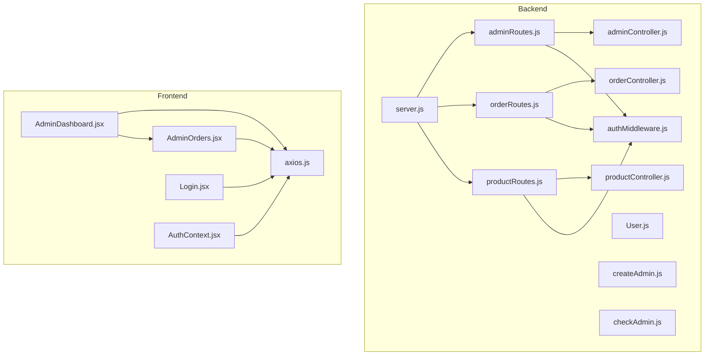
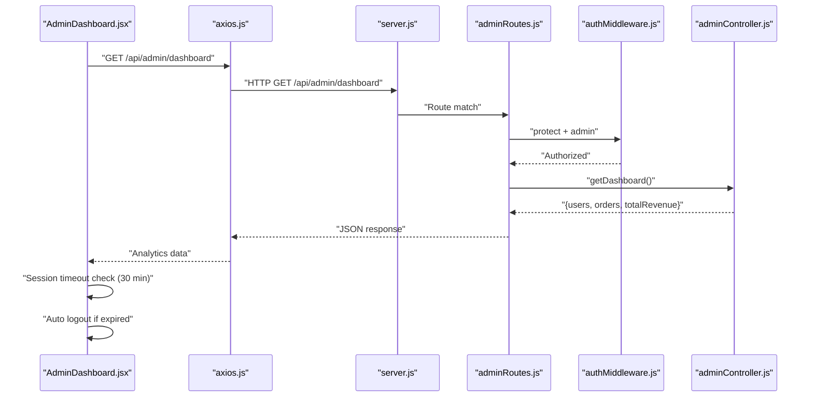
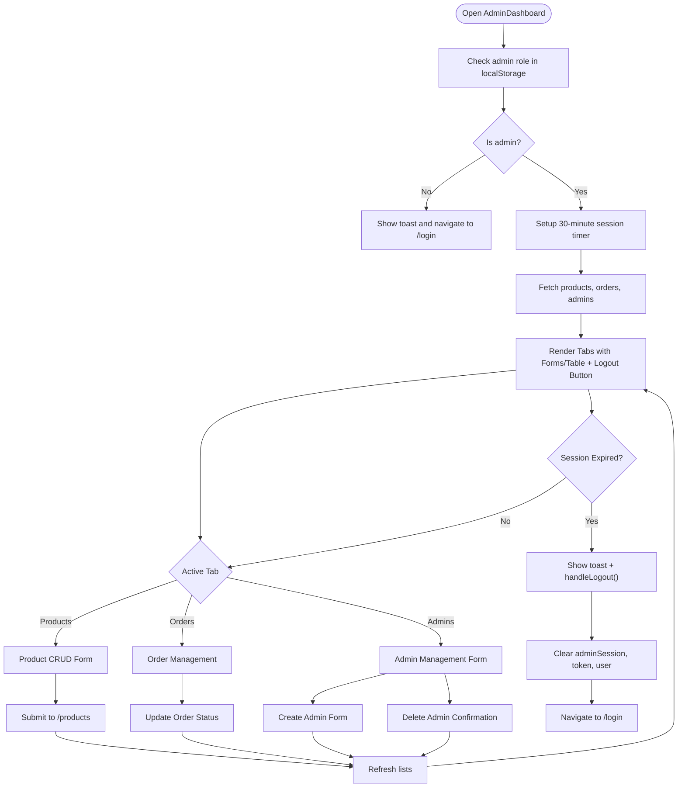
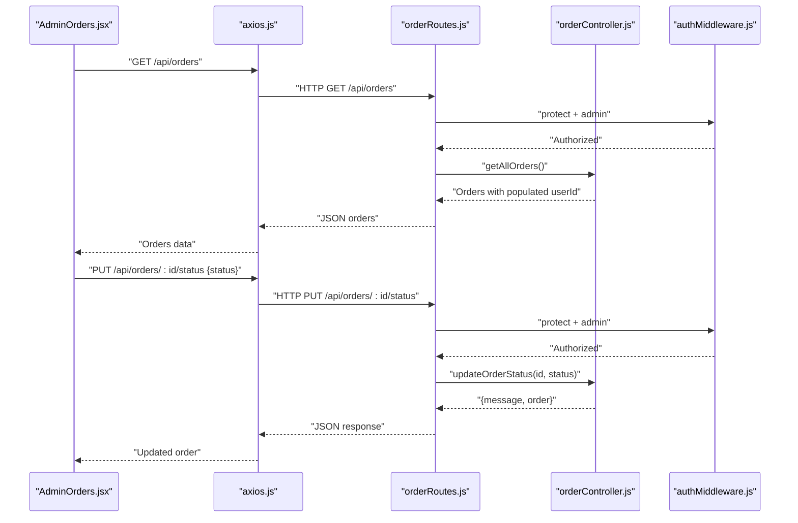
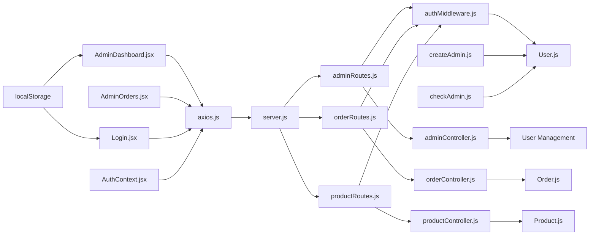

# Admin Dashboard

<cite>
**Referenced Files in This Document**
- [adminController.js](file://backend/controllers/adminController.js)
- [adminRoutes.js](file://backend/routes/adminRoutes.js)
- [authMiddleware.js](file://backend/middleware/authMiddleware.js)
- [User.js](file://backend/models/User.js)
- [Order.js](file://backend/models/Order.js)
- [productController.js](file://backend/controllers/productController.js)
- [orderController.js](file://backend/controllers/orderController.js)
- [productRoutes.js](file://backend/routes/productRoutes.js)
- [orderRoutes.js](file://backend/routes/orderRoutes.js)
- [server.js](file://backend/server.js)
- [AdminDashboard.jsx](file://frontend/src/pages/AdminDashboard.jsx)
- [AdminOrders.jsx](file://frontend/src/components/admin/AdminOrders.jsx)
- [axios.js](file://frontend/src/api/axios.js)
- [api.js](file://frontend/src/services/api.js)
- [uploadMiddleware.js](file://backend/middleware/uploadMiddleware.js)
- [Login.jsx](file://frontend/src/pages/Login.jsx)
- [AuthContext.jsx](file://frontend/src/context/AuthContext.jsx)
- [checkAdmin.js](file://backend/checkAdmin.js)
- [createAdmin.js](file://backend/createAdmin.js)
</cite>

## Update Summary
**Changes Made**
- Enhanced AdminDashboard component with new session timeout functionality (30-minute timeout)
- Added automatic logout button with prominent red styling and icon
- Improved admin user experience through better session management
- Added session validation on component mount and tab changes
- Implemented localStorage-based admin session tracking

## Table of Contents
1. [Introduction](#introduction)
2. [Project Structure](#project-structure)
3. [Core Components](#core-components)
4. [Architecture Overview](#architecture-overview)
5. [Detailed Component Analysis](#detailed-component-analysis)
6. [Dependency Analysis](#dependency-analysis)
7. [Performance Considerations](#performance-considerations)
8. [Troubleshooting Guide](#troubleshooting-guide)
9. [Conclusion](#conclusion)
10. [Appendices](#appendices)

## Introduction
This document explains the E-commerce App's Admin Dashboard functionality. It covers the admin panel architecture, analytics dashboard, order management, product administration, and comprehensive admin user management features. It documents the AdminDashboard component and AdminOrders component, admin-only routes, authentication and authorization controls, controller methods for analytics and administrative operations, practical admin workflows, UI design patterns, reporting capabilities, security considerations, and guidance for extending admin features.

**Updated** Enhanced with comprehensive admin user management interface including form validation, responsive table display, confirmation dialogs, integration with new backend endpoints, and advanced session timeout management with automatic logout functionality.

## Project Structure
The admin functionality spans backend controllers, routes, middleware, and frontend pages/components. The backend exposes admin endpoints under /api/admin including new user management endpoints and admin-only order/product endpoints under /api/orders and /api/products respectively. The frontend admin page integrates product CRUD, order management, admin user management views, and sophisticated session timeout management.

**Diagram sources**
- [server.js:57-63](file://backend/server.js#L57-L63)
- [adminRoutes.js:1-19](file://backend/routes/adminRoutes.js#L1-L19)
- [orderRoutes.js:1-28](file://backend/routes/orderRoutes.js#L1-L28)
- [productRoutes.js:1-23](file://backend/routes/productRoutes.js#L1-L23)
- [authMiddleware.js:1-20](file://backend/middleware/authMiddleware.js#L1-L20)
- [AdminDashboard.jsx:1-428](file://frontend/src/pages/AdminDashboard.jsx#L1-L428)
- [AdminOrders.jsx:1-213](file://frontend/src/components/admin/AdminOrders.jsx#L1-L213)
- [axios.js:1-17](file://frontend/src/api/axios.js#L1-L17)
- [Login.jsx:1-83](file://frontend/src/pages/Login.jsx#L1-L83)
- [AuthContext.jsx:1-33](file://frontend/src/context/AuthContext.jsx#L1-L33)
- [createAdmin.js:1-42](file://backend/createAdmin.js#L1-L42)
- [checkAdmin.js:1-67](file://backend/checkAdmin.js#L1-L67)

**Section sources**
- [server.js:57-63](file://backend/server.js#L57-L63)
- [adminRoutes.js:1-19](file://backend/routes/adminRoutes.js#L1-L19)
- [orderRoutes.js:1-28](file://backend/routes/orderRoutes.js#L1-L28)
- [productRoutes.js:1-23](file://backend/routes/productRoutes.js#L1-L23)

## Core Components
- Admin dashboard analytics: retrieves user count, total orders, and total revenue via aggregation.
- Order management: lists all orders, filters by status, expands order details, and updates order status.
- Product administration: adds, edits, deletes products with image upload limits and validations.
- **Admin user management**: creates, lists, and removes admin users with form validation and confirmation dialogs.
- **Session timeout management**: automatic 30-minute session expiration with toast notifications and automatic logout.
- **Enhanced logout functionality**: prominent red logout button with icon and immediate session cleanup.
- Authentication and authorization: JWT-based protection and admin role enforcement.
- Admin-only routes: protected under /api/admin and enforced by middleware.

Key implementation references:
- Analytics and order listing: [adminController.js:5-19](file://backend/controllers/adminController.js#L5-L19)
- Order status update: [adminController.js:21-24](file://backend/controllers/adminController.js#L21-L24)
- Admin user management endpoints: [adminController.js:26-86](file://backend/controllers/adminController.js#L26-L86)
- Admin route guards: [adminRoutes.js:7-17](file://backend/routes/adminRoutes.js#L7-L17)
- Authorization middleware: [authMiddleware.js:17-20](file://backend/middleware/authMiddleware.js#L17-L20)
- Product CRUD: [productController.js:52-127](file://backend/controllers/productController.js#L52-L127)
- Order listing and status update: [orderController.js:29-81](file://backend/controllers/orderController.js#L29-L81)
- **Session timeout configuration**: [AdminDashboard.jsx:35](file://frontend/src/pages/AdminDashboard.jsx#L35)
- **Automatic logout functionality**: [AdminDashboard.jsx:78-85](file://frontend/src/pages/AdminDashboard.jsx#L78-L85)

**Section sources**
- [adminController.js:5-86](file://backend/controllers/adminController.js#L5-L86)
- [adminRoutes.js:7-17](file://backend/routes/adminRoutes.js#L7-L17)
- [authMiddleware.js:17-20](file://backend/middleware/authMiddleware.js#L17-L20)
- [productController.js:52-127](file://backend/controllers/productController.js#L52-L127)
- [orderController.js:29-81](file://backend/controllers/orderController.js#L29-L81)
- [AdminDashboard.jsx:35](file://frontend/src/pages/AdminDashboard.jsx#L35)
- [AdminDashboard.jsx:78-85](file://frontend/src/pages/AdminDashboard.jsx#L78-L85)

## Architecture Overview
The admin architecture enforces layered responsibilities with enhanced user management capabilities and sophisticated session timeout management:
- Frontend: AdminDashboard renders tabs for products, orders, and admins; AdminOrders displays order list and actions; Session timeout management with automatic logout.
- Backend: Routes define endpoints including new admin user management; middleware enforces auth and admin roles; controllers implement analytics, admin operations, and user management.
- Data: MongoDB models for User, Order, and Product support analytics, CRUD operations, and user management.

**Diagram sources**
- [AdminDashboard.jsx:27-32](file://frontend/src/pages/AdminDashboard.jsx#L27-L32)
- [AdminDashboard.jsx:35](file://frontend/src/pages/AdminDashboard.jsx#L35)
- [AdminDashboard.jsx:66-75](file://frontend/src/pages/AdminDashboard.jsx#L66-L75)
- [axios.js:1-17](file://frontend/src/api/axios.js#L1-L17)
- [server.js:57-63](file://backend/server.js#L57-L63)
- [adminRoutes.js:10](file://backend/routes/adminRoutes.js#L10)
- [authMiddleware.js:4-15](file://backend/middleware/authMiddleware.js#L4-L15)
- [adminController.js:5-14](file://backend/controllers/adminController.js#L5-L14)

## Detailed Component Analysis

### AdminDashboard Component
**Updated** Enhanced with comprehensive admin user management interface, session timeout functionality, and prominent logout button.

Responsibilities:
- Tabbed interface: Products, Orders, and Admins.
- Product CRUD: form handling, image selection with preview, upload constraints, submit to backend.
- Admin user management: create admin forms with validation, list admins in responsive table, delete admin with confirmation.
- **Session timeout management**: automatic 30-minute session expiration detection and automatic logout.
- **Enhanced logout functionality**: prominent red logout button with icon and immediate session cleanup.
- Data fetching: loads products list, orders, and admins after changes.
- Navigation guard: checks admin role and redirects unauthenticated users.

Key behaviors:
- Admin role check and redirect: [AdminDashboard.jsx:55-76](file://frontend/src/pages/AdminDashboard.jsx#L55-L76)
- **Session timeout configuration**: [AdminDashboard.jsx:35](file://frontend/src/pages/AdminDashboard.jsx#L35)
- **Session timer setup**: [AdminDashboard.jsx:45-53](file://frontend/src/pages/AdminDashboard.jsx#L45-L53)
- **Session validation**: [AdminDashboard.jsx:66-75](file://frontend/src/pages/AdminDashboard.jsx#L66-L75)
- **Automatic logout**: [AdminDashboard.jsx:78-85](file://frontend/src/pages/AdminDashboard.jsx#L78-L85)
- **Prominent logout button**: [AdminDashboard.jsx:242-250](file://frontend/src/pages/AdminDashboard.jsx#L242-L250)
- Product management functions: [AdminDashboard.jsx:142-188](file://frontend/src/pages/AdminDashboard.jsx#L142-L188)
- Image handling and preview: [AdminDashboard.jsx:98-112](file://frontend/src/pages/AdminDashboard.jsx#L98-L112)
- Submit product (create/update): [AdminDashboard.jsx:114-140](file://frontend/src/pages/AdminDashboard.jsx#L114-L140)
- Edit/delete lifecycle: [AdminDashboard.jsx:142-173](file://frontend/src/pages/AdminDashboard.jsx#L142-L173)
- Rendering product table and form: [AdminDashboard.jsx:254-361](file://frontend/src/pages/AdminDashboard.jsx#L254-L361)
- Admin management UI: [AdminDashboard.jsx:364-424](file://frontend/src/pages/AdminDashboard.jsx#L364-L424)

**Diagram sources**
- [AdminDashboard.jsx:55-76](file://frontend/src/pages/AdminDashboard.jsx#L55-L76)
- [AdminDashboard.jsx:35](file://frontend/src/pages/AdminDashboard.jsx#L35)
- [AdminDashboard.jsx:45-53](file://frontend/src/pages/AdminDashboard.jsx#L45-L53)
- [AdminDashboard.jsx:78-85](file://frontend/src/pages/AdminDashboard.jsx#L78-L85)
- [AdminDashboard.jsx:242-250](file://frontend/src/pages/AdminDashboard.jsx#L242-L250)

**Section sources**
- [AdminDashboard.jsx:55-76](file://frontend/src/pages/AdminDashboard.jsx#L55-L76)
- [AdminDashboard.jsx:35](file://frontend/src/pages/AdminDashboard.jsx#L35)
- [AdminDashboard.jsx:45-53](file://frontend/src/pages/AdminDashboard.jsx#L45-L53)
- [AdminDashboard.jsx:78-85](file://frontend/src/pages/AdminDashboard.jsx#L78-L85)
- [AdminDashboard.jsx:242-250](file://frontend/src/pages/AdminDashboard.jsx#L242-L250)
- [AdminDashboard.jsx:142-188](file://frontend/src/pages/AdminDashboard.jsx#L142-L188)
- [AdminDashboard.jsx:254-424](file://frontend/src/pages/AdminDashboard.jsx#L254-L424)

### AdminOrders Component
Responsibilities:
- Fetch all orders and populate customer info.
- Filter orders by status.
- Expandable rows to show shipping address, items, pricing breakdown.
- Update order status with immediate feedback.

Key behaviors:
- Fetch orders: [AdminOrders.jsx:15-24](file://frontend/src/components/admin/AdminOrders.jsx#L15-L24)
- Filter orders: [AdminOrders.jsx:36](file://frontend/src/components/admin/AdminOrders.jsx#L36)
- Update status: [AdminOrders.jsx:26-34](file://frontend/src/components/admin/AdminOrders.jsx#L26-L34)
- Status badges and formatting: [AdminOrders.jsx:38-59](file://frontend/src/components/admin/AdminOrders.jsx#L38-L59)
- Expanded order details rendering: [AdminOrders.jsx:105-201](file://frontend/src/components/admin/AdminOrders.jsx#L105-L201)

**Diagram sources**
- [AdminOrders.jsx:15-34](file://frontend/src/components/admin/AdminOrders.jsx#L15-L34)
- [orderRoutes.js:25-26](file://backend/routes/orderRoutes.js#L25-L26)
- [orderController.js:29-81](file://backend/controllers/orderController.js#L29-L81)
- [authMiddleware.js:4-15](file://backend/middleware/authMiddleware.js#L4-L15)

**Section sources**
- [AdminOrders.jsx:15-34](file://frontend/src/components/admin/AdminOrders.jsx#L15-L34)
- [orderRoutes.js:25-26](file://backend/routes/orderRoutes.js#L25-L26)
- [orderController.js:29-81](file://backend/controllers/orderController.js#L29-L81)

### Admin Controller Methods
**Updated** Added comprehensive admin user management methods.

- getDashboard: counts users, total orders, computes total revenue via aggregation.
- getOrders: returns all orders with customer info.
- updateOrderStatus: updates order status by ID.
- **getAllUsers**: returns all users without passwords for admin management.
- **createAdminUser**: creates new admin user with validation and role assignment.
- **deleteAdminUser**: deletes admin user with validation and self-deletion prevention.

References:
- [adminController.js:5-86](file://backend/controllers/adminController.js#L5-L86)

**Section sources**
- [adminController.js:5-86](file://backend/controllers/adminController.js#L5-L86)

### Admin Routes and Authorization
**Updated** Added new admin user management endpoints.

- Admin routes are mounted under /api/admin and protected by protect and admin middleware.
- Order and product admin endpoints are mounted under /api/orders and /api/products respectively and protected similarly.
- **New admin user management endpoints**: GET /api/admin/users, POST /api/admin/users, DELETE /api/admin/users/:id.

References:
- [adminRoutes.js:7-17](file://backend/routes/adminRoutes.js#L7-L17)
- [orderRoutes.js:24-26](file://backend/routes/orderRoutes.js#L24-L26)
- [productRoutes.js:18-21](file://backend/routes/productRoutes.js#L18-L21)
- [authMiddleware.js:4-20](file://backend/middleware/authMiddleware.js#L4-L20)

**Section sources**
- [adminRoutes.js:7-17](file://backend/routes/adminRoutes.js#L7-L17)
- [orderRoutes.js:24-26](file://backend/routes/orderRoutes.js#L24-L26)
- [productRoutes.js:18-21](file://backend/routes/productRoutes.js#L18-L21)
- [authMiddleware.js:4-20](file://backend/middleware/authMiddleware.js#L4-L20)

### Data Models Supporting Admin
- User model defines role field with enums for user and admin.
- Order model includes orderStatus, paymentStatus, and related metadata.
- Product model supports images, category, and stock.

References:
- [User.js:4-9](file://backend/models/User.js#L4-L9)
- [Order.js:3-31](file://backend/models/Order.js#L3-L31)
- [productController.js:52-127](file://backend/controllers/productController.js#L52-L127)

**Section sources**
- [User.js:4-9](file://backend/models/User.js#L4-L9)
- [Order.js:3-31](file://backend/models/Order.js#L3-L31)
- [productController.js:52-127](file://backend/controllers/productController.js#L52-L127)

### Frontend API Integration
**Updated** Enhanced with admin user management API integration and session timeout management.

- Axios client attaches Authorization header from localStorage token.
- Interceptor handles 401 responses by removing token.
- **Admin user management API calls**: GET /api/admin/users, POST /api/admin/users, DELETE /api/admin/users/:id.
- **Session timeout management**: automatic 30-minute session expiration detection and cleanup.

References:
- [axios.js:4-16](file://frontend/src/api/axios.js#L4-L16)
- [api.js:3-7](file://frontend/src/services/api.js#L3-L7)
- [AdminDashboard.jsx:142-183](file://frontend/src/pages/AdminDashboard.jsx#L142-L183)
- [AdminDashboard.jsx:35](file://frontend/src/pages/AdminDashboard.jsx#L35)

**Section sources**
- [axios.js:4-16](file://frontend/src/api/axios.js#L4-L16)
- [api.js:3-7](file://frontend/src/services/api.js#L3-L7)
- [AdminDashboard.jsx:142-183](file://frontend/src/pages/AdminDashboard.jsx#L142-L183)
- [AdminDashboard.jsx:35](file://frontend/src/pages/AdminDashboard.jsx#L35)

### Login Page Enhancements
**Updated** Removed hardcoded admin credentials and improved user experience with session timeout integration.

- Login form with email/password validation and password visibility toggle.
- Success/error handling with alerts and console logging.
- Automatic token and user storage in localStorage upon successful login.
- **Admin session timestamp storage**: automatically sets adminSession for admin users.
- Integration with AuthContext for centralized authentication state management.

References:
- [Login.jsx:1-83](file://frontend/src/pages/Login.jsx#L1-L83)
- [AuthContext.jsx:16-22](file://frontend/src/context/AuthContext.jsx#L16-L22)

**Section sources**
- [Login.jsx:1-83](file://frontend/src/pages/Login.jsx#L1-L83)
- [AuthContext.jsx:16-22](file://frontend/src/context/AuthContext.jsx#L16-L22)

## Dependency Analysis
**Updated** Enhanced with admin user management dependencies and session timeout management.

Admin endpoints depend on middleware for authentication and authorization, and on controllers for data operations. The frontend depends on the backend API and applies client-side admin checks. New admin user management introduces additional dependencies. Session timeout management adds localStorage-based session tracking.

**Diagram sources**
- [AdminDashboard.jsx:1-428](file://frontend/src/pages/AdminDashboard.jsx#L1-L428)
- [AdminOrders.jsx:1-213](file://frontend/src/components/admin/AdminOrders.jsx#L1-L213)
- [axios.js:1-17](file://frontend/src/api/axios.js#L1-L17)
- [server.js:57-63](file://backend/server.js#L57-L63)
- [adminRoutes.js:1-19](file://backend/routes/adminRoutes.js#L1-L19)
- [orderRoutes.js:1-28](file://backend/routes/orderRoutes.js#L1-L28)
- [productRoutes.js:1-23](file://backend/routes/productRoutes.js#L1-L23)
- [authMiddleware.js:1-20](file://backend/middleware/authMiddleware.js#L1-L20)
- [adminController.js:1-86](file://backend/controllers/adminController.js#L1-L86)
- [orderController.js:1-146](file://backend/controllers/orderController.js#L1-L146)
- [productController.js:1-127](file://backend/controllers/productController.js#L1-L127)
- [User.js:1-20](file://backend/models/User.js#L1-L20)
- [Order.js:1-33](file://backend/models/Order.js#L1-L33)
- [productController.js:52-127](file://backend/controllers/productController.js#L52-L127)
- [Login.jsx:1-83](file://frontend/src/pages/Login.jsx#L1-L83)
- [AuthContext.jsx:1-33](file://frontend/src/context/AuthContext.jsx#L1-L33)
- [createAdmin.js:1-42](file://backend/createAdmin.js#L1-L42)
- [checkAdmin.js:1-67](file://backend/checkAdmin.js#L1-L67)

**Section sources**
- [server.js:57-63](file://backend/server.js#L57-L63)
- [adminRoutes.js:1-19](file://backend/routes/adminRoutes.js#L1-L19)
- [orderRoutes.js:1-28](file://backend/routes/orderRoutes.js#L1-L28)
- [productRoutes.js:1-23](file://backend/routes/productRoutes.js#L1-L23)
- [authMiddleware.js:1-20](file://backend/middleware/authMiddleware.js#L1-L20)
- [adminController.js:1-86](file://backend/controllers/adminController.js#L1-L86)
- [orderController.js:1-146](file://backend/controllers/orderController.js#L1-L146)
- [productController.js:1-127](file://backend/controllers/productController.js#L1-L127)
- [User.js:1-20](file://backend/models/User.js#L1-L20)
- [Order.js:1-33](file://backend/models/Order.js#L1-L33)

## Performance Considerations
**Updated** Added performance considerations for admin user management and session timeout functionality.

- Aggregation queries: The analytics endpoint uses aggregation to compute total revenue efficiently.
- Pagination: Product listing supports pagination to avoid large payloads.
- Image constraints: Upload middleware limits file size and number of images per product.
- Client-side filtering: Order filtering is client-side; for very large datasets, consider server-side filtering.
- **Admin user listing**: Filtering by role on frontend to minimize API calls.
- **Confirmation dialogs**: Prevent accidental deletions and reduce unnecessary API calls.
- **Session timeout optimization**: 30-minute timeout reduces server load while maintaining security.
- **LocalStorage usage**: Session tracking uses localStorage to avoid frequent server requests.
- **Timer cleanup**: Proper cleanup of session timers prevents memory leaks.

Recommendations:
- Add server-side filtering and sorting for orders.
- Paginate order listings.
- Cache analytics data periodically to reduce DB load.
- **Implement server-side filtering for admin users** to improve performance with large user bases.
- **Consider configurable timeout intervals** for different admin roles.
- **Implement heartbeat mechanism** to extend sessions during active admin work.

**Section sources**
- [adminController.js:8-12](file://backend/controllers/adminController.js#L8-L12)
- [productController.js:6-37](file://backend/controllers/productController.js#L6-L37)
- [uploadMiddleware.js:14-28](file://backend/middleware/uploadMiddleware.js#L14-L28)
- [AdminDashboard.jsx:35](file://frontend/src/pages/AdminDashboard.jsx#L35)
- [AdminDashboard.jsx:45-53](file://frontend/src/pages/AdminDashboard.jsx#L45-L53)

## Troubleshooting Guide
**Updated** Added troubleshooting for admin user management features and session timeout functionality.

Common issues and resolutions:
- Access denied errors: Ensure the user role is admin and token is present.
  - References: [authMiddleware.js:17-20](file://backend/middleware/authMiddleware.js#L17-L20)
- Invalid token: Verify JWT_SECRET and token presence.
  - References: [authMiddleware.js:4-15](file://backend/middleware/authMiddleware.js#L4-L15)
- 401 responses in frontend: Axios interceptor removes token on 401.
  - References: [axios.js:10-16](file://frontend/src/api/axios.js#L10-L16)
- Order status update failures: Validate status enum and order existence.
  - References: [orderController.js:69-81](file://backend/controllers/orderController.js#L69-L81)
- Product upload errors: Respect image limits and allowed types.
  - References: [uploadMiddleware.js:14-28](file://backend/middleware/uploadMiddleware.js#L14-L28)
- **Admin creation failures**: Validate unique email constraint and password requirements.
  - References: [adminController.js:37-61](file://backend/controllers/adminController.js#L37-L61)
- **Admin deletion failures**: Check self-deletion prevention and admin role validation.
  - References: [adminController.js:64-86](file://backend/controllers/adminController.js#L64-L86)
- **Session timeout issues**: Verify adminSession timestamp and localStorage availability.
  - References: [AdminDashboard.jsx:66-75](file://frontend/src/pages/AdminDashboard.jsx#L66-L75)
- **Logout button not working**: Check for proper event handlers and CSS classes.
  - References: [AdminDashboard.jsx:242-250](file://frontend/src/pages/AdminDashboard.jsx#L242-L250)
- **Automatic logout timing**: Ensure SESSION_TIMEOUT constant is properly configured.
  - References: [AdminDashboard.jsx:35](file://frontend/src/pages/AdminDashboard.jsx#L35)

**Section sources**
- [authMiddleware.js:4-20](file://backend/middleware/authMiddleware.js#L4-L20)
- [axios.js:10-16](file://frontend/src/api/axios.js#L10-L16)
- [orderController.js:69-81](file://backend/controllers/orderController.js#L69-L81)
- [uploadMiddleware.js:14-28](file://backend/middleware/uploadMiddleware.js#L14-L28)
- [adminController.js:37-86](file://backend/controllers/adminController.js#L37-L86)
- [AdminDashboard.jsx:35](file://frontend/src/pages/AdminDashboard.jsx#L35)
- [AdminDashboard.jsx:66-75](file://frontend/src/pages/AdminDashboard.jsx#L66-L75)
- [AdminDashboard.jsx:242-250](file://frontend/src/pages/AdminDashboard.jsx#L242-L250)

## Conclusion
The Admin Dashboard integrates frontend components with backend admin endpoints secured by JWT and role-based access control. It provides analytics, order management, product administration, and comprehensive admin user management with clear workflows and responsive UI patterns. The enhanced architecture now includes sophisticated session timeout management with automatic logout functionality, prominent logout buttons, and improved admin user experience. The architecture supports scalability through pagination, aggregation, and client-side caching strategies, along with efficient session management through localStorage-based tracking.

## Appendices

### Admin Workflows

**Updated** Added admin user management workflows and session timeout management.

- Order status update
  - Steps: Open AdminOrders, select status button, confirm update, observe badge change.
  - References: [AdminOrders.jsx:174-191](file://frontend/src/components/admin/AdminOrders.jsx#L174-L191), [orderController.js:69-81](file://backend/controllers/orderController.js#L69-L81)

- Product CRUD
  - Add product: Fill form, attach up to 3 images, submit to POST /api/products.
    - References: [AdminDashboard.jsx:254-321](file://frontend/src/pages/AdminDashboard.jsx#L254-L321), [productController.js:52-73](file://backend/controllers/productController.js#L52-L73)
  - Edit product: Populate form from selected product, submit PUT /api/products/:id.
    - References: [AdminDashboard.jsx:142-154](file://frontend/src/pages/AdminDashboard.jsx#L142-L154), [productController.js:75-113](file://backend/controllers/productController.js#L75-L113)
  - Delete product: Confirm deletion, call DELETE /api/products/:id.
    - References: [AdminDashboard.jsx:156-165](file://frontend/src/pages/AdminDashboard.jsx#L156-L165), [productController.js:115-127](file://backend/controllers/productController.js#L115-L127)

- Analytics dashboard
  - Retrieve counts and revenue via GET /api/admin/dashboard.
  - References: [adminController.js:5-14](file://backend/controllers/adminController.js#L5-L14), [AdminDashboard.jsx:27-32](file://frontend/src/pages/AdminDashboard.jsx#L27-L32)

- **Admin user management**
  - **Create admin**: Fill form with name, email, password (min 6 chars), submit to POST /api/admin/users.
    - References: [AdminDashboard.jsx:364-397](file://frontend/src/pages/AdminDashboard.jsx#L364-L397), [adminController.js:37-61](file://backend/controllers/adminController.js#L37-L61)
  - **List admins**: Fetch all users and filter by role=admin, display in responsive table.
    - References: [AdminDashboard.jsx:176-185](file://frontend/src/pages/AdminDashboard.jsx#L176-L185), [adminController.js:27-34](file://backend/controllers/adminController.js#L27-L34)
  - **Delete admin**: Confirm deletion, prevent self-deletion, call DELETE /api/admin/users/:id.
    - References: [AdminDashboard.jsx:203-217](file://frontend/src/pages/AdminDashboard.jsx#L203-L217), [adminController.js:64-86](file://backend/controllers/adminController.js#L64-L86)

- **Session timeout management**
  - **Automatic logout**: 30-minute inactivity triggers automatic logout with toast notification.
    - References: [AdminDashboard.jsx:35](file://frontend/src/pages/AdminDashboard.jsx#L35), [AdminDashboard.jsx:45-53](file://frontend/src/pages/AdminDashboard.jsx#L45-L53)
  - **Session validation**: On component mount and tab changes, validates adminSession timestamp.
    - References: [AdminDashboard.jsx:55-76](file://frontend/src/pages/AdminDashboard.jsx#L55-L76)
  - **Manual logout**: Prominent red logout button with icon and immediate session cleanup.
    - References: [AdminDashboard.jsx:242-250](file://frontend/src/pages/AdminDashboard.jsx#L242-L250), [AdminDashboard.jsx:78-85](file://frontend/src/pages/AdminDashboard.jsx#L78-L85)

### Security and Audit Considerations
**Updated** Enhanced security considerations for admin user management and session timeout functionality.

- Role enforcement: Admin-only routes require role=admin.
  - References: [authMiddleware.js:17-20](file://backend/middleware/authMiddleware.js#L17-L20), [adminRoutes.js:7-8](file://backend/routes/adminRoutes.js#L7-L8)
- Token-based auth: protect middleware validates JWT.
  - References: [authMiddleware.js:4-15](file://backend/middleware/authMiddleware.js#L4-L15)
- Request logging: Add server middleware to log admin actions for audit trails.
- Rate limiting: Implement rate limits on admin endpoints to prevent abuse.
- **Admin user validation**: Email uniqueness constraint prevents duplicate admin accounts.
- **Self-admin protection**: Prevents deletion of currently logged-in admin user.
- **Client-side validation**: Form validation prevents invalid admin creation attempts.
- **Session timeout security**: 30-minute automatic logout prevents unauthorized access during inactivity.
- **Session persistence**: localStorage-based session tracking ensures consistent timeout across browser sessions.
- **Logout button security**: Immediate session cleanup prevents session hijacking.

**Section sources**
- [authMiddleware.js:4-20](file://backend/middleware/authMiddleware.js#L4-L20)
- [adminRoutes.js:7-8](file://backend/routes/adminRoutes.js#L7-L8)
- [adminController.js:37-86](file://backend/controllers/adminController.js#L37-L86)
- [AdminDashboard.jsx:35](file://frontend/src/pages/AdminDashboard.jsx#L35)
- [AdminDashboard.jsx:78-85](file://frontend/src/pages/AdminDashboard.jsx#L78-L85)
- [AdminDashboard.jsx:242-250](file://frontend/src/pages/AdminDashboard.jsx#L242-L250)

### Extending Admin Functionality
**Updated** Added extension possibilities for admin user management and session timeout functionality.

- Add new analytics metrics: Extend adminController.getDashboard with additional aggregations.
  - References: [adminController.js:5-14](file://backend/controllers/adminController.js#L5-L14)
- New admin endpoints: Define routes under /api/admin and apply protect + admin middleware.
  - References: [adminRoutes.js:7-17](file://backend/routes/adminRoutes.js#L7-L17)
- Product enhancements: Add categories, variants, inventory tracking.
  - References: [productController.js:52-127](file://backend/controllers/productController.js#L52-L127)
- Order enhancements: Add export, bulk actions, shipment tracking.
  - References: [orderController.js:29-81](file://backend/controllers/orderController.js#L29-L81)
- **Admin user enhancements**: Add user roles, permissions, activity logs, password policies.
  - References: [adminController.js:26-86](file://backend/controllers/adminController.js#L26-L86)
- **Enhanced validation**: Implement stronger password requirements, email verification, two-factor authentication.
  - References: [adminController.js:37-61](file://backend/controllers/adminController.js#L37-L61)
- **Session timeout customization**: Implement configurable timeout intervals based on admin role or preference.
  - References: [AdminDashboard.jsx:35](file://frontend/src/pages/AdminDashboard.jsx#L35)
- **Advanced session management**: Add heartbeat mechanism to extend sessions during active work.
  - References: [AdminDashboard.jsx:45-53](file://frontend/src/pages/AdminDashboard.jsx#L45-L53)
- **Enhanced logout UX**: Add confirmation dialog for logout button and session timeout notifications.
  - References: [AdminDashboard.jsx:242-250](file://frontend/src/pages/AdminDashboard.jsx#L242-L250)