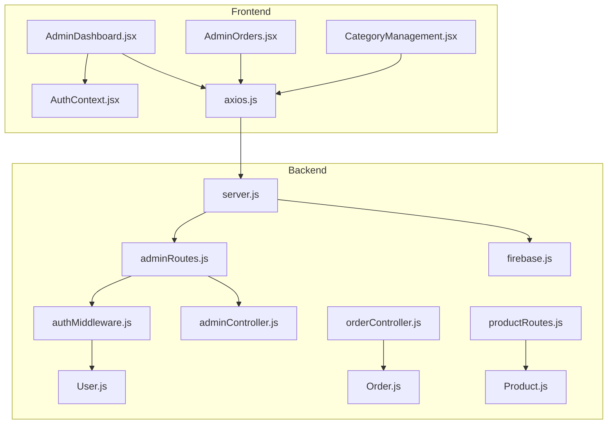
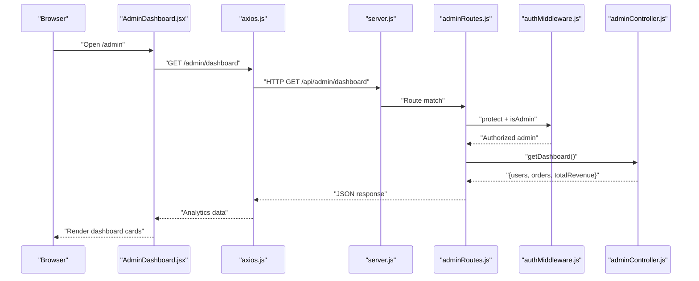
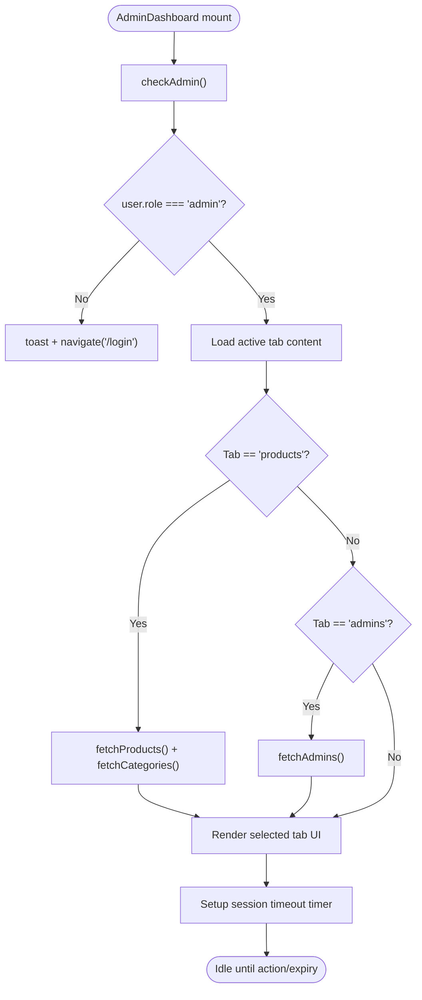
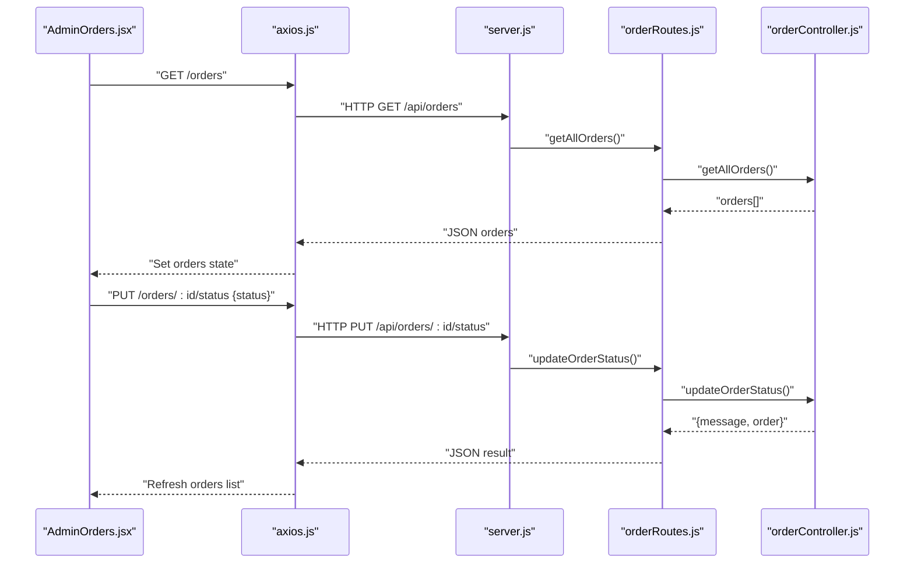
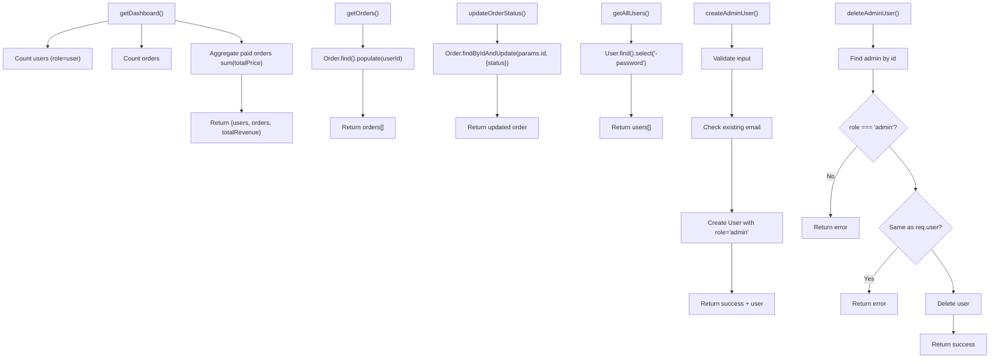
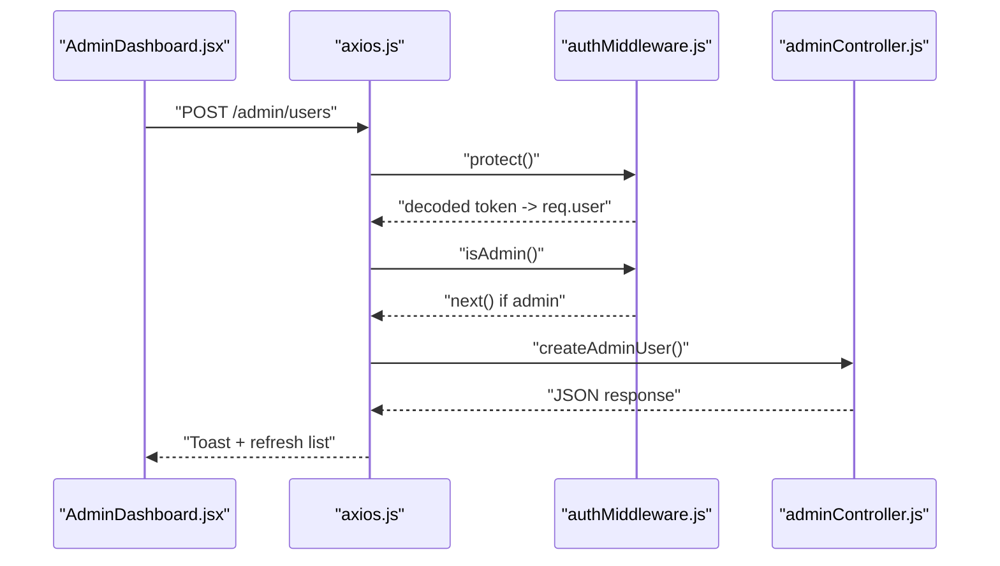
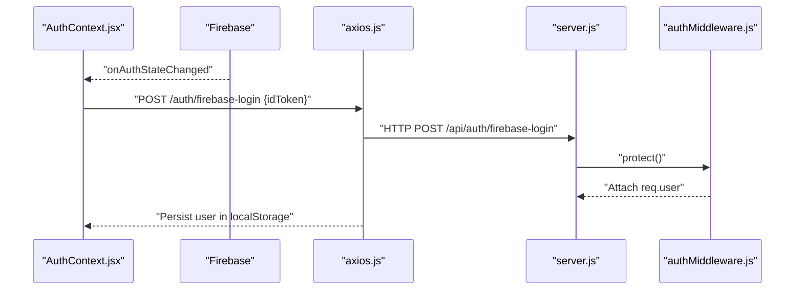
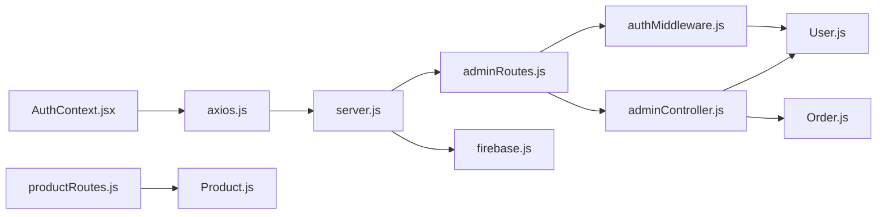

# Admin Dashboard

<cite>
**Referenced Files in This Document**
- [adminController.js](file://backend/controllers/adminController.js)
- [adminRoutes.js](file://backend/routes/adminRoutes.js)
- [authMiddleware.js](file://backend/middleware/authMiddleware.js)
- [User.js](file://backend/models/User.js)
- [Order.js](file://backend/models/Order.js)
- [Product.js](file://backend/models/Product.js)
- [AdminDashboard.jsx](file://frontend/src/pages/AdminDashboard.jsx)
- [AdminOrders.jsx](file://frontend/src/components/admin/AdminOrders.jsx)
- [CategoryManagement.jsx](file://frontend/src/components/admin/CategoryManagement.jsx)
- [AuthContext.jsx](file://frontend/src/context/AuthContext.jsx)
- [axios.js](file://frontend/src/api/axios.js)
- [server.js](file://backend/server.js)
- [orderController.js](file://backend/controllers/orderController.js)
- [productRoutes.js](file://backend/routes/productRoutes.js)
- [firebase.js](file://backend/config/firebase.js)
</cite>

## Table of Contents
1. [Introduction](#introduction)
2. [Project Structure](#project-structure)
3. [Core Components](#core-components)
4. [Architecture Overview](#architecture-overview)
5. [Detailed Component Analysis](#detailed-component-analysis)
6. [Dependency Analysis](#dependency-analysis)
7. [Performance Considerations](#performance-considerations)
8. [Troubleshooting Guide](#troubleshooting-guide)
9. [Conclusion](#conclusion)
10. [Appendices](#appendices)

## Introduction
This document explains the Admin Dashboard functionality for the e-commerce application. It covers the admin panel architecture, analytics dashboard, order management, product administration, user management, admin-only routes, authentication and authorization controls, controller methods for data retrieval and administrative operations, practical admin workflows, UI design patterns, data visualization/reporting, security considerations, and guidance for extending and customizing the admin features.

## Project Structure
The admin functionality spans both frontend and backend:
- Backend exposes admin routes under /api/admin and enforces middleware protection and admin roles.
- Frontend renders the AdminDashboard page with tabs for Products, Categories, Orders, and Admins, and integrates with backend APIs.

**Diagram sources**
- [server.js:72-81](file://backend/server.js#L72-L81)
- [adminRoutes.js:1-19](file://backend/routes/adminRoutes.js#L1-L19)
- [authMiddleware.js:1-33](file://backend/middleware/authMiddleware.js#L1-L33)
- [adminController.js:1-86](file://backend/controllers/adminController.js#L1-L86)
- [orderController.js:32-40](file://backend/controllers/orderController.js#L32-L40)
- [productRoutes.js:18-21](file://backend/routes/productRoutes.js#L18-L21)
- [User.js:1-30](file://backend/models/User.js#L1-L30)
- [Order.js:1-33](file://backend/models/Order.js#L1-L33)
- [Product.js:1-12](file://backend/models/Product.js#L1-L12)
- [AuthContext.jsx:1-86](file://frontend/src/context/AuthContext.jsx#L1-L86)
- [axios.js:1-29](file://frontend/src/api/axios.js#L1-L29)

**Section sources**
- [server.js:72-81](file://backend/server.js#L72-L81)
- [adminRoutes.js:1-19](file://backend/routes/adminRoutes.js#L1-L19)
- [adminController.js:1-86](file://backend/controllers/adminController.js#L1-L86)
- [AuthContext.jsx:1-86](file://frontend/src/context/AuthContext.jsx#L1-L86)
- [axios.js:1-29](file://frontend/src/api/axios.js#L1-L29)

## Core Components
- AdminDashboard (frontend): Orchestrates admin tabs, manages product CRUD, category management, order view, and admin user management. Implements session timeout and admin role checks.
- AdminOrders (frontend): Fetches orders, filters by status, expands order details, and updates order status.
- Admin controller (backend): Provides analytics dashboard metrics, retrieves orders, updates order status, and manages admin users.
- Admin routes (backend): Mounts admin endpoints and applies protect + isAdmin middleware.
- Authentication middleware (backend): Verifies Firebase ID tokens and enforces admin role.
- Models: User, Order, Product define admin-relevant data structures and enums.

Key responsibilities:
- Analytics: Users count, total orders, and revenue aggregation.
- Orders: Listing, populating customer info, updating status.
- Users: Listing users (excluding passwords), creating/deleting admin users with safety checks.
- Products: Admin-only product creation, updates, and deletions via protected routes.

**Section sources**
- [AdminDashboard.jsx:10-457](file://frontend/src/pages/AdminDashboard.jsx#L10-L457)
- [AdminOrders.jsx:1-213](file://frontend/src/components/admin/AdminOrders.jsx#L1-L213)
- [adminController.js:5-86](file://backend/controllers/adminController.js#L5-L86)
- [adminRoutes.js:7-18](file://backend/routes/adminRoutes.js#L7-L18)
- [authMiddleware.js:4-32](file://backend/middleware/authMiddleware.js#L4-L32)
- [User.js:22](file://backend/models/User.js#L22)
- [Order.js:24-30](file://backend/models/Order.js#L24-L30)
- [Product.js:3-9](file://backend/models/Product.js#L3-L9)

## Architecture Overview
The admin architecture follows a layered pattern:
- Frontend pages/components consume Axios interceptors to attach Firebase ID tokens and route to backend endpoints.
- Backend routes apply middleware to enforce authentication and admin authorization.
- Controllers encapsulate business logic for analytics, orders, and admin user management.
- Models define data schemas and enums for consistent validation.

**Diagram sources**
- [AdminDashboard.jsx:82-91](file://frontend/src/pages/AdminDashboard.jsx#L82-L91)
- [axios.js:8-16](file://frontend/src/api/axios.js#L8-L16)
- [server.js:72-81](file://backend/server.js#L72-L81)
- [adminRoutes.js:10](file://backend/routes/adminRoutes.js#L10)
- [authMiddleware.js:4-32](file://backend/middleware/authMiddleware.js#L4-L32)
- [adminController.js:5-14](file://backend/controllers/adminController.js#L5-L14)

## Detailed Component Analysis

### AdminDashboard Component
Responsibilities:
- Tabbed navigation among Products, Categories, Orders, Admins.
- Product CRUD: form handling, image uploads (limit 3), submit to backend, refresh lists.
- Category management: delegates to CategoryManagement component.
- Admin user management: create/delete admin users with validation and UX feedback.
- Session timeout: auto-logout after inactivity.
- Admin-only guard: redirects non-admins to login.

**Diagram sources**
- [AdminDashboard.jsx:41-69](file://frontend/src/pages/AdminDashboard.jsx#L41-L69)
- [AdminDashboard.jsx:82-100](file://frontend/src/pages/AdminDashboard.jsx#L82-L100)
- [AdminDashboard.jsx:180-189](file://frontend/src/pages/AdminDashboard.jsx#L180-L189)

**Section sources**
- [AdminDashboard.jsx:10-457](file://frontend/src/pages/AdminDashboard.jsx#L10-L457)

### AdminOrders Component
Responsibilities:
- Fetch orders and render a sortable, filterable table.
- Expandable rows to show shipping address, items, pricing breakdown.
- Update order status with immediate UI feedback and reload.
- Status badges with color-coded semantics.

**Diagram sources**
- [AdminOrders.jsx:15-34](file://frontend/src/components/admin/AdminOrders.jsx#L15-L34)
- [orderController.js:32-40](file://backend/controllers/orderController.js#L32-L40)
- [orderController.js:72-84](file://backend/controllers/orderController.js#L72-L84)

**Section sources**
- [AdminOrders.jsx:1-213](file://frontend/src/components/admin/AdminOrders.jsx#L1-L213)
- [orderController.js:32-40](file://backend/controllers/orderController.js#L32-L40)
- [orderController.js:72-84](file://backend/controllers/orderController.js#L72-L84)

### Admin Controller Methods
- Analytics dashboard: counts users, counts orders, aggregates paid revenue via aggregation pipeline.
- Orders listing: finds all orders and populates user info.
- Update order status: updates a single order’s status.
- Admin user management:
  - List users excluding passwords.
  - Create admin user with duplicate-email prevention and role assignment.
  - Delete admin user with role check and self-deletion prevention.

**Diagram sources**
- [adminController.js:5-14](file://backend/controllers/adminController.js#L5-L14)
- [adminController.js:16-19](file://backend/controllers/adminController.js#L16-L19)
- [adminController.js:21-24](file://backend/controllers/adminController.js#L21-L24)
- [adminController.js:26-34](file://backend/controllers/adminController.js#L26-L34)
- [adminController.js:36-62](file://backend/controllers/adminController.js#L36-L62)
- [adminController.js:64-86](file://backend/controllers/adminController.js#L64-L86)

**Section sources**
- [adminController.js:5-86](file://backend/controllers/adminController.js#L5-L86)

### Admin Routes and Authorization
- All admin routes are mounted under /api/admin and protected by:
  - protect: verifies Firebase ID token and attaches user record.
  - isAdmin: ensures user.role === 'admin'.
- Endpoints:
  - GET /admin/dashboard → analytics
  - GET /admin/orders → orders listing
  - PUT /admin/orders/:id/status → update order status
  - GET /admin/users → list users
  - POST /admin/users → create admin user
  - DELETE /admin/users/:id → delete admin user

**Diagram sources**
- [adminRoutes.js:7-18](file://backend/routes/adminRoutes.js#L7-L18)
- [authMiddleware.js:4-32](file://backend/middleware/authMiddleware.js#L4-L32)
- [adminController.js:36-62](file://backend/controllers/adminController.js#L36-L62)

**Section sources**
- [adminRoutes.js:1-19](file://backend/routes/adminRoutes.js#L1-L19)
- [authMiddleware.js:4-32](file://backend/middleware/authMiddleware.js#L4-L32)

### Authentication and Authorization Controls
- Frontend:
  - AuthContext synchronizes Firebase auth state with backend user profile and caches user in localStorage.
  - Axios interceptor attaches Bearer token from Firebase for every request.
  - AdminDashboard enforces role check and session timeout.
- Backend:
  - protect middleware verifies Firebase ID token and loads local user by firebaseUid.
  - isAdmin middleware checks role === 'admin'.

**Diagram sources**
- [AuthContext.jsx:12-29](file://frontend/src/context/AuthContext.jsx#L12-L29)
- [axios.js:8-16](file://frontend/src/api/axios.js#L8-L16)
- [server.js:72-81](file://backend/server.js#L72-L81)
- [authMiddleware.js:4-24](file://backend/middleware/authMiddleware.js#L4-L24)

**Section sources**
- [AuthContext.jsx:1-86](file://frontend/src/context/AuthContext.jsx#L1-L86)
- [axios.js:1-29](file://frontend/src/api/axios.js#L1-L29)
- [authMiddleware.js:4-32](file://backend/middleware/authMiddleware.js#L4-L32)

### Admin Workflows

#### Order Status Updates
- AdminOrders fetches orders, displays status badges, and allows changing status via buttons.
- On update, sends PUT to /api/orders/:id/status and refreshes the list.

Practical steps:
- Open Orders tab.
- Select a status button.
- Observe success toast and updated row.

**Section sources**
- [AdminOrders.jsx:26-34](file://frontend/src/components/admin/AdminOrders.jsx#L26-L34)
- [orderController.js:72-84](file://backend/controllers/orderController.js#L72-L84)

#### Product CRUD Operations
- AdminDashboard shows product list and form.
- Add/Edit uses multipart/form-data with up to 3 images.
- Delete confirms and removes from database.

Practical steps:
- Switch to Products tab.
- Click Add Product or Edit.
- Fill form, select images, submit.
- Confirm deletion when requested.

**Section sources**
- [AdminDashboard.jsx:118-144](file://frontend/src/pages/AdminDashboard.jsx#L118-L144)
- [AdminDashboard.jsx:160-169](file://frontend/src/pages/AdminDashboard.jsx#L160-L169)
- [productRoutes.js:18-21](file://backend/routes/productRoutes.js#L18-L21)

#### User Management (Admins)
- AdminDashboard lists admins and supports adding/removing admins.
- Creation posts to /api/admin/users with role=admin.
- Deletion enforces role check and prevents self-removal.

Practical steps:
- Switch to Admins tab.
- Click Create Admin, fill form, submit.
- Confirm removal; ensure not removing self.

**Section sources**
- [AdminDashboard.jsx:180-221](file://frontend/src/pages/AdminDashboard.jsx#L180-L221)
- [adminController.js:36-62](file://backend/controllers/adminController.js#L36-L62)
- [adminController.js:64-86](file://backend/controllers/adminController.js#L64-L86)

### Admin Interface Design Patterns and Reporting
- Tabbed layout for distinct admin domains (Products, Categories, Orders, Admins).
- Card-based analytics dashboard showing users, orders, and revenue.
- Status badges with semantic colors for quick scanning.
- Expandable order rows for detailed views.
- Toast notifications for user feedback.
- Form validation and UX constraints (e.g., image limits).

**Section sources**
- [AdminDashboard.jsx:230-457](file://frontend/src/pages/AdminDashboard.jsx#L230-L457)
- [AdminOrders.jsx:38-51](file://frontend/src/components/admin/AdminOrders.jsx#L38-L51)
- [AdminOrders.jsx:105-202](file://frontend/src/components/admin/AdminOrders.jsx#L105-L202)

## Dependency Analysis
- Frontend depends on:
  - AuthContext for user synchronization and caching.
  - Axios interceptor for automatic token injection and 401 handling.
  - Components for modular admin features.
- Backend depends on:
  - Firebase Admin SDK for token verification.
  - Mongoose models for data access.
  - Express routes for endpoint exposure.

**Diagram sources**
- [AuthContext.jsx:12-29](file://frontend/src/context/AuthContext.jsx#L12-L29)
- [axios.js:8-16](file://frontend/src/api/axios.js#L8-L16)
- [server.js:72-81](file://backend/server.js#L72-L81)
- [adminRoutes.js:1-19](file://backend/routes/adminRoutes.js#L1-L19)
- [authMiddleware.js:1-33](file://backend/middleware/authMiddleware.js#L1-L33)
- [User.js:1-30](file://backend/models/User.js#L1-L30)
- [Order.js:1-33](file://backend/models/Order.js#L1-L33)
- [Product.js:1-12](file://backend/models/Product.js#L1-L12)
- [firebase.js:1-13](file://backend/config/firebase.js#L1-L13)

**Section sources**
- [AuthContext.jsx:1-86](file://frontend/src/context/AuthContext.jsx#L1-L86)
- [axios.js:1-29](file://frontend/src/api/axios.js#L1-L29)
- [server.js:72-81](file://backend/server.js#L72-L81)
- [adminRoutes.js:1-19](file://backend/routes/adminRoutes.js#L1-L19)
- [authMiddleware.js:1-33](file://backend/middleware/authMiddleware.js#L1-L33)
- [User.js:1-30](file://backend/models/User.js#L1-L30)
- [Order.js:1-33](file://backend/models/Order.js#L1-L33)
- [Product.js:1-12](file://backend/models/Product.js#L1-L12)
- [firebase.js:1-13](file://backend/config/firebase.js#L1-L13)

## Performance Considerations
- Aggregation pipeline for revenue reduces application-side computation.
- Populating user info on orders minimizes downstream queries but adds payload size; consider pagination for large datasets.
- Image upload limit (3 per product) reduces payload sizes and storage overhead.
- Token verification occurs per request; ensure efficient caching at the edge if scaling.

[No sources needed since this section provides general guidance]

## Troubleshooting Guide
Common issues and resolutions:
- Access denied (403): Ensure the user role is admin; verify auth middleware chain.
- Invalid/expired token (401): Check frontend token injection and backend Firebase configuration.
- Admin self-removal prevented: Do not attempt to delete your own admin account.
- Product image upload failures: Respect the 3-image limit and supported formats.

**Section sources**
- [authMiddleware.js:26-32](file://backend/middleware/authMiddleware.js#L26-L32)
- [authMiddleware.js:9-23](file://backend/middleware/authMiddleware.js#L9-L23)
- [adminController.js:76-80](file://backend/controllers/adminController.js#L76-L80)
- [AdminDashboard.jsx:102-111](file://frontend/src/pages/AdminDashboard.jsx#L102-L111)

## Conclusion
The Admin Dashboard integrates secure, role-based access with robust UI components for analytics, order management, product administration, and admin user management. The backend enforces authentication and authorization, while the frontend delivers responsive, user-friendly experiences with clear feedback and safeguards against common misconfigurations.

[No sources needed since this section summarizes without analyzing specific files]

## Appendices

### Admin Security Considerations
- Role enforcement: protect + isAdmin applied to all admin routes.
- Password exclusion: sensitive fields are omitted in user listings.
- Self-admin protection: prevent deletion of the currently logged-in admin.
- Token lifecycle: automatic Bearer token injection and 401 cleanup.

**Section sources**
- [adminRoutes.js:7-8](file://backend/routes/adminRoutes.js#L7-L8)
- [authMiddleware.js:26-32](file://backend/middleware/authMiddleware.js#L26-L32)
- [adminController.js:28-30](file://backend/controllers/adminController.js#L28-L30)
- [adminController.js:76-80](file://backend/controllers/adminController.js#L76-L80)
- [axios.js:18-27](file://frontend/src/api/axios.js#L18-L27)

### Extending Admin Functionality
- Add new analytics metrics by extending the analytics controller method and rendering in AdminDashboard.
- Introduce new admin tabs by creating components and wiring them into AdminDashboard tabs.
- Enforce stricter validations or additional fields in product and category CRUD flows.
- Implement audit logs by augmenting models with metadata and adding admin endpoints to query logs.

[No sources needed since this section provides general guidance]