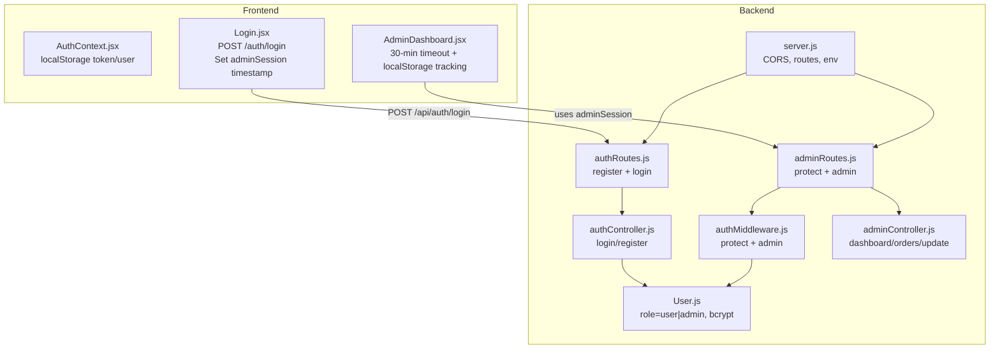
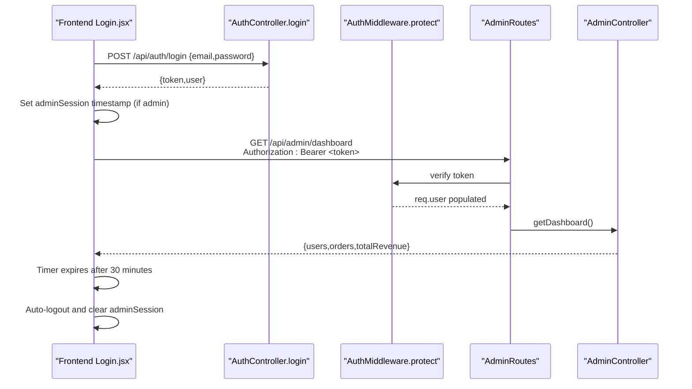
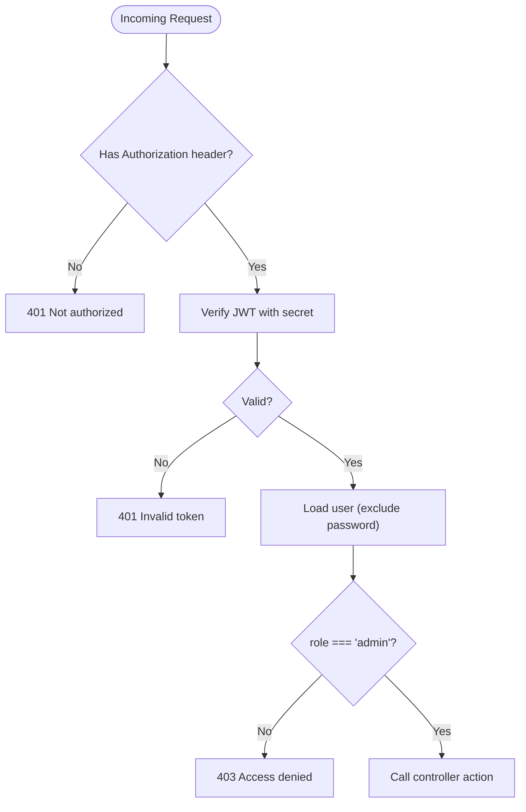
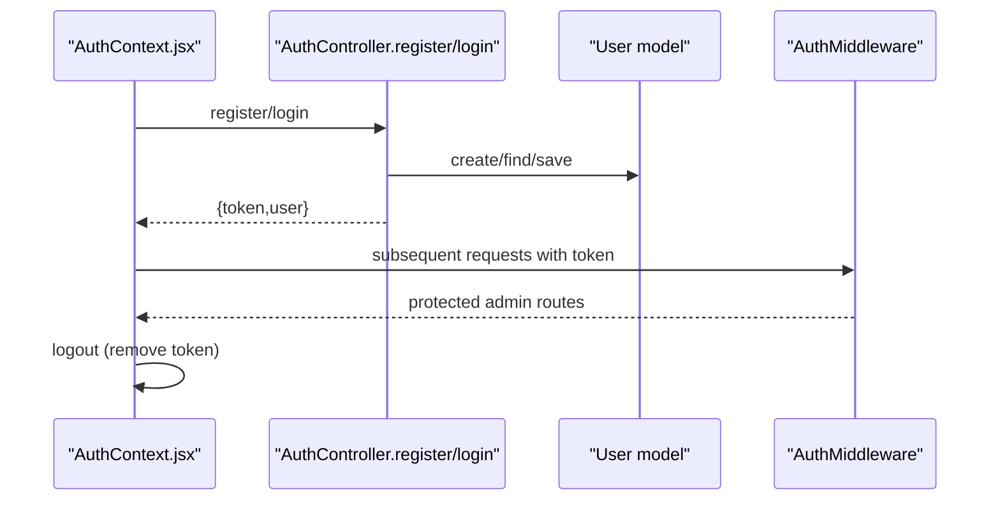
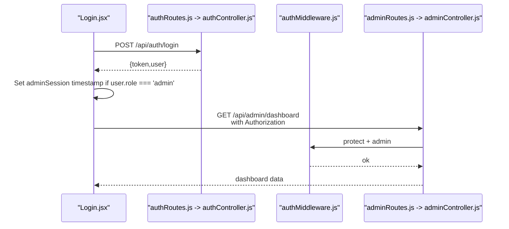
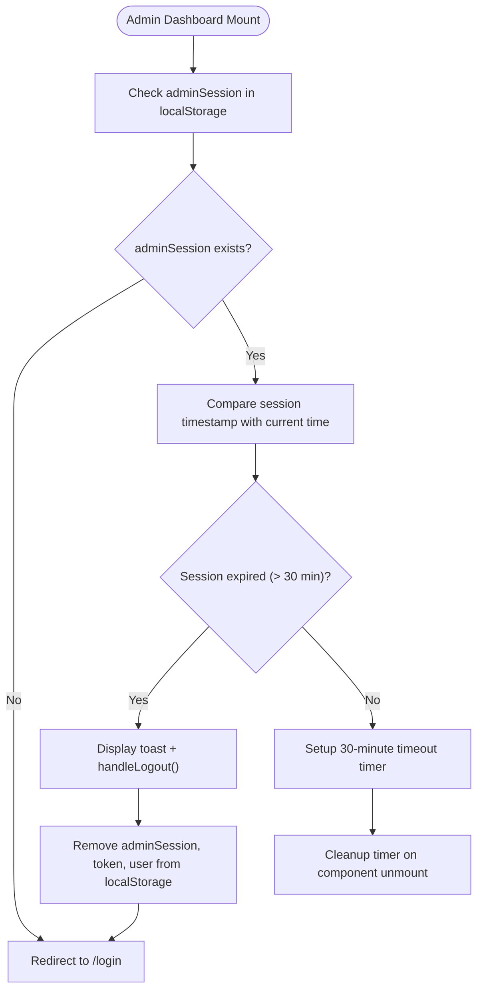
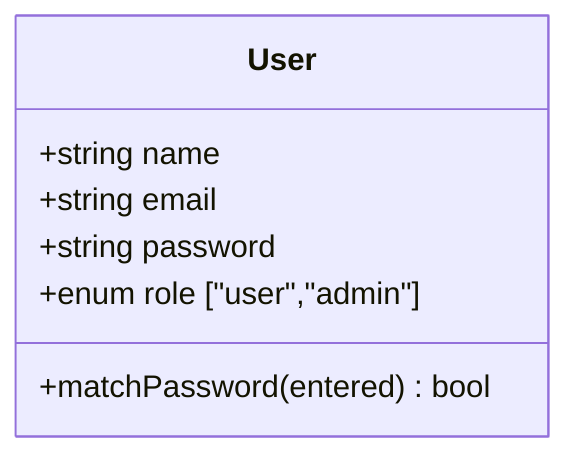
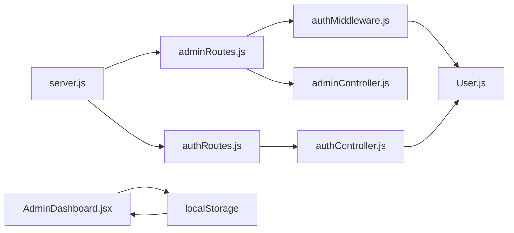

# Admin Security & Authentication

<cite>
**Referenced Files in This Document**
- [server.js](file://backend/server.js)
- [authMiddleware.js](file://backend/middleware/authMiddleware.js)
- [authController.js](file://backend/controllers/authController.js)
- [adminController.js](file://backend/controllers/adminController.js)
- [adminRoutes.js](file://backend/routes/adminRoutes.js)
- [authRoutes.js](file://backend/routes/authRoutes.js)
- [User.js](file://backend/models/User.js)
- [AuthContext.jsx](file://frontend/src/context/AuthContext.jsx)
- [Login.jsx](file://frontend/src/pages/Login.jsx)
- [AdminDashboard.jsx](file://frontend/src/pages/AdminDashboard.jsx)
- [createAdmin.js](file://backend/createAdmin.js)
- [db.js](file://backend/config/db.js)
- [package.json](file://backend/package.json)
</cite>

## Update Summary
**Changes Made**
- Added comprehensive admin session timeout mechanism documentation (30-minute automatic logout)
- Enhanced admin session management with localStorage timestamp tracking
- Updated session timeout handling section with new useEffect-based timer implementation
- Added new admin session storage mechanism using localStorage timestamps
- Updated troubleshooting guide to include session timeout scenarios

## Table of Contents
1. [Introduction](#introduction)
2. [Project Structure](#project-structure)
3. [Core Components](#core-components)
4. [Architecture Overview](#architecture-overview)
5. [Detailed Component Analysis](#detailed-component-analysis)
6. [Dependency Analysis](#dependency-analysis)
7. [Performance Considerations](#performance-considerations)
8. [Security Measures & Best Practices](#security-measures--best-practices)
9. [Troubleshooting Guide](#troubleshooting-guide)
10. [Conclusion](#conclusion)
11. [Appendices](#appendices)

## Introduction
This document explains the admin security and authentication mechanisms implemented in the backend and frontend. It covers admin-only route protection, role-based access control, JWT token validation for admin sessions, the admin login process, session management, and automatic logout functionality. The system now includes a comprehensive 30-minute admin session timeout mechanism with localStorage timestamp tracking and automatic session termination. It also documents current security measures, highlights areas for improvement (such as IP whitelisting, two-factor authentication, and audit logging), and provides guidance for implementing additional security layers and compliance requirements.

## Project Structure
The security stack spans backend Express routes, middleware, controllers, and models, plus frontend authentication context and login page. The backend exposes:
- Public authentication endpoints (/api/auth/register, /api/auth/login)
- Admin-only endpoints (/api/admin/dashboard, /api/admin/orders, /api/admin/orders/:id/status)
- Middleware enforcing JWT-based authentication and admin role checks

**Diagram sources**
- [server.js:57-63](file://backend/server.js#L57-L63)
- [authRoutes.js:1-9](file://backend/routes/authRoutes.js#L1-L9)
- [adminRoutes.js:1-19](file://backend/routes/adminRoutes.js#L1-L19)
- [authMiddleware.js:1-20](file://backend/middleware/authMiddleware.js#L1-L20)
- [authController.js:1-27](file://backend/controllers/authController.js#L1-L27)
- [adminController.js:1-86](file://backend/controllers/adminController.js#L1-L86)
- [User.js:1-20](file://backend/models/User.js#L1-L20)
- [Login.jsx:18-21](file://frontend/src/pages/Login.jsx#L18-L21)
- [AdminDashboard.jsx:35](file://frontend/src/pages/AdminDashboard.jsx#L35)

**Section sources**
- [server.js:57-63](file://backend/server.js#L57-L63)
- [authRoutes.js:1-9](file://backend/routes/authRoutes.js#L1-L9)
- [adminRoutes.js:1-19](file://backend/routes/adminRoutes.js#L1-L19)

## Core Components
- Authentication middleware
  - Token extraction from Authorization header
  - JWT verification against environment secret
  - User lookup excluding password
  - Admin role enforcement
- Admin controller actions
  - Dashboard metrics aggregation
  - Orders listing with user population
  - Order status updates
- Auth controller actions
  - Registration with duplicate email detection and hashed passwords
  - Login with credential validation and signed JWT issuance
- User model
  - Role field with enum values user/admin
  - Pre-save hashing via bcrypt
  - Password comparison method

**Section sources**
- [authMiddleware.js:4-15](file://backend/middleware/authMiddleware.js#L4-L15)
- [authMiddleware.js:17-20](file://backend/middleware/authMiddleware.js#L17-L20)
- [adminController.js:5-86](file://backend/controllers/adminController.js#L5-L86)
- [authController.js:6-27](file://backend/controllers/authController.js#L6-L27)
- [User.js:4-20](file://backend/models/User.js#L4-L20)

## Architecture Overview
Admin-only routes are protected by a middleware chain that enforces JWT-based authentication followed by admin role checks. The frontend stores tokens in localStorage and attaches Authorization headers to requests. The system now includes a comprehensive session timeout mechanism that tracks admin sessions using localStorage timestamps.

**Diagram sources**
- [Login.jsx:11-24](file://frontend/src/pages/Login.jsx#L11-L24)
- [authController.js:18-27](file://backend/controllers/authController.js#L18-L27)
- [authMiddleware.js:4-15](file://backend/middleware/authMiddleware.js#L4-L15)
- [adminRoutes.js:10-12](file://backend/routes/adminRoutes.js#L10-L12)
- [adminController.js:5-14](file://backend/controllers/adminController.js#L5-L14)
- [AdminDashboard.jsx:35](file://frontend/src/pages/AdminDashboard.jsx#L35)

## Detailed Component Analysis

### Admin Route Protection and RBAC
- All admin routes apply two middleware layers:
  - protect: validates bearer token and enriches request with user
  - admin: enforces role == admin
- Any missing token or invalid token yields 401
- Non-admin users receive 403 Access denied

**Diagram sources**
- [authMiddleware.js:4-15](file://backend/middleware/authMiddleware.js#L4-L15)
- [authMiddleware.js:17-20](file://backend/middleware/authMiddleware.js#L17-L20)
- [adminRoutes.js:10-12](file://backend/routes/adminRoutes.js#L10-L12)

**Section sources**
- [authMiddleware.js:4-20](file://backend/middleware/authMiddleware.js#L4-L20)
- [adminRoutes.js:10-17](file://backend/routes/adminRoutes.js#L10-L17)

### JWT Token Validation and Session Management
- Token signing: HS256 using JWT_SECRET environment variable with 7-day expiration
- Token extraction: Bearer scheme from Authorization header
- Session persistence: Frontend stores token in localStorage; backend does not maintain server-side sessions
- Logout: Frontend removes token from localStorage
- **Updated**: Admin sessions now include localStorage timestamp tracking for timeout enforcement

**Diagram sources**
- [authController.js:4](file://backend/controllers/authController.js#L4)
- [authController.js:18-27](file://backend/controllers/authController.js#L18-L27)
- [authMiddleware.js:5-14](file://backend/middleware/authMiddleware.js#L5-L14)
- [AuthContext.jsx:16-28](file://frontend/src/context/AuthContext.jsx#L16-L28)

**Section sources**
- [authController.js:4](file://backend/controllers/authController.js#L4)
- [authMiddleware.js:5-14](file://backend/middleware/authMiddleware.js#L5-L14)
- [AuthContext.jsx:16-28](file://frontend/src/context/AuthContext.jsx#L16-L28)

### Admin Login Process
- Frontend submits credentials to /api/auth/login
- Backend verifies credentials and issues a signed JWT
- Frontend persists token and user profile in localStorage
- **Updated**: Frontend sets adminSession timestamp in localStorage for admin users
- Subsequent admin requests include Authorization: Bearer <token>

**Diagram sources**
- [Login.jsx:11-24](file://frontend/src/pages/Login.jsx#L11-L24)
- [authRoutes.js:6-7](file://backend/routes/authRoutes.js#L6-L7)
- [authController.js:18-27](file://backend/controllers/authController.js#L18-L27)
- [adminRoutes.js:10-12](file://backend/routes/adminRoutes.js#L10-L12)
- [authMiddleware.js:4-20](file://backend/middleware/authMiddleware.js#L4-L20)

**Section sources**
- [Login.jsx:11-24](file://frontend/src/pages/Login.jsx#L11-L24)
- [authRoutes.js:6-7](file://backend/routes/authRoutes.js#L6-L7)
- [authController.js:18-27](file://backend/controllers/authController.js#L18-L27)
- [adminRoutes.js:10-12](file://backend/routes/adminRoutes.js#L10-L12)

### Session Timeout Handling
- **Updated**: Comprehensive 30-minute admin session timeout mechanism
- **Frontend Implementation**: Uses useEffect-based timer with SESSION_TIMEOUT constant (30 minutes)
- **LocalStorage Tracking**: Admin sessions tracked via adminSession timestamp in localStorage
- **Automatic Termination**: Session automatically expires after 30 minutes of inactivity
- **Session Validation**: On component mount, validates adminSession timestamp against current time
- **Graceful Logout**: Displays toast notification and redirects to login page on timeout

**Diagram sources**
- [AdminDashboard.jsx:35](file://frontend/src/pages/AdminDashboard.jsx#L35)
- [AdminDashboard.jsx:37-53](file://frontend/src/pages/AdminDashboard.jsx#L37-L53)
- [AdminDashboard.jsx:55-76](file://frontend/src/pages/AdminDashboard.jsx#L55-L76)
- [AdminDashboard.jsx:78-85](file://frontend/src/pages/AdminDashboard.jsx#L78-L85)

**Section sources**
- [AdminDashboard.jsx:35](file://frontend/src/pages/AdminDashboard.jsx#L35)
- [AdminDashboard.jsx:37-53](file://frontend/src/pages/AdminDashboard.jsx#L37-L53)
- [AdminDashboard.jsx:55-76](file://frontend/src/pages/AdminDashboard.jsx#L55-L76)
- [AdminDashboard.jsx:78-85](file://frontend/src/pages/AdminDashboard.jsx#L78-L85)

### Admin Privilege Escalation
- The User model defines role as enum with values user and admin
- There is no endpoint to elevate roles within the provided code
- Creation of initial admin user is supported by a dedicated script

**Diagram sources**
- [User.js:4-20](file://backend/models/User.js#L4-L20)

**Section sources**
- [User.js:8](file://backend/models/User.js#L8)
- [createAdmin.js:22-28](file://backend/createAdmin.js#L22-L28)

### Enhanced Session Management with LocalStorage Timestamps
- **New**: Admin sessions now include localStorage timestamp tracking
- **Timestamp Storage**: adminSession timestamp stored as Date.now() string in localStorage
- **Session Validation**: On login, admin users get adminSession timestamp set
- **Cross-Tab Persistence**: Timestamp persists across browser tabs and windows
- **Automatic Cleanup**: On logout or timeout, adminSession timestamp is removed

**Section sources**
- [Login.jsx:18-21](file://frontend/src/pages/Login.jsx#L18-L21)
- [AdminDashboard.jsx:55-76](file://frontend/src/pages/AdminDashboard.jsx#L55-L76)
- [AdminDashboard.jsx:78-85](file://frontend/src/pages/AdminDashboard.jsx#L78-L85)

## Dependency Analysis
- Express server registers routes and applies CORS policy
- Admin routes depend on auth middleware for protection
- Controllers depend on models for user and order data
- Frontend depends on auth context for token storage and logout
- **Updated**: AdminDashboard depends on localStorage for session timeout tracking

**Diagram sources**
- [server.js:57-63](file://backend/server.js#L57-L63)
- [adminRoutes.js:1-19](file://backend/routes/adminRoutes.js#L1-L19)
- [authRoutes.js:1-9](file://backend/routes/authRoutes.js#L1-L9)
- [authMiddleware.js:1-20](file://backend/middleware/authMiddleware.js#L1-L20)
- [authController.js:1-27](file://backend/controllers/authController.js#L1-L27)
- [adminController.js:1-86](file://backend/controllers/adminController.js#L1-L86)
- [User.js:1-20](file://backend/models/User.js#L1-L20)
- [AdminDashboard.jsx:35](file://frontend/src/pages/AdminDashboard.jsx#L35)

**Section sources**
- [server.js:57-63](file://backend/server.js#L57-L63)
- [package.json:8-22](file://backend/package.json#L8-L22)

## Performance Considerations
- JWT verification is CPU-bound but lightweight compared to DB queries
- Avoid excessive token re-issuance; batch admin operations to reduce redundant auth checks
- Consider caching aggregated metrics for the admin dashboard to minimize DB load
- **Updated**: Session timeout timers are cleaned up on component unmount to prevent memory leaks

## Security Measures & Best Practices

### Current Security Measures
- Password hashing with bcrypt during user creation
- JWT-based stateless authentication with HS256
- Admin-only route protection via middleware
- CORS configured with allowed origins and credentials support
- **Updated**: 30-minute admin session timeout with automatic logout
- **Updated**: Admin session tracking via localStorage timestamps
- **Updated**: Cross-tab session validation and cleanup

**Section sources**
- [User.js:11-18](file://backend/models/User.js#L11-L18)
- [authController.js:4](file://backend/controllers/authController.js#L4)
- [authMiddleware.js:4-20](file://backend/middleware/authMiddleware.js#L4-L20)
- [server.js:22-49](file://backend/server.js#L22-L49)
- [AdminDashboard.jsx:35](file://frontend/src/pages/AdminDashboard.jsx#L35)
- [AdminDashboard.jsx:55-76](file://frontend/src/pages/AdminDashboard.jsx#L55-L76)

### Areas for Improvement
- IP whitelisting
  - Enforce allowed IPs per environment behind reverse proxies
  - Log and alert on unauthorized IP attempts
- Two-factor authentication (2FA)
  - Add TOTP or SMS-based 2FA during login
  - Bind 2FA state to user records and require verification before issuing tokens
- Audit logging
  - Log admin actions (dashboard access, order updates) with user identity, IP, and timestamp
  - Store logs securely and retain for compliance periods
- Session timeout and refresh tokens
  - Short-lived access tokens with refresh tokens stored in HttpOnly cookies
  - Device binding and revocation on suspicious activity
- Transport and storage security
  - Enforce HTTPS in production
  - Use secure, same-site cookies for tokens
  - Rotate JWT secrets regularly and invalidate stale tokens
- Input validation and rate limiting
  - Rate limit login attempts globally and per IP
  - Sanitize and validate all inputs
- Least privilege and separation of duties
  - Restrict admin endpoints to minimal required scope
  - Consider role granularity beyond admin/user

### Compliance Guidance
- Data retention: Define and enforce retention policies for logs and personal data
- Privacy: Minimize PII exposure; encrypt at rest and in transit
- Auditability: Maintain tamper-evident logs with non-repudiation
- Incident response: Establish playbooks for compromised tokens, leaked secrets, and unauthorized access

## Troubleshooting Guide
Common issues and resolutions:
- 401 Not authorized
  - Cause: Missing Authorization header or malformed Bearer token
  - Resolution: Ensure frontend sets Authorization header; verify token presence
- 401 Invalid token
  - Cause: Expired or tampered token; mismatched JWT_SECRET
  - Resolution: Re-authenticate; confirm environment secrets match deployment
- 403 Access denied
  - Cause: Non-admin user attempting admin route
  - Resolution: Verify user role; ensure admin credentials are used
- CORS errors
  - Cause: Origin not in allowed list
  - Resolution: Configure FRONTEND_URL and allowed origins appropriately
- **Updated**: Session timeout issues
  - Cause: Admin session expired after 30 minutes of inactivity
  - Resolution: User receives automatic logout notification and must re-login
- **Updated**: Cross-tab session conflicts
  - Cause: Multiple admin sessions across browser tabs
  - Resolution: Session validation ensures consistent timeout across tabs

**Section sources**
- [authMiddleware.js:5-14](file://backend/middleware/authMiddleware.js#L5-L14)
- [authMiddleware.js:17-20](file://backend/middleware/authMiddleware.js#L17-L20)
- [server.js:22-49](file://backend/server.js#L22-L49)
- [AdminDashboard.jsx:66-73](file://frontend/src/pages/AdminDashboard.jsx#L66-L73)

## Conclusion
The application implements a clear JWT-based authentication and admin-only route protection mechanism. The recent addition of a comprehensive 30-minute admin session timeout mechanism with localStorage timestamp tracking significantly enhances security by preventing prolonged unauthorized access. While functional, enhancements in 2FA, IP whitelisting, audit logging, and robust session management would significantly strengthen security posture and align with enterprise and compliance requirements.

## Appendices

### Admin Initialization Script
- Creates an admin user with predefined credentials if none exists
- Outputs credentials for first-time setup

**Section sources**
- [createAdmin.js:8-39](file://backend/createAdmin.js#L8-L39)

### Database Connection
- Connects to MongoDB using environment-provided URI

**Section sources**
- [db.js:5-13](file://backend/config/db.js#L5-L13)

### Session Timeout Configuration
- **New**: 30-minute timeout constant (SESSION_TIMEOUT = 30 * 60 * 1000 milliseconds)
- **New**: useEffect-based timer implementation for automatic logout
- **New**: localStorage timestamp tracking for cross-tab session validation

**Section sources**
- [AdminDashboard.jsx:35](file://frontend/src/pages/AdminDashboard.jsx#L35)
- [AdminDashboard.jsx:45-53](file://frontend/src/pages/AdminDashboard.jsx#L45-L53)
- [AdminDashboard.jsx:55-76](file://frontend/src/pages/AdminDashboard.jsx#L55-L76)