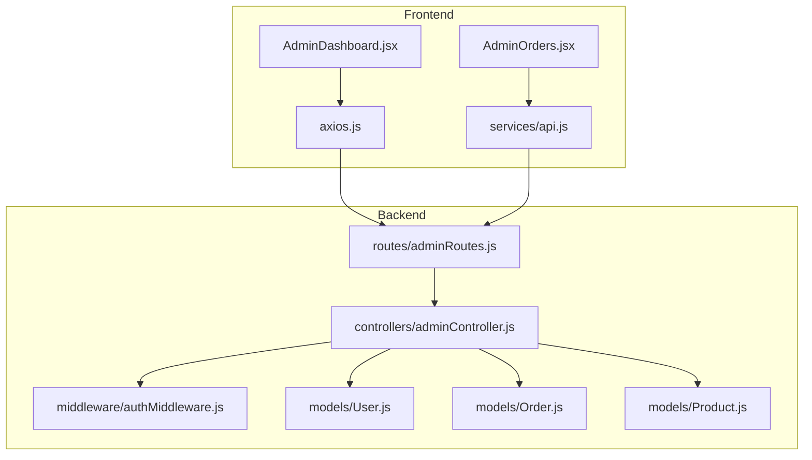
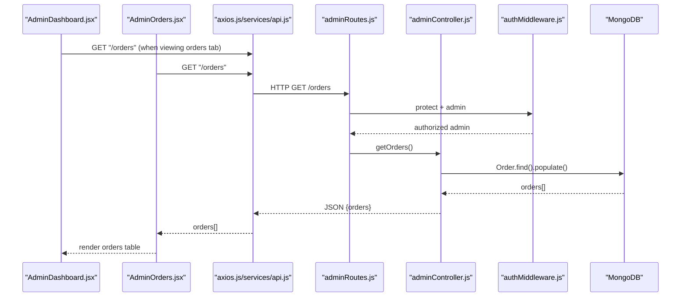
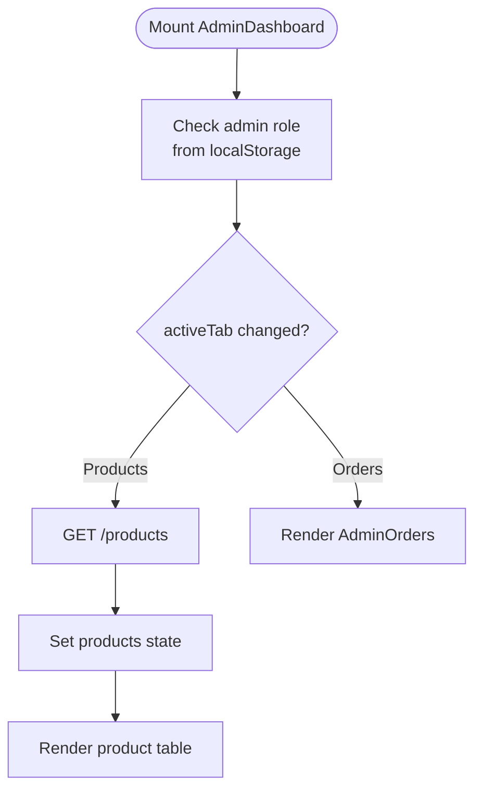
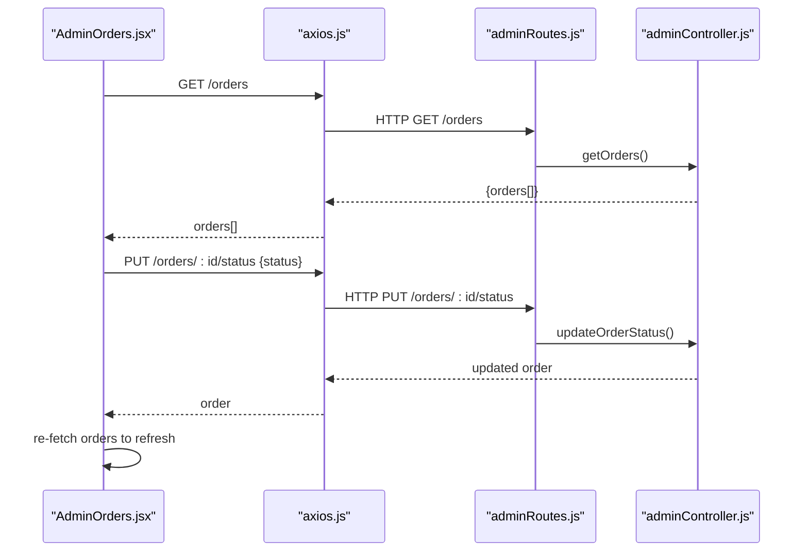
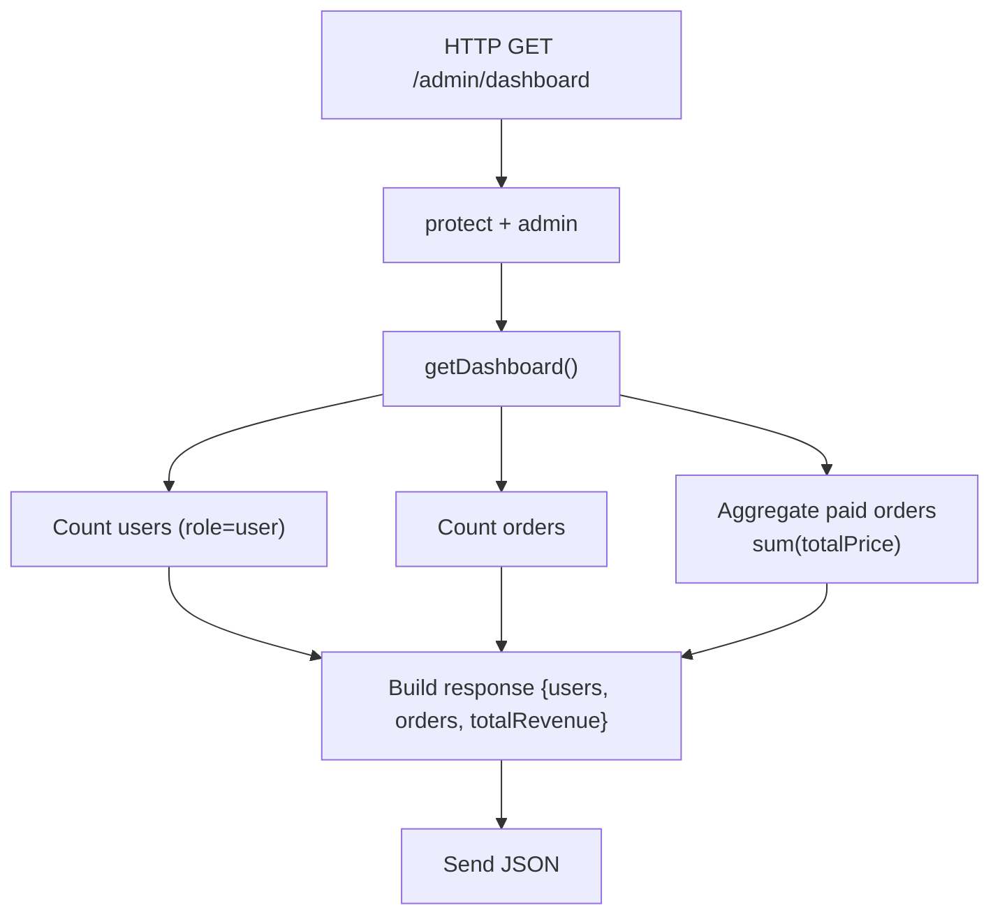
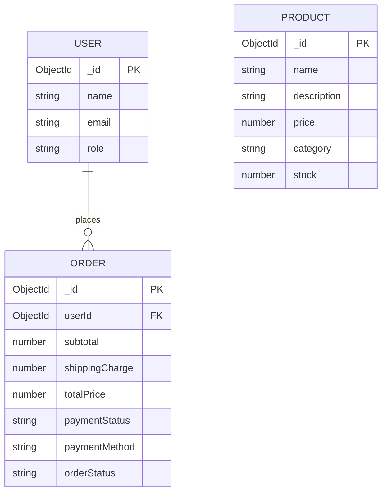
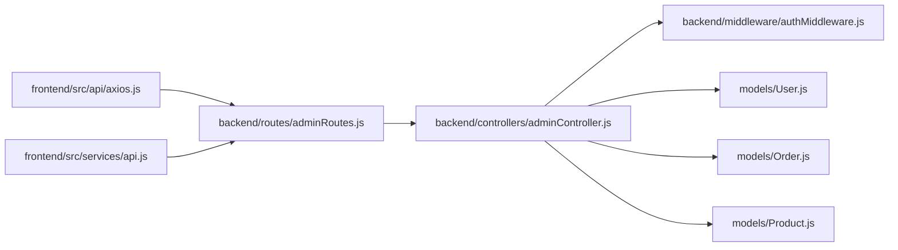

# Analytics Dashboard

<cite>
**Referenced Files in This Document**
- [AdminDashboard.jsx](file://frontend/src/pages/AdminDashboard.jsx)
- [AdminOrders.jsx](file://frontend/src/components/admin/AdminOrders.jsx)
- [axios.js](file://frontend/src/api/axios.js)
- [api.js](file://frontend/src/services/api.js)
- [adminController.js](file://backend/controllers/adminController.js)
- [adminRoutes.js](file://backend/routes/adminRoutes.js)
- [authMiddleware.js](file://backend/middleware/authMiddleware.js)
- [Order.js](file://backend/models/Order.js)
- [Product.js](file://backend/models/Product.js)
- [User.js](file://backend/models/User.js)
- [package.json (frontend)](file://frontend/package.json)
- [package.json (backend)](file://backend/package.json)
</cite>

## Table of Contents
1. [Introduction](#introduction)
2. [Project Structure](#project-structure)
3. [Core Components](#core-components)
4. [Architecture Overview](#architecture-overview)
5. [Detailed Component Analysis](#detailed-component-analysis)
6. [Dependency Analysis](#dependency-analysis)
7. [Performance Considerations](#performance-considerations)
8. [Troubleshooting Guide](#troubleshooting-guide)
9. [Conclusion](#conclusion)
10. [Appendices](#appendices)

## Introduction
This document describes the admin analytics dashboard functionality present in the project. It explains the current dashboard layout, the metrics exposed by the backend, and the data visualization components currently implemented in the frontend. It also documents the analytics data retrieval methods, sales/order tracking, and inventory analytics, along with component state management for loading, filtering, and updates. Guidance is provided for extending the dashboard with new widgets, integrating additional KPI metrics, and implementing export and responsive enhancements.

## Project Structure
The analytics dashboard spans frontend and backend:
- Frontend pages and components manage UI, state, and user interactions.
- Backend controllers and routes expose analytics endpoints protected by authentication and authorization middleware.
- Mongoose models define the data structures for users, orders, and products used by analytics.

**Diagram sources**
- [AdminDashboard.jsx:1-259](file://frontend/src/pages/AdminDashboard.jsx#L1-L259)
- [AdminOrders.jsx:1-213](file://frontend/src/components/admin/AdminOrders.jsx#L1-L213)
- [axios.js:1-17](file://frontend/src/api/axios.js#L1-L17)
- [api.js:1-8](file://frontend/src/services/api.js#L1-L8)
- [adminRoutes.js:1-14](file://backend/routes/adminRoutes.js#L1-L14)
- [adminController.js:1-24](file://backend/controllers/adminController.js#L1-L24)
- [authMiddleware.js:1-20](file://backend/middleware/authMiddleware.js#L1-L20)
- [User.js:1-20](file://backend/models/User.js#L1-L20)
- [Order.js:1-33](file://backend/models/Order.js#L1-L33)
- [Product.js:1-12](file://backend/models/Product.js#L1-L12)

**Section sources**
- [AdminDashboard.jsx:1-259](file://frontend/src/pages/AdminDashboard.jsx#L1-L259)
- [AdminOrders.jsx:1-213](file://frontend/src/components/admin/AdminOrders.jsx#L1-L213)
- [axios.js:1-17](file://frontend/src/api/axios.js#L1-L17)
- [api.js:1-8](file://frontend/src/services/api.js#L1-L8)
- [adminRoutes.js:1-14](file://backend/routes/adminRoutes.js#L1-L14)
- [adminController.js:1-24](file://backend/controllers/adminController.js#L1-L24)
- [authMiddleware.js:1-20](file://backend/middleware/authMiddleware.js#L1-L20)
- [User.js:1-20](file://backend/models/User.js#L1-L20)
- [Order.js:1-33](file://backend/models/Order.js#L1-L33)
- [Product.js:1-12](file://backend/models/Product.js#L1-L12)

## Core Components
- AdminDashboard page orchestrates tabbed navigation between product management and orders. It handles admin access checks, product CRUD, and displays a placeholder for analytics metrics.
- AdminOrders component renders order data with filtering, status updates, and expanded details for shipping address, items, pricing breakdown, and metadata.
- Backend admin controller exposes a dashboard summary endpoint aggregating user count, total orders, and paid revenue.
- Authentication and authorization middleware protect admin routes and enforce admin roles.

Key metrics currently available:
- Total number of users (role=user)
- Total number of orders
- Total paid revenue (sum of totalPrice for paid orders)

**Section sources**
- [AdminDashboard.jsx:8-144](file://frontend/src/pages/AdminDashboard.jsx#L8-L144)
- [AdminOrders.jsx:5-74](file://frontend/src/components/admin/AdminOrders.jsx#L5-L74)
- [adminController.js:5-14](file://backend/controllers/adminController.js#L5-L14)
- [authMiddleware.js:4-20](file://backend/middleware/authMiddleware.js#L4-L20)

## Architecture Overview
The analytics dashboard follows a client-server architecture:
- Frontend components fetch data via Axios interceptors that attach JWT tokens.
- Backend routes apply protection and admin guards before invoking controller functions.
- Controllers query models and aggregate analytics data, returning structured JSON.

**Diagram sources**
- [AdminDashboard.jsx:27-32](file://frontend/src/pages/AdminDashboard.jsx#L27-L32)
- [AdminOrders.jsx:15-24](file://frontend/src/components/admin/AdminOrders.jsx#L15-L24)
- [axios.js:4-16](file://frontend/src/api/axios.js#L4-L16)
- [api.js:3-7](file://frontend/src/services/api.js#L3-L7)
- [adminRoutes.js:10-12](file://backend/routes/adminRoutes.js#L10-L12)
- [adminController.js:16-18](file://backend/controllers/adminController.js#L16-L18)
- [authMiddleware.js:4-20](file://backend/middleware/authMiddleware.js#L4-L20)

## Detailed Component Analysis

### AdminDashboard Page
Responsibilities:
- Enforce admin-only access using local user data and navigation guard.
- Manage active tab state (products vs orders).
- Product form state, image preview handling, and submission to backend.
- Fetch and display product listings with edit/delete actions.

State management highlights:
- Tabs and forms: activeTab, showForm, editingProduct, formData, images, imagePreviews.
- Loading states: loading for initial product load; uploading during form submission.
- Navigation: useNavigate for unauthorized redirection.

Data retrieval:
- Uses axios instance to call backend endpoints for products and CRUD operations.

UI layout:
- Top-level tabs for switching between product management and orders.
- Conditional rendering of product form and product table.

**Diagram sources**
- [AdminDashboard.jsx:27-51](file://frontend/src/pages/AdminDashboard.jsx#L27-L51)
- [AdminDashboard.jsx:132-144](file://frontend/src/pages/AdminDashboard.jsx#L132-L144)

**Section sources**
- [AdminDashboard.jsx:8-144](file://frontend/src/pages/AdminDashboard.jsx#L8-L144)
- [AdminDashboard.jsx:42-128](file://frontend/src/pages/AdminDashboard.jsx#L42-L128)

### AdminOrders Component
Responsibilities:
- Fetch orders on mount.
- Filter orders by status (All, Pending, Shipped, Delivered, Cancelled).
- Expandable rows to reveal shipping address, items list, and pricing details.
- Update order status via PUT requests and refresh data.

State management highlights:
- orders, loading, filter, expandedOrder.
- Color-coded status badges and payment indicators.
- Currency formatting for INR.

**Diagram sources**
- [AdminOrders.jsx:15-34](file://frontend/src/components/admin/AdminOrders.jsx#L15-L34)
- [adminRoutes.js:11-12](file://backend/routes/adminRoutes.js#L11-L12)
- [adminController.js:21-24](file://backend/controllers/adminController.js#L21-L24)

**Section sources**
- [AdminOrders.jsx:5-74](file://frontend/src/components/admin/AdminOrders.jsx#L5-L74)
- [AdminOrders.jsx:76-212](file://frontend/src/components/admin/AdminOrders.jsx#L76-L212)

### Backend Analytics Endpoint
Endpoint: GET /admin/dashboard
Protected by: protect + admin middleware
Response payload: { users, orders, totalRevenue }

Data aggregation:
- Users: count of documents where role='user'
- Orders: total count of orders
- Revenue: sum of totalPrice for orders where paymentStatus='paid'

**Diagram sources**
- [adminRoutes.js:10-10](file://backend/routes/adminRoutes.js#L10-L10)
- [adminController.js:5-14](file://backend/controllers/adminController.js#L5-L14)
- [authMiddleware.js:4-20](file://backend/middleware/authMiddleware.js#L4-L20)

**Section sources**
- [adminController.js:5-14](file://backend/controllers/adminController.js#L5-L14)
- [adminRoutes.js:10-10](file://backend/routes/adminRoutes.js#L10-L10)

### Data Models Used by Analytics
- User: role field used to compute user counts for analytics.
- Order: pricing fields (subtotal, shippingCharge, totalPrice), payment fields (paymentStatus, paymentMethod), and order tracking (orderStatus).
- Product: used by product management; not directly queried for analytics.

**Diagram sources**
- [User.js:4-8](file://backend/models/User.js#L4-L8)
- [Order.js:3-31](file://backend/models/Order.js#L3-L31)
- [Product.js:3-9](file://backend/models/Product.js#L3-L9)

**Section sources**
- [User.js:1-20](file://backend/models/User.js#L1-L20)
- [Order.js:1-33](file://backend/models/Order.js#L1-L33)
- [Product.js:1-12](file://backend/models/Product.js#L1-L12)

## Dependency Analysis
- Frontend depends on Axios for HTTP requests and Tailwind for styling.
- Backend depends on Express, JWT, and Mongoose.
- Admin routes are protected by middleware that verifies JWT and admin role.
- Analytics endpoints rely on Mongoose models for counting and aggregation.

**Diagram sources**
- [axios.js:1-17](file://frontend/src/api/axios.js#L1-L17)
- [api.js:1-8](file://frontend/src/services/api.js#L1-L8)
- [adminRoutes.js:1-14](file://backend/routes/adminRoutes.js#L1-L14)
- [adminController.js:1-24](file://backend/controllers/adminController.js#L1-L24)
- [authMiddleware.js:1-20](file://backend/middleware/authMiddleware.js#L1-L20)
- [User.js:1-20](file://backend/models/User.js#L1-L20)
- [Order.js:1-33](file://backend/models/Order.js#L1-L33)
- [Product.js:1-12](file://backend/models/Product.js#L1-L12)

**Section sources**
- [axios.js:1-17](file://frontend/src/api/axios.js#L1-L17)
- [api.js:1-8](file://frontend/src/services/api.js#L1-L8)
- [adminRoutes.js:1-14](file://backend/routes/adminRoutes.js#L1-L14)
- [adminController.js:1-24](file://backend/controllers/adminController.js#L1-L24)
- [authMiddleware.js:1-20](file://backend/middleware/authMiddleware.js#L1-L20)
- [User.js:1-20](file://backend/models/User.js#L1-L20)
- [Order.js:1-33](file://backend/models/Order.js#L1-L33)
- [Product.js:1-12](file://backend/models/Product.js#L1-L12)

## Performance Considerations
- Current analytics endpoint performs simple counts and a single aggregation. These queries are efficient for small to medium datasets.
- For larger datasets, consider:
  - Indexes on frequently filtered fields (paymentStatus, orderStatus, timestamps).
  - Pagination for orders listing to reduce payload sizes.
  - Caching aggregated results with TTL for dashboard summaries.
  - Client-side debounced filters for order status to avoid excessive requests.
- Frontend rendering:
  - Keep expanded order details lazy-loaded or virtualized if order volumes grow.
  - Memoize formatted currency values and status badges to reduce re-renders.

## Troubleshooting Guide
Common issues and remedies:
- Unauthorized access attempts:
  - Symptom: 401 Not authorized or Access denied.
  - Cause: Missing/expired JWT or non-admin role.
  - Fix: Ensure login flow sets token and user role; verify middleware enforcement.
- Network errors:
  - Symptom: Toast notifications indicating failed fetch/save.
  - Cause: Backend unreachable or CORS misconfiguration.
  - Fix: Verify VITE_API_URL and backend deployment; check interceptors.
- Order status updates failing:
  - Symptom: Status not changing after button click.
  - Cause: Incorrect route or payload mismatch.
  - Fix: Confirm PUT route and body { status } shape.

**Section sources**
- [axios.js:10-16](file://frontend/src/api/axios.js#L10-L16)
- [authMiddleware.js:4-20](file://backend/middleware/authMiddleware.js#L4-L20)
- [AdminOrders.jsx:26-34](file://frontend/src/components/admin/AdminOrders.jsx#L26-L34)

## Conclusion
The current admin analytics dashboard provides a foundation with:
- A product management interface and an orders management interface.
- An analytics endpoint exposing user count, order count, and paid revenue.
- Robust authentication and authorization guards.

To evolve into a full analytics dashboard, extend the backend with additional KPIs and time-series aggregations, and enrich the frontend with dedicated analytics widgets and visualizations.

## Appendices

### Adding New Analytics Widgets
Steps to integrate new KPIs:
1. Extend backend:
   - Add new controller methods and routes under /admin.
   - Implement aggregations or queries for desired metrics (e.g., conversion rate, average order value, top-selling categories).
   - Protect new routes with the existing middleware stack.
2. Frontend:
   - Create a new component for the widget (e.g., SalesChart.jsx).
   - Use axios to call new endpoints and manage loading/error states.
   - Render metrics and charts using lightweight visualization libraries if needed.

### Integrating Additional KPI Metrics
Examples of KPIs to add:
- Average Order Value: sum(totalPrice)/count orders for paid orders.
- Conversion Rate: (paid orders / total placed orders) * 100.
- Revenue by Category: group orders by product category and sum totals.
- Inventory Turnover: COGS / average inventory value (requires cost and stock models).

### Data Export Capabilities
- Orders export:
  - Add CSV export for orders list with filters applied.
  - Include columns: orderId, customer, total, payment method/status, status, date, items.
- Dashboard summary export:
  - Provide a snapshot of users, orders, and revenue as CSV/JSON.

### Responsive Design Considerations
- Use Tailwind responsive utilities to ensure tables and grids adapt to mobile screens.
- Collapse less critical columns on small screens; prioritize key metrics.
- Ensure touch-friendly controls for status updates and filters.

### Metric Calculation Examples
- Total Paid Revenue:
  - Backend aggregation sums totalPrice for paymentStatus='paid'.
- User Growth:
  - Count users grouped by creation date (daily/weekly/monthly).
- Order Status Distribution:
  - Group orders by orderStatus and compute percentages.