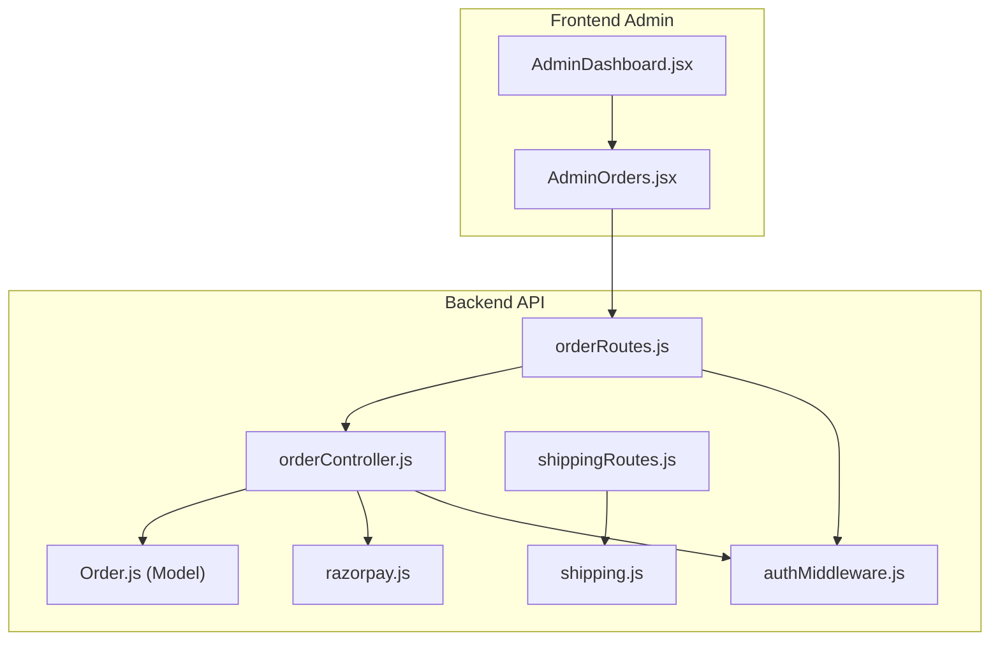
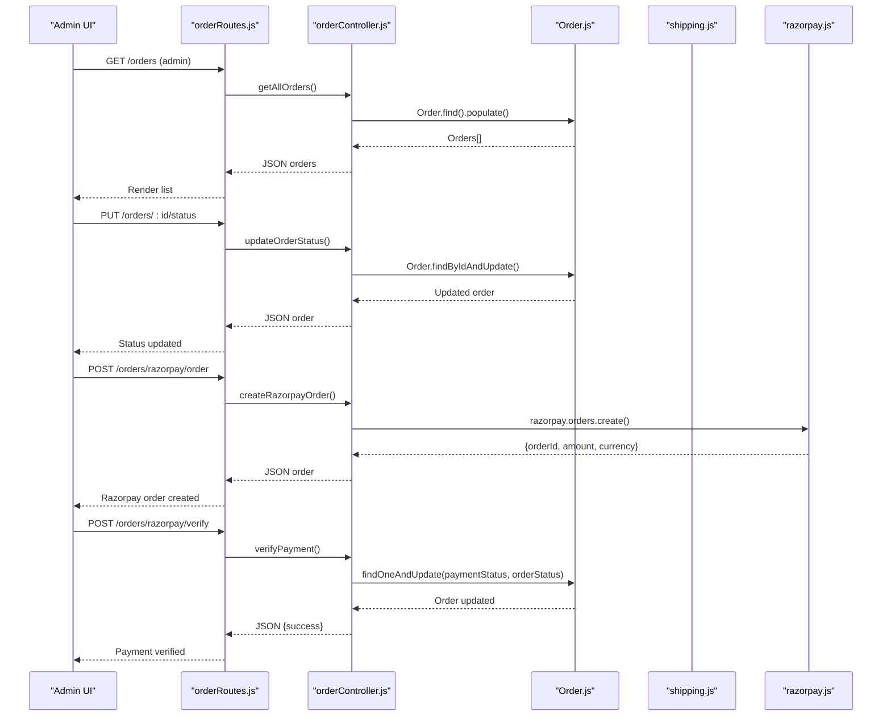
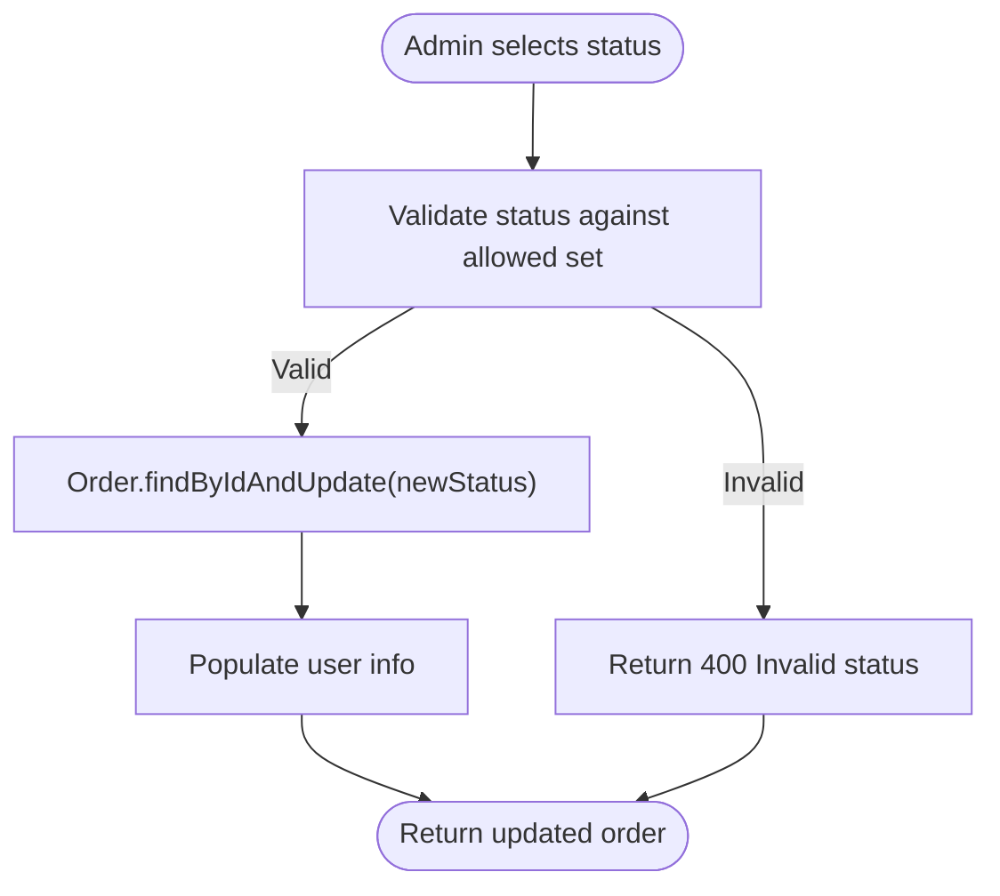
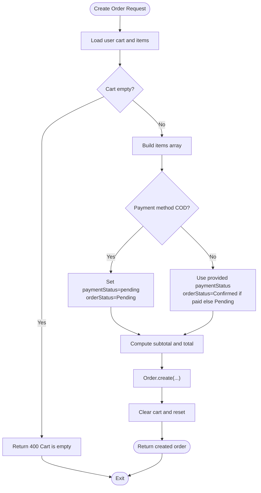
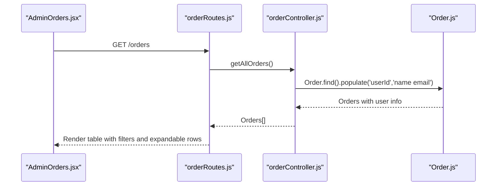
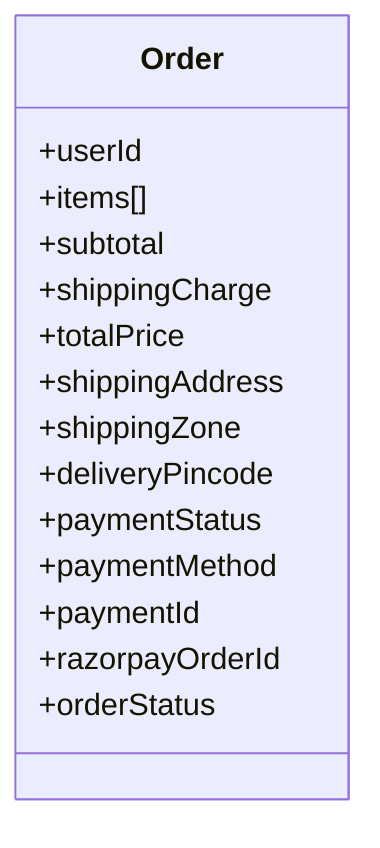
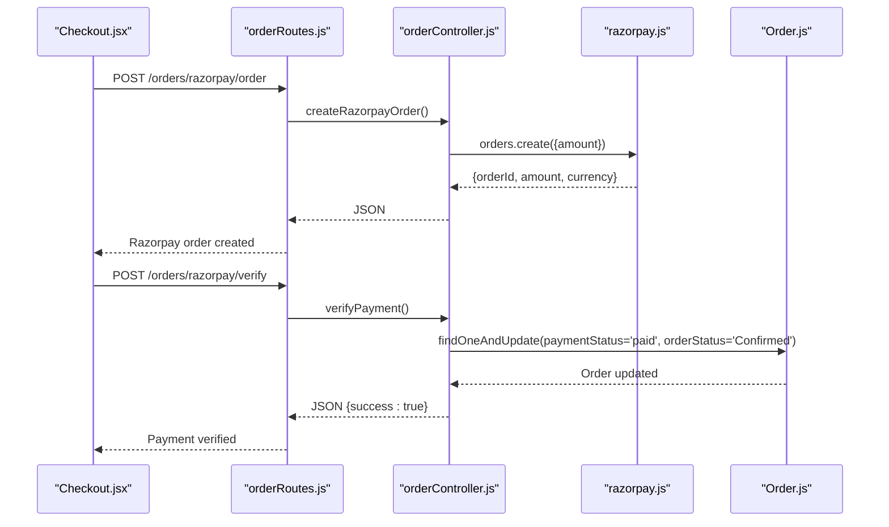
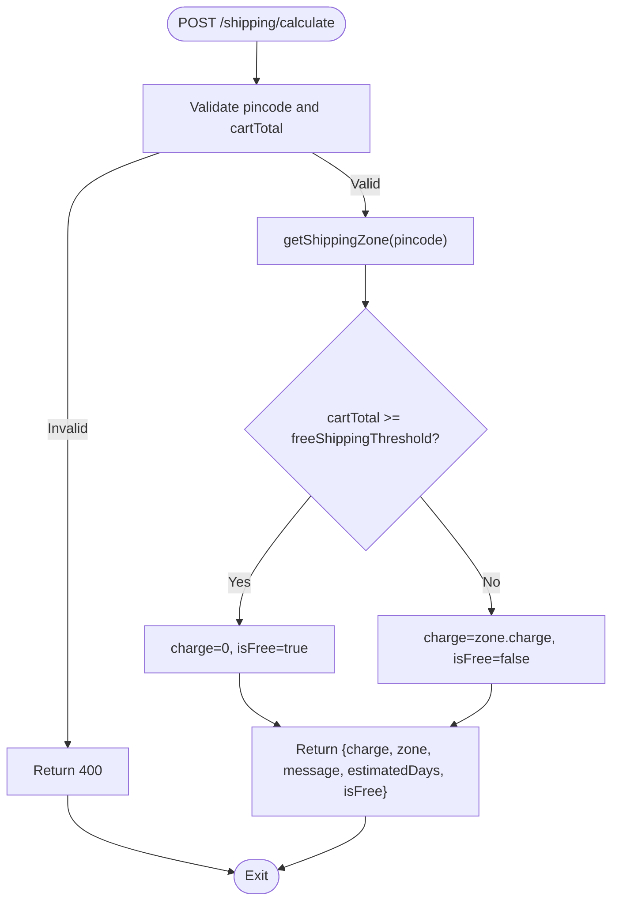
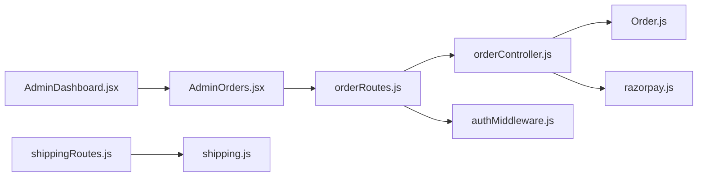

# Order Management

<cite>
**Referenced Files in This Document**
- [orderController.js](file://backend/controllers/orderController.js)
- [Order.js](file://backend/models/Order.js)
- [orderRoutes.js](file://backend/routes/orderRoutes.js)
- [AdminOrders.jsx](file://frontend/src/components/admin/AdminOrders.jsx)
- [AdminDashboard.jsx](file://frontend/src/pages/AdminDashboard.jsx)
- [shipping.js](file://backend/config/shipping.js)
- [shippingRoutes.js](file://backend/routes/shippingRoutes.js)
- [razorpay.js](file://backend/utils/razorpay.js)
- [authMiddleware.js](file://backend/middleware/authMiddleware.js)
- [Checkout.jsx](file://frontend/src/pages/Checkout.jsx)
</cite>

## Table of Contents
1. [Introduction](#introduction)
2. [Project Structure](#project-structure)
3. [Core Components](#core-components)
4. [Architecture Overview](#architecture-overview)
5. [Detailed Component Analysis](#detailed-component-analysis)
6. [Dependency Analysis](#dependency-analysis)
7. [Performance Considerations](#performance-considerations)
8. [Troubleshooting Guide](#troubleshooting-guide)
9. [Conclusion](#conclusion)

## Introduction
This document explains the admin order management functionality for the ecommerce application. It covers the order tracking system, status updates, fulfillment workflows, order listing with filters, order detail view, payment and shipping integrations, and guidance for extending the system with shipping providers and customizations.

## Project Structure
The order management system spans backend controllers, models, routes, and frontend admin components. The backend exposes REST endpoints for order creation, retrieval, and status updates, integrates with Razorpay for payments, and computes shipping costs. The frontend admin dashboard lists orders, allows filtering, and updates order statuses.

**Diagram sources**
- [orderRoutes.js:1-28](file://backend/routes/orderRoutes.js#L1-L28)
- [orderController.js:1-146](file://backend/controllers/orderController.js#L1-L146)
- [Order.js:1-33](file://backend/models/Order.js#L1-L33)
- [shippingRoutes.js:1-32](file://backend/routes/shippingRoutes.js#L1-L32)
- [shipping.js:1-73](file://backend/config/shipping.js#L1-L73)
- [razorpay.js:1-10](file://backend/utils/razorpay.js#L1-L10)
- [authMiddleware.js:1-20](file://backend/middleware/authMiddleware.js#L1-L20)
- [AdminOrders.jsx:1-213](file://frontend/src/components/admin/AdminOrders.jsx#L1-L213)
- [AdminDashboard.jsx:1-259](file://frontend/src/pages/AdminDashboard.jsx#L1-L259)

**Section sources**
- [orderRoutes.js:1-28](file://backend/routes/orderRoutes.js#L1-L28)
- [orderController.js:1-146](file://backend/controllers/orderController.js#L1-L146)
- [Order.js:1-33](file://backend/models/Order.js#L1-L33)
- [shippingRoutes.js:1-32](file://backend/routes/shippingRoutes.js#L1-L32)
- [shipping.js:1-73](file://backend/config/shipping.js#L1-L73)
- [razorpay.js:1-10](file://backend/utils/razorpay.js#L1-L10)
- [authMiddleware.js:1-20](file://backend/middleware/authMiddleware.js#L1-L20)
- [AdminOrders.jsx:1-213](file://frontend/src/components/admin/AdminOrders.jsx#L1-L213)
- [AdminDashboard.jsx:1-259](file://frontend/src/pages/AdminDashboard.jsx#L1-L259)

## Core Components
- Order model defines fields for items, pricing, shipping, payment, and order status.
- Order controller handles order creation, retrieval, Razorpay integration, and status updates.
- Order routes expose endpoints protected by authentication and admin middleware.
- Frontend admin components render order listings, filters, and status controls.
- Shipping configuration computes shipping charges and zones based on pincode.
- Razorpay utility initializes the payment provider client.

Key responsibilities:
- Admin order listing and filtering by status.
- Real-time status updates with validation.
- Payment capture and order state alignment (e.g., paid -> confirmed).
- Shipping cost computation and zone assignment.
- Integration points for COD, online payment, and manual UPI verification.

**Section sources**
- [Order.js:1-33](file://backend/models/Order.js#L1-L33)
- [orderController.js:1-146](file://backend/controllers/orderController.js#L1-L146)
- [orderRoutes.js:1-28](file://backend/routes/orderRoutes.js#L1-L28)
- [AdminOrders.jsx:1-213](file://frontend/src/components/admin/AdminOrders.jsx#L1-L213)
- [shipping.js:1-73](file://backend/config/shipping.js#L1-L73)
- [razorpay.js:1-10](file://backend/utils/razorpay.js#L1-L10)

## Architecture Overview
The admin order management follows a layered architecture:
- Presentation layer: Admin dashboard and order list UI.
- Application layer: Express routes and controllers.
- Domain layer: Order model and business logic.
- Infrastructure layer: Shipping calculations and payment provider integration.

**Diagram sources**
- [orderRoutes.js:1-28](file://backend/routes/orderRoutes.js#L1-L28)
- [orderController.js:1-146](file://backend/controllers/orderController.js#L1-L146)
- [Order.js:1-33](file://backend/models/Order.js#L1-L33)
- [shipping.js:1-73](file://backend/config/shipping.js#L1-L73)
- [razorpay.js:1-10](file://backend/utils/razorpay.js#L1-L10)

## Detailed Component Analysis

### Order Tracking System and Status Updates
- Valid order statuses: Pending, Shipped, Delivered, Cancelled.
- Admin can update order status via a dedicated endpoint.
- The controller validates the requested status against the allowed set and updates the record.

**Diagram sources**
- [orderController.js:69-81](file://backend/controllers/orderController.js#L69-L81)
- [Order.js:29-31](file://backend/models/Order.js#L29-L31)

**Section sources**
- [orderController.js:69-81](file://backend/controllers/orderController.js#L69-L81)
- [Order.js:29-31](file://backend/models/Order.js#L29-L31)

### Fulfillment Workflows
- Order creation aggregates cart items, computes totals, and sets initial payment and order statuses based on payment method.
- COD orders default to pending payment and order status.
- Online payments via Razorpay set payment status to pending until verified; successful verification updates both payment and order status to paid and confirmed respectively.

**Diagram sources**
- [orderController.js:83-146](file://backend/controllers/orderController.js#L83-L146)

**Section sources**
- [orderController.js:83-146](file://backend/controllers/orderController.js#L83-L146)

### Order Listing Interface with Filtering
- Admin dashboard renders the order list page.
- The list supports filtering by status (All, Pending, Shipped, Delivered, Cancelled).
- Each row displays customer name/email, total, payment badge, status badge, and creation date.
- Clicking a row expands to show shipping address, items, pricing breakdown, and shipping zone.

**Diagram sources**
- [AdminOrders.jsx:1-213](file://frontend/src/components/admin/AdminOrders.jsx#L1-L213)
- [orderRoutes.js:24-26](file://backend/routes/orderRoutes.js#L24-L26)
- [orderController.js:29-37](file://backend/controllers/orderController.js#L29-L37)
- [Order.js:4-5](file://backend/models/Order.js#L4-L5)

**Section sources**
- [AdminOrders.jsx:1-213](file://frontend/src/components/admin/AdminOrders.jsx#L1-L213)
- [orderRoutes.js:24-26](file://backend/routes/orderRoutes.js#L24-L26)
- [orderController.js:29-37](file://backend/controllers/orderController.js#L29-L37)

### Order Detail View
- Expanded order view shows:
  - Shipping address (full name, address, city/state/pincode, country, phone, delivery pincode).
  - Items list with name, quantity, and line totals.
  - Pricing breakdown (subtotal, shipping, total) and shipping zone badge.
  - Order metadata (order ID, placed date, payment method, payment status).
- Admin can update status directly from this view.

**Diagram sources**
- [Order.js:1-33](file://backend/models/Order.js#L1-L33)

**Section sources**
- [AdminOrders.jsx:105-201](file://frontend/src/components/admin/AdminOrders.jsx#L105-L201)
- [Order.js:1-33](file://backend/models/Order.js#L1-L33)

### Payment Status Updates and Verification
- Razorpay order creation and verification are handled by dedicated endpoints.
- On successful verification, payment status is set to paid and order status to Confirmed.

**Diagram sources**
- [Checkout.jsx:88-137](file://frontend/src/pages/Checkout.jsx#L88-L137)
- [orderRoutes.js:20-22](file://backend/routes/orderRoutes.js#L20-L22)
- [orderController.js:39-67](file://backend/controllers/orderController.js#L39-L67)
- [razorpay.js:1-10](file://backend/utils/razorpay.js#L1-L10)

**Section sources**
- [Checkout.jsx:88-137](file://frontend/src/pages/Checkout.jsx#L88-L137)
- [orderController.js:39-67](file://backend/controllers/orderController.js#L39-L67)

### Shipping Cost Calculation and Zones
- Shipping zones are defined by pincode patterns and prefixes.
- The calculator determines the zone, applies free shipping thresholds, and returns charge, zone name, message, and estimated days.
- The frontend invokes the shipping route during checkout to compute shipping before placing orders.

**Diagram sources**
- [shippingRoutes.js:1-32](file://backend/routes/shippingRoutes.js#L1-L32)
- [shipping.js:30-73](file://backend/config/shipping.js#L30-L73)

**Section sources**
- [shippingRoutes.js:1-32](file://backend/routes/shippingRoutes.js#L1-L32)
- [shipping.js:1-73](file://backend/config/shipping.js#L1-L73)

### Bulk Operations and Cancellation Procedures
- Bulk operations: The admin list supports filtering by status; selecting multiple orders can be extended by adding selection checkboxes and batch actions in the UI.
- Cancellation: Use the existing status update mechanism to set orderStatus to Cancelled. Ensure inventory adjustments and refund workflows are implemented at the business level.

Note: The current implementation focuses on per-order status updates. Extending to bulk operations requires UI enhancements and backend batch endpoints.

**Section sources**
- [AdminOrders.jsx:173-192](file://frontend/src/components/admin/AdminOrders.jsx#L173-L192)
- [orderController.js:69-81](file://backend/controllers/orderController.js#L69-L81)

### Refund Processing
- Refunds are not implemented in the current codebase. To integrate refunds:
  - Add refund endpoints in the backend.
  - Track refund requests and statuses in the order model.
  - Integrate with the payment provider’s refund API (e.g., Razorpay refunds).
  - Update order status to reflect refund initiation and completion.

[No sources needed since this section provides implementation guidance]

### Customer Communication Features
- The order detail view displays customer information (name, email) and shipping address, enabling admin outreach.
- Consider integrating notifications (email/SMS) for status changes and shipping updates. This would require adding notification handlers and triggers in the backend.

[No sources needed since this section provides implementation guidance]

### Customizing Order Statuses and Integrating Shipping Providers
- Customizing statuses:
  - Extend the enum in the order model and update the controller’s allowed statuses.
  - Update UI buttons and badges to reflect new statuses.
- Integrating shipping providers:
  - Replace or augment the shipping calculation logic with external APIs (e.g., courier APIs).
  - Add fields for tracking numbers and shipping labels in the order model.
  - Expose endpoints to generate shipping labels and update tracking information.

**Section sources**
- [Order.js:29-31](file://backend/models/Order.js#L29-L31)
- [orderController.js:69-81](file://backend/controllers/orderController.js#L69-L81)
- [shipping.js:1-73](file://backend/config/shipping.js#L1-L73)

## Dependency Analysis
- Controllers depend on models for persistence and on utilities for payment.
- Routes depend on controllers and enforce authentication and admin roles.
- Frontend components depend on API routes and present order data with filters and actions.
- Shipping logic is encapsulated in configuration modules and exposed via routes.

**Diagram sources**
- [AdminOrders.jsx:1-213](file://frontend/src/components/admin/AdminOrders.jsx#L1-L213)
- [AdminDashboard.jsx:1-259](file://frontend/src/pages/AdminDashboard.jsx#L1-L259)
- [orderRoutes.js:1-28](file://backend/routes/orderRoutes.js#L1-L28)
- [orderController.js:1-146](file://backend/controllers/orderController.js#L1-L146)
- [Order.js:1-33](file://backend/models/Order.js#L1-L33)
- [razorpay.js:1-10](file://backend/utils/razorpay.js#L1-L10)
- [shippingRoutes.js:1-32](file://backend/routes/shippingRoutes.js#L1-L32)
- [shipping.js:1-73](file://backend/config/shipping.js#L1-L73)
- [authMiddleware.js:1-20](file://backend/middleware/authMiddleware.js#L1-L20)

**Section sources**
- [orderController.js:1-146](file://backend/controllers/orderController.js#L1-L146)
- [orderRoutes.js:1-28](file://backend/routes/orderRoutes.js#L1-L28)
- [Order.js:1-33](file://backend/models/Order.js#L1-L33)
- [shippingRoutes.js:1-32](file://backend/routes/shippingRoutes.js#L1-L32)
- [shipping.js:1-73](file://backend/config/shipping.js#L1-L73)
- [razorpay.js:1-10](file://backend/utils/razorpay.js#L1-L10)
- [authMiddleware.js:1-20](file://backend/middleware/authMiddleware.js#L1-L20)
- [AdminOrders.jsx:1-213](file://frontend/src/components/admin/AdminOrders.jsx#L1-L213)
- [AdminDashboard.jsx:1-259](file://frontend/src/pages/AdminDashboard.jsx#L1-L259)

## Performance Considerations
- Use pagination for large order datasets to reduce payload sizes.
- Index order fields frequently queried (e.g., userId, createdAt, orderStatus) in the database.
- Cache shipping cost calculations for repeated lookups during checkout.
- Minimize frontend re-renders by memoizing computed totals and shipping details.

[No sources needed since this section provides general guidance]

## Troubleshooting Guide
- Access denied errors: Ensure the admin middleware is applied and the user role is admin.
- Invalid status updates: Verify the requested status is one of the allowed values.
- Payment verification failures: Confirm the signature verification and that the Razorpay order exists.
- Shipping calculation errors: Validate pincode format and numeric cartTotal.

**Section sources**
- [authMiddleware.js:17-20](file://backend/middleware/authMiddleware.js#L17-L20)
- [orderController.js:73-75](file://backend/controllers/orderController.js#L73-L75)
- [orderController.js:57-63](file://backend/controllers/orderController.js#L57-L63)
- [shippingRoutes.js:12-14](file://backend/routes/shippingRoutes.js#L12-L14)

## Conclusion
The admin order management system provides a robust foundation for listing, filtering, and updating orders, integrating payments via Razorpay, and computing shipping costs. Extending capabilities—such as bulk operations, refunds, shipping label generation, and advanced notifications—requires incremental additions to the backend models, controllers, and routes, along with corresponding UI enhancements.