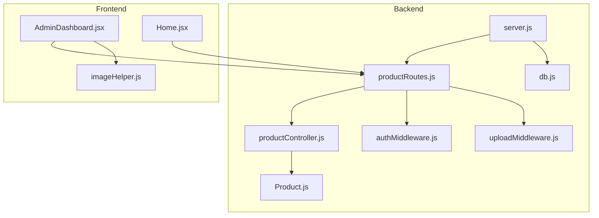
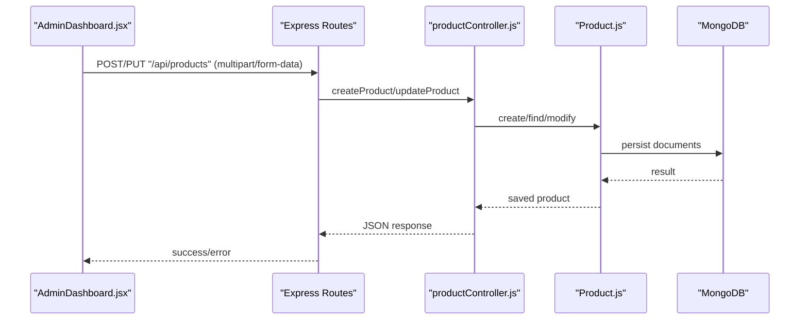
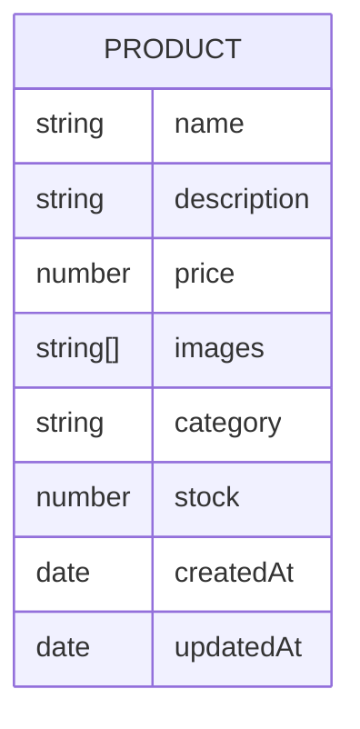
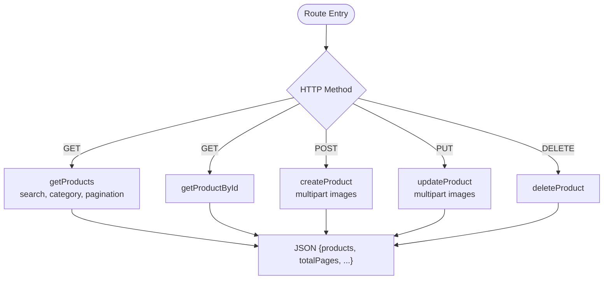
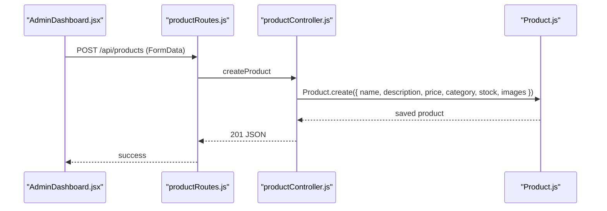
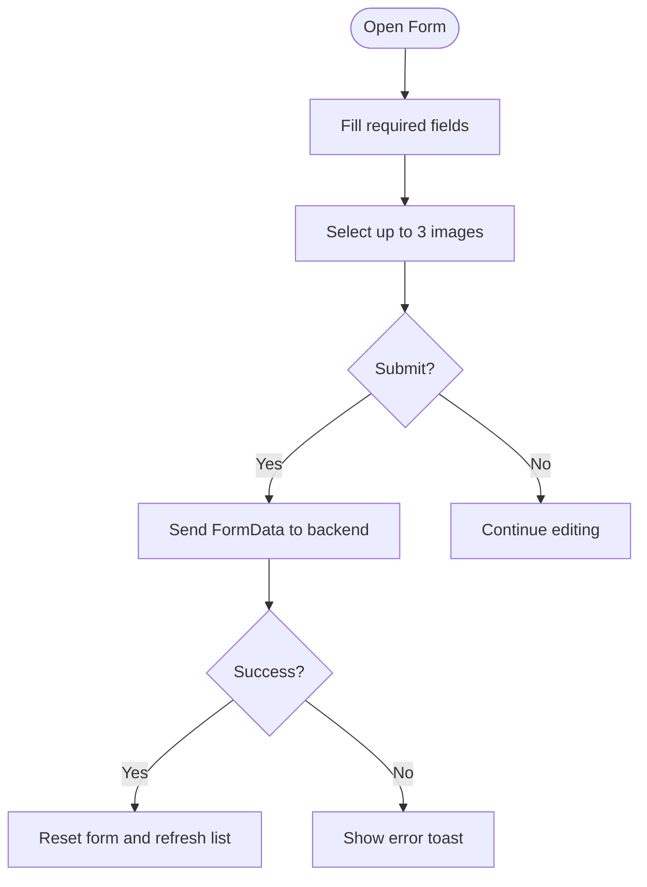
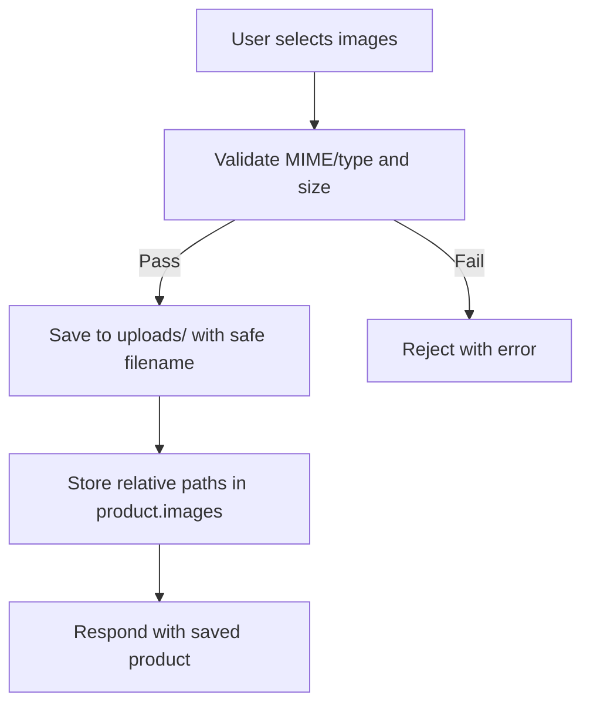
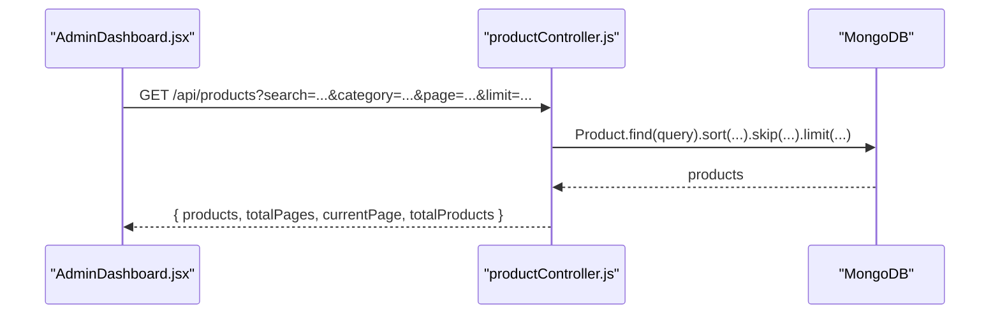
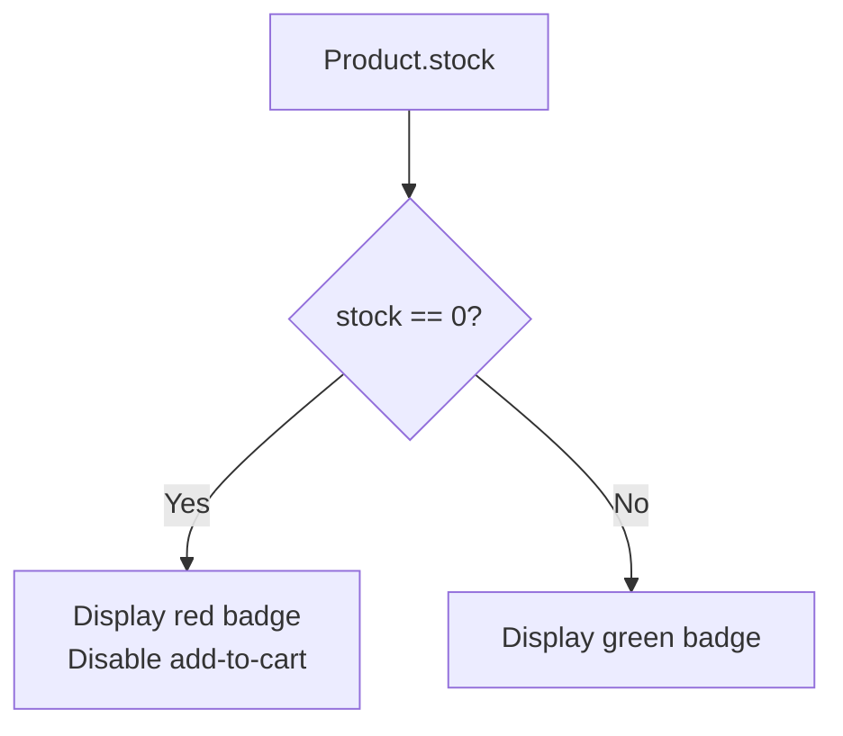
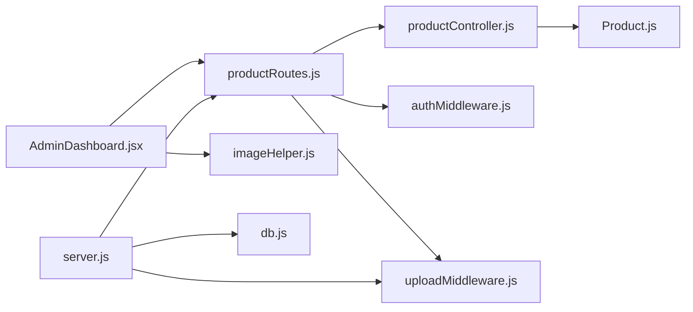

# Product Administration

<cite>
**Referenced Files in This Document**
- [productController.js](file://backend/controllers/productController.js)
- [Product.js](file://backend/models/Product.js)
- [productRoutes.js](file://backend/routes/productRoutes.js)
- [uploadMiddleware.js](file://backend/middleware/uploadMiddleware.js)
- [authMiddleware.js](file://backend/middleware/authMiddleware.js)
- [AdminDashboard.jsx](file://frontend/src/pages/AdminDashboard.jsx)
- [imageHelper.js](file://frontend/src/utils/imageHelper.js)
- [db.js](file://backend/config/db.js)
- [server.js](file://backend/server.js)
- [Home.jsx](file://frontend/src/pages/Home.jsx)
</cite>

## Table of Contents
1. [Introduction](#introduction)
2. [Project Structure](#project-structure)
3. [Core Components](#core-components)
4. [Architecture Overview](#architecture-overview)
5. [Detailed Component Analysis](#detailed-component-analysis)
6. [Dependency Analysis](#dependency-analysis)
7. [Performance Considerations](#performance-considerations)
8. [Troubleshooting Guide](#troubleshooting-guide)
9. [Conclusion](#conclusion)
10. [Appendices](#appendices)

## Introduction
This document provides comprehensive documentation for the admin product management system. It covers product CRUD operations (create, read, update, delete), form validation, image upload handling, category management, and the product listing table with search, filtering, and pagination. It also explains product inventory management, stock tracking, and low-stock indicators, along with guidance for extending product attributes, custom fields, and advanced filtering options.

## Project Structure
The product administration system spans backend and frontend layers:
- Backend: Express routes, controllers, Mongoose model, authentication middleware, and upload middleware.
- Frontend: Admin dashboard UI for managing products, including forms, image previews, and listing.

**Diagram sources**
- [server.js:58-63](file://backend/server.js#L58-L63)
- [productRoutes.js:12-22](file://backend/routes/productRoutes.js#L12-L22)
- [productController.js:1-127](file://backend/controllers/productController.js#L1-L127)
- [Product.js:1-12](file://backend/models/Product.js#L1-L12)
- [authMiddleware.js:4-20](file://backend/middleware/authMiddleware.js#L4-L20)
- [uploadMiddleware.js:1-30](file://backend/middleware/uploadMiddleware.js#L1-L30)
- [AdminDashboard.jsx:1-259](file://frontend/src/pages/AdminDashboard.jsx#L1-L259)
- [imageHelper.js:1-5](file://frontend/src/utils/imageHelper.js#L1-L5)
- [Home.jsx:19-28](file://frontend/src/pages/Home.jsx#L19-L28)

**Section sources**
- [server.js:58-63](file://backend/server.js#L58-L63)
- [productRoutes.js:12-22](file://backend/routes/productRoutes.js#L12-L22)
- [AdminDashboard.jsx:1-259](file://frontend/src/pages/AdminDashboard.jsx#L1-L259)

## Core Components
- Product model defines the schema for product data, including name, description, price, images, category, and stock.
- Product controller implements CRUD endpoints with search, filtering, and pagination.
- Product routes define protected admin endpoints with multipart image uploads.
- Upload middleware handles local disk storage, file size limits, and allowed image types.
- Authentication middleware enforces admin-only access.
- Admin dashboard frontend provides a form for adding/editing products, image previews, and a listing table.

**Section sources**
- [Product.js:3-10](file://backend/models/Product.js#L3-L10)
- [productController.js:4-127](file://backend/controllers/productController.js#L4-L127)
- [productRoutes.js:14-21](file://backend/routes/productRoutes.js#L14-L21)
- [uploadMiddleware.js:4-28](file://backend/middleware/uploadMiddleware.js#L4-L28)
- [authMiddleware.js:17-20](file://backend/middleware/authMiddleware.js#L17-L20)
- [AdminDashboard.jsx:14-259](file://frontend/src/pages/AdminDashboard.jsx#L14-L259)

## Architecture Overview
The system follows a layered architecture:
- HTTP requests reach routes, which delegate to controllers.
- Controllers interact with the Mongoose model for persistence.
- Authentication middleware ensures only admins can modify products.
- Upload middleware manages image uploads to local storage.
- Frontend communicates via Axios to the backend API.

**Diagram sources**
- [AdminDashboard.jsx:69-95](file://frontend/src/pages/AdminDashboard.jsx#L69-L95)
- [productRoutes.js:19-21](file://backend/routes/productRoutes.js#L19-L21)
- [productController.js:52-113](file://backend/controllers/productController.js#L52-L113)
- [Product.js:1-12](file://backend/models/Product.js#L1-L12)

## Detailed Component Analysis

### Product Model
The Product model defines the shape of product documents stored in MongoDB. It includes:
- name: required string
- description: required string
- price: required number
- images: array of strings (image URLs)
- category: required string
- stock: required number (default 0)
- timestamps: createdAt and updatedAt

**Diagram sources**
- [Product.js:3-10](file://backend/models/Product.js#L3-L10)

**Section sources**
- [Product.js:3-10](file://backend/models/Product.js#L3-L10)

### Product Routes and Middleware
- GET /api/products: Public listing with search and category filters, pagination.
- GET /api/products/:id: Public single product retrieval.
- POST /api/products: Admin-only creation with image upload (max 3 images).
- PUT /api/products/:id: Admin-only update with optional image replacement.
- DELETE /api/products/:id: Admin-only deletion.
- Authentication: protect and admin middleware enforce JWT and admin role.
- Upload: upload.array('images', 3) enforces up to three images per request.

**Diagram sources**
- [productRoutes.js:14-21](file://backend/routes/productRoutes.js#L14-L21)
- [productController.js:4-127](file://backend/controllers/productController.js#L4-L127)

**Section sources**
- [productRoutes.js:14-21](file://backend/routes/productRoutes.js#L14-L21)
- [authMiddleware.js:4-20](file://backend/middleware/authMiddleware.js#L4-L20)
- [uploadMiddleware.js:14-28](file://backend/middleware/uploadMiddleware.js#L14-L28)

### Product Controller: CRUD and Search
- getProducts: Builds a query with optional search (name/description regex) and category filter, sorts by newest first, paginates results, and returns metadata.
- getProductById: Retrieves a single product by ID.
- createProduct: Creates a product with validated numeric fields and image paths derived from uploaded files.
- updateProduct: Updates product fields, merges existing and new images, enforces a maximum of three images, and runs validators.
- deleteProduct: Removes a product by ID.

**Diagram sources**
- [AdminDashboard.jsx:73-86](file://frontend/src/pages/AdminDashboard.jsx#L73-L86)
- [productRoutes.js:19](file://backend/routes/productRoutes.js#L19)
- [productController.js:52-73](file://backend/controllers/productController.js#L52-L73)
- [Product.js:1-12](file://backend/models/Product.js#L1-L12)

**Section sources**
- [productController.js:4-127](file://backend/controllers/productController.js#L4-L127)

### Form Validation and User Experience
- Admin dashboard form enforces required fields for name, description, price, stock, and category.
- Price input uses numeric type with decimal support.
- Stock input uses numeric type.
- Category dropdown restricts choices to predefined options.
- Image upload allows up to three images, with previews and removal capability.
- Submission uses FormData with multipart encoding.

**Diagram sources**
- [AdminDashboard.jsx:14-259](file://frontend/src/pages/AdminDashboard.jsx#L14-L259)

**Section sources**
- [AdminDashboard.jsx:14-259](file://frontend/src/pages/AdminDashboard.jsx#L14-L259)

### Image Upload Handling
- Local disk storage configured with multer.diskStorage.
- Destination: uploads/.
- Filename: timestamp + random + original extension.
- Size limit: 5 MB.
- Allowed types: jpg, jpeg, png, webp.
- Backend stores relative paths under /uploads/.
- Frontend resolves image URLs via imageHelper and serves static uploads.

**Diagram sources**
- [uploadMiddleware.js:4-28](file://backend/middleware/uploadMiddleware.js#L4-L28)
- [server.js:54-55](file://backend/server.js#L54-L55)
- [AdminDashboard.jsx:53-67](file://frontend/src/pages/AdminDashboard.jsx#L53-L67)
- [imageHelper.js:1-5](file://frontend/src/utils/imageHelper.js#L1-L5)

**Section sources**
- [uploadMiddleware.js:4-28](file://backend/middleware/uploadMiddleware.js#L4-L28)
- [server.js:54-55](file://backend/server.js#L54-L55)
- [AdminDashboard.jsx:53-67](file://frontend/src/pages/AdminDashboard.jsx#L53-L67)
- [imageHelper.js:1-5](file://frontend/src/utils/imageHelper.js#L1-L5)

### Product Listing Table, Sorting, Filtering, and Search
- Sorting: Results sorted by newest first.
- Filtering: Category filter applied when a category is selected.
- Search: Full-text search across name and description using regex with case-insensitive option.
- Pagination: Page and limit query parameters control offset and batch size.
- Frontend table displays product image preview, name, description, category, price, stock, and action buttons.

**Diagram sources**
- [AdminDashboard.jsx:42-51](file://frontend/src/pages/AdminDashboard.jsx#L42-L51)
- [productController.js:4-37](file://backend/controllers/productController.js#L4-L37)

**Section sources**
- [productController.js:4-37](file://backend/controllers/productController.js#L4-L37)
- [AdminDashboard.jsx:215-252](file://frontend/src/pages/AdminDashboard.jsx#L215-L252)

### Inventory Management, Stock Tracking, and Low-Stock Alerts
- Stock field is required and defaults to zero.
- Frontend renders stock counts with color-coded badges indicating availability.
- Out-of-stock items disable add-to-cart actions in the storefront.

**Diagram sources**
- [Product.js:9](file://backend/models/Product.js#L9)
- [AdminDashboard.jsx:240-242](file://frontend/src/pages/AdminDashboard.jsx#L240-L242)
- [Home.jsx:64-70](file://frontend/src/pages/Home.jsx#L64-L70)

**Section sources**
- [Product.js:9](file://backend/models/Product.js#L9)
- [AdminDashboard.jsx:240-242](file://frontend/src/pages/AdminDashboard.jsx#L240-L242)
- [Home.jsx:64-70](file://frontend/src/pages/Home.jsx#L64-L70)

### Extending Product Attributes, Custom Fields, and Advanced Filtering
- Extend Product model by adding new fields to the schema. Ensure required/optional constraints and defaults are defined.
- Update controllers to accept new fields from requests and apply validation.
- Adjust frontend forms to collect and submit new fields.
- For advanced filtering, add new query parameters in controllers and build appropriate MongoDB queries.
- For bulk actions, implement batch endpoints (e.g., delete multiple by IDs) and corresponding frontend UI controls.

[No sources needed since this section provides general guidance]

## Dependency Analysis
Key dependencies and relationships:
- Routes depend on controllers and middleware.
- Controllers depend on the Product model.
- Frontend depends on backend routes and image helper utilities.
- Static uploads are served by Express static middleware.

**Diagram sources**
- [productRoutes.js:12-22](file://backend/routes/productRoutes.js#L12-L22)
- [productController.js:1-127](file://backend/controllers/productController.js#L1-L127)
- [Product.js:1-12](file://backend/models/Product.js#L1-L12)
- [authMiddleware.js:4-20](file://backend/middleware/authMiddleware.js#L4-L20)
- [uploadMiddleware.js:1-30](file://backend/middleware/uploadMiddleware.js#L1-L30)
- [AdminDashboard.jsx:1-259](file://frontend/src/pages/AdminDashboard.jsx#L1-L259)
- [imageHelper.js:1-5](file://frontend/src/utils/imageHelper.js#L1-L5)
- [server.js:54-55](file://backend/server.js#L54-L55)
- [db.js:5-13](file://backend/config/db.js#L5-L13)

**Section sources**
- [productRoutes.js:12-22](file://backend/routes/productRoutes.js#L12-L22)
- [productController.js:1-127](file://backend/controllers/productController.js#L1-L127)
- [AdminDashboard.jsx:1-259](file://frontend/src/pages/AdminDashboard.jsx#L1-L259)

## Performance Considerations
- Indexing: Consider adding indexes on frequently queried fields (e.g., category, name, description) to improve search performance.
- Pagination: Use reasonable page sizes and avoid very large limits to prevent heavy payloads.
- Image optimization: Compress images before upload or serve optimized variants to reduce bandwidth.
- Caching: Implement caching for product listings if data changes infrequently.
- Validation: Keep validation close to the controller to fail fast and reduce unnecessary database writes.

[No sources needed since this section provides general guidance]

## Troubleshooting Guide
Common issues and resolutions:
- Authentication errors: Ensure Authorization header is present and valid; admin role is required.
- File upload errors: Verify allowed types (jpg, jpeg, png, webp) and size limit (5 MB); confirm uploads directory exists.
- Product not found: Confirm product ID validity and endpoint correctness.
- Validation failures: Ensure required fields are provided and numeric fields are valid numbers.
- Image paths: Confirm static serving of /uploads and correct base URL resolution.

**Section sources**
- [authMiddleware.js:4-20](file://backend/middleware/authMiddleware.js#L4-L20)
- [uploadMiddleware.js:17-27](file://backend/middleware/uploadMiddleware.js#L17-L27)
- [productController.js:40-48](file://backend/controllers/productController.js#L40-L48)
- [imageHelper.js:1-5](file://frontend/src/utils/imageHelper.js#L1-L5)

## Conclusion
The admin product management system provides a robust foundation for managing products, including secure CRUD operations, image handling, and listing with search and filtering. The schema and controllers are straightforward to extend for additional attributes and advanced features. Following the guidance in this document will help maintain consistency and scalability as requirements evolve.

## Appendices

### API Endpoints Summary
- GET /api/products: List products with search, category filter, pagination.
- GET /api/products/:id: Retrieve a single product.
- POST /api/products: Admin-only creation with images.
- PUT /api/products/:id: Admin-only update with images.
- DELETE /api/products/:id: Admin-only deletion.

**Section sources**
- [productRoutes.js:14-21](file://backend/routes/productRoutes.js#L14-L21)

### Product Data Structure
- name: string (required)
- description: string (required)
- price: number (required)
- images: string[] (image URLs)
- category: string (required)
- stock: number (required, default 0)
- timestamps: createdAt, updatedAt

**Section sources**
- [Product.js:3-10](file://backend/models/Product.js#L3-L10)

### Validation Rules
- Required fields: name, description, price, category, stock.
- Numeric fields: price and stock must be numbers.
- Image constraints: up to 3 images, allowed types jpg/jpeg/png/webp, max 5 MB.

**Section sources**
- [productController.js:52-73](file://backend/controllers/productController.js#L52-L73)
- [uploadMiddleware.js:16-27](file://backend/middleware/uploadMiddleware.js#L16-L27)
- [AdminDashboard.jsx:161,165,170,174,180](file://frontend/src/pages/AdminDashboard.jsx#L161,L165,L170,L174,L180)