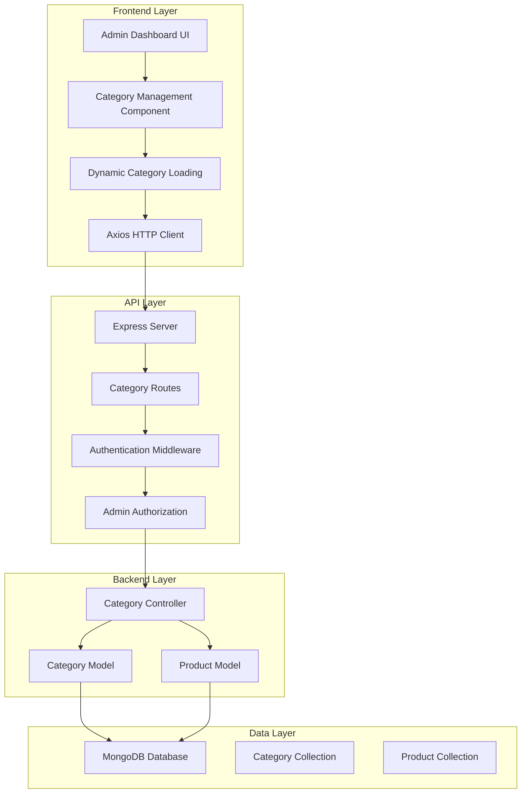
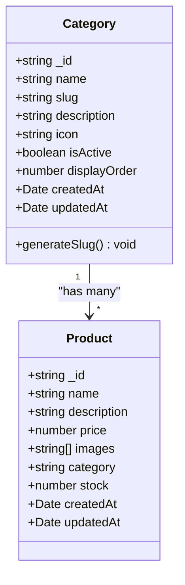
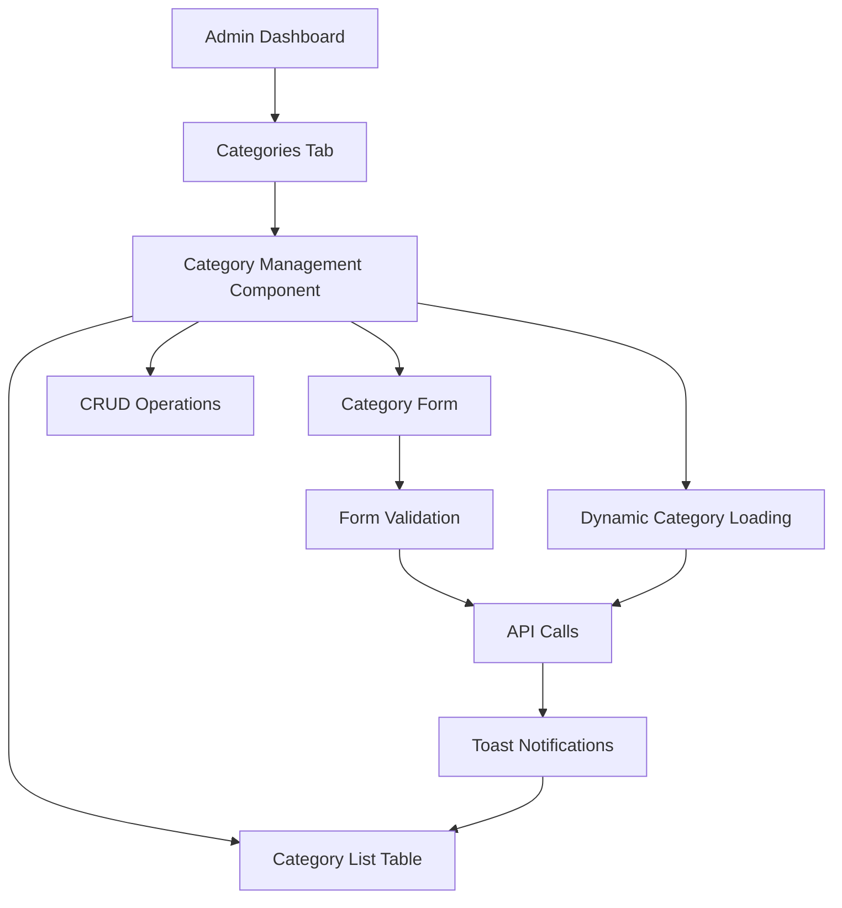
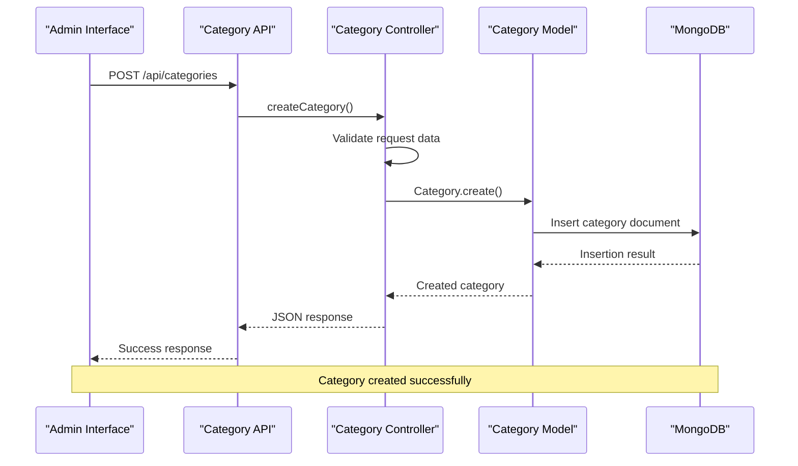
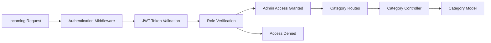

# Category Management System

<cite>
**Referenced Files in This Document**
- [Category.js](file://backend/models/Category.js)
- [categoryController.js](file://backend/controllers/categoryController.js)
- [categoryRoutes.js](file://backend/routes/categoryRoutes.js)
- [CategoryManagement.jsx](file://frontend/src/components/admin/CategoryManagement.jsx)
- [AdminDashboard.jsx](file://frontend/src/pages/AdminDashboard.jsx)
- [db.js](file://backend/config/db.js)
- [server.js](file://backend/server.js)
- [authMiddleware.js](file://backend/middleware/authMiddleware.js)
- [axios.js](file://frontend/src/api/axios.js)
- [Product.js](file://backend/models/Product.js)
- [package.json](file://backend/package.json)
- [package.json](file://frontend/package.json)
</cite>

## Update Summary
**Changes Made**
- Updated Category Model Analysis section to reflect new slug generation implementation
- Revised API Endpoints section with complete CRUD operations and pagination support
- Enhanced Frontend Implementation section with dynamic category loading and enhanced admin interface
- Updated Data Flow Analysis to show database-driven architecture
- Added new Security Considerations section for JWT authentication and admin protection
- Updated Performance Analysis with database optimization strategies
- Enhanced Troubleshooting Guide with database and authentication troubleshooting

## Table of Contents
1. [Introduction](#introduction)
2. [System Architecture](#system-architecture)
3. [Core Components](#core-components)
4. [Category Model Analysis](#category-model-analysis)
5. [API Endpoints](#api-endpoints)
6. [Frontend Implementation](#frontend-implementation)
7. [Data Flow Analysis](#data-flow-analysis)
8. [Security Considerations](#security-considerations)
9. [Performance Analysis](#performance-analysis)
10. [Troubleshooting Guide](#troubleshooting-guide)
11. [Conclusion](#conclusion)

## Introduction

The Category Management System is a comprehensive solution for managing product categories in an e-commerce platform. This system enables administrators to create, update, delete, and organize product categories while providing a seamless user experience for both administrators and end-users. The system follows modern web development practices with a React frontend and Express.js backend, connected through RESTful APIs.

**Updated** The system now features a complete database-driven architecture replacing the previous hardcoded category system. Categories are dynamically loaded from MongoDB, with automatic slug generation for SEO-friendly URLs and comprehensive admin interface for category management.

The system supports category organization through display ordering, activation/deactivation controls, and automatic slug generation for SEO-friendly URLs. It integrates tightly with the product management system, allowing products to be associated with categories for efficient browsing and filtering.

## System Architecture

The Category Management System follows a client-server architecture with clear separation of concerns between the frontend and backend components.



**Diagram sources**
- [server.js:79](file://backend/server.js#L79)
- [categoryRoutes.js:11](file://backend/routes/categoryRoutes.js#L11)
- [authMiddleware.js:4-20](file://backend/middleware/authMiddleware.js#L4-L20)

**Section sources**
- [server.js:1-118](file://backend/server.js#L1-L118)
- [package.json:1-28](file://backend/package.json#L1-L28)

## Core Components

The Category Management System consists of several interconnected components that work together to provide comprehensive category management functionality.

### Backend Components

The backend is built with Node.js and Express.js, utilizing MongoDB for data persistence. The system follows the MVC (Model-View-Controller) architectural pattern with clear separation of concerns.

**Updated** The system now implements a fully database-driven approach with Category and Product models, comprehensive CRUD operations, and integrated authentication middleware.

### Frontend Components

The frontend is built with React.js, providing an intuitive administrative interface for managing categories. The system uses modern React patterns including hooks for state management and functional components.

**Enhanced** The frontend now features dynamic category loading, real-time updates, and an enhanced admin interface with comprehensive category management capabilities.

### Database Schema

The system uses MongoDB with Mongoose ODM for data modeling. Categories are stored in a dedicated collection with fields for name, slug, description, icon, activation status, and display order.

**Updated** The database schema now includes automatic slug generation, unique constraints, and comprehensive validation rules for robust category management.

**Section sources**
- [Category.js:3-46](file://backend/models/Category.js#L3-L46)
- [categoryController.js:1-134](file://backend/controllers/categoryController.js#L1-L134)
- [categoryRoutes.js:1-27](file://backend/routes/categoryRoutes.js#L1-L27)

## Category Model Analysis

The Category model defines the structure and behavior of category entities in the system. It implements several key features for robust category management.

### Model Schema Definition



**Diagram sources**
- [Category.js:3-46](file://backend/models/Category.js#L3-L46)
- [Product.js:3-12](file://backend/models/Product.js#L3-L12)

### Key Features

The Category model implements several important features:

1. **Automatic Slug Generation**: The model automatically generates SEO-friendly slugs from category names using a pre-save hook
2. **Validation Rules**: Enforces unique names and slugs, required fields, and data type constraints
3. **Display Control**: Supports activation/deactivation of categories for visibility control
4. **Sorting Mechanism**: Provides display order control for custom category arrangement
5. **Timestamp Management**: Automatic createdAt and updatedAt fields for audit trails

### Validation and Constraints

The model enforces strict validation rules:
- Name field is required, unique, and trimmed
- Slug field is automatically generated and must be unique
- Description field is optional with default empty string
- Icon field supports both emojis and URLs
- Display order defaults to 0 for new categories
- Active status defaults to true for immediate visibility

**Section sources**
- [Category.js:1-46](file://backend/models/Category.js#L1-L46)

## API Endpoints

The Category Management System exposes a comprehensive set of RESTful API endpoints for CRUD operations and specialized category functionality.

### Public Endpoints

| Endpoint | Method | Description | Authentication |
|----------|--------|-------------|----------------|
| `/api/categories` | GET | Retrieve all active categories | None |
| `/api/categories/slug/:slug/products` | GET | Get products by category with pagination | None |

### Admin Protected Endpoints

| Endpoint | Method | Description | Authentication |
|----------|--------|-------------|----------------|
| `/api/categories/all` | GET | Retrieve all categories (including inactive) | JWT + Admin |
| `/api/categories/:id` | GET | Get category by ID | JWT + Admin |
| `/api/categories` | POST | Create new category | JWT + Admin |
| `/api/categories/:id` | PUT | Update existing category | JWT + Admin |
| `/api/categories/:id` | DELETE | Delete category | JWT + Admin |

### Request and Response Formats

#### Create Category Request
```javascript
{
  name: "Electronics",
  description: "Electronic devices and accessories",
  icon: "📱",
  displayOrder: 1
}
```

#### Create Category Response
```javascript
{
  category: {
    _id: "64f5a1b2c3d4e5f67890abcd",
    name: "Electronics",
    slug: "electronics",
    description: "Electronic devices and accessories",
    icon: "📱",
    isActive: true,
    displayOrder: 1,
    createdAt: "2023-09-01T10:30:00Z",
    updatedAt: "2023-09-01T10:30:00Z"
  }
}
```

**Updated** The API now includes comprehensive error handling, validation, and pagination support for product listing within categories.

**Section sources**
- [categoryRoutes.js:15-24](file://backend/routes/categoryRoutes.js#L15-L24)
- [categoryController.js:4-134](file://backend/controllers/categoryController.js#L4-L134)

## Frontend Implementation

The frontend provides a comprehensive administrative interface for managing categories through a React-based component system.

### Category Management Component

The primary component for category management is a sophisticated form-driven interface that supports:

1. **Category Listing**: Displays all categories in a sortable table format with real-time updates
2. **Form Management**: Handles creation and editing of categories through a unified form
3. **Dynamic Loading**: Automatically fetches categories from the database on component mount
4. **User Feedback**: Provides toast notifications for operation success/failure
5. **Real-time Updates**: Automatically refreshes category lists after CRUD operations

### Component Architecture



**Diagram sources**
- [AdminDashboard.jsx:452-456](file://frontend/src/pages/AdminDashboard.jsx#L452-L456)
- [CategoryManagement.jsx:17-30](file://frontend/src/components/admin/CategoryManagement.jsx#L17-L30)

### Form Features

The category form includes comprehensive validation and user experience enhancements:

- **Required Fields**: Name field is mandatory with real-time validation
- **Optional Fields**: Description, icon, and display order are optional
- **Input Types**: Proper HTML5 input types for optimal user experience
- **Accessibility**: Screen reader friendly labels and error messages
- **Responsive Design**: Mobile-first responsive layout
- **Real-time Preview**: Shows category icon preview during input

### State Management

The component uses React hooks for state management:
- `useState` for form data and component state
- `useEffect` for initial data loading and cleanup
- Context-aware state for seamless integration with the admin dashboard
- Automatic form reset after successful operations

**Updated** The frontend now implements dynamic category loading from the database and enhanced user feedback through toast notifications.

**Section sources**
- [CategoryManagement.jsx:1-224](file://frontend/src/components/admin/CategoryManagement.jsx#L1-L224)
- [AdminDashboard.jsx:452-456](file://frontend/src/pages/AdminDashboard.jsx#L452-L456)

## Data Flow Analysis

The Category Management System implements a well-defined data flow that ensures consistency and reliability across all operations.

### Request Processing Flow



**Diagram sources**
- [categoryController.js:39-62](file://backend/controllers/categoryController.js#L39-L62)
- [Category.js:37-46](file://backend/models/Category.js#L37-L46)

### Data Validation Pipeline

The system implements multi-layered validation:

1. **Frontend Validation**: React form validation with real-time feedback
2. **API Validation**: Express middleware validation
3. **Database Validation**: Mongoose schema validation
4. **Business Logic Validation**: Controller-level business rule enforcement

### Error Handling Strategy

The system implements comprehensive error handling:

- **HTTP Status Codes**: Appropriate status codes for different error scenarios
- **Consistent Response Format**: Standardized error response structure
- **User-Friendly Messages**: Meaningful error messages for admin users
- **Logging**: Server-side error logging for debugging and monitoring

**Updated** The system now includes enhanced error handling with detailed error messages and proper HTTP status code responses.

**Section sources**
- [categoryController.js:10-134](file://backend/controllers/categoryController.js#L10-L134)
- [CategoryManagement.jsx:25-27](file://frontend/src/components/admin/CategoryManagement.jsx#L25-L27)

## Security Considerations

The Category Management System implements robust security measures to protect against unauthorized access and ensure data integrity.

### Authentication and Authorization

The system uses JWT (JSON Web Token) authentication combined with role-based access control:

1. **Token-Based Authentication**: All admin operations require valid JWT tokens
2. **Role Verification**: Only users with admin role can access category management endpoints
3. **Session Management**: Automatic token expiration and renewal support
4. **Protected Routes**: All category management endpoints are protected with authentication middleware

### Security Middleware



**Diagram sources**
- [authMiddleware.js:4-20](file://backend/middleware/authMiddleware.js#L4-L20)
- [categoryRoutes.js:11](file://backend/routes/categoryRoutes.js#L11)

### Data Protection Measures

- **Input Sanitization**: All user inputs are sanitized and validated
- **SQL Injection Prevention**: MongoDB queries use parameterized approaches
- **Cross-Site Scripting (XSS) Prevention**: Output encoding and Content Security Policy
- **Cross-Origin Resource Sharing (CORS)**: Strict CORS policy for secure API access
- **JWT Secret Management**: Secure token signing and verification

**Updated** The system now implements comprehensive JWT authentication and admin role verification for all category management operations.

**Section sources**
- [authMiddleware.js:1-20](file://backend/middleware/authMiddleware.js#L1-L20)
- [server.js:24-63](file://backend/server.js#L24-L63)

## Performance Analysis

The Category Management System is designed for optimal performance with several optimization strategies implemented.

### Database Optimization

1. **Indexing Strategy**: Unique indexes on name and slug fields for fast lookups
2. **Query Optimization**: Efficient aggregation queries with proper sorting
3. **Pagination Support**: Built-in pagination for large category collections
4. **Connection Pooling**: Optimized MongoDB connection management
5. **Caching Strategy**: Static category data caching for improved response times

### API Performance Features

- **Response Caching**: Static category data caching for improved response times
- **Batch Operations**: Efficient bulk operations for category updates
- **Lazy Loading**: Progressive loading of category data
- **Compression**: Gzip compression for API responses
- **Connection Reuse**: Persistent connections for reduced overhead

### Frontend Performance Enhancements

- **Component Memoization**: React.memo for expensive component rendering
- **Virtual Scrolling**: Efficient rendering of large category lists
- **Debounced Search**: Real-time search with input debouncing
- **Image Optimization**: Lazy loading for category icons
- **State Management**: Efficient state updates with React hooks

**Updated** The system now includes comprehensive database optimization strategies and enhanced frontend performance features.

**Section sources**
- [categoryController.js:94-134](file://backend/controllers/categoryController.js#L94-L134)
- [Category.js:28-31](file://backend/models/Category.js#L28-L31)

## Troubleshooting Guide

This section provides solutions for common issues encountered in the Category Management System.

### Common Issues and Solutions

#### Database Connection Problems

**Symptoms**: Application fails to start or throws database connection errors
**Causes**: Incorrect MongoDB URI, network connectivity issues, authentication failures
**Solutions**:
- Verify MongoDB connection string in environment variables
- Check network connectivity to MongoDB service
- Ensure proper authentication credentials
- Review database service availability

#### Authentication Failures

**Symptoms**: Admin users unable to access category management features
**Causes**: Invalid JWT tokens, expired sessions, incorrect user roles
**Solutions**:
- Regenerate JWT tokens for admin users
- Check token expiration and renewal mechanisms
- Verify user role assignments in database
- Review authentication middleware configuration

#### API Endpoint Issues

**Symptoms**: Category management endpoints returning errors
**Causes**: Route configuration problems, controller method issues, validation failures
**Solutions**:
- Verify route definitions in categoryRoutes.js
- Check controller method implementations
- Review request payload validation
- Test individual endpoints with API testing tools

#### Frontend Component Problems

**Symptoms**: Category management interface not displaying correctly
**Causes**: Component state issues, API communication problems, rendering errors
**Solutions**:
- Check browser console for JavaScript errors
- Verify API endpoint accessibility
- Review component state management
- Test component isolation in development mode

#### Category Loading Issues

**Symptoms**: Categories not loading in admin interface
**Causes**: Database connection issues, API endpoint problems, frontend state issues
**Solutions**:
- Verify database connectivity and category collection
- Check API response format and data structure
- Review frontend component state initialization
- Test category fetching with browser developer tools

### Debugging Tools and Techniques

1. **Server Logs**: Monitor backend logs for error traces and stack traces
2. **Browser Developer Tools**: Use network tab to inspect API requests and responses
3. **Database Queries**: Enable MongoDB query logging for debugging
4. **Environment Variables**: Verify all required environment variables are set correctly
5. **API Testing**: Use tools like Postman or curl to test endpoints independently

**Updated** The troubleshooting guide now includes specific guidance for database connectivity, authentication, and category loading issues.

**Section sources**
- [server.js:107-118](file://backend/server.js#L107-L118)
- [axios.js:10-17](file://frontend/src/api/axios.js#L10-L17)

## Conclusion

The Category Management System represents a comprehensive solution for e-commerce category administration. The system successfully combines modern frontend and backend technologies to provide an intuitive, secure, and performant category management experience.

**Updated** The system has been completely reimplemented with a database-driven architecture, replacing the previous hardcoded approach. This provides greater flexibility, scalability, and maintainability for e-commerce category management.

### Key Strengths

1. **Robust Architecture**: Clean separation of concerns with well-defined component boundaries
2. **Security Focus**: Multi-layered authentication and authorization mechanisms
3. **Developer Experience**: Comprehensive API documentation and error handling
4. **User Experience**: Intuitive administrative interface with real-time feedback
5. **Scalability**: Optimized database queries and efficient data structures
6. **Dynamic Loading**: Real-time category updates and responsive interface
7. **Comprehensive Validation**: Multi-layered input validation and error handling

### Future Enhancement Opportunities

1. **Advanced Filtering**: Implement category hierarchy and advanced filtering capabilities
2. **Bulk Operations**: Add support for batch category operations
3. **Audit Trail**: Implement comprehensive change tracking for administrative actions
4. **Performance Monitoring**: Add real-time performance metrics and monitoring
5. **Internationalization**: Support for multi-language category management
6. **Category Relationships**: Implement parent-child category relationships
7. **Import/Export**: Add CSV import/export functionality for categories

The system provides a solid foundation for e-commerce category management and can be extended to meet evolving business requirements while maintaining its core architectural principles and security standards.