# Product Administration

<cite>
**Referenced Files in This Document**
- [productController.js](file://backend/controllers/productController.js)
- [Product.js](file://backend/models/Product.js)
- [productRoutes.js](file://backend/routes/productRoutes.js)
- [categoryController.js](file://backend/controllers/categoryController.js)
- [Category.js](file://backend/models/Category.js)
- [categoryRoutes.js](file://backend/routes/categoryRoutes.js)
- [uploadMiddleware.js](file://backend/middleware/uploadMiddleware.js)
- [cloudinary.js](file://backend/config/cloudinary.js)
- [authMiddleware.js](file://backend/middleware/authMiddleware.js)
- [AdminDashboard.jsx](file://frontend/src/pages/AdminDashboard.jsx)
- [CategoryManagement.jsx](file://frontend/src/components/admin/CategoryManagement.jsx)
- [imageHelper.js](file://frontend/src/utils/imageHelper.js)
- [db.js](file://backend/config/db.js)
- [server.js](file://backend/server.js)
- [Home.jsx](file://frontend/src/pages/Home.jsx)
</cite>

## Update Summary
**Changes Made**
- Added comprehensive categories management system with dedicated tab in admin dashboard
- Enhanced product creation workflow with dynamic category selection
- Implemented CategoryManagement component for full CRUD operations on categories
- Integrated category data fetching into product management interface
- Added category-based product filtering and organization capabilities

## Table of Contents
1. [Introduction](#introduction)
2. [Project Structure](#project-structure)
3. [Core Components](#core-components)
4. [Architecture Overview](#architecture-overview)
5. [Detailed Component Analysis](#detailed-component-analysis)
6. [Dependency Analysis](#dependency-analysis)
7. [Performance Considerations](#performance-considerations)
8. [Troubleshooting Guide](#troubleshooting-guide)
9. [Conclusion](#conclusion)
10. [Appendices](#appendices)

## Introduction
This document provides comprehensive documentation for the admin product management system. It covers product CRUD operations (create, read, update, delete), form validation, image upload handling, category management, and the product listing table with search, filtering, and pagination. The system now includes an enhanced categories management feature with a dedicated admin tab, dynamic category selection in product forms, and improved product creation workflow with automatic category population.

## Project Structure
The product administration system spans backend and frontend layers with enhanced category management capabilities:
- Backend: Express routes, controllers, Mongoose models, authentication middleware, and Cloudinary upload middleware.
- Frontend: Admin dashboard UI for managing products and categories, including forms, image previews, and listing tables.

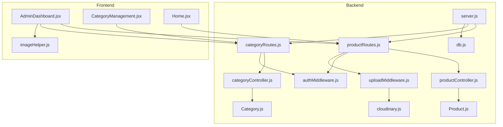

**Diagram sources**
- [server.js:58-63](file://backend/server.js#L58-L63)
- [productRoutes.js:12-22](file://backend/routes/productRoutes.js#L12-L22)
- [categoryRoutes.js:1-27](file://backend/routes/categoryRoutes.js#L1-L27)
- [productController.js:1-137](file://backend/controllers/productController.js#L1-L137)
- [categoryController.js:1-134](file://backend/controllers/categoryController.js#L1-L134)
- [Product.js:1-12](file://backend/models/Product.js#L1-L12)
- [Category.js:1-46](file://backend/models/Category.js#L1-L46)
- [authMiddleware.js:4-20](file://backend/middleware/authMiddleware.js#L4-L20)
- [uploadMiddleware.js:1-56](file://backend/middleware/uploadMiddleware.js#L1-L56)
- [cloudinary.js:1-13](file://backend/config/cloudinary.js#L1-L13)
- [AdminDashboard.jsx:1-465](file://frontend/src/pages/AdminDashboard.jsx#L1-L465)
- [CategoryManagement.jsx:1-224](file://frontend/src/components/admin/CategoryManagement.jsx#L1-L224)
- [imageHelper.js:1-5](file://frontend/src/utils/imageHelper.js#L1-L5)
- [Home.jsx:19-28](file://frontend/src/pages/Home.jsx#L19-L28)

**Section sources**
- [server.js:58-63](file://backend/server.js#L58-L63)
- [productRoutes.js:12-22](file://backend/routes/productRoutes.js#L12-L22)
- [categoryRoutes.js:1-27](file://backend/routes/categoryRoutes.js#L1-L27)
- [AdminDashboard.jsx:1-465](file://frontend/src/pages/AdminDashboard.jsx#L1-L465)

## Core Components
- Product model defines the schema for product data, including name, description, price, images, category, and stock.
- Product controller implements CRUD endpoints with search, filtering, and pagination.
- Category model defines the schema for category data, including name, slug, description, icon, and display order.
- Category controller implements CRUD endpoints for category management with activation/deactivation capabilities.
- Product routes define protected admin endpoints with Cloudinary image uploads.
- Category routes define protected admin endpoints for category CRUD operations.
- Upload middleware handles Cloudinary integration for image storage, file size limits, and allowed image types.
- Authentication middleware enforces admin-only access.
- Admin dashboard frontend provides tabs for products, categories, orders, and admins, with forms for adding/editing products and categories.
- Category management component provides a dedicated interface for category CRUD operations.

**Section sources**
- [Product.js:3-10](file://backend/models/Product.js#L3-L10)
- [Category.js:3-35](file://backend/models/Category.js#L3-L35)
- [productController.js:4-137](file://backend/controllers/productController.js#L4-L137)
- [categoryController.js:4-134](file://backend/controllers/categoryController.js#L4-L134)
- [productRoutes.js:14-21](file://backend/routes/productRoutes.js#L14-L21)
- [categoryRoutes.js:15-24](file://backend/routes/categoryRoutes.js#L15-L24)
- [uploadMiddleware.js:5-56](file://backend/middleware/uploadMiddleware.js#L5-L56)
- [authMiddleware.js:17-20](file://backend/middleware/authMiddleware.js#L17-L20)
- [AdminDashboard.jsx:14-465](file://frontend/src/pages/AdminDashboard.jsx#L14-L465)
- [CategoryManagement.jsx:5-224](file://frontend/src/components/admin/CategoryManagement.jsx#L5-L224)

## Architecture Overview
The system follows a layered architecture with enhanced category management:
- HTTP requests reach routes, which delegate to controllers.
- Controllers interact with Mongoose models for persistence.
- Authentication middleware ensures only admins can modify products and categories.
- Upload middleware manages Cloudinary image uploads with automatic optimization.
- Frontend communicates via Axios to the backend API with dedicated tabs for different administrative functions.

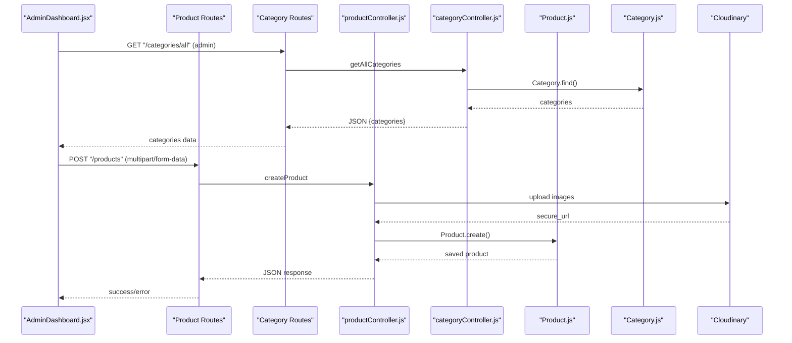

**Diagram sources**
- [AdminDashboard.jsx:101-108](file://frontend/src/pages/AdminDashboard.jsx#L101-L108)
- [AdminDashboard.jsx:126-152](file://frontend/src/pages/AdminDashboard.jsx#L126-L152)
- [categoryRoutes.js:19-24](file://backend/routes/categoryRoutes.js#L19-L24)
- [productRoutes.js:19-21](file://backend/routes/productRoutes.js#L19-L21)
- [productController.js:52-83](file://backend/controllers/productController.js#L52-L83)
- [categoryController.js:16-24](file://backend/controllers/categoryController.js#L16-L24)
- [uploadMiddleware.js:11-27](file://backend/middleware/uploadMiddleware.js#L11-L27)

## Detailed Component Analysis

### Product Model
The Product model defines the shape of product documents stored in MongoDB. It includes:
- name: required string
- description: required string
- price: required number
- images: array of strings (Cloudinary secure URLs)
- category: required string
- stock: required number (default 0)
- timestamps: createdAt and updatedAt

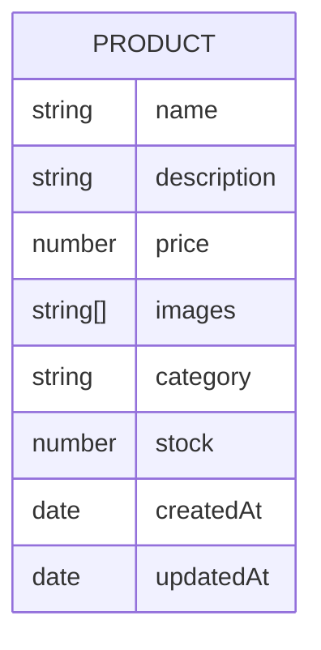

**Diagram sources**
- [Product.js:3-10](file://backend/models/Product.js#L3-L10)

**Section sources**
- [Product.js:3-10](file://backend/models/Product.js#L3-L10)

### Category Model
The Category model defines the schema for category documents with enhanced features:
- name: required unique string
- slug: required unique string (auto-generated from name)
- description: optional string
- icon: optional string (emoji or URL)
- isActive: boolean flag for category visibility
- displayOrder: number for sorting categories
- timestamps: createdAt and updatedAt

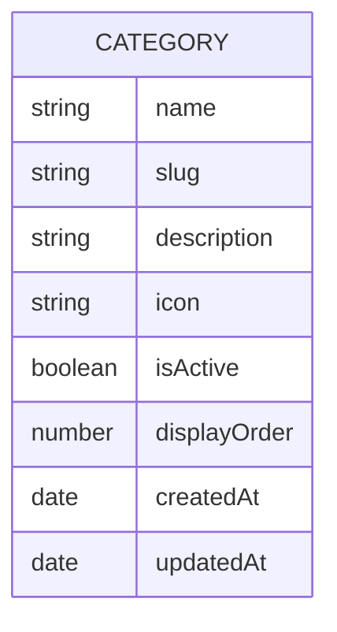

**Diagram sources**
- [Category.js:3-35](file://backend/models/Category.js#L3-L35)

**Section sources**
- [Category.js:3-35](file://backend/models/Category.js#L3-L35)

### Product Routes and Middleware
- GET /api/products: Public listing with search and category filters, pagination.
- GET /api/products/:id: Public single product retrieval.
- POST /api/products: Admin-only creation with Cloudinary image upload (max 3 images).
- PUT /api/products/:id: Admin-only update with optional image replacement.
- DELETE /api/products/:id: Admin-only deletion.
- Authentication: protect and admin middleware enforce JWT and admin role.
- Upload: upload.array('images', 3) enforces up to three images per request with Cloudinary integration.

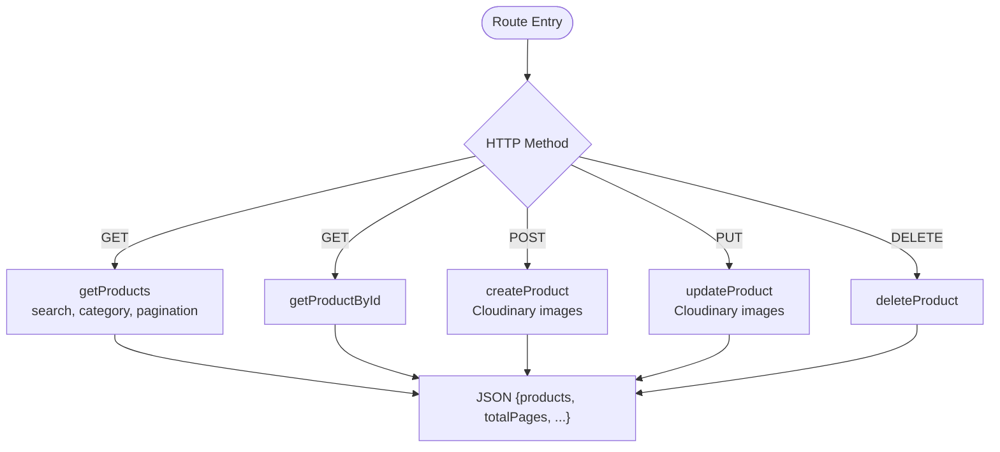

**Diagram sources**
- [productRoutes.js:14-21](file://backend/routes/productRoutes.js#L14-L21)
- [productController.js:4-137](file://backend/controllers/productController.js#L4-L137)

**Section sources**
- [productRoutes.js:14-21](file://backend/routes/productRoutes.js#L14-L21)
- [authMiddleware.js:4-20](file://backend/middleware/authMiddleware.js#L4-L20)
- [uploadMiddleware.js:50-56](file://backend/middleware/uploadMiddleware.js#L50-L56)

### Category Routes and Management
- GET /api/categories: Public listing of active categories (for frontend display).
- GET /api/categories/all: Admin-only listing of all categories (active/inactive).
- GET /api/categories/:id: Admin-only retrieval of specific category.
- POST /api/categories: Admin-only creation of new category.
- PUT /api/categories/:id: Admin-only update of category settings.
- DELETE /api/categories/:id: Admin-only deletion of category.
- Authentication: protect and admin middleware enforce JWT and admin role.
- Enhanced features: category activation/deactivation, display ordering, icon support.

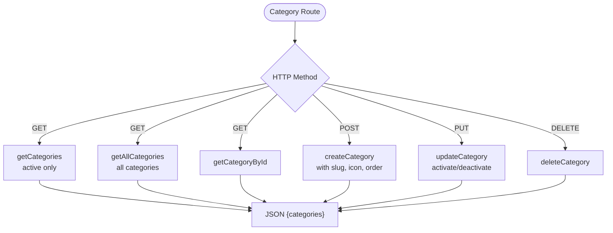

**Diagram sources**
- [categoryRoutes.js:15-24](file://backend/routes/categoryRoutes.js#L15-L24)
- [categoryController.js:4-98](file://backend/controllers/categoryController.js#L4-L98)

**Section sources**
- [categoryRoutes.js:15-24](file://backend/routes/categoryRoutes.js#L15-L24)
- [categoryController.js:4-98](file://backend/controllers/categoryController.js#L4-L98)

### Product Controller: CRUD and Search
- getProducts: Builds a query with optional search (name/description regex) and category filter, sorts by newest first, paginates results, and returns metadata.
- getProductById: Retrieves a single product by ID.
- createProduct: Creates a product with validated numeric fields and Cloudinary image URLs.
- updateProduct: Updates product fields, merges existing and new images, enforces a maximum of three images, and runs validators.
- deleteProduct: Removes a product by ID.

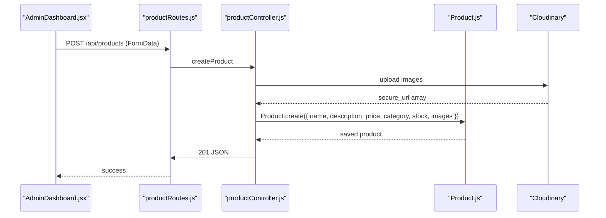

**Diagram sources**
- [AdminDashboard.jsx:126-152](file://frontend/src/pages/AdminDashboard.jsx#L126-L152)
- [productRoutes.js:19](file://backend/routes/productRoutes.js#L19)
- [productController.js:52-83](file://backend/controllers/productController.js#L52-L83)
- [uploadMiddleware.js:11-27](file://backend/middleware/uploadMiddleware.js#L11-L27)

**Section sources**
- [productController.js:4-137](file://backend/controllers/productController.js#L4-L137)

### Category Controller: CRUD Operations
- getCategories: Returns only active categories, sorted by display order and name.
- getAllCategories: Returns all categories (active/inactive) for admin management.
- getCategoryById: Retrieves a single category by ID.
- createCategory: Creates a new category with auto-generated slug and optional icon.
- updateCategory: Updates category properties including activation status and display order.
- deleteCategory: Removes a category by ID.
- getProductsByCategory: Returns products filtered by category slug with pagination.

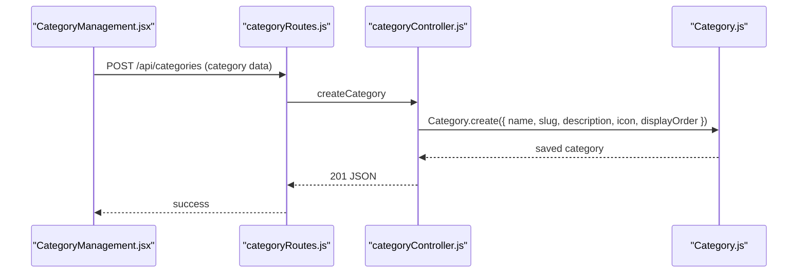

**Diagram sources**
- [CategoryManagement.jsx:32-47](file://frontend/src/components/admin/CategoryManagement.jsx#L32-L47)
- [categoryRoutes.js:22](file://backend/routes/categoryRoutes.js#L22)
- [categoryController.js:39-62](file://backend/controllers/categoryController.js#L39-L62)

**Section sources**
- [categoryController.js:4-134](file://backend/controllers/categoryController.js#L4-L134)

### Form Validation and User Experience
- Admin dashboard form enforces required fields for name, description, price, stock, and category.
- Price input uses numeric type with decimal support.
- Stock input uses numeric type.
- Category dropdown dynamically loads from available categories with icons.
- Image upload allows up to three images, with previews and removal capability.
- Submission uses FormData with multipart encoding.
- Category management form includes name, description, icon, and display order fields.
- Category status toggles between active/inactive states.

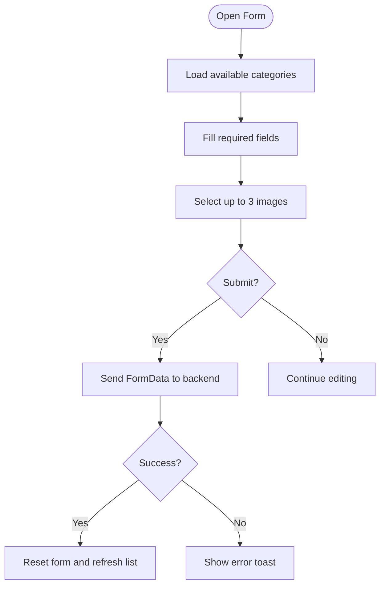

**Diagram sources**
- [AdminDashboard.jsx:14-465](file://frontend/src/pages/AdminDashboard.jsx#L14-L465)
- [CategoryManagement.jsx:5-224](file://frontend/src/components/admin/CategoryManagement.jsx#L5-L224)

**Section sources**
- [AdminDashboard.jsx:14-465](file://frontend/src/pages/AdminDashboard.jsx#L14-L465)
- [CategoryManagement.jsx:5-224](file://frontend/src/components/admin/CategoryManagement.jsx#L5-L224)

### Image Upload Handling
- Cloudinary integration configured with automatic optimization and quality enhancement.
- Storage: Cloudinary CDN with secure HTTPS URLs.
- Filename: Generated automatically by Cloudinary (public_id).
- Size limit: 5 MB.
- Allowed types: jpg, jpeg, png, webp, gif.
- Backend stores secure Cloudinary URLs in the database.
- Frontend resolves image URLs via imageHelper utility.

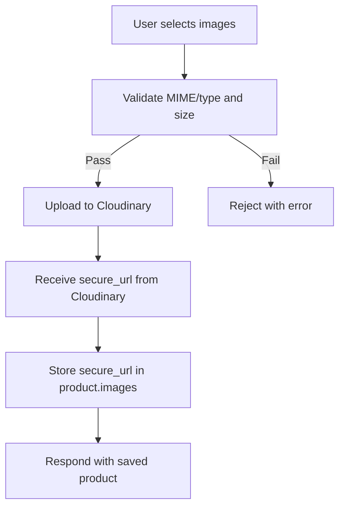

**Diagram sources**
- [uploadMiddleware.js:5-56](file://backend/middleware/uploadMiddleware.js#L5-L56)
- [cloudinary.js:6-11](file://backend/config/cloudinary.js#L6-L11)
- [AdminDashboard.jsx:110-124](file://frontend/src/pages/AdminDashboard.jsx#L110-L124)
- [imageHelper.js:1-5](file://frontend/src/utils/imageHelper.js#L1-L5)

**Section sources**
- [uploadMiddleware.js:5-56](file://backend/middleware/uploadMiddleware.js#L5-L56)
- [cloudinary.js:6-11](file://backend/config/cloudinary.js#L6-L11)
- [AdminDashboard.jsx:110-124](file://frontend/src/pages/AdminDashboard.jsx#L110-L124)
- [imageHelper.js:1-5](file://frontend/src/utils/imageHelper.js#L1-L5)

### Product Listing Table, Sorting, Filtering, and Search
- Sorting: Results sorted by newest first.
- Filtering: Category filter applied when a category is selected.
- Search: Full-text search across name and description using regex with case-insensitive option.
- Pagination: Page and limit query parameters control offset and batch size.
- Frontend table displays product image preview, name, description, category, price, stock, and action buttons.

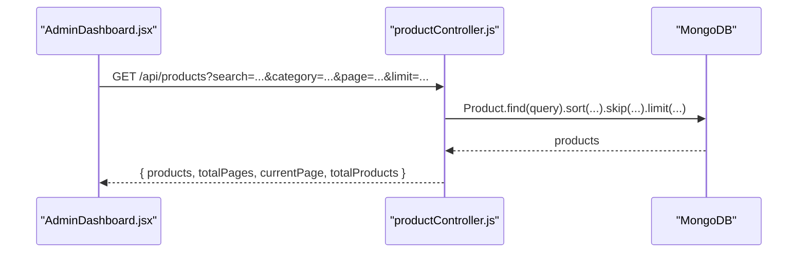

**Diagram sources**
- [AdminDashboard.jsx:90-99](file://frontend/src/pages/AdminDashboard.jsx#L90-L99)
- [productController.js:4-37](file://backend/controllers/productController.js#L4-L37)

**Section sources**
- [productController.js:4-37](file://backend/controllers/productController.js#L4-L37)
- [AdminDashboard.jsx:348-386](file://frontend/src/pages/AdminDashboard.jsx#L348-L386)

### Category Management Interface
- Dedicated categories tab in admin dashboard with comprehensive CRUD operations.
- Dynamic category loading from backend with real-time updates.
- Category form supports name, description, icon, and display order fields.
- Status indicators show active/inactive state with color coding.
- Category list displays icon, name, slug, display order, and status.
- Real-time category availability checking in product forms.

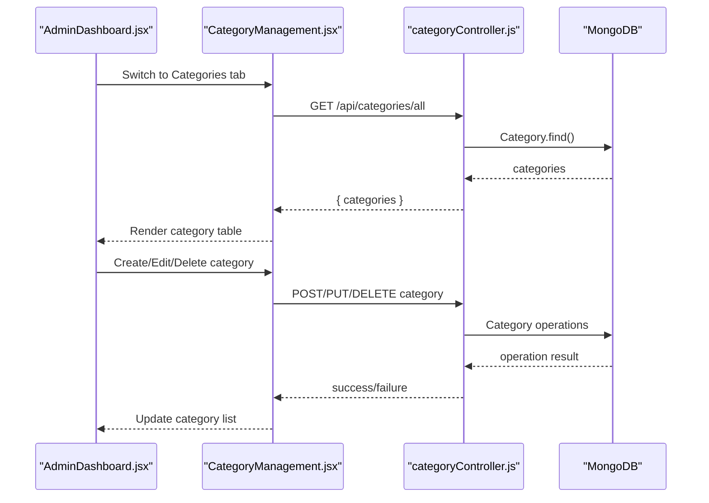

**Diagram sources**
- [AdminDashboard.jsx:247-249](file://frontend/src/pages/AdminDashboard.jsx#L247-L249)
- [CategoryManagement.jsx:21-30](file://frontend/src/components/admin/CategoryManagement.jsx#L21-L30)
- [categoryController.js:16-24](file://backend/controllers/categoryController.js#L16-L24)

**Section sources**
- [AdminDashboard.jsx:452-456](file://frontend/src/pages/AdminDashboard.jsx#L452-L456)
- [CategoryManagement.jsx:5-224](file://frontend/src/components/admin/CategoryManagement.jsx#L5-L224)

### Inventory Management, Stock Tracking, and Low-Stock Alerts
- Stock field is required and defaults to zero.
- Frontend renders stock counts with color-coded badges indicating availability.
- Out-of-stock items disable add-to-cart actions in the storefront.
- Category-based organization enables better inventory management across product groups.

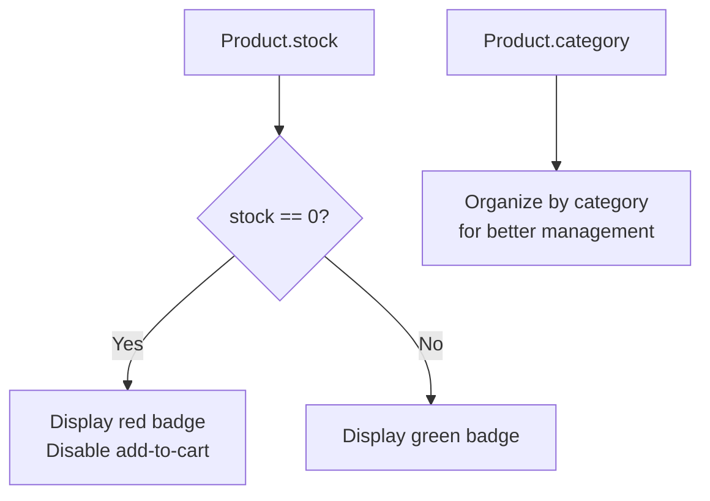

**Diagram sources**
- [Product.js:9](file://backend/models/Product.js#L9)
- [AdminDashboard.jsx:373-375](file://frontend/src/pages/AdminDashboard.jsx#L373-L375)
- [Home.jsx:64-70](file://frontend/src/pages/Home.jsx#L64-L70)

**Section sources**
- [Product.js:9](file://backend/models/Product.js#L9)
- [AdminDashboard.jsx:373-375](file://frontend/src/pages/AdminDashboard.jsx#L373-L375)
- [Home.jsx:64-70](file://frontend/src/pages/Home.jsx#L64-L70)

### Extending Product Attributes, Custom Fields, and Advanced Filtering
- Extend Product model by adding new fields to the schema. Ensure required/optional constraints and defaults are defined.
- Update controllers to accept new fields from requests and apply validation.
- Adjust frontend forms to collect and submit new fields.
- For advanced filtering, add new query parameters in controllers and build appropriate MongoDB queries.
- For bulk actions, implement batch endpoints (e.g., delete multiple by IDs) and corresponding frontend UI controls.
- Category-based filtering can be extended to include sub-category hierarchies and category-specific attributes.

[No sources needed since this section provides general guidance]

## Dependency Analysis
Key dependencies and relationships:
- Routes depend on controllers and middleware.
- Controllers depend on the Product and Category models.
- Frontend depends on backend routes and image helper utilities.
- Category management is tightly coupled with product management for dynamic category selection.
- Cloudinary integration provides centralized image management.

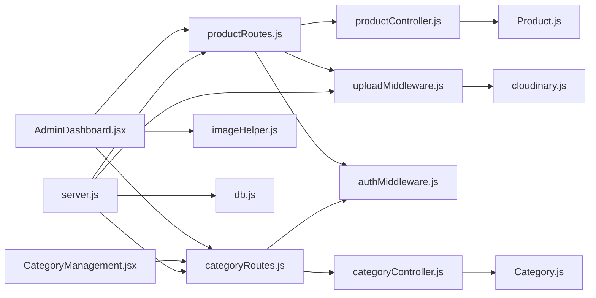

**Diagram sources**
- [productRoutes.js:12-22](file://backend/routes/productRoutes.js#L12-L22)
- [categoryRoutes.js:1-27](file://backend/routes/categoryRoutes.js#L1-L27)
- [productController.js:1-137](file://backend/controllers/productController.js#L1-L137)
- [categoryController.js:1-134](file://backend/controllers/categoryController.js#L1-L134)
- [Product.js:1-12](file://backend/models/Product.js#L1-L12)
- [Category.js:1-46](file://backend/models/Category.js#L1-L46)
- [authMiddleware.js:4-20](file://backend/middleware/authMiddleware.js#L4-L20)
- [uploadMiddleware.js:1-56](file://backend/middleware/uploadMiddleware.js#L1-L56)
- [cloudinary.js:1-13](file://backend/config/cloudinary.js#L1-L13)
- [AdminDashboard.jsx:1-465](file://frontend/src/pages/AdminDashboard.jsx#L1-L465)
- [CategoryManagement.jsx:1-224](file://frontend/src/components/admin/CategoryManagement.jsx#L1-L224)
- [imageHelper.js:1-5](file://frontend/src/utils/imageHelper.js#L1-L5)
- [server.js:54-55](file://backend/server.js#L54-L55)
- [db.js:5-13](file://backend/config/db.js#L5-L13)

**Section sources**
- [productRoutes.js:12-22](file://backend/routes/productRoutes.js#L12-L22)
- [categoryRoutes.js:1-27](file://backend/routes/categoryRoutes.js#L1-L27)
- [productController.js:1-137](file://backend/controllers/productController.js#L1-L137)
- [categoryController.js:1-134](file://backend/controllers/categoryController.js#L1-L134)
- [AdminDashboard.jsx:1-465](file://frontend/src/pages/AdminDashboard.jsx#L1-L465)
- [CategoryManagement.jsx:1-224](file://frontend/src/components/admin/CategoryManagement.jsx#L1-L224)

## Performance Considerations
- Indexing: Consider adding indexes on frequently queried fields (e.g., category, name, description) to improve search performance.
- Pagination: Use reasonable page sizes and avoid very large limits to prevent heavy payloads.
- Cloudinary optimization: Automatic compression and format optimization reduces bandwidth usage.
- Category caching: Cache category lists in frontend to reduce API calls during product creation.
- Image optimization: Leverage Cloudinary's automatic optimization features for better performance.
- Caching: Implement caching for product listings if data changes infrequently.
- Validation: Keep validation close to the controller to fail fast and reduce unnecessary database writes.

[No sources needed since this section provides general guidance]

## Troubleshooting Guide
Common issues and resolutions:
- Authentication errors: Ensure Authorization header is present and valid; admin role is required.
- Cloudinary upload errors: Verify Cloudinary credentials are configured correctly; check network connectivity.
- Product not found: Confirm product ID validity and endpoint correctness.
- Validation failures: Ensure required fields are provided and numeric fields are valid numbers.
- Category not found: Verify category exists and is active; check category slug generation.
- Image URLs: Confirm Cloudinary configuration and secure URL resolution.
- Category dropdown empty: Ensure categories are created and active before creating products.

**Section sources**
- [authMiddleware.js:4-20](file://backend/middleware/authMiddleware.js#L4-L20)
- [uploadMiddleware.js:17-27](file://backend/middleware/uploadMiddleware.js#L17-L27)
- [productController.js:40-48](file://backend/controllers/productController.js#L40-L48)
- [categoryController.js:30-37](file://backend/controllers/categoryController.js#L30-L37)
- [imageHelper.js:1-5](file://frontend/src/utils/imageHelper.js#L1-L5)

## Conclusion
The admin product management system provides a robust foundation for managing products and categories, including secure CRUD operations, Cloudinary-powered image handling, and comprehensive category management. The enhanced system now features a dedicated categories tab, dynamic category selection in product forms, and improved product creation workflow with automatic category population. The schema and controllers are straightforward to extend for additional attributes and advanced features. Following the guidance in this document will help maintain consistency and scalability as requirements evolve.

## Appendices

### API Endpoints Summary
- GET /api/products: List products with search, category filter, pagination.
- GET /api/products/:id: Retrieve a single product.
- POST /api/products: Admin-only creation with Cloudinary images.
- PUT /api/products/:id: Admin-only update with Cloudinary images.
- DELETE /api/products/:id: Admin-only deletion.
- GET /api/categories: List active categories for frontend display.
- GET /api/categories/all: Admin-only list of all categories.
- GET /api/categories/:id: Admin-only category retrieval.
- POST /api/categories: Admin-only category creation.
- PUT /api/categories/:id: Admin-only category update.
- DELETE /api/categories/:id: Admin-only category deletion.

**Section sources**
- [productRoutes.js:14-21](file://backend/routes/productRoutes.js#L14-L21)
- [categoryRoutes.js:15-24](file://backend/routes/categoryRoutes.js#L15-L24)

### Product Data Structure
- name: string (required)
- description: string (required)
- price: number (required)
- images: string[] (Cloudinary secure URLs)
- category: string (required)
- stock: number (required, default 0)
- timestamps: createdAt, updatedAt

**Section sources**
- [Product.js:3-10](file://backend/models/Product.js#L3-L10)

### Category Data Structure
- name: string (required, unique)
- slug: string (required, unique, auto-generated)
- description: string (optional)
- icon: string (optional, emoji or URL)
- isActive: boolean (default true)
- displayOrder: number (default 0)
- timestamps: createdAt, updatedAt

**Section sources**
- [Category.js:3-35](file://backend/models/Category.js#L3-L35)

### Validation Rules
- Required fields: name, description, price, category, stock.
- Numeric fields: price and stock must be numbers.
- Image constraints: up to 3 images, allowed types jpg/jpeg/png/webp/gif, max 5 MB.
- Category constraints: name unique, slug auto-generated, displayOrder numeric.

**Section sources**
- [productController.js:52-83](file://backend/controllers/productController.js#L52-L83)
- [uploadMiddleware.js:50-56](file://backend/middleware/uploadMiddleware.js#L50-L56)
- [Category.js:4-32](file://backend/models/Category.js#L4-L32)
- [AdminDashboard.jsx:161,165,170,174,180](file://frontend/src/pages/AdminDashboard.jsx#L161,L165,L170,L174,L180)

### Enhanced Features
- Categories tab in admin dashboard for dedicated category management.
- Dynamic category selection in product forms with real-time category loading.
- Category management component with full CRUD operations.
- Category activation/deactivation for controlling visibility.
- Category display ordering for custom organization.
- Category icons for visual identification.
- Category-based product filtering and organization.

**Section sources**
- [AdminDashboard.jsx:247-249](file://frontend/src/pages/AdminDashboard.jsx#L247-L249)
- [CategoryManagement.jsx:5-224](file://frontend/src/components/admin/CategoryManagement.jsx#L5-L224)
- [categoryController.js:26-98](file://backend/controllers/categoryController.js#L26-L98)