# Product Administration

<cite>
**Referenced Files in This Document**
- [ProductsManagement.jsx](file://frontend/src/components/admin/ProductsManagement.jsx)
- [AdminDashboard.jsx](file://frontend/src/pages/AdminDashboard.jsx)
- [CategoryManagement.jsx](file://frontend/src/components/admin/CategoryManagement.jsx)
- [productController.js](file://backend/controllers/productController.js)
- [Product.js](file://backend/models/Product.js)
- [productRoutes.js](file://backend/routes/productRoutes.js)
- [categoryController.js](file://backend/controllers/categoryController.js)
- [Category.js](file://backend/models/Category.js)
- [categoryRoutes.js](file://backend/routes/categoryRoutes.js)
- [uploadMiddleware.js](file://backend/middleware/uploadMiddleware.js)
- [cloudinary.js](file://backend/config/cloudinary.js)
- [authMiddleware.js](file://backend/middleware/authMiddleware.js)
- [imageHelper.js](file://frontend/src/utils/imageHelper.js)
- [db.js](file://backend/config/db.js)
- [server.js](file://backend/server.js)
- [Home.jsx](file://frontend/src/pages/Home.jsx)
</cite>

## Update Summary
**Changes Made**
- **Major Restructuring**: Migrated from integrated product management within AdminDashboard.jsx to dedicated ProductsManagement.jsx component
- **Enhanced Pagination**: Added pagination support with 10 products per page in the new ProductsManagement component
- **MRP Support**: Added originalPrice field for MRP (Maximum Retail Price) alongside selling price
- **Improved Form Handling**: Enhanced form validation with MRP support, category selection, and multi-image upload capabilities
- **Component Organization**: Better separation of concerns with dedicated components for different admin functions
- **Maintained Functionality**: All existing product management features preserved while improving organization and user experience

## Table of Contents
1. [Introduction](#introduction)
2. [Project Structure](#project-structure)
3. [Core Components](#core-components)
4. [Architecture Overview](#architecture-overview)
5. [Detailed Component Analysis](#detailed-component-analysis)
6. [Dependency Analysis](#dependency-analysis)
7. [Performance Considerations](#performance-considerations)
8. [Troubleshooting Guide](#troubleshooting-guide)
9. [Conclusion](#conclusion)
10. [Appendices](#appendices)

## Introduction
This document provides comprehensive documentation for the admin product management system. The system has undergone a major restructuring with the migration from integrated product management within AdminDashboard.jsx to dedicated ProductsManagement.jsx component. It covers product CRUD operations (create, read, update, delete), form validation, image upload handling, category management, and the product listing table with search, filtering, and pagination. The enhanced system now includes pagination support (10 products per page), MRP (Maximum Retail Price) support, and improved form handling with enhanced category selection and multi-image upload capabilities.

## Project Structure
The product administration system now features a restructured architecture with dedicated components for different administrative functions:
- **Frontend**: Admin dashboard with tabbed interface, dedicated ProductsManagement component, CategoryManagement component, and shared utilities
- **Backend**: Express routes, controllers, Mongoose models, authentication middleware, and Cloudinary upload middleware

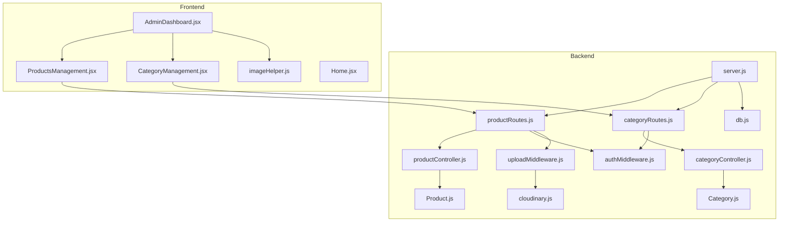
```mermaid
graph TB
subgraph "Backend"
SRV["server.js"]
DB["db.js"]
PROD_ROUTES["productRoutes.js"]
CAT_ROUTES["categoryRoutes.js"]
PROD_CTRL["productController.js"]
CAT_CTRL["categoryController.js"]
PROD_MODEL["Product.js"]
CAT_MODEL["Category.js"]
AUTH["authMiddleware.js"]
UPLOAD["uploadMiddleware.js"]
CLOUD["cloudinary.js"]
end
subgraph "Frontend"
ADMIN["AdminDashboard.jsx"]
PROD_MAN["ProductsManagement.jsx"]
CAT_MANAGEMENT["CategoryManagement.jsx"]
IMGHELP["imageHelper.js"]
HOME["Home.jsx"]
end
ADMIN --> PROD_MAN
ADMIN --> CAT_MANAGEMENT
PROD_MAN --> PROD_ROUTES
CAT_MANAGEMENT --> CAT_ROUTES
ADMIN --> IMGHELP
SRV --> PROD_ROUTES
SRV --> CAT_ROUTES
PROD_ROUTES --> PROD_CTRL
CAT_ROUTES --> CAT_CTRL
PROD_CTRL --> PROD_MODEL
CAT_CTRL --> CAT_MODEL
PROD_ROUTES --> AUTH
PROD_ROUTES --> UPLOAD
CAT_ROUTES --> AUTH
UPLOAD --> CLOUD
SRV --> DB
```

**Diagram sources**
- [server.js:58-63](file://backend/server.js#L58-L63)
- [productRoutes.js:12-22](file://backend/routes/productRoutes.js#L12-L22)
- [categoryRoutes.js:1-27](file://backend/routes/categoryRoutes.js#L1-L27)
- [productController.js:1-137](file://backend/controllers/productController.js#L1-L137)
- [categoryController.js:1-134](file://backend/controllers/categoryController.js#L1-L134)
- [Product.js:1-13](file://backend/models/Product.js#L1-L13)
- [Category.js:1-46](file://backend/models/Category.js#L1-L46)
- [authMiddleware.js:4-20](file://backend/middleware/authMiddleware.js#L4-L20)
- [uploadMiddleware.js:1-56](file://backend/middleware/uploadMiddleware.js#L1-L56)
- [cloudinary.js:1-13](file://backend/config/cloudinary.js#L1-L13)
- [AdminDashboard.jsx:1-283](file://frontend/src/pages/AdminDashboard.jsx#L1-L283)
- [ProductsManagement.jsx:1-418](file://frontend/src/components/admin/ProductsManagement.jsx#L1-L418)
- [CategoryManagement.jsx:1-224](file://frontend/src/components/admin/CategoryManagement.jsx#L1-L224)
- [imageHelper.js:1-5](file://frontend/src/utils/imageHelper.js#L1-L5)
- [Home.jsx:19-28](file://frontend/src/pages/Home.jsx#L19-L28)

**Section sources**
- [server.js:58-63](file://backend/server.js#L58-L63)
- [productRoutes.js:12-22](file://backend/routes/productRoutes.js#L12-L22)
- [categoryRoutes.js:1-27](file://backend/routes/categoryRoutes.js#L1-L27)
- [AdminDashboard.jsx:1-283](file://frontend/src/pages/AdminDashboard.jsx#L1-L283)
- [ProductsManagement.jsx:1-418](file://frontend/src/components/admin/ProductsManagement.jsx#L1-L418)

## Core Components
- **ProductsManagement Component**: Dedicated component for product CRUD operations with pagination, MRP support, and enhanced form handling
- **AdminDashboard**: Main admin interface with tabbed navigation for products, categories, orders, and admins
- **CategoryManagement Component**: Dedicated interface for category CRUD operations with full admin functionality
- **Product Model**: Enhanced schema with MRP (originalPrice) support alongside existing fields
- **Product Controller**: CRUD endpoints with search, filtering, and pagination support
- **Category Controller**: Full CRUD operations for category management with activation/deactivation capabilities
- **Upload Middleware**: Cloudinary integration for image storage with multi-image support
- **Authentication Middleware**: Admin-only access enforcement
- **Image Helper**: Utility for resolving Cloudinary image URLs

**Section sources**
- [ProductsManagement.jsx:8-418](file://frontend/src/components/admin/ProductsManagement.jsx#L8-L418)
- [AdminDashboard.jsx:11-283](file://frontend/src/pages/AdminDashboard.jsx#L11-L283)
- [CategoryManagement.jsx:5-224](file://frontend/src/components/admin/CategoryManagement.jsx#L5-L224)
- [Product.js:3-13](file://backend/models/Product.js#L3-L13)
- [Product.js:7](file://backend/models/Product.js#L7)
- [productController.js:4-137](file://backend/controllers/productController.js#L4-L137)
- [categoryController.js:4-134](file://backend/controllers/categoryController.js#L4-L134)
- [uploadMiddleware.js:5-56](file://backend/middleware/uploadMiddleware.js#L5-L56)
- [authMiddleware.js:17-20](file://backend/middleware/authMiddleware.js#L17-L20)
- [imageHelper.js:1-5](file://frontend/src/utils/imageHelper.js#L1-L5)

## Architecture Overview
The system follows a restructured layered architecture with dedicated components for different administrative functions:
- HTTP requests reach routes, which delegate to controllers
- Controllers interact with Mongoose models for persistence
- Authentication middleware ensures only admins can modify products and categories
- Upload middleware manages Cloudinary image uploads with automatic optimization
- Frontend communicates via Axios to the backend API with dedicated components for different administrative functions

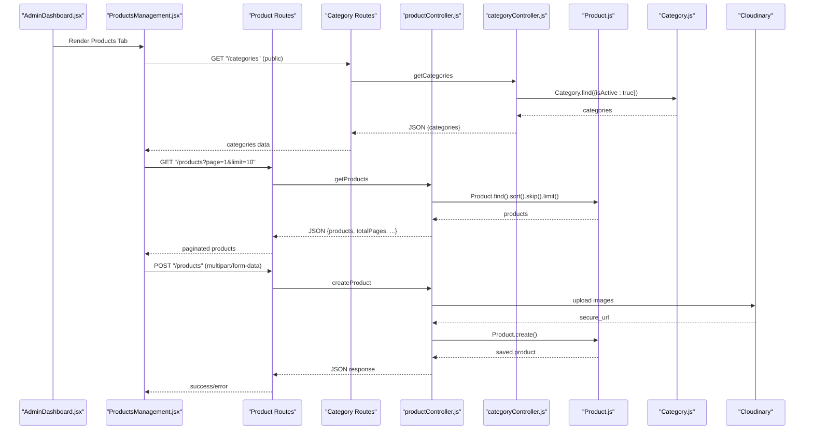
```mermaid
sequenceDiagram
participant Admin as "AdminDashboard.jsx"
participant ProdComp as "ProductsManagement.jsx"
participant ProdAPI as "Product Routes"
participant CatAPI as "Category Routes"
participant ProdCtrl as "productController.js"
participant CatCtrl as "categoryController.js"
participant ProdModel as "Product.js"
participant CatModel as "Category.js"
participant Cloud as "Cloudinary"
Admin->>ProdComp : Render Products Tab
ProdComp->>CatAPI : GET "/categories" (public)
CatAPI->>CatCtrl : getCategories
CatCtrl->>CatModel : Category.find({isActive : true})
CatModel-->>CatCtrl : categories
CatCtrl-->>CatAPI : JSON {categories}
CatAPI-->>ProdComp : categories data
ProdComp->>ProdAPI : GET "/products?page=1&limit=10"
ProdAPI->>ProdCtrl : getProducts
ProdCtrl->>ProdModel : Product.find().sort().skip().limit()
ProdModel-->>ProdCtrl : products
ProdCtrl-->>ProdAPI : JSON {products, totalPages, ...}
ProdAPI-->>ProdComp : paginated products
ProdComp->>ProdAPI : POST "/products" (multipart/form-data)
ProdAPI->>ProdCtrl : createProduct
ProdCtrl->>Cloud : upload images
Cloud-->>ProdCtrl : secure_url
ProdCtrl->>ProdModel : Product.create()
ProdModel-->>ProdCtrl : saved product
ProdCtrl-->>ProdAPI : JSON response
ProdAPI-->>ProdComp : success/error
```

**Diagram sources**
- [AdminDashboard.jsx:262-264](file://frontend/src/pages/AdminDashboard.jsx#L262-L264)
- [ProductsManagement.jsx:33-68](file://frontend/src/components/admin/ProductsManagement.jsx#L33-L68)
- [ProductsManagement.jsx:48-59](file://frontend/src/components/admin/ProductsManagement.jsx#L48-L59)
- [ProductsManagement.jsx:70-74](file://frontend/src/components/admin/ProductsManagement.jsx#L70-L74)
- [ProductsManagement.jsx:92-121](file://frontend/src/components/admin/ProductsManagement.jsx#L92-L121)
- [categoryRoutes.js:19-24](file://backend/routes/categoryRoutes.js#L19-L24)
- [productRoutes.js:19-21](file://backend/routes/productRoutes.js#L19-L21)
- [productController.js:52-83](file://backend/controllers/productController.js#L52-L83)
- [categoryController.js:16-24](file://backend/controllers/categoryController.js#L16-L24)
- [uploadMiddleware.js:11-27](file://backend/middleware/uploadMiddleware.js#L11-L27)

## Detailed Component Analysis

### ProductsManagement Component
The dedicated ProductsManagement component provides comprehensive product management functionality with enhanced features:
- **Pagination**: 10 products per page with navigation controls
- **MRP Support**: Original price field for Maximum Retail Price alongside selling price
- **Enhanced Form**: Multi-image upload with preview and removal capabilities
- **Category Selection**: Dynamic category loading with icons and real-time updates
- **Stock Management**: Color-coded stock indicators with low-stock alerts
- **Admin Validation**: Automatic admin access verification

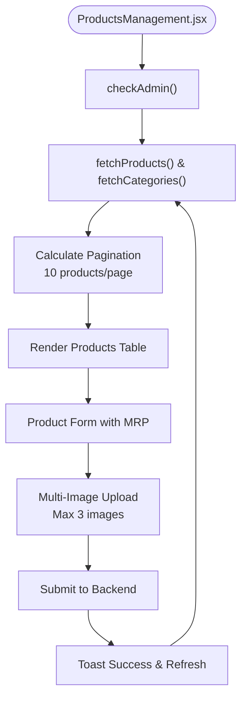
```mermaid
flowchart TD
Start(["ProductsManagement.jsx"]) --> CheckAdmin["checkAdmin()"]
CheckAdmin --> FetchData["fetchProducts() & fetchCategories()"]
FetchData --> Paginate["Calculate Pagination<br/>10 products/page"]
Paginate --> RenderTable["Render Products Table"]
RenderTable --> Form["Product Form with MRP"]
Form --> ImageUpload["Multi-Image Upload<br/>Max 3 images"]
ImageUpload --> Submit["Submit to Backend"]
Submit --> Success["Toast Success & Refresh"]
Success --> FetchData
```

**Diagram sources**
- [ProductsManagement.jsx:39-46](file://frontend/src/components/admin/ProductsManagement.jsx#L39-L46)
- [ProductsManagement.jsx:48-68](file://frontend/src/components/admin/ProductsManagement.jsx#L48-L68)
- [ProductsManagement.jsx:70-74](file://frontend/src/components/admin/ProductsManagement.jsx#L70-L74)
- [ProductsManagement.jsx:92-121](file://frontend/src/components/admin/ProductsManagement.jsx#L92-L121)
- [ProductsManagement.jsx:158-161](file://frontend/src/components/admin/ProductsManagement.jsx#L158-L161)

**Section sources**
- [ProductsManagement.jsx:8-418](file://frontend/src/components/admin/ProductsManagement.jsx#L8-L418)

### Product Model Enhancement
The Product model has been enhanced to support MRP (Maximum Retail Price) alongside existing fields:
- **name**: required string
- **description**: required string  
- **price**: required number (selling price)
- **originalPrice**: optional number (MRP - Maximum Retail Price)
- **images**: array of strings (Cloudinary secure URLs)
- **category**: required string
- **stock**: required number (default 0)
- **timestamps**: createdAt and updatedAt

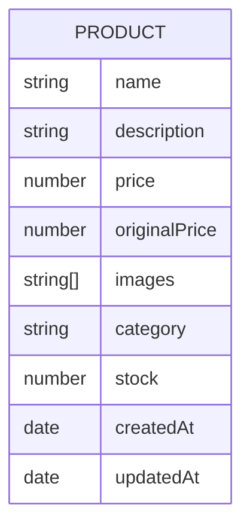
```mermaid
erDiagram
PRODUCT {
string name
string description
number price
number originalPrice
string[] images
string category
number stock
date createdAt
date updatedAt
}
```

**Diagram sources**
- [Product.js:3-13](file://backend/models/Product.js#L3-L13)

**Section sources**
- [Product.js:3-13](file://backend/models/Product.js#L3-L13)

### Category Model
The Category model defines the schema for category documents with enhanced features:
- **name**: required unique string
- **slug**: required unique string (auto-generated from name)
- **description**: optional string
- **icon**: optional string (emoji or URL)
- **isActive**: boolean flag for category visibility
- **displayOrder**: number for sorting categories
- **timestamps**: createdAt and updatedAt

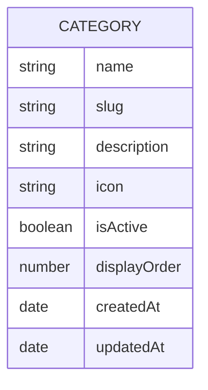
```mermaid
erDiagram
CATEGORY {
string name
string slug
string description
string icon
boolean isActive
number displayOrder
date createdAt
date updatedAt
}
```

**Diagram sources**
- [Category.js:3-35](file://backend/models/Category.js#L3-L35)

**Section sources**
- [Category.js:3-35](file://backend/models/Category.js#L3-L35)

### Product Routes and Middleware
- **GET /api/products**: Public listing with search and category filters, pagination (default 12 per page)
- **GET /api/products/:id**: Public single product retrieval
- **POST /api/products**: Admin-only creation with Cloudinary image upload (max 3 images)
- **PUT /api/products/:id**: Admin-only update with optional image replacement
- **DELETE /api/products/:id**: Admin-only deletion
- **Authentication**: protect and admin middleware enforce JWT and admin role
- **Upload**: upload.array('images', 3) enforces up to three images per request with Cloudinary integration

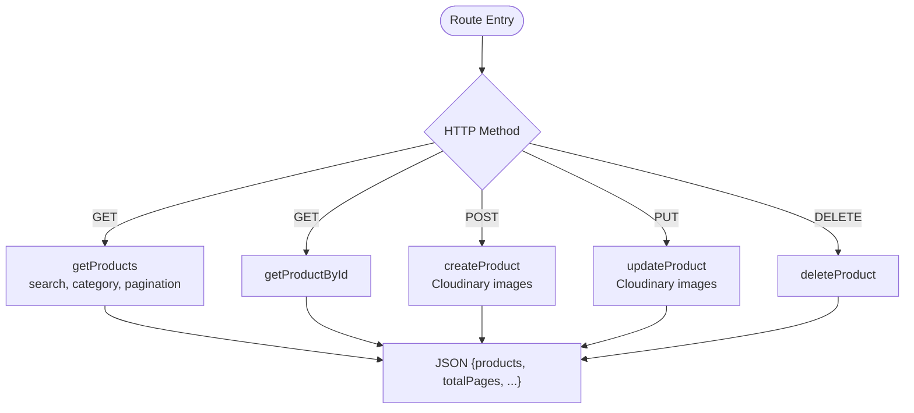
```mermaid
flowchart TD
Start(["Route Entry"]) --> Method{"HTTP Method"}
Method --> |GET| List["getProducts<br/>search, category, pagination"]
Method --> |GET| GetById["getProductById"]
Method --> |POST| Create["createProduct<br/>Cloudinary images"]
Method --> |PUT| Update["updateProduct<br/>Cloudinary images"]
Method --> |DELETE| Delete["deleteProduct"]
List --> Resp["JSON {products, totalPages, ...}"]
GetById --> Resp
Create --> Resp
Update --> Resp
Delete --> Resp
```

**Diagram sources**
- [productRoutes.js:14-21](file://backend/routes/productRoutes.js#L14-L21)
- [productController.js:4-137](file://backend/controllers/productController.js#L4-L137)

**Section sources**
- [productRoutes.js:14-21](file://backend/routes/productRoutes.js#L14-L21)
- [authMiddleware.js:4-20](file://backend/middleware/authMiddleware.js#L4-L20)
- [uploadMiddleware.js:50-56](file://backend/middleware/uploadMiddleware.js#L50-L56)

### Category Routes and Management
- **GET /api/categories**: Public listing of active categories (for frontend display)
- **GET /api/categories/all**: Admin-only listing of all categories (active/inactive)
- **GET /api/categories/:id**: Admin-only retrieval of specific category
- **POST /api/categories**: Admin-only creation of new category
- **PUT /api/categories/:id**: Admin-only update of category settings
- **DELETE /api/categories/:id**: Admin-only deletion of category
- **Enhanced Features**: Category activation/deactivation, display ordering, icon support

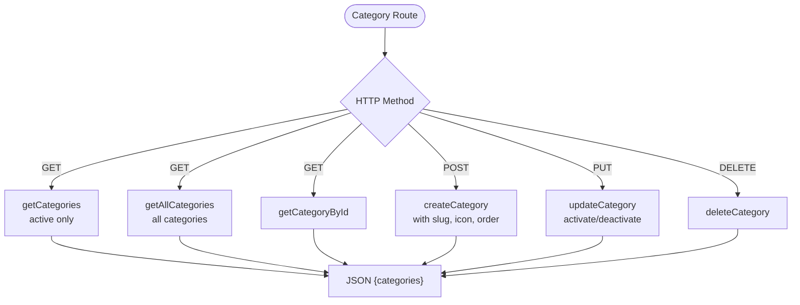
```mermaid
flowchart TD
Start(["Category Route"]) --> Method{"HTTP Method"}
Method --> |GET| GetActive["getCategories<br/>active only"]
Method --> |GET| GetAll["getAllCategories<br/>all categories"]
Method --> |GET| GetOne["getCategoryById"]
Method --> |POST| Create["createCategory<br/>with slug, icon, order"]
Method --> |PUT| Update["updateCategory<br/>activate/deactivate"]
Method --> |DELETE| Delete["deleteCategory"]
GetActive --> Resp["JSON {categories}"]
GetAll --> Resp
GetOne --> Resp
Create --> Resp
Update --> Resp
Delete --> Resp
```

**Diagram sources**
- [categoryRoutes.js:15-24](file://backend/routes/categoryRoutes.js#L15-L24)
- [categoryController.js:4-98](file://backend/controllers/categoryController.js#L4-L98)

**Section sources**
- [categoryRoutes.js:15-24](file://backend/routes/categoryRoutes.js#L15-L24)
- [categoryController.js:4-98](file://backend/controllers/categoryController.js#L4-L98)

### Product Controller: CRUD and Search
- **getProducts**: Builds a query with optional search (name/description regex) and category filter, sorts by newest first, paginates results, and returns metadata
- **getProductById**: Retrieves a single product by ID
- **createProduct**: Creates a product with validated numeric fields and Cloudinary image URLs
- **updateProduct**: Updates product fields, merges existing and new images, enforces a maximum of three images, and runs validators
- **deleteProduct**: Removes a product by ID

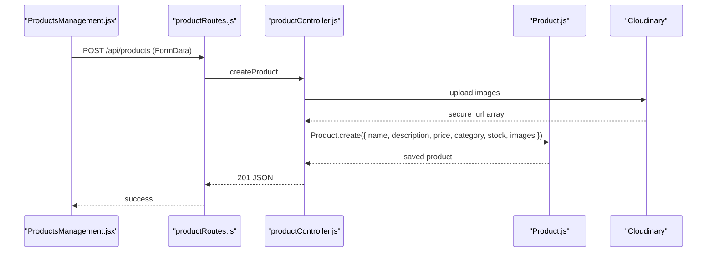
```mermaid
sequenceDiagram
participant Client as "ProductsManagement.jsx"
participant Route as "productRoutes.js"
participant Ctrl as "productController.js"
participant Model as "Product.js"
participant Cloud as "Cloudinary"
Client->>Route : POST /api/products (FormData)
Route->>Ctrl : createProduct
Ctrl->>Cloud : upload images
Cloud-->>Ctrl : secure_url array
Ctrl->>Model : Product.create({ name, description, price, category, stock, images })
Model-->>Ctrl : saved product
Ctrl-->>Route : 201 JSON
Route-->>Client : success
```

**Diagram sources**
- [ProductsManagement.jsx:107-111](file://frontend/src/components/admin/ProductsManagement.jsx#L107-L111)
- [productRoutes.js:19](file://backend/routes/productRoutes.js#L19)
- [productController.js:52-83](file://backend/controllers/productController.js#L52-L83)
- [uploadMiddleware.js:11-27](file://backend/middleware/uploadMiddleware.js#L11-L27)

**Section sources**
- [productController.js:4-137](file://backend/controllers/productController.js#L4-L137)

### Category Controller: CRUD Operations
- **getCategories**: Returns only active categories, sorted by display order and name
- **getAllCategories**: Returns all categories (active/inactive) for admin management
- **getCategoryById**: Retrieves a single category by ID
- **createCategory**: Creates a new category with auto-generated slug and optional icon
- **updateCategory**: Updates category properties including activation status and display order
- **deleteCategory**: Removes a category by ID
- **getProductsByCategory**: Returns products filtered by category slug with pagination

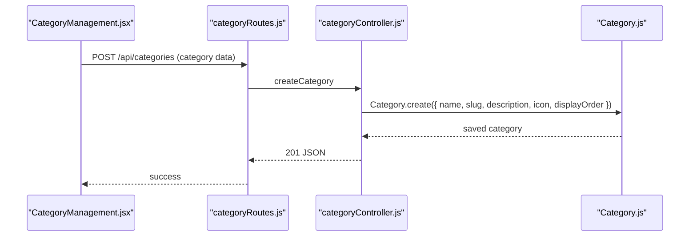
```mermaid
sequenceDiagram
participant Admin as "CategoryManagement.jsx"
participant Route as "categoryRoutes.js"
participant Ctrl as "categoryController.js"
participant Model as "Category.js"
Admin->>Route : POST /api/categories (category data)
Route->>Ctrl : createCategory
Ctrl->>Model : Category.create({ name, slug, description, icon, displayOrder })
Model-->>Ctrl : saved category
Ctrl-->>Route : 201 JSON
Route-->>Admin : success
```

**Diagram sources**
- [CategoryManagement.jsx:32-47](file://frontend/src/components/admin/CategoryManagement.jsx#L32-L47)
- [categoryRoutes.js:22](file://backend/routes/categoryRoutes.js#L22)
- [categoryController.js:39-62](file://backend/controllers/categoryController.js#L39-L62)

**Section sources**
- [categoryController.js:4-134](file://backend/controllers/categoryController.js#L4-L134)

### Form Validation and User Experience
- **Enhanced Product Form**: Supports MRP (originalPrice), category selection, multi-image upload, and stock management
- **Admin Validation**: Automatic admin access verification with redirect to login
- **Image Upload**: Allows up to three images with previews and removal capability
- **Category Loading**: Dynamic category loading from available categories with icons
- **Form States**: Separate states for editing and creating products
- **Pagination Controls**: Smooth scrolling and page navigation

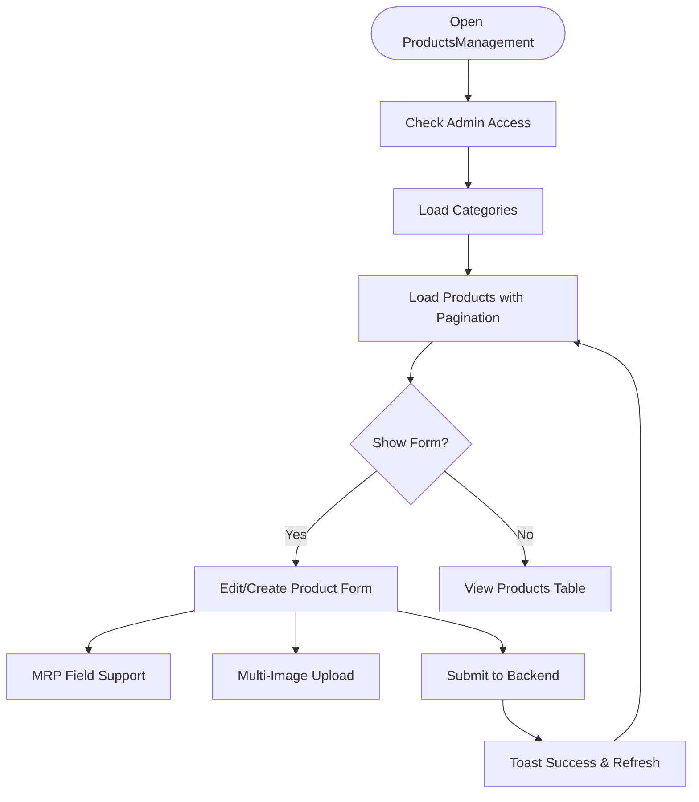
```mermaid
flowchart TD
Start(["Open ProductsManagement"]) --> CheckAdmin["Check Admin Access"]
CheckAdmin --> LoadCats["Load Categories"]
LoadCats --> LoadProducts["Load Products with Pagination"]
LoadProducts --> Form{"Show Form?"}
Form --> |Yes| EditCreate["Edit/Create Product Form"]
Form --> |No| View["View Products Table"]
EditCreate --> MRP["MRP Field Support"]
EditCreate --> Images["Multi-Image Upload"]
EditCreate --> Submit["Submit to Backend"]
Submit --> Success["Toast Success & Refresh"]
Success --> LoadProducts
```

**Diagram sources**
- [ProductsManagement.jsx:39-46](file://frontend/src/components/admin/ProductsManagement.jsx#L39-L46)
- [ProductsManagement.jsx:61-68](file://frontend/src/components/admin/ProductsManagement.jsx#L61-L68)
- [ProductsManagement.jsx:48-59](file://frontend/src/components/admin/ProductsManagement.jsx#L48-L59)
- [ProductsManagement.jsx:92-121](file://frontend/src/components/admin/ProductsManagement.jsx#L92-L121)

**Section sources**
- [ProductsManagement.jsx:15-418](file://frontend/src/components/admin/ProductsManagement.jsx#L15-L418)
- [CategoryManagement.jsx:5-224](file://frontend/src/components/admin/CategoryManagement.jsx#L5-L224)

### Image Upload Handling
- **Cloudinary Integration**: Configured with automatic optimization and quality enhancement
- **Storage**: Cloudinary CDN with secure HTTPS URLs
- **Filename**: Generated automatically by Cloudinary (public_id)
- **Size Limit**: 5 MB
- **Allowed Types**: jpg, jpeg, png, webp, gif
- **Multi-Image Support**: Up to three images per product with preview capability
- **Backend Storage**: Secure Cloudinary URLs in the database
- **Frontend Resolution**: Image URLs via imageHelper utility

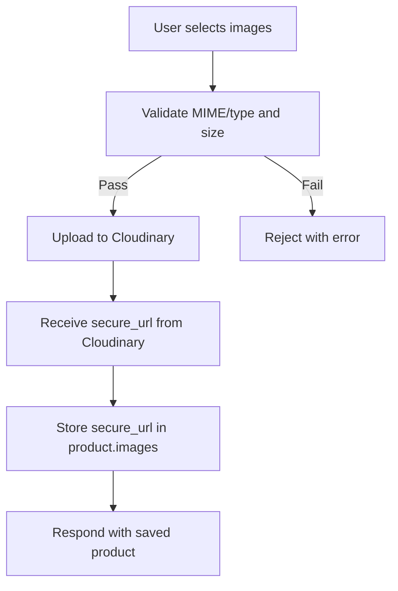
```mermaid
flowchart TD
Select["User selects images"] --> Validate["Validate MIME/type and size"]
Validate --> |Pass| Upload["Upload to Cloudinary"]
Validate --> |Fail| Error["Reject with error"]
Upload --> Secure["Receive secure_url from Cloudinary"]
Secure --> Store["Store secure_url in product.images"]
Store --> Respond["Respond with saved product"]
```

**Diagram sources**
- [uploadMiddleware.js:5-56](file://backend/middleware/uploadMiddleware.js#L5-L56)
- [cloudinary.js:6-11](file://backend/config/cloudinary.js#L6-L11)
- [ProductsManagement.jsx:76-90](file://frontend/src/components/admin/ProductsManagement.jsx#L76-L90)
- [imageHelper.js:1-5](file://frontend/src/utils/imageHelper.js#L1-L5)

**Section sources**
- [uploadMiddleware.js:5-56](file://backend/middleware/uploadMiddleware.js#L5-L56)
- [cloudinary.js:6-11](file://backend/config/cloudinary.js#L6-L11)
- [ProductsManagement.jsx:76-90](file://frontend/src/components/admin/ProductsManagement.jsx#L76-L90)
- [imageHelper.js:1-5](file://frontend/src/utils/imageHelper.js#L1-L5)

### Product Listing Table, Pagination, and Enhanced Features
- **Pagination**: 10 products per page with navigation controls and page information
- **Enhanced Display**: Shows product image, name, description, category, price, stock with color-coded indicators
- **Action Buttons**: Edit and Delete functionality with confirmation dialogs
- **Empty State**: Friendly message when no products are found
- **Stock Indicators**: Color-coded badges (green for >10, yellow for 1-10, red for 0)
- **Responsive Design**: Grid layout for image previews and responsive table

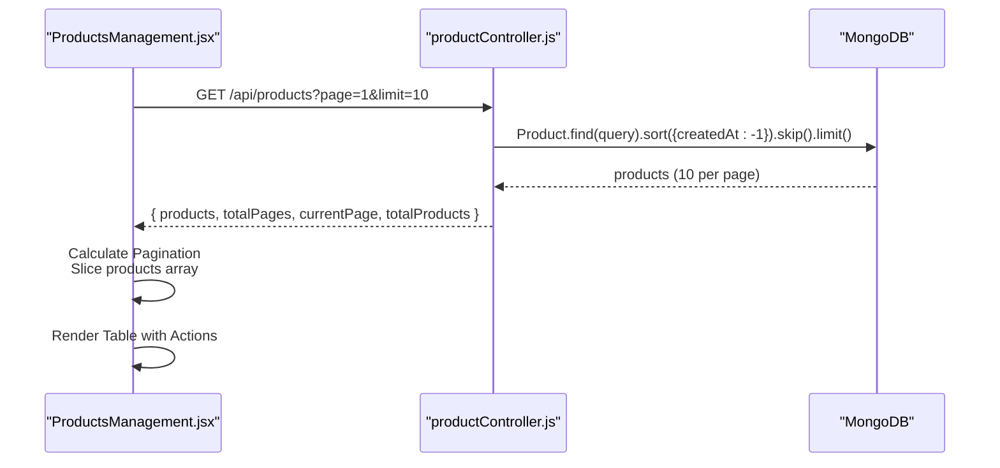
```mermaid
sequenceDiagram
participant UI as "ProductsManagement.jsx"
participant API as "productController.js"
participant DB as "MongoDB"
UI->>API : GET /api/products?page=1&limit=10
API->>DB : Product.find(query).sort({createdAt : -1}).skip().limit()
DB-->>API : products (10 per page)
API-->>UI : { products, totalPages, currentPage, totalProducts }
UI->>UI : Calculate Pagination<br/>Slice products array
UI->>UI : Render Table with Actions
```

**Diagram sources**
- [ProductsManagement.jsx:70-74](file://frontend/src/components/admin/ProductsManagement.jsx#L70-L74)
- [ProductsManagement.jsx:312-374](file://frontend/src/components/admin/ProductsManagement.jsx#L312-L374)
- [ProductsManagement.jsx:376-414](file://frontend/src/components/admin/ProductsManagement.jsx#L376-L414)
- [productController.js:4-37](file://backend/controllers/productController.js#L4-L37)

**Section sources**
- [productController.js:4-37](file://backend/controllers/productController.js#L4-L37)
- [ProductsManagement.jsx:312-414](file://frontend/src/components/admin/ProductsManagement.jsx#L312-L414)

### Category Management Interface
- **Dedicated Component**: Separate CategoryManagement component with comprehensive CRUD operations
- **Dynamic Loading**: Real-time category updates from backend
- **Enhanced Form**: Supports name, description, icon, and display order fields
- **Status Indicators**: Active/inactive state with color coding
- **Admin Access**: Full CRUD operations accessible only to administrators
- **Integration**: Seamless integration with product management for category selection

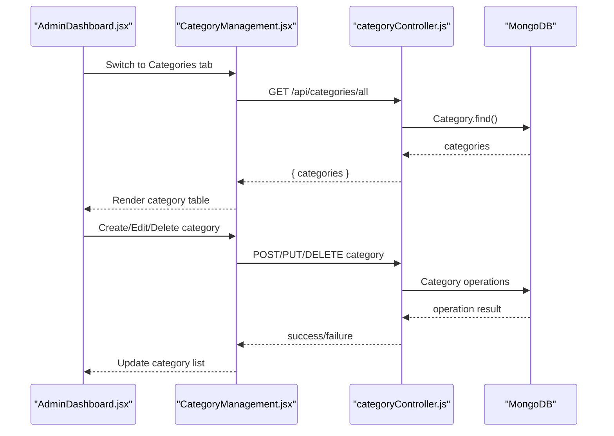
```mermaid
sequenceDiagram
participant Admin as "AdminDashboard.jsx"
participant CatUI as "CategoryManagement.jsx"
participant API as "categoryController.js"
participant DB as "MongoDB"
Admin->>CatUI : Switch to Categories tab
CatUI->>API : GET /api/categories/all
API->>DB : Category.find()
DB-->>API : categories
API-->>CatUI : { categories }
CatUI-->>Admin : Render category table
Admin->>CatUI : Create/Edit/Delete category
CatUI->>API : POST/PUT/DELETE category
API->>DB : Category operations
DB-->>API : operation result
API-->>CatUI : success/failure
CatUI-->>Admin : Update category list
```

**Diagram sources**
- [AdminDashboard.jsx:264-266](file://frontend/src/pages/AdminDashboard.jsx#L264-L266)
- [CategoryManagement.jsx:21-30](file://frontend/src/components/admin/CategoryManagement.jsx#L21-L30)
- [categoryController.js:16-24](file://backend/controllers/categoryController.js#L16-L24)

**Section sources**
- [AdminDashboard.jsx:262-274](file://frontend/src/pages/AdminDashboard.jsx#L262-L274)
- [CategoryManagement.jsx:5-224](file://frontend/src/components/admin/CategoryManagement.jsx#L5-L224)

### Inventory Management, Stock Tracking, and Low-Stock Alerts
- **Enhanced Stock Display**: Color-coded badges with improved visual indicators
- **Stock Levels**: Green for >10 units, Yellow for 1-10 units, Red for 0 units
- **Category Organization**: Better inventory management across product groups
- **Real-time Updates**: Stock changes reflected immediately in the admin interface
- **Low Stock Alerts**: Visual indicators help identify products needing restocking

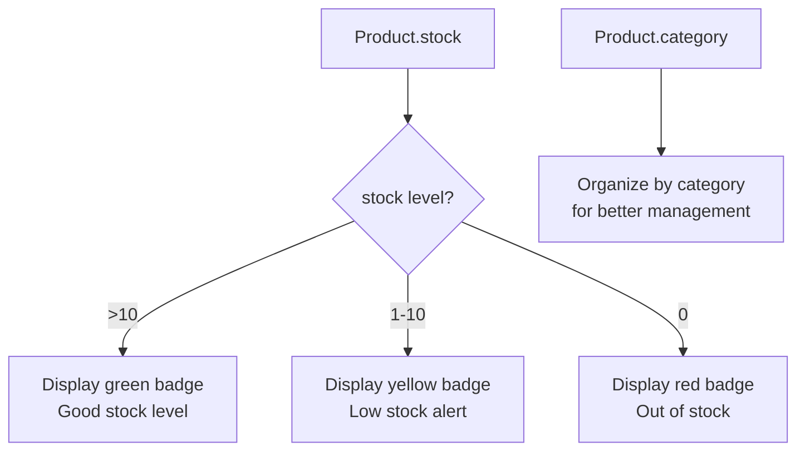
```mermaid
flowchart TD
Stock["Product.stock"] --> Check{"stock level?"}
Check --> |>10| Green["Display green badge<br/>Good stock level"]
Check --> |1-10| Yellow["Display yellow badge<br/>Low stock alert"]
Check --> |0| Red["Display red badge<br/>Out of stock"]
Category["Product.category"] --> Organize["Organize by category<br/>for better management"]
```

**Diagram sources**
- [Product.js:10](file://backend/models/Product.js#L10)
- [ProductsManagement.jsx:338-346](file://frontend/src/components/admin/ProductsManagement.jsx#L338-L346)
- [Home.jsx:64-70](file://frontend/src/pages/Home.jsx#L64-L70)

**Section sources**
- [Product.js:10](file://backend/models/Product.js#L10)
- [ProductsManagement.jsx:338-346](file://frontend/src/components/admin/ProductsManagement.jsx#L338-L346)
- [Home.jsx:64-70](file://frontend/src/pages/Home.jsx#L64-L70)

### Extending Product Attributes, Custom Fields, and Advanced Filtering
- **MRP Support**: OriginalPrice field enables pricing with discounts and promotional pricing
- **Enhanced Schema**: Easy extension of Product model with new fields
- **Controller Updates**: Controllers handle new fields with validation and type conversion
- **Frontend Integration**: Forms automatically adapt to schema changes
- **Advanced Filtering**: Controllers support complex queries with multiple filter criteria
- **Bulk Operations**: Controllers support batch operations for improved efficiency
- **Category Extensions**: Category hierarchies and attributes can be extended

## Dependency Analysis
Key dependencies and relationships have been restructured for better organization:
- **ProductsManagement** depends on backend routes and image helper utilities
- **AdminDashboard** serves as orchestrator for different admin components
- **CategoryManagement** operates independently with its own API integration
- **Controllers** depend on Product and Category models
- **Frontend components** share common utilities and styling
- **Cloudinary integration** provides centralized image management

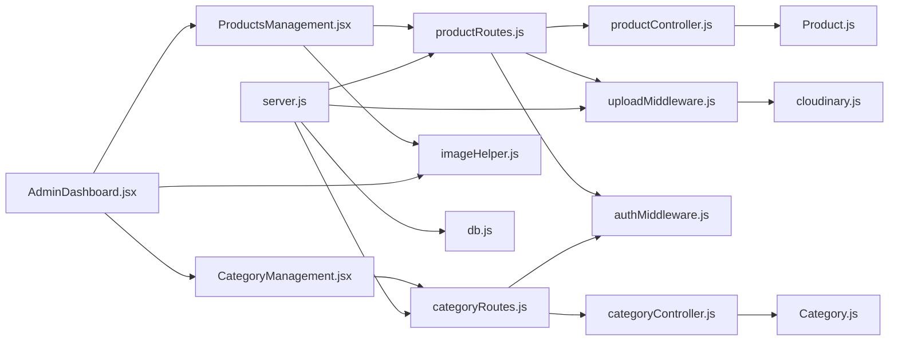
```mermaid
graph LR
AdminDashboard["AdminDashboard.jsx"] --> ProductsManagement["ProductsManagement.jsx"]
AdminDashboard --> CategoryManagement["CategoryManagement.jsx"]
ProductsManagement --> ProductRoutes["productRoutes.js"]
CategoryManagement --> CategoryRoutes["categoryRoutes.js"]
ProductRoutes --> ProductController["productController.js"]
CategoryRoutes --> CategoryController["categoryController.js"]
ProductController --> ProductModel["Product.js"]
CategoryController --> CategoryModel["Category.js"]
ProductRoutes --> Auth["authMiddleware.js"]
CategoryRoutes --> Auth
ProductRoutes --> Upload["uploadMiddleware.js"]
Upload --> Cloudinary["cloudinary.js"]
ProductsManagement --> ImgHelper["imageHelper.js"]
AdminDashboard --> ImgHelper
Server["server.js"] --> ProductRoutes
Server --> CategoryRoutes
Server --> DB["db.js"]
Server --> Upload
```

**Diagram sources**
- [AdminDashboard.jsx:1-283](file://frontend/src/pages/AdminDashboard.jsx#L1-L283)
- [ProductsManagement.jsx:1-418](file://frontend/src/components/admin/ProductsManagement.jsx#L1-L418)
- [CategoryManagement.jsx:1-224](file://frontend/src/components/admin/CategoryManagement.jsx#L1-L224)
- [productRoutes.js:12-22](file://backend/routes/productRoutes.js#L12-L22)
- [categoryRoutes.js:1-27](file://backend/routes/categoryRoutes.js#L1-L27)
- [productController.js:1-137](file://backend/controllers/productController.js#L1-L137)
- [categoryController.js:1-134](file://backend/controllers/categoryController.js#L1-L134)
- [Product.js:1-13](file://backend/models/Product.js#L1-L13)
- [Category.js:1-46](file://backend/models/Category.js#L1-L46)
- [authMiddleware.js:4-20](file://backend/middleware/authMiddleware.js#L4-L20)
- [uploadMiddleware.js:1-56](file://backend/middleware/uploadMiddleware.js#L1-L56)
- [cloudinary.js:1-13](file://backend/config/cloudinary.js#L1-L13)
- [imageHelper.js:1-5](file://frontend/src/utils/imageHelper.js#L1-L5)
- [server.js:54-55](file://backend/server.js#L54-L55)
- [db.js:5-13](file://backend/config/db.js#L5-L13)

**Section sources**
- [AdminDashboard.jsx:1-283](file://frontend/src/pages/AdminDashboard.jsx#L1-L283)
- [ProductsManagement.jsx:1-418](file://frontend/src/components/admin/ProductsManagement.jsx#L1-L418)
- [CategoryManagement.jsx:1-224](file://frontend/src/components/admin/CategoryManagement.jsx#L1-L224)
- [productRoutes.js:12-22](file://backend/routes/productRoutes.js#L12-L22)
- [categoryRoutes.js:1-27](file://backend/routes/categoryRoutes.js#L1-L27)
- [productController.js:1-137](file://backend/controllers/productController.js#L1-L137)
- [categoryController.js:1-134](file://backend/controllers/categoryController.js#L1-L134)

## Performance Considerations
- **Pagination Optimization**: 10 products per page reduces initial load time and improves responsiveness
- **Component Separation**: Dedicated components improve code organization and maintainability
- **Indexing**: Consider adding indexes on frequently queried fields (e.g., category, name, description)
- **Cloudinary Optimization**: Automatic compression and format optimization reduces bandwidth usage
- **Category Caching**: Cache category lists in frontend to reduce API calls during product creation
- **Image Optimization**: Leverage Cloudinary's automatic optimization features for better performance
- **Validation**: Keep validation close to the controller to fail fast and reduce unnecessary database writes
- **State Management**: Efficient state management in ProductsManagement component prevents unnecessary re-renders

## Troubleshooting Guide
Common issues and resolutions:
- **Authentication Errors**: Ensure Authorization header is present and valid; admin role is required
- **Cloudinary Upload Errors**: Verify Cloudinary credentials are configured correctly; check network connectivity
- **Product Not Found**: Confirm product ID validity and endpoint correctness
- **Validation Failures**: Ensure required fields are provided and numeric fields are valid numbers
- **Category Not Found**: Verify category exists and is active; check category slug generation
- **Image URLs**: Confirm Cloudinary configuration and secure URL resolution
- **Pagination Issues**: Check page parameter and limit values; verify totalProducts calculation
- **MRP Field Errors**: Ensure originalPrice is a valid number when provided

**Section sources**
- [authMiddleware.js:4-20](file://backend/middleware/authMiddleware.js#L4-L20)
- [uploadMiddleware.js:17-27](file://backend/middleware/uploadMiddleware.js#L17-L27)
- [productController.js:40-48](file://backend/controllers/productController.js#L40-L48)
- [categoryController.js:30-37](file://backend/controllers/categoryController.js#L30-L37)
- [imageHelper.js:1-5](file://frontend/src/utils/imageHelper.js#L1-L5)
- [ProductsManagement.jsx:70-74](file://frontend/src/components/admin/ProductsManagement.jsx#L70-L74)

## Conclusion
The admin product management system has undergone a major restructuring that significantly improves organization and user experience. The migration from integrated product management within AdminDashboard.jsx to dedicated ProductsManagement.jsx component provides better separation of concerns and maintainability. Key enhancements include pagination support (10 products per page), MRP (Maximum Retail Price) support, enhanced form handling with multi-image upload capabilities, and improved component organization. The system maintains all existing functionality while providing a more scalable and user-friendly interface for managing products and categories. The enhanced architecture supports future extensions and provides a solid foundation for additional administrative features.

## Appendices

### API Endpoints Summary
- **GET /api/products**: List products with search, category filter, pagination (default 12 per page)
- **GET /api/products/:id**: Retrieve a single product
- **POST /api/products**: Admin-only creation with Cloudinary images (max 3)
- **PUT /api/products/:id**: Admin-only update with Cloudinary images
- **DELETE /api/products/:id**: Admin-only deletion
- **GET /api/categories**: List active categories for frontend display
- **GET /api/categories/all**: Admin-only list of all categories
- **GET /api/categories/:id**: Admin-only category retrieval
- **POST /api/categories**: Admin-only category creation
- **PUT /api/categories/:id**: Admin-only category update
- **DELETE /api/categories/:id**: Admin-only category deletion

**Section sources**
- [productRoutes.js:14-21](file://backend/routes/productRoutes.js#L14-L21)
- [categoryRoutes.js:15-24](file://backend/routes/categoryRoutes.js#L15-L24)

### Product Data Structure
- **name**: string (required)
- **description**: string (required)
- **price**: number (required, selling price)
- **originalPrice**: number (optional, MRP)
- **images**: string[] (Cloudinary secure URLs, up to 3)
- **category**: string (required)
- **stock**: number (required, default 0)
- **timestamps**: createdAt, updatedAt

**Section sources**
- [Product.js:3-13](file://backend/models/Product.js#L3-L13)

### Category Data Structure
- **name**: string (required, unique)
- **slug**: string (required, unique, auto-generated)
- **description**: string (optional)
- **icon**: string (optional, emoji or URL)
- **isActive**: boolean (default true)
- **displayOrder**: number (default 0)
- **timestamps**: createdAt, updatedAt

**Section sources**
- [Category.js:3-35](file://backend/models/Category.js#L3-L35)

### Validation Rules
- **Required Fields**: name, description, price, category, stock
- **Numeric Fields**: price, originalPrice, stock must be numbers
- **Image Constraints**: up to 3 images, allowed types jpg/jpeg/png/webp/gif, max 5 MB
- **Category Constraints**: name unique, slug auto-generated, displayOrder numeric
- **Pagination**: Default 10 products per page, configurable via query parameters

**Section sources**
- [productController.js:52-83](file://backend/controllers/productController.js#L52-L83)
- [uploadMiddleware.js:50-56](file://backend/middleware/uploadMiddleware.js#L50-L56)
- [Category.js:4-32](file://backend/models/Category.js#L4-L32)
- [ProductsManagement.jsx:15-22](file://frontend/src/components/admin/ProductsManagement.jsx#L15-L22)

### Enhanced Features
- **Dedicated Products Management Component**: Separate component with comprehensive functionality
- **Pagination Support**: 10 products per page with navigation controls
- **MRP (Maximum Retail Price)**: OriginalPrice field for promotional pricing
- **Enhanced Form Handling**: Multi-image upload with preview and removal
- **Improved User Experience**: Better organization and streamlined workflows
- **Admin Validation**: Automatic access verification and redirection
- **Color-Coded Stock Display**: Visual indicators for stock levels
- **Category Integration**: Seamless category selection and management

**Section sources**
- [ProductsManagement.jsx:8-418](file://frontend/src/components/admin/ProductsManagement.jsx#L8-L418)
- [Product.js:7](file://backend/models/Product.js#L7)
- [AdminDashboard.jsx:262-274](file://frontend/src/pages/AdminDashboard.jsx#L262-L274)