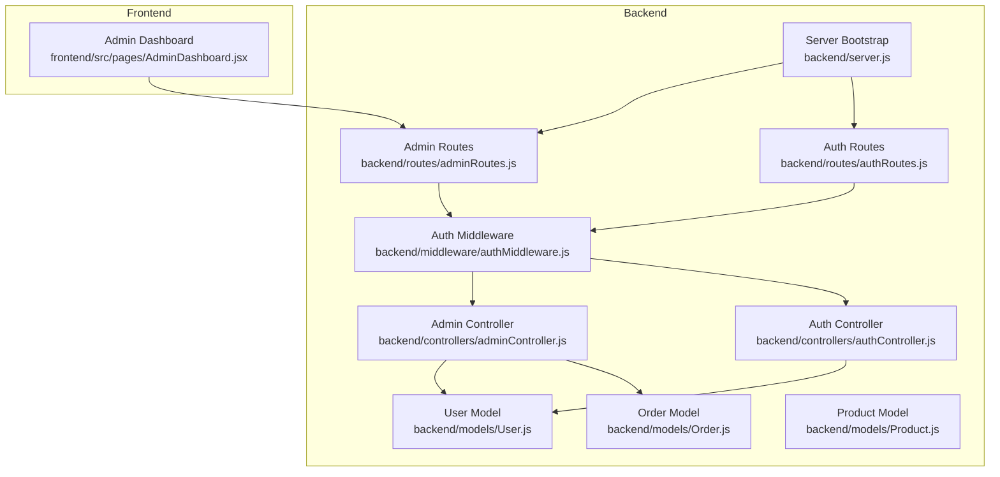
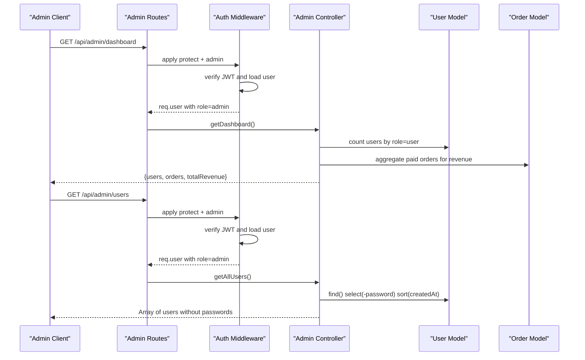
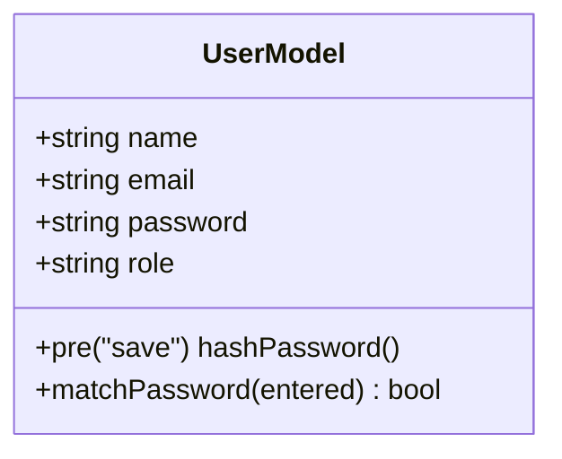
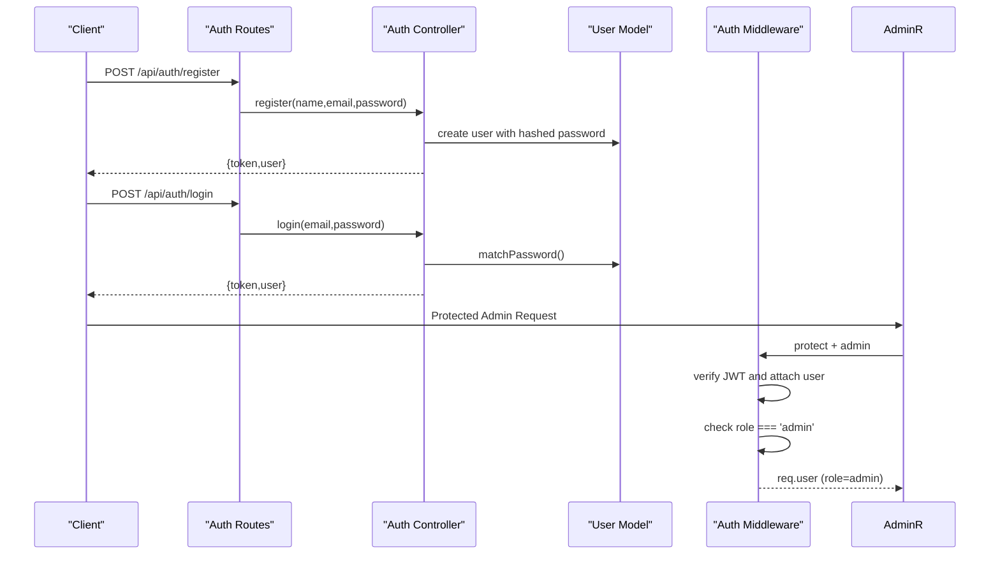
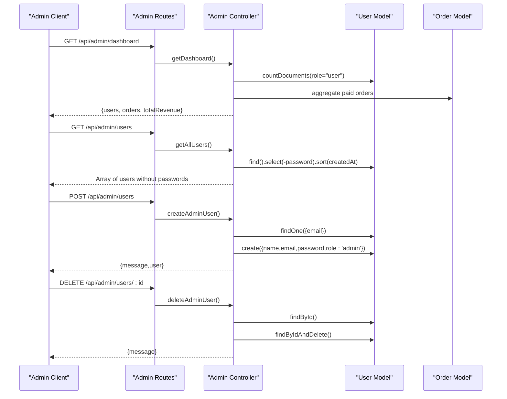
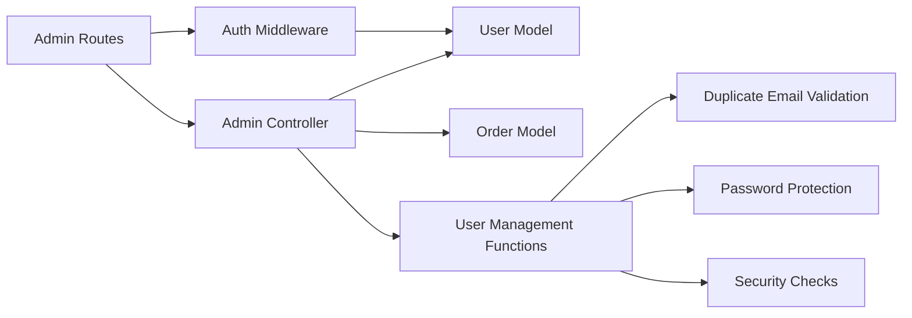

# User Administration

<cite>
**Referenced Files in This Document**
- [User.js](file://backend/models/User.js)
- [Order.js](file://backend/models/Order.js)
- [Product.js](file://backend/models/Product.js)
- [adminController.js](file://backend/controllers/adminController.js)
- [authController.js](file://backend/controllers/authController.js)
- [adminRoutes.js](file://backend/routes/adminRoutes.js)
- [authRoutes.js](file://backend/routes/authRoutes.js)
- [authMiddleware.js](file://backend/middleware/authMiddleware.js)
- [server.js](file://backend/server.js)
- [AdminDashboard.jsx](file://frontend/src/pages/AdminDashboard.jsx)
</cite>

## Update Summary
**Changes Made**
- Added comprehensive admin user management CRUD operations
- Enhanced security with password protection and duplicate email validation
- Implemented self-deletion prevention and role-based access control
- Updated admin dashboard with user management interface
- Added getAllUsers, createAdminUser, and deleteAdminUser functionality

## Table of Contents
1. [Introduction](#introduction)
2. [Project Structure](#project-structure)
3. [Core Components](#core-components)
4. [Architecture Overview](#architecture-overview)
5. [Detailed Component Analysis](#detailed-component-analysis)
6. [Dependency Analysis](#dependency-analysis)
7. [Performance Considerations](#performance-considerations)
8. [Troubleshooting Guide](#troubleshooting-guide)
9. [Conclusion](#conclusion)
10. [Appendices](#appendices)

## Introduction
This document describes the enhanced admin user management system for the e-commerce platform. The system now provides comprehensive CRUD operations for managing administrator accounts, including user profile viewing, role assignments, and account status controls. It features password protection, duplicate email validation, and robust security checks including self-deletion prevention. The system includes user activity monitoring, login history tracking, suspicious activity detection, user search and filtering capabilities, bulk user operations, and account deactivation procedures. It also covers user data structures, permissions, audit trail logging, communication features, verification workflows, and data privacy compliance. Guidance is provided for extending user attributes and implementing advanced user segmentation.

## Project Structure
The backend is organized around models, controllers, routes, and middleware. Authentication and authorization are handled centrally, while administrative dashboards and order management are exposed via dedicated routes. The admin user management system is now fully integrated with the frontend admin dashboard.

**Diagram sources**
- [server.js:57-63](file://backend/server.js#L57-L63)
- [adminRoutes.js:1-19](file://backend/routes/adminRoutes.js#L1-L19)
- [authRoutes.js:1-9](file://backend/routes/authRoutes.js#L1-L9)
- [authMiddleware.js:1-20](file://backend/middleware/authMiddleware.js#L1-L20)
- [adminController.js:1-86](file://backend/controllers/adminController.js#L1-L86)
- [authController.js:1-27](file://backend/controllers/authController.js#L1-L27)
- [User.js:1-20](file://backend/models/User.js#L1-L20)
- [Order.js:1-33](file://backend/models/Order.js#L1-L33)
- [Product.js:1-12](file://backend/models/Product.js#L1-L12)
- [AdminDashboard.jsx:1-200](file://frontend/src/pages/AdminDashboard.jsx#L1-L200)

**Section sources**
- [server.js:57-63](file://backend/server.js#L57-L63)
- [adminRoutes.js:1-19](file://backend/routes/adminRoutes.js#L1-L19)
- [authRoutes.js:1-9](file://backend/routes/authRoutes.js#L1-L9)
- [authMiddleware.js:1-20](file://backend/middleware/authMiddleware.js#L1-L20)

## Core Components
- User model defines identity, authentication, and roles with password hashing and comparison methods.
- Admin controller exposes comprehensive user management operations including dashboard metrics, order listing, order status updates, and user CRUD operations.
- Auth controller handles registration and login with JWT tokens.
- Admin routes enforce protection and admin-only access with dedicated endpoints for user management.
- Auth middleware enforces JWT-based authentication and admin role checks.
- Frontend admin dashboard provides user interface for managing administrators.

Key responsibilities:
- User account management: create, authenticate, enforce role-based access, and manage admin users.
- Activity monitoring: dashboard aggregates user counts and revenue.
- Login history tracking: not implemented yet; see Recommendations.
- Suspicious activity detection: not implemented yet; see Recommendations.
- Search and filtering: not implemented yet; see Recommendations.
- Bulk operations: not implemented yet; see Recommendations.
- Account deactivation: not implemented yet; see Recommendations.
- Audit trail logging: not implemented yet; see Recommendations.
- Communication features: not implemented yet; see Recommendations.
- Verification workflows: not implemented yet; see Recommendations.
- Privacy compliance: not implemented yet; see Recommendations.

**Section sources**
- [User.js:4-18](file://backend/models/User.js#L4-L18)
- [adminController.js:5-86](file://backend/controllers/adminController.js#L5-L86)
- [authController.js:6-26](file://backend/controllers/authController.js#L6-L26)
- [adminRoutes.js:7-17](file://backend/routes/adminRoutes.js#L7-L17)
- [authMiddleware.js:4-20](file://backend/middleware/authMiddleware.js#L4-L20)
- [AdminDashboard.jsx:141-183](file://frontend/src/pages/AdminDashboard.jsx#L141-L183)

## Architecture Overview
The system uses Express with JWT-based authentication and role-based authorization. Admin routes are protected by two middleware layers: authentication and admin-role checks. Controllers coordinate with models to serve data, and the frontend provides a comprehensive admin dashboard for user management operations.

**Diagram sources**
- [adminRoutes.js:7-17](file://backend/routes/adminRoutes.js#L7-L17)
- [authMiddleware.js:4-20](file://backend/middleware/authMiddleware.js#L4-L20)
- [adminController.js:26-34](file://backend/controllers/adminController.js#L26-L34)

## Detailed Component Analysis

### User Data Model
The User model stores identity, hashed passwords, and roles. It includes hooks to hash passwords before saving and a method to compare passwords during login. The model enforces unique email addresses and provides role-based access control.

**Diagram sources**
- [User.js:4-18](file://backend/models/User.js#L4-L18)

**Section sources**
- [User.js:4-18](file://backend/models/User.js#L4-L18)

### Authentication and Authorization
- Registration and login are handled by the auth controller, returning a JWT token and sanitized user payload.
- Authentication middleware verifies JWT and attaches a user without the password field.
- Admin middleware ensures the user has role admin.
- All admin routes are protected by both authentication and admin middleware.

**Diagram sources**
- [authRoutes.js:6-7](file://backend/routes/authRoutes.js#L6-L7)
- [authController.js:6-26](file://backend/controllers/authController.js#L6-L26)
- [authMiddleware.js:4-20](file://backend/middleware/authMiddleware.js#L4-L20)
- [adminRoutes.js:7-8](file://backend/routes/adminRoutes.js#L7-L8)

**Section sources**
- [authController.js:6-26](file://backend/controllers/authController.js#L6-L26)
- [authMiddleware.js:4-20](file://backend/middleware/authMiddleware.js#L4-L20)
- [authRoutes.js:6-7](file://backend/routes/authRoutes.js#L6-L7)

### Admin Dashboard and Orders
- Dashboard endpoint returns counts of users, orders, and aggregated revenue from paid orders.
- Orders listing endpoint returns recent orders with user details populated.
- Order status update endpoint allows changing order state.
- **New**: Admin user management endpoints for comprehensive user operations.

**Diagram sources**
- [adminRoutes.js:10-17](file://backend/routes/adminRoutes.js#L10-L17)
- [adminController.js:5-86](file://backend/controllers/adminController.js#L5-L86)
- [Order.js:3-31](file://backend/models/Order.js#L3-L31)

**Section sources**
- [adminController.js:5-86](file://backend/controllers/adminController.js#L5-L86)
- [adminRoutes.js:10-17](file://backend/routes/adminRoutes.js#L10-L17)
- [Order.js:3-31](file://backend/models/Order.js#L3-L31)

### Enhanced Admin User Management System
The system now provides comprehensive CRUD operations for managing administrator accounts with robust security measures:

#### User Retrieval
- `GET /api/admin/users`: Retrieves all users without exposing passwords
- Returns sorted array of users by creation date (newest first)
- Uses `.select('-password')` to prevent password exposure

#### Admin Creation
- `POST /api/admin/users`: Creates new admin users with validation
- Validates duplicate email addresses before creation
- Automatically assigns role 'admin'
- Hashes passwords using bcrypt before storage
- Returns success message with user details (excluding password)

#### Admin Deletion
- `DELETE /api/admin/users/:id`: Removes admin users with security checks
- Prevents deletion of non-admin users
- Prevents self-deletion by comparing with authenticated user ID
- Returns success message upon successful deletion

#### Security Features
- Duplicate email validation prevents account duplication
- Self-deletion prevention protects against accidental account removal
- Role-based access control ensures only admins can manage users
- Password protection through bcrypt hashing
- Error handling with appropriate HTTP status codes

**Section sources**
- [adminController.js:26-86](file://backend/controllers/adminController.js#L26-L86)
- [adminRoutes.js:14-17](file://backend/routes/adminRoutes.js#L14-L17)
- [User.js:11-18](file://backend/models/User.js#L11-L18)

### Frontend Admin Dashboard Integration
The frontend admin dashboard provides a comprehensive interface for managing administrators:

#### User Interface Features
- Tabbed interface with products, orders, and admins sections
- Admin management form for creating new administrators
- Table display of all admin users with name, email, and creation date
- Confirmation dialogs for admin deletion operations
- Real-time admin list updates after CRUD operations

#### Form Validation and Error Handling
- Client-side validation for admin creation form
- Password minimum length requirement (6 characters)
- Local storage-based self-deletion prevention
- Toast notifications for user feedback
- Automatic form reset after successful operations

#### API Integration
- Fetches admin users via `GET /api/admin/users`
- Creates new admins via `POST /api/admin/users`
- Deletes admins via `DELETE /api/admin/users/:id`
- Integrates with backend middleware for authentication and authorization

**Section sources**
- [AdminDashboard.jsx:141-183](file://frontend/src/pages/AdminDashboard.jsx#L141-L183)
- [AdminDashboard.jsx:153-167](file://frontend/src/pages/AdminDashboard.jsx#L153-L167)
- [AdminDashboard.jsx:169-183](file://frontend/src/pages/AdminDashboard.jsx#L169-L183)

### User Search, Filtering, Bulk Operations, and Deactivation
Current implementation provides basic user management but can be extended:

#### Current Capabilities
- Basic user listing without password exposure
- Simple admin creation with duplicate validation
- Secure admin deletion with self-prevention

#### Recommended Enhancements
- Add endpoints under `/api/admin/users` supporting:
  - GET with query params for search and pagination
  - PUT/POST for bulk actions (disable, send notification)
  - DELETE for deactivation with audit logs
- Implement advanced filtering by role, creation date, and activity status
- Add bulk operation support for mass user management
- Implement soft deletion with restore capability

**Section sources**
- [adminRoutes.js:7-17](file://backend/routes/adminRoutes.js#L7-L17)
- [authMiddleware.js:17-20](file://backend/middleware/authMiddleware.js#L17-L20)

### Login History Tracking and Suspicious Activity Detection
Current implementation does not track:
- Login history
- Suspicious activity detection

Recommendations:
- Extend User model with loginAttempts, lastLogin, lockedUntil, and failedLoginIPs.
- Add a LoginAttempt model to record IP, device, location, and status per login event.
- Implement rate limiting and anomaly detection (e.g., rapid successive failures, geographically distant logins).
- Add endpoints to view login history and flagged attempts.

**Section sources**
- [User.js:4-18](file://backend/models/User.js#L4-L18)

### Audit Trail Logging
Current implementation does not maintain audit logs.

Recommendations:
- Create an AuditLog model storing actor, action, target, metadata, and timestamp.
- Log critical actions: user creation/deactivation, role changes, bulk operations, order status changes.
- Expose read-only audit endpoints for admins.

**Section sources**
- [Order.js:3-31](file://backend/models/Order.js#L3-L31)

### User Communication and Verification Workflows
Current implementation does not include:
- Email verification
- Password reset workflows
- In-app messaging or notifications

Recommendations:
- Add verification tokens and resend verification endpoints.
- Implement password reset with secure tokens.
- Integrate with an email service provider and add notification endpoints.

**Section sources**
- [authController.js:6-26](file://backend/controllers/authController.js#L6-L26)

### Data Privacy Compliance
Current implementation does not include:
- Data retention policies
- Right-to-be-forgotten deletion
- Consent management

Recommendations:
- Add consent fields and opt-out mechanisms.
- Implement automated data deletion after retention periods.
- Provide data export and deletion endpoints with admin approval logs.

**Section sources**
- [User.js:4-18](file://backend/models/User.js#L4-L18)

### Extending User Attributes and Advanced Segmentation
Current User model supports basic identity and role. To enable advanced segmentation:
- Add fields: dateOfBirth, billingAddress, shippingAddress, preferences, tags, lastActive.
- Index frequently queried fields for search/filter performance.
- Use aggregation pipelines for cohort analytics and behavioral segmentation.

**Section sources**
- [User.js:4-8](file://backend/models/User.js#L4-L8)

## Dependency Analysis
The admin module depends on the User and Order models. Authentication and authorization are centralized in middleware consumed by routes. The frontend admin dashboard integrates with backend admin routes for comprehensive user management.

**Diagram sources**
- [adminRoutes.js:1-19](file://backend/routes/adminRoutes.js#L1-L19)
- [authMiddleware.js:1-20](file://backend/middleware/authMiddleware.js#L1-L20)
- [adminController.js:1-86](file://backend/controllers/adminController.js#L1-L86)
- [User.js:1-20](file://backend/models/User.js#L1-L20)
- [Order.js:1-33](file://backend/models/Order.js#L1-L33)

**Section sources**
- [adminRoutes.js:1-19](file://backend/routes/adminRoutes.js#L1-L19)
- [authMiddleware.js:1-20](file://backend/middleware/authMiddleware.js#L1-L20)
- [adminController.js:1-86](file://backend/controllers/adminController.js#L1-L86)

## Performance Considerations
- Use database indexes on frequently filtered fields (email, role, timestamps).
- Paginate admin endpoints to avoid large payloads.
- Cache dashboard metrics periodically to reduce aggregation overhead.
- Monitor JWT token expiration and refresh strategies.
- **New**: Consider implementing pagination for user listings to handle large admin databases efficiently.

## Troubleshooting Guide
Common issues and resolutions:
- Not authorized: Ensure a valid JWT is sent in the Authorization header.
- Access denied: Verify the user role is admin.
- Invalid token: Confirm JWT_SECRET correctness and token freshness.
- Database connection errors: Check environment variables and connection string.
- **New**: Duplicate email errors: Ensure unique email addresses when creating admin users.
- **New**: Self-deletion prevention: Cannot delete your own admin account.
- **New**: Non-admin deletion attempts: Only admin users can be deleted via admin endpoints.

**Section sources**
- [authMiddleware.js:4-14](file://backend/middleware/authMiddleware.js#L4-L14)
- [authRoutes.js:6-7](file://backend/routes/authRoutes.js#L6-L7)
- [adminController.js:76-79](file://backend/controllers/adminController.js#L76-L79)

## Conclusion
The enhanced admin user management system provides a comprehensive foundation for authentication, authorization, basic dashboard reporting, and full CRUD operations for managing administrator accounts. The system now includes robust security measures such as password protection, duplicate email validation, and self-deletion prevention. To meet comprehensive admin needs—search, filtering, bulk operations, deactivation, login history, suspicious activity detection, audit trails, communication, verification, and privacy compliance—extend the routes, models, and middleware as outlined in the recommendations.

## Appendices

### API Definitions

- Authentication
  - POST /api/auth/register
    - Body: { name, email, password }
    - Response: { token, user: { id, name, email, role } }
  - POST /api/auth/login
    - Body: { email, password }
    - Response: { token, user: { id, name, email, role } }

- Admin Dashboard
  - GET /api/admin/dashboard
    - Response: { users, orders, totalRevenue }

- Admin Orders
  - GET /api/admin/orders
    - Response: Array of orders with populated user details
  - PUT /api/admin/orders/:id/status
    - Body: { status }
    - Response: Updated order

- **Enhanced Admin User Management**
  - GET /api/admin/users
    - Response: Array of users without passwords, sorted by creation date
  - POST /api/admin/users
    - Body: { name, email, password }
    - Response: { message, user: { id, name, email, role } }
  - DELETE /api/admin/users/:id
    - Response: { message }

Notes:
- All admin endpoints require Authorization header with a valid JWT.
- Admin-only access enforced by middleware.
- **New**: User management endpoints automatically hash passwords and validate duplicates.
- **New**: Self-deletion prevention protects admin accounts from accidental removal.

**Section sources**
- [authRoutes.js:6-7](file://backend/routes/authRoutes.js#L6-L7)
- [adminRoutes.js:10-17](file://backend/routes/adminRoutes.js#L10-L17)
- [authMiddleware.js:4-20](file://backend/middleware/authMiddleware.js#L4-L20)
- [adminController.js:26-86](file://backend/controllers/adminController.js#L26-L86)