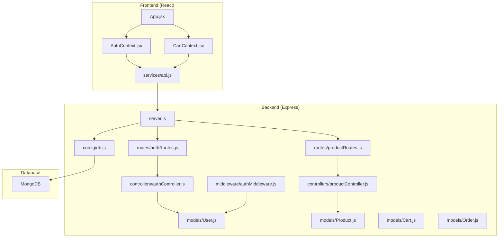
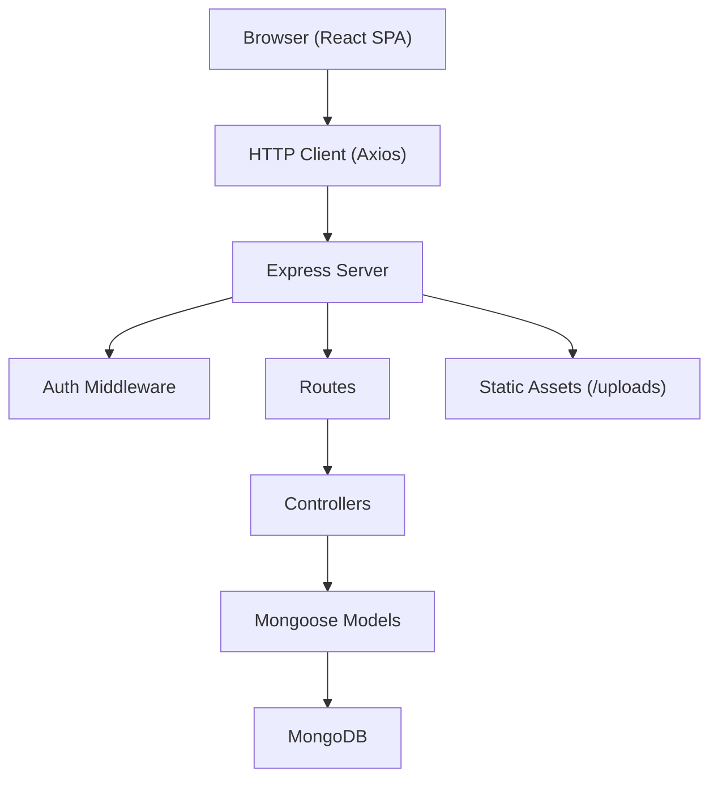
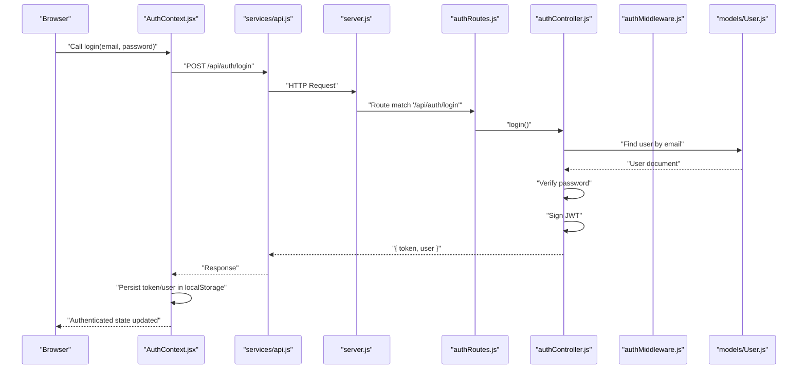
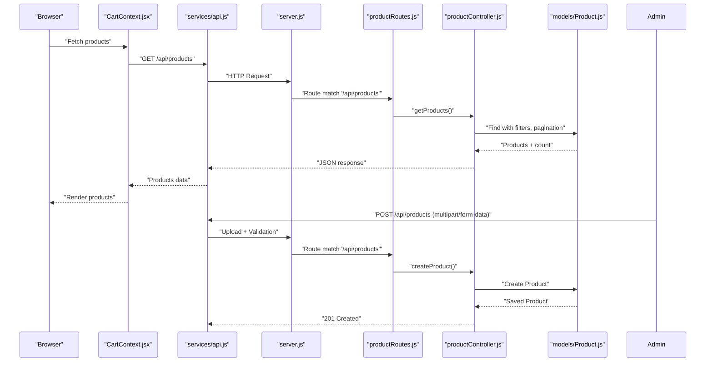
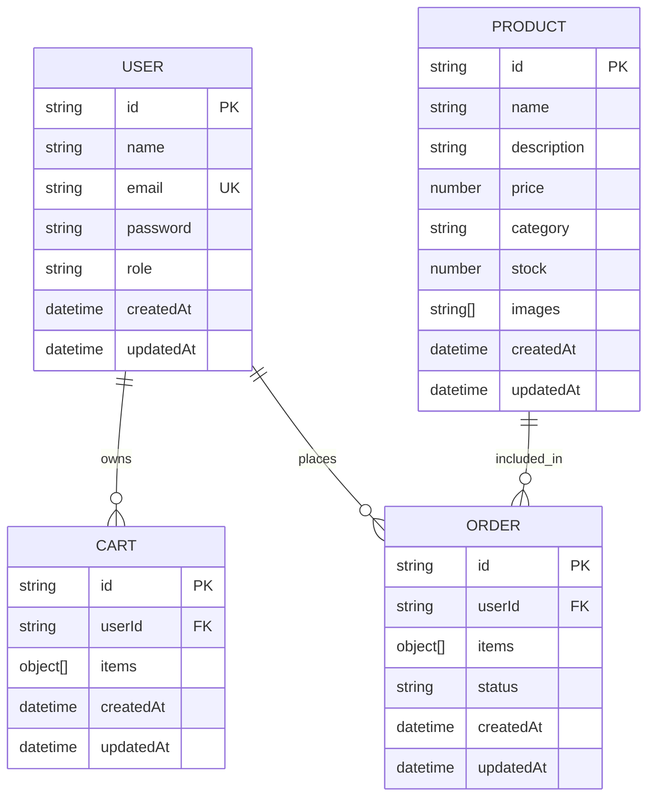
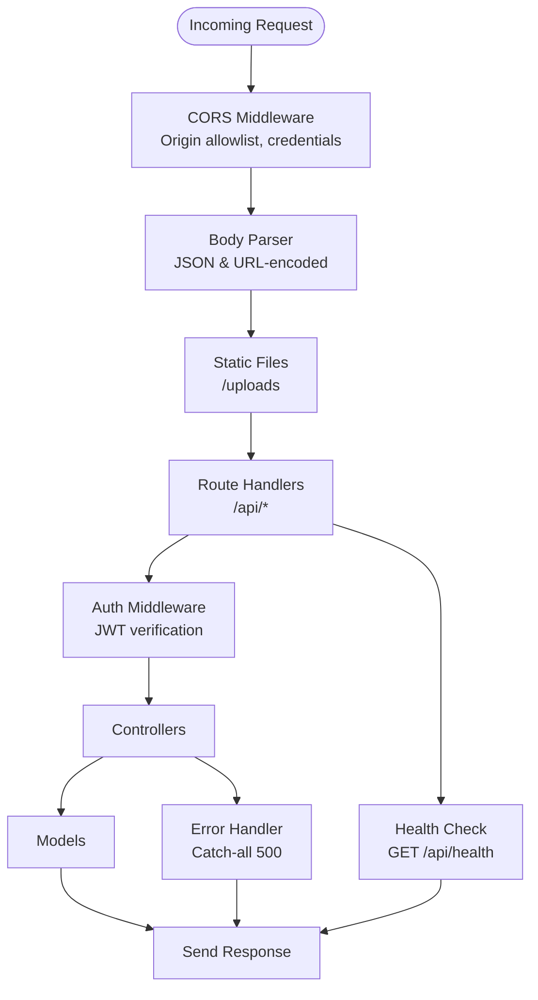
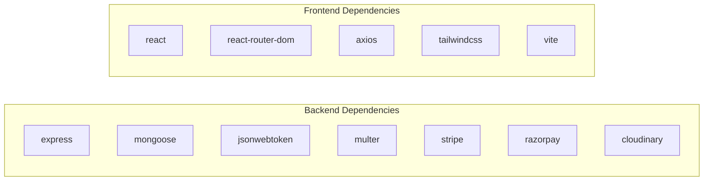
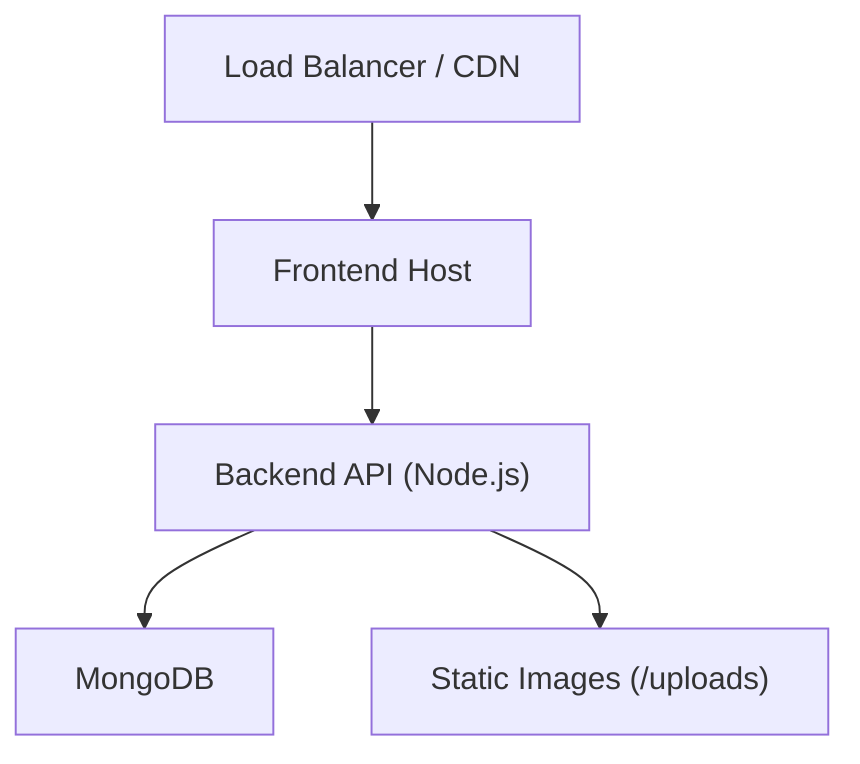

# Architecture & Design

<cite>
**Referenced Files in This Document**
- [server.js](file://backend/server.js)
- [db.js](file://backend/config/db.js)
- [authController.js](file://backend/controllers/authController.js)
- [productController.js](file://backend/controllers/productController.js)
- [authRoutes.js](file://backend/routes/authRoutes.js)
- [productRoutes.js](file://backend/routes/productRoutes.js)
- [authMiddleware.js](file://backend/middleware/authMiddleware.js)
- [User.js](file://backend/models/User.js)
- [Product.js](file://backend/models/Product.js)
- [Cart.js](file://backend/models/Cart.js)
- [Order.js](file://backend/models/Order.js)
- [api.js](file://frontend/src/services/api.js)
- [AuthContext.jsx](file://frontend/src/context/AuthContext.jsx)
- [CartContext.jsx](file://frontend/src/context/CartContext.jsx)
- [App.jsx](file://frontend/src/App.jsx)
- [Dockerfile](file://backend/Dockerfile)
- [package.json](file://backend/package.json)
- [package.json](file://frontend/package.json)
</cite>

## Table of Contents
1. [Introduction](#introduction)
2. [Project Structure](#project-structure)
3. [Core Components](#core-components)
4. [Architecture Overview](#architecture-overview)
5. [Detailed Component Analysis](#detailed-component-analysis)
6. [Dependency Analysis](#dependency-analysis)
7. [Performance Considerations](#performance-considerations)
8. [Troubleshooting Guide](#troubleshooting-guide)
9. [Conclusion](#conclusion)
10. [Appendices](#appendices)

## Introduction
This document describes the end-to-end architecture of the E-commerce App, covering the frontend React application, backend Express server, and MongoDB database. It explains the layered design, the Model-View-Controller (MVC) pattern implementation, and the data flow across frontend context providers, API services, Express routes, controllers, and models. Cross-cutting concerns such as authentication, middleware, CORS, error handling, and performance are documented alongside deployment and scalability considerations.

## Project Structure
The system is split into three primary areas:
- Frontend: React SPA built with Vite, using React Router for navigation and React Context for global state (authentication and cart).
- Backend: Express server with modular route/controller/model structure, JWT-based authentication, and MongoDB via Mongoose.
- Database: MongoDB for storing Users, Products, Carts, and Orders.

**Diagram sources**
- [server.js:1-85](file://backend/server.js#L1-L85)
- [authRoutes.js:1-9](file://backend/routes/authRoutes.js#L1-L9)
- [productRoutes.js:1-23](file://backend/routes/productRoutes.js#L1-L23)
- [authController.js:1-27](file://backend/controllers/authController.js#L1-L27)
- [productController.js:1-127](file://backend/controllers/productController.js#L1-L127)
- [authMiddleware.js:1-20](file://backend/middleware/authMiddleware.js#L1-L20)
- [User.js:1-20](file://backend/models/User.js#L1-L20)
- [Product.js](file://backend/models/Product.js)
- [Cart.js](file://backend/models/Cart.js)
- [Order.js](file://backend/models/Order.js)
- [db.js:1-14](file://backend/config/db.js#L1-L14)
- [api.js:1-8](file://frontend/src/services/api.js#L1-L8)
- [AuthContext.jsx:1-33](file://frontend/src/context/AuthContext.jsx#L1-L33)
- [CartContext.jsx:1-53](file://frontend/src/context/CartContext.jsx#L1-L53)
- [App.jsx:1-66](file://frontend/src/App.jsx#L1-L66)

**Section sources**
- [server.js:1-85](file://backend/server.js#L1-L85)
- [db.js:1-14](file://backend/config/db.js#L1-L14)
- [package.json:1-27](file://backend/package.json#L1-L27)
- [package.json:1-25](file://frontend/package.json#L1-L25)

## Core Components
- Frontend
  - App shell and routing: [App.jsx:1-66](file://frontend/src/App.jsx#L1-L66)
  - Authentication context provider and hooks: [AuthContext.jsx:1-33](file://frontend/src/context/AuthContext.jsx#L1-L33)
  - Cart context provider and hooks: [CartContext.jsx:1-53](file://frontend/src/context/CartContext.jsx#L1-L53)
  - HTTP client with automatic Authorization header injection: [services/api.js:1-8](file://frontend/src/services/api.js#L1-L8)
- Backend
  - Entry point and middleware stack: [server.js:1-85](file://backend/server.js#L1-L85)
  - Database connection: [db.js:1-14](file://backend/config/db.js#L1-L14)
  - Authentication controller and routes: [authController.js:1-27](file://backend/controllers/authController.js#L1-L27), [authRoutes.js:1-9](file://backend/routes/authRoutes.js#L1-L9)
  - Product controller and routes: [productController.js:1-127](file://backend/controllers/productController.js#L1-L127), [productRoutes.js:1-23](file://backend/routes/productRoutes.js#L1-L23)
  - Authentication middleware: [authMiddleware.js:1-20](file://backend/middleware/authMiddleware.js#L1-L20)
  - Domain models: [User.js:1-20](file://backend/models/User.js#L1-L20), [Product.js](file://backend/models/Product.js), [Cart.js](file://backend/models/Cart.js), [Order.js](file://backend/models/Order.js)

**Section sources**
- [App.jsx:1-66](file://frontend/src/App.jsx#L1-L66)
- [AuthContext.jsx:1-33](file://frontend/src/context/AuthContext.jsx#L1-L33)
- [CartContext.jsx:1-53](file://frontend/src/context/CartContext.jsx#L1-L53)
- [api.js:1-8](file://frontend/src/services/api.js#L1-L8)
- [server.js:1-85](file://backend/server.js#L1-L85)
- [db.js:1-14](file://backend/config/db.js#L1-L14)
- [authController.js:1-27](file://backend/controllers/authController.js#L1-L27)
- [authRoutes.js:1-9](file://backend/routes/authRoutes.js#L1-L9)
- [productController.js:1-127](file://backend/controllers/productController.js#L1-L127)
- [productRoutes.js:1-23](file://backend/routes/productRoutes.js#L1-L23)
- [authMiddleware.js:1-20](file://backend/middleware/authMiddleware.js#L1-L20)
- [User.js:1-20](file://backend/models/User.js#L1-L20)

## Architecture Overview
The system follows a clean layered architecture:
- Presentation Layer (Frontend): React components, context providers, and HTTP client.
- Application Layer (Backend): Express routes, controllers, and middleware.
- Domain Layer (Backend): Mongoose models encapsulating domain entities and persistence logic.
- Infrastructure Layer (Backend): Database connectivity and environment configuration.

Key design principles:
- RESTful API design with resource-based URLs and standard HTTP verbs.
- JWT-based authentication with bearer tokens propagated via Authorization headers.
- Middleware chain for authentication and authorization enforcement.
- CORS configured per environment with credential support for secure cross-origin requests.

**Diagram sources**
- [server.js:1-85](file://backend/server.js#L1-L85)
- [api.js:1-8](file://frontend/src/services/api.js#L1-L8)
- [authMiddleware.js:1-20](file://backend/middleware/authMiddleware.js#L1-L20)
- [authController.js:1-27](file://backend/controllers/authController.js#L1-L27)
- [productController.js:1-127](file://backend/controllers/productController.js#L1-L127)
- [User.js:1-20](file://backend/models/User.js#L1-L20)
- [Product.js](file://backend/models/Product.js)

## Detailed Component Analysis

### Authentication Flow (JWT)
The authentication flow integrates frontend context providers, backend routes, controllers, and middleware.

**Diagram sources**
- [AuthContext.jsx:16-22](file://frontend/src/context/AuthContext.jsx#L16-L22)
- [api.js:1-8](file://frontend/src/services/api.js#L1-L8)
- [server.js:58-59](file://backend/server.js#L58-L59)
- [authRoutes.js:6-7](file://backend/routes/authRoutes.js#L6-L7)
- [authController.js:18-27](file://backend/controllers/authController.js#L18-L27)
- [authMiddleware.js:4-15](file://backend/middleware/authMiddleware.js#L4-L15)
- [User.js:16-18](file://backend/models/User.js#L16-L18)

**Section sources**
- [AuthContext.jsx:1-33](file://frontend/src/context/AuthContext.jsx#L1-L33)
- [api.js:1-8](file://frontend/src/services/api.js#L1-L8)
- [server.js:58-59](file://backend/server.js#L58-L59)
- [authRoutes.js:1-9](file://backend/routes/authRoutes.js#L1-L9)
- [authController.js:1-27](file://backend/controllers/authController.js#L1-L27)
- [authMiddleware.js:1-20](file://backend/middleware/authMiddleware.js#L1-L20)
- [User.js:1-20](file://backend/models/User.js#L1-L20)

### Product Management Workflow
Product listing, creation, updates, and deletion follow REST conventions and enforce admin-only access.

**Diagram sources**
- [CartContext.jsx:10-29](file://frontend/src/context/CartContext.jsx#L10-L29)
- [api.js:1-8](file://frontend/src/services/api.js#L1-L8)
- [server.js:59-62](file://backend/server.js#L59-L62)
- [productRoutes.js:14-21](file://backend/routes/productRoutes.js#L14-L21)
- [productController.js:3-37](file://backend/controllers/productController.js#L3-L37)
- [Product.js](file://backend/models/Product.js)

**Section sources**
- [CartContext.jsx:1-53](file://frontend/src/context/CartContext.jsx#L1-L53)
- [api.js:1-8](file://frontend/src/services/api.js#L1-L8)
- [server.js:58-63](file://backend/server.js#L58-L63)
- [productRoutes.js:1-23](file://backend/routes/productRoutes.js#L1-L23)
- [productController.js:1-127](file://backend/controllers/productController.js#L1-L127)

### Data Model Relationships
The domain models define the core entities and their relationships.

**Diagram sources**
- [User.js:4-9](file://backend/models/User.js#L4-L9)
- [Product.js](file://backend/models/Product.js)
- [Cart.js](file://backend/models/Cart.js)
- [Order.js](file://backend/models/Order.js)

**Section sources**
- [User.js:1-20](file://backend/models/User.js#L1-L20)
- [Product.js](file://backend/models/Product.js)
- [Cart.js](file://backend/models/Cart.js)
- [Order.js](file://backend/models/Order.js)

### Middleware Chain and CORS
The Express server applies middleware in a defined order: CORS, body parsing, static serving, routes, health check, and error handling. CORS is production-ready with allowed origins, credentials, and preflight caching.

**Diagram sources**
- [server.js:22-49](file://backend/server.js#L22-L49)
- [server.js:51-55](file://backend/server.js#L51-L55)
- [server.js:65-78](file://backend/server.js#L65-L78)
- [authMiddleware.js:4-15](file://backend/middleware/authMiddleware.js#L4-L15)

**Section sources**
- [server.js:1-85](file://backend/server.js#L1-L85)
- [authMiddleware.js:1-20](file://backend/middleware/authMiddleware.js#L1-L20)

## Dependency Analysis
Technology stack and module-level dependencies:
- Backend
  - Express for HTTP routing and middleware.
  - Mongoose for MongoDB ODM.
  - JWT for authentication.
  - Multer for file uploads.
  - Stripe and Razorpay for payments.
  - Cloudinary for image storage (configured but product routes currently use local uploads).
- Frontend
  - React for UI.
  - React Router for navigation.
  - Axios for HTTP client.
  - TailwindCSS and Vite for build tooling.

**Diagram sources**
- [package.json:8-22](file://backend/package.json#L8-L22)
- [package.json:8-16](file://frontend/package.json#L8-L16)

**Section sources**
- [package.json:1-27](file://backend/package.json#L1-L27)
- [package.json:1-25](file://frontend/package.json#L1-L25)

## Performance Considerations
- Pagination and filtering: Product listing supports query-based search, category filtering, and pagination to reduce payload sizes.
- Upload handling: Images are stored locally with a cap on the number of images per product to control storage growth.
- CORS preflight caching: Preflight requests are cached to minimize repeated OPTIONS calls.
- Middleware ordering: Early exit on unauthenticated requests reduces unnecessary work downstream.
- Containerization: A minimal Node.js Alpine image reduces container size and improves cold start characteristics.

[No sources needed since this section provides general guidance]

## Troubleshooting Guide
Common issues and remedies:
- CORS errors: Verify the origin is included in the allowlist and credentials are enabled when required.
- Authentication failures: Confirm the Authorization header is present and the token is valid; check JWT secret and expiration.
- Database connection: Ensure the MONGO_URI is set and reachable; confirm network policies and replica set configuration.
- File uploads: Validate multer configuration and ensure the uploads directory is writable.
- Frontend token propagation: Confirm the interceptor sets the Authorization header and localStorage contains a valid token.

**Section sources**
- [server.js:22-49](file://backend/server.js#L22-L49)
- [authMiddleware.js:4-15](file://backend/middleware/authMiddleware.js#L4-L15)
- [db.js:5-13](file://backend/config/db.js#L5-L13)
- [api.js:3-7](file://frontend/src/services/api.js#L3-L7)

## Conclusion
The E-commerce App employs a clear separation of concerns across frontend and backend layers, with a RESTful API, JWT-based authentication, and robust middleware. The MVC pattern is evident in the route-controller-model structure, while React Context providers manage global state. The architecture supports scalability through containerization, modular routing, and database indexing strategies. Security is addressed via CORS configuration, JWT verification, and admin-only endpoints. Performance is optimized through pagination, upload limits, and efficient middleware ordering.

[No sources needed since this section summarizes without analyzing specific files]

## Appendices

### Deployment Topology
- Backend container runs on port 5000, exposing the API and serving static uploads.
- Frontend is served by a CDN or static hosting; the API base URL is configurable via environment variables.
- MongoDB is provisioned externally; ensure network access and backup policies.

**Diagram sources**
- [Dockerfile:1-18](file://backend/Dockerfile#L1-L18)
- [server.js:54-55](file://backend/server.js#L54-L55)
- [db.js:7](file://backend/config/db.js#L7)

**Section sources**
- [Dockerfile:1-18](file://backend/Dockerfile#L1-L18)
- [server.js:1-85](file://backend/server.js#L1-L85)
- [db.js:1-14](file://backend/config/db.js#L1-L14)