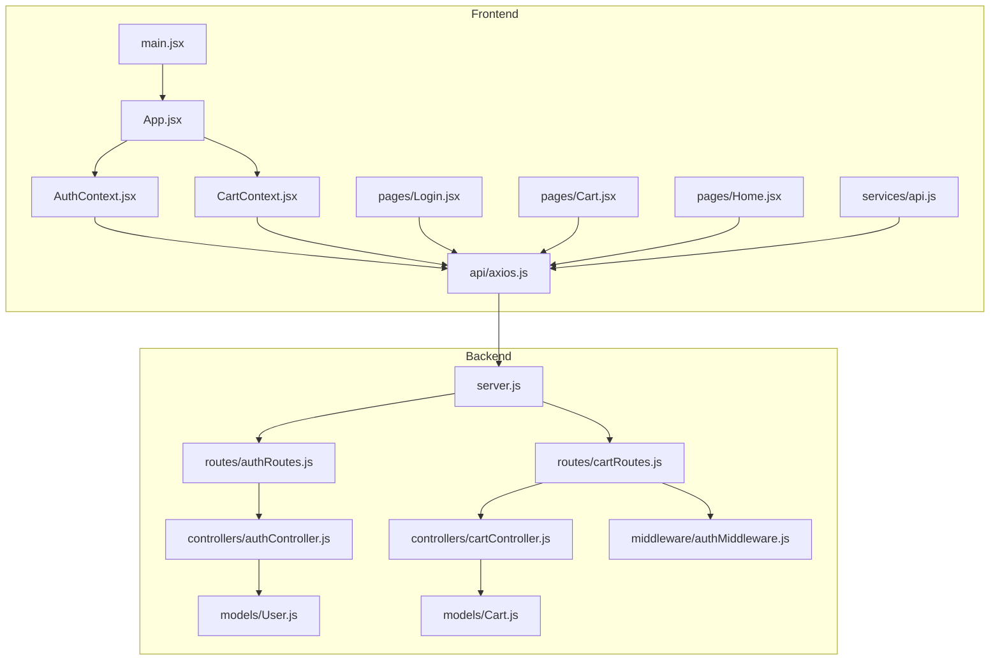
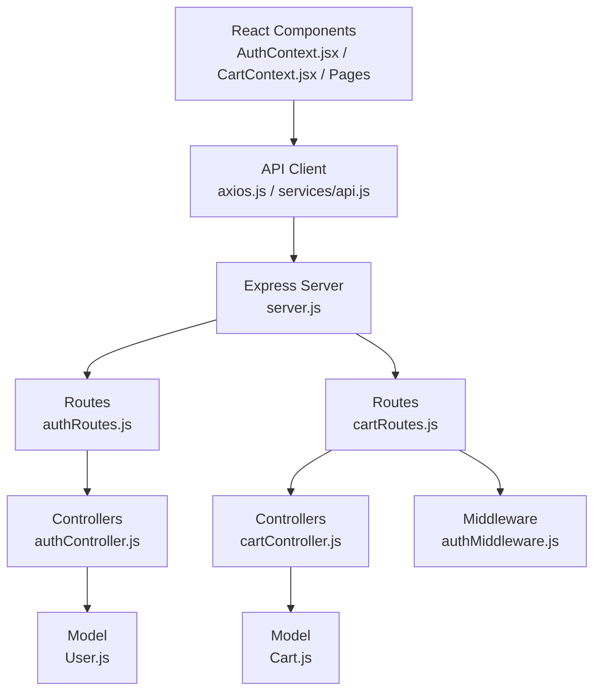
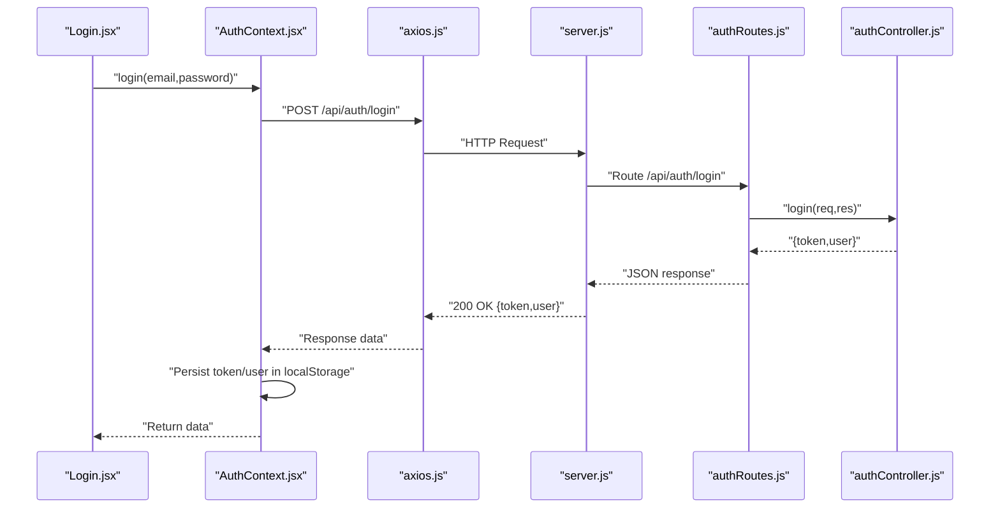
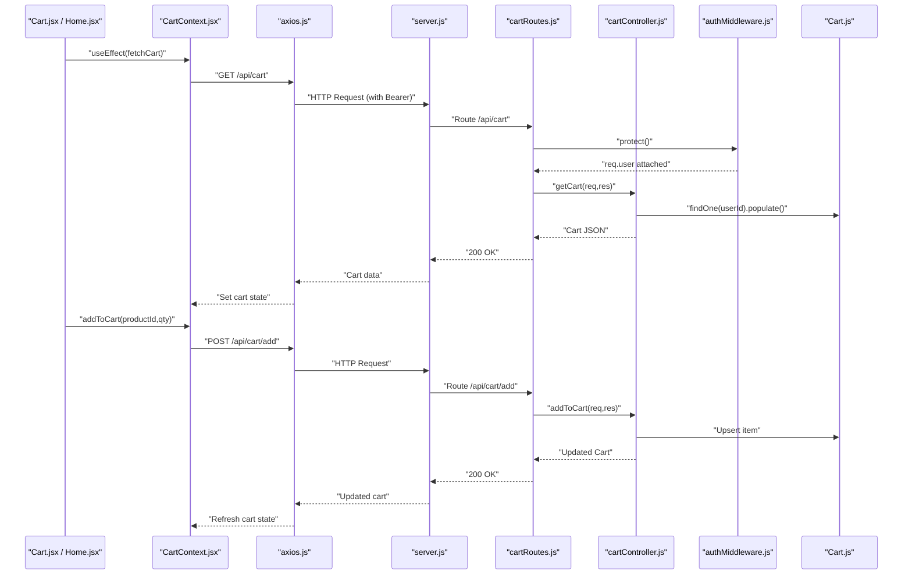
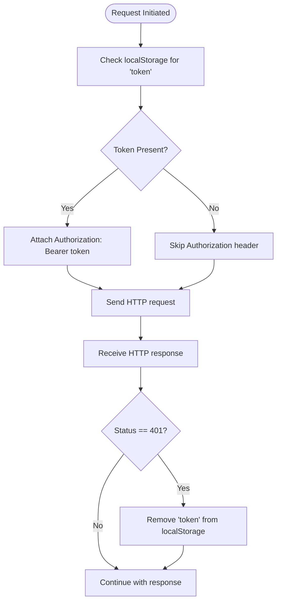
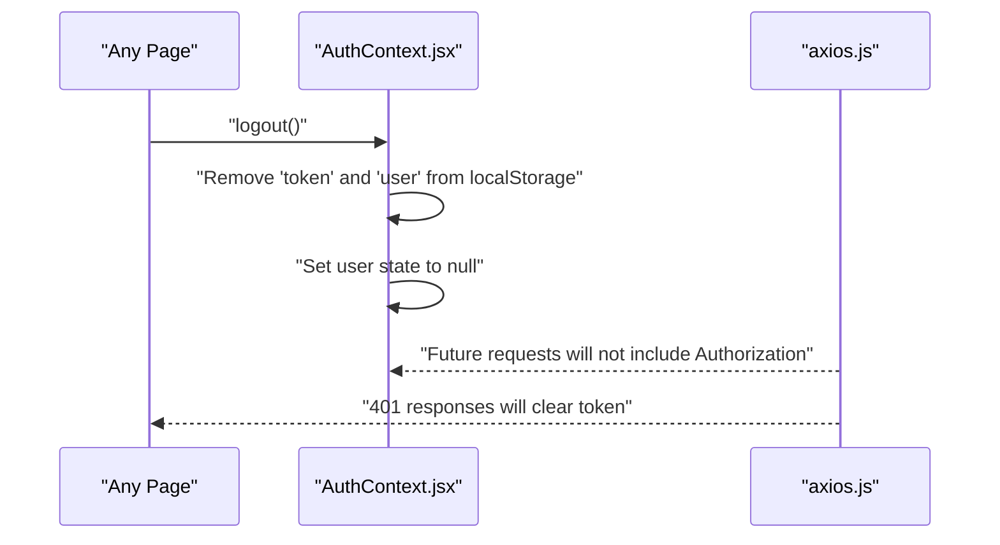
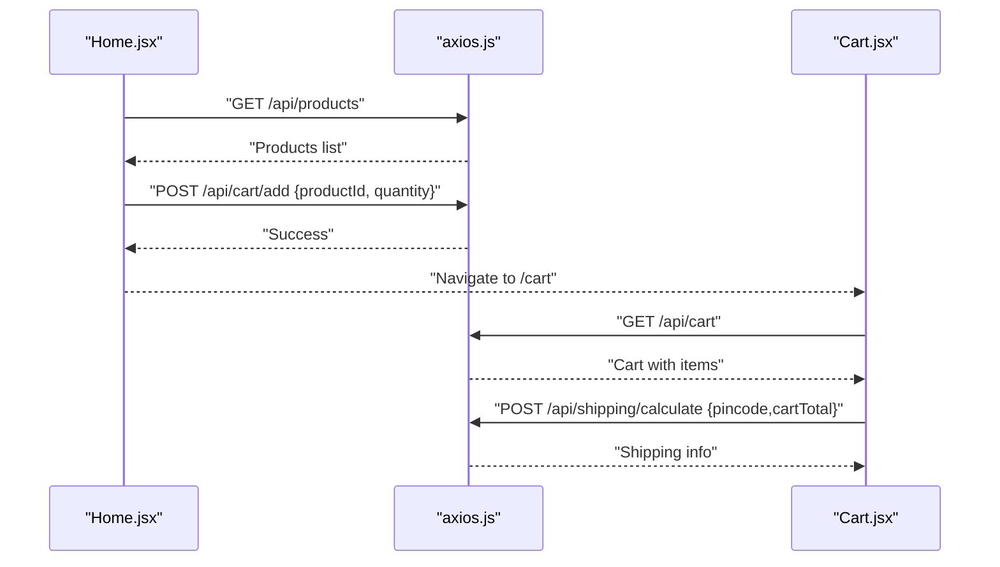
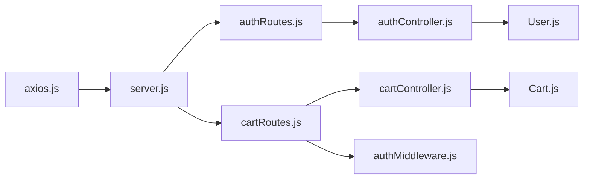

# Component Interactions

<cite>
**Referenced Files in This Document**
- [AuthContext.jsx](file://frontend/src/context/AuthContext.jsx)
- [CartContext.jsx](file://frontend/src/context/CartContext.jsx)
- [axios.js](file://frontend/src/api/axios.js)
- [api.js](file://frontend/src/services/api.js)
- [Login.jsx](file://frontend/src/pages/Login.jsx)
- [Cart.jsx](file://frontend/src/pages/Cart.jsx)
- [Home.jsx](file://frontend/src/pages/Home.jsx)
- [App.jsx](file://frontend/src/App.jsx)
- [main.jsx](file://frontend/src/main.jsx)
- [authController.js](file://backend/controllers/authController.js)
- [cartController.js](file://backend/controllers/cartController.js)
- [authRoutes.js](file://backend/routes/authRoutes.js)
- [cartRoutes.js](file://backend/routes/cartRoutes.js)
- [authMiddleware.js](file://backend/middleware/authMiddleware.js)
- [User.js](file://backend/models/User.js)
- [Cart.js](file://backend/models/Cart.js)
- [server.js](file://backend/server.js)
</cite>

## Table of Contents
1. [Introduction](#introduction)
2. [Project Structure](#project-structure)
3. [Core Components](#core-components)
4. [Architecture Overview](#architecture-overview)
5. [Detailed Component Analysis](#detailed-component-analysis)
6. [Dependency Analysis](#dependency-analysis)
7. [Performance Considerations](#performance-considerations)
8. [Troubleshooting Guide](#troubleshooting-guide)
9. [Conclusion](#conclusion)

## Introduction
This document explains how the E-commerce App coordinates frontend React components with backend controllers and models. It focuses on three pillars:
- Authentication state management via AuthContext.jsx and its integration with authController.js
- Shopping cart operations via CartContext.jsx and its integration with cartController.js
- API service layer connecting frontend components to backend endpoints

It also documents request-response patterns, state synchronization, error propagation, and event-driven flows across components, including sequence diagrams for login, product browsing, cart management, and checkout.

## Project Structure
The frontend is a React application bootstrapped in main.jsx and rendered inside App.jsx. Context providers wrap the routing tree to share global state. API clients encapsulate HTTP communication and interceptors inject authentication tokens. The backend is an Express server exposing REST endpoints grouped by feature, protected by middleware, and backed by Mongoose models.

**Diagram sources**
- [main.jsx:1-10](file://frontend/src/main.jsx#L1-L10)
- [App.jsx:1-66](file://frontend/src/App.jsx#L1-L66)
- [AuthContext.jsx:1-33](file://frontend/src/context/AuthContext.jsx#L1-L33)
- [CartContext.jsx:1-53](file://frontend/src/context/CartContext.jsx#L1-L53)
- [axios.js:1-17](file://frontend/src/api/axios.js#L1-L17)
- [api.js:1-8](file://frontend/src/services/api.js#L1-L8)
- [Login.jsx:1-56](file://frontend/src/pages/Login.jsx#L1-L56)
- [Cart.jsx:1-152](file://frontend/src/pages/Cart.jsx#L1-L152)
- [Home.jsx:1-108](file://frontend/src/pages/Home.jsx#L1-L108)
- [server.js:1-102](file://backend/server.js#L1-L102)
- [authRoutes.js:1-9](file://backend/routes/authRoutes.js#L1-L9)
- [cartRoutes.js:1-12](file://backend/routes/cartRoutes.js#L1-L12)
- [authController.js:1-27](file://backend/controllers/authController.js#L1-L27)
- [cartController.js:1-38](file://backend/controllers/cartController.js#L1-L38)
- [authMiddleware.js:1-20](file://backend/middleware/authMiddleware.js#L1-L20)
- [User.js:1-20](file://backend/models/User.js#L1-L20)
- [Cart.js:1-12](file://backend/models/Cart.js#L1-L12)

**Section sources**
- [main.jsx:1-10](file://frontend/src/main.jsx#L1-L10)
- [App.jsx:1-66](file://frontend/src/App.jsx#L1-L66)
- [server.js:1-102](file://backend/server.js#L1-L102)

## Core Components
- AuthContext.jsx
  - Manages user session state, persists user info to localStorage, and exposes login/logout functions that communicate with authController.js.
- CartContext.jsx
  - Synchronizes cart state with the backend via cartController.js, updates UI after mutations, and computes totals.
- API Layer
  - axios.js creates a configured client with automatic Authorization header injection and centralized 401 handling.
  - services/api.js provides a convenience client with the same interceptor pipeline.

Key responsibilities:
- State persistence: localStorage for token and user in AuthContext.jsx; cart fetched on mount in CartContext.jsx.
- Event-driven updates: UI triggers actions (addToCart/removeFromCart/login/logout), which call API endpoints and refresh state.
- Error propagation: API interceptors surface errors; components handle UX feedback and navigation.

**Section sources**
- [AuthContext.jsx:1-33](file://frontend/src/context/AuthContext.jsx#L1-L33)
- [CartContext.jsx:1-53](file://frontend/src/context/CartContext.jsx#L1-L53)
- [axios.js:1-17](file://frontend/src/api/axios.js#L1-L17)
- [api.js:1-8](file://frontend/src/services/api.js#L1-L8)

## Architecture Overview
The frontend and backend communicate over REST endpoints under /api. Requests include a Bearer token when present. Protected routes enforce authentication via authMiddleware.js, which decodes JWT and attaches user to req.user. Controllers implement domain logic and interact with Mongoose models.

**Diagram sources**
- [axios.js:1-17](file://frontend/src/api/axios.js#L1-L17)
- [api.js:1-8](file://frontend/src/services/api.js#L1-L8)
- [server.js:1-102](file://backend/server.js#L1-L102)
- [authRoutes.js:1-9](file://backend/routes/authRoutes.js#L1-L9)
- [cartRoutes.js:1-12](file://backend/routes/cartRoutes.js#L1-L12)
- [authController.js:1-27](file://backend/controllers/authController.js#L1-L27)
- [cartController.js:1-38](file://backend/controllers/cartController.js#L1-L38)
- [authMiddleware.js:1-20](file://backend/middleware/authMiddleware.js#L1-L20)
- [User.js:1-20](file://backend/models/User.js#L1-L20)
- [Cart.js:1-12](file://backend/models/Cart.js#L1-L12)

## Detailed Component Analysis

### Authentication Flow: AuthContext.jsx to authController.js
AuthContext.jsx centralizes authentication state and persistence. It posts credentials to /api/auth/login and stores token/user. The backend controller validates credentials, signs a JWT, and returns token/user. The API client injects Authorization headers automatically for subsequent requests.

**Diagram sources**
- [Login.jsx:10-21](file://frontend/src/pages/Login.jsx#L10-L21)
- [AuthContext.jsx:16-22](file://frontend/src/context/AuthContext.jsx#L16-L22)
- [axios.js:1-17](file://frontend/src/api/axios.js#L1-L17)
- [server.js:58](file://backend/server.js#L58)
- [authRoutes.js:6-7](file://backend/routes/authRoutes.js#L6-L7)
- [authController.js:18-27](file://backend/controllers/authController.js#L18-L27)

**Section sources**
- [AuthContext.jsx:16-28](file://frontend/src/context/AuthContext.jsx#L16-L28)
- [axios.js:4-8](file://frontend/src/api/axios.js#L4-L8)
- [authController.js:6-27](file://backend/controllers/authController.js#L6-L27)
- [authRoutes.js:6-7](file://backend/routes/authRoutes.js#L6-L7)

### Cart Management: CartContext.jsx to cartController.js
CartContext.jsx initializes cart state by fetching from /api/cart on mount when a token exists. It exposes addToCart and removeFromCart, which call /api/cart/add and /api/cart/update respectively. After mutations, it refreshes UI state by re-fetching the cart.

**Diagram sources**
- [Cart.jsx:17-26](file://frontend/src/pages/Cart.jsx#L17-L26)
- [Home.jsx:30-37](file://frontend/src/pages/Home.jsx#L30-L37)
- [CartContext.jsx:10-29](file://frontend/src/context/CartContext.jsx#L10-L29)
- [axios.js:1-17](file://frontend/src/api/axios.js#L1-L17)
- [server.js:60](file://backend/server.js#L60)
- [cartRoutes.js:7-10](file://backend/routes/cartRoutes.js#L7-L10)
- [cartController.js:3-22](file://backend/controllers/cartController.js#L3-L22)
- [authMiddleware.js:4-15](file://backend/middleware/authMiddleware.js#L4-L15)
- [Cart.js:1-12](file://backend/models/Cart.js#L1-L12)

**Section sources**
- [CartContext.jsx:10-42](file://frontend/src/context/CartContext.jsx#L10-L42)
- [cartController.js:3-32](file://backend/controllers/cartController.js#L3-L32)
- [cartRoutes.js:7-10](file://backend/routes/cartRoutes.js#L7-L10)
- [authMiddleware.js:4-15](file://backend/middleware/authMiddleware.js#L4-L15)

### API Services and Token Propagation
The API client sets Authorization: Bearer <token> for every request when available. On 401 responses, it clears the token from localStorage, enabling downstream components to react to logged-out state.

**Diagram sources**
- [axios.js:4-16](file://frontend/src/api/axios.js#L4-L16)
- [api.js:3-7](file://frontend/src/services/api.js#L3-L7)

**Section sources**
- [axios.js:4-16](file://frontend/src/api/axios.js#L4-L16)
- [api.js:3-7](file://frontend/src/services/api.js#L3-L7)

### Logout and State Cleanup
AuthContext.jsx removes token and user from localStorage and resets state. The API interceptor ensures subsequent requests fail fast with 401, prompting UI cleanup.

**Diagram sources**
- [AuthContext.jsx:24-28](file://frontend/src/context/AuthContext.jsx#L24-L28)
- [axios.js:10-16](file://frontend/src/api/axios.js#L10-L16)

**Section sources**
- [AuthContext.jsx:24-28](file://frontend/src/context/AuthContext.jsx#L24-L28)
- [axios.js:10-16](file://frontend/src/api/axios.js#L10-L16)

### Product Browsing and Cart Interaction
Home.jsx lists products and allows adding to cart. It uses the API client directly for quick actions. Cart.jsx displays cart contents, calculates totals, and supports shipping estimation.

**Diagram sources**
- [Home.jsx:19-37](file://frontend/src/pages/Home.jsx#L19-L37)
- [Cart.jsx:17-53](file://frontend/src/pages/Cart.jsx#L17-L53)
- [axios.js:1-17](file://frontend/src/api/axios.js#L1-L17)

**Section sources**
- [Home.jsx:19-37](file://frontend/src/pages/Home.jsx#L19-L37)
- [Cart.jsx:17-53](file://frontend/src/pages/Cart.jsx#L17-L53)

## Dependency Analysis
- Frontend-to-Backend
  - Auth: Login page and AuthContext.jsx depend on /api/auth/login handled by authController.js.
  - Cart: CartContext.jsx depends on /api/cart endpoints handled by cartController.js, protected by authMiddleware.js.
- Backend-to-Models
  - authController.js interacts with User model for validation and hashing.
  - cartController.js interacts with Cart model for item upsert and deletion.
- Frontend API Layer
  - axios.js centralizes baseURL, interceptors, and 401 handling.
  - services/api.js reuses the same configuration for convenience.

**Diagram sources**
- [axios.js:1-17](file://frontend/src/api/axios.js#L1-L17)
- [server.js:58-63](file://backend/server.js#L58-L63)
- [authRoutes.js:1-9](file://backend/routes/authRoutes.js#L1-L9)
- [authController.js:1-27](file://backend/controllers/authController.js#L1-L27)
- [User.js:1-20](file://backend/models/User.js#L1-L20)
- [cartRoutes.js:1-12](file://backend/routes/cartRoutes.js#L1-L12)
- [cartController.js:1-38](file://backend/controllers/cartController.js#L1-L38)
- [Cart.js:1-12](file://backend/models/Cart.js#L1-L12)
- [authMiddleware.js:1-20](file://backend/middleware/authMiddleware.js#L1-L20)

**Section sources**
- [server.js:58-63](file://backend/server.js#L58-L63)
- [authController.js:1-27](file://backend/controllers/authController.js#L1-L27)
- [cartController.js:1-38](file://backend/controllers/cartController.js#L1-L38)
- [User.js:1-20](file://backend/models/User.js#L1-L20)
- [Cart.js:1-12](file://backend/models/Cart.js#L1-L12)
- [authMiddleware.js:1-20](file://backend/middleware/authMiddleware.js#L1-L20)

## Performance Considerations
- Minimize redundant network calls:
  - CartContext.jsx fetches cart on mount and refreshes after mutations. Consider debouncing frequent updates and caching small UI-only totals.
- Token handling:
  - Centralized interceptors avoid repeated header construction and reduce risk of stale tokens.
- Middleware overhead:
  - authMiddleware.js performs JWT verification and user lookup per protected route; keep payloads minimal and rely on database indexing for User lookups.
- UI responsiveness:
  - Use optimistic UI updates for addToCart/removeFromCart and reconcile with a follow-up fetch to ensure consistency.

## Troubleshooting Guide
Common issues and resolutions:
- 401 Unauthorized
  - Symptom: Requests fail after token expiry or logout.
  - Resolution: API interceptor clears token; re-login to obtain a new token.
  - Section sources
    - [axios.js:10-16](file://frontend/src/api/axios.js#L10-L16)
- Login fails with invalid credentials
  - Symptom: authController.js responds with an error payload.
  - Resolution: Verify email/password; ensure backend logs for detailed errors.
  - Section sources
    - [authController.js:18-27](file://backend/controllers/authController.js#L18-L27)
- Cart not updating after add/remove
  - Symptom: UI shows stale items.
  - Resolution: CartContext.jsx refreshes state after mutation; ensure token is present and endpoint returns success.
  - Section sources
    - [CartContext.jsx:22-42](file://frontend/src/context/CartContext.jsx#L22-L42)
- CORS errors
  - Symptom: Preflight or blocked requests from frontend origins.
  - Resolution: Confirm allowedOrigins in server.js and environment configuration.
  - Section sources
    - [server.js:22-49](file://backend/server.js#L22-L49)

## Conclusion
The E-commerce App’s frontend relies on two primary contexts—AuthContext.jsx and CartContext.jsx—to manage authentication and cart state, while a shared API client enforces token propagation and error handling. The backend exposes protected endpoints that controllers implement against Mongoose models. The documented flows and diagrams illustrate how user actions propagate through components, controllers, and models, ensuring predictable state synchronization and robust error handling.