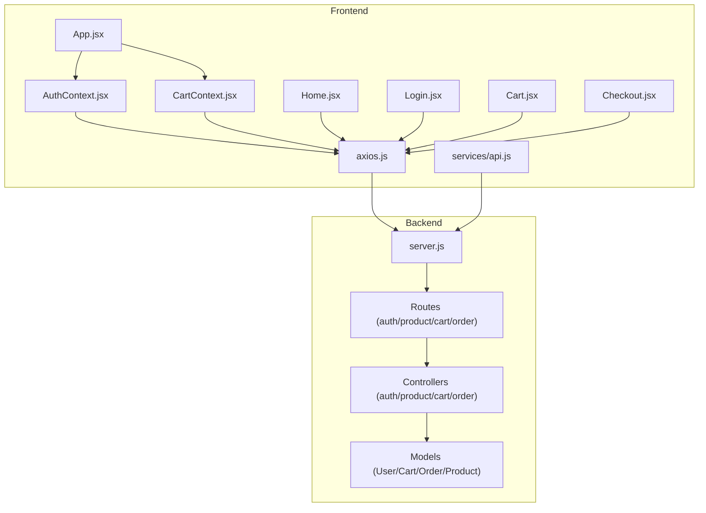
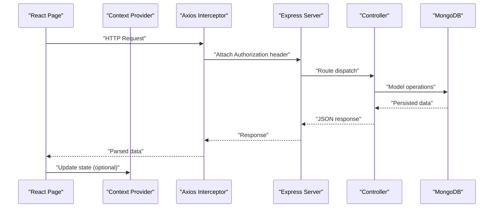
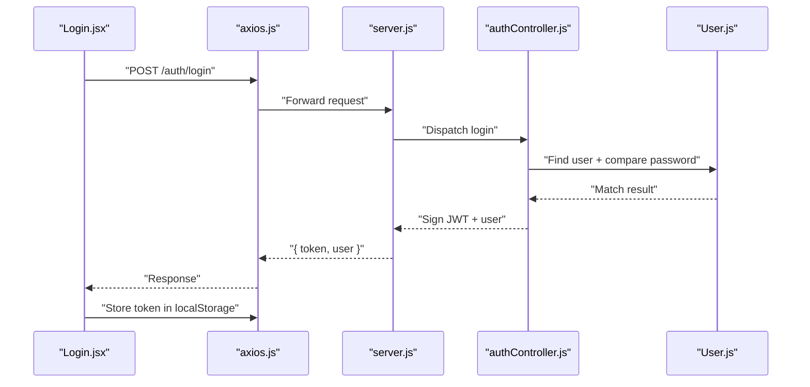
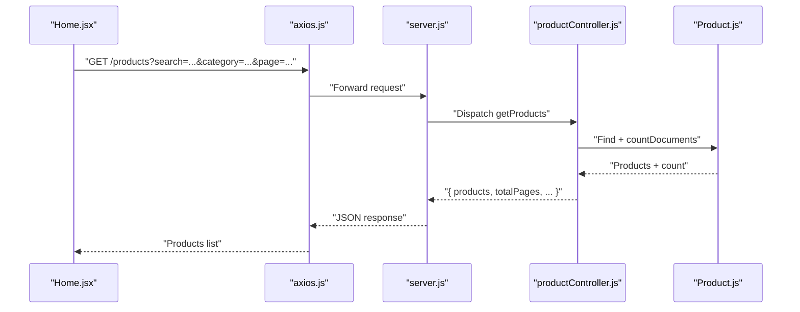
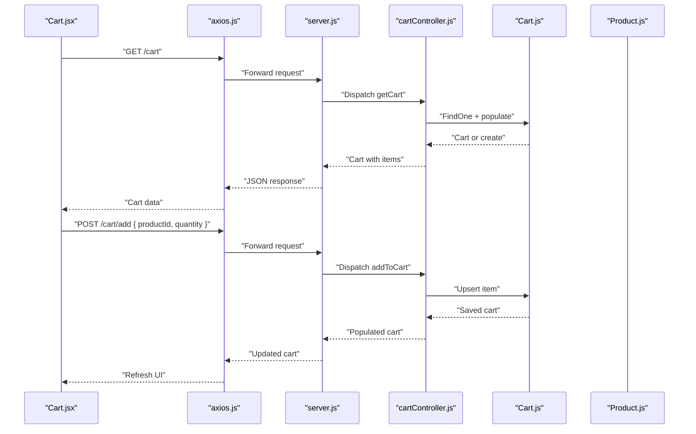
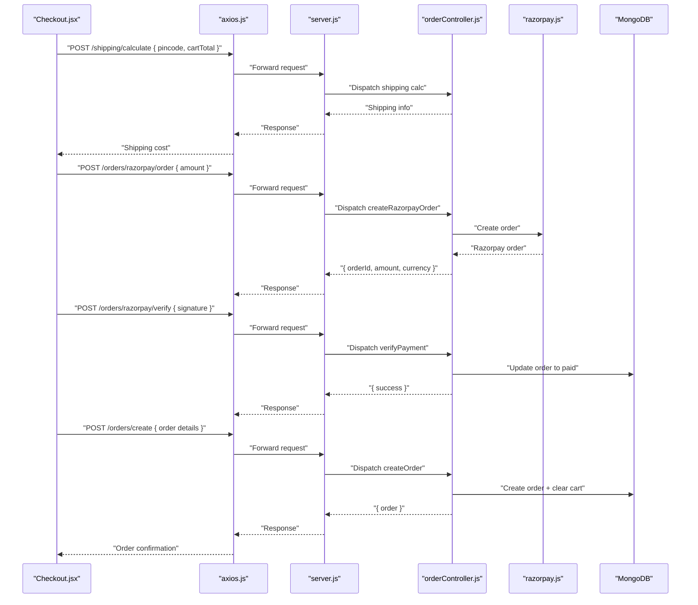
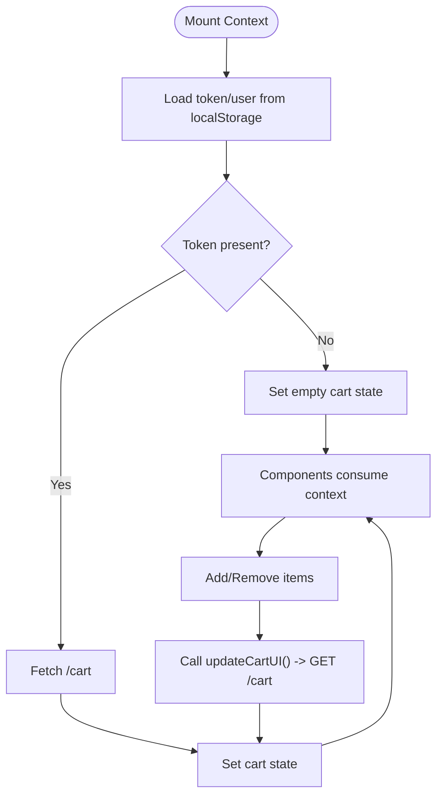
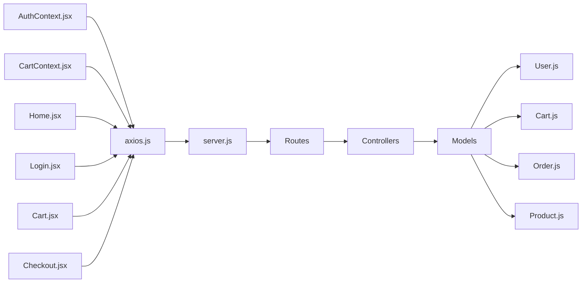
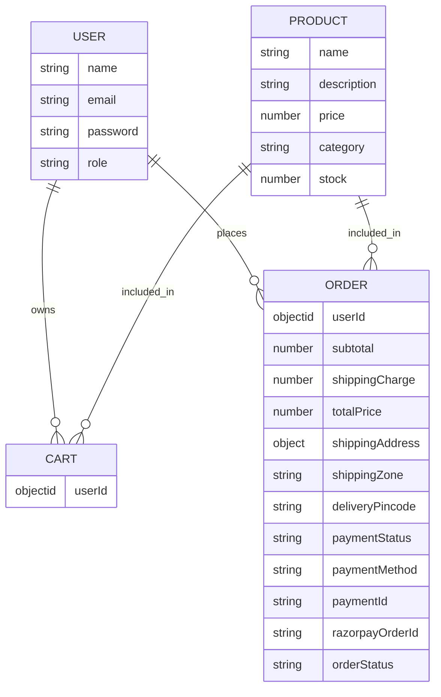

# Data Flow Patterns

<cite>
**Referenced Files in This Document**
- [server.js](file://backend/server.js)
- [authController.js](file://backend/controllers/authController.js)
- [productController.js](file://backend/controllers/productController.js)
- [cartController.js](file://backend/controllers/cartController.js)
- [orderController.js](file://backend/controllers/orderController.js)
- [User.js](file://backend/models/User.js)
- [Cart.js](file://backend/models/Cart.js)
- [Order.js](file://backend/models/Order.js)
- [Product.js](file://backend/models/Product.js)
- [AuthContext.jsx](file://frontend/src/context/AuthContext.jsx)
- [CartContext.jsx](file://frontend/src/context/CartContext.jsx)
- [axios.js](file://frontend/src/api/axios.js)
- [api.js](file://frontend/src/services/api.js)
- [App.jsx](file://frontend/src/App.jsx)
- [Home.jsx](file://frontend/src/pages/Home.jsx)
- [Login.jsx](file://frontend/src/pages/Login.jsx)
- [Cart.jsx](file://frontend/src/pages/Cart.jsx)
- [Checkout.jsx](file://frontend/src/pages/Checkout.jsx)
</cite>

## Table of Contents
1. [Introduction](#introduction)
2. [Project Structure](#project-structure)
3. [Core Components](#core-components)
4. [Architecture Overview](#architecture-overview)
5. [Detailed Component Analysis](#detailed-component-analysis)
6. [Dependency Analysis](#dependency-analysis)
7. [Performance Considerations](#performance-considerations)
8. [Troubleshooting Guide](#troubleshooting-guide)
9. [Conclusion](#conclusion)
10. [Appendices](#appendices)

## Introduction
This document explains the end-to-end data flow in the E-commerce App, covering user interactions, API requests, backend processing, database operations, and response handling. It details authentication flows, product catalog queries, cart operations, and order processing. It also documents data transformation patterns between frontend and backend, state management via React Context, and security considerations such as validation, sanitization, and token-based authentication.

## Project Structure
The application follows a clear separation of concerns:
- Backend: Express server with modular controllers, Mongoose models, and route modules.
- Frontend: React SPA with routing, context providers for authentication and cart state, and service modules for API communication.
- Shared integration: Axios interceptors propagate Authorization tokens; frontend pages orchestrate user actions and render results.

**Diagram sources**
- [App.jsx:1-66](file://frontend/src/App.jsx#L1-L66)
- [AuthContext.jsx:1-33](file://frontend/src/context/AuthContext.jsx#L1-L33)
- [CartContext.jsx:1-53](file://frontend/src/context/CartContext.jsx#L1-L53)
- [axios.js:1-17](file://frontend/src/api/axios.js#L1-L17)
- [api.js:1-8](file://frontend/src/services/api.js#L1-L8)
- [Home.jsx:1-108](file://frontend/src/pages/Home.jsx#L1-L108)
- [Login.jsx:1-56](file://frontend/src/pages/Login.jsx#L1-L56)
- [Cart.jsx:1-152](file://frontend/src/pages/Cart.jsx#L1-L152)
- [Checkout.jsx:1-301](file://frontend/src/pages/Checkout.jsx#L1-L301)
- [server.js:1-102](file://backend/server.js#L1-L102)

**Section sources**
- [server.js:1-102](file://backend/server.js#L1-L102)
- [App.jsx:1-66](file://frontend/src/App.jsx#L1-L66)

## Core Components
- Authentication: JWT-based login/register; token stored in localStorage; interceptor attaches Authorization header.
- Product Catalog: Search, filtering, pagination; images served from uploads.
- Cart: Per-user cart persisted in MongoDB; add/update/remove items; auto-populate product details.
- Orders: Razorpay integration (create order, verify payment), COD, manual UPI; order status transitions; admin order management.
- State Management: React Context for user session and cart; UI components synchronize state via context and direct API calls.

**Section sources**
- [authController.js:1-27](file://backend/controllers/authController.js#L1-L27)
- [productController.js:1-127](file://backend/controllers/productController.js#L1-L127)
- [cartController.js:1-38](file://backend/controllers/cartController.js#L1-L38)
- [orderController.js:1-146](file://backend/controllers/orderController.js#L1-L146)
- [AuthContext.jsx:1-33](file://frontend/src/context/AuthContext.jsx#L1-L33)
- [CartContext.jsx:1-53](file://frontend/src/context/CartContext.jsx#L1-L53)

## Architecture Overview
The frontend communicates with the backend through RESTful endpoints. Requests are authenticated via Bearer tokens injected by Axios interceptors. Controllers coordinate with models to perform CRUD operations and business logic. Responses are normalized JSON payloads consumed by React components.

**Diagram sources**
- [axios.js:1-17](file://frontend/src/api/axios.js#L1-L17)
- [server.js:1-102](file://backend/server.js#L1-L102)
- [authController.js:1-27](file://backend/controllers/authController.js#L1-L27)
- [productController.js:1-127](file://backend/controllers/productController.js#L1-L127)
- [cartController.js:1-38](file://backend/controllers/cartController.js#L1-L38)
- [orderController.js:1-146](file://backend/controllers/orderController.js#L1-L146)

## Detailed Component Analysis

### Authentication Flow
- Registration: Frontend posts name, email, password; backend checks uniqueness, hashes password, creates user, signs JWT, returns token and user profile.
- Login: Frontend posts email/password; backend validates credentials, compares hashed passwords, signs JWT, returns token and user profile.
- Token propagation: Axios interceptor reads token from localStorage and adds Authorization header to all requests.
- Session persistence: AuthContext initializes user from localStorage and exposes login/logout.

**Diagram sources**
- [Login.jsx:1-56](file://frontend/src/pages/Login.jsx#L1-L56)
- [axios.js:1-17](file://frontend/src/api/axios.js#L1-L17)
- [server.js:1-102](file://backend/server.js#L1-L102)
- [authController.js:1-27](file://backend/controllers/authController.js#L1-L27)
- [User.js:1-20](file://backend/models/User.js#L1-L20)

**Section sources**
- [authController.js:1-27](file://backend/controllers/authController.js#L1-L27)
- [axios.js:1-17](file://frontend/src/api/axios.js#L1-L17)
- [AuthContext.jsx:1-33](file://frontend/src/context/AuthContext.jsx#L1-L33)

### Product Catalog Queries
- Endpoint supports search (name/description), category filter, pagination (page, limit).
- Backend builds a compound query, sorts by creation date, paginates results, and returns products plus metadata.
- Frontend fetches initial product list and optionally triggers add-to-cart.

**Diagram sources**
- [Home.jsx:1-108](file://frontend/src/pages/Home.jsx#L1-L108)
- [axios.js:1-17](file://frontend/src/api/axios.js#L1-L17)
- [server.js:1-102](file://backend/server.js#L1-L102)
- [productController.js:1-127](file://backend/controllers/productController.js#L1-L127)
- [Product.js:1-12](file://backend/models/Product.js#L1-L12)

**Section sources**
- [productController.js:1-127](file://backend/controllers/productController.js#L1-L127)
- [Home.jsx:1-108](file://frontend/src/pages/Home.jsx#L1-L108)

### Cart Operations
- Retrieve cart: Backend finds per-user cart and populates product details; creates empty cart if missing.
- Add item: Validates existence, increments quantity or pushes new item, saves, and returns populated cart.
- Update item: Supports quantity update or removal when quantity falls to zero.
- Clear cart: Deletes and recreates empty cart.

**Diagram sources**
- [Cart.jsx:1-152](file://frontend/src/pages/Cart.jsx#L1-L152)
- [axios.js:1-17](file://frontend/src/api/axios.js#L1-L17)
- [server.js:1-102](file://backend/server.js#L1-L102)
- [cartController.js:1-38](file://backend/controllers/cartController.js#L1-L38)
- [Cart.js:1-12](file://backend/models/Cart.js#L1-L12)
- [Product.js:1-12](file://backend/models/Product.js#L1-L12)

**Section sources**
- [cartController.js:1-38](file://backend/controllers/cartController.js#L1-L38)
- [CartContext.jsx:1-53](file://frontend/src/context/CartContext.jsx#L1-L53)
- [Cart.jsx:1-152](file://frontend/src/pages/Cart.jsx#L1-L152)

### Order Processing and Payments
- Shipping calculation: Frontend posts pincode and cart total; backend computes shipping cost/free eligibility.
- Razorpay integration:
  - Create order: Frontend requests backend to create a Razorpay order with amount.
  - Verify payment: Frontend collects payment details, verifies HMAC signature on backend, then finalizes order.
- COD/UPI:
  - COD: Frontend posts order with payment method set to cash on delivery; backend sets appropriate statuses.
  - UPI: Frontend posts order with manual transaction ID; backend defers payment status until admin verification.

**Diagram sources**
- [Checkout.jsx:1-301](file://frontend/src/pages/Checkout.jsx#L1-L301)
- [axios.js:1-17](file://frontend/src/api/axios.js#L1-L17)
- [server.js:1-102](file://backend/server.js#L1-L102)
- [orderController.js:1-146](file://backend/controllers/orderController.js#L1-L146)

**Section sources**
- [orderController.js:1-146](file://backend/controllers/orderController.js#L1-L146)
- [Checkout.jsx:1-301](file://frontend/src/pages/Checkout.jsx#L1-L301)

### Data Transformation Patterns
- Payload formatting:
  - Frontend: Sends structured JSON bodies (credentials, product filters, cart mutations, order payloads).
  - Backend: Normalizes numeric fields (price, quantities), derives totals, constructs order items from cart population.
- Response parsing:
  - Frontend: Uses destructured data from axios responses; updates local state and navigates on success.
  - Backend: Returns lean objects for listings, populated documents for cart, and concise order summaries.
- Error handling:
  - Frontend: Toast notifications and redirects on failures; interceptor clears token on 401.
  - Backend: Centralized error middleware logs stack traces and returns generic messages.

**Section sources**
- [Home.jsx:1-108](file://frontend/src/pages/Home.jsx#L1-L108)
- [Cart.jsx:1-152](file://frontend/src/pages/Cart.jsx#L1-L152)
- [Checkout.jsx:1-301](file://frontend/src/pages/Checkout.jsx#L1-L301)
- [axios.js:1-17](file://frontend/src/api/axios.js#L1-L17)
- [server.js:91-95](file://backend/server.js#L91-L95)

### State Management with React Context
- AuthContext:
  - Persists user and token in localStorage.
  - Provides login/logout functions; exposes loading state.
- CartContext:
  - Fetches cart on mount if token exists.
  - Exposes add/remove helpers and recalculates totals.
  - Updates UI after cart mutations.

**Diagram sources**
- [AuthContext.jsx:1-33](file://frontend/src/context/AuthContext.jsx#L1-L33)
- [CartContext.jsx:1-53](file://frontend/src/context/CartContext.jsx#L1-L53)

**Section sources**
- [AuthContext.jsx:1-33](file://frontend/src/context/AuthContext.jsx#L1-L33)
- [CartContext.jsx:1-53](file://frontend/src/context/CartContext.jsx#L1-L53)

### Typical Data Flow Scenarios

#### Scenario 1: User Registration
- Frontend submits registration form.
- Backend validates uniqueness, hashes password, creates user, signs JWT.
- Frontend stores token and user, navigates to home.

**Section sources**
- [authController.js:6-16](file://backend/controllers/authController.js#L6-L16)
- [axios.js:1-17](file://frontend/src/api/axios.js#L1-L17)
- [Login.jsx:10-21](file://frontend/src/pages/Login.jsx#L10-L21)

#### Scenario 2: Product Search and Add to Cart
- Frontend loads products with optional search/category filters.
- User clicks “Add to Cart”.
- Frontend posts to cart endpoint; backend updates cart; frontend refreshes UI.

**Section sources**
- [Home.jsx:19-37](file://frontend/src/pages/Home.jsx#L19-L37)
- [cartController.js:9-22](file://backend/controllers/cartController.js#L9-L22)

#### Scenario 3: Cart Updates and Checkout
- Frontend calculates subtotal/shipping, displays order summary.
- User selects payment method:
  - COD: Posts order with cod flag; backend confirms order.
  - Online/Razorpay: Creates Razorpay order, verifies signature, finalizes order.
  - UPI: Posts order with manual transaction ID; admin verification pending.

**Section sources**
- [Cart.jsx:28-53](file://frontend/src/pages/Cart.jsx#L28-L53)
- [Checkout.jsx:67-137](file://frontend/src/pages/Checkout.jsx#L67-L137)
- [orderController.js:84-146](file://backend/controllers/orderController.js#L84-L146)

#### Scenario 4: Order Confirmation
- After successful order placement, frontend navigates to confirmation page with order details.

**Section sources**
- [Checkout.jsx:79-116](file://frontend/src/pages/Checkout.jsx#L79-L116)

### Security Considerations
- Authentication:
  - JWT issued with expiration; stored securely in localStorage; Authorization header attached automatically.
- Validation and Sanitization:
  - Frontend: Basic client-side checks (required fields, phone length).
  - Backend: Strong typing via Mongoose schemas; numeric conversions; controlled enums for statuses.
- Error Handling:
  - Centralized error middleware prevents stack leakage; interceptor clears token on unauthorized responses.
- CORS and Transport:
  - CORS configured for production domains; HTTPS recommended for production deployment.

**Section sources**
- [server.js:22-49](file://backend/server.js#L22-L49)
- [server.js:91-95](file://backend/server.js#L91-L95)
- [Order.js:24-30](file://backend/models/Order.js#L24-L30)
- [Cart.js:7](file://backend/models/Cart.js#L7)
- [axios.js:10-16](file://frontend/src/api/axios.js#L10-L16)

## Dependency Analysis
- Frontend depends on:
  - Axios for HTTP; interceptors for auth; context providers for state.
- Backend depends on:
  - Express for routing; controllers for business logic; models for persistence.
- Data models define relationships and constraints:
  - Cart belongs to User; Order belongs to User; Cart items reference Product.

**Diagram sources**
- [AuthContext.jsx:1-33](file://frontend/src/context/AuthContext.jsx#L1-L33)
- [CartContext.jsx:1-53](file://frontend/src/context/CartContext.jsx#L1-L53)
- [axios.js:1-17](file://frontend/src/api/axios.js#L1-L17)
- [Home.jsx:1-108](file://frontend/src/pages/Home.jsx#L1-L108)
- [Login.jsx:1-56](file://frontend/src/pages/Login.jsx#L1-L56)
- [Cart.jsx:1-152](file://frontend/src/pages/Cart.jsx#L1-L152)
- [Checkout.jsx:1-301](file://frontend/src/pages/Checkout.jsx#L1-L301)
- [server.js:1-102](file://backend/server.js#L1-L102)
- [User.js:1-20](file://backend/models/User.js#L1-L20)
- [Cart.js:1-12](file://backend/models/Cart.js#L1-L12)
- [Order.js:1-33](file://backend/models/Order.js#L1-L33)
- [Product.js:1-12](file://backend/models/Product.js#L1-L12)

**Section sources**
- [server.js:57-63](file://backend/server.js#L57-L63)
- [User.js:1-20](file://backend/models/User.js#L1-L20)
- [Cart.js:1-12](file://backend/models/Cart.js#L1-L12)
- [Order.js:1-33](file://backend/models/Order.js#L1-L33)
- [Product.js:1-12](file://backend/models/Product.js#L1-L12)

## Performance Considerations
- Pagination: Product listing uses page/limit to avoid large payloads.
- Population: Cart retrieval populates product details in a single operation.
- Numeric conversions: Backend converts string inputs to numbers to prevent type errors.
- Caching: CORS preflight cached for 10 minutes.

**Section sources**
- [productController.js:6, 19-23](file://backend/controllers/productController.js#L6,L19-L23)
- [cartController.js:4](file://backend/controllers/cartController.js#L4)
- [productController.js:59-66](file://backend/controllers/productController.js#L59-L66)
- [server.js:47](file://backend/server.js#L47)

## Troubleshooting Guide
- 401 Unauthorized:
  - Occurs when token is missing or invalid; interceptor removes token and rejects promise.
- 403 Access Denied:
  - Order retrieval requires ownership or admin role.
- 400 Bad Request:
  - Cart empty during order creation; invalid shipping zone/status; insufficient address fields.
- Network Errors:
  - Frontend shows toast notifications; backend centralizes error responses.

**Section sources**
- [axios.js:10-16](file://frontend/src/api/axios.js#L10-L16)
- [orderController.js:12, 74-77](file://backend/controllers/orderController.js#L12,L74-L77)
- [orderController.js:99, 167-177](file://backend/controllers/orderController.js#L99,L167-L177)
- [server.js:91-95](file://backend/server.js#L91-L95)

## Conclusion
The E-commerce App implements a clean separation between frontend and backend, with predictable request-response cycles, robust authentication via JWT, and well-defined data transformations. React Context manages session and cart state efficiently, while backend controllers encapsulate business logic and model interactions. The system supports secure payment flows, flexible shipping calculations, and scalable product catalog operations.

## Appendices
- Data Models Overview

**Diagram sources**
- [User.js:1-20](file://backend/models/User.js#L1-L20)
- [Product.js:1-12](file://backend/models/Product.js#L1-L12)
- [Cart.js:1-12](file://backend/models/Cart.js#L1-L12)
- [Order.js:1-33](file://backend/models/Order.js#L1-L33)