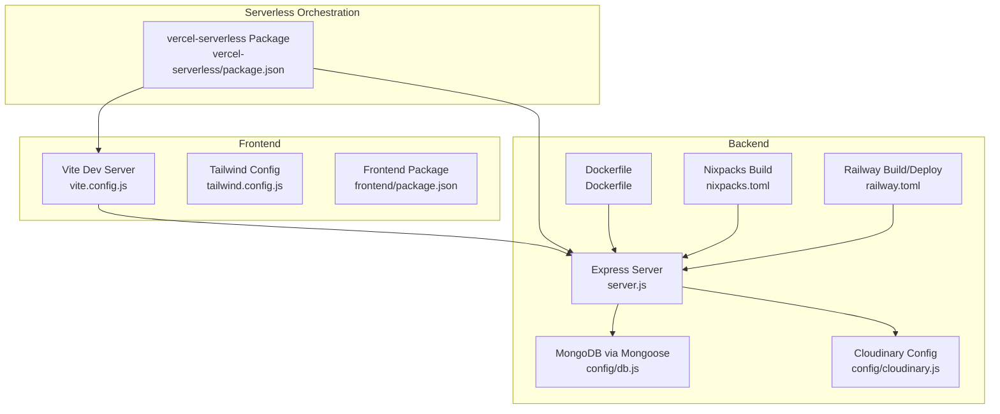
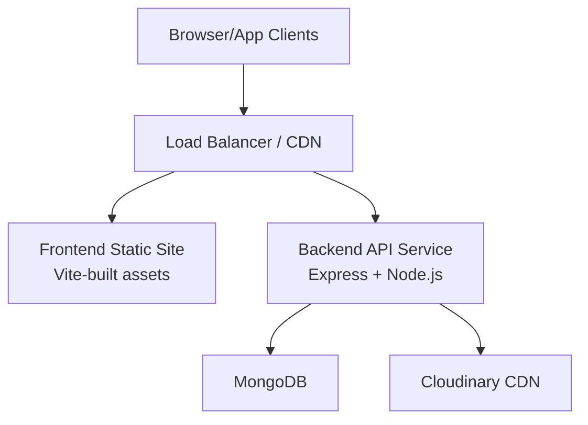
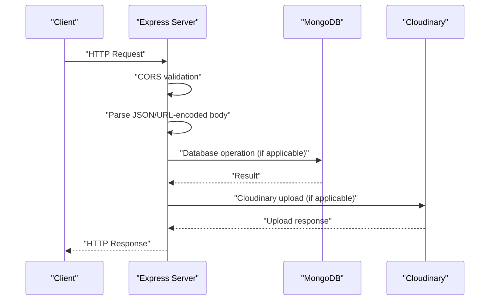
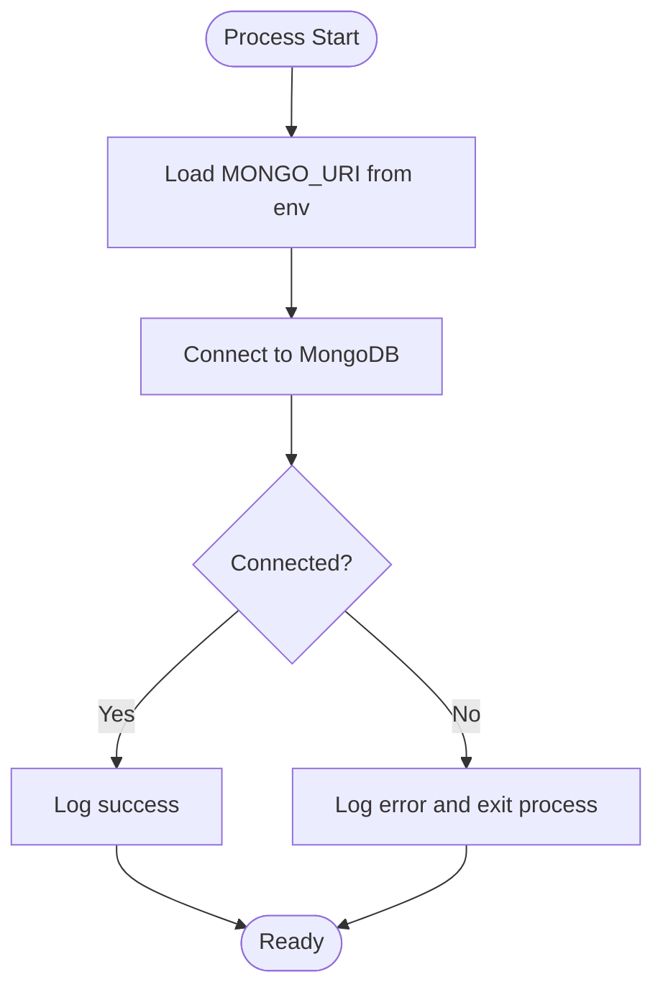
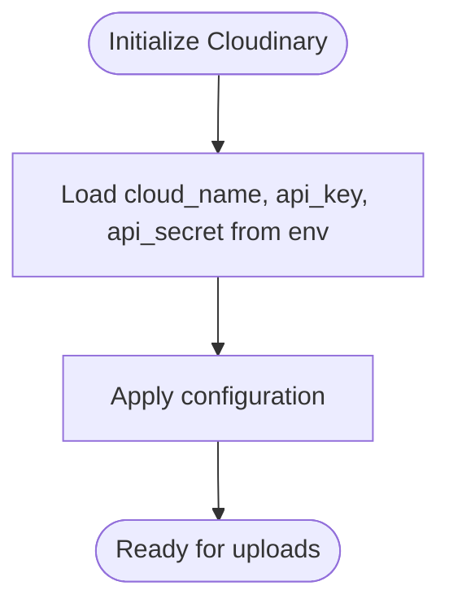
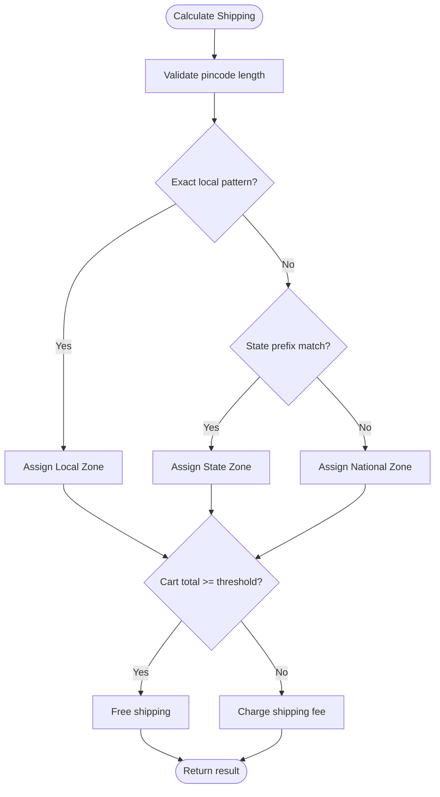
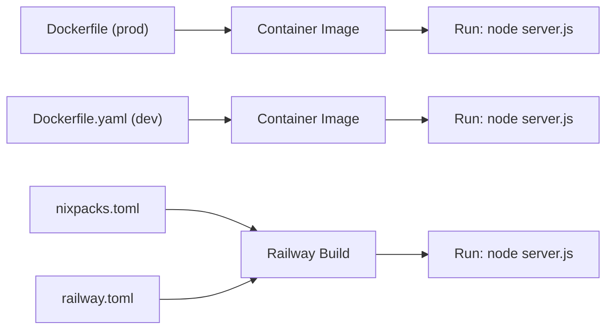
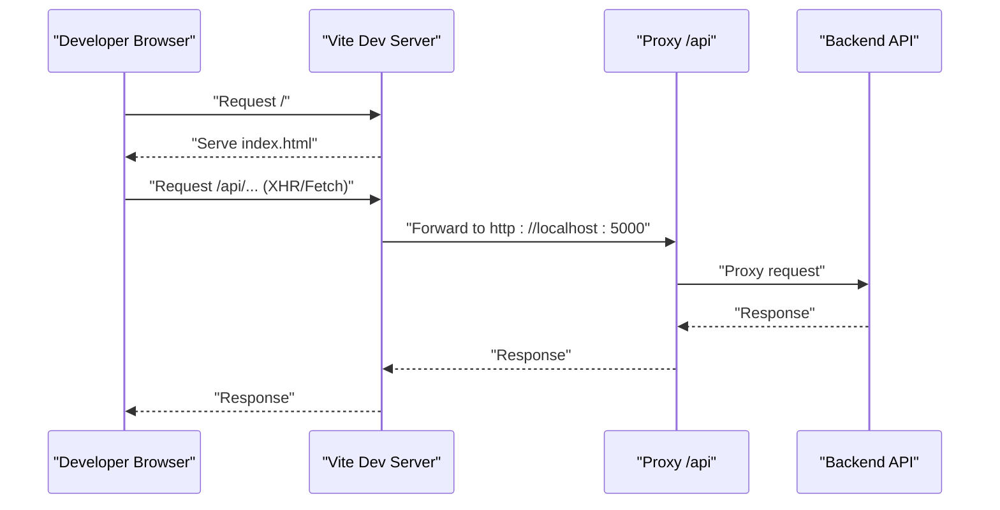
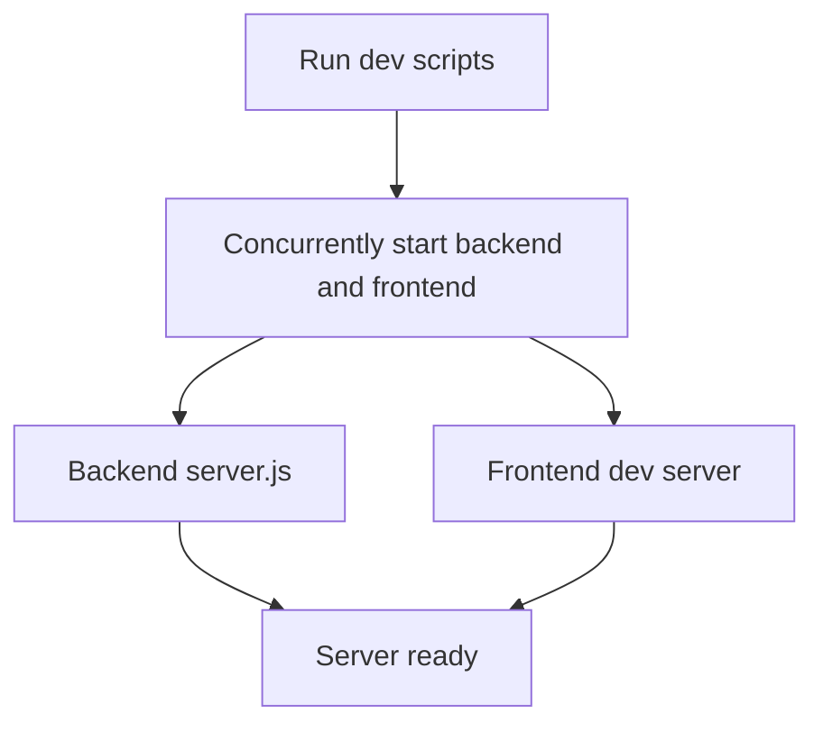
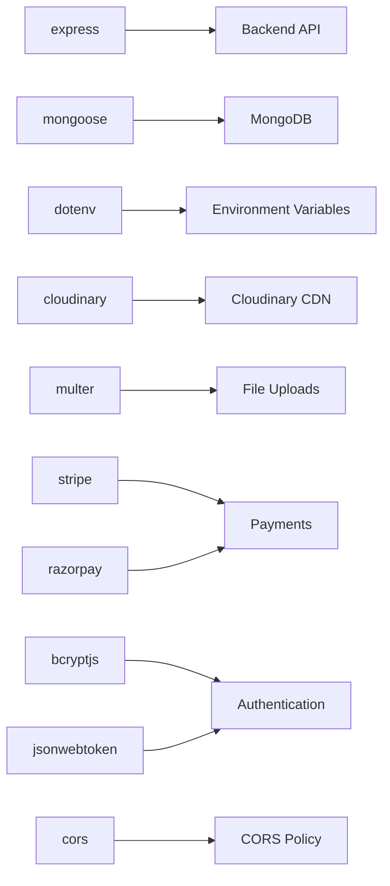

# Deployment Topology

<cite>
**Referenced Files in This Document**
- [Dockerfile](file://backend/Dockerfile)
- [Dockerfile.yaml](file://backend/Dockerfile.yaml)
- [nixpacks.toml](file://backend/nixpacks.toml)
- [railway.toml](file://backend/railway.toml)
- [server.js](file://backend/server.js)
- [db.js](file://backend/config/db.js)
- [cloudinary.js](file://backend/config/cloudinary.js)
- [shipping.js](file://backend/config/shipping.js)
- [package.json](file://backend/package.json)
- [vite.config.js](file://frontend/vite.config.js)
- [tailwind.config.js](file://frontend/tailwind.config.js)
- [frontend package.json](file://frontend/package.json)
- [vercel-serverless package.json](file://vercel-serverless/package.json)
</cite>

## Table of Contents
1. [Introduction](#introduction)
2. [Project Structure](#project-structure)
3. [Core Components](#core-components)
4. [Architecture Overview](#architecture-overview)
5. [Detailed Component Analysis](#detailed-component-analysis)
6. [Dependency Analysis](#dependency-analysis)
7. [Performance Considerations](#performance-considerations)
8. [Troubleshooting Guide](#troubleshooting-guide)
9. [Conclusion](#conclusion)
10. [Appendices](#appendices)

## Introduction
This document describes the deployment topology for the E-commerce App, covering containerized backend services, frontend hosting options, and database connectivity. It outlines multi-environment deployment strategies for development, staging, and production, and documents containerization approaches using Docker and Nixpacks. Serverless deployment options for backend APIs and static site hosting for the frontend are included. Infrastructure requirements, scaling considerations, load balancing strategies, database deployment, backup and disaster recovery procedures, deployment pipeline configurations, CI/CD integration, automated testing workflows, environment variable management, secrets handling, and configuration drift prevention are addressed.

## Project Structure
The repository is organized into three primary areas:
- Backend service written in Node.js with Express, exposing RESTful APIs and serving static uploads.
- Frontend built with React and Vite, configured for local proxying to the backend during development.
- Serverless-oriented structure under vercel-serverless intended for development orchestration and potential serverless deployments.

**Diagram sources**
- [server.js:1-102](file://backend/server.js#L1-L102)
- [db.js:1-14](file://backend/config/db.js#L1-L14)
- [cloudinary.js:1-13](file://backend/config/cloudinary.js#L1-L13)
- [Dockerfile:1-18](file://backend/Dockerfile#L1-L18)
- [nixpacks.toml:1-11](file://backend/nixpacks.toml#L1-L11)
- [railway.toml:1-7](file://backend/railway.toml#L1-L7)
- [vite.config.js:1-15](file://frontend/vite.config.js#L1-L15)
- [tailwind.config.js:1-6](file://frontend/tailwind.config.js#L1-L6)
- [frontend package.json:1-25](file://frontend/package.json#L1-L25)
- [vercel-serverless package.json:1-29](file://vercel-serverless/package.json#L1-L29)

**Section sources**
- [server.js:1-102](file://backend/server.js#L1-L102)
- [db.js:1-14](file://backend/config/db.js#L1-L14)
- [cloudinary.js:1-13](file://backend/config/cloudinary.js#L1-L13)
- [Dockerfile:1-18](file://backend/Dockerfile#L1-L18)
- [nixpacks.toml:1-11](file://backend/nixpacks.toml#L1-L11)
- [railway.toml:1-7](file://backend/railway.toml#L1-L7)
- [vite.config.js:1-15](file://frontend/vite.config.js#L1-L15)
- [tailwind.config.js:1-6](file://frontend/tailwind.config.js#L1-L6)
- [frontend package.json:1-25](file://frontend/package.json#L1-L25)
- [vercel-serverless package.json:1-29](file://vercel-serverless/package.json#L1-L29)

## Core Components
- Backend API service: Express-based server with environment-driven configuration, CORS policy, static asset serving, and health endpoint.
- Database connectivity: MongoDB connection managed via Mongoose with environment variable-driven URI.
- Cloud storage: Cloudinary integration configured via environment variables.
- Frontend: React application built with Vite, proxied to the backend during development.
- Containerization: Dockerfiles for production and development, Nixpacks configuration for Railway builds, and Railway deployment metadata.
- Serverless orchestration: A package configuration enabling local dev composition of backend and frontend.

Key runtime and configuration touchpoints:
- Port exposure and startup commands are defined in Dockerfiles and Railway configuration.
- Environment variables are loaded via dotenv and consumed for database, Cloudinary, CORS origins, and port configuration.
- Static uploads are served under a dedicated route.

**Section sources**
- [server.js:1-102](file://backend/server.js#L1-L102)
- [db.js:1-14](file://backend/config/db.js#L1-L14)
- [cloudinary.js:1-13](file://backend/config/cloudinary.js#L1-L13)
- [Dockerfile:1-18](file://backend/Dockerfile#L1-L18)
- [Dockerfile.yaml:1-18](file://backend/Dockerfile.yaml#L1-L18)
- [nixpacks.toml:1-11](file://backend/nixpacks.toml#L1-L11)
- [railway.toml:1-7](file://backend/railway.toml#L1-L7)
- [vercel-serverless package.json:1-29](file://vercel-serverless/package.json#L1-L29)

## Architecture Overview
The deployment architecture supports:
- Containerized backend services with optional multi-stage builds for production.
- Frontend hosted statically behind a CDN or web server, with API calls proxied during development.
- Database connectivity to a MongoDB instance configured via environment variables.
- Optional serverless deployment for backend APIs and static hosting for the frontend.

[No sources needed since this diagram shows conceptual workflow, not actual code structure]

## Detailed Component Analysis

### Backend API Service
The backend service initializes Express, loads environment variables, connects to MongoDB, configures CORS, serves static uploads, registers API routes, exposes health checks, and applies centralized error handling.

**Diagram sources**
- [server.js:1-102](file://backend/server.js#L1-L102)
- [db.js:1-14](file://backend/config/db.js#L1-L14)
- [cloudinary.js:1-13](file://backend/config/cloudinary.js#L1-L13)

Operational highlights:
- CORS allows controlled origins and credentials, with preflight caching.
- Static uploads are served under a dedicated path.
- Health endpoint provides operational status.
- Error handling centralizes 500 responses.

**Section sources**
- [server.js:1-102](file://backend/server.js#L1-L102)
- [db.js:1-14](file://backend/config/db.js#L1-L14)
- [cloudinary.js:1-13](file://backend/config/cloudinary.js#L1-L13)

### Database Connectivity
MongoDB connection is established using an environment variable for the URI. The connection is awaited and errors are handled to terminate the process on failure.

**Diagram sources**
- [db.js:1-14](file://backend/config/db.js#L1-L14)

**Section sources**
- [db.js:1-14](file://backend/config/db.js#L1-L14)

### Cloud Storage Integration
Cloudinary is configured using environment variables for cloud name, API key, and API secret, with secure transfers enabled.

**Diagram sources**
- [cloudinary.js:1-13](file://backend/config/cloudinary.js#L1-L13)

**Section sources**
- [cloudinary.js:1-13](file://backend/config/cloudinary.js#L1-L13)

### Shipping and Pricing Logic
Shipping zones and pricing logic are encapsulated in a module that determines delivery zones based on pincode patterns and calculates charges or free shipping thresholds.

**Diagram sources**
- [shipping.js:1-73](file://backend/config/shipping.js#L1-L73)

**Section sources**
- [shipping.js:1-73](file://backend/config/shipping.js#L1-L73)

### Containerization Approaches
Two Dockerfiles are present:
- Production-focused Dockerfile with production dependency installation and explicit port exposure.
- Development Dockerfile copying all source files and retaining dev dependencies.

Additional build tooling:
- Nixpacks configuration defines Node.js version, installs dependencies, and starts the server.
- Railway configuration sets builder and start command, plus healthcheck settings.

**Diagram sources**
- [Dockerfile:1-18](file://backend/Dockerfile#L1-L18)
- [Dockerfile.yaml:1-18](file://backend/Dockerfile.yaml#L1-L18)
- [nixpacks.toml:1-11](file://backend/nixpacks.toml#L1-L11)
- [railway.toml:1-7](file://backend/railway.toml#L1-L7)

**Section sources**
- [Dockerfile:1-18](file://backend/Dockerfile#L1-L18)
- [Dockerfile.yaml:1-18](file://backend/Dockerfile.yaml#L1-L18)
- [nixpacks.toml:1-11](file://backend/nixpacks.toml#L1-L11)
- [railway.toml:1-7](file://backend/railway.toml#L1-L7)

### Frontend Hosting and Development Proxy
The frontend uses Vite with a development server and a proxy configuration that forwards API requests to the backend service. Tailwind CSS is configured for styling.

**Diagram sources**
- [vite.config.js:1-15](file://frontend/vite.config.js#L1-L15)

**Section sources**
- [vite.config.js:1-15](file://frontend/vite.config.js#L1-L15)
- [tailwind.config.js:1-6](file://frontend/tailwind.config.js#L1-L6)

### Serverless Orchestration
The vercel-serverless package enables local development by concurrently running backend and frontend services and provides a start script for the backend server. This structure supports local orchestration and can be adapted for serverless platforms.

**Diagram sources**
- [vercel-serverless package.json:1-29](file://vercel-serverless/package.json#L1-L29)

**Section sources**
- [vercel-serverless package.json:1-29](file://vercel-serverless/package.json#L1-L29)

## Dependency Analysis
Runtime dependencies and their roles:
- Express: Web framework for the backend API.
- Mongoose: MongoDB ODM for database operations.
- Dotenv: Environment variable loading.
- Cloudinary: Cloud storage for media.
- Multer/Multer-Cloudinary: File upload handling.
- Stripe/Razorpay: Payment integrations.
- CORS: Cross-origin resource sharing policy.
- bcryptjs/jsonwebtoken: Authentication and security utilities.

**Diagram sources**
- [package.json:1-27](file://backend/package.json#L1-L27)
- [frontend package.json:1-25](file://frontend/package.json#L1-L25)
- [vercel-serverless package.json:1-29](file://vercel-serverless/package.json#L1-L29)

**Section sources**
- [package.json:1-27](file://backend/package.json#L1-L27)
- [frontend package.json:1-25](file://frontend/package.json#L1-L25)
- [vercel-serverless package.json:1-29](file://vercel-serverless/package.json#L1-L29)

## Performance Considerations
- Containerization: Use the production Dockerfile for optimized images with minimal layers and installed production dependencies only.
- Health checks: Configure healthcheck endpoints and timeouts for load balancers and orchestrators.
- Static assets: Serve frontend assets via CDN or a static host to reduce backend load.
- Database connections: Pool and reuse MongoDB connections; monitor connection limits.
- CORS caching: Preflight caching reduces repeated OPTIONS requests.
- Uploads: Offload media to Cloudinary to reduce server storage and bandwidth.
- Scaling: Stateless backend services scale horizontally behind a load balancer; maintain session state externally if needed.

[No sources needed since this section provides general guidance]

## Troubleshooting Guide
Common issues and resolutions:
- CORS errors: Verify allowed origins and credentials configuration; ensure FRONTEND_URL is set appropriately per environment.
- Database connection failures: Confirm MONGO_URI is set and reachable; check network policies and firewall rules.
- Static uploads not served: Ensure uploads directory exists and permissions are correct; verify static route configuration.
- Health check failures: Confirm health endpoint is accessible and returns expected status.
- Environment variables missing: Validate dotenv usage and ensure all required variables are present in the deployment environment.

**Section sources**
- [server.js:22-49](file://backend/server.js#L22-L49)
- [db.js:5-13](file://backend/config/db.js#L5-L13)
- [server.js:54-73](file://backend/server.js#L54-L73)
- [railway.toml:6-7](file://backend/railway.toml#L6-L7)

## Conclusion
The E-commerce App’s deployment topology supports containerized backend services, flexible frontend hosting, and robust database connectivity. Multi-environment strategies leverage Docker and Nixpacks for containerization, with Railway for streamlined deployments. Serverless orchestration enables local development workflows. Proper environment variable management, secrets handling, and configuration drift prevention are essential for reliable deployments across development, staging, and production.

[No sources needed since this section summarizes without analyzing specific files]

## Appendices

### Multi-Environment Deployment Strategy
- Development: Use Vite dev server with proxy to backend; run backend and frontend concurrently locally.
- Staging: Deploy containerized backend with production Dockerfile; serve frontend statically via CDN; configure staging-specific environment variables.
- Production: Use optimized container images, enable health checks, and deploy behind a load balancer; enforce strict CORS and secrets management.

[No sources needed since this section provides general guidance]

### Infrastructure Requirements
- Compute: Stateless Node.js containers for backend; static hosting for frontend.
- Networking: Load balancer with TLS termination; allowlist CORS origins per environment.
- Storage: MongoDB instance; Cloudinary for media.
- Secrets: Store sensitive environment variables in a secrets manager and inject at runtime.

[No sources needed since this section provides general guidance]

### Load Balancing and Scaling
- Horizontal scaling: Run multiple backend replicas behind a load balancer.
- Health checks: Use health endpoint for readiness/liveness probes.
- Sticky sessions: Avoid if stateless; otherwise use external session store.

[No sources needed since this section provides general guidance]

### Database Deployment, Backups, and Disaster Recovery
- Deployment: Use managed MongoDB service or self-hosted replica set with network isolation.
- Backups: Enable automated backups and snapshot retention policies.
- DR: Maintain cross-region replicas and test restore procedures regularly.

[No sources needed since this section provides general guidance]

### Deployment Pipelines, CI/CD, and Automated Testing
- CI/CD: Build Docker images on push; run tests; deploy to staging; promote to production after approvals.
- Automated testing: Unit/integration tests in pipeline; lint and security scans.
- Rollback: Maintain immutable artifacts and support quick rollback mechanisms.

[No sources needed since this section provides general guidance]

### Environment Variable Management and Secrets Handling
- Define environment variables per environment (development, staging, production).
- Use secrets managers for sensitive values; avoid committing secrets to repositories.
- Validate required variables at startup and fail fast on missing values.

[No sources needed since this section provides general guidance]

### Configuration Drift Prevention
- Version control: Keep all configuration files in version control.
- Templates: Use environment-specific templates for configuration.
- Auditing: Periodically audit configuration across environments and reconcile differences.

[No sources needed since this section provides general guidance]