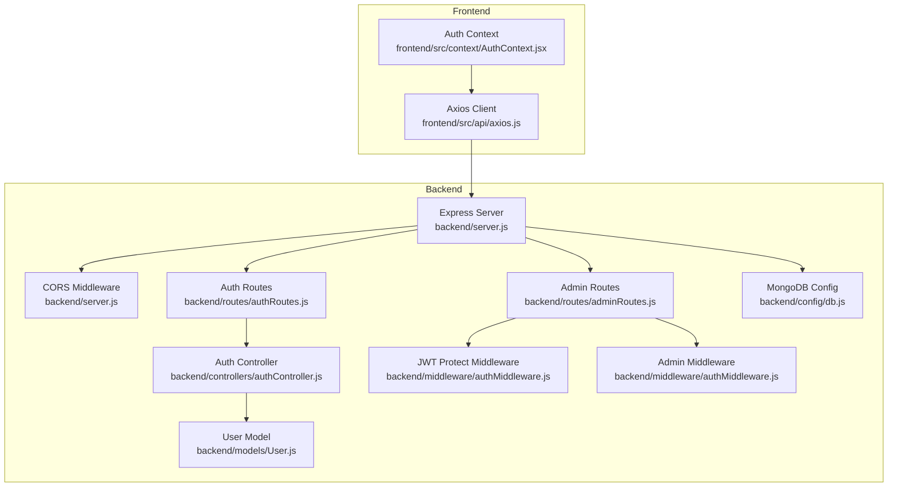
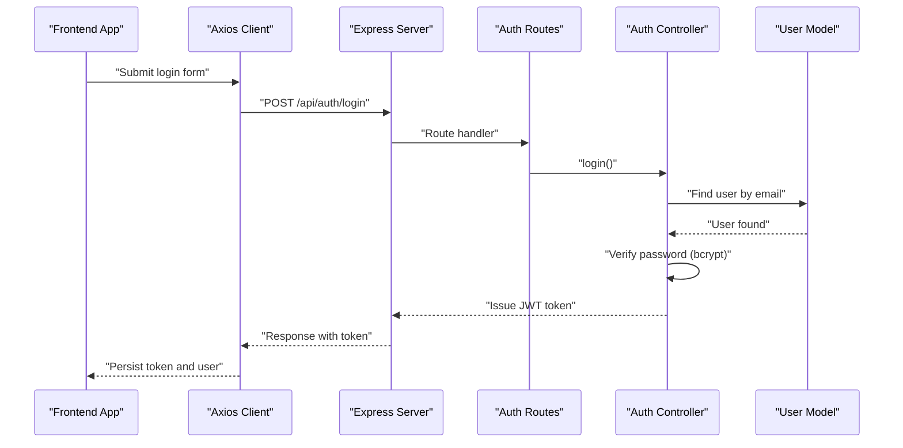
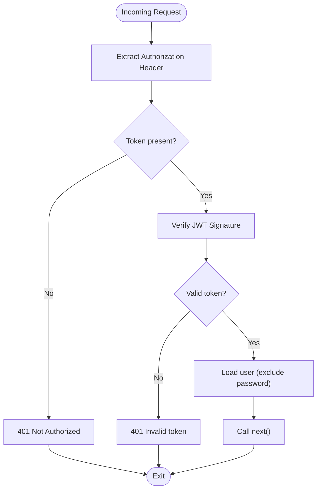
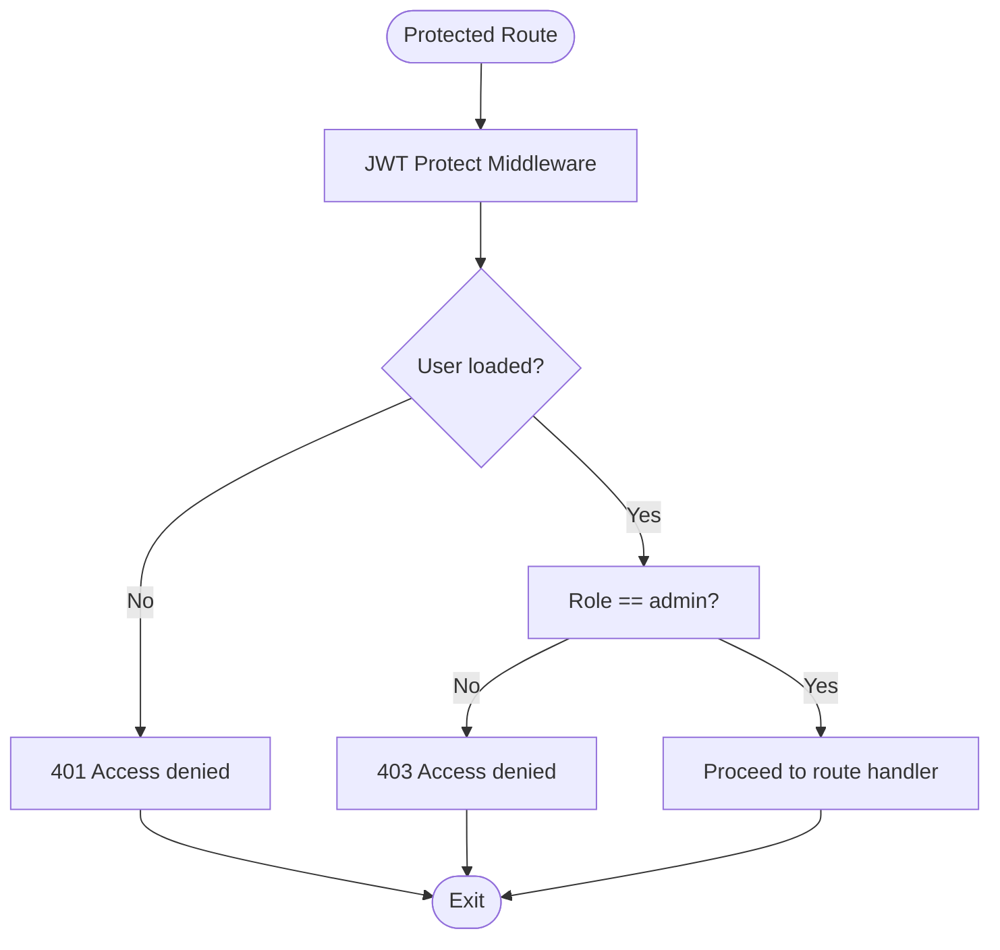
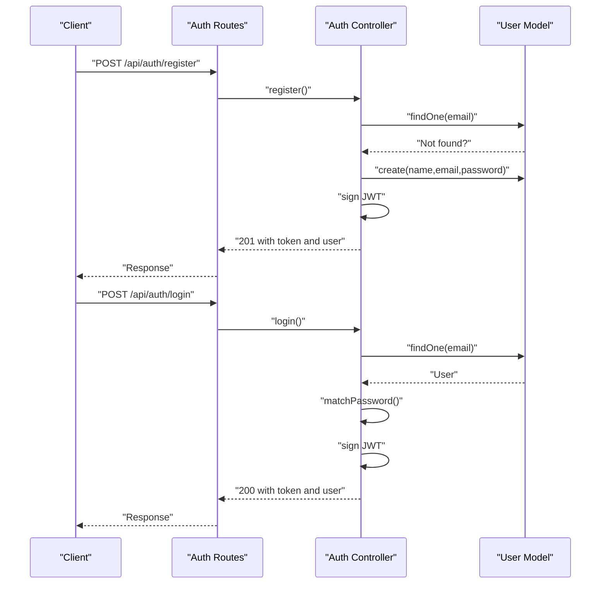
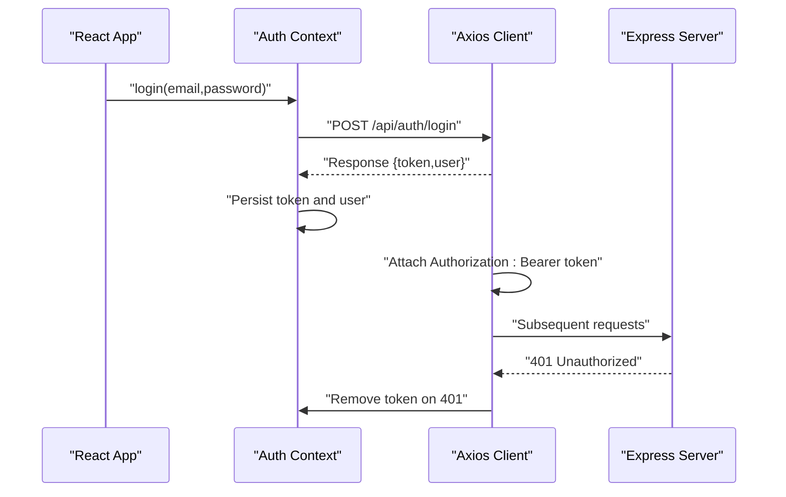
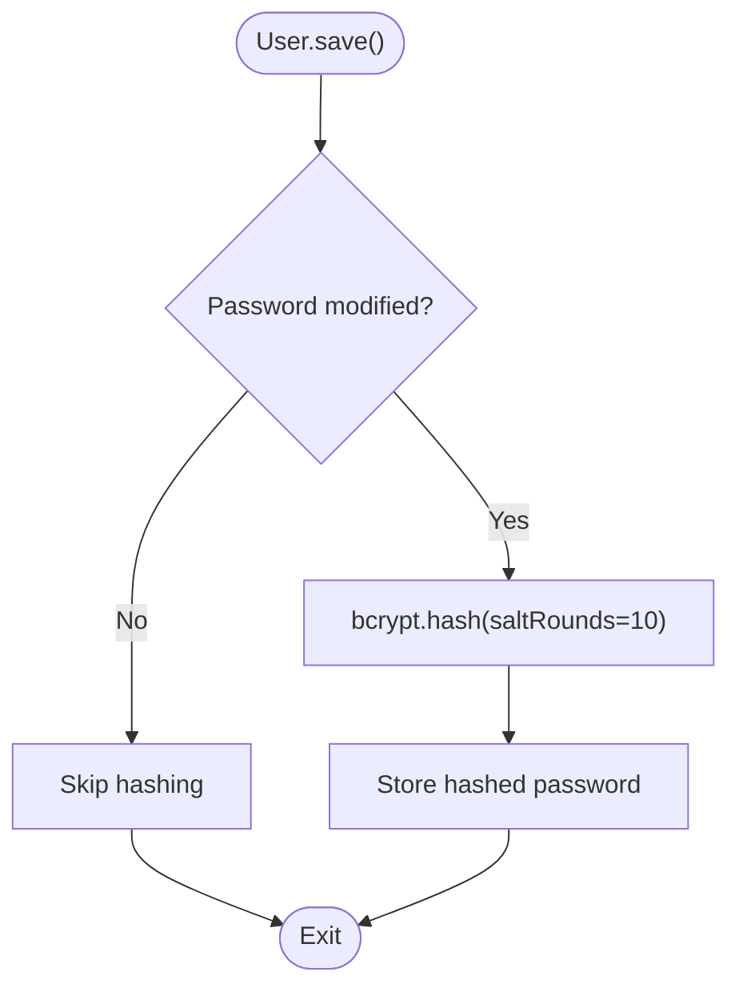
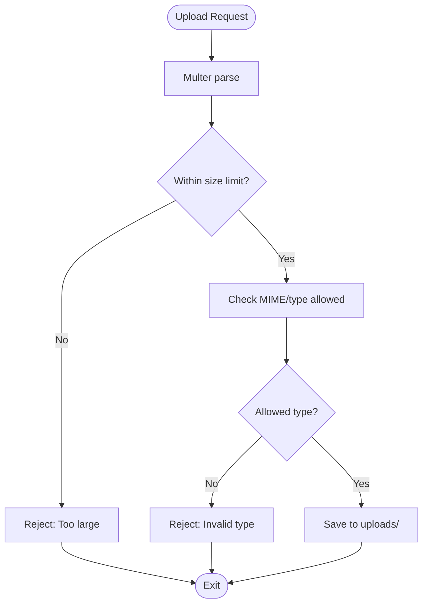
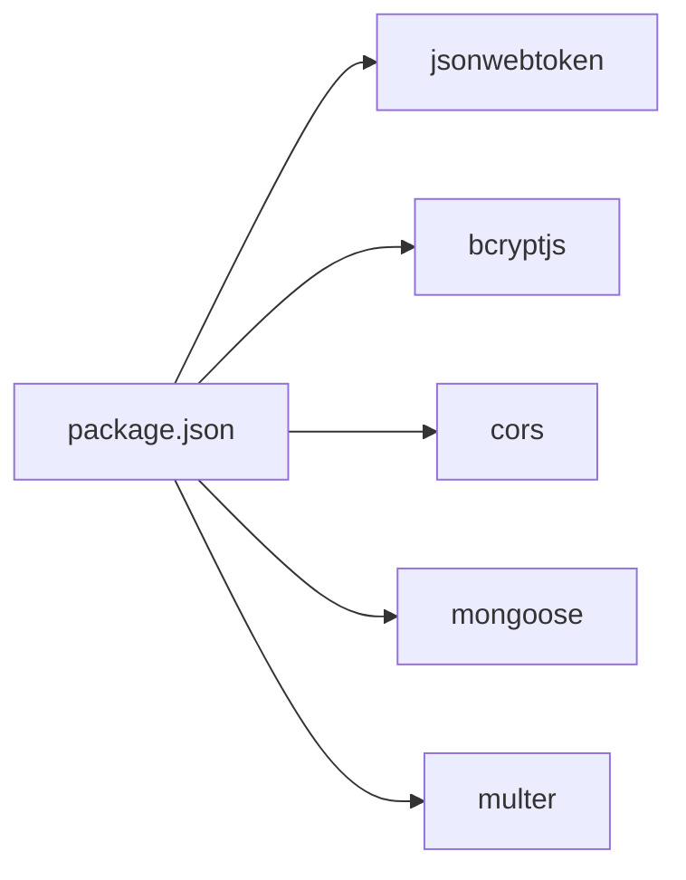

# Security Architecture

<cite>
**Referenced Files in This Document**
- [server.js](file://backend/server.js)
- [authMiddleware.js](file://backend/middleware/authMiddleware.js)
- [authController.js](file://backend/controllers/authController.js)
- [User.js](file://backend/models/User.js)
- [authRoutes.js](file://backend/routes/authRoutes.js)
- [adminRoutes.js](file://backend/routes/adminRoutes.js)
- [axios.js](file://frontend/src/api/axios.js)
- [AuthContext.jsx](file://frontend/src/context/AuthContext.jsx)
- [uploadMiddleware.js](file://backend/middleware/uploadMiddleware.js)
- [db.js](file://backend/config/db.js)
- [package.json](file://backend/package.json)
</cite>

## Table of Contents
1. [Introduction](#introduction)
2. [Project Structure](#project-structure)
3. [Core Components](#core-components)
4. [Architecture Overview](#architecture-overview)
5. [Detailed Component Analysis](#detailed-component-analysis)
6. [Dependency Analysis](#dependency-analysis)
7. [Performance Considerations](#performance-considerations)
8. [Troubleshooting Guide](#troubleshooting-guide)
9. [Conclusion](#conclusion)
10. [Appendices](#appendices)

## Introduction
This document presents the security architecture of the E-commerce App, focusing on the multi-layered approach to authentication, authorization, transport security, and data protection. It explains the JWT-based authentication flow from the frontend token lifecycle through backend middleware validation to database user verification. It also documents implemented protections such as bcrypt-based password hashing, input validation, and upload restrictions, along with gaps and recommended mitigations for rate limiting, CSRF protection, secure headers, and deployment hardening.

## Project Structure
The security-critical backend stack is organized around:
- Express server initialization and CORS configuration
- Authentication routes and controller logic
- JWT-based middleware for protected routes and admin-only routes
- Mongoose model with bcrypt password hashing
- Frontend token management via Axios interceptors and React context

**Diagram sources**
- [server.js:1-102](file://backend/server.js#L1-L102)
- [authRoutes.js:1-9](file://backend/routes/authRoutes.js#L1-L9)
- [adminRoutes.js:1-14](file://backend/routes/adminRoutes.js#L1-L14)
- [authController.js:1-27](file://backend/controllers/authController.js#L1-L27)
- [authMiddleware.js:1-20](file://backend/middleware/authMiddleware.js#L1-L20)
- [User.js:1-20](file://backend/models/User.js#L1-L20)
- [axios.js:1-17](file://frontend/src/api/axios.js#L1-L17)
- [AuthContext.jsx:1-33](file://frontend/src/context/AuthContext.jsx#L1-L33)
- [db.js:1-14](file://backend/config/db.js#L1-L14)

**Section sources**
- [server.js:1-102](file://backend/server.js#L1-L102)
- [authRoutes.js:1-9](file://backend/routes/authRoutes.js#L1-L9)
- [adminRoutes.js:1-14](file://backend/routes/adminRoutes.js#L1-L14)
- [authController.js:1-27](file://backend/controllers/authController.js#L1-L27)
- [authMiddleware.js:1-20](file://backend/middleware/authMiddleware.js#L1-L20)
- [User.js:1-20](file://backend/models/User.js#L1-L20)
- [axios.js:1-17](file://frontend/src/api/axios.js#L1-L17)
- [AuthContext.jsx:1-33](file://frontend/src/context/AuthContext.jsx#L1-L33)
- [db.js:1-14](file://backend/config/db.js#L1-L14)

## Core Components
- Transport Security (CORS): Production-ready CORS configuration restricts origins, enables credentials, and sets allowed headers/methods.
- Authentication Flow: JWT-based login/register; frontend stores tokens and attaches Authorization headers; backend validates JWT and enriches request with user.
- Authorization: Role-based access control enforcing admin-only endpoints.
- Data Protection: Password hashing with bcrypt and pre-save hooks; upload filtering for images.
- Database Connectivity: Centralized MongoDB connection with error handling.

Key implementation references:
- CORS configuration and route registration: [server.js:22-49](file://backend/server.js#L22-L49), [server.js:57-63](file://backend/server.js#L57-L63)
- JWT middleware and RBAC: [authMiddleware.js:4-15](file://backend/middleware/authMiddleware.js#L4-L15), [authMiddleware.js:17-20](file://backend/middleware/authMiddleware.js#L17-L20)
- Auth controller (register/login): [authController.js:6-16](file://backend/controllers/authController.js#L6-L16), [authController.js:18-27](file://backend/controllers/authController.js#L18-L27)
- User model (bcrypt hashing): [User.js:11-18](file://backend/models/User.js#L11-L18)
- Upload middleware (file filter): [uploadMiddleware.js:14-28](file://backend/middleware/uploadMiddleware.js#L14-L28)
- MongoDB connection: [db.js:5-13](file://backend/config/db.js#L5-L13)

**Section sources**
- [server.js:22-49](file://backend/server.js#L22-L49)
- [server.js:57-63](file://backend/server.js#L57-L63)
- [authMiddleware.js:4-15](file://backend/middleware/authMiddleware.js#L4-L15)
- [authMiddleware.js:17-20](file://backend/middleware/authMiddleware.js#L17-L20)
- [authController.js:6-16](file://backend/controllers/authController.js#L6-L16)
- [authController.js:18-27](file://backend/controllers/authController.js#L18-L27)
- [User.js:11-18](file://backend/models/User.js#L11-L18)
- [uploadMiddleware.js:14-28](file://backend/middleware/uploadMiddleware.js#L14-L28)
- [db.js:5-13](file://backend/config/db.js#L5-L13)

## Architecture Overview
The security architecture enforces a layered policy:
- Transport Security: CORS allows trusted origins and credentials, with caching of preflight results.
- Identity and Access: JWT bearer tokens are validated centrally; protected routes require both token presence and admin role when applicable.
- Data Integrity: Passwords are hashed before persistence; uploads are restricted to safe image types and sizes.
- Resilience: Centralized error handling and database connectivity logging.

**Diagram sources**
- [axios.js:1-17](file://frontend/src/api/axios.js#L1-L17)
- [server.js:57-63](file://backend/server.js#L57-L63)
- [authRoutes.js:1-9](file://backend/routes/authRoutes.js#L1-L9)
- [authController.js:18-27](file://backend/controllers/authController.js#L18-L27)
- [User.js:16-18](file://backend/models/User.js#L16-L18)

## Detailed Component Analysis

### JWT-Based Authentication Middleware
- Token extraction: Reads Authorization header and splits the Bearer token.
- Validation: Uses JWT secret to verify signature and decode payload containing user ID.
- User enrichment: Loads user without password and attaches to request object.
- Error handling: Returns 401 for missing/invalid tokens.

**Diagram sources**
- [authMiddleware.js:4-15](file://backend/middleware/authMiddleware.js#L4-L15)

**Section sources**
- [authMiddleware.js:4-15](file://backend/middleware/authMiddleware.js#L4-L15)

### Role-Based Access Control (RBAC)
- Admin guard checks the user’s role after successful JWT validation.
- Combined middleware pattern ensures both authentication and authorization.

**Diagram sources**
- [authMiddleware.js:17-20](file://backend/middleware/authMiddleware.js#L17-L20)
- [adminRoutes.js:7-8](file://backend/routes/adminRoutes.js#L7-L8)

**Section sources**
- [authMiddleware.js:17-20](file://backend/middleware/authMiddleware.js#L17-L20)
- [adminRoutes.js:7-8](file://backend/routes/adminRoutes.js#L7-L8)

### Authentication Controller Flow
- Registration: Checks for existing email, creates user, signs JWT, returns token and user info.
- Login: Finds user by email, verifies password, signs JWT, returns token and user info.

**Diagram sources**
- [authRoutes.js:1-9](file://backend/routes/authRoutes.js#L1-L9)
- [authController.js:6-16](file://backend/controllers/authController.js#L6-L16)
- [authController.js:18-27](file://backend/controllers/authController.js#L18-L27)
- [User.js:16-18](file://backend/models/User.js#L16-L18)

**Section sources**
- [authController.js:6-16](file://backend/controllers/authController.js#L6-L16)
- [authController.js:18-27](file://backend/controllers/authController.js#L18-L27)
- [User.js:16-18](file://backend/models/User.js#L16-L18)

### Frontend Token Management and Interceptors
- Axios interceptor attaches Authorization header when a token exists.
- On 401 response, token is removed from localStorage to prevent stale sessions.
- Auth context persists user state and exposes login/logout actions.

**Diagram sources**
- [axios.js:4-16](file://frontend/src/api/axios.js#L4-L16)
- [AuthContext.jsx:16-28](file://frontend/src/context/AuthContext.jsx#L16-L28)

**Section sources**
- [axios.js:4-16](file://frontend/src/api/axios.js#L4-L16)
- [AuthContext.jsx:16-28](file://frontend/src/context/AuthContext.jsx#L16-L28)

### Password Hashing with bcrypt
- Pre-save hook hashes the password using bcrypt with a salt round of 10.
- Runtime comparison uses bcrypt compare for credential verification.

**Diagram sources**
- [User.js:11-18](file://backend/models/User.js#L11-L18)

**Section sources**
- [User.js:11-18](file://backend/models/User.js#L11-L18)

### Upload Filtering and Size Limits
- Multer disk storage with randomized filenames and controlled destination.
- File size limit of 5 MB.
- Allowed MIME types and extensions: jpg, jpeg, png, webp.

**Diagram sources**
- [uploadMiddleware.js:14-28](file://backend/middleware/uploadMiddleware.js#L14-L28)

**Section sources**
- [uploadMiddleware.js:14-28](file://backend/middleware/uploadMiddleware.js#L14-L28)

### Database Connectivity and Logging
- Centralized MongoDB connection with graceful error handling and exit on failure.
- Logging confirms successful connection and errors during connection attempts.

**Section sources**
- [db.js:5-13](file://backend/config/db.js#L5-L13)

## Dependency Analysis
External dependencies relevant to security:
- jsonwebtoken: JWT signing/verification for auth tokens
- bcryptjs: Password hashing and comparison
- cors: Cross-origin policy enforcement
- mongoose: ODM with schema and middleware hooks
- multer: File upload handling with filtering

**Diagram sources**
- [package.json:8-22](file://backend/package.json#L8-L22)

**Section sources**
- [package.json:8-22](file://backend/package.json#L8-L22)

## Performance Considerations
- JWT verification is lightweight; ensure minimal payload and appropriate expiration.
- bcrypt cost (salt rounds) balances security and CPU usage; current 10 is widely accepted.
- Multer disk writes can be I/O bound; consider CDN-backed storage for production.
- CORS preflight caching reduces latency for repeated cross-origin requests.

## Troubleshooting Guide
Common issues and remediation:
- 401 Not Authorized: Verify Authorization header format and token presence.
- 401 Invalid token: Confirm JWT secret consistency and token freshness/expiry.
- 403 Access denied: Ensure user role is admin for admin-protected routes.
- 400 Email exists: Handle duplicate registration gracefully in the UI.
- 500 Internal errors: Inspect centralized error handler logs and controller try/catch blocks.
- Upload rejections: Confirm file size under 5 MB and extension/type in allowed list.

Operational references:
- Middleware error handling: [server.js:91-95](file://backend/server.js#L91-L95)
- JWT middleware error responses: [authMiddleware.js](file://backend/middleware/authMiddleware.js#L6), [authMiddleware.js:12-14](file://backend/middleware/authMiddleware.js#L12-L14)
- Admin guard denial: [authMiddleware.js](file://backend/middleware/authMiddleware.js#L19)
- Axios 401 cleanup: [axios.js:12-15](file://frontend/src/api/axios.js#L12-L15)

**Section sources**
- [server.js:91-95](file://backend/server.js#L91-L95)
- [authMiddleware.js](file://backend/middleware/authMiddleware.js#L6)
- [authMiddleware.js:12-14](file://backend/middleware/authMiddleware.js#L12-L14)
- [authMiddleware.js](file://backend/middleware/authMiddleware.js#L19)
- [axios.js:12-15](file://frontend/src/api/axios.js#L12-L15)

## Conclusion
The E-commerce App implements a robust, layered security model centered on JWT authentication, role-based authorization, and strong data protection via bcrypt. The CORS configuration is production-ready, and upload handling includes essential safety checks. To further strengthen the platform, integrate rate limiting, CSRF protection, secure headers, and comprehensive input sanitization/validation. Adopt environment-specific secrets management, HTTPS enforcement, and regular security audits for deployment hardening.

## Appendices

### Security Checklist and Recommendations
- Rate Limiting: Enforce per-endpoint and per-IP quotas to mitigate brute force and abuse.
- CSRF Protection: Implement anti-CSRF tokens for state-changing forms and cookie SameSite attributes.
- Secure Headers: Add Helmet.js or equivalent to set CSP, HSTS, X-Frame-Options, etc.
- Input Validation and Sanitization: Use a validator library to sanitize and validate all request payloads.
- Secret Management: Store JWT_SECRET, MONGO_URI, and other secrets in environment variables and secret managers.
- HTTPS Enforcement: Redirect HTTP to HTTPS and enforce TLS 1.2+.
- Audit Logs: Log authentication failures and admin actions for monitoring and incident response.
- Dependency Hygiene: Regularly audit dependencies for known vulnerabilities and keep packages updated.