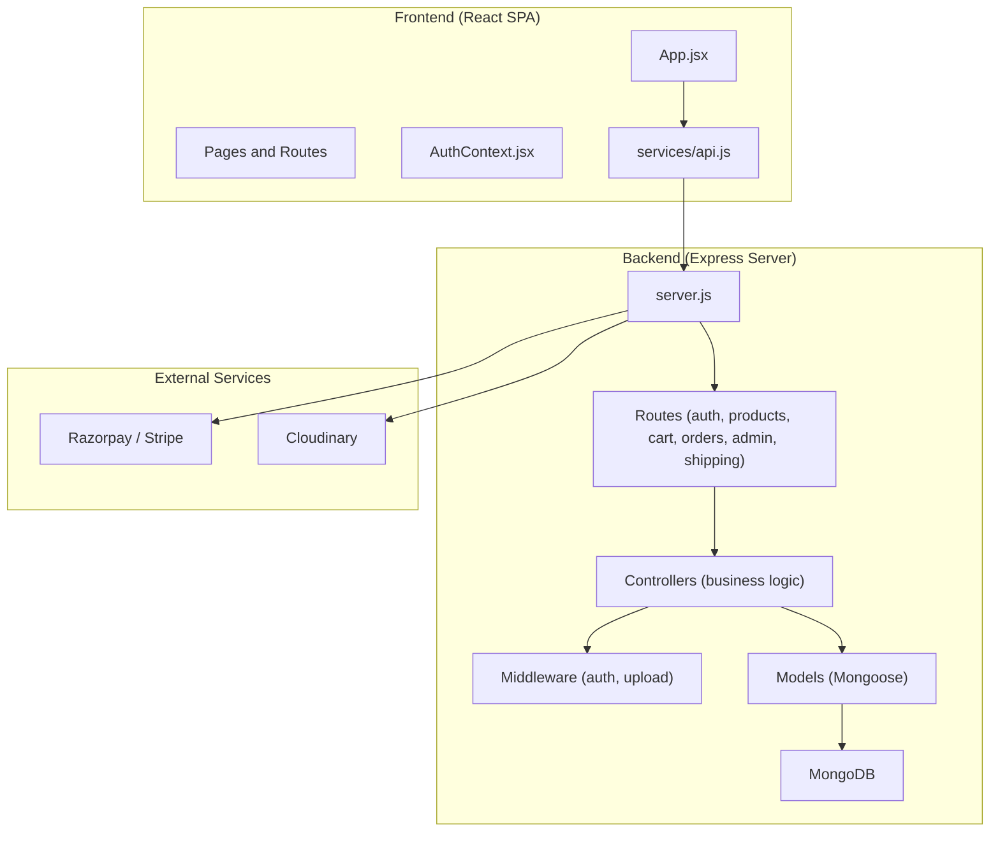
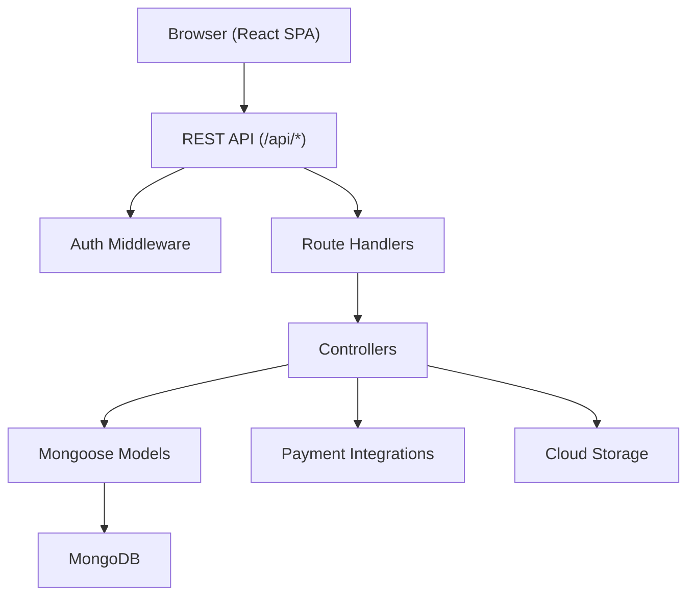
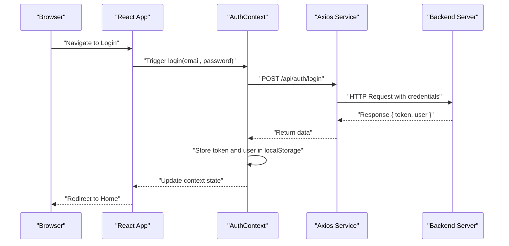
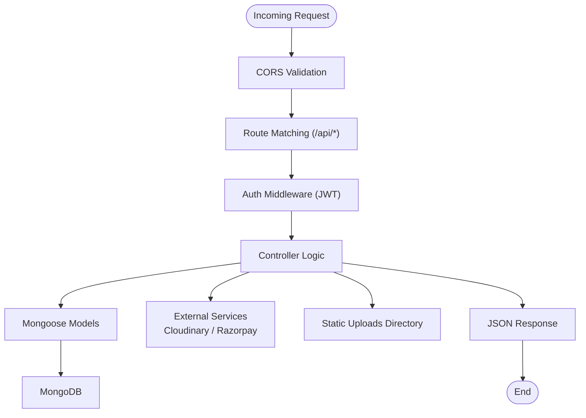
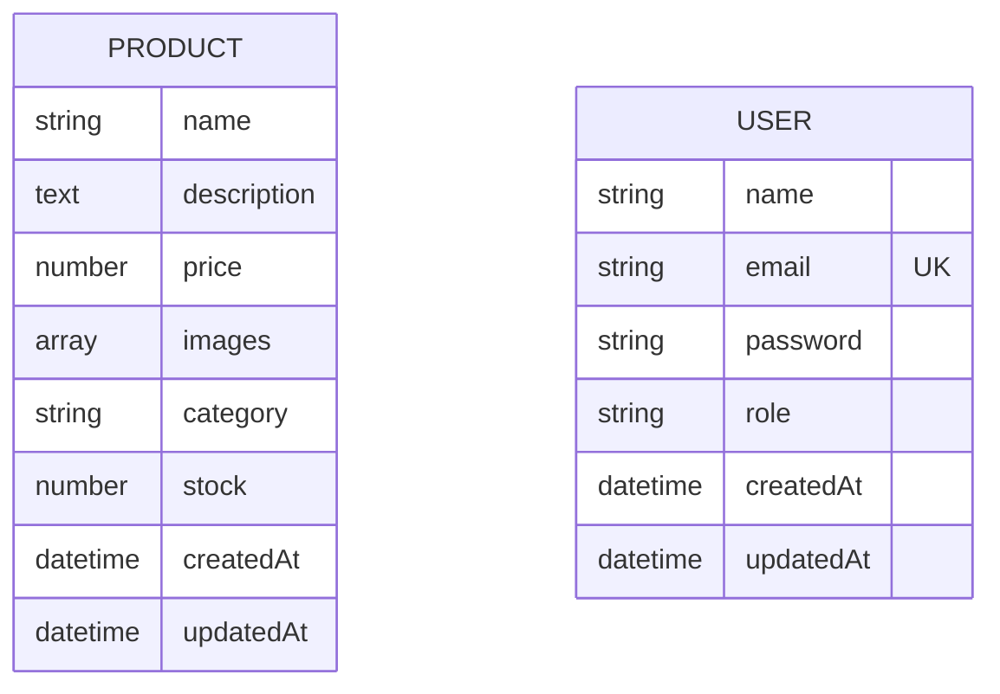
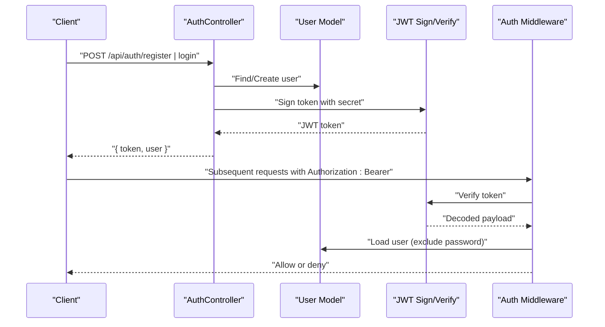
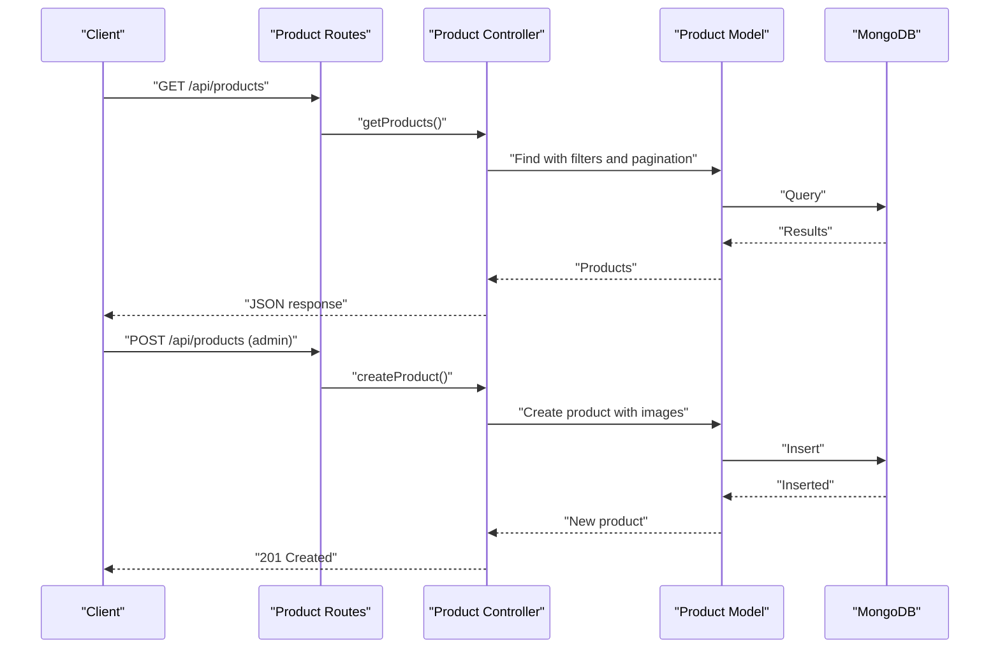
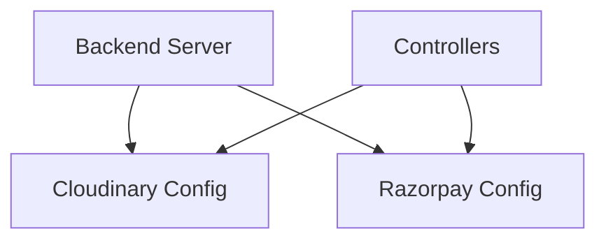
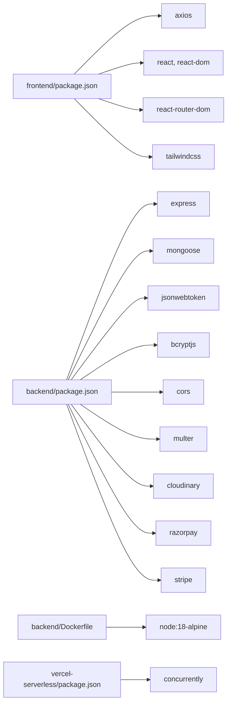

# System Overview

<cite>
**Referenced Files in This Document**
- [backend/package.json](file://backend/package.json)
- [frontend/package.json](file://frontend/package.json)
- [backend/server.js](file://backend/server.js)
- [backend/config/db.js](file://backend/config/db.js)
- [backend/routes/productRoutes.js](file://backend/routes/productRoutes.js)
- [backend/controllers/productController.js](file://backend/controllers/productController.js)
- [backend/models/Product.js](file://backend/models/Product.js)
- [backend/middleware/authMiddleware.js](file://backend/middleware/authMiddleware.js)
- [backend/controllers/authController.js](file://backend/controllers/authController.js)
- [backend/models/User.js](file://backend/models/User.js)
- [backend/config/cloudinary.js](file://backend/config/cloudinary.js)
- [backend/utils/razorpay.js](file://backend/utils/razorpay.js)
- [frontend/src/App.jsx](file://frontend/src/App.jsx)
- [frontend/src/services/api.js](file://frontend/src/services/api.js)
- [frontend/src/context/AuthContext.jsx](file://frontend/src/context/AuthContext.jsx)
- [backend/Dockerfile](file://backend/Dockerfile)
- [vercel-serverless/package.json](file://vercel-serverless/package.json)
</cite>

## Table of Contents
1. [Introduction](#introduction)
2. [Project Structure](#project-structure)
3. [Core Components](#core-components)
4. [Architecture Overview](#architecture-overview)
5. [Detailed Component Analysis](#detailed-component-analysis)
6. [Dependency Analysis](#dependency-analysis)
7. [Performance Considerations](#performance-considerations)
8. [Troubleshooting Guide](#troubleshooting-guide)
9. [Conclusion](#conclusion)
10. [Appendices](#appendices)

## Introduction
This document provides a comprehensive system overview of the E-commerce App, focusing on the separation of concerns across the frontend React Single Page Application (SPA), the backend Express server, and the MongoDB database. It explains the technology stack (Node.js/Express, React, Mongoose ORM, MongoDB), system boundaries, major components, and their responsibilities. It also covers architectural patterns (MVC, RESTful API design, layered architecture), scalability considerations, deployment topology, and integration points with payment gateways and cloud storage services.

## Project Structure
The project is organized into three primary areas:
- Backend: Express server with REST API routes, controllers, models, middleware, and configuration for database, cloud storage, and payments.
- Frontend: React SPA with routing, context providers, and service layer for API communication.
- Vercel Serverless: Optional packaging for development and deployment orchestration.

**Diagram sources**
- [backend/server.js:1-102](file://backend/server.js#L1-L102)
- [frontend/src/App.jsx:1-66](file://frontend/src/App.jsx#L1-L66)
- [frontend/src/services/api.js:1-8](file://frontend/src/services/api.js#L1-L8)
- [backend/routes/productRoutes.js:1-23](file://backend/routes/productRoutes.js#L1-L23)
- [backend/controllers/productController.js:1-127](file://backend/controllers/productController.js#L1-L127)
- [backend/models/Product.js:1-12](file://backend/models/Product.js#L1-L12)
- [backend/config/db.js:1-14](file://backend/config/db.js#L1-L14)
- [backend/utils/razorpay.js:1-10](file://backend/utils/razorpay.js#L1-L10)
- [backend/config/cloudinary.js:1-13](file://backend/config/cloudinary.js#L1-L13)

**Section sources**
- [backend/server.js:1-102](file://backend/server.js#L1-L102)
- [frontend/src/App.jsx:1-66](file://frontend/src/App.jsx#L1-L66)
- [backend/package.json:1-27](file://backend/package.json#L1-L27)
- [frontend/package.json:1-25](file://frontend/package.json#L1-L25)

## Core Components
- Frontend React SPA
  - Routing via React Router DOM with protected and public routes.
  - Authentication context provider managing user session and local storage tokens.
  - Axios-based service layer with base URL and Authorization header injection.
- Backend Express Server
  - Centralized CORS configuration for production-grade origins.
  - REST API endpoints grouped under /api/* paths.
  - Middleware for authentication and file upload handling.
  - Controllers implementing business logic for resources (products, orders, carts, users).
  - Models using Mongoose for MongoDB schema definitions.
  - Configuration modules for database connection, cloud storage (Cloudinary), and payment integrations (Razorpay).
- Database
  - MongoDB accessed via Mongoose ODM with strongly typed schemas.
- External Integrations
  - Payment gateways (Razorpay) and cloud storage (Cloudinary) configured via environment variables.

**Section sources**
- [frontend/src/App.jsx:1-66](file://frontend/src/App.jsx#L1-L66)
- [frontend/src/context/AuthContext.jsx:1-33](file://frontend/src/context/AuthContext.jsx#L1-L33)
- [frontend/src/services/api.js:1-8](file://frontend/src/services/api.js#L1-L8)
- [backend/server.js:1-102](file://backend/server.js#L1-L102)
- [backend/middleware/authMiddleware.js:1-20](file://backend/middleware/authMiddleware.js#L1-L20)
- [backend/controllers/productController.js:1-127](file://backend/controllers/productController.js#L1-L127)
- [backend/models/Product.js:1-12](file://backend/models/Product.js#L1-L12)
- [backend/config/db.js:1-14](file://backend/config/db.js#L1-L14)
- [backend/utils/razorpay.js:1-10](file://backend/utils/razorpay.js#L1-L10)
- [backend/config/cloudinary.js:1-13](file://backend/config/cloudinary.js#L1-L13)

## Architecture Overview
The system follows a layered architecture with clear separation between presentation (frontend), application logic (backend), and persistence (database). The frontend communicates with the backend via RESTful HTTP requests. The backend enforces authentication, applies business logic in controllers, persists data using Mongoose models, and integrates with external services for payments and media.

**Diagram sources**
- [backend/server.js:57-63](file://backend/server.js#L57-L63)
- [backend/middleware/authMiddleware.js:1-20](file://backend/middleware/authMiddleware.js#L1-L20)
- [backend/routes/productRoutes.js:1-23](file://backend/routes/productRoutes.js#L1-L23)
- [backend/controllers/productController.js:1-127](file://backend/controllers/productController.js#L1-L127)
- [backend/models/Product.js:1-12](file://backend/models/Product.js#L1-L12)
- [backend/utils/razorpay.js:1-10](file://backend/utils/razorpay.js#L1-L10)
- [backend/config/cloudinary.js:1-13](file://backend/config/cloudinary.js#L1-L13)

## Detailed Component Analysis

### Frontend: React SPA
- Responsibilities
  - Render UI pages (Home, Product Details, Cart, Checkout, Admin Dashboard, Login, Register).
  - Manage global state via AuthContext for login/logout and persisted user session.
  - Communicate with backend using Axios service with dynamic base URL and Authorization header injection.
- Key Patterns
  - Component composition with React Router for navigation.
  - Context provider for centralized authentication state.
  - Environment-driven API base URL for flexible deployment targets.

**Diagram sources**
- [frontend/src/App.jsx:1-66](file://frontend/src/App.jsx#L1-L66)
- [frontend/src/context/AuthContext.jsx:16-22](file://frontend/src/context/AuthContext.jsx#L16-L22)
- [frontend/src/services/api.js:1-8](file://frontend/src/services/api.js#L1-L8)
- [backend/server.js:57-63](file://backend/server.js#L57-L63)

**Section sources**
- [frontend/src/App.jsx:1-66](file://frontend/src/App.jsx#L1-L66)
- [frontend/src/context/AuthContext.jsx:1-33](file://frontend/src/context/AuthContext.jsx#L1-L33)
- [frontend/src/services/api.js:1-8](file://frontend/src/services/api.js#L1-L8)

### Backend: Express Server and REST API
- Responsibilities
  - Configure CORS for controlled origins and credentials support.
  - Parse JSON and URL-encoded payloads.
  - Serve static uploads directory for media.
  - Define REST endpoints under /api/* for auth, products, cart, orders, admin, and shipping.
  - Provide health check endpoint and root metadata.
  - Centralized error handling middleware.
- Technology Stack
  - Express for HTTP server and routing.
  - Mongoose for MongoDB ODM.
  - JWT-based authentication middleware.
  - Multer for file uploads.
  - Cloudinary and Razorpay for media and payments.

**Diagram sources**
- [backend/server.js:22-49](file://backend/server.js#L22-L49)
- [backend/server.js:57-63](file://backend/server.js#L57-L63)
- [backend/middleware/authMiddleware.js:1-20](file://backend/middleware/authMiddleware.js#L1-L20)
- [backend/controllers/productController.js:1-127](file://backend/controllers/productController.js#L1-L127)
- [backend/models/Product.js:1-12](file://backend/models/Product.js#L1-L12)
- [backend/config/db.js:1-14](file://backend/config/db.js#L1-L14)
- [backend/config/cloudinary.js:1-13](file://backend/config/cloudinary.js#L1-L13)
- [backend/utils/razorpay.js:1-10](file://backend/utils/razorpay.js#L1-L10)

**Section sources**
- [backend/server.js:1-102](file://backend/server.js#L1-L102)
- [backend/routes/productRoutes.js:1-23](file://backend/routes/productRoutes.js#L1-L23)
- [backend/middleware/authMiddleware.js:1-20](file://backend/middleware/authMiddleware.js#L1-L20)

### Database Layer: Mongoose Models
- Responsibilities
  - Define schemas for Product and User collections.
  - Enforce data types, required fields, enums, and timestamps.
  - Pre-save hooks for password hashing and comparison helpers for verification.
- Data Flow
  - Controllers issue queries to models.
  - Models persist and retrieve data from MongoDB.

**Diagram sources**
- [backend/models/Product.js:1-12](file://backend/models/Product.js#L1-L12)
- [backend/models/User.js:1-20](file://backend/models/User.js#L1-L20)

**Section sources**
- [backend/models/Product.js:1-12](file://backend/models/Product.js#L1-L12)
- [backend/models/User.js:1-20](file://backend/models/User.js#L1-L20)

### Authentication and Authorization
- JWT-based authentication middleware validates tokens and attaches user to request.
- Admin-only routes enforce role-based access control.
- Auth controller signs JWT tokens and returns user info after registration/login.

**Diagram sources**
- [backend/controllers/authController.js:1-27](file://backend/controllers/authController.js#L1-L27)
- [backend/models/User.js:1-20](file://backend/models/User.js#L1-L20)
- [backend/middleware/authMiddleware.js:1-20](file://backend/middleware/authMiddleware.js#L1-L20)

**Section sources**
- [backend/controllers/authController.js:1-27](file://backend/controllers/authController.js#L1-L27)
- [backend/middleware/authMiddleware.js:1-20](file://backend/middleware/authMiddleware.js#L1-L20)
- [backend/models/User.js:1-20](file://backend/models/User.js#L1-L20)

### Product Management Workflow
- Public routes expose product listing and retrieval.
- Admin routes handle creation, updates (including image uploads), and deletion with protection and upload middleware.

**Diagram sources**
- [backend/routes/productRoutes.js:1-23](file://backend/routes/productRoutes.js#L1-L23)
- [backend/controllers/productController.js:1-127](file://backend/controllers/productController.js#L1-L127)
- [backend/models/Product.js:1-12](file://backend/models/Product.js#L1-L12)

**Section sources**
- [backend/routes/productRoutes.js:1-23](file://backend/routes/productRoutes.js#L1-L23)
- [backend/controllers/productController.js:1-127](file://backend/controllers/productController.js#L1-L127)

### External Integrations
- Cloudinary
  - Configured via environment variables for secure media storage.
  - Used for image uploads in product management.
- Razorpay
  - Initialized with key and secret from environment variables for payment processing.

**Diagram sources**
- [backend/config/cloudinary.js:1-13](file://backend/config/cloudinary.js#L1-L13)
- [backend/utils/razorpay.js:1-10](file://backend/utils/razorpay.js#L1-L10)

**Section sources**
- [backend/config/cloudinary.js:1-13](file://backend/config/cloudinary.js#L1-L13)
- [backend/utils/razorpay.js:1-10](file://backend/utils/razorpay.js#L1-L10)

## Dependency Analysis
- Frontend depends on:
  - Axios for HTTP requests.
  - React and React Router DOM for UI and routing.
  - Tailwind CSS for styling.
- Backend depends on:
  - Express for web server and routing.
  - Mongoose for MongoDB ODM.
  - JWT for authentication.
  - Multer for file uploads.
  - Cloudinary and Razorpay for external services.
- Deployment and DevOps:
  - Dockerfile defines a production-ready containerization strategy.
  - Vercel serverless orchestrates development scripts combining backend and frontend.

**Diagram sources**
- [frontend/package.json:1-25](file://frontend/package.json#L1-L25)
- [backend/package.json:1-27](file://backend/package.json#L1-L27)
- [backend/Dockerfile:1-18](file://backend/Dockerfile#L1-L18)
- [vercel-serverless/package.json:1-29](file://vercel-serverless/package.json#L1-L29)

**Section sources**
- [frontend/package.json:1-25](file://frontend/package.json#L1-L25)
- [backend/package.json:1-27](file://backend/package.json#L1-L27)
- [backend/Dockerfile:1-18](file://backend/Dockerfile#L1-L18)
- [vercel-serverless/package.json:1-29](file://vercel-serverless/package.json#L1-L29)

## Performance Considerations
- Database
  - Use indexes on frequently queried fields (e.g., product name/description regex, category).
  - Paginate product listings to avoid large result sets.
- API
  - Apply rate limiting and input validation to reduce load.
  - Compress responses and leverage CDN for static assets.
- Frontend
  - Lazy-load components and images.
  - Minimize re-renders using React.memo and context selectors.
- Caching
  - Cache public product listings and static assets.
- Media
  - Offload image transformations and hosting to Cloudinary.
- Payments
  - Use server-side payment initiation to minimize client exposure.

## Troubleshooting Guide
- CORS Issues
  - Verify allowed origins and credentials configuration in server middleware.
- Authentication Failures
  - Confirm JWT secret correctness and token presence in Authorization header.
- Database Connectivity
  - Ensure MONGO_URI is set and reachable; check connection logs.
- File Uploads
  - Validate multer configuration and uploads directory permissions.
- Payment Initialization
  - Confirm Razorpay key and secret environment variables are present.

**Section sources**
- [backend/server.js:22-49](file://backend/server.js#L22-L49)
- [backend/middleware/authMiddleware.js:1-20](file://backend/middleware/authMiddleware.js#L1-L20)
- [backend/config/db.js:1-14](file://backend/config/db.js#L1-L14)
- [backend/utils/razorpay.js:1-10](file://backend/utils/razorpay.js#L1-L10)

## Conclusion
The E-commerce App employs a clean separation between the React frontend and Express backend, with MongoDB as the persistence layer. The backend adheres to RESTful API design and layered architecture, leveraging Mongoose for data modeling, JWT for authentication, and external services for payments and media. The system is containerized for production and supports scalable deployment strategies, while the frontend offers a responsive, context-aware user experience.

## Appendices
- Deployment Topology
  - Containerized backend with exposed port 5000.
  - Frontend built with Vite and served statically or via serverless orchestration.
- Scalability Recommendations
  - Horizontal scaling of backend instances behind a load balancer.
  - Database sharding and replica sets for high availability.
  - CDN and cloud storage for media delivery.
  - Queue-based asynchronous tasks for heavy operations (e.g., image processing, notifications).