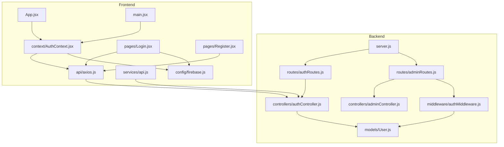
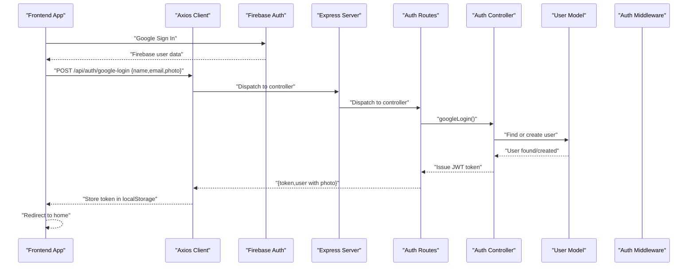
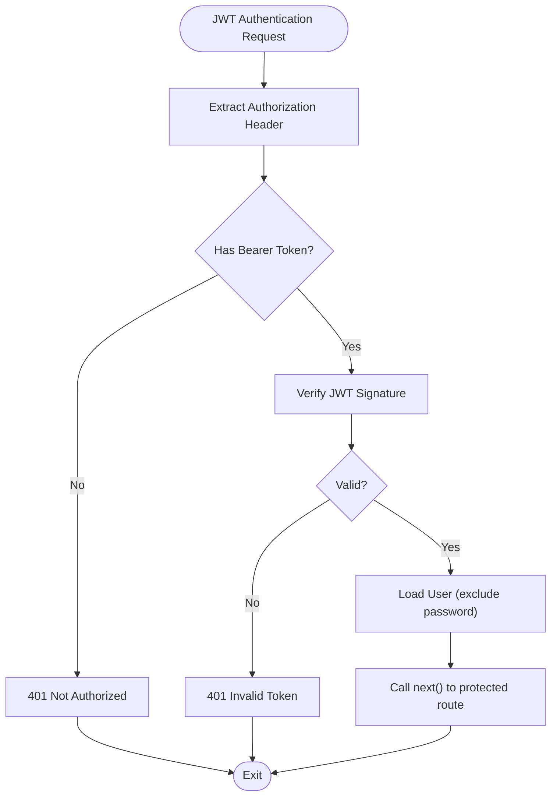
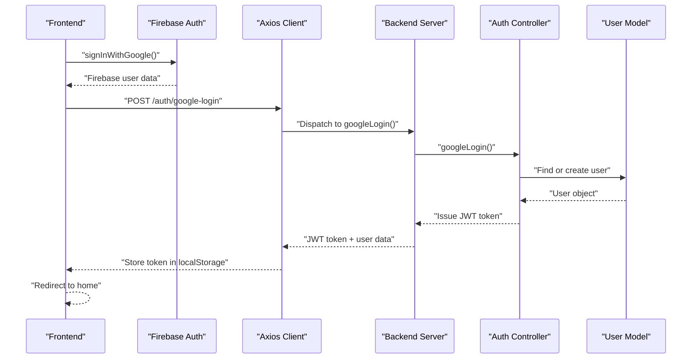
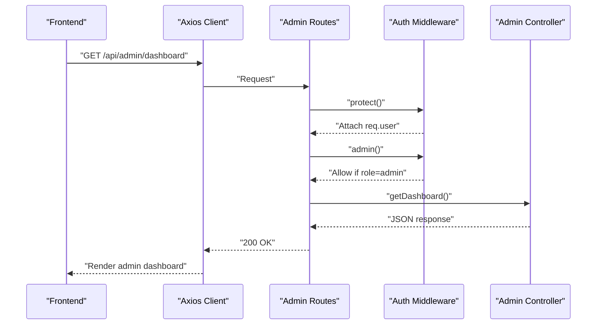
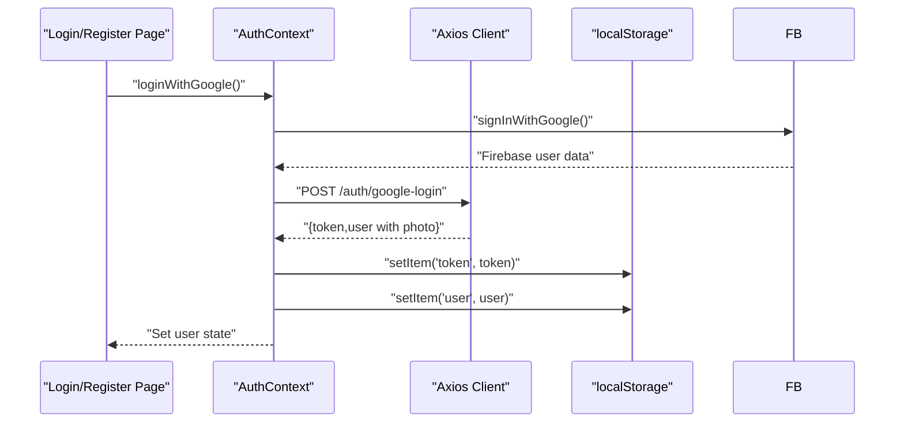
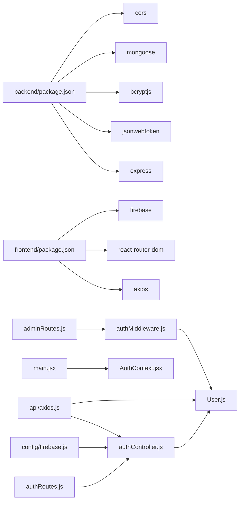

# Authentication & Authorization

<cite>
**Referenced Files in This Document**
- [server.js](file://backend/server.js)
- [authRoutes.js](file://backend/routes/authRoutes.js)
- [adminRoutes.js](file://backend/routes/adminRoutes.js)
- [authController.js](file://backend/controllers/authController.js)
- [adminController.js](file://backend/controllers/adminController.js)
- [authMiddleware.js](file://backend/middleware/authMiddleware.js)
- [User.js](file://backend/models/User.js)
- [AuthContext.jsx](file://frontend/src/context/AuthContext.jsx)
- [axios.js](file://frontend/src/api/axios.js)
- [api.js](file://frontend/src/services/api.js)
- [Login.jsx](file://frontend/src/pages/Login.jsx)
- [Register.jsx](file://frontend/src/pages/Register.jsx)
- [App.jsx](file://frontend/src/App.jsx)
- [main.jsx](file://frontend/src/main.jsx)
- [firebase.js](file://frontend/src/config/firebase.js)
- [package.json](file://backend/package.json)
- [package.json](file://frontend/package.json)
</cite>

## Update Summary
**Changes Made**
- Enhanced authentication system documentation with critical infrastructure improvements
- Updated AuthProvider wrapper implementation to ensure proper context initialization
- Fixed authentication context errors throughout the application by ensuring proper context provider setup
- Improved dual authentication system with seamless JWT and Firebase Google authentication integration

## Table of Contents
1. [Introduction](#introduction)
2. [Project Structure](#project-structure)
3. [Core Components](#core-components)
4. [Architecture Overview](#architecture-overview)
5. [Detailed Component Analysis](#detailed-component-analysis)
6. [Dependency Analysis](#dependency-analysis)
7. [Performance Considerations](#performance-considerations)
8. [Security Considerations](#security-considerations)
9. [Troubleshooting Guide](#troubleshooting-guide)
10. [Conclusion](#conclusion)

## Introduction
This document explains the E-commerce App's authentication and authorization system. It covers JWT-based login and registration, token generation and validation, middleware protection, role-based access control (RBAC) for admin routes, session-like client-side state via local storage, and CORS configuration. The system now supports dual authentication methods: traditional email/password authentication and Firebase Google authentication, providing users with flexible login options while maintaining security and seamless user experience.

**Updated** Enhanced with proper AuthProvider wrapper implementation ensuring authentication context initialization and resolution of authentication context errors throughout the application.

## Project Structure
The authentication system spans backend Express routes and controllers, MongoDB models with bcrypt hashing, and frontend React context and API interceptors. The system now includes Firebase integration for Google authentication alongside the existing JWT-based authentication flow.

**Diagram sources**
- [server.js:1-120](file://backend/server.js#L1-L120)
- [authRoutes.js:1-11](file://backend/routes/authRoutes.js#L1-L11)
- [adminRoutes.js:1-19](file://backend/routes/adminRoutes.js#L1-L19)
- [authController.js:1-111](file://backend/controllers/authController.js#L1-L111)
- [adminController.js:1-86](file://backend/controllers/adminController.js#L1-L86)
- [authMiddleware.js:1-20](file://backend/middleware/authMiddleware.js#L1-L20)
- [User.js:1-37](file://backend/models/User.js#L1-L37)
- [axios.js:1-17](file://frontend/src/api/axios.js#L1-L17)
- [api.js:1-8](file://frontend/src/services/api.js#L1-L8)
- [AuthContext.jsx:1-72](file://frontend/src/context/AuthContext.jsx#L1-L72)
- [Login.jsx:1-128](file://frontend/src/pages/Login.jsx#L1-L128)
- [Register.jsx:1-113](file://frontend/src/pages/Register.jsx#L1-L113)
- [App.jsx:1-249](file://frontend/src/App.jsx#L1-L249)
- [main.jsx:1-14](file://frontend/src/main.jsx#L1-L14)
- [firebase.js:1-86](file://frontend/src/config/firebase.js#L1-L86)

**Section sources**
- [server.js:1-120](file://backend/server.js#L1-L120)
- [authRoutes.js:1-11](file://backend/routes/authRoutes.js#L1-L11)
- [adminRoutes.js:1-19](file://backend/routes/adminRoutes.js#L1-L19)
- [authController.js:1-111](file://backend/controllers/authController.js#L1-L111)
- [adminController.js:1-86](file://backend/controllers/adminController.js#L1-L86)
- [authMiddleware.js:1-20](file://backend/middleware/authMiddleware.js#L1-L20)
- [User.js:1-37](file://backend/models/User.js#L1-L37)
- [axios.js:1-17](file://frontend/src/api/axios.js#L1-L17)
- [api.js:1-8](file://frontend/src/services/api.js#L1-L8)
- [AuthContext.jsx:1-72](file://frontend/src/context/AuthContext.jsx#L1-L72)
- [Login.jsx:1-128](file://frontend/src/pages/Login.jsx#L1-L128)
- [Register.jsx:1-113](file://frontend/src/pages/Register.jsx#L1-L113)
- [App.jsx:1-249](file://frontend/src/App.jsx#L1-L249)
- [main.jsx:1-14](file://frontend/src/main.jsx#L1-L14)
- [firebase.js:1-86](file://frontend/src/config/firebase.js#L1-L86)

## Core Components
- Backend JWT and routes:
  - Token signing with a secret and 7-day expiry.
  - Registration, login, and Google login endpoints.
  - Protected routes with middleware chain: authentication verification followed by admin role check.
- Backend model and password hashing:
  - Mongoose User schema with role enum, photo field for profile images, and bcrypt hashing on save.
  - Password comparison helper method.
- Frontend authentication state and HTTP:
  - React context provider managing user state and login/logout functions including Google authentication.
  - Axios interceptors attaching Authorization header and handling 401 responses.
  - Pages for login and registration with dual authentication options.
- Firebase Integration:
  - Google OAuth authentication with Firebase.
  - Seamless user synchronization between Firebase and backend JWT tokens.
- **Updated** Proper AuthProvider wrapper ensures authentication context initialization and resolves context errors throughout the application.

**Section sources**
- [authController.js:1-111](file://backend/controllers/authController.js#L1-L111)
- [authRoutes.js:1-11](file://backend/routes/authRoutes.js#L1-L11)
- [adminRoutes.js:1-19](file://backend/routes/adminRoutes.js#L1-L19)
- [authMiddleware.js:1-20](file://backend/middleware/authMiddleware.js#L1-L20)
- [User.js:1-37](file://backend/models/User.js#L1-L37)
- [AuthContext.jsx:1-72](file://frontend/src/context/AuthContext.jsx#L1-L72)
- [axios.js:1-17](file://frontend/src/api/axios.js#L1-L17)
- [api.js:1-8](file://frontend/src/services/api.js#L1-L8)
- [Login.jsx:1-128](file://frontend/src/pages/Login.jsx#L1-L128)
- [Register.jsx:1-113](file://frontend/src/pages/Register.jsx#L1-L113)
- [firebase.js:1-86](file://frontend/src/config/firebase.js#L1-L86)
- [main.jsx:1-14](file://frontend/src/main.jsx#L1-L14)

## Architecture Overview
End-to-end authentication flow from frontend to backend and middleware enforcement, including the new Google authentication integration.

**Diagram sources**
- [Login.jsx:30-42](file://frontend/src/pages/Login.jsx#L30-L42)
- [AuthContext.jsx:26-46](file://frontend/src/context/AuthContext.jsx#L26-L46)
- [firebase.js:20-36](file://frontend/src/config/firebase.js#L20-L36)
- [authRoutes.js:8](file://backend/routes/authRoutes.js#L8)
- [authController.js:62-111](file://backend/controllers/authController.js#L62-L111)
- [User.js:21](file://backend/models/User.js#L21)

## Detailed Component Analysis

### Dual Authentication System
The system now supports two primary authentication methods: traditional JWT-based authentication and Firebase Google authentication, providing users with flexible login options while maintaining security and seamless user experience.

#### JWT-Based Authentication Flow
- Token generation:
  - Controller signs a JWT with a server secret and 7-day expiry.
- Token validation:
  - Middleware extracts Bearer token from Authorization header, verifies signature, loads user without password, and attaches to request.
- Login and registration:
  - Registration checks for existing email and creates user with hashed password.
  - Login finds user, compares password, and returns token and user payload.

**Diagram sources**
- [authMiddleware.js:4-15](file://backend/middleware/authMiddleware.js#L4-L15)

#### Firebase Google Authentication Flow
- Google OAuth integration:
  - Frontend initiates Google sign-in via Firebase.
  - Firebase handles OAuth flow and returns user data.
  - Frontend sends Firebase user data to backend `/auth/google-login` endpoint.
  - Backend synchronizes user data and issues JWT token.
- User synchronization:
  - Creates new users with random passwords if they don't exist in database.
  - Updates existing users with Google profile photos.
  - Maintains consistent user data across Firebase and backend systems.

**Diagram sources**
- [AuthContext.jsx:26-46](file://frontend/src/context/AuthContext.jsx#L26-L46)
- [firebase.js:20-36](file://frontend/src/config/firebase.js#L20-L36)
- [authController.js:62-111](file://backend/controllers/authController.js#L62-L111)
- [User.js:21](file://backend/models/User.js#L21)

**Section sources**
- [authController.js:62-111](file://backend/controllers/authController.js#L62-L111)
- [authRoutes.js:8](file://backend/routes/authRoutes.js#L8)
- [authMiddleware.js:4-15](file://backend/middleware/authMiddleware.js#L4-L15)
- [User.js:21](file://backend/models/User.js#L21)
- [AuthContext.jsx:26-46](file://frontend/src/context/AuthContext.jsx#L26-L46)
- [firebase.js:20-36](file://frontend/src/config/firebase.js#L20-L36)

### Role-Based Access Control (RBAC)
- Admin routes apply a middleware chain:
  - First, authentication middleware ensures a valid token and sets user.
  - Second, admin middleware enforces role == 'admin'.
- Admin dashboard endpoints:
  - Dashboard aggregates counts and revenue.
  - Orders listing and status update.

**Diagram sources**
- [adminRoutes.js:7-8](file://backend/routes/adminRoutes.js#L7-L8)
- [authMiddleware.js:17-20](file://backend/middleware/authMiddleware.js#L17-L20)
- [adminController.js:5-14](file://backend/controllers/adminController.js#L5-L14)

**Section sources**
- [adminRoutes.js:1-19](file://backend/routes/adminRoutes.js#L1-L19)
- [authMiddleware.js:17-20](file://backend/middleware/authMiddleware.js#L17-L20)
- [adminController.js:1-86](file://backend/controllers/adminController.js#L1-L86)

### Frontend Authentication Handling
- Context provider:
  - Initializes user from localStorage on mount.
  - Provides login, logout, and Google authentication functions that persist token and user.
  - Handles both traditional JWT login and Firebase Google login seamlessly.
- Axios interceptors:
  - Automatically attach Authorization header for outgoing requests.
  - On 401, remove token from localStorage.
- Pages:
  - Login and Register submit credentials and persist tokens on success.
  - Login page redesigned with Google button for social authentication.

**Diagram sources**
- [Login.jsx:30-42](file://frontend/src/pages/Login.jsx#L30-L42)
- [AuthContext.jsx:26-46](file://frontend/src/context/AuthContext.jsx#L26-L46)
- [firebase.js:20-36](file://frontend/src/config/firebase.js#L20-L36)
- [axios.js:4-8](file://frontend/src/api/axios.js#L4-L8)

**Section sources**
- [AuthContext.jsx:1-72](file://frontend/src/context/AuthContext.jsx#L1-L72)
- [axios.js:1-17](file://frontend/src/api/axios.js#L1-L17)
- [api.js:1-8](file://frontend/src/services/api.js#L1-L8)
- [Login.jsx:1-128](file://frontend/src/pages/Login.jsx#L1-L128)
- [Register.jsx:1-113](file://frontend/src/pages/Register.jsx#L1-L113)

### Protected Route Implementation
- Admin routes are guarded by a middleware chain applied globally on the router.
- Any route under /api/admin requires both a valid JWT and admin role.
- Both JWT and Google-authenticated users can access protected routes after successful authentication.

**Section sources**
- [adminRoutes.js:7-8](file://backend/routes/adminRoutes.js#L7-L8)

### Context Provider State Management
- The AuthContext initializes state from localStorage and exposes login/logout functions.
- Enhanced with Google authentication support for seamless user experience.
- The App renders routes including admin and auth pages with dual authentication support.
- **Updated** Proper AuthProvider wrapper in main.jsx ensures authentication context initialization and resolves context errors throughout the application.

**Section sources**
- [AuthContext.jsx:6-72](file://frontend/src/context/AuthContext.jsx#L6-L72)
- [App.jsx:48-57](file://frontend/src/App.jsx#L48-L57)
- [main.jsx:7-12](file://frontend/src/main.jsx#L7-L12)

## Dependency Analysis
- Backend runtime dependencies include Express, jsonwebtoken, bcryptjs, mongoose, and cors.
- Frontend depends on axios, react-router-dom, and firebase for Google authentication.
- Inter-module dependencies:
  - Routes depend on controllers.
  - Controllers depend on the User model.
  - Admin routes depend on auth middleware.
  - Frontend axios interceptors depend on localStorage token.
  - Frontend AuthContext depends on Firebase configuration for Google authentication.

**Diagram sources**
- [package.json:8-28](file://backend/package.json#L8-L28)
- [package.json:8-27](file://frontend/package.json#L8-L27)
- [authRoutes.js:1-11](file://backend/routes/authRoutes.js#L1-L11)
- [adminRoutes.js:1-19](file://backend/routes/adminRoutes.js#L1-L19)
- [authController.js:1-111](file://backend/controllers/authController.js#L1-L111)
- [authMiddleware.js:1-20](file://backend/middleware/authMiddleware.js#L1-L20)
- [User.js:1-37](file://backend/models/User.js#L1-L37)
- [axios.js:1-17](file://frontend/src/api/axios.js#L1-L17)
- [firebase.js:1-86](file://frontend/src/config/firebase.js#L1-L86)
- [main.jsx:5](file://frontend/src/main.jsx#L5)

**Section sources**
- [package.json:8-28](file://backend/package.json#L8-L28)
- [package.json:8-27](file://frontend/package.json#L8-L27)

## Performance Considerations
- Token lifetime: 7-day expiry balances convenience and risk; consider short-lived access tokens with a separate refresh mechanism for higher security.
- Password hashing cost: bcrypt cost of 10 is reasonable; monitor CPU usage and adjust as needed.
- Middleware overhead: Keep token verification lightweight; avoid heavy operations in middleware.
- Frontend caching: Persist minimal user info in localStorage; fetch fresh data on demand.
- Firebase authentication: Google OAuth adds minimal overhead as it's handled by Firebase services.
- User synchronization: Database operations for Google login are optimized to minimize latency.

## Security Considerations
- CORS configuration:
  - Origins are whitelisted with credentials support and preflight caching.
  - Ensure FRONTEND_URL matches deployed frontend origin.
- Token storage:
  - Store JWT in httpOnly cookies for production to mitigate XSS; current localStorage approach is acceptable for development but risky in production.
- CSRF protection:
  - Not currently implemented; consider SameSite cookies, anti-CSRF tokens, or CSRF middleware for production.
- Secrets and environment:
  - JWT_SECRET must be strong and rotated periodically.
  - Firebase configuration is included in the frontend bundle; consider environment-specific configurations.
- Error handling:
  - Avoid leaking sensitive data; return generic messages and log internally.
- Google authentication security:
  - Firebase handles OAuth security; ensure proper Firebase project configuration.
  - User data synchronization maintains privacy and security standards.

**Section sources**
- [server.js:25-64](file://backend/server.js#L25-L64)
- [AuthContext.jsx:18-27](file://frontend/src/context/AuthContext.jsx#L18-L27)
- [axios.js:13-15](file://frontend/src/api/axios.js#L13-L15)
- [firebase.js:4-13](file://frontend/src/config/firebase.js#L4-L13)

## Troubleshooting Guide
- 401 Not Authorized:
  - Missing or malformed Authorization header; ensure frontend sends Bearer token.
- 401 Invalid token:
  - Expired or tampered token; re-authenticate.
- 403 Access denied:
  - Non-admin user attempting admin route; verify role.
- 400 Email exists:
  - Duplicate registration; prompt user to log in.
- 401 Invalid credentials:
  - Incorrect email/password; prompt retry.
- CORS errors:
  - Origin not whitelisted; verify FRONTEND_URL and allowed origins.
- Google login failures:
  - Firebase authentication errors; check Firebase configuration and network connectivity.
  - Google OAuth popup blocked; ensure popup blockers are disabled.
  - User synchronization issues; verify database connection and user creation logic.
- User photo not updating:
  - Photo URL not provided by Google; user profile may not have a photo.
  - Database update errors; check MongoDB connection and user model validation.
- **Updated** Authentication context errors:
  - Ensure AuthProvider wrapper is properly implemented in main.jsx.
  - Verify AuthContext initialization from localStorage on component mount.
  - Check that all components requiring authentication are wrapped within AuthProvider.

**Section sources**
- [authMiddleware.js:5-14](file://backend/middleware/authMiddleware.js#L5-L14)
- [authController.js:9-10](file://backend/controllers/authController.js#L9-L10)
- [authController.js:22](file://backend/controllers/authController.js#L22)
- [server.js:32-64](file://backend/server.js#L32-L64)
- [AuthContext.jsx:42-45](file://frontend/src/context/AuthContext.jsx#L42-L45)
- [firebase.js:32-35](file://frontend/src/config/firebase.js#L32-L35)
- [main.jsx:7-12](file://frontend/src/main.jsx#L7-L12)

## Conclusion
The system implements a comprehensive authentication solution with dual authentication methods: JWT-based authentication for traditional email/password login and Firebase Google authentication for social login. The system maintains clean JWT-based flows with bcrypt password hashing and RBAC for admin routes while seamlessly integrating Google OAuth through Firebase. The frontend integrates seamlessly with both authentication methods through a unified AuthContext provider.

**Updated** The critical infrastructure improvement involves proper AuthProvider wrapper implementation that ensures authentication context initialization and resolves authentication context errors throughout the application. This enhancement guarantees reliable authentication state management across all application components.

For production, prioritize secure token storage (cookies), CSRF protection, strict secrets management, robust input validation, and proper Firebase configuration management.