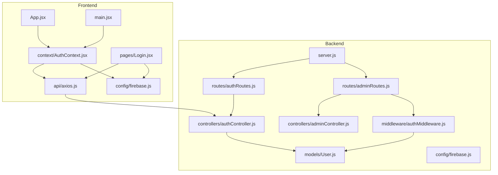
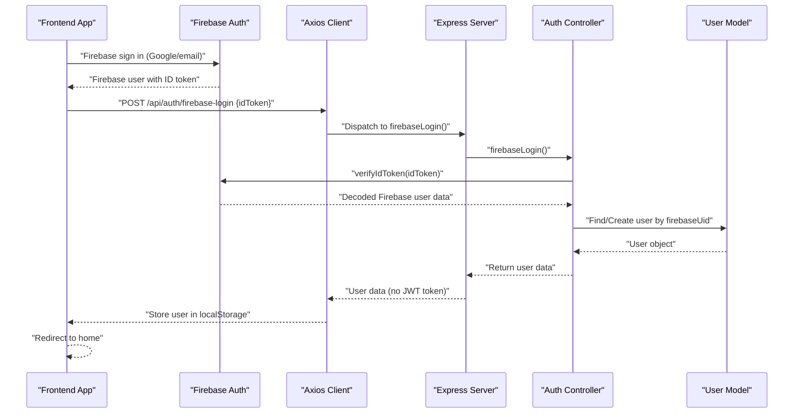
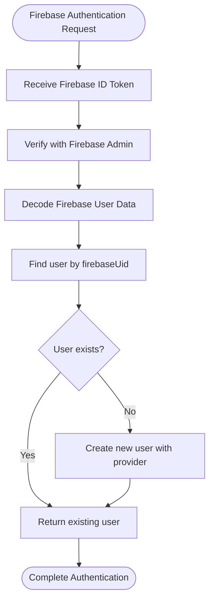
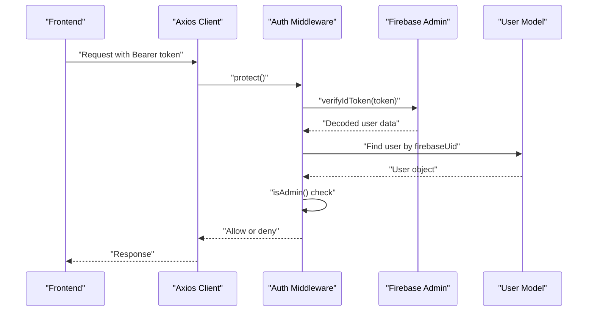
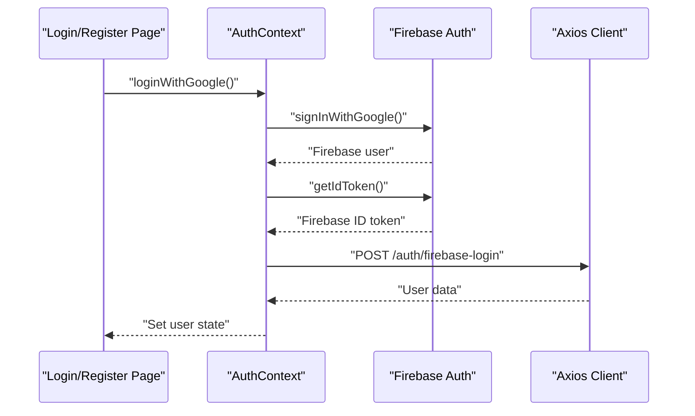
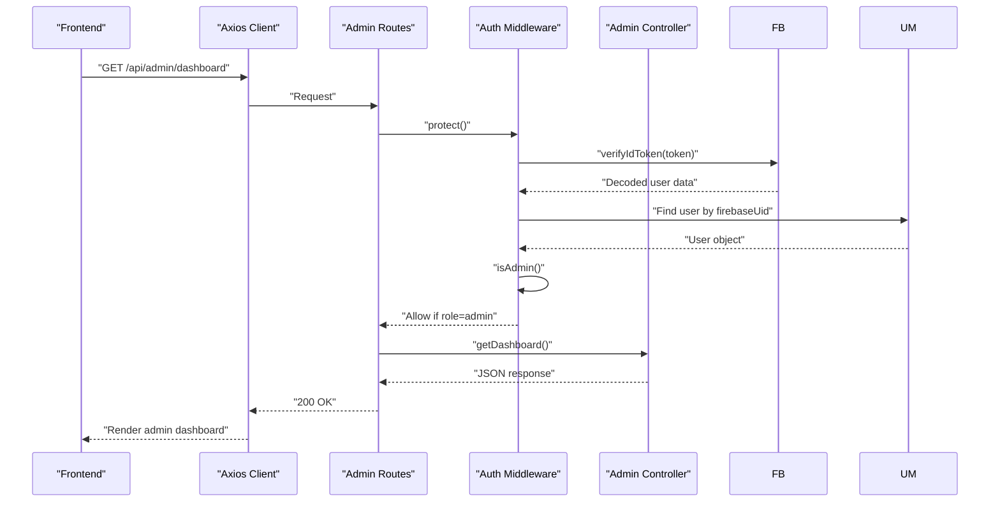
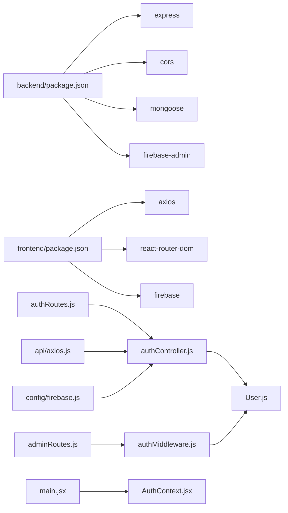

# Authentication & Authorization

<cite>
**Referenced Files in This Document**
- [server.js](file://backend/server.js)
- [authRoutes.js](file://backend/routes/authRoutes.js)
- [adminRoutes.js](file://backend/routes/adminRoutes.js)
- [authController.js](file://backend/controllers/authController.js)
- [adminController.js](file://backend/controllers/adminController.js)
- [authMiddleware.js](file://backend/middleware/authMiddleware.js)
- [User.js](file://backend/models/User.js)
- [AuthContext.jsx](file://frontend/src/context/AuthContext.jsx)
- [axios.js](file://frontend/src/api/axios.js)
- [firebase.js](file://frontend/src/config/firebase.js)
- [Login.jsx](file://frontend/src/pages/Login.jsx)
- [App.jsx](file://frontend/src/App.jsx)
- [main.jsx](file://frontend/src/main.jsx)
- [package.json](file://backend/package.json)
- [package.json](file://frontend/package.json)
</cite>

## Update Summary
**Changes Made**
- Complete migration to Firebase-only authentication system
- Elimination of JWT-based authentication flows and middleware
- Removal of bcrypt password hashing and traditional authentication routes
- Firebase Authentication with provider-based user management
- Updated frontend authentication context to work exclusively with Firebase
- Simplified backend authentication flow using Firebase ID tokens

## Table of Contents
1. [Introduction](#introduction)
2. [Project Structure](#project-structure)
3. [Core Components](#core-components)
4. [Architecture Overview](#architecture-overview)
5. [Detailed Component Analysis](#detailed-component-analysis)
6. [Dependency Analysis](#dependency-analysis)
7. [Performance Considerations](#performance-considerations)
8. [Security Considerations](#security-considerations)
9. [Troubleshooting Guide](#troubleshooting-guide)
10. [Conclusion](#conclusion)

## Introduction
This document explains the E-commerce App's authentication and authorization system with Firebase-only authentication. The system has been completely migrated from JWT-based authentication to Firebase Authentication, eliminating bcrypt password hashing, JWT middleware, and traditional authentication routes. The new system focuses solely on Firebase Authentication with provider-based user management, supporting both email/password and Google authentication methods through Firebase services.

**Updated** Complete migration to Firebase-only authentication system with simplified architecture and enhanced security through Firebase's built-in authentication mechanisms.

## Project Structure
The authentication system now consists entirely of Firebase-based components spanning backend Express routes and controllers, MongoDB models with provider tracking, and frontend React context and Firebase integration. The system eliminates all JWT dependencies and focuses on seamless Firebase Authentication integration.

**Diagram sources**
- [server.js:1-120](file://backend/server.js#L1-L120)
- [authRoutes.js:1-9](file://backend/routes/authRoutes.js#L1-L9)
- [adminRoutes.js:1-19](file://backend/routes/adminRoutes.js#L1-L19)
- [authController.js:1-69](file://backend/controllers/authController.js#L1-L69)
- [adminController.js:1-86](file://backend/controllers/adminController.js#L1-L86)
- [authMiddleware.js:1-33](file://backend/middleware/authMiddleware.js#L1-L33)
- [User.js:1-30](file://backend/models/User.js#L1-L30)
- [AuthContext.jsx:1-86](file://frontend/src/context/AuthContext.jsx#L1-L86)
- [axios.js:1-29](file://frontend/src/api/axios.js#L1-L29)
- [firebase.js:1-67](file://frontend/src/config/firebase.js#L1-L67)
- [Login.jsx:1-133](file://frontend/src/pages/Login.jsx#L1-L133)
- [App.jsx:1-248](file://frontend/src/App.jsx#L1-L248)
- [main.jsx:1-14](file://frontend/src/main.jsx#L1-L14)

**Section sources**
- [server.js:1-120](file://backend/server.js#L1-L120)
- [authRoutes.js:1-9](file://backend/routes/authRoutes.js#L1-L9)
- [adminRoutes.js:1-19](file://backend/routes/adminRoutes.js#L1-L19)
- [authController.js:1-69](file://backend/controllers/authController.js#L1-L69)
- [adminController.js:1-86](file://backend/controllers/adminController.js#L1-L86)
- [authMiddleware.js:1-33](file://backend/middleware/authMiddleware.js#L1-L33)
- [User.js:1-30](file://backend/models/User.js#L1-L30)
- [AuthContext.jsx:1-86](file://frontend/src/context/AuthContext.jsx#L1-L86)
- [axios.js:1-29](file://frontend/src/api/axios.js#L1-L29)
- [firebase.js:1-67](file://frontend/src/config/firebase.js#L1-L67)
- [Login.jsx:1-133](file://frontend/src/pages/Login.jsx#L1-L133)
- [App.jsx:1-248](file://frontend/src/App.jsx#L1-L248)
- [main.jsx:1-14](file://frontend/src/main.jsx#L1-L14)

## Core Components
- **Firebase Authentication Backend**:
  - Single `/api/auth/firebase-login` endpoint for Firebase ID token verification
  - User synchronization between Firebase and MongoDB using `firebaseUid`
  - Provider tracking (google/email) and automatic user creation
  - No JWT token generation or validation in backend
- **Firebase Authentication Frontend**:
  - React context provider managing Firebase authentication state
  - Seamless integration with Firebase Auth for Google and email/password login
  - Automatic backend user synchronization on Firebase auth state changes
  - Request interceptor automatically attaches Firebase ID tokens to outgoing requests
- **Role-Based Access Control**:
  - Admin routes protected by Firebase-based middleware chain
  - Admin role enforcement using Firebase-decoded user data
  - Simplified middleware using Firebase authentication instead of JWT verification
- **Enhanced User Model**:
  - Provider field tracks authentication method (google/email)
  - Firebase UID field for seamless Firebase-MongoDB integration
  - Password field optional for Firebase-managed accounts

**Section sources**
- [authController.js:5-69](file://backend/controllers/authController.js#L5-L69)
- [authRoutes.js:6](file://backend/routes/authRoutes.js#L6)
- [authMiddleware.js:4-33](file://backend/middleware/authMiddleware.js#L4-L33)
- [User.js:25-26](file://backend/models/User.js#L25-L26)
- [AuthContext.jsx:8-86](file://frontend/src/context/AuthContext.jsx#L8-L86)
- [axios.js:8-29](file://frontend/src/api/axios.js#L8-L29)
- [firebase.js:21-63](file://frontend/src/config/firebase.js#L21-L63)

## Architecture Overview
End-to-end Firebase-only authentication flow from frontend to backend, eliminating all JWT dependencies and leveraging Firebase's built-in authentication mechanisms.

**Diagram sources**
- [AuthContext.jsx:13-29](file://frontend/src/context/AuthContext.jsx#L13-L29)
- [firebase.js:21-63](file://frontend/src/config/firebase.js#L21-L63)
- [authController.js:5-69](file://backend/controllers/authController.js#L5-L69)
- [User.js:21](file://backend/models/User.js#L21)

## Detailed Component Analysis

### Firebase-Only Authentication System
The system now operates entirely on Firebase Authentication with no JWT dependencies. Users authenticate through Firebase services and are synchronized with the backend MongoDB user collection.

#### Firebase Authentication Flow
- **Frontend Authentication**:
  - Firebase handles all authentication flows (Google OAuth, email/password)
  - Frontend listens for Firebase auth state changes using `onAuthStateChanged`
  - Automatic user synchronization when Firebase auth state changes
- **Backend Synchronization**:
  - Single endpoint `/api/auth/firebase-login` receives Firebase ID token
  - Backend verifies token with Firebase Admin SDK
  - User lookup/creation based on `firebaseUid` field
  - Provider detection (google vs email) for user management

**Diagram sources**
- [authController.js:13-44](file://backend/controllers/authController.js#L13-L44)

#### Firebase-Based Middleware Protection
- **Protected Route Flow**:
  - Frontend automatically attaches Firebase ID tokens to all requests
  - Backend middleware extracts Bearer token from Authorization header
  - Firebase Admin SDK verifies token and decodes user data
  - User lookup by `firebaseUid` and role validation
- **Admin Access Control**:
  - Dual middleware chain: `protect` then `isAdmin`
  - Role-based access control using MongoDB user roles
  - Firebase token verification replaces JWT signature verification

**Diagram sources**
- [authMiddleware.js:13-32](file://backend/middleware/authMiddleware.js#L13-L32)

**Section sources**
- [authController.js:5-69](file://backend/controllers/authController.js#L5-L69)
- [authRoutes.js:6](file://backend/routes/authRoutes.js#L6)
- [authMiddleware.js:4-33](file://backend/middleware/authMiddleware.js#L4-L33)
- [User.js:25-26](file://backend/models/User.js#L25-L26)
- [AuthContext.jsx:13-29](file://frontend/src/context/AuthContext.jsx#L13-L29)
- [axios.js:8-16](file://frontend/src/api/axios.js#L8-L16)

### Enhanced Frontend Authentication Handling
- **Firebase-First Context Provider**:
  - Initializes from Firebase auth state instead of localStorage
  - Automatic user synchronization on Firebase auth changes
  - Supports both Google and email/password authentication seamlessly
  - Simplified login/logout functions using Firebase services
- **Request Interceptor**:
  - Automatically obtains fresh Firebase ID tokens before each request
  - Handles 401 responses by clearing user state
  - Eliminates manual token management and JWT handling
- **Authentication Pages**:
  - Login page supports both Google and email/password login
  - Registration uses Firebase email/password signup
  - Google login uses Firebase popup authentication

**Diagram sources**
- [AuthContext.jsx:63-66](file://frontend/src/context/AuthContext.jsx#L63-L66)
- [firebase.js:21-29](file://frontend/src/config/firebase.js#L21-L29)
- [axios.js:9-16](file://frontend/src/api/axios.js#L9-L16)

**Section sources**
- [AuthContext.jsx:8-86](file://frontend/src/context/AuthContext.jsx#L8-L86)
- [axios.js:1-29](file://frontend/src/api/axios.js#L1-L29)
- [firebase.js:21-63](file://frontend/src/config/firebase.js#L21-L63)
- [Login.jsx:30-47](file://frontend/src/pages/Login.jsx#L30-L47)

### Role-Based Access Control (RBAC)
- **Firebase-Based Admin Protection**:
  - Admin routes apply middleware chain: `protect` then `isAdmin`
  - `protect` middleware verifies Firebase ID token and loads user by `firebaseUid`
  - `isAdmin` middleware checks user role in MongoDB
  - Simplified admin logic using Firebase-decoded user data
- **Admin Dashboard Endpoints**:
  - Dashboard aggregation using Firebase-authenticated admin context
  - User management with Firebase-based authentication
  - Order management with admin role validation

**Diagram sources**
- [adminRoutes.js:8](file://backend/routes/adminRoutes.js#L8)
- [authMiddleware.js:26-32](file://backend/middleware/authMiddleware.js#L26-L32)
- [adminController.js:5-14](file://backend/controllers/adminController.js#L5-L14)

**Section sources**
- [adminRoutes.js:1-19](file://backend/routes/adminRoutes.js#L1-L19)
- [authMiddleware.js:26-32](file://backend/middleware/authMiddleware.js#L26-L32)
- [adminController.js:1-86](file://backend/controllers/adminController.js#L1-L86)

### Protected Route Implementation
- **Firebase-Based Protection**:
  - Admin routes protected by Firebase middleware chain
  - Token verification using Firebase Admin SDK instead of JWT
  - User loading by `firebaseUid` instead of JWT-subject lookup
  - Both Google and email-authenticated users can access protected routes
- **Simplified Token Management**:
  - Frontend automatically manages Firebase ID tokens
  - Backend verifies tokens with Firebase Admin SDK
  - No manual token refresh or expiration handling required

**Section sources**
- [adminRoutes.js:8](file://backend/routes/adminRoutes.js#L8)

### Context Provider State Management
- **Firebase-First Initialization**:
  - Context restores user from localStorage cache immediately
  - Listens for Firebase auth state changes using `onAuthStateChanged`
  - Automatic user synchronization when Firebase auth state changes
  - Supports both Google and email/password authentication methods
- **Enhanced Error Handling**:
  - Firebase authentication errors handled gracefully
  - User state cleared on Firebase auth state changes
  - Proper cleanup of Firebase listeners on component unmount

**Section sources**
- [AuthContext.jsx:31-48](file://frontend/src/context/AuthContext.jsx#L31-L48)
- [App.jsx:16](file://frontend/src/App.jsx#L16)
- [main.jsx:5-13](file://frontend/src/main.jsx#L5-L13)

## Dependency Analysis
- **Backend Dependencies**:
  - Express, cors, dotenv, mongoose (unchanged)
  - **New**: Firebase Admin SDK for authentication verification
  - **Removed**: jsonwebtoken, bcryptjs (no longer needed)
- **Frontend Dependencies**:
  - axios, react-router-dom (unchanged)
  - **New**: Firebase SDK for authentication
  - **Removed**: jwt-decode, bcrypt (no longer needed)
- **Inter-Module Dependencies**:
  - Routes depend on Firebase-based auth controller
  - Controllers depend on Firebase Admin SDK and User model
  - Admin routes depend on Firebase-based auth middleware
  - Frontend axios interceptors depend on Firebase auth state
  - Frontend AuthContext depends on Firebase configuration

**Diagram sources**
- [package.json:8-28](file://backend/package.json#L8-L28)
- [package.json:8-27](file://frontend/package.json#L8-L27)
- [authRoutes.js:1-9](file://backend/routes/authRoutes.js#L1-L9)
- [adminRoutes.js:1-19](file://backend/routes/adminRoutes.js#L1-L19)
- [authController.js:1-69](file://backend/controllers/authController.js#L1-L69)
- [authMiddleware.js:1-33](file://backend/middleware/authMiddleware.js#L1-L33)
- [User.js:1-30](file://backend/models/User.js#L1-L30)
- [axios.js:1-29](file://frontend/src/api/axios.js#L1-L29)
- [firebase.js:1-67](file://frontend/src/config/firebase.js#L1-L67)
- [main.jsx:5](file://frontend/src/main.jsx#L5)

**Section sources**
- [package.json:8-28](file://backend/package.json#L8-L28)
- [package.json:8-27](file://frontend/package.json#L8-L27)

## Performance Considerations
- **Firebase Authentication Benefits**:
  - Reduced server-side processing (no JWT signing/verification)
  - Automatic token refresh handled by Firebase SDK
  - Built-in rate limiting and security features
- **Database Operations**:
  - User lookup by `firebaseUid` is efficient with proper indexing
  - Provider field optimization for authentication method tracking
  - Minimal database round trips for authentication operations
- **Frontend Performance**:
  - Firebase SDK handles token management automatically
  - Request interceptor adds minimal overhead
  - Real-time auth state synchronization reduces redundant API calls
- **Migration Performance**:
  - Existing users automatically linked by email if Firebase UID not found
  - Provider field enables smooth transition from legacy system

## Security Considerations
- **Firebase Authentication Security**:
  - Built-in OAuth providers with Google's security standards
  - Firebase Admin SDK provides secure token verification
  - Automatic token validation and expiration handling
- **CORS Configuration**:
  - Production-ready CORS setup with Firebase-compatible origins
  - Credentials support for Firebase authentication
  - Vercel preview deployment support
- **Token Storage**:
  - Firebase ID tokens managed automatically by Firebase SDK
  - No custom token storage or JWT management required
  - Secure token handling through Firebase Auth
- **Error Handling**:
  - Firebase authentication errors handled gracefully
  - Backend token verification errors return appropriate HTTP status codes
  - User state cleared on authentication failures
- **Provider-Based Security**:
  - Provider field enables tracking of authentication method
  - Google authentication leverages Google's security infrastructure
  - Email/password authentication handled through Firebase Auth

**Section sources**
- [server.js:25-64](file://backend/server.js#L25-L64)
- [authController.js:64-67](file://backend/controllers/authController.js#L64-L67)
- [AuthContext.jsx:24-28](file://frontend/src/context/AuthContext.jsx#L24-L28)
- [axios.js:22-26](file://frontend/src/api/axios.js#L22-L26)
- [firebase.js:4-13](file://frontend/src/config/firebase.js#L4-L13)

## Troubleshooting Guide
- **Firebase Authentication Issues**:
  - Firebase ID token verification failures: Check Firebase Admin SDK configuration
  - User not found errors: Verify `firebaseUid` field synchronization
  - Authentication state not persisting: Check `onAuthStateChanged` listener setup
- **Frontend Authentication Problems**:
  - Google login popup blocked: Ensure popup blockers are disabled
  - Email/password authentication failing: Verify Firebase Auth configuration
  - Token not attaching to requests: Check Firebase auth state and axios interceptor
- **Backend Authentication Errors**:
  - 401 Not authorized: Verify Firebase ID token validity
  - 401 Invalid token: Check Firebase Admin SDK setup and token expiration
  - User synchronization failures: Verify `firebaseUid` field and user creation logic
- **CORS and Deployment Issues**:
  - Origin not whitelisted: Verify Firebase auth domain configuration
  - Vercel deployment CORS errors: Check preview deployment URL configuration
  - Production Firebase configuration: Ensure proper environment variables
- **Migration Issues**:
  - Existing users not found: Check email-based user linking logic
  - Provider field not set: Verify provider detection and user update logic
  - Authentication context errors: Ensure proper AuthProvider wrapper implementation

**Section sources**
- [authMiddleware.js:9-23](file://backend/middleware/authMiddleware.js#L9-L23)
- [authController.js:9-11](file://backend/controllers/authController.js#L9-L11)
- [AuthContext.jsx:24-28](file://frontend/src/context/AuthContext.jsx#L24-L28)
- [firebase.js:21-29](file://frontend/src/config/firebase.js#L21-L29)
- [server.js:32-64](file://backend/server.js#L32-L64)

## Conclusion
The system has been successfully migrated to a Firebase-only authentication system, eliminating all JWT dependencies and simplifying the authentication architecture. The new system leverages Firebase Authentication's built-in security features while maintaining comprehensive role-based access control through MongoDB user roles. The migration provides enhanced security through Firebase's enterprise-grade authentication infrastructure, simplified token management, and seamless provider-based user synchronization.

**Updated** The Firebase-only authentication system represents a significant architectural improvement with enhanced security, simplified token management, and seamless integration between Firebase and MongoDB. The system maintains all existing functionality while providing better performance, security, and developer experience through Firebase's comprehensive authentication platform.

For production deployment, ensure proper Firebase configuration management, monitor authentication metrics, and leverage Firebase's built-in security features for optimal performance and security.