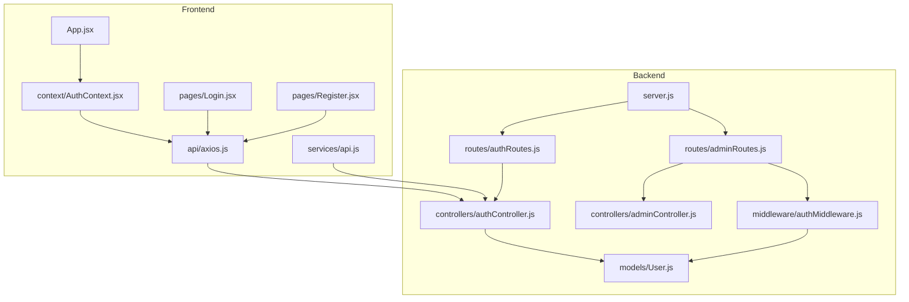
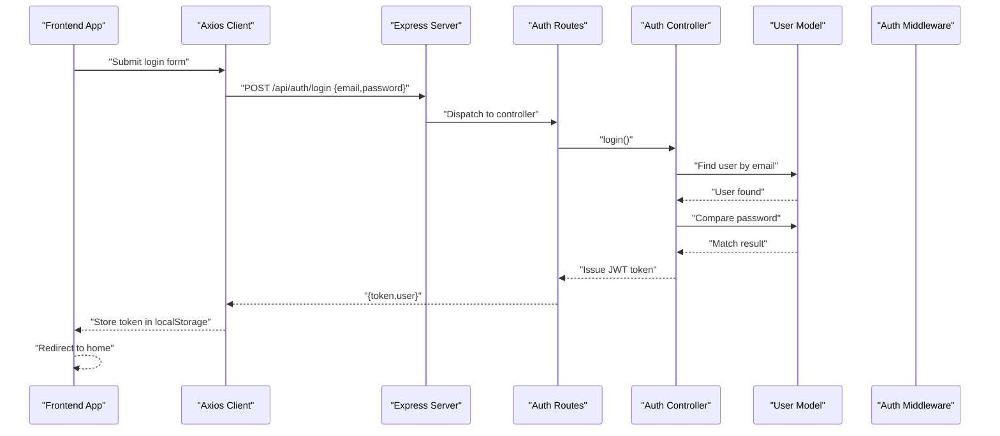
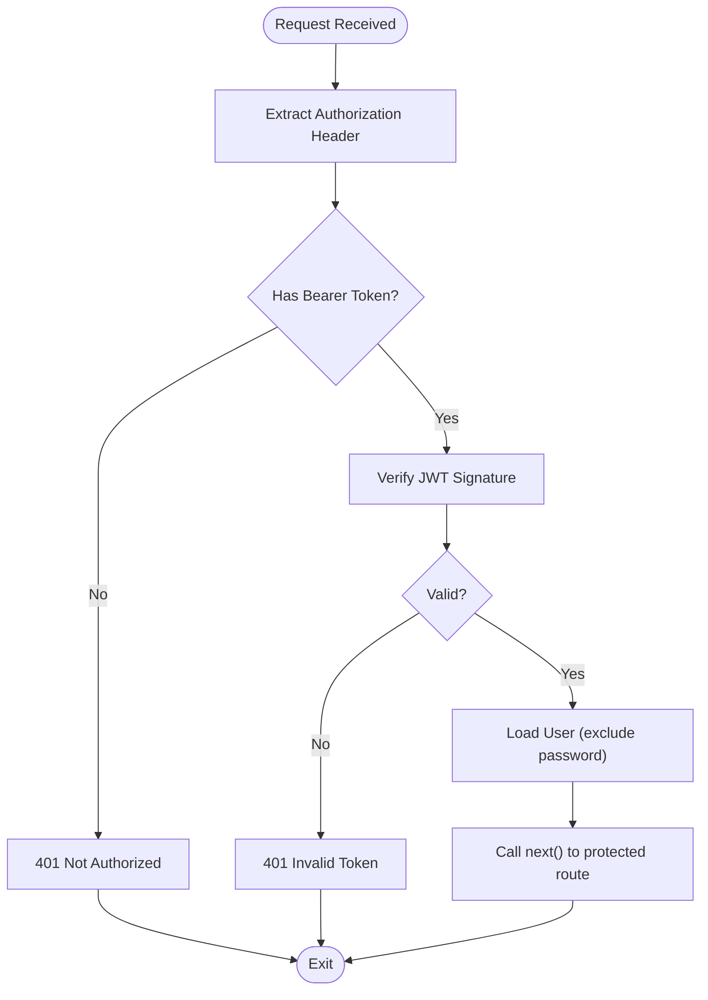
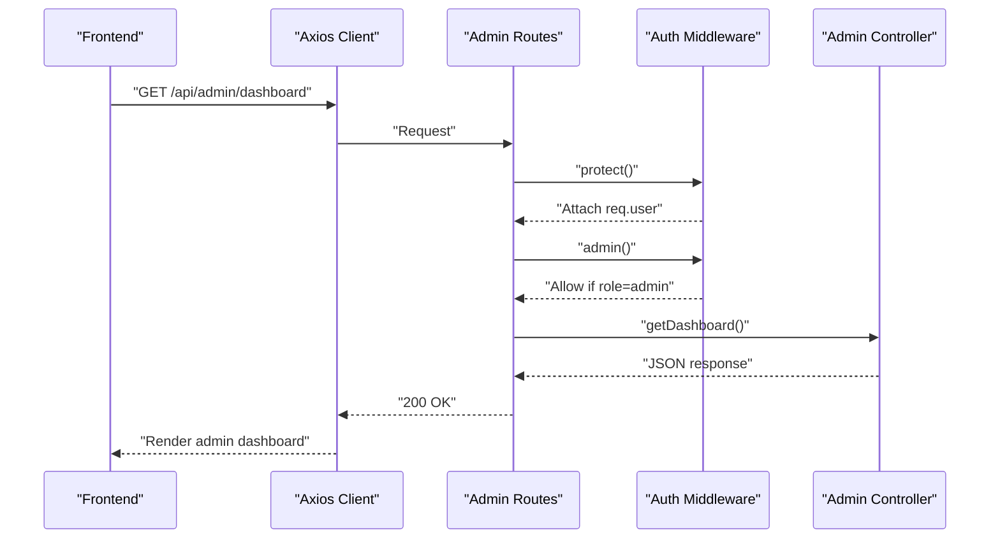
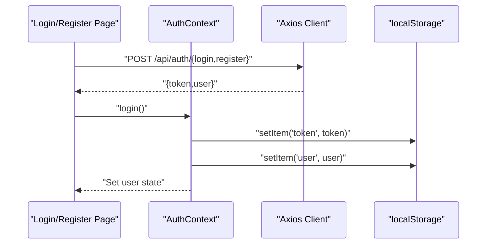
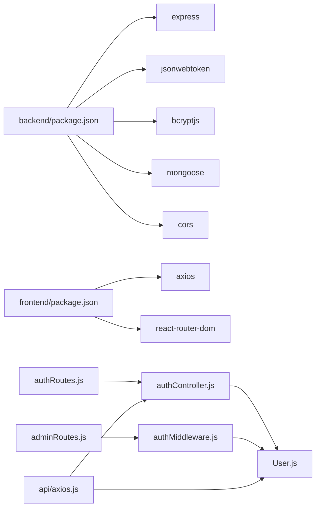

# Authentication & Authorization

<cite>
**Referenced Files in This Document**
- [server.js](file://backend/server.js)
- [authRoutes.js](file://backend/routes/authRoutes.js)
- [adminRoutes.js](file://backend/routes/adminRoutes.js)
- [authController.js](file://backend/controllers/authController.js)
- [adminController.js](file://backend/controllers/adminController.js)
- [authMiddleware.js](file://backend/middleware/authMiddleware.js)
- [User.js](file://backend/models/User.js)
- [AuthContext.jsx](file://frontend/src/context/AuthContext.jsx)
- [axios.js](file://frontend/src/api/axios.js)
- [api.js](file://frontend/src/services/api.js)
- [Login.jsx](file://frontend/src/pages/Login.jsx)
- [Register.jsx](file://frontend/src/pages/Register.jsx)
- [App.jsx](file://frontend/src/App.jsx)
- [main.jsx](file://frontend/src/main.jsx)
- [package.json](file://backend/package.json)
- [package.json](file://frontend/package.json)
</cite>

## Table of Contents
1. [Introduction](#introduction)
2. [Project Structure](#project-structure)
3. [Core Components](#core-components)
4. [Architecture Overview](#architecture-overview)
5. [Detailed Component Analysis](#detailed-component-analysis)
6. [Dependency Analysis](#dependency-analysis)
7. [Performance Considerations](#performance-considerations)
8. [Security Considerations](#security-considerations)
9. [Troubleshooting Guide](#troubleshooting-guide)
10. [Conclusion](#conclusion)

## Introduction
This document explains the E-commerce App’s authentication and authorization system. It covers JWT-based login and registration, token generation and validation, middleware protection, role-based access control (RBAC) for admin routes, session-like client-side state via local storage, and CORS configuration. It also provides practical examples, error handling guidance, and production security best practices.

## Project Structure
The authentication system spans backend Express routes and controllers, MongoDB models with bcrypt hashing, and frontend React context and API interceptors.

**Diagram sources**
- [server.js:1-85](file://backend/server.js#L1-L85)
- [authRoutes.js:1-9](file://backend/routes/authRoutes.js#L1-L9)
- [adminRoutes.js:1-14](file://backend/routes/adminRoutes.js#L1-L14)
- [authController.js:1-27](file://backend/controllers/authController.js#L1-L27)
- [adminController.js:1-24](file://backend/controllers/adminController.js#L1-L24)
- [authMiddleware.js:1-20](file://backend/middleware/authMiddleware.js#L1-L20)
- [User.js:1-20](file://backend/models/User.js#L1-L20)
- [axios.js:1-17](file://frontend/src/api/axios.js#L1-L17)
- [api.js:1-8](file://frontend/src/services/api.js#L1-L8)
- [AuthContext.jsx:1-33](file://frontend/src/context/AuthContext.jsx#L1-L33)
- [Login.jsx:1-56](file://frontend/src/pages/Login.jsx#L1-L56)
- [Register.jsx:1-67](file://frontend/src/pages/Register.jsx#L1-L67)
- [App.jsx:1-66](file://frontend/src/App.jsx#L1-L66)

**Section sources**
- [server.js:1-85](file://backend/server.js#L1-L85)
- [authRoutes.js:1-9](file://backend/routes/authRoutes.js#L1-L9)
- [adminRoutes.js:1-14](file://backend/routes/adminRoutes.js#L1-L14)
- [authController.js:1-27](file://backend/controllers/authController.js#L1-L27)
- [adminController.js:1-24](file://backend/controllers/adminController.js#L1-L24)
- [authMiddleware.js:1-20](file://backend/middleware/authMiddleware.js#L1-L20)
- [User.js:1-20](file://backend/models/User.js#L1-L20)
- [axios.js:1-17](file://frontend/src/api/axios.js#L1-L17)
- [api.js:1-8](file://frontend/src/services/api.js#L1-L8)
- [AuthContext.jsx:1-33](file://frontend/src/context/AuthContext.jsx#L1-L33)
- [Login.jsx:1-56](file://frontend/src/pages/Login.jsx#L1-L56)
- [Register.jsx:1-67](file://frontend/src/pages/Register.jsx#L1-L67)
- [App.jsx:1-66](file://frontend/src/App.jsx#L1-L66)

## Core Components
- Backend JWT and routes:
  - Token signing with a secret and 7-day expiry.
  - Registration and login endpoints.
  - Protected routes with middleware chain: authentication verification followed by admin role check.
- Backend model and password hashing:
  - Mongoose User schema with role enum and bcrypt hashing on save.
  - Password comparison helper method.
- Frontend authentication state and HTTP:
  - React context provider managing user state and login/logout.
  - Axios interceptors attaching Authorization header and handling 401.
  - Pages for login and registration.

**Section sources**
- [authController.js:1-27](file://backend/controllers/authController.js#L1-L27)
- [authRoutes.js:1-9](file://backend/routes/authRoutes.js#L1-L9)
- [adminRoutes.js:1-14](file://backend/routes/adminRoutes.js#L1-L14)
- [authMiddleware.js:1-20](file://backend/middleware/authMiddleware.js#L1-L20)
- [User.js:1-20](file://backend/models/User.js#L1-L20)
- [AuthContext.jsx:1-33](file://frontend/src/context/AuthContext.jsx#L1-L33)
- [axios.js:1-17](file://frontend/src/api/axios.js#L1-L17)
- [api.js:1-8](file://frontend/src/services/api.js#L1-L8)
- [Login.jsx:1-56](file://frontend/src/pages/Login.jsx#L1-L56)
- [Register.jsx:1-67](file://frontend/src/pages/Register.jsx#L1-L67)

## Architecture Overview
End-to-end authentication flow from frontend to backend and middleware enforcement.

**Diagram sources**
- [Login.jsx:10-21](file://frontend/src/pages/Login.jsx#L10-L21)
- [axios.js:4-8](file://frontend/src/api/axios.js#L4-L8)
- [server.js:58-63](file://backend/server.js#L58-L63)
- [authRoutes.js:6-7](file://backend/routes/authRoutes.js#L6-L7)
- [authController.js:18-27](file://backend/controllers/authController.js#L18-L27)
- [User.js:16-18](file://backend/models/User.js#L16-L18)

## Detailed Component Analysis

### JWT-Based Authentication Flow
- Token generation:
  - Controller signs a JWT with a server secret and 7-day expiry.
- Token validation:
  - Middleware extracts Bearer token from Authorization header, verifies signature, loads user without password, and attaches to request.
- Login and registration:
  - Registration checks for existing email and creates user with hashed password.
  - Login finds user, compares password, and returns token and user payload.

**Diagram sources**
- [authMiddleware.js:4-15](file://backend/middleware/authMiddleware.js#L4-L15)

**Section sources**
- [authController.js:4](file://backend/controllers/authController.js#L4)
- [authController.js:18-27](file://backend/controllers/authController.js#L18-L27)
- [authMiddleware.js:4-15](file://backend/middleware/authMiddleware.js#L4-L15)
- [User.js:16-18](file://backend/models/User.js#L16-L18)

### Role-Based Access Control (RBAC)
- Admin routes apply a middleware chain:
  - First, authentication middleware ensures a valid token and sets user.
  - Second, admin middleware enforces role == 'admin'.
- Admin dashboard endpoints:
  - Dashboard aggregates counts and revenue.
  - Orders listing and status update.

**Diagram sources**
- [adminRoutes.js:7-8](file://backend/routes/adminRoutes.js#L7-L8)
- [authMiddleware.js:17-20](file://backend/middleware/authMiddleware.js#L17-L20)
- [adminController.js:5-14](file://backend/controllers/adminController.js#L5-L14)

**Section sources**
- [adminRoutes.js:1-14](file://backend/routes/adminRoutes.js#L1-L14)
- [authMiddleware.js:17-20](file://backend/middleware/authMiddleware.js#L17-L20)
- [adminController.js:1-24](file://backend/controllers/adminController.js#L1-L24)

### Frontend Authentication Handling
- Context provider:
  - Initializes user from localStorage on mount.
  - Provides login and logout functions that persist token and user.
- Axios interceptors:
  - Automatically attach Authorization header for outgoing requests.
  - On 401, remove token from localStorage.
- Pages:
  - Login and Register submit credentials and persist tokens on success.

**Diagram sources**
- [Login.jsx:10-21](file://frontend/src/pages/Login.jsx#L10-L21)
- [Register.jsx:11-22](file://frontend/src/pages/Register.jsx#L11-L22)
- [AuthContext.jsx:16-28](file://frontend/src/context/AuthContext.jsx#L16-L28)
- [axios.js:4-8](file://frontend/src/api/axios.js#L4-L8)

**Section sources**
- [AuthContext.jsx:1-33](file://frontend/src/context/AuthContext.jsx#L1-L33)
- [axios.js:1-17](file://frontend/src/api/axios.js#L1-L17)
- [api.js:1-8](file://frontend/src/services/api.js#L1-L8)
- [Login.jsx:1-56](file://frontend/src/pages/Login.jsx#L1-L56)
- [Register.jsx:1-67](file://frontend/src/pages/Register.jsx#L1-L67)

### Protected Route Implementation
- Admin routes are guarded by a middleware chain applied globally on the router.
- Any route under /api/admin requires both a valid JWT and admin role.

**Section sources**
- [adminRoutes.js:7-8](file://backend/routes/adminRoutes.js#L7-L8)

### Context Provider State Management
- The AuthContext initializes state from localStorage and exposes login/logout functions.
- The App renders routes including admin and auth pages.

**Section sources**
- [AuthContext.jsx:6-31](file://frontend/src/context/AuthContext.jsx#L6-L31)
- [App.jsx:48-57](file://frontend/src/App.jsx#L48-L57)

## Dependency Analysis
- Backend runtime dependencies include Express, jsonwebtoken, bcryptjs, mongoose, and cors.
- Frontend depends on axios and react-router-dom.
- Inter-module dependencies:
  - Routes depend on controllers.
  - Controllers depend on the User model.
  - Admin routes depend on auth middleware.
  - Frontend axios interceptors depend on localStorage token.

**Diagram sources**
- [package.json:8-22](file://backend/package.json#L8-L22)
- [package.json:8-16](file://frontend/package.json#L8-L16)
- [authRoutes.js:1-9](file://backend/routes/authRoutes.js#L1-L9)
- [adminRoutes.js:1-14](file://backend/routes/adminRoutes.js#L1-L14)
- [authController.js:1-27](file://backend/controllers/authController.js#L1-L27)
- [authMiddleware.js:1-20](file://backend/middleware/authMiddleware.js#L1-L20)
- [User.js:1-20](file://backend/models/User.js#L1-L20)
- [axios.js:1-17](file://frontend/src/api/axios.js#L1-L17)

**Section sources**
- [package.json:8-22](file://backend/package.json#L8-L22)
- [package.json:8-16](file://frontend/package.json#L8-L16)

## Performance Considerations
- Token lifetime: 7-day expiry balances convenience and risk; consider short-lived access tokens with a separate refresh mechanism for higher security.
- Password hashing cost: bcrypt cost of 10 is reasonable; monitor CPU usage and adjust as needed.
- Middleware overhead: Keep token verification lightweight; avoid heavy operations in middleware.
- Frontend caching: Persist minimal user info in localStorage; fetch fresh data on demand.

[No sources needed since this section provides general guidance]

## Security Considerations
- CORS configuration:
  - Origins are whitelisted with credentials support and preflight caching.
  - Ensure FRONTEND_URL matches deployed frontend origin.
- Token storage:
  - Store JWT in httpOnly cookies for production to mitigate XSS; current localStorage approach is acceptable for development but risky in production.
- CSRF protection:
  - Not currently implemented; consider SameSite cookies, anti-CSRF tokens, or CSRF middleware for production.
- Secrets and environment:
  - JWT_SECRET must be strong and rotated periodically.
  - Validate and sanitize all inputs; enforce HTTPS in production.
- Error handling:
  - Avoid leaking sensitive data; return generic messages and log internally.

**Section sources**
- [server.js:22-49](file://backend/server.js#L22-L49)
- [AuthContext.jsx:18-27](file://frontend/src/context/AuthContext.jsx#L18-L27)
- [axios.js:13-15](file://frontend/src/api/axios.js#L13-L15)

## Troubleshooting Guide
- 401 Not Authorized:
  - Missing or malformed Authorization header; ensure frontend sends Bearer token.
- 401 Invalid token:
  - Expired or tampered token; re-authenticate.
- 403 Access denied:
  - Non-admin user attempting admin route; verify role.
- 400 Email exists:
  - Duplicate registration; prompt user to log in.
- 401 Invalid credentials:
  - Incorrect email/password; prompt retry.
- CORS errors:
  - Origin not whitelisted; verify FRONTEND_URL and allowed origins.

**Section sources**
- [authMiddleware.js:5-14](file://backend/middleware/authMiddleware.js#L5-L14)
- [authController.js:9-10](file://backend/controllers/authController.js#L9-L10)
- [authController.js:22](file://backend/controllers/authController.js#L22)
- [server.js:32-49](file://backend/server.js#L32-L49)

## Conclusion
The system implements a clean JWT-based authentication flow with bcrypt password hashing and RBAC for admin routes. The frontend integrates seamlessly with axios interceptors and a React context provider. For production, prioritize secure token storage (cookies), CSRF protection, strict secrets management, and robust input validation.