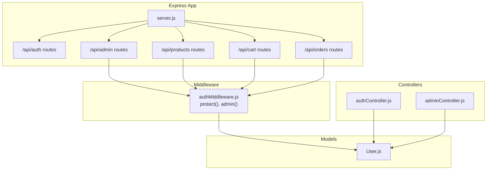
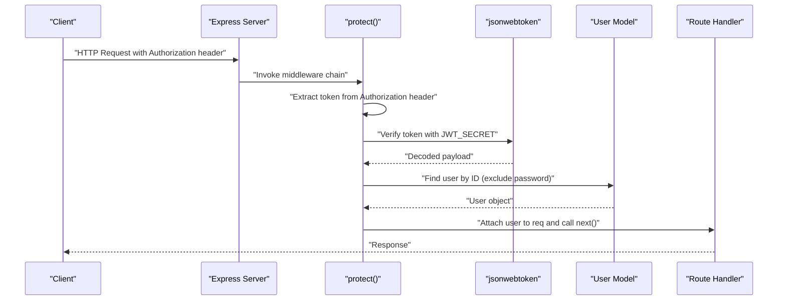
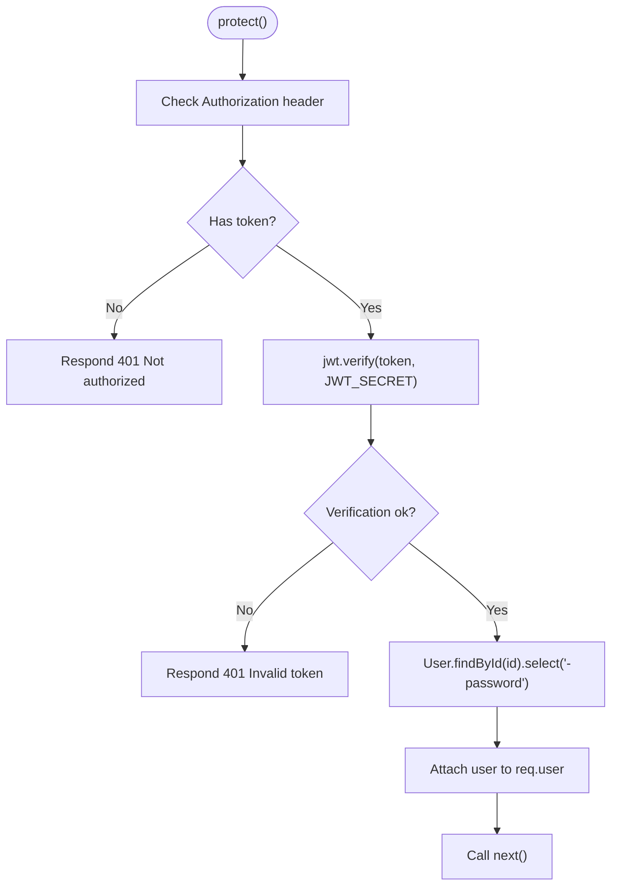
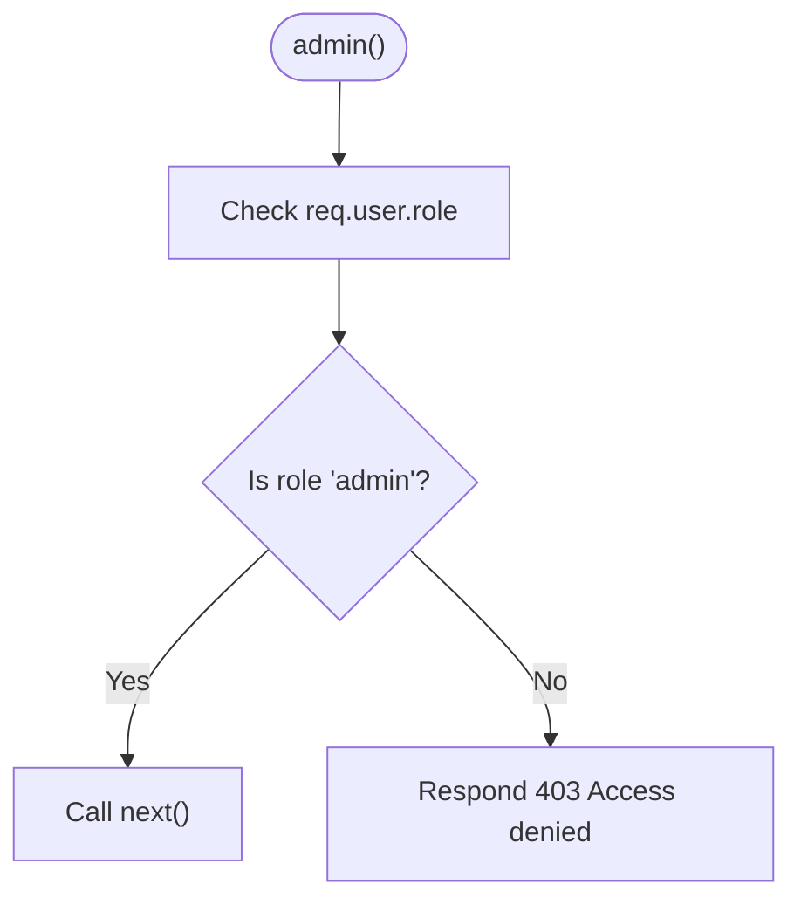
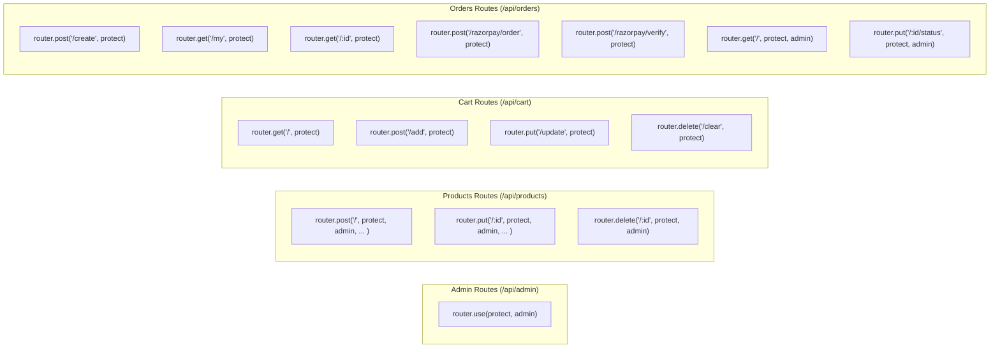
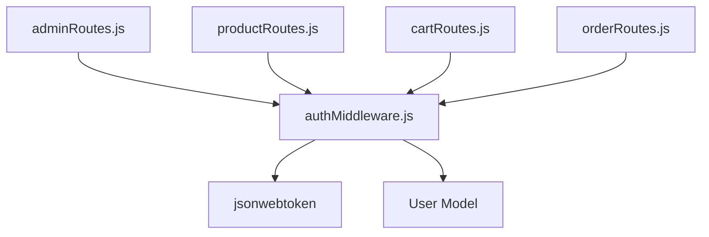

# Authentication Middleware

<cite>
**Referenced Files in This Document**
- [authMiddleware.js](file://backend/middleware/authMiddleware.js)
- [authController.js](file://backend/controllers/authController.js)
- [User.js](file://backend/models/User.js)
- [adminRoutes.js](file://backend/routes/adminRoutes.js)
- [productRoutes.js](file://backend/routes/productRoutes.js)
- [cartRoutes.js](file://backend/routes/cartRoutes.js)
- [orderRoutes.js](file://backend/routes/orderRoutes.js)
- [server.js](file://backend/server.js)
- [authRoutes.js](file://backend/routes/authRoutes.js)
- [.env](file://backend/.env)
- [uploadMiddleware.js](file://backend/middleware/uploadMiddleware.js)
</cite>

## Table of Contents
1. [Introduction](#introduction)
2. [Project Structure](#project-structure)
3. [Core Components](#core-components)
4. [Architecture Overview](#architecture-overview)
5. [Detailed Component Analysis](#detailed-component-analysis)
6. [Dependency Analysis](#dependency-analysis)
7. [Performance Considerations](#performance-considerations)
8. [Troubleshooting Guide](#troubleshooting-guide)
9. [Conclusion](#conclusion)

## Introduction
This document explains the authentication middleware system that protects routes and manages user sessions in the ecommerce backend. It covers:
- The protect middleware that validates JWT tokens from Authorization headers, extracts user information, and attaches it to the request object
- The admin middleware for role-based access control
- Middleware execution order and error handling strategies
- Integration with Express route handlers
- Practical examples of applying middleware to protected routes
- Performance considerations, logging, and debugging techniques

## Project Structure
The authentication middleware resides in a dedicated module and is applied at various levels across routes:
- Global middleware applied to entire route groups
- Route-level middleware applied to individual endpoints
- Integration with controllers that rely on the attached user context

**Diagram sources**
- [server.js:57-63](file://backend/server.js#L57-L63)
- [adminRoutes.js:3-8](file://backend/routes/adminRoutes.js#L3-L8)
- [productRoutes.js:9](file://backend/routes/productRoutes.js#L9)
- [cartRoutes.js:3](file://backend/routes/cartRoutes.js#L3)
- [orderRoutes.js:11](file://backend/routes/orderRoutes.js#L11)
- [authMiddleware.js:4-19](file://backend/middleware/authMiddleware.js#L4-L19)
- [User.js:4-9](file://backend/models/User.js#L4-L9)

**Section sources**
- [server.js:57-63](file://backend/server.js#L57-L63)
- [authMiddleware.js:4-19](file://backend/middleware/authMiddleware.js#L4-L19)

## Core Components
- protect middleware: Extracts the JWT from the Authorization header, verifies it, loads the user from the database, and attaches the user object (without password) to the request.
- admin middleware: Checks that the user has the admin role and grants or denies access accordingly.

Key behaviors:
- Token extraction from Authorization: Bearer token scheme
- JWT verification using a secret from environment configuration
- User lookup and password exclusion from the attached object
- Role-based access control for admin-only endpoints

**Section sources**
- [authMiddleware.js:4-19](file://backend/middleware/authMiddleware.js#L4-L19)
- [User.js:4-9](file://backend/models/User.js#L4-L9)
- [.env:3](file://backend/.env#L3)

## Architecture Overview
The middleware sits between incoming requests and route handlers. It ensures that only authenticated users can access protected endpoints, and only admins can access admin-only endpoints.

**Diagram sources**
- [authMiddleware.js:4-19](file://backend/middleware/authMiddleware.js#L4-L19)
- [User.js:4-9](file://backend/models/User.js#L4-L9)
- [.env:3](file://backend/.env#L3)

## Detailed Component Analysis

### Protect Middleware
Responsibilities:
- Validate presence of Authorization header
- Parse Bearer token
- Verify JWT signature
- Load user from database and attach to request object

Processing logic:
- If no token is present, respond with unauthorized
- On successful verification, load user by ID and attach to req.user
- On verification failure, respond with invalid token

**Diagram sources**
- [authMiddleware.js:4-19](file://backend/middleware/authMiddleware.js#L4-L19)
- [User.js:4-9](file://backend/models/User.js#L4-L9)
- [.env:3](file://backend/.env#L3)

**Section sources**
- [authMiddleware.js:4-19](file://backend/middleware/authMiddleware.js#L4-L19)

### Admin Middleware
Responsibilities:
- Enforce role-based access control
- Allow access only to users whose role equals admin

Processing logic:
- If req.user.role equals admin, continue
- Otherwise, respond with access denied

**Diagram sources**
- [authMiddleware.js:17-20](file://backend/middleware/authMiddleware.js#L17-L20)
- [User.js:8](file://backend/models/User.js#L8)

**Section sources**
- [authMiddleware.js:17-20](file://backend/middleware/authMiddleware.js#L17-L20)
- [User.js:8](file://backend/models/User.js#L8)

### Middleware Execution Order
There are two primary patterns:
- Global middleware applied to entire route groups
- Route-level middleware applied to specific endpoints

Global pattern (admin routes):
- Applies protect then admin to all routes under /api/admin

Route-level pattern (products, cart, orders):
- Applies protect and/or admin to specific endpoints as needed

**Diagram sources**
- [adminRoutes.js:7-12](file://backend/routes/adminRoutes.js#L7-L12)
- [productRoutes.js:18-21](file://backend/routes/productRoutes.js#L18-L21)
- [cartRoutes.js:7-10](file://backend/routes/cartRoutes.js#L7-L10)
- [orderRoutes.js:15-26](file://backend/routes/orderRoutes.js#L15-L26)

**Section sources**
- [adminRoutes.js:7-12](file://backend/routes/adminRoutes.js#L7-L12)
- [productRoutes.js:18-21](file://backend/routes/productRoutes.js#L18-L21)
- [cartRoutes.js:7-10](file://backend/routes/cartRoutes.js#L7-L10)
- [orderRoutes.js:15-26](file://backend/routes/orderRoutes.js#L15-L26)

### Integration with Controllers and Routes
- Authentication endpoints (/api/auth/register, /api/auth/login) do not require authentication
- Protected endpoints attach the authenticated user to req.user for downstream logic
- Admin-only endpoints additionally check role

Examples:
- Admin dashboard and order management endpoints are protected globally
- Product creation, update, and deletion require admin privileges
- Cart and order endpoints require general authentication
- Payment-related endpoints require authentication

**Section sources**
- [authRoutes.js:6-7](file://backend/routes/authRoutes.js#L6-L7)
- [adminRoutes.js:10-12](file://backend/routes/adminRoutes.js#L10-L12)
- [productRoutes.js:18-21](file://backend/routes/productRoutes.js#L18-L21)
- [cartRoutes.js:7-10](file://backend/routes/cartRoutes.js#L7-L10)
- [orderRoutes.js:15-26](file://backend/routes/orderRoutes.js#L15-L26)

## Dependency Analysis
- protect depends on:
  - jsonwebtoken for token verification
  - User model for loading user by ID
- admin depends on:
  - req.user populated by protect
  - User role field
- Routes depend on:
  - protect and admin middleware
  - Controllers that use req.user for business logic

**Diagram sources**
- [authMiddleware.js:1-2](file://backend/middleware/authMiddleware.js#L1-L2)
- [User.js:4-9](file://backend/models/User.js#L4-L9)
- [adminRoutes.js:3](file://backend/routes/adminRoutes.js#L3)
- [productRoutes.js:9](file://backend/routes/productRoutes.js#L9)
- [cartRoutes.js:3](file://backend/routes/cartRoutes.js#L3)
- [orderRoutes.js:11](file://backend/routes/orderRoutes.js#L11)

**Section sources**
- [authMiddleware.js:1-2](file://backend/middleware/authMiddleware.js#L1-L2)
- [User.js:4-9](file://backend/models/User.js#L4-L9)
- [adminRoutes.js:3](file://backend/routes/adminRoutes.js#L3)
- [productRoutes.js:9](file://backend/routes/productRoutes.js#L9)
- [cartRoutes.js:3](file://backend/routes/cartRoutes.js#L3)
- [orderRoutes.js:11](file://backend/routes/orderRoutes.js#L11)

## Performance Considerations
- Token verification cost: Minimal overhead; performed synchronously by jsonwebtoken
- Database lookup cost: Single User.findById per request; consider indexing user IDs
- Password exclusion: Ensures sensitive data is not sent to clients
- Middleware placement: Applying protect globally reduces duplication but increases checks for all admin routes; route-level application allows fine-grained control
- Caching: No caching is implemented; if needed, consider caching verified user roles for short periods
- Logging: Add structured logs around middleware execution for observability

[No sources needed since this section provides general guidance]

## Troubleshooting Guide
Common issues and resolutions:
- Missing Authorization header:
  - Symptom: 401 Not authorized
  - Cause: Client did not send Authorization header
  - Resolution: Ensure client sends Authorization: Bearer <token>
- Invalid or expired token:
  - Symptom: 401 Invalid token
  - Cause: Token signature mismatch or expiration
  - Resolution: Regenerate token on login; verify JWT_SECRET consistency
- Non-admin access to admin routes:
  - Symptom: 403 Access denied
  - Cause: req.user.role is not admin
  - Resolution: Authenticate as admin or adjust user role
- Incorrect token format:
  - Symptom: 401 Invalid token
  - Cause: Token not prefixed with Bearer or malformed
  - Resolution: Send Authorization: Bearer <valid-jwt>
- Environment configuration:
  - Ensure JWT_SECRET is set and consistent across deployments

Logging and debugging tips:
- Log middleware entry/exit with request IDs
- Log token verification outcomes and user IDs
- Log role checks for admin routes
- Use structured errors with consistent response format

**Section sources**
- [authMiddleware.js:5-6](file://backend/middleware/authMiddleware.js#L5-L6)
- [authMiddleware.js:12-14](file://backend/middleware/authMiddleware.js#L12-L14)
- [authMiddleware.js:17-20](file://backend/middleware/authMiddleware.js#L17-L20)
- [.env:3](file://backend/.env#L3)

## Conclusion
The authentication middleware system provides a clean separation of concerns:
- protect handles authentication and user attachment
- admin enforces role-based access control
- Routes apply middleware at appropriate scopes
- Controllers consume req.user for business logic

This design enables secure, maintainable APIs with predictable error handling and straightforward debugging.