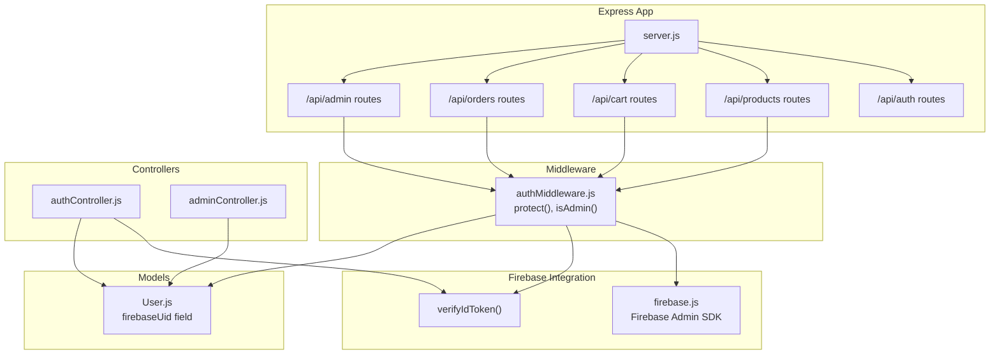
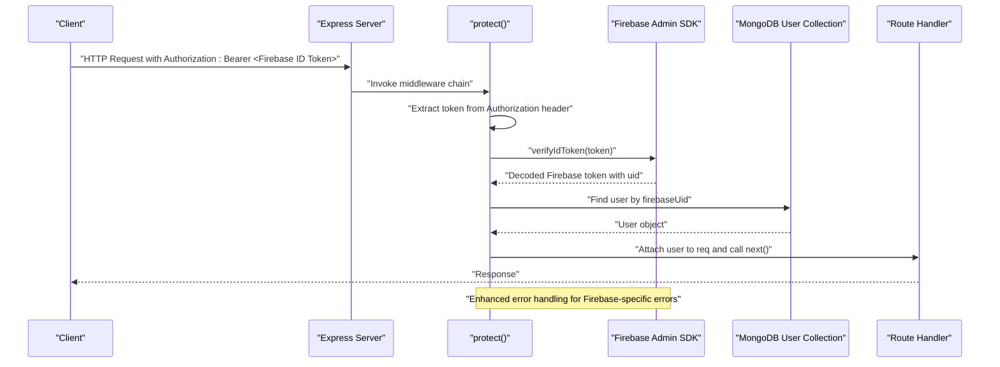
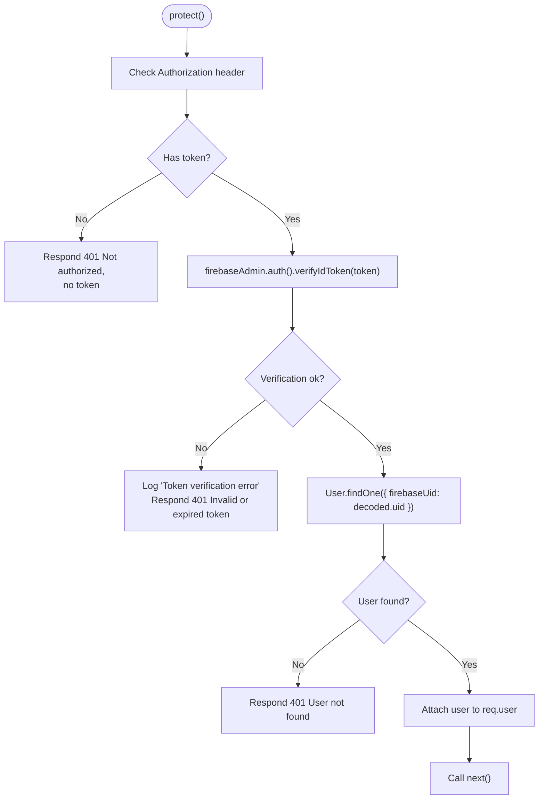
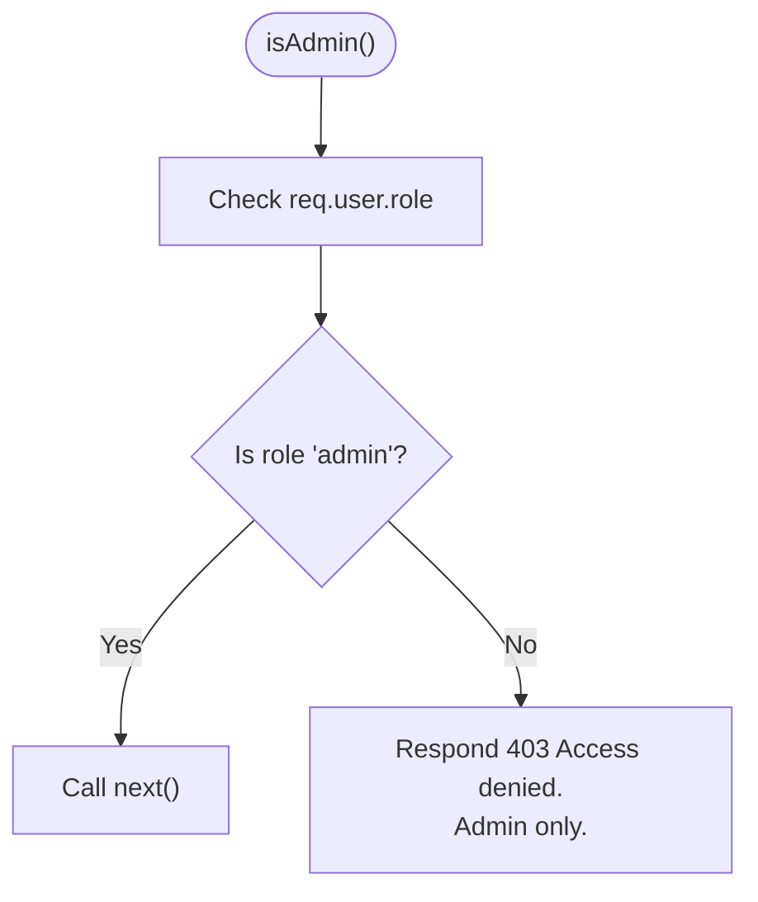
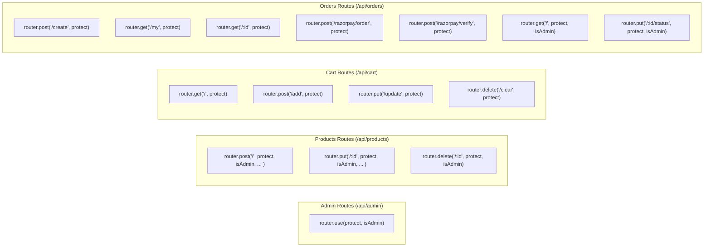
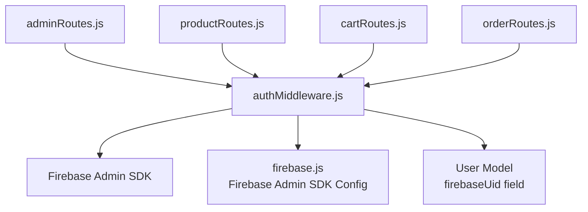

# Authentication Middleware

<cite>
**Referenced Files in This Document**
- [authMiddleware.js](file://backend/middleware/authMiddleware.js)
- [authController.js](file://backend/controllers/authController.js)
- [User.js](file://backend/models/User.js)
- [adminRoutes.js](file://backend/routes/adminRoutes.js)
- [productRoutes.js](file://backend/routes/productRoutes.js)
- [cartRoutes.js](file://backend/routes/cartRoutes.js)
- [orderRoutes.js](file://backend/routes/orderRoutes.js)
- [server.js](file://backend/server.js)
- [authRoutes.js](file://backend/routes/authRoutes.js)
- [firebase.js](file://backend/config/firebase.js)
- [uploadMiddleware.js](file://backend/middleware/uploadMiddleware.js)
</cite>

## Update Summary
**Changes Made**
- Updated protect middleware implementation to use Firebase ID tokens instead of JWT tokens
- Enhanced error handling with Firebase-specific error messages
- Updated middleware architecture to integrate with Firebase Admin SDK
- Modified user lookup to use firebaseUid instead of traditional user ID
- Updated authentication flow to support Firebase-based user management

## Table of Contents
1. [Introduction](#introduction)
2. [Project Structure](#project-structure)
3. [Core Components](#core-components)
4. [Architecture Overview](#architecture-overview)
5. [Detailed Component Analysis](#detailed-component-analysis)
6. [Dependency Analysis](#dependency-analysis)
7. [Performance Considerations](#performance-considerations)
8. [Troubleshooting Guide](#troubleshooting-guide)
9. [Conclusion](#conclusion)

## Introduction
This document explains the authentication middleware system that protects routes and manages user sessions in the ecommerce backend using Firebase Authentication. The system has been updated to use Firebase ID tokens for authentication instead of traditional JWT tokens, providing enhanced security and seamless integration with Firebase's authentication infrastructure. It covers:
- The protect middleware that validates Firebase ID tokens from Authorization headers, extracts user information, and attaches it to the request object
- The admin middleware for role-based access control
- Middleware execution order and enhanced error handling strategies
- Integration with Express route handlers and Firebase Admin SDK
- Practical examples of applying middleware to protected routes
- Performance considerations, logging, and debugging techniques for Firebase authentication issues

## Project Structure
The authentication middleware now integrates with Firebase Authentication and resides in a dedicated module with Firebase Admin SDK integration:
- Global middleware applied to entire route groups
- Route-level middleware applied to individual endpoints
- Integration with Firebase Admin SDK for token verification
- Integration with controllers that rely on the attached user context

**Diagram sources**
- [server.js:57-63](file://backend/server.js#L57-L63)
- [adminRoutes.js:3-8](file://backend/routes/adminRoutes.js#L3-L8)
- [productRoutes.js:9](file://backend/routes/productRoutes.js#L9)
- [cartRoutes.js:3](file://backend/routes/cartRoutes.js#L3)
- [orderRoutes.js:11](file://backend/routes/orderRoutes.js#L11)
- [authMiddleware.js:1-33](file://backend/middleware/authMiddleware.js#L1-L33)
- [firebase.js:1-13](file://backend/config/firebase.js#L1-L13)
- [User.js:4-9](file://backend/models/User.js#L4-L9)

**Section sources**
- [server.js:57-63](file://backend/server.js#L57-L63)
- [authMiddleware.js:1-33](file://backend/middleware/authMiddleware.js#L1-L33)
- [firebase.js:1-13](file://backend/config/firebase.js#L1-L13)

## Core Components
- **protect middleware**: Extracts the Firebase ID token from the Authorization header, verifies it using Firebase Admin SDK, loads the user from MongoDB using firebaseUid, and attaches the user object (without password) to the request.
- **isAdmin middleware**: Checks that the user has the admin role and grants or denies access accordingly.
- **Firebase Integration**: Uses Firebase Admin SDK for token verification and user management.

Key behaviors:
- Token extraction from Authorization: Bearer token scheme
- Firebase ID token verification using Firebase Admin SDK
- User lookup by firebaseUid and password exclusion from the attached object
- Role-based access control for admin-only endpoints
- Enhanced error handling with Firebase-specific error messages

**Section sources**
- [authMiddleware.js:4-33](file://backend/middleware/authMiddleware.js#L4-L33)
- [User.js:4-9](file://backend/models/User.js#L4-L9)
- [firebase.js:1-13](file://backend/config/firebase.js#L1-L13)

## Architecture Overview
The middleware now integrates with Firebase Authentication through the Firebase Admin SDK. It ensures that only authenticated users can access protected endpoints, and only admins can access admin-only endpoints. The system uses Firebase ID tokens for authentication and maintains user sessions through MongoDB.

**Diagram sources**
- [authMiddleware.js:4-33](file://backend/middleware/authMiddleware.js#L4-L33)
- [User.js:4-9](file://backend/models/User.js#L4-L9)
- [firebase.js:1-13](file://backend/config/firebase.js#L1-L13)

## Detailed Component Analysis

### Protect Middleware
**Updated** Now uses Firebase Admin SDK for token verification instead of jsonwebtoken library.

Responsibilities:
- Validate presence of Authorization header
- Parse Bearer token
- Verify Firebase ID token using Firebase Admin SDK
- Load user from MongoDB by firebaseUid and attach to request object

Processing logic:
- If no token is present, respond with unauthorized
- On successful verification, load user by firebaseUid and attach to req.user
- On verification failure, respond with Firebase-specific error messages
- Handle user not found scenario with proper error response

**Diagram sources**
- [authMiddleware.js:4-33](file://backend/middleware/authMiddleware.js#L4-L33)
- [User.js:4-9](file://backend/models/User.js#L4-L9)

**Section sources**
- [authMiddleware.js:4-33](file://backend/middleware/authMiddleware.js#L4-L33)

### Admin Middleware
Responsibilities:
- Enforce role-based access control
- Allow access only to users whose role equals admin

Processing logic:
- If req.user.role equals admin, continue
- Otherwise, respond with access denied

**Diagram sources**
- [authMiddleware.js:26-33](file://backend/middleware/authMiddleware.js#L26-L33)
- [User.js:8](file://backend/models/User.js#L8)

**Section sources**
- [authMiddleware.js:26-33](file://backend/middleware/authMiddleware.js#L26-L33)
- [User.js:8](file://backend/models/User.js#L8)

### Middleware Execution Order
There are two primary patterns:
- Global middleware applied to entire route groups
- Route-level middleware applied to specific endpoints

Global pattern (admin routes):
- Applies protect then isAdmin to all routes under /api/admin

Route-level pattern (products, cart, orders):
- Applies protect and/or isAdmin to specific endpoints as needed

**Diagram sources**
- [adminRoutes.js:7-12](file://backend/routes/adminRoutes.js#L7-L12)
- [productRoutes.js:18-21](file://backend/routes/productRoutes.js#L18-L21)
- [cartRoutes.js:7-10](file://backend/routes/cartRoutes.js#L7-L10)
- [orderRoutes.js:15-26](file://backend/routes/orderRoutes.js#L15-L26)

**Section sources**
- [adminRoutes.js:7-12](file://backend/routes/adminRoutes.js#L7-L12)
- [productRoutes.js:18-21](file://backend/routes/productRoutes.js#L18-L21)
- [cartRoutes.js:7-10](file://backend/routes/cartRoutes.js#L7-L10)
- [orderRoutes.js:15-26](file://backend/routes/orderRoutes.js#L15-L26)

### Integration with Controllers and Routes
**Updated** Authentication endpoints now use Firebase ID tokens instead of JWT tokens.

- Authentication endpoints (/api/auth/firebase-login) use Firebase ID tokens for login
- Protected endpoints attach the authenticated user to req.user for downstream logic
- Admin-only endpoints additionally check role
- Firebase Admin SDK handles token verification and user management

Examples:
- Admin dashboard and order management endpoints are protected globally
- Product creation, update, and deletion require admin privileges
- Cart and order endpoints require general authentication
- Payment-related endpoints require authentication

**Section sources**
- [authRoutes.js:6-7](file://backend/routes/authRoutes.js#L6-L7)
- [adminRoutes.js:10-12](file://backend/routes/adminRoutes.js#L10-L12)
- [productRoutes.js:18-21](file://backend/routes/productRoutes.js#L18-L21)
- [cartRoutes.js:7-10](file://backend/routes/cartRoutes.js#L7-L10)
- [orderRoutes.js:15-26](file://backend/routes/orderRoutes.js#L15-L26)

## Dependency Analysis
**Updated** Dependencies now include Firebase Admin SDK integration.

- protect depends on:
  - Firebase Admin SDK for token verification
  - User model for loading user by firebaseUid
- admin depends on:
  - req.user populated by protect
  - User role field
- Routes depend on:
  - protect and isAdmin middleware
  - Controllers that use req.user for business logic
- Firebase integration depends on:
  - Firebase Admin SDK initialization
  - Environment variables for Firebase configuration

**Diagram sources**
- [authMiddleware.js:1-2](file://backend/middleware/authMiddleware.js#L1-L2)
- [firebase.js:1-13](file://backend/config/firebase.js#L1-L13)
- [User.js:4-9](file://backend/models/User.js#L4-L9)
- [adminRoutes.js:3](file://backend/routes/adminRoutes.js#L3)
- [productRoutes.js:9](file://backend/routes/productRoutes.js#L9)
- [cartRoutes.js:3](file://backend/routes/cartRoutes.js#L3)
- [orderRoutes.js:11](file://backend/routes/orderRoutes.js#L11)

**Section sources**
- [authMiddleware.js:1-2](file://backend/middleware/authMiddleware.js#L1-L2)
- [firebase.js:1-13](file://backend/config/firebase.js#L1-L13)
- [User.js:4-9](file://backend/models/User.js#L4-L9)
- [adminRoutes.js:3](file://backend/routes/adminRoutes.js#L3)
- [productRoutes.js:9](file://backend/routes/productRoutes.js#L9)
- [cartRoutes.js:3](file://backend/routes/cartRoutes.js#L3)
- [orderRoutes.js:11](file://backend/routes/orderRoutes.js#L11)

## Performance Considerations
**Updated** Performance considerations now include Firebase Admin SDK overhead.

- Firebase token verification cost: Moderate overhead; performed asynchronously via Firebase Admin SDK
- Database lookup cost: Single User.findOne by firebaseUid per request; consider indexing firebaseUid field
- Password exclusion: Ensures sensitive data is not sent to clients
- Middleware placement: Applying protect globally reduces duplication but increases checks for all admin routes; route-level application allows fine-grained control
- Caching: Consider implementing short-term caching for verified user roles (5-10 minutes) to reduce database queries
- Logging: Add structured logs around Firebase token verification and user lookup operations
- Error handling: Firebase-specific error messages provide better debugging information

## Troubleshooting Guide
**Updated** Common issues now include Firebase-specific error scenarios.

Common issues and resolutions:
- Missing Authorization header:
  - Symptom: 401 Not authorized, no token
  - Cause: Client did not send Authorization header
  - Resolution: Ensure client sends Authorization: Bearer <Firebase ID token>
- Invalid or expired Firebase ID token:
  - Symptom: 401 Invalid or expired token
  - Cause: Token signature mismatch, expiration, or Firebase verification failure
  - Resolution: Generate new Firebase ID token; verify Firebase service account configuration
- User not found in database:
  - Symptom: 401 User not found
  - Cause: Firebase user exists but MongoDB user record missing
  - Resolution: Ensure Firebase user authentication flows create MongoDB user records
- Non-admin access to admin routes:
  - Symptom: 403 Access denied. Admin only.
  - Cause: req.user.role is not admin
  - Resolution: Authenticate as admin or adjust user role in MongoDB
- Incorrect token format:
  - Symptom: 401 Invalid or expired token
  - Cause: Token not prefixed with Bearer or malformed Firebase ID token
  - Resolution: Send Authorization: Bearer <valid-Firebase-ID-token>
- Firebase configuration issues:
  - Ensure Firebase Admin SDK is properly initialized with correct service account credentials
  - Verify environment variables: FIREBASE_PROJECT_ID, FIREBASE_CLIENT_EMAIL, FIREBASE_PRIVATE_KEY

Logging and debugging tips:
- Log Firebase token verification attempts with request IDs
- Log Firebase verification outcomes and user IDs
- Log role checks for admin routes
- Monitor Firebase Admin SDK error codes for specific issue identification
- Use structured errors with consistent response format including Firebase-specific error messages

**Section sources**
- [authMiddleware.js:5-6](file://backend/middleware/authMiddleware.js#L5-L6)
- [authMiddleware.js:12-14](file://backend/middleware/authMiddleware.js#L12-L14)
- [authMiddleware.js:17-20](file://backend/middleware/authMiddleware.js#L17-L20)
- [authMiddleware.js:21-22](file://backend/middleware/authMiddleware.js#L21-L22)

## Conclusion
**Updated** The authentication middleware system now provides enhanced security through Firebase Authentication integration.

The authentication middleware system with Firebase Integration provides a robust separation of concerns:
- protect handles Firebase ID token verification and user attachment
- admin enforces role-based access control
- Routes apply middleware at appropriate scopes
- Controllers consume req.user for business logic
- Firebase Admin SDK provides reliable token verification
- Enhanced error handling with Firebase-specific messaging

This design enables secure, maintainable APIs with predictable error handling, Firebase-specific debugging capabilities, and straightforward integration with Firebase's authentication infrastructure.