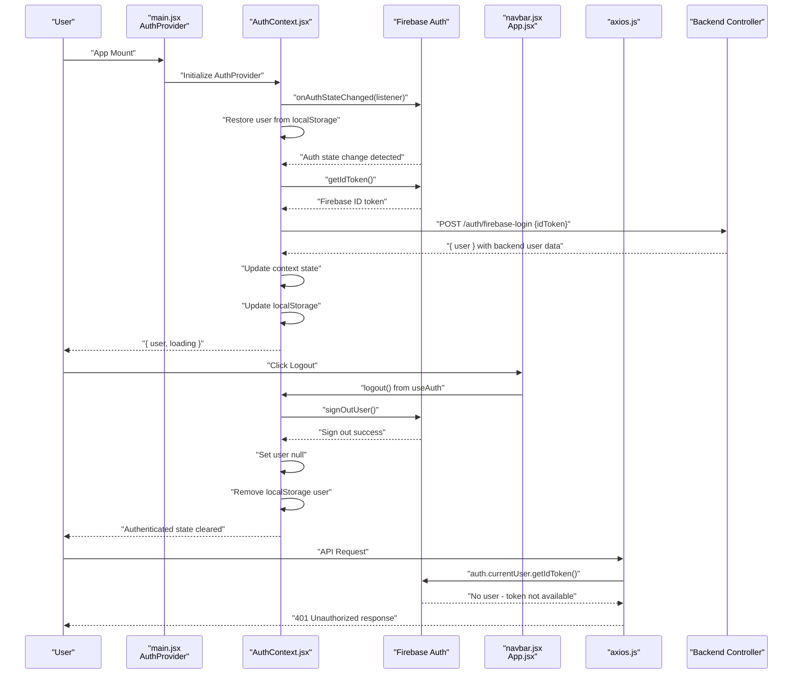
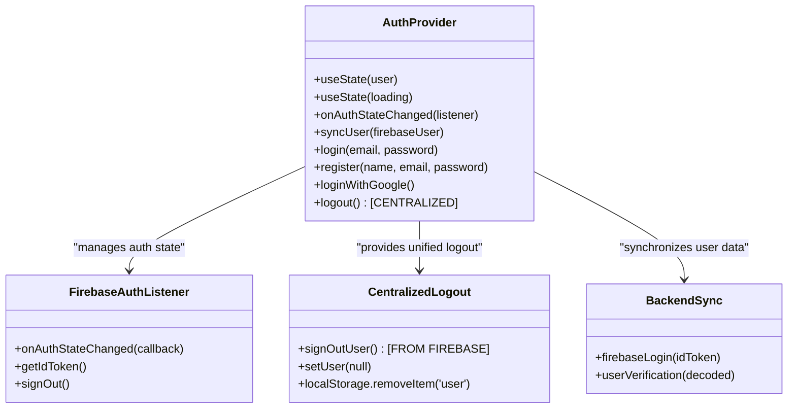
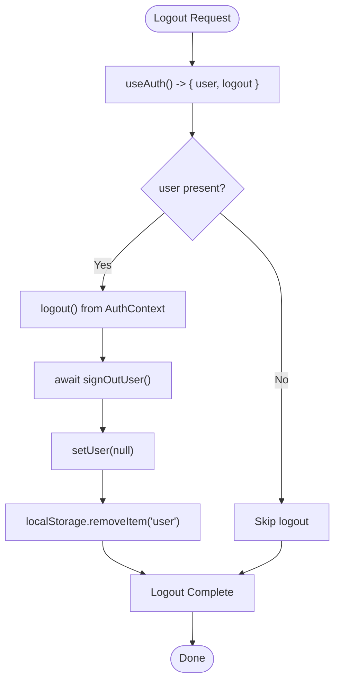
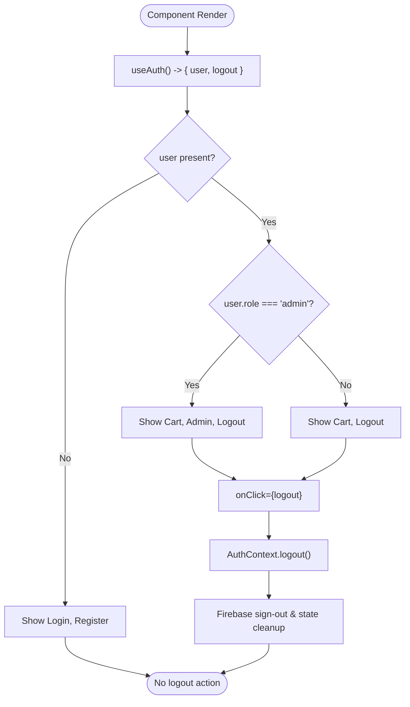
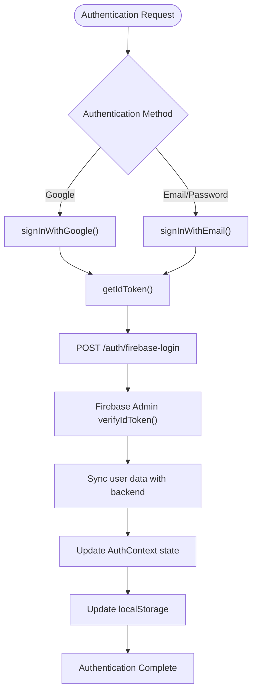
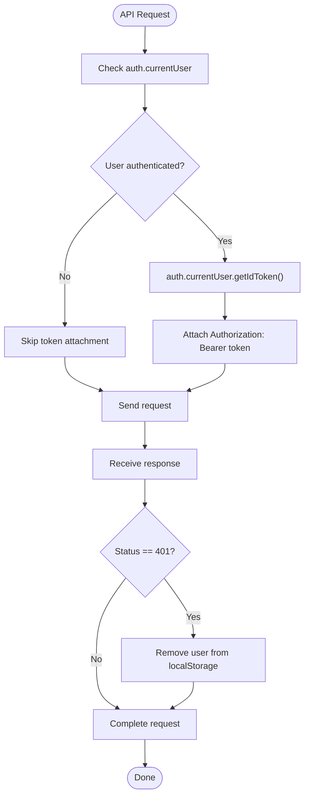
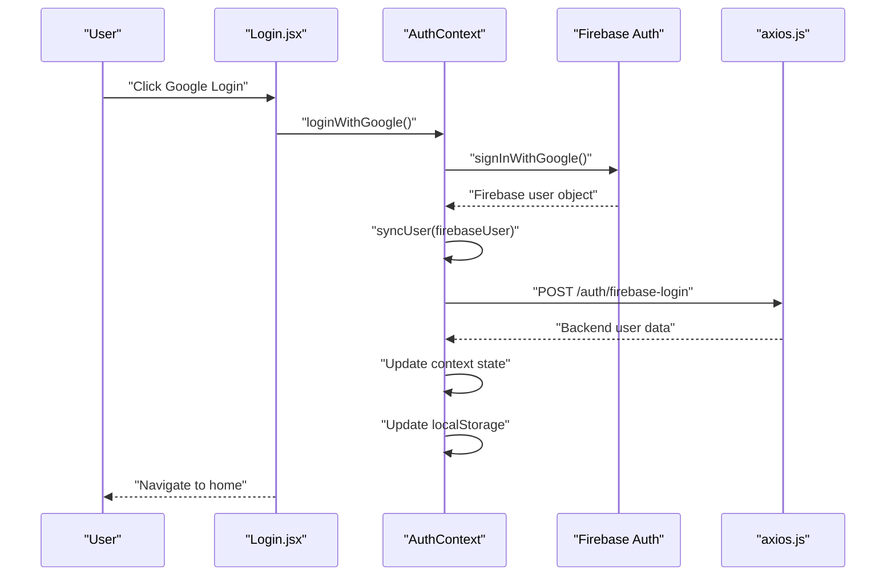
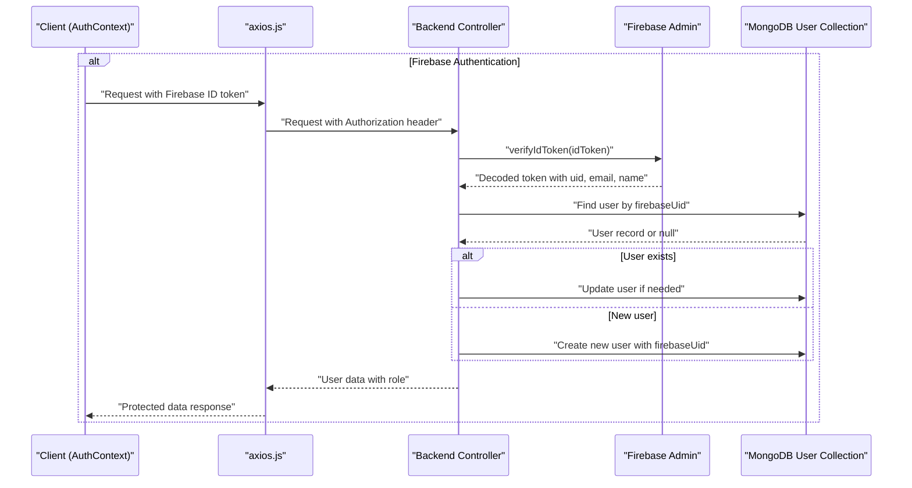
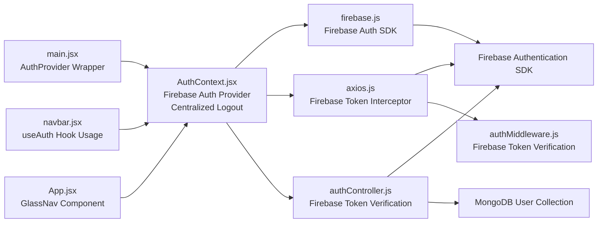

# Frontend Authentication State Management

<cite>
**Referenced Files in This Document**
- [main.jsx](file://frontend/src/main.jsx)
- [AuthContext.jsx](file://frontend/src/context/AuthContext.jsx)
- [firebase.js](file://frontend/src/config/firebase.js)
- [axios.js](file://frontend/src/api/axios.js)
- [authController.js](file://backend/controllers/authController.js)
- [authMiddleware.js](file://backend/middleware/authMiddleware.js)
- [Login.jsx](file://frontend/src/pages/Login.jsx)
- [navbar.jsx](file://frontend/src/components/navbar.jsx)
- [App.jsx](file://frontend/src/App.jsx)
- [firebase.js](file://backend/config/firebase.js)
</cite>

## Update Summary
**Changes Made**
- Centralized logout mechanism implemented in AuthContext with unified logout function
- Navigation components updated to use centralized logout function from useAuth hook
- Enhanced user state access through useAuth hook instead of manual localStorage parsing
- Improved authentication state management with consistent logout handling across components
- Streamlined authentication flow with centralized state updates and cleanup

## Table of Contents
1. [Introduction](#introduction)
2. [Project Structure](#project-structure)
3. [Core Components](#core-components)
4. [Architecture Overview](#architecture-overview)
5. [Detailed Component Analysis](#detailed-component-analysis)
6. [Dependency Analysis](#dependency-analysis)
7. [Performance Considerations](#performance-considerations)
8. [Troubleshooting Guide](#troubleshooting-guide)
9. [Conclusion](#conclusion)

## Introduction
This document explains the frontend authentication state management built with React Context API, now enhanced with comprehensive Firebase Authentication integration and centralized logout mechanism. The system leverages Firebase Authentication for secure user authentication, automatic token management, and real-time state synchronization. The AuthContext implementation now focuses on Firebase ID token verification, automatic token refresh, centralized logout handling, and seamless integration with the backend Firebase authentication system. The enhanced implementation provides robust authentication flow with automatic token lifecycle management, comprehensive error handling, and seamless user experience across all components.

**Updated** Complete Firebase Authentication integration with centralized logout mechanism, unified authentication state access, and real-time state synchronization with Firebase.

## Project Structure
The authentication implementation centers around a React Context provider with integrated Firebase Authentication and centralized logout management. The main application mounts the AuthProvider at the root level, ensuring proper authentication context availability throughout the application. The system now uses Firebase Authentication for all authentication methods, with automatic token verification and refresh handled by Firebase SDK and centralized logout management through AuthContext.

```mermaid
graph TB
subgraph "Frontend Root"
MAIN["main.jsx<br/>AuthProvider Wrapper"]
APP["App.jsx<br/>Centralized Logout Usage"]
END
subgraph "Context Layer"
AUTHCTX["AuthContext.jsx<br/>Firebase Auth Provider<br/>Centralized Logout"]
END
subgraph "Firebase Authentication"
FIREBASE["firebase.js<br/>Firebase Auth SDK"]
AUTHSTATE["onAuthStateChanged<br/>Real-time Sync"]
SIGNOUT["signOutUser<br/>Firebase Sign Out"]
ENDPOINT["Backend Firebase Controller<br/>Token Verification"]
end
subgraph "Navigation Components"
NAV["navbar.jsx<br/>useAuth Hook Usage"]
GLASSNAV["App.jsx<br/>GlassNav Component"]
END
subgraph "API Layer"
AXIOS["axios.js<br/>Firebase ID Token Interceptor"]
MIDDLEWARE["authMiddleware.js<br/>Firebase Token Verification"]
END
MAIN --> APP
APP --> AUTHCTX
AUTHCTX --> FIREBASE
AUTHCTX --> AUTHSTATE
AUTHCTX --> SIGNOUT
AUTHCTX --> ENDPOINT
APP --> NAV
APP --> GLASSNAV
NAV --> AUTHCTX
GLASSNAV --> AUTHCTX
AXIOS --> MIDDLEWARE
```

**Diagram sources**
- [main.jsx:7-13](file://frontend/src/main.jsx#L7-L13)
- [AuthContext.jsx:68-76](file://frontend/src/context/AuthContext.jsx#L68-L76)
- [firebase.js:55-63](file://frontend/src/config/firebase.js#L55-L63)
- [authController.js:5-68](file://backend/controllers/authController.js#L5-L68)
- [Login.jsx:7](file://frontend/src/pages/Login.jsx#L7)
- [navbar.jsx:5](file://frontend/src/components/navbar.jsx#L5)
- [App.jsx:27](file://frontend/src/App.jsx#L27)
- [axios.js:8-16](file://frontend/src/api/axios.js#L8-L16)
- [authMiddleware.js:4-24](file://backend/middleware/authMiddleware.js#L4-L24)

**Section sources**
- [main.jsx:1-14](file://frontend/src/main.jsx#L1-L14)
- [AuthContext.jsx:1-86](file://frontend/src/context/AuthContext.jsx#L1-L86)
- [firebase.js:1-67](file://frontend/src/config/firebase.js#L1-L67)

## Core Components
- **Enhanced AuthProvider** manages user state with Firebase Authentication integration, automatically synchronizes with Firebase auth state, handles real-time authentication updates through onAuthStateChanged listener, and provides centralized logout functionality.
- **Centralized Logout Mechanism** implements unified logout function that handles Firebase sign-out, local state cleanup, and localStorage removal in a single cohesive operation.
- **Firebase Authentication Integration** provides seamless Google OAuth, email/password authentication, and automatic token management with automatic refresh capabilities.
- **Automatic Token Synchronization** uses Firebase ID tokens for backend communication, with automatic token refresh and verification through backend Firebase Admin SDK.
- **Real-time State Management** implements onAuthStateChanged listener to keep frontend state synchronized with Firebase authentication state, eliminating manual token persistence.
- **Comprehensive Authentication Methods** including Google login, email/password login, email/password registration, and centralized logout with Firebase integration.
- **Enhanced Error Handling** with comprehensive logging and user feedback for Firebase authentication failures and token verification errors.
- **Automatic Token Injection** through Axios interceptors that extract fresh Firebase ID tokens from auth.currentUser for each request.
- **Backend Verification** with Firebase Admin SDK verifying ID tokens and managing user synchronization between Firebase and backend databases.
- **Unified Authentication State Access** through useAuth hook providing consistent user state and logout functionality across all components.

Key implementation references:
- **Root-level provider setup with AuthProvider wrapper**: [main.jsx:9](file://frontend/src/main.jsx#L9)
- **Firebase auth state synchronization**: [AuthContext.jsx:31-48](file://frontend/src/context/AuthContext.jsx#L31-L48)
- **Centralized logout implementation**: [AuthContext.jsx:68-76](file://frontend/src/context/AuthContext.jsx#L68-L76)
- **Firebase sign-out function**: [firebase.js:55-63](file://frontend/src/config/firebase.js#L55-L63)
- **useAuth hook for state access**: [AuthContext.jsx:85](file://frontend/src/context/AuthContext.jsx#L85)
- **Navigation component using useAuth**: [navbar.jsx:5](file://frontend/src/components/navbar.jsx#L5)
- **GlassNav component using centralized logout**: [App.jsx:27](file://frontend/src/App.jsx#L27)

**Section sources**
- [main.jsx:1-14](file://frontend/src/main.jsx#L1-L14)
- [AuthContext.jsx:1-86](file://frontend/src/context/AuthContext.jsx#L1-L86)
- [firebase.js:1-67](file://frontend/src/config/firebase.js#L1-L67)
- [authController.js:1-69](file://backend/controllers/authController.js#L1-L69)
- [authMiddleware.js:1-33](file://backend/middleware/authMiddleware.js#L1-L33)
- [axios.js:1-29](file://frontend/src/api/axios.js#L1-L29)
- [navbar.jsx:1-26](file://frontend/src/components/navbar.jsx#L1-L26)
- [App.jsx:1-248](file://frontend/src/App.jsx#L1-L248)

## Architecture Overview
The authentication architecture combines React Context with Firebase Authentication SDK for automatic token management, real-time state synchronization, and centralized logout handling. The AuthProvider listens for Firebase auth state changes and automatically synchronizes user data with the backend through Firebase ID tokens. The centralized logout mechanism ensures consistent authentication state cleanup across all components through the useAuth hook.



**Diagram sources**
- [main.jsx:7-13](file://frontend/src/main.jsx#L7-L13)
- [AuthContext.jsx:31-48](file://frontend/src/context/AuthContext.jsx#L31-L48)
- [AuthContext.jsx:20-29](file://frontend/src/context/AuthContext.jsx#L20-L29)
- [AuthContext.jsx:68-76](file://frontend/src/context/AuthContext.jsx#L68-L76)
- [firebase.js:55-63](file://frontend/src/config/firebase.js#L55-L63)
- [authController.js:5-68](file://backend/controllers/authController.js#L5-L68)
- [axios.js:9-16](file://frontend/src/api/axios.js#L9-L16)

## Detailed Component Analysis

### Enhanced AuthProvider with Centralized Logout Management
The AuthProvider now serves as a bridge between Firebase Authentication and the application state, automatically synchronizing user data and handling real-time authentication updates through onAuthStateChanged listener. The provider includes centralized logout functionality that coordinates Firebase sign-out with local state cleanup.



**Diagram sources**
- [AuthContext.jsx:8-83](file://frontend/src/context/AuthContext.jsx#L8-L83)
- [firebase.js:21-63](file://frontend/src/config/firebase.js#L21-L63)
- [firebase.js:55-63](file://frontend/src/config/firebase.js#L55-L63)
- [authController.js:5-68](file://backend/controllers/authController.js#L5-L68)

Implementation highlights:
- **Root-level provider setup**: [main.jsx:9](file://frontend/src/main.jsx#L9)
- **Firebase auth state listener**: [AuthContext.jsx:37-47](file://frontend/src/context/AuthContext.jsx#L37-L47)
- **Automatic user synchronization**: [AuthContext.jsx:13-29](file://frontend/src/context/AuthContext.jsx#L13-L29)
- **Centralized logout implementation**: [AuthContext.jsx:68-76](file://frontend/src/context/AuthContext.jsx#L68-L76)
- **Firebase sign-out function**: [firebase.js:55-63](file://frontend/src/config/firebase.js#L55-L63)
- **Email/password login via Firebase**: [AuthContext.jsx:51-54](file://frontend/src/context/AuthContext.jsx#L51-L54)
- **Email/password registration via Firebase**: [AuthContext.jsx:57-60](file://frontend/src/context/AuthContext.jsx#L57-L60)
- **Google login via Firebase**: [AuthContext.jsx:63-66](file://frontend/src/context/AuthContext.jsx#L63-L66)

**Section sources**
- [main.jsx:1-14](file://frontend/src/main.jsx#L1-L14)
- [AuthContext.jsx:1-86](file://frontend/src/context/AuthContext.jsx#L1-L86)
- [firebase.js:1-67](file://frontend/src/config/firebase.js#L1-L67)

### Centralized Logout Mechanism
The centralized logout mechanism provides a unified approach to authentication state cleanup, coordinating Firebase sign-out with local state management. This ensures consistent logout behavior across all components and prevents stale authentication state.



**Diagram sources**
- [AuthContext.jsx:68-76](file://frontend/src/context/AuthContext.jsx#L68-L76)
- [firebase.js:55-63](file://frontend/src/config/firebase.js#L55-L63)
- [navbar.jsx:5](file://frontend/src/components/navbar.jsx#L5)
- [App.jsx:27](file://frontend/src/App.jsx#L27)

Key implementation details:
- **Centralized logout function**: [AuthContext.jsx:68-76](file://frontend/src/context/AuthContext.jsx#L68-L76)
- **Firebase sign-out coordination**: [firebase.js:55-63](file://frontend/src/config/firebase.js#L55-L63)
- **Local state cleanup**: [AuthContext.jsx:74-75](file://frontend/src/context/AuthContext.jsx#L74-L75)
- **Navigation component logout usage**: [navbar.jsx:15](file://frontend/src/components/navbar.jsx#L15)
- **GlassNav component logout usage**: [App.jsx:115](file://frontend/src/App.jsx#L115)

**Section sources**
- [AuthContext.jsx:1-86](file://frontend/src/context/AuthContext.jsx#L1-L86)
- [firebase.js:1-67](file://frontend/src/config/firebase.js#L1-L67)
- [navbar.jsx:1-26](file://frontend/src/components/navbar.jsx#L1-L26)
- [App.jsx:1-248](file://frontend/src/App.jsx#L1-L248)

### Enhanced Navigation Components with Unified State Access
Both the traditional navbar and the modern GlassNav component now use the useAuth hook to access authentication state and logout functionality. This provides consistent behavior and eliminates manual localStorage parsing across components.



**Diagram sources**
- [navbar.jsx:5](file://frontend/src/components/navbar.jsx#L5)
- [App.jsx:27](file://frontend/src/App.jsx#L27)
- [AuthContext.jsx:68-76](file://frontend/src/context/AuthContext.jsx#L68-L76)

**Section sources**
- [navbar.jsx:1-26](file://frontend/src/components/navbar.jsx#L1-L26)
- [App.jsx:1-248](file://frontend/src/App.jsx#L1-L248)

### Firebase Authentication Integration
The Firebase integration provides seamless authentication through Google OAuth and email/password methods, with automatic token management and real-time state synchronization. The system handles authentication flows, token extraction, and user data synchronization automatically, with centralized logout coordination.



**Diagram sources**
- [AuthContext.jsx:20-29](file://frontend/src/context/AuthContext.jsx#L20-L29)
- [authController.js:13-14](file://backend/controllers/authController.js#L13-L14)
- [firebase.js:21-63](file://frontend/src/config/firebase.js#L21-L63)

Key implementation details:
- **Firebase configuration and exports**: [firebase.js:15-67](file://frontend/src/config/firebase.js#L15-L67)
- **Google sign-in with popup**: [firebase.js:21-29](file://frontend/src/config/firebase.js#L21-L29)
- **Email/password authentication**: [firebase.js:32-53](file://frontend/src/config/firebase.js#L32-L53)
- **Firebase ID token extraction**: [AuthContext.jsx:20](file://frontend/src/context/AuthContext.jsx#L20)
- **Backend token verification**: [authController.js:13-14](file://backend/controllers/authController.js#L13-L14)
- **User synchronization**: [AuthContext.jsx:21-23](file://frontend/src/context/AuthContext.jsx#L21-L23)

**Section sources**
- [firebase.js:1-67](file://frontend/src/config/firebase.js#L1-L67)
- [AuthContext.jsx:1-86](file://frontend/src/context/AuthContext.jsx#L1-L86)
- [authController.js:1-69](file://backend/controllers/authController.js#L1-L69)

### Automatic Token Management and API Interceptors
The Axios interceptors now automatically handle Firebase ID tokens through the Firebase SDK, eliminating manual token persistence and providing automatic token refresh capabilities. The system extracts fresh tokens from Firebase auth.currentUser for each request, with proper handling when no user is authenticated.



**Diagram sources**
- [axios.js:9-27](file://frontend/src/api/axios.js#L9-L27)

Practical implications:
- **Automatic token refresh** through Firebase SDK eliminates manual token expiration handling.
- **Real-time authentication state** synchronization through onAuthStateChanged listener.
- **Automatic cleanup** on 401 responses prevents stale authentication state.
- **Seamless integration** with Firebase Authentication without manual token management.

**Section sources**
- [axios.js:1-29](file://frontend/src/api/axios.js#L1-L29)

### Enhanced Login Page Integration
The Login page now integrates seamlessly with Firebase Authentication, supporting both Google OAuth and email/password authentication through Firebase SDK. The page handles authentication flows, error handling, and automatic navigation on successful authentication.



**Diagram sources**
- [Login.jsx:30-47](file://frontend/src/pages/Login.jsx#L30-L47)
- [AuthContext.jsx:63-66](file://frontend/src/context/AuthContext.jsx#L63-L66)
- [AuthContext.jsx:13-29](file://frontend/src/context/AuthContext.jsx#L13-L29)

**Section sources**
- [Login.jsx:1-133](file://frontend/src/pages/Login.jsx#L1-L133)

### Backend Firebase Authentication Integration
The backend now verifies Firebase ID tokens through Firebase Admin SDK, providing secure authentication verification and user synchronization between Firebase and backend systems. The system handles token verification, user creation/update, and role-based access control.



**Diagram sources**
- [axios.js:9-16](file://frontend/src/api/axios.js#L9-L16)
- [authController.js:5-68](file://backend/controllers/authController.js#L5-L68)
- [authMiddleware.js:14](file://backend/middleware/authMiddleware.js#L14)

**Section sources**
- [authController.js:1-69](file://backend/controllers/authController.js#L1-L69)
- [authMiddleware.js:1-33](file://backend/middleware/authMiddleware.js#L1-L33)

## Dependency Analysis
The authentication system exhibits clear separation of concerns with Firebase-first architecture and centralized logout management:
- **Enhanced AuthProvider** manages Firebase authentication state with automatic synchronization, real-time updates, and centralized logout coordination.
- **Centralized Logout System** provides unified logout functionality that coordinates Firebase sign-out with local state cleanup.
- **Firebase Authentication SDK** provides seamless Google OAuth and email/password authentication with automatic token management.
- **Backend Firebase Admin SDK** verifies ID tokens and manages user synchronization with comprehensive error handling.
- **Axios interceptors** automatically handle Firebase ID token injection with fresh token extraction for each request.
- **Pages and components** consume authentication state through useAuth hook with real-time updates from Firebase and centralized logout access.
- **Backend middleware** enforces authorization and admin checks using Firebase Admin SDK verification.



**Diagram sources**
- [main.jsx:1-14](file://frontend/src/main.jsx#L1-L14)
- [AuthContext.jsx:1-86](file://frontend/src/context/AuthContext.jsx#L1-L86)
- [firebase.js:1-67](file://frontend/src/config/firebase.js#L1-L67)
- [authController.js:1-69](file://backend/controllers/authController.js#L1-L69)
- [axios.js:1-29](file://frontend/src/api/axios.js#L1-L29)
- [authMiddleware.js:1-33](file://backend/middleware/authMiddleware.js#L1-L33)
- [navbar.jsx:1-26](file://frontend/src/components/navbar.jsx#L1-L26)
- [App.jsx:1-248](file://frontend/src/App.jsx#L1-L248)

**Section sources**
- [main.jsx:1-14](file://frontend/src/main.jsx#L1-L14)
- [AuthContext.jsx:1-86](file://frontend/src/context/AuthContext.jsx#L1-L86)
- [firebase.js:1-67](file://frontend/src/config/firebase.js#L1-L67)
- [authController.js:1-69](file://backend/controllers/authController.js#L1-L69)
- [axios.js:1-29](file://frontend/src/api/axios.js#L1-L29)
- [authMiddleware.js:1-33](file://backend/middleware/authMiddleware.js#L1-L33)
- [navbar.jsx:1-26](file://frontend/src/components/navbar.jsx#L1-L26)
- [App.jsx:1-248](file://frontend/src/App.jsx#L1-L248)

## Performance Considerations
- **Automatic token refresh** eliminates manual token expiration handling and reduces authentication overhead.
- **Real-time state synchronization** through onAuthStateChanged listener provides immediate UI updates without polling.
- **Firebase SDK optimization** leverages native token caching and refresh mechanisms for optimal performance.
- **Centralized logout management** reduces code duplication and ensures consistent logout behavior across components.
- **Minimal re-renders** through efficient state updates and selective component re-rendering.
- **Automatic cleanup** through Firebase SDK's built-in cleanup mechanisms reduces memory leaks.
- **Efficient backend verification** through Firebase Admin SDK's optimized token verification process.
- **Reduced localStorage operations** by relying on Firebase auth state instead of manual token persistence.

## Troubleshooting Guide
Common issues and resolutions with Firebase Authentication integration and centralized logout management:

### Firebase Authentication Issues
- **Firebase SDK initialization errors**:
  - **Symptom**: Firebase SDK fails to initialize or authentication methods don't work.
  - **Root cause**: Incorrect Firebase configuration or missing environment variables.
  - **Resolution**: Verify Firebase configuration object and ensure all required fields are present.
  - **References**: [firebase.js:5-13](file://frontend/src/config/firebase.js#L5-L13)

- **Google login popup blocked**:
  - **Symptom**: Google OAuth popup is blocked by browser or login fails silently.
  - **Root cause**: Popup blocking by browser security policies.
  - **Resolution**: Ensure login is triggered by direct user interaction and check browser popup settings.
  - **References**: [Login.jsx:30-47](file://frontend/src/pages/Login.jsx#L30-L47)

- **Firebase ID token verification failures**:
  - **Symptom**: Backend rejects Firebase ID tokens with verification errors.
  - **Root cause**: Expired tokens, invalid token format, or Firebase Admin SDK configuration issues.
  - **Resolution**: Check Firebase Admin SDK initialization, verify token validity, and ensure proper error handling.
  - **References**: [authController.js:13-14](file://backend/controllers/authController.js#L13-L14), [authMiddleware.js:14](file://backend/middleware/authMiddleware.js#L14)

### Authentication State Issues
- **Stale authentication state**:
  - **Symptom**: UI shows incorrect authentication state or user data is outdated.
  - **Root cause**: Missing onAuthStateChanged listener or improper state cleanup.
  - **Resolution**: Ensure onAuthStateChanged listener is active and properly cleaned up on component unmount.
  - **References**: [AuthContext.jsx:37-47](file://frontend/src/context/AuthContext.jsx#L37-L47)

- **User not found after authentication**:
  - **Symptom**: User authenticates successfully but backend returns "User not found".
  - **Root cause**: User synchronization issues between Firebase and backend databases.
  - **Resolution**: Check user creation logic in backend controller and ensure proper user linking.
  - **References**: [authController.js:20-44](file://backend/controllers/authController.js#L20-L44)

- **Logout not working properly**:
  - **Symptom**: User appears logged out but state persists or logout fails.
  - **Root cause**: Inconsistent logout handling across components or missing centralized logout function.
  - **Resolution**: Ensure all components use the centralized logout function from useAuth hook and verify Firebase sign-out coordination.
  - **References**: [AuthContext.jsx:68-76](file://frontend/src/context/AuthContext.jsx#L68-L76), [navbar.jsx:15](file://frontend/src/components/navbar.jsx#L15), [App.jsx:115](file://frontend/src/App.jsx#L115)

### Token Management Issues
- **Missing Authorization header**:
  - **Symptom**: Protected routes return 401 Unauthorized despite being logged in.
  - **Resolution**: Verify Firebase auth.currentUser is available and getIdToken() is working correctly.
  - **References**: [axios.js:9-16](file://frontend/src/api/axios.js#L9-L16)

- **Token refresh not working**:
  - **Symptom**: Tokens expire prematurely or require manual refresh.
  - **Resolution**: Firebase SDK handles automatic token refresh; check for proper auth state synchronization.
  - **References**: [AuthContext.jsx:37-47](file://frontend/src/context/AuthContext.jsx#L37-L47)

### Provider and Hook Issues
- **useAuth undefined errors**:
  - **Symptom**: Components throw "Cannot read property 'useAuth' of undefined" errors.
  - **Root cause**: Missing AuthProvider wrapper or incorrect import/export.
  - **Resolution**: Ensure AuthProvider wraps the App component and useAuth is exported/imported correctly.
  - **References**: [main.jsx:9](file://frontend/src/main.jsx#L9), [AuthContext.jsx:85](file://frontend/src/context/AuthContext.jsx#L85)

- **Authentication state not persisting across reloads**:
  - **Symptom**: User loses authentication after page refresh.
  - **Resolution**: Firebase handles persistence automatically; check onAuthStateChanged listener setup.
  - **References**: [AuthContext.jsx:31-48](file://frontend/src/context/AuthContext.jsx#L31-L48)

- **Centralized logout not accessible**:
  - **Symptom**: Components cannot access logout function from useAuth hook.
  - **Root cause**: Missing logout function export from AuthContext or incorrect hook usage.
  - **Resolution**: Verify logout function is included in AuthContext.Provider value and useAuth hook is properly imported.
  - **References**: [AuthContext.jsx:78-82](file://frontend/src/context/AuthContext.jsx#L78-L82), [AuthContext.jsx:85](file://frontend/src/context/AuthContext.jsx#L85)

**Section sources**
- [main.jsx:1-14](file://frontend/src/main.jsx#L1-L14)
- [AuthContext.jsx:1-86](file://frontend/src/context/AuthContext.jsx#L1-L86)
- [firebase.js:1-67](file://frontend/src/config/firebase.js#L1-L67)
- [authController.js:1-69](file://backend/controllers/authController.js#L1-L69)
- [authMiddleware.js:1-33](file://backend/middleware/authMiddleware.js#L1-L33)
- [axios.js:1-29](file://frontend/src/api/axios.js#L1-L29)
- [Login.jsx:1-133](file://frontend/src/pages/Login.jsx#L1-L133)
- [navbar.jsx:1-26](file://frontend/src/components/navbar.jsx#L1-L26)
- [App.jsx:1-248](file://frontend/src/App.jsx#L1-L248)

## Conclusion
The frontend authentication state management now leverages Firebase Authentication for comprehensive, secure, and scalable user authentication with centralized logout management. The enhanced implementation eliminates manual token management through automatic Firebase ID token handling, real-time state synchronization, centralized logout coordination, and seamless integration with backend Firebase Admin SDK verification. The system provides robust authentication flow with automatic token refresh, comprehensive error handling, and seamless user experience across all components. The centralized logout mechanism ensures consistent authentication state cleanup across all components, while the useAuth hook provides unified access to authentication state and logout functionality. The Firebase-first approach ensures optimal performance, security, and maintainability while providing developers with a clean, modern authentication solution that promotes code consistency and reduces duplication.