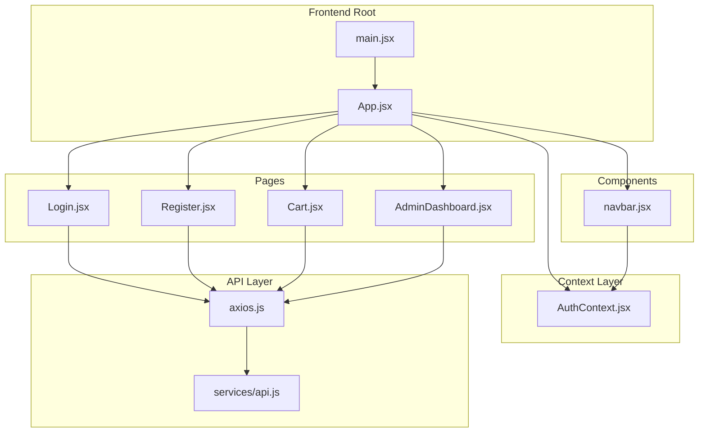
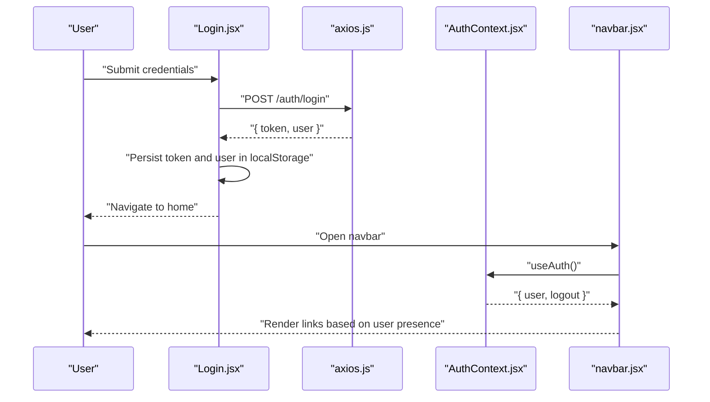
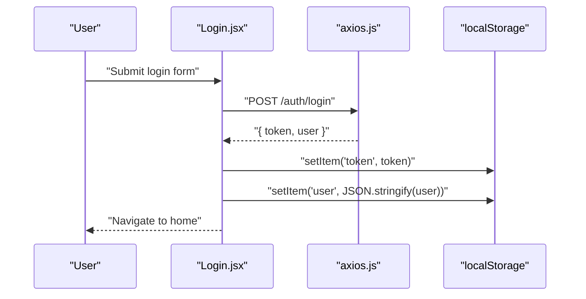
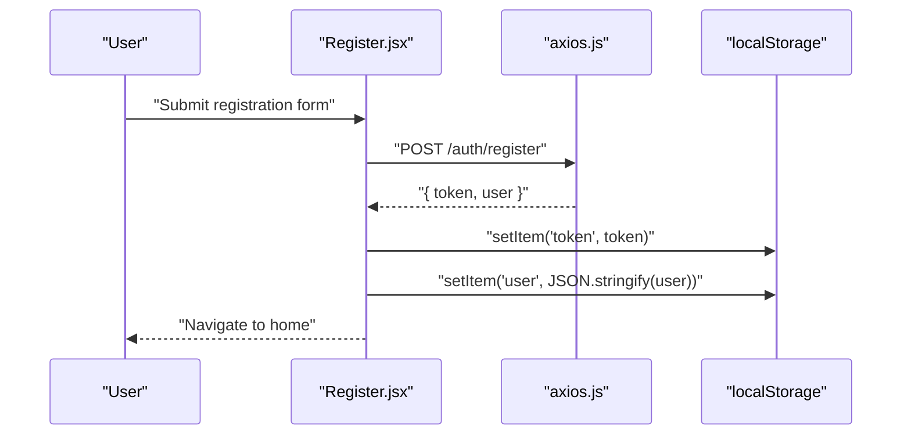
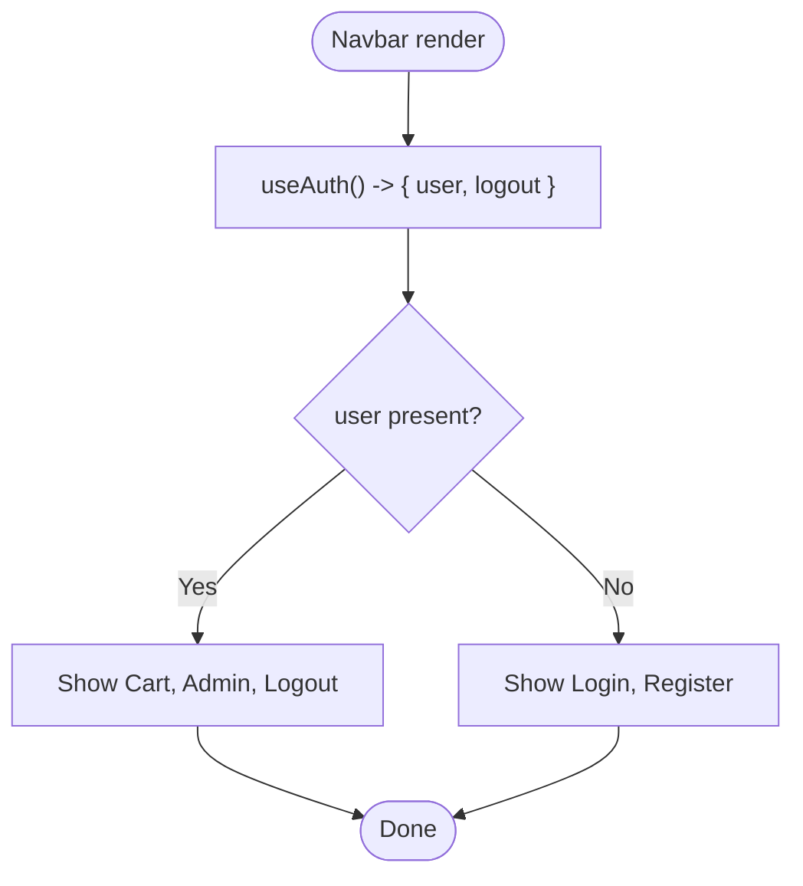
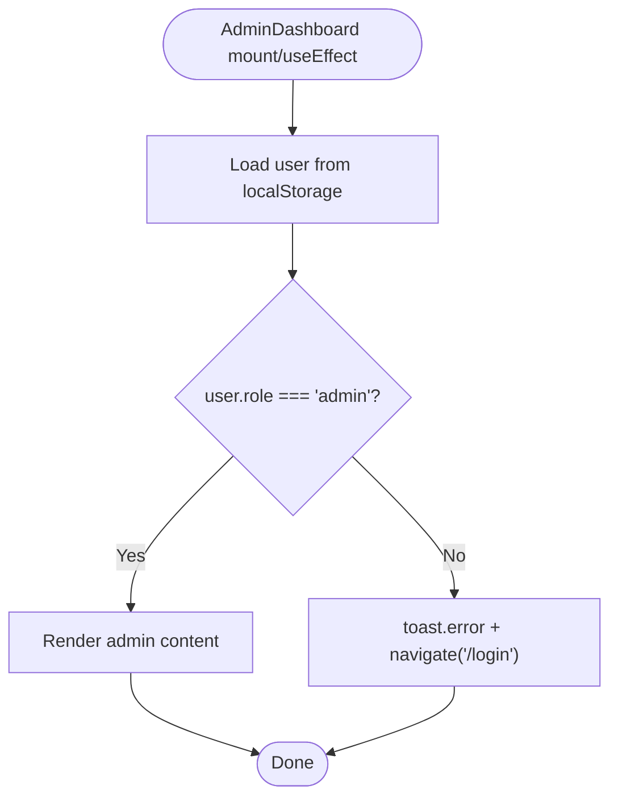
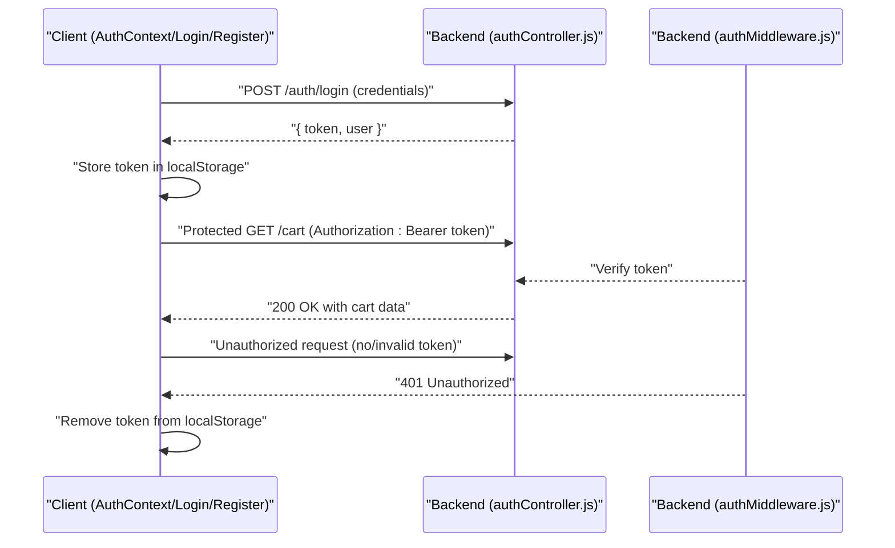
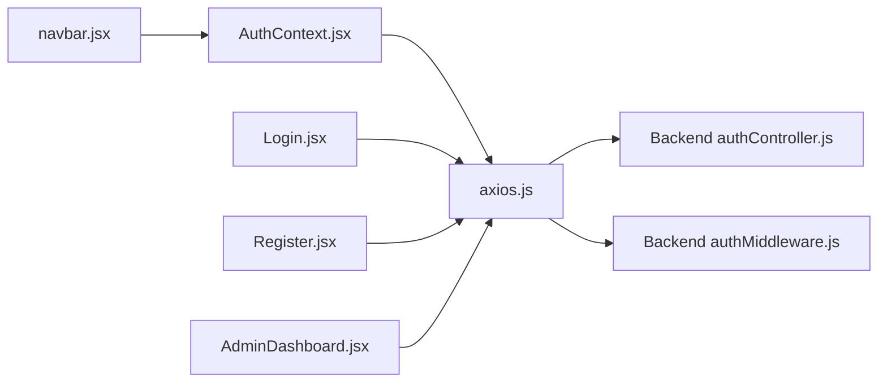

# Frontend Authentication State Management

<cite>
**Referenced Files in This Document**
- [AuthContext.jsx](file://frontend/src/context/AuthContext.jsx)
- [axios.js](file://frontend/src/api/axios.js)
- [api.js](file://frontend/src/services/api.js)
- [App.jsx](file://frontend/src/App.jsx)
- [main.jsx](file://frontend/src/main.jsx)
- [Login.jsx](file://frontend/src/pages/Login.jsx)
- [Register.jsx](file://frontend/src/pages/Register.jsx)
- [navbar.jsx](file://frontend/src/components/navbar.jsx)
- [Cart.jsx](file://frontend/src/pages/Cart.jsx)
- [AdminDashboard.jsx](file://frontend/src/pages/AdminDashboard.jsx)
- [authController.js](file://backend/controllers/authController.js)
- [authMiddleware.js](file://backend/middleware/authMiddleware.js)
</cite>

## Table of Contents
1. [Introduction](#introduction)
2. [Project Structure](#project-structure)
3. [Core Components](#core-components)
4. [Architecture Overview](#architecture-overview)
5. [Detailed Component Analysis](#detailed-component-analysis)
6. [Dependency Analysis](#dependency-analysis)
7. [Performance Considerations](#performance-considerations)
8. [Troubleshooting Guide](#troubleshooting-guide)
9. [Conclusion](#conclusion)

## Introduction
This document explains the frontend authentication state management built with React Context API. It covers the AuthContext implementation, including user state management, authentication status tracking, and token storage strategies. It documents the provider setup, consumer patterns via hooks, and how authentication integrates with routing and UI updates. Practical examples show how components consume authentication state, how login/logout updates state, and how errors are handled. It also addresses state persistence across reloads, memory management, cleanup, routing guards, and conditional UI rendering for authenticated vs unauthenticated users.

## Project Structure
The authentication implementation centers around a React Context provider and supporting API utilities. The main application mounts the provider at the root, exposing authentication state to all components. Pages and components consume the context to render conditionally and trigger authentication actions.



**Diagram sources**
- [main.jsx:1-10](file://frontend/src/main.jsx#L1-L10)
- [App.jsx:1-66](file://frontend/src/App.jsx#L1-L66)
- [AuthContext.jsx:1-33](file://frontend/src/context/AuthContext.jsx#L1-L33)
- [Login.jsx:1-56](file://frontend/src/pages/Login.jsx#L1-L56)
- [Register.jsx:1-67](file://frontend/src/pages/Register.jsx#L1-L67)
- [Cart.jsx:1-152](file://frontend/src/pages/Cart.jsx#L1-L152)
- [AdminDashboard.jsx:1-259](file://frontend/src/pages/AdminDashboard.jsx#L1-L259)
- [navbar.jsx:1-26](file://frontend/src/components/navbar.jsx#L1-L26)
- [axios.js:1-17](file://frontend/src/api/axios.js#L1-L17)
- [api.js:1-8](file://frontend/src/services/api.js#L1-L8)

**Section sources**
- [main.jsx:1-10](file://frontend/src/main.jsx#L1-L10)
- [App.jsx:1-66](file://frontend/src/App.jsx#L1-L66)

## Core Components
- AuthContext provider manages user state, loading state, and exposes login/logout functions. It persists user and token in localStorage and restores user state on mount.
- useAuth hook gives components access to authentication state and actions.
- Axios interceptors attach the Bearer token to outgoing requests and clear token on 401 responses.
- Pages Login and Register demonstrate manual token and user persistence during auth flows.
- Navbar demonstrates conditional rendering based on authentication state.
- AdminDashboard performs client-side admin guard checks using persisted user data.

Key implementation references:
- Provider initialization and state restoration: [AuthContext.jsx:6-14](file://frontend/src/context/AuthContext.jsx#L6-L14)
- Login action and token/user persistence: [AuthContext.jsx:16-22](file://frontend/src/context/AuthContext.jsx#L16-L22)
- Logout action and cleanup: [AuthContext.jsx:24-28](file://frontend/src/context/AuthContext.jsx#L24-L28)
- Hook export: [AuthContext.jsx:33](file://frontend/src/context/AuthContext.jsx#L33)
- Token injection interceptor: [axios.js:4-8](file://frontend/src/api/axios.js#L4-L8)
- 401 cleanup interceptor: [axios.js:10-16](file://frontend/src/api/axios.js#L10-L16)
- Manual token persistence in Login: [Login.jsx:13-17](file://frontend/src/pages/Login.jsx#L13-L17)
- Manual token persistence in Register: [Register.jsx:14-18](file://frontend/src/pages/Register.jsx#L14-L18)
- Conditional navigation in Navbar: [navbar.jsx:11-22](file://frontend/src/components/navbar.jsx#L11-L22)
- Client-side admin guard: [AdminDashboard.jsx:34-40](file://frontend/src/pages/AdminDashboard.jsx#L34-L40)

**Section sources**
- [AuthContext.jsx:1-33](file://frontend/src/context/AuthContext.jsx#L1-L33)
- [axios.js:1-17](file://frontend/src/api/axios.js#L1-L17)
- [Login.jsx:1-56](file://frontend/src/pages/Login.jsx#L1-L56)
- [Register.jsx:1-67](file://frontend/src/pages/Register.jsx#L1-L67)
- [navbar.jsx:1-26](file://frontend/src/components/navbar.jsx#L1-L26)
- [AdminDashboard.jsx:1-259](file://frontend/src/pages/AdminDashboard.jsx#L1-L259)

## Architecture Overview
The authentication architecture combines a React Context provider with centralized API configuration. On startup, the provider restores user state from localStorage. Login and logout actions update both in-memory state and localStorage. Axios interceptors automatically attach tokens to requests and handle token removal on unauthorized responses. UI components consume the context to adapt behavior and visibility based on authentication status.



**Diagram sources**
- [Login.jsx:10-21](file://frontend/src/pages/Login.jsx#L10-L21)
- [axios.js:1-17](file://frontend/src/api/axios.js#L1-L17)
- [AuthContext.jsx:16-22](file://frontend/src/context/AuthContext.jsx#L16-L22)
- [navbar.jsx:4-22](file://frontend/src/components/navbar.jsx#L4-L22)

## Detailed Component Analysis

### AuthContext Provider and Hooks
The provider initializes state, restores user from localStorage, and exposes login/logout functions. The hook returns the current user, loading state, and actions.

```mermaid
classDiagram
class AuthProvider {
+useState(user)
+useState(loading)
+useEffect(init)
+login(email, password)
+logout()
}
class useAuth {
+returns : "{ user, login, logout, loading }"
}
AuthProvider --> useAuth : "exposes via context"
```

**Diagram sources**
- [AuthContext.jsx:6-33](file://frontend/src/context/AuthContext.jsx#L6-L33)

Implementation highlights:
- State restoration on mount: [AuthContext.jsx:10-14](file://frontend/src/context/AuthContext.jsx#L10-L14)
- Login persists token and user, updates state: [AuthContext.jsx:16-22](file://frontend/src/context/AuthContext.jsx#L16-L22)
- Logout clears token and user, resets state: [AuthContext.jsx:24-28](file://frontend/src/context/AuthContext.jsx#L24-L28)
- Hook consumers: [navbar.jsx:4-5](file://frontend/src/components/navbar.jsx#L4-L5), [Cart.jsx:1-2](file://frontend/src/pages/Cart.jsx#L1-L2)

**Section sources**
- [AuthContext.jsx:1-33](file://frontend/src/context/AuthContext.jsx#L1-L33)
- [navbar.jsx:1-26](file://frontend/src/components/navbar.jsx#L1-L26)
- [Cart.jsx:1-152](file://frontend/src/pages/Cart.jsx#L1-L152)

### API Interceptors and Token Management
Axios interceptors centralize token handling:
- Request interceptor reads token from localStorage and attaches Authorization header.
- Response interceptor detects 401 and removes token to prevent stale auth state.


**Diagram sources**
- [axios.js:4-16](file://frontend/src/api/axios.js#L4-L16)

Practical implications:
- Automatic token propagation for protected endpoints.
- Cleanup on 401 prevents inconsistent state after server-side session invalidation.

**Section sources**
- [axios.js:1-17](file://frontend/src/api/axios.js#L1-L17)

### Login Page Integration
The Login page handles form submission, calls the backend, persists token and user, and navigates on success. It mirrors the provider’s login flow by storing token and user in localStorage.



**Diagram sources**
- [Login.jsx:10-21](file://frontend/src/pages/Login.jsx#L10-L21)
- [axios.js:1-17](file://frontend/src/api/axios.js#L1-L17)

**Section sources**
- [Login.jsx:1-56](file://frontend/src/pages/Login.jsx#L1-L56)

### Register Page Integration
Similar to Login, the Register page persists token and user upon successful registration.



**Diagram sources**
- [Register.jsx:11-22](file://frontend/src/pages/Register.jsx#L11-L22)
- [axios.js:1-17](file://frontend/src/api/axios.js#L1-L17)

**Section sources**
- [Register.jsx:1-67](file://frontend/src/pages/Register.jsx#L1-L67)

### Navbar Conditional Rendering
The Navbar consumes authentication state to switch between authenticated and unauthenticated navigation links and to trigger logout.



**Diagram sources**
- [navbar.jsx:4-22](file://frontend/src/components/navbar.jsx#L4-L22)
- [AuthContext.jsx:33](file://frontend/src/context/AuthContext.jsx#L33)

**Section sources**
- [navbar.jsx:1-26](file://frontend/src/components/navbar.jsx#L1-L26)

### Admin Dashboard Client-Side Guard
The AdminDashboard performs a client-side check using persisted user data to ensure only admins proceed. If not authorized, it notifies and redirects to login.



**Diagram sources**
- [AdminDashboard.jsx:34-40](file://frontend/src/pages/AdminDashboard.jsx#L34-L40)

**Section sources**
- [AdminDashboard.jsx:1-259](file://frontend/src/pages/AdminDashboard.jsx#L1-L259)

### Integration with Backend Authentication
Backend controllers issue JWT tokens and middleware enforces protection and admin roles. Frontend relies on the token stored in localStorage for Authorization headers.



**Diagram sources**
- [authController.js:18-27](file://backend/controllers/authController.js#L18-L27)
- [authMiddleware.js:4-15](file://backend/middleware/authMiddleware.js#L4-L15)
- [axios.js:4-16](file://frontend/src/api/axios.js#L4-L16)

**Section sources**
- [authController.js:1-27](file://backend/controllers/authController.js#L1-L27)
- [authMiddleware.js:1-20](file://backend/middleware/authMiddleware.js#L1-L20)
- [axios.js:1-17](file://frontend/src/api/axios.js#L1-L17)

## Dependency Analysis
The authentication system exhibits clear separation of concerns:
- AuthContext manages state and actions.
- Axios interceptors encapsulate token handling.
- Pages and components consume the context via useAuth.
- Backend enforces authorization and admin checks.



**Diagram sources**
- [AuthContext.jsx:1-33](file://frontend/src/context/AuthContext.jsx#L1-L33)
- [axios.js:1-17](file://frontend/src/api/axios.js#L1-L17)
- [Login.jsx:1-56](file://frontend/src/pages/Login.jsx#L1-L56)
- [Register.jsx:1-67](file://frontend/src/pages/Register.jsx#L1-L67)
- [navbar.jsx:1-26](file://frontend/src/components/navbar.jsx#L1-L26)
- [AdminDashboard.jsx:1-259](file://frontend/src/pages/AdminDashboard.jsx#L1-L259)
- [authController.js:1-27](file://backend/controllers/authController.js#L1-L27)
- [authMiddleware.js:1-20](file://backend/middleware/authMiddleware.js#L1-L20)

**Section sources**
- [AuthContext.jsx:1-33](file://frontend/src/context/AuthContext.jsx#L1-L33)
- [axios.js:1-17](file://frontend/src/api/axios.js#L1-L17)
- [Login.jsx:1-56](file://frontend/src/pages/Login.jsx#L1-L56)
- [Register.jsx:1-67](file://frontend/src/pages/Register.jsx#L1-L67)
- [navbar.jsx:1-26](file://frontend/src/components/navbar.jsx#L1-L26)
- [AdminDashboard.jsx:1-259](file://frontend/src/pages/AdminDashboard.jsx#L1-L259)
- [authController.js:1-27](file://backend/controllers/authController.js#L1-L27)
- [authMiddleware.js:1-20](file://backend/middleware/authMiddleware.js#L1-L20)

## Performance Considerations
- Minimize re-renders by keeping authentication state granular and avoiding unnecessary provider wrapping around heavy subtrees.
- Persist only essential user data to localStorage to reduce parse overhead on boot.
- Debounce or batch UI updates after login/logout to avoid rapid state churn.
- Use memoization for derived values (e.g., role checks) if computed frequently.

## Troubleshooting Guide
Common issues and resolutions:
- Stale token leading to 401:
  - Symptom: Requests fail with 401 Unauthorized.
  - Resolution: The interceptor automatically removes the token on 401; ensure the provider state reflects logout.
  - References: [axios.js:10-16](file://frontend/src/api/axios.js#L10-L16)
- Login succeeds but UI does not reflect logged-in state:
  - Verify that the provider’s login action updates state and localStorage, and that components consuming useAuth re-render.
  - References: [AuthContext.jsx:16-22](file://frontend/src/context/AuthContext.jsx#L16-L22), [AuthContext.jsx:33](file://frontend/src/context/AuthContext.jsx#L33)
- Admin route accessed by non-admin:
  - Client-side guard redirects to login; confirm user role is persisted and checked.
  - References: [AdminDashboard.jsx:34-40](file://frontend/src/pages/AdminDashboard.jsx#L34-L40)
- Token not attached to requests:
  - Ensure localStorage contains a token and the interceptor is configured.
  - References: [axios.js:4-8](file://frontend/src/api/axios.js#L4-L8)

**Section sources**
- [axios.js:1-17](file://frontend/src/api/axios.js#L1-L17)
- [AuthContext.jsx:1-33](file://frontend/src/context/AuthContext.jsx#L1-L33)
- [AdminDashboard.jsx:1-259](file://frontend/src/pages/AdminDashboard.jsx#L1-L259)

## Conclusion
The frontend authentication state management leverages React Context for centralized state, localStorage for persistence, and Axios interceptors for seamless token handling. The provider exposes a clean API for login/logout and state consumption, while UI components adapt dynamically to authentication status. Client-side guards and interceptor-based cleanup help maintain a robust and user-friendly authentication experience. Extending this pattern to include token refresh, multi-tab synchronization, and server-side hydration would further enhance reliability and scalability.