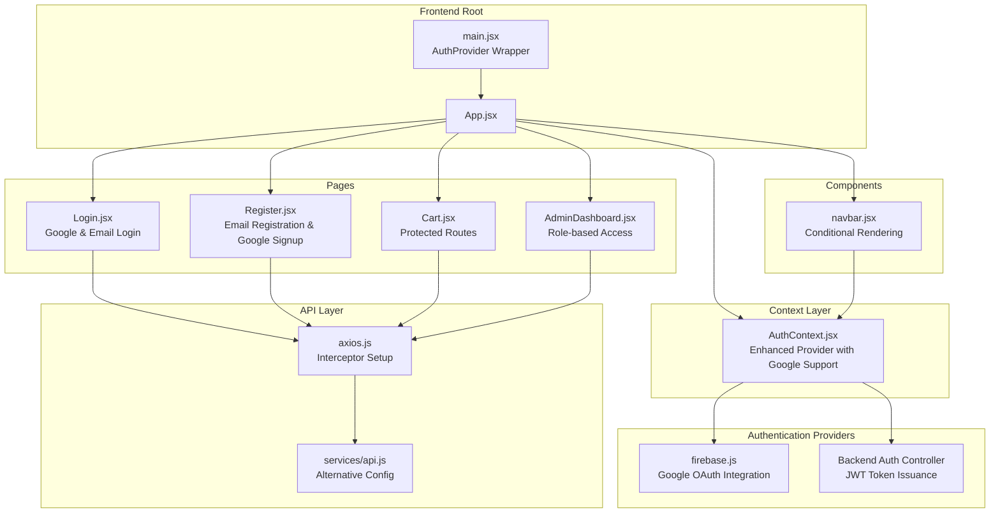
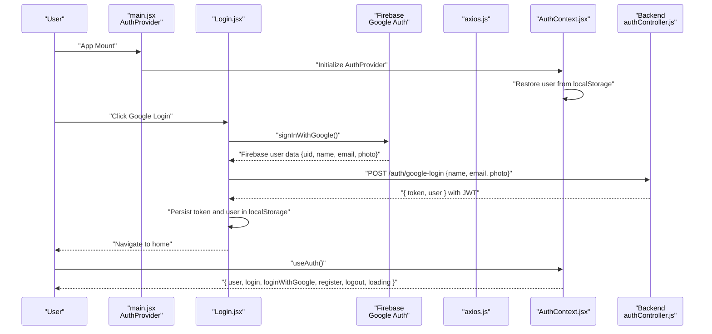
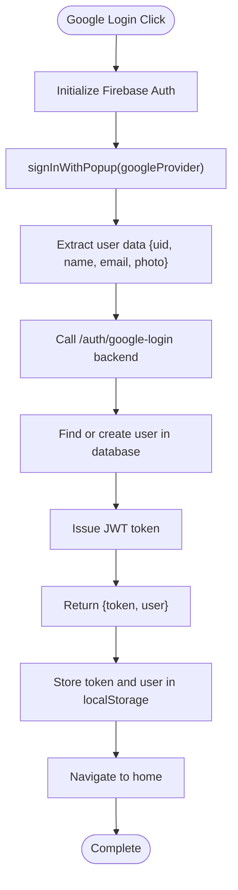
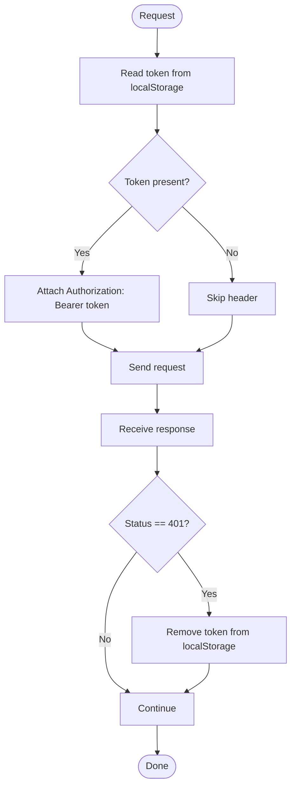
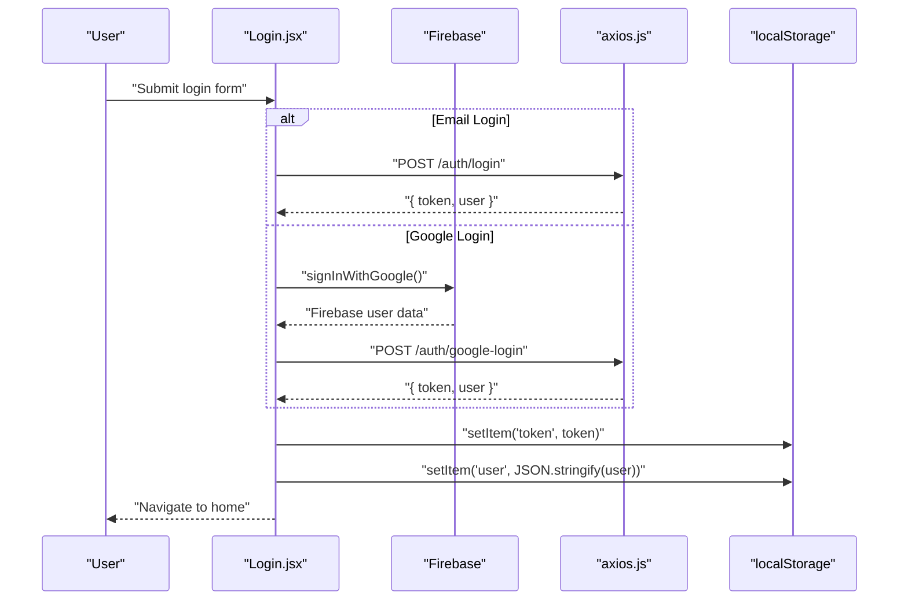
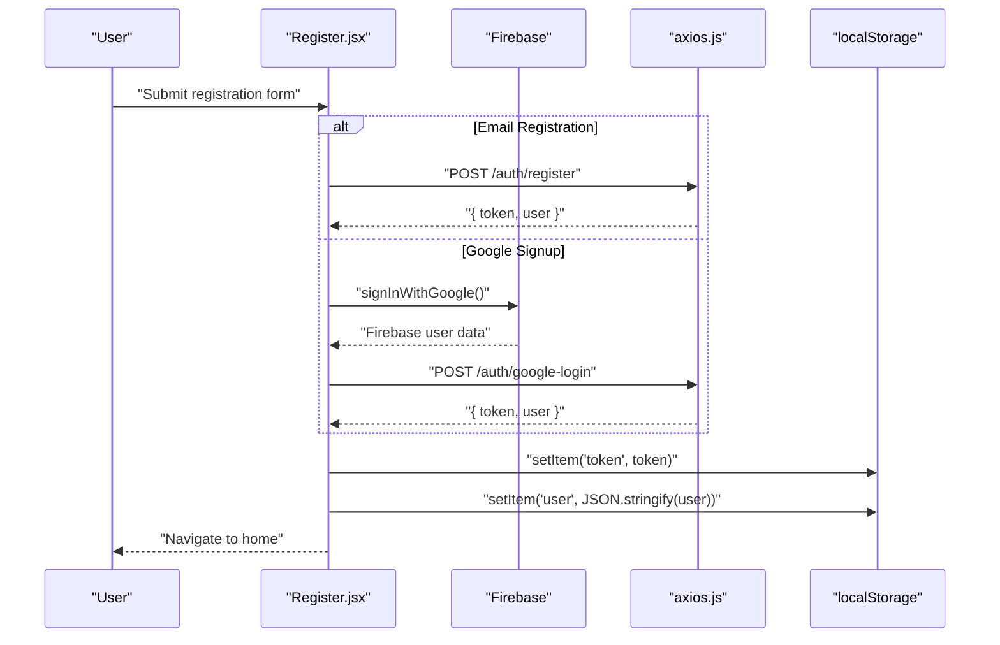
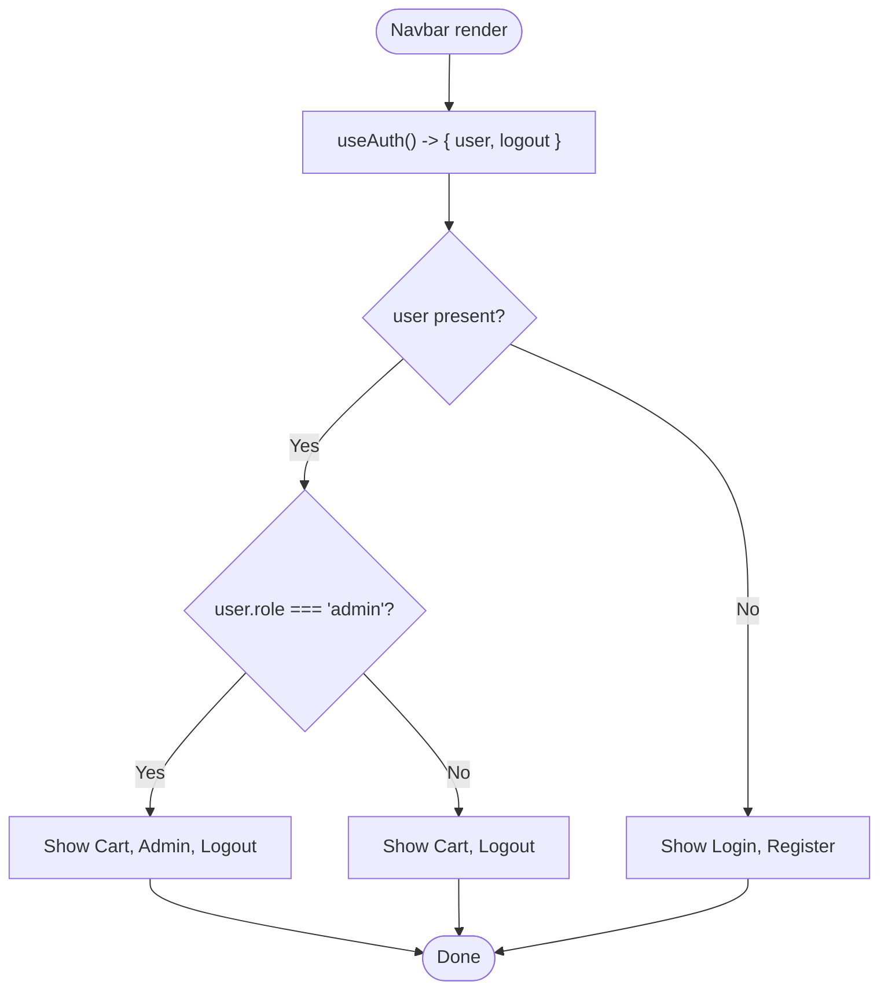
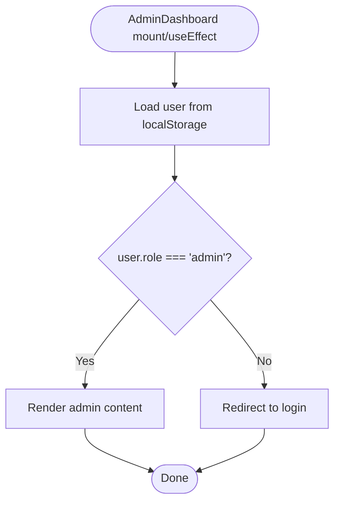
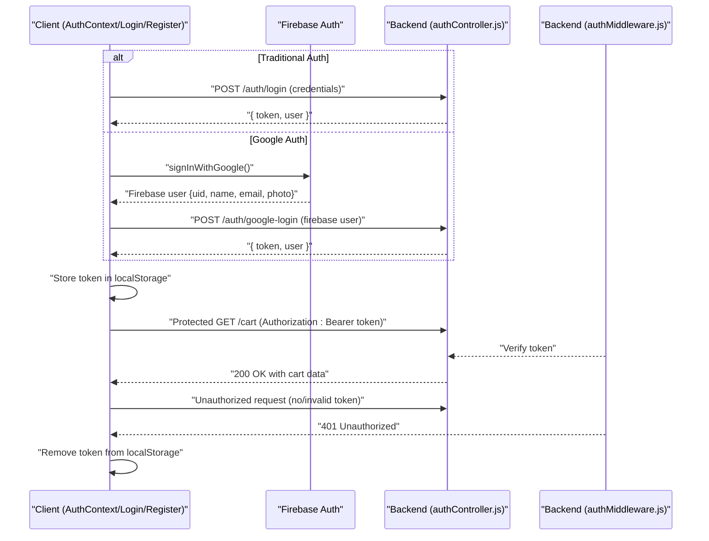
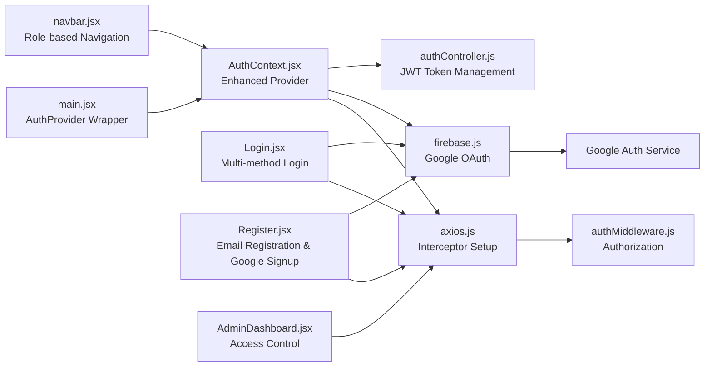

# Frontend Authentication State Management

<cite>
**Referenced Files in This Document**
- [main.jsx](file://frontend/src/main.jsx)
- [AuthContext.jsx](file://frontend/src/context/AuthContext.jsx)
- [firebase.js](file://frontend/src/config/firebase.js)
- [axios.js](file://frontend/src/api/axios.js)
- [api.js](file://frontend/src/services/api.js)
- [App.jsx](file://frontend/src/App.jsx)
- [Login.jsx](file://frontend/src/pages/Login.jsx)
- [Register.jsx](file://frontend/src/pages/Register.jsx)
- [navbar.jsx](file://frontend/src/components/navbar.jsx)
- [Cart.jsx](file://frontend/src/pages/Cart.jsx)
- [AdminDashboard.jsx](file://frontend/src/pages/AdminDashboard.jsx)
- [authController.js](file://backend/controllers/authController.js)
- [authMiddleware.js](file://backend/middleware/authMiddleware.js)
</cite>

## Update Summary
**Changes Made**
- Enhanced AuthContext with comprehensive Google authentication flow using Firebase integration
- Added loginWithGoogle function supporting seamless Google OAuth authentication
- Improved error handling with comprehensive logging and user feedback
- Integrated Firebase authentication for Google users with automatic JWT token exchange
- Updated authentication documentation to reflect multi-provider authentication support

## Table of Contents
1. [Introduction](#introduction)
2. [Project Structure](#project-structure)
3. [Core Components](#core-components)
4. [Architecture Overview](#architecture-overview)
5. [Detailed Component Analysis](#detailed-component-analysis)
6. [Dependency Analysis](#dependency-analysis)
7. [Performance Considerations](#performance-considerations)
8. [Troubleshooting Guide](#troubleshooting-guide)
9. [Conclusion](#conclusion)

## Introduction
This document explains the frontend authentication state management built with React Context API, now enhanced with comprehensive Google authentication support. The system covers the AuthContext implementation, including user state management, authentication status tracking, and token storage strategies. It documents the provider setup, consumer patterns via hooks, and how authentication integrates with routing and UI updates. The enhanced implementation now supports multiple authentication methods including traditional email/password login and Google OAuth via Firebase integration, providing seamless authentication flow across all components.

**Updated** Enhanced with comprehensive AuthProvider wrapper implementation, Firebase integration for Google authentication, and improved error handling mechanisms.

## Project Structure
The authentication implementation centers around a React Context provider with integrated Firebase authentication support. The main application now mounts the AuthProvider at the root level, ensuring proper authentication context availability throughout the application. The system now supports both traditional authentication methods and Google OAuth integration, with Firebase handling the OAuth flow and backend managing JWT token issuance.



**Diagram sources**
- [main.jsx:1-14](file://frontend/src/main.jsx#L1-L14)
- [AuthContext.jsx:1-72](file://frontend/src/context/AuthContext.jsx#L1-L72)
- [firebase.js:1-86](file://frontend/src/config/firebase.js#L1-L86)
- [authController.js:62-117](file://backend/controllers/authController.js#L62-L117)
- [Login.jsx:1-128](file://frontend/src/pages/Login.jsx#L1-L128)
- [Register.jsx:1-164](file://frontend/src/pages/Register.jsx#L1-L164)
- [navbar.jsx:1-26](file://frontend/src/components/navbar.jsx#L1-L26)
- [axios.js:1-17](file://frontend/src/api/axios.js#L1-L17)
- [api.js:1-8](file://frontend/src/services/api.js#L1-L8)

**Section sources**
- [main.jsx:1-14](file://frontend/src/main.jsx#L1-L14)
- [AuthContext.jsx:1-72](file://frontend/src/context/AuthContext.jsx#L1-L72)
- [firebase.js:1-86](file://frontend/src/config/firebase.js#L1-L86)

## Core Components
- **Enhanced AuthProvider** manages user state, loading state, and exposes comprehensive authentication methods including traditional login, Google login, email registration, and logout functions. It persists user and token in localStorage and restores user state on mount.
- **useAuth hook** provides components with access to authentication state and actions, resolving previous useAuth undefined errors through proper provider setup.
- **Firebase Integration** seamlessly handles Google OAuth authentication with automatic user data extraction and token exchange.
- **Axios interceptors** attach the Bearer token to outgoing requests and clear token on 401 responses.
- **Multi-authentication support** including Google OAuth integration via Firebase and traditional email/password authentication.
- **Enhanced error handling** with comprehensive logging and user feedback for authentication failures.
- **Pages Login and Register** demonstrate manual token and user persistence during auth flows with enhanced error handling and Google authentication support.
- **Navbar** demonstrates conditional rendering based on authentication state with improved role-based access control.
- **AdminDashboard** performs client-side admin guard checks using persisted user data with enhanced security measures.

Key implementation references:
- **Enhanced provider setup with AuthProvider wrapper**: [main.jsx:5](file://frontend/src/main.jsx#L5)
- **Provider initialization and state restoration**: [AuthContext.jsx:11-15](file://frontend/src/context/AuthContext.jsx#L11-L15)
- **Traditional login with JWT**: [AuthContext.jsx:18-24](file://frontend/src/context/AuthContext.jsx#L18-L24)
- **Google login with Firebase integration**: [AuthContext.jsx:27-46](file://frontend/src/context/AuthContext.jsx#L27-L46)
- **Email registration**: [AuthContext.jsx:49-55](file://frontend/src/context/AuthContext.jsx#L49-L55)
- **Enhanced logout with Firebase integration**: [AuthContext.jsx:57-66](file://frontend/src/context/AuthContext.jsx#L57-L66)
- **Hook export**: [AuthContext.jsx:71](file://frontend/src/context/AuthContext.jsx#L71)
- **Firebase Google authentication**: [firebase.js:21-36](file://frontend/src/config/firebase.js#L21-L36)
- **Backend Google login handler**: [authController.js:62-117](file://backend/controllers/authController.js#L62-L117)
- **Token injection interceptor**: [axios.js:4-8](file://frontend/src/api/axios.js#L4-L8)
- **401 cleanup interceptor**: [axios.js:10-16](file://frontend/src/api/axios.js#L10-L16)
- **Enhanced Login with Google support**: [Login.jsx:7](file://frontend/src/pages/Login.jsx#L7)
- **Manual token persistence in Register**: [Register.jsx:31-32](file://frontend/src/pages/Register.jsx#L31-L32)
- **Conditional navigation with role checking**: [navbar.jsx:5](file://frontend/src/components/navbar.jsx#L5)

**Section sources**
- [main.jsx:1-14](file://frontend/src/main.jsx#L1-L14)
- [AuthContext.jsx:1-72](file://frontend/src/context/AuthContext.jsx#L1-L72)
- [firebase.js:1-86](file://frontend/src/config/firebase.js#L1-L86)
- [authController.js:62-117](file://backend/controllers/authController.js#L62-L117)
- [Login.jsx:1-128](file://frontend/src/pages/Login.jsx#L1-L128)
- [Register.jsx:1-164](file://frontend/src/pages/Register.jsx#L1-L164)
- [navbar.jsx:1-26](file://frontend/src/components/navbar.jsx#L1-L26)

## Architecture Overview
The authentication architecture combines a React Context provider with centralized API configuration, Firebase integration, and backend JWT token management. On application startup, the AuthProvider wrapper ensures proper context availability throughout the app. The provider restores user state from localStorage, supports multiple authentication methods including Google OAuth via Firebase, and exposes comprehensive login/logout functions. Axios interceptors automatically attach tokens to requests and handle token removal on unauthorized responses. UI components consume the context to adapt behavior and visibility based on authentication status and user roles.



**Diagram sources**
- [main.jsx:7-13](file://frontend/src/main.jsx#L7-L13)
- [AuthContext.jsx:11-15](file://frontend/src/context/AuthContext.jsx#L11-L15)
- [AuthContext.jsx:27-46](file://frontend/src/context/AuthContext.jsx#L27-L46)
- [firebase.js:21-36](file://frontend/src/config/firebase.js#L21-L36)
- [authController.js:62-117](file://backend/controllers/authController.js#L62-L117)
- [Login.jsx:30-42](file://frontend/src/pages/Login.jsx#L30-L42)
- [axios.js:4-8](file://frontend/src/api/axios.js#L4-L8)
- [navbar.jsx:5](file://frontend/src/components/navbar.jsx#L5)

## Detailed Component Analysis

### Enhanced AuthProvider and Hook Implementation
The AuthProvider wrapper ensures proper context availability throughout the application, resolving useAuth undefined errors. The provider now supports multiple authentication methods including traditional email/password login, Google OAuth via Firebase, and email registration. The hook returns comprehensive authentication state including user data, loading states, and action functions with enhanced error handling.

```mermaid
classDiagram
class AuthProvider {
+useState(user)
+useState(loading)
+useEffect(init)
+login(email, password)
+loginWithGoogle()
+register(name, email, password)
+logout()
}
class useAuth {
+returns : "{ user, login, loginWithGoogle, register, logout, loading }"
}
class FirebaseIntegration {
+signInWithGoogle()
+signOutUser()
}
AuthProvider --> useAuth : "exposes via context"
AuthProvider --> FirebaseIntegration : "uses for Google auth"
```

**Diagram sources**
- [AuthContext.jsx:7-71](file://frontend/src/context/AuthContext.jsx#L7-L71)
- [firebase.js:21-82](file://frontend/src/config/firebase.js#L21-L82)

Implementation highlights:
- **Root-level provider setup**: [main.jsx:5](file://frontend/src/main.jsx#L5)
- **State restoration on mount**: [AuthContext.jsx:11-15](file://frontend/src/context/AuthContext.jsx#L11-L15)
- **Traditional login with JWT**: [AuthContext.jsx:18-24](file://frontend/src/context/AuthContext.jsx#L18-L24)
- **Google login with Firebase integration**: [AuthContext.jsx:27-46](file://frontend/src/context/AuthContext.jsx#L27-L46)
- **Email registration**: [AuthContext.jsx:49-55](file://frontend/src/context/AuthContext.jsx#L49-L55)
- **Enhanced logout with Firebase cleanup**: [AuthContext.jsx:57-66](file://frontend/src/context/AuthContext.jsx#L57-L66)
- **Hook consumers**: [Login.jsx:7](file://frontend/src/pages/Login.jsx#L7), [navbar.jsx:5](file://frontend/src/components/navbar.jsx#L5)

**Section sources**
- [main.jsx:1-14](file://frontend/src/main.jsx#L1-L14)
- [AuthContext.jsx:1-72](file://frontend/src/context/AuthContext.jsx#L1-L72)
- [firebase.js:1-86](file://frontend/src/config/firebase.js#L1-L86)
- [Login.jsx:1-128](file://frontend/src/pages/Login.jsx#L1-L128)
- [navbar.jsx:1-26](file://frontend/src/components/navbar.jsx#L1-L26)

### Firebase Integration for Google Authentication
The Firebase integration provides seamless Google OAuth authentication with automatic user data extraction and error handling. The system handles Google sign-in, extracts user information, and coordinates with the backend for JWT token issuance.



**Diagram sources**
- [firebase.js:21-36](file://frontend/src/config/firebase.js#L21-L36)
- [AuthContext.jsx:27-46](file://frontend/src/context/AuthContext.jsx#L27-L46)
- [authController.js:62-117](file://backend/controllers/authController.js#L62-L117)

Key implementation details:
- **Google sign-in popup**: [firebase.js:21-36](file://frontend/src/config/firebase.js#L21-L36)
- **User data extraction**: [firebase.js:24-30](file://frontend/src/config/firebase.js#L24-L30)
- **Backend coordination**: [AuthContext.jsx:27-46](file://frontend/src/context/AuthContext.jsx#L27-L46)
- **Database user management**: [authController.js:71-97](file://backend/controllers/authController.js#L71-L97)
- **JWT token issuance**: [authController.js:99](file://backend/controllers/authController.js#L99)

**Section sources**
- [firebase.js:1-86](file://frontend/src/config/firebase.js#L1-L86)
- [AuthContext.jsx:1-72](file://frontend/src/context/AuthContext.jsx#L1-L72)
- [authController.js:62-117](file://backend/controllers/authController.js#L62-L117)

### API Interceptors and Token Management
Axios interceptors centralize token handling with enhanced error management:
- Request interceptor reads token from localStorage and attaches Authorization header.
- Response interceptor detects 401 and removes token to prevent stale auth state.
- Alternative API service configuration available for different use cases.



**Diagram sources**
- [axios.js:4-16](file://frontend/src/api/axios.js#L4-L16)

Practical implications:
- Automatic token propagation for protected endpoints.
- Cleanup on 401 prevents inconsistent state after server-side session invalidation.
- Alternative API configuration available in services/api.js.

**Section sources**
- [axios.js:1-17](file://frontend/src/api/axios.js#L1-L17)
- [api.js:1-8](file://frontend/src/services/api.js#L1-L8)

### Enhanced Login Page Integration
The Login page now supports both traditional email/password authentication and Google OAuth integration. The page handles form submission, calls the backend, persists token and user, and navigates on success. It demonstrates the enhanced provider login and Google login capabilities with comprehensive error handling.



**Diagram sources**
- [Login.jsx:14-42](file://frontend/src/pages/Login.jsx#L14-L42)
- [AuthContext.jsx:18-46](file://frontend/src/context/AuthContext.jsx#L18-L46)
- [axios.js:1-17](file://frontend/src/api/axios.js#L1-L17)

**Section sources**
- [Login.jsx:1-128](file://frontend/src/pages/Login.jsx#L1-L128)

### Enhanced Register Page Integration
The Register page implements email registration with comprehensive validation and token persistence upon successful registration. It also supports Google signup through the loginWithGoogle function.



**Diagram sources**
- [Register.jsx:16-55](file://frontend/src/pages/Register.jsx#L16-L55)
- [AuthContext.jsx:49-55](file://frontend/src/context/AuthContext.jsx#L49-L55)
- [axios.js:1-17](file://frontend/src/api/axios.js#L1-L17)

**Section sources**
- [Register.jsx:1-164](file://frontend/src/pages/Register.jsx#L1-L164)

### Enhanced Navbar Conditional Rendering
The Navbar consumes authentication state to switch between authenticated and unauthenticated navigation links, with enhanced role-based access control for admin users.



**Diagram sources**
- [navbar.jsx:5](file://frontend/src/components/navbar.jsx#L5)
- [AuthContext.jsx:71](file://frontend/src/context/AuthContext.jsx#L71)

**Section sources**
- [navbar.jsx:1-26](file://frontend/src/components/navbar.jsx#L1-L26)

### Admin Dashboard Client-Side Guard
The AdminDashboard performs client-side role-based access control using persisted user data to ensure only administrators can access admin routes.



**Diagram sources**
- [App.jsx:106-123](file://frontend/src/App.jsx#L106-L123)

**Section sources**
- [App.jsx:1-249](file://frontend/src/App.jsx#L1-L249)

### Integration with Backend Authentication
Backend controllers issue JWT tokens and middleware enforces protection and admin roles. Frontend relies on the token stored in localStorage for Authorization headers, with enhanced support for Firebase-based authentication flows including Google OAuth integration.



**Diagram sources**
- [AuthContext.jsx:18-46](file://frontend/src/context/AuthContext.jsx#L18-L46)
- [firebase.js:21-36](file://frontend/src/config/firebase.js#L21-L36)
- [authController.js:18-27](file://backend/controllers/authController.js#L18-L27)
- [authController.js:62-117](file://backend/controllers/authController.js#L62-L117)
- [authMiddleware.js:4-15](file://backend/middleware/authMiddleware.js#L4-L15)
- [axios.js:4-16](file://frontend/src/api/axios.js#L4-L16)

**Section sources**
- [AuthContext.jsx:1-72](file://frontend/src/context/AuthContext.jsx#L1-L72)
- [firebase.js:1-86](file://frontend/src/config/firebase.js#L1-L86)
- [authController.js:1-117](file://backend/controllers/authController.js#L1-L117)
- [authMiddleware.js:1-20](file://backend/middleware/authMiddleware.js#L1-L20)
- [axios.js:1-17](file://frontend/src/api/axios.js#L1-L17)

## Dependency Analysis
The authentication system exhibits clear separation of concerns with enhanced provider architecture:
- **Enhanced AuthProvider** manages state and actions with comprehensive authentication methods including Google OAuth.
- **Firebase Integration** provides Google OAuth capabilities with automatic user data extraction.
- **Axios interceptors** encapsulate token handling with improved error management.
- **Pages and components** consume the context via useAuth hook with proper provider setup.
- **Backend** enforces authorization and admin checks with JWT token management.
- **Error Handling** provides comprehensive logging and user feedback.



**Diagram sources**
- [main.jsx:1-14](file://frontend/src/main.jsx#L1-L14)
- [AuthContext.jsx:1-72](file://frontend/src/context/AuthContext.jsx#L1-L72)
- [firebase.js:1-86](file://frontend/src/config/firebase.js#L1-L86)
- [authController.js:1-117](file://backend/controllers/authController.js#L1-L117)
- [Login.jsx:1-128](file://frontend/src/pages/Login.jsx#L1-L128)
- [Register.jsx:1-164](file://frontend/src/pages/Register.jsx#L1-L164)
- [navbar.jsx:1-26](file://frontend/src/components/navbar.jsx#L1-L26)
- [axios.js:1-17](file://frontend/src/api/axios.js#L1-L17)
- [authMiddleware.js:1-20](file://backend/middleware/authMiddleware.js#L1-L20)

**Section sources**
- [main.jsx:1-14](file://frontend/src/main.jsx#L1-L14)
- [AuthContext.jsx:1-72](file://frontend/src/context/AuthContext.jsx#L1-L72)
- [firebase.js:1-86](file://frontend/src/config/firebase.js#L1-L86)
- [authController.js:1-117](file://backend/controllers/authController.js#L1-L117)
- [Login.jsx:1-128](file://frontend/src/pages/Login.jsx#L1-L128)
- [Register.jsx:1-164](file://frontend/src/pages/Register.jsx#L1-L164)
- [navbar.jsx:1-26](file://frontend/src/components/navbar.jsx#L1-L26)
- [axios.js:1-17](file://frontend/src/api/axios.js#L1-L17)
- [authMiddleware.js:1-20](file://backend/middleware/authMiddleware.js#L1-L20)

## Performance Considerations
- **Minimize re-renders** by keeping authentication state granular and avoiding unnecessary provider wrapping around heavy subtrees.
- **Persist only essential user data** to localStorage to reduce parse overhead on boot.
- **Debounce or batch UI updates** after login/logout to avoid rapid state churn.
- **Use memoization** for derived values (e.g., role checks) if computed frequently.
- **Optimize Firebase integration** by implementing proper cleanup and error handling.
- **Implement lazy loading** for authentication-related components to improve initial load performance.
- **Cache Firebase user data** to avoid repeated API calls during session.
- **Batch localStorage operations** to reduce write overhead during authentication.

## Troubleshooting Guide
Common issues and resolutions with enhanced authentication setup:

### Critical Authentication Context Issues
- **useAuth undefined errors**:
  - **Symptom**: Components throw "Cannot read property 'useAuth' of undefined" errors.
  - **Root cause**: Missing AuthProvider wrapper in main.jsx.
  - **Resolution**: Ensure AuthProvider wraps the App component in main.jsx.
  - **References**: [main.jsx:5](file://frontend/src/main.jsx#L5)

### Google Authentication Issues
- **Google login fails with Firebase errors**:
  - **Symptom**: Google OAuth integration throws Firebase-related errors.
  - **Root cause**: Firebase configuration issues, CORS restrictions, or backend endpoint problems.
  - **Resolution**: Check Firebase configuration, ensure proper CORS settings, verify backend Google login endpoint, and validate user data extraction.
  - **References**: [AuthContext.jsx:27-46](file://frontend/src/context/AuthContext.jsx#L27-L46), [firebase.js:21-36](file://frontend/src/config/firebase.js#L21-L36), [authController.js:62-117](file://backend/controllers/authController.js#L62-L117)

- **Google login succeeds but JWT token not received**:
  - **Symptom**: User authenticates with Google but receives no JWT token.
  - **Root cause**: Backend google-login endpoint failure or user creation/update issues.
  - **Resolution**: Check backend logs for user creation errors, verify database connectivity, and ensure proper JWT token issuance.
  - **References**: [AuthContext.jsx:27-46](file://frontend/src/context/AuthContext.jsx#L27-L46), [authController.js:71-97](file://backend/controllers/authController.js#L71-L97)

### Authentication Flow Issues
- **Stale token leading to 401**:
  - **Symptom**: Requests fail with 401 Unauthorized.
  - **Resolution**: The interceptor automatically removes the token on 401; ensure the provider state reflects logout.
  - **References**: [axios.js:10-16](file://frontend/src/api/axios.js#L10-L16)

- **Login succeeds but UI does not reflect logged-in state**:
  - **Symptom**: User appears logged out despite successful authentication.
  - **Resolution**: Verify that the provider's login action updates state and localStorage, and that components consuming useAuth re-render.
  - **References**: [AuthContext.jsx:18-24](file://frontend/src/context/AuthContext.jsx#L18-L24), [AuthContext.jsx:71](file://frontend/src/context/AuthContext.jsx#L71)

- **Admin route accessed by non-admin**:
  - **Symptom**: Non-admin users can access admin routes.
  - **Resolution**: Client-side guard redirects to login; confirm user role is persisted and checked.
  - **References**: [App.jsx:106-123](file://frontend/src/App.jsx#L106-L123)

- **Token not attached to requests**:
  - **Symptom**: Protected routes return 401 despite being logged in.
  - **Resolution**: Ensure localStorage contains a token and the interceptor is configured.
  - **References**: [axios.js:4-8](file://frontend/src/api/axios.js#L4-L8)

### Provider and Hook Issues
- **Authentication state not persisting across reloads**:
  - **Symptom**: User loses authentication after page refresh.
  - **Resolution**: Verify localStorage persistence and provider initialization timing.
  - **References**: [AuthContext.jsx:11-15](file://frontend/src/context/AuthContext.jsx#L11-L15)

- **Memory leaks in authentication components**:
  - **Symptom**: Components not properly cleaning up event listeners or subscriptions.
  - **Resolution**: Implement proper cleanup in useEffect hooks and ensure proper component unmounting.
  - **References**: [AuthContext.jsx:11-15](file://frontend/src/context/AuthContext.jsx#L11-L15)

- **Firebase sign-out errors**:
  - **Symptom**: Error occurs when attempting to sign out from Firebase.
  - **Resolution**: Check Firebase auth state and ensure proper error handling in logout function.
  - **References**: [AuthContext.jsx:57-66](file://frontend/src/context/AuthContext.jsx#L57-L66), [firebase.js:75-82](file://frontend/src/config/firebase.js#L75-L82)

**Section sources**
- [main.jsx:1-14](file://frontend/src/main.jsx#L1-L14)
- [AuthContext.jsx:1-72](file://frontend/src/context/AuthContext.jsx#L1-L72)
- [firebase.js:1-86](file://frontend/src/config/firebase.js#L1-L86)
- [authController.js:1-117](file://backend/controllers/authController.js#L1-L117)
- [axios.js:1-17](file://frontend/src/api/axios.js#L1-L17)
- [App.jsx:1-249](file://frontend/src/App.jsx#L1-L249)

## Conclusion
The frontend authentication state management leverages React Context for centralized state, localStorage for persistence, and Axios interceptors for seamless token handling. The enhanced implementation includes comprehensive AuthProvider wrapper setup in main.jsx, resolving useAuth undefined errors and enabling seamless authentication flow across all components. The system now supports multiple authentication methods including traditional email/password login and Google OAuth via Firebase integration, providing a robust and user-friendly authentication experience. The enhanced error handling, comprehensive logging, and seamless Firebase integration make the authentication flow reliable and maintainable. Extending this pattern to include token refresh, multi-tab synchronization, and server-side hydration would further enhance reliability and scalability.