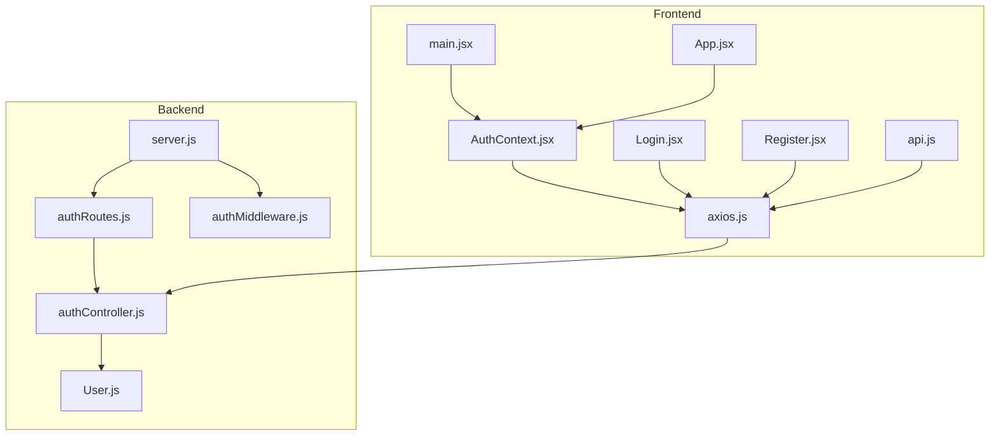
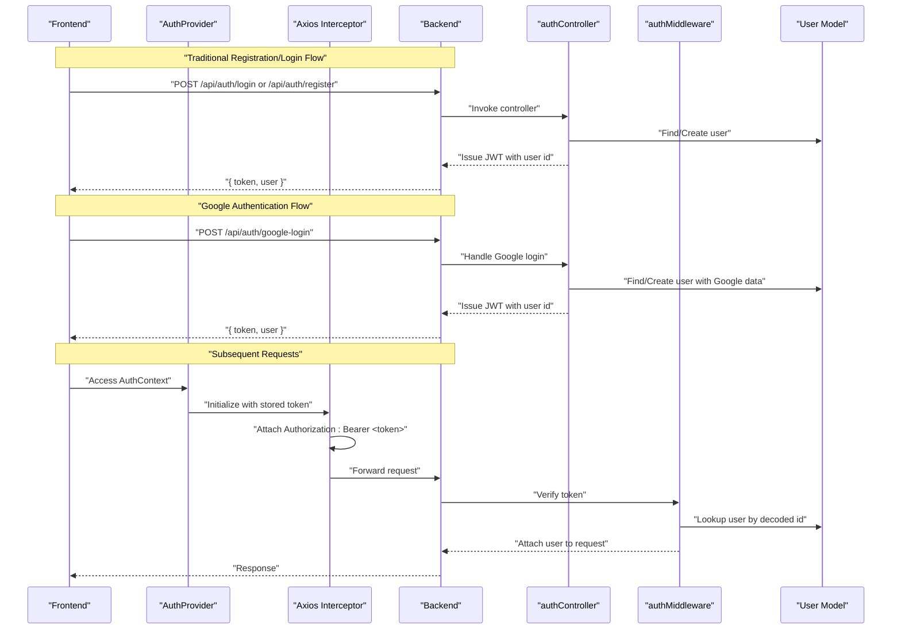
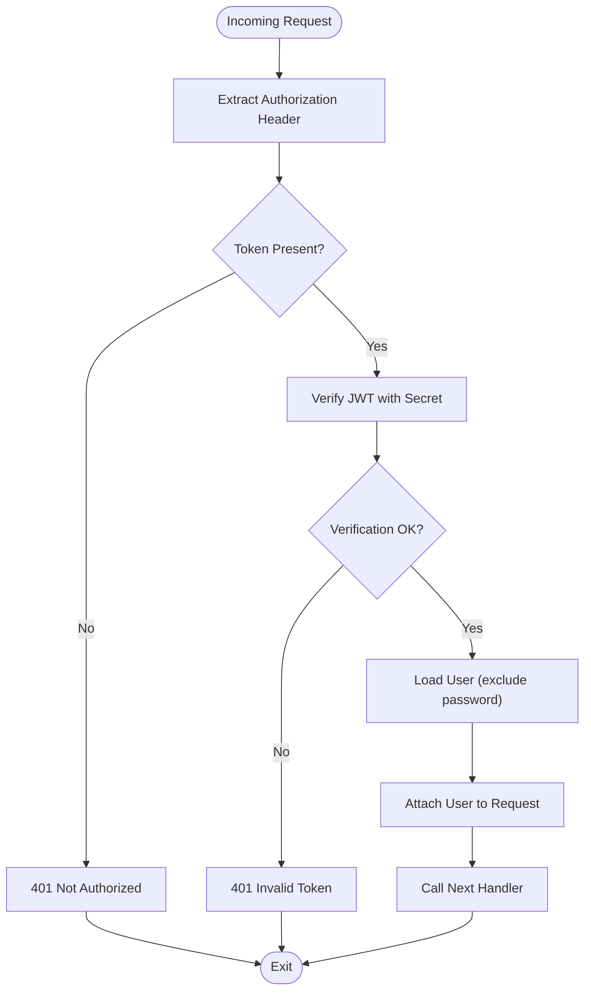
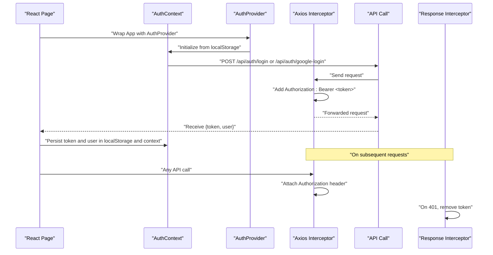
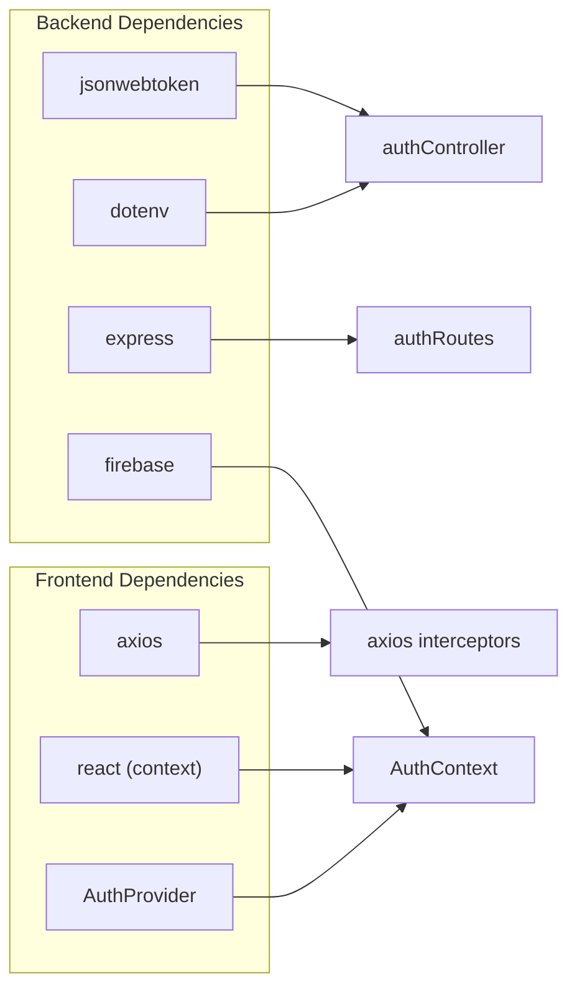

# JWT Token Flow & Management

<cite>
**Referenced Files in This Document**
- [main.jsx](file://frontend/src/main.jsx)
- [AuthContext.jsx](file://frontend/src/context/AuthContext.jsx)
- [authController.js](file://backend/controllers/authController.js)
- [authMiddleware.js](file://backend/middleware/authMiddleware.js)
- [User.js](file://backend/models/User.js)
- [authRoutes.js](file://backend/routes/authRoutes.js)
- [server.js](file://backend/server.js)
- [axios.js](file://frontend/src/api/axios.js)
- [api.js](file://frontend/src/services/api.js)
- [Login.jsx](file://frontend/src/pages/Login.jsx)
- [Register.jsx](file://frontend/src/pages/Register.jsx)
- [App.jsx](file://frontend/src/App.jsx)
- [package.json](file://backend/package.json)
- [package.json](file://frontend/package.json)
</cite>

## Update Summary
**Changes Made**
- Updated Authentication Infrastructure section to reflect proper AuthProvider setup in main.jsx
- Enhanced Frontend Token Management section with improved context initialization
- Added comprehensive Google authentication support documentation
- Updated Architecture Overview to include Google login flow
- Enhanced Security Considerations with Google authentication implications

## Table of Contents
1. [Introduction](#introduction)
2. [Project Structure](#project-structure)
3. [Core Components](#core-components)
4. [Architecture Overview](#architecture-overview)
5. [Detailed Component Analysis](#detailed-component-analysis)
6. [Dependency Analysis](#dependency-analysis)
7. [Performance Considerations](#performance-considerations)
8. [Troubleshooting Guide](#troubleshooting-guide)
9. [Conclusion](#conclusion)

## Introduction
This document explains the JWT-based authentication token lifecycle in the E-commerce App, covering token generation during registration and login, middleware verification, token expiration handling, and frontend token management. The system now includes comprehensive authentication infrastructure with proper context initialization, Google authentication support, and enhanced security considerations. It documents the JWT_SECRET environment variable configuration, token payload structure, secure transmission, storage mechanisms, and error handling strategies.

## Project Structure
The authentication system spans backend controllers, middleware, routes, and models, and integrates with the frontend via Axios interceptors and React context. The backend exposes authentication endpoints including traditional login/register and Google authentication, while the frontend persists tokens and injects Authorization headers automatically through a properly initialized AuthProvider.

**Diagram sources**
- [server.js:1-120](file://backend/server.js#L1-L120)
- [authRoutes.js:1-11](file://backend/routes/authRoutes.js#L1-L11)
- [authController.js:1-111](file://backend/controllers/authController.js#L1-L111)
- [authMiddleware.js:1-20](file://backend/middleware/authMiddleware.js#L1-L20)
- [User.js:1-20](file://backend/models/User.js#L1-L20)
- [main.jsx:1-14](file://frontend/src/main.jsx#L1-L14)
- [axios.js:1-17](file://frontend/src/api/axios.js#L1-L17)
- [api.js:1-8](file://frontend/src/services/api.js#L1-L8)
- [Login.jsx:1-56](file://frontend/src/pages/Login.jsx#L1-L56)
- [Register.jsx:1-67](file://frontend/src/pages/Register.jsx#L1-L67)
- [AuthContext.jsx:1-72](file://frontend/src/context/AuthContext.jsx#L1-L72)
- [App.jsx:1-249](file://frontend/src/App.jsx#L1-L249)

**Section sources**
- [server.js:1-120](file://backend/server.js#L1-L120)
- [authRoutes.js:1-11](file://backend/routes/authRoutes.js#L1-L11)
- [authController.js:1-111](file://backend/controllers/authController.js#L1-L111)
- [authMiddleware.js:1-20](file://backend/middleware/authMiddleware.js#L1-L20)
- [User.js:1-20](file://backend/models/User.js#L1-L20)
- [main.jsx:1-14](file://frontend/src/main.jsx#L1-L14)
- [axios.js:1-17](file://frontend/src/api/axios.js#L1-L17)
- [api.js:1-8](file://frontend/src/services/api.js#L1-L8)
- [Login.jsx:1-56](file://frontend/src/pages/Login.jsx#L1-L56)
- [Register.jsx:1-67](file://frontend/src/pages/Register.jsx#L1-L67)
- [AuthContext.jsx:1-72](file://frontend/src/context/AuthContext.jsx#L1-L72)
- [App.jsx:1-249](file://frontend/src/App.jsx#L1-L249)

## Core Components
- **Backend JWT signing and verification**:
  - Token generation uses a signing function that encodes a user identifier and sets a 7-day expiration.
  - Middleware extracts the Authorization header, verifies the token against the secret, decodes the payload, and attaches the user to the request.
  - Supports both traditional email/password authentication and Google authentication.
- **Frontend token management**:
  - Axios interceptors automatically attach the Bearer token to outgoing requests.
  - A response interceptor handles 401 Unauthorized by removing the token.
  - React context stores user state and persists tokens in local storage after login/register or Google authentication.
  - Properly initialized AuthProvider ensures JWT token flow works correctly across all components.

**Updated** Enhanced with Google authentication support and proper AuthProvider initialization

Key implementation references:
- Token generation and payload structure: [authController.js:6](file://backend/controllers/authController.js#L6), [authController.js:20](file://backend/controllers/authController.js#L20), [authController.js:46](file://backend/controllers/authController.js#L46), [authController.js:94](file://backend/controllers/authController.js#L94)
- Token verification middleware: [authMiddleware.js:5](file://backend/middleware/authMiddleware.js#L5), [authMiddleware.js:9](file://backend/middleware/authMiddleware.js#L9)
- Frontend request interceptor: [axios.js:4](file://frontend/src/api/axios.js#L4), [api.js:4](file://frontend/src/services/api.js#L4)
- Frontend response interceptor (401 handling): [axios.js:10](file://frontend/src/api/axios.js#L10), [axios.js:13](file://frontend/src/api/axios.js#L13)
- Token persistence on login/register: [Login.jsx:14](file://frontend/src/pages/Login.jsx#L14), [Register.jsx:15](file://frontend/src/pages/Register.jsx#L15), [AuthContext.jsx:20](file://frontend/src/context/AuthContext.jsx#L20)
- Google authentication: [AuthContext.jsx:27](file://frontend/src/context/AuthContext.jsx#L27), [authController.js:63](file://backend/controllers/authController.js#L63)
- AuthProvider setup: [main.jsx:5](file://frontend/src/main.jsx#L5), [main.jsx:9](file://frontend/src/main.jsx#L9)

**Section sources**
- [authController.js:1-111](file://backend/controllers/authController.js#L1-L111)
- [authMiddleware.js:1-20](file://backend/middleware/authMiddleware.js#L1-L20)
- [axios.js:1-17](file://frontend/src/api/axios.js#L1-L17)
- [api.js:1-8](file://frontend/src/services/api.js#L1-L8)
- [Login.jsx:1-56](file://frontend/src/pages/Login.jsx#L1-L56)
- [Register.jsx:1-67](file://frontend/src/pages/Register.jsx#L1-L67)
- [AuthContext.jsx:1-72](file://frontend/src/context/AuthContext.jsx#L1-L72)
- [main.jsx:1-14](file://frontend/src/main.jsx#L1-L14)

## Architecture Overview
The JWT lifecycle involves three stages: issuance, propagation, and verification. The system now supports both traditional authentication and Google authentication. Issuance occurs on successful registration or login, including Google OAuth flows. Propagation happens via Authorization headers set by interceptors. Verification is performed by middleware that validates the token signature and attaches user context.

**Diagram sources**
- [authController.js:8](file://backend/controllers/authController.js#L8)
- [authController.js:38](file://backend/controllers/authController.js#L38)
- [authController.js:63](file://backend/controllers/authController.js#L63)
- [authMiddleware.js:4](file://backend/middleware/authMiddleware.js#L4)
- [User.js:1-20](file://backend/models/User.js#L1-L20)
- [axios.js:4](file://frontend/src/api/axios.js#L4)
- [AuthContext.jsx:7](file://frontend/src/context/AuthContext.jsx#L7)
- [main.jsx:7](file://frontend/src/main.jsx#L7)

## Detailed Component Analysis

### Backend JWT Issuance and Payload
- **Token generation**:
  - A signing function creates a JWT with a user identifier and a 7-day expiration period.
  - The signing secret is loaded from environment configuration.
  - Supports both traditional authentication and Google authentication flows.
- **Payload structure**:
  - The token carries the user identifier. The user object returned to the client includes id, name, email, phone, role, and photo for Google users.
  - Google authentication creates users with random passwords if they don't exist.

**Updated** Enhanced with Google authentication support and comprehensive user data

Implementation references:
- Signing function and token creation: [authController.js:6](file://backend/controllers/authController.js#L6), [authController.js:20](file://backend/controllers/authController.js#L20), [authController.js:46](file://backend/controllers/authController.js#L46), [authController.js:94](file://backend/controllers/authController.js#L94)
- User model role field: [User.js:8](file://backend/models/User.js#L8)
- Google authentication flow: [authController.js:63](file://backend/controllers/authController.js#L63)

Security note:
- Expiration is configured server-side; clients should treat expired tokens as invalid and trigger re-authentication.

**Section sources**
- [authController.js:1-111](file://backend/controllers/authController.js#L1-L111)
- [User.js:1-20](file://backend/models/User.js#L1-L20)

### Middleware Verification Flow
- **Header extraction**:
  - The middleware reads the Authorization header and splits by whitespace to extract the token.
- **Verification**:
  - The token is verified against the configured secret. On success, the user record is fetched (excluding password) and attached to the request.
- **Error handling**:
  - Missing or invalid tokens result in 401 responses.

**Diagram sources**
- [authMiddleware.js:4-15](file://backend/middleware/authMiddleware.js#L4-L15)

**Section sources**
- [authMiddleware.js:1-20](file://backend/middleware/authMiddleware.js#L1-L20)

### Frontend Token Management and Secure Transmission
- **Request interception**:
  - An Axios interceptor reads the token from local storage and adds an Authorization header to every request.
- **Response interception**:
  - On receiving a 401 Unauthorized response, the interceptor removes the token from local storage and rejects the promise.
- **Authentication state**:
  - The AuthContext provider initializes user state from local storage on mount and exposes login/logout actions that update local storage and context.
  - **Updated**: Properly initialized via AuthProvider in main.jsx ensures JWT token flow works correctly across all components.
- **Google authentication support**:
  - Integrated Firebase authentication with backend JWT token exchange.
  - Seamless token persistence for Google-authenticated users.

**Updated** Enhanced with Google authentication and proper AuthProvider setup

**Diagram sources**
- [AuthContext.jsx:7](file://frontend/src/context/AuthContext.jsx#L7)
- [AuthContext.jsx:17](file://frontend/src/context/AuthContext.jsx#L17)
- [AuthContext.jsx:27](file://frontend/src/context/AuthContext.jsx#L27)
- [main.jsx:5](file://frontend/src/main.jsx#L5)
- [main.jsx:9](file://frontend/src/main.jsx#L9)
- [axios.js:4](file://frontend/src/api/axios.js#L4)
- [axios.js:10](file://frontend/src/api/axios.js#L10)
- [axios.js:13](file://frontend/src/api/axios.js#L13)

**Section sources**
- [AuthContext.jsx:1-72](file://frontend/src/context/AuthContext.jsx#L1-L72)
- [main.jsx:1-14](file://frontend/src/main.jsx#L1-L14)
- [axios.js:1-17](file://frontend/src/api/axios.js#L1-L17)
- [api.js:1-8](file://frontend/src/services/api.js#L1-L8)
- [Login.jsx:1-56](file://frontend/src/pages/Login.jsx#L1-L56)
- [Register.jsx:1-67](file://frontend/src/pages/Register.jsx#L1-L67)

### Token Storage Mechanisms
- **Backend**:
  - Tokens are signed server-side and transmitted to the client as part of the login/register or Google authentication response.
- **Frontend**:
  - Tokens are persisted in local storage after successful authentication.
  - The application does not implement httpOnly cookies; therefore, tokens are stored in the browser's local storage.
  - **Updated**: AuthProvider ensures proper initialization and token persistence across all components.

**Updated** Enhanced with AuthProvider initialization details

Security consideration:
- Local storage is accessible via JavaScript and thus vulnerable to XSS. Consider migrating to httpOnly cookies for enhanced security.

References:
- Token persistence on login/register: [Login.jsx:14](file://frontend/src/pages/Login.jsx#L14), [Register.jsx:15](file://frontend/src/pages/Register.jsx#L15), [AuthContext.jsx:20](file://frontend/src/context/AuthContext.jsx#L20)
- Google authentication token persistence: [AuthContext.jsx:38](file://frontend/src/context/AuthContext.jsx#L38)
- Token retrieval in interceptors: [axios.js:4](file://frontend/src/api/axios.js#L4), [api.js:4](file://frontend/src/services/api.js#L4)
- AuthProvider setup: [main.jsx:5](file://frontend/src/main.jsx#L5), [main.jsx:9](file://frontend/src/main.jsx#L9)

**Section sources**
- [Login.jsx:1-56](file://frontend/src/pages/Login.jsx#L1-L56)
- [Register.jsx:1-67](file://frontend/src/pages/Register.jsx#L1-L67)
- [AuthContext.jsx:1-72](file://frontend/src/context/AuthContext.jsx#L1-L72)
- [axios.js:1-17](file://frontend/src/api/axios.js#L1-L17)
- [api.js:1-8](file://frontend/src/services/api.js#L1-L8)
- [main.jsx:1-14](file://frontend/src/main.jsx#L1-L14)

### Token Expiration Handling
- **Backend expiration**:
  - Tokens are issued with a 7-day expiration period configured during signing.
- **Frontend handling**:
  - On 401 Unauthorized responses, the frontend removes the token from local storage, effectively logging the user out.
  - No automatic token refresh mechanism is implemented in the current codebase.
  - **Updated**: AuthProvider ensures proper token initialization and cleanup across component lifecycle.

**Updated** Enhanced with AuthProvider lifecycle integration

References:
- Token expiration setting: [authController.js:6](file://backend/controllers/authController.js#L6)
- 401 handling and cleanup: [axios.js:10](file://frontend/src/api/axios.js#L10), [axios.js:13](file://frontend/src/api/axios.js#L13)
- AuthProvider initialization: [AuthContext.jsx:11](file://frontend/src/context/AuthContext.jsx#L11)

**Section sources**
- [authController.js:1-111](file://backend/controllers/authController.js#L1-L111)
- [axios.js:1-17](file://frontend/src/api/axios.js#L1-L17)
- [AuthContext.jsx:1-72](file://frontend/src/context/AuthContext.jsx#L1-L72)

### Token Refresh Strategies
- **Current implementation**:
  - There is no token refresh mechanism in place. Upon expiration, the client receives 401 and clears the token.
- **Recommended approach**:
  - Implement a refresh endpoint that issues a new JWT upon presentation of a valid refresh token. Store the refresh token in an httpOnly cookie and the access token in memory or secure storage. Rotate tokens periodically and handle errors gracefully.
- **Google authentication consideration**:
  - Google authentication users benefit from seamless re-authentication through Firebase, but still require JWT token management for backend API access.

**Updated** Added Google authentication considerations

Note:
- This section provides a recommended strategy; the current codebase does not implement refresh tokens.

### Security Considerations for Token Storage
- **Local storage risks**:
  - XSS attacks can steal tokens stored in local storage.
  - **Updated**: AuthProvider initialization ensures consistent token management across all components.
- **Mitigation strategies**:
  - Prefer httpOnly cookies for tokens to prevent JavaScript access.
  - Enforce Content Security Policy to reduce XSS risk.
  - Use SameSite cookies to mitigate CSRF.
  - Shorten token lifetimes and implement refresh token rotation.
- **Google authentication security**:
  - Google authentication integrates with Firebase for secure OAuth flow.
  - Backend validates Google user data and issues JWT tokens securely.

**Updated** Enhanced with AuthProvider and Google authentication security considerations

Note:
- The current frontend stores tokens in local storage. Consider moving to httpOnly cookies for improved security.

## Dependency Analysis
The authentication stack depends on the following libraries and modules:
- **Backend**:
  - jsonwebtoken for signing and verifying tokens.
  - dotenv for loading environment variables.
  - Express routes and middleware for request handling.
  - **Updated**: Firebase for Google authentication integration.
- **Frontend**:
  - axios for HTTP requests and interceptors.
  - React context for global authentication state.
  - **Updated**: AuthProvider for proper context initialization.

**Updated** Enhanced with Google authentication and AuthProvider dependencies

**Diagram sources**
- [package.json:8-28](file://backend/package.json#L8-L28)
- [package.json:8-27](file://frontend/package.json#L8-L27)
- [authController.js:1](file://backend/controllers/authController.js#L1)
- [authRoutes.js:1](file://backend/routes/authRoutes.js#L1)
- [axios.js:1](file://frontend/src/api/axios.js#L1)
- [AuthContext.jsx:1](file://frontend/src/context/AuthContext.jsx#L1)
- [main.jsx:5](file://frontend/src/main.jsx#L5)

**Section sources**
- [package.json:1-28](file://backend/package.json#L1-L28)
- [package.json:1-27](file://frontend/package.json#L1-L27)
- [authController.js:1-111](file://backend/controllers/authController.js#L1-L111)
- [authRoutes.js:1-11](file://backend/routes/authRoutes.js#L1-L11)
- [axios.js:1-17](file://frontend/src/api/axios.js#L1-L17)
- [AuthContext.jsx:1-72](file://frontend/src/context/AuthContext.jsx#L1-L72)
- [main.jsx:1-14](file://frontend/src/main.jsx#L1-L14)

## Performance Considerations
- **Token verification overhead**:
  - Each protected request triggers a cryptographic verification and a database lookup for the user. Keep the user lookup minimal by indexing the user identifier.
- **Token lifetime**:
  - 7-day expirations balance security and user experience. Shorter expirations increase verification frequency but improve security. Longer expirations reduce load but increase risk.
- **Interceptor efficiency**:
  - Axios interceptors add negligible overhead and centralize token handling.
- **Google authentication performance**:
  - Firebase authentication reduces backend load by handling OAuth externally.
- **AuthProvider initialization**:
  - Proper AuthProvider setup ensures efficient context initialization across all components.

**Updated** Enhanced with Google authentication and AuthProvider performance considerations

## Troubleshooting Guide
Common issues and resolutions:
- **Missing Authorization header**:
  - Symptom: 401 Not Authorized on protected routes.
  - Cause: Client did not send the Bearer token or AuthProvider not properly initialized.
  - Resolution: Ensure interceptors are configured and the token is present in local storage. Verify AuthProvider wraps the App component.
  - References: [authMiddleware.js:5](file://backend/middleware/authMiddleware.js#L5), [axios.js:4](file://frontend/src/api/axios.js#L4), [api.js:4](file://frontend/src/services/api.js#L4), [main.jsx:5](file://frontend/src/main.jsx#L5)
- **Invalid or expired token**:
  - Symptom: 401 Invalid Token or immediate logout after token expiry.
  - Cause: Signature mismatch or expiration exceeded.
  - Resolution: Re-authenticate to obtain a new token; implement refresh tokens if needed.
  - References: [authMiddleware.js:9](file://backend/middleware/authMiddleware.js#L9), [axios.js:13](file://frontend/src/api/axios.js#L13)
- **CORS errors preventing token storage**:
  - Symptom: Errors when setting or retrieving tokens in development.
  - Cause: Misconfigured CORS origins or credentials.
  - Resolution: Verify allowed origins and credentials in the backend configuration.
  - References: [server.js:25-64](file://backend/server.js#L25-L64)
- **Google authentication failures**:
  - Symptom: Google login fails or user data not properly handled.
  - Cause: Firebase configuration issues or backend Google login endpoint problems.
  - Resolution: Check Firebase configuration and verify Google login endpoint implementation.
  - References: [AuthContext.jsx:27](file://frontend/src/context/AuthContext.jsx#L27), [authController.js:63](file://backend/controllers/authController.js#L63)
- **AuthProvider not working**:
  - Symptom: Authentication state not persisting across components.
  - Cause: AuthProvider not properly wrapping the App component.
  - Resolution: Ensure AuthProvider is correctly set up in main.jsx.
  - References: [main.jsx:5](file://frontend/src/main.jsx#L5), [main.jsx:9](file://frontend/src/main.jsx#L9)

**Updated** Added Google authentication and AuthProvider troubleshooting

**Section sources**
- [authMiddleware.js:1-20](file://backend/middleware/authMiddleware.js#L1-L20)
- [axios.js:1-17](file://frontend/src/api/axios.js#L1-L17)
- [api.js:1-8](file://frontend/src/services/api.js#L1-L8)
- [server.js:1-120](file://backend/server.js#L1-L120)
- [AuthContext.jsx:1-72](file://frontend/src/context/AuthContext.jsx#L1-L72)
- [main.jsx:1-14](file://frontend/src/main.jsx#L1-L14)

## Conclusion
The E-commerce App implements a comprehensive JWT-based authentication flow with enhanced infrastructure improvements. Tokens are generated server-side with a 7-day expiration and user identifier, propagated via Authorization headers, and verified by middleware. The system now includes proper AuthProvider setup in main.jsx, ensuring JWT token flow works correctly across all components with proper context initialization. The frontend persists tokens in local storage and automatically attaches them to requests, clearing them on 401 responses. Google authentication is seamlessly integrated with Firebase for secure OAuth flow while maintaining JWT token management for backend API access.

For enhanced security, consider migrating to httpOnly cookies and implementing token refresh strategies. The current design with proper AuthProvider initialization is functional and robust, but can be hardened with stronger storage mechanisms and refresh token implementation. The addition of Google authentication significantly improves user experience while maintaining security standards through proper token management and context initialization.