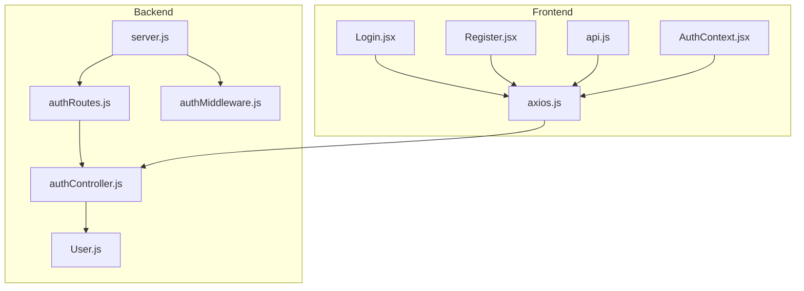
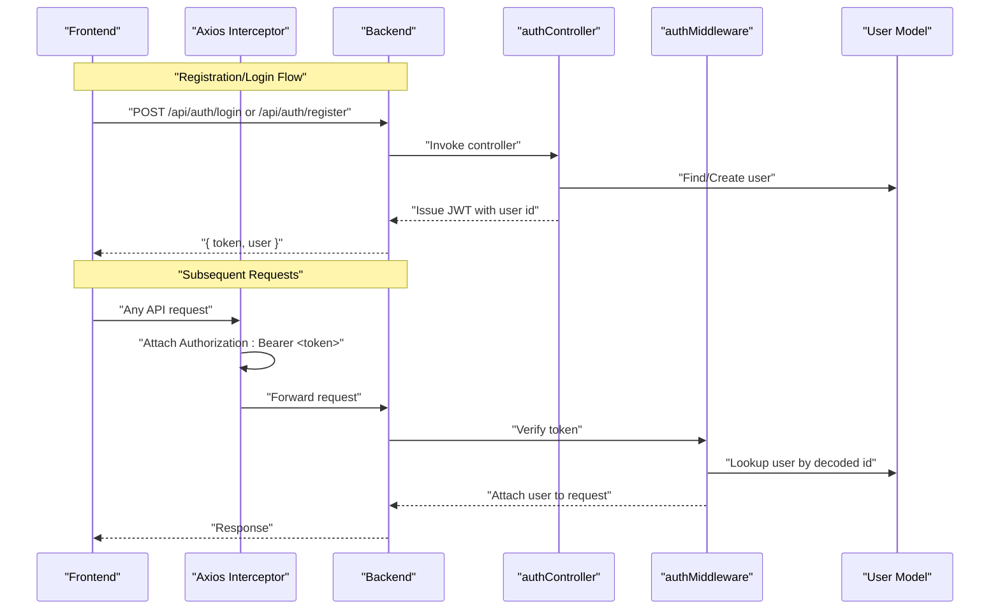
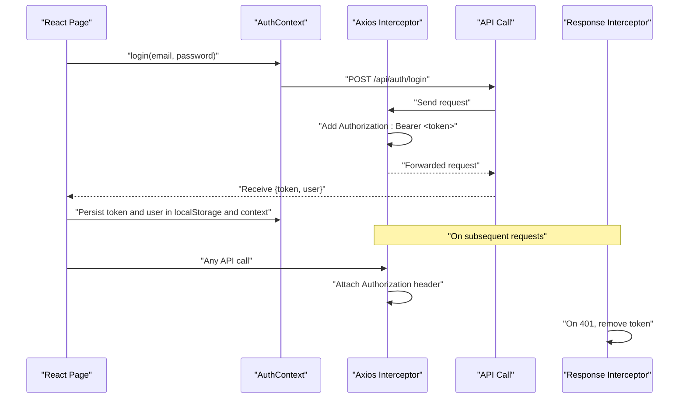
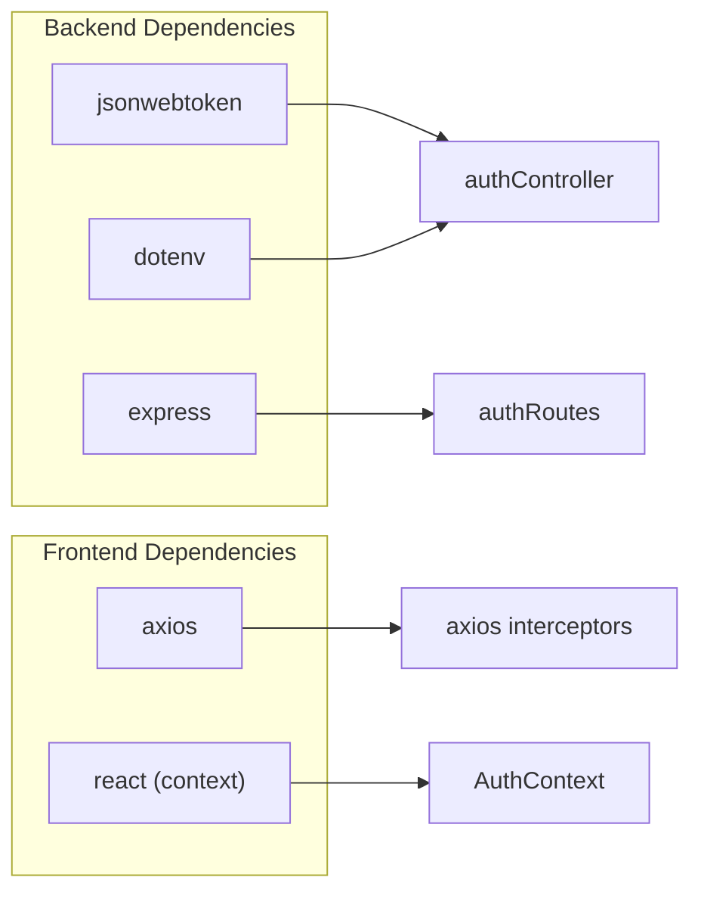

# JWT Token Flow & Management

<cite>
**Referenced Files in This Document**
- [authController.js](file://backend/controllers/authController.js)
- [authMiddleware.js](file://backend/middleware/authMiddleware.js)
- [User.js](file://backend/models/User.js)
- [authRoutes.js](file://backend/routes/authRoutes.js)
- [server.js](file://backend/server.js)
- [AuthContext.jsx](file://frontend/src/context/AuthContext.jsx)
- [axios.js](file://frontend/src/api/axios.js)
- [api.js](file://frontend/src/services/api.js)
- [Login.jsx](file://frontend/src/pages/Login.jsx)
- [Register.jsx](file://frontend/src/pages/Register.jsx)
- [package.json](file://backend/package.json)
- [package.json](file://frontend/package.json)
</cite>

## Table of Contents
1. [Introduction](#introduction)
2. [Project Structure](#project-structure)
3. [Core Components](#core-components)
4. [Architecture Overview](#architecture-overview)
5. [Detailed Component Analysis](#detailed-component-analysis)
6. [Dependency Analysis](#dependency-analysis)
7. [Performance Considerations](#performance-considerations)
8. [Troubleshooting Guide](#troubleshooting-guide)
9. [Conclusion](#conclusion)

## Introduction
This document explains the JWT-based authentication token lifecycle in the E-commerce App, covering token generation during registration and login, middleware verification, token expiration handling, and frontend token management. It also documents the JWT_SECRET environment variable configuration, token payload structure, secure transmission, storage mechanisms, and error handling strategies. Practical examples illustrate how tokens are used in API requests and how the frontend maintains authentication state.

## Project Structure
The authentication system spans backend controllers, middleware, routes, and models, and integrates with the frontend via Axios interceptors and React context. The backend exposes authentication endpoints, while the frontend persists tokens and injects Authorization headers automatically.

**Diagram sources**
- [server.js:1-102](file://backend/server.js#L1-L102)
- [authRoutes.js:1-9](file://backend/routes/authRoutes.js#L1-L9)
- [authController.js:1-27](file://backend/controllers/authController.js#L1-L27)
- [authMiddleware.js:1-20](file://backend/middleware/authMiddleware.js#L1-L20)
- [User.js:1-20](file://backend/models/User.js#L1-L20)
- [axios.js:1-17](file://frontend/src/api/axios.js#L1-L17)
- [api.js:1-8](file://frontend/src/services/api.js#L1-L8)
- [Login.jsx:1-56](file://frontend/src/pages/Login.jsx#L1-L56)
- [Register.jsx:1-67](file://frontend/src/pages/Register.jsx#L1-L67)
- [AuthContext.jsx:1-33](file://frontend/src/context/AuthContext.jsx#L1-L33)

**Section sources**
- [server.js:1-102](file://backend/server.js#L1-L102)
- [authRoutes.js:1-9](file://backend/routes/authRoutes.js#L1-L9)
- [authController.js:1-27](file://backend/controllers/authController.js#L1-L27)
- [authMiddleware.js:1-20](file://backend/middleware/authMiddleware.js#L1-L20)
- [User.js:1-20](file://backend/models/User.js#L1-L20)
- [axios.js:1-17](file://frontend/src/api/axios.js#L1-L17)
- [api.js:1-8](file://frontend/src/services/api.js#L1-L8)
- [Login.jsx:1-56](file://frontend/src/pages/Login.jsx#L1-L56)
- [Register.jsx:1-67](file://frontend/src/pages/Register.jsx#L1-L67)
- [AuthContext.jsx:1-33](file://frontend/src/context/AuthContext.jsx#L1-L33)

## Core Components
- Backend JWT signing and verification:
  - Token generation uses a signing function that encodes a user identifier and sets an expiration.
  - Middleware extracts the Authorization header, verifies the token against the secret, decodes the payload, and attaches the user to the request.
- Frontend token management:
  - Axios interceptors automatically attach the Bearer token to outgoing requests.
  - A response interceptor handles 401 Unauthorized by removing the token.
  - React context stores user state and persists tokens in local storage after login/register.

Key implementation references:
- Token generation and payload structure: [authController.js:4](file://backend/controllers/authController.js#L4), [authController.js:13](file://backend/controllers/authController.js#L13), [authController.js:24](file://backend/controllers/authController.js#L24)
- Token verification middleware: [authMiddleware.js:5](file://backend/middleware/authMiddleware.js#L5), [authMiddleware.js:9](file://backend/middleware/authMiddleware.js#L9)
- Frontend request interceptor: [axios.js:4](file://frontend/src/api/axios.js#L4), [api.js:4](file://frontend/src/services/api.js#L4)
- Frontend response interceptor (401 handling): [axios.js:10](file://frontend/src/api/axios.js#L10), [axios.js:13](file://frontend/src/api/axios.js#L13)
- Token persistence on login/register: [Login.jsx:14](file://frontend/src/pages/Login.jsx#L14), [Register.jsx:15](file://frontend/src/pages/Register.jsx#L15), [AuthContext.jsx:18](file://frontend/src/context/AuthContext.jsx#L18)

**Section sources**
- [authController.js:1-27](file://backend/controllers/authController.js#L1-L27)
- [authMiddleware.js:1-20](file://backend/middleware/authMiddleware.js#L1-L20)
- [axios.js:1-17](file://frontend/src/api/axios.js#L1-L17)
- [api.js:1-8](file://frontend/src/services/api.js#L1-L8)
- [Login.jsx:1-56](file://frontend/src/pages/Login.jsx#L1-L56)
- [Register.jsx:1-67](file://frontend/src/pages/Register.jsx#L1-L67)
- [AuthContext.jsx:1-33](file://frontend/src/context/AuthContext.jsx#L1-L33)

## Architecture Overview
The JWT lifecycle involves three stages: issuance, propagation, and verification. Issuance occurs on successful registration or login. Propagation happens via Authorization headers set by interceptors. Verification is performed by middleware that validates the token signature and attaches user context.

**Diagram sources**
- [authController.js:6-27](file://backend/controllers/authController.js#L6-L27)
- [authMiddleware.js:4-15](file://backend/middleware/authMiddleware.js#L4-L15)
- [User.js:1-20](file://backend/models/User.js#L1-L20)
- [axios.js:4](file://frontend/src/api/axios.js#L4)
- [api.js:4](file://frontend/src/services/api.js#L4)

## Detailed Component Analysis

### Backend JWT Issuance and Payload
- Token generation:
  - A signing function creates a JWT with a user identifier and an expiration period.
  - The signing secret is loaded from environment configuration.
- Payload structure:
  - The token carries the user identifier. The user object returned to the client includes id, name, email, and role.

Implementation references:
- Signing function and token creation: [authController.js:4](file://backend/controllers/authController.js#L4), [authController.js:13](file://backend/controllers/authController.js#L13), [authController.js:24](file://backend/controllers/authController.js#L24)
- User model role field: [User.js:8](file://backend/models/User.js#L8)

Security note:
- Expiration is configured server-side; clients should treat expired tokens as invalid and trigger re-authentication.

**Section sources**
- [authController.js:1-27](file://backend/controllers/authController.js#L1-L27)
- [User.js:1-20](file://backend/models/User.js#L1-L20)

### Middleware Verification Flow
- Header extraction:
  - The middleware reads the Authorization header and splits by whitespace to extract the token.
- Verification:
  - The token is verified against the configured secret. On success, the user record is fetched (excluding password) and attached to the request.
- Error handling:
  - Missing or invalid tokens result in 401 responses.

**Diagram sources**
- [authMiddleware.js:4-15](file://backend/middleware/authMiddleware.js#L4-L15)

**Section sources**
- [authMiddleware.js:1-20](file://backend/middleware/authMiddleware.js#L1-L20)

### Frontend Token Management and Secure Transmission
- Request interception:
  - An Axios interceptor reads the token from local storage and adds an Authorization header to every request.
- Response interception:
  - On receiving a 401 Unauthorized response, the interceptor removes the token from local storage and rejects the promise.
- Authentication state:
  - The AuthContext provider initializes user state from local storage on mount and exposes login/logout actions that update local storage and context.

**Diagram sources**
- [AuthContext.jsx:16-28](file://frontend/src/context/AuthContext.jsx#L16-L28)
- [axios.js:4](file://frontend/src/api/axios.js#L4)
- [axios.js:10](file://frontend/src/api/axios.js#L10)
- [axios.js:13](file://frontend/src/api/axios.js#L13)
- [api.js:4](file://frontend/src/services/api.js#L4)

**Section sources**
- [AuthContext.jsx:1-33](file://frontend/src/context/AuthContext.jsx#L1-L33)
- [axios.js:1-17](file://frontend/src/api/axios.js#L1-L17)
- [api.js:1-8](file://frontend/src/services/api.js#L1-L8)
- [Login.jsx:1-56](file://frontend/src/pages/Login.jsx#L1-L56)
- [Register.jsx:1-67](file://frontend/src/pages/Register.jsx#L1-L67)

### Token Storage Mechanisms
- Backend:
  - Tokens are signed server-side and transmitted to the client as part of the login/register response.
- Frontend:
  - Tokens are persisted in local storage after successful authentication.
  - The application does not implement httpOnly cookies; therefore, tokens are stored in the browser’s local storage.

Security consideration:
- Local storage is accessible via JavaScript and thus vulnerable to XSS. Consider migrating to httpOnly cookies for enhanced security.

References:
- Token persistence on login/register: [Login.jsx:14](file://frontend/src/pages/Login.jsx#L14), [Register.jsx:15](file://frontend/src/pages/Register.jsx#L15), [AuthContext.jsx:18](file://frontend/src/context/AuthContext.jsx#L18)
- Token retrieval in interceptors: [axios.js:4](file://frontend/src/api/axios.js#L4), [api.js:4](file://frontend/src/services/api.js#L4)

**Section sources**
- [Login.jsx:1-56](file://frontend/src/pages/Login.jsx#L1-L56)
- [Register.jsx:1-67](file://frontend/src/pages/Register.jsx#L1-L67)
- [AuthContext.jsx:1-33](file://frontend/src/context/AuthContext.jsx#L1-L33)
- [axios.js:1-17](file://frontend/src/api/axios.js#L1-L17)
- [api.js:1-8](file://frontend/src/services/api.js#L1-L8)

### Token Expiration Handling
- Backend expiration:
  - Tokens are issued with an expiration period configured during signing.
- Frontend handling:
  - On 401 Unauthorized responses, the frontend removes the token from local storage, effectively logging the user out.
  - No automatic token refresh mechanism is implemented in the current codebase.

References:
- Token expiration setting: [authController.js:4](file://backend/controllers/authController.js#L4)
- 401 handling and cleanup: [axios.js:10](file://frontend/src/api/axios.js#L10), [axios.js:13](file://frontend/src/api/axios.js#L13)

**Section sources**
- [authController.js:1-27](file://backend/controllers/authController.js#L1-L27)
- [axios.js:1-17](file://frontend/src/api/axios.js#L1-L17)

### Token Refresh Strategies
- Current implementation:
  - There is no token refresh mechanism in place. Upon expiration, the client receives 401 and clears the token.
- Recommended approach:
  - Implement a refresh endpoint that issues a new JWT upon presentation of a valid refresh token. Store the refresh token in an httpOnly cookie and the access token in memory or secure storage. Rotate tokens periodically and handle errors gracefully.

Note:
- This section provides a recommended strategy; the current codebase does not implement refresh tokens.

### Security Considerations for Token Storage
- Local storage risks:
  - XSS attacks can steal tokens stored in local storage.
- Mitigation strategies:
  - Prefer httpOnly cookies for tokens to prevent JavaScript access.
  - Enforce Content Security Policy to reduce XSS risk.
  - Use SameSite cookies to mitigate CSRF.
  - Shorten token lifetimes and implement refresh token rotation.

Note:
- The current frontend stores tokens in local storage. Consider moving to httpOnly cookies for improved security.

## Dependency Analysis
The authentication stack depends on the following libraries and modules:
- Backend:
  - jsonwebtoken for signing and verifying tokens.
  - dotenv for loading environment variables.
  - Express routes and middleware for request handling.
- Frontend:
  - axios for HTTP requests and interceptors.
  - React context for global authentication state.

**Diagram sources**
- [package.json:8-22](file://backend/package.json#L8-L22)
- [package.json:8-16](file://frontend/package.json#L8-L16)
- [authController.js:1](file://backend/controllers/authController.js#L1)
- [authRoutes.js:1](file://backend/routes/authRoutes.js#L1)
- [axios.js:1](file://frontend/src/api/axios.js#L1)
- [AuthContext.jsx:1](file://frontend/src/context/AuthContext.jsx#L1)

**Section sources**
- [package.json:1-27](file://backend/package.json#L1-L27)
- [package.json:1-25](file://frontend/package.json#L1-L25)
- [authController.js:1-27](file://backend/controllers/authController.js#L1-L27)
- [authRoutes.js:1-9](file://backend/routes/authRoutes.js#L1-L9)
- [axios.js:1-17](file://frontend/src/api/axios.js#L1-L17)
- [AuthContext.jsx:1-33](file://frontend/src/context/AuthContext.jsx#L1-L33)

## Performance Considerations
- Token verification overhead:
  - Each protected request triggers a cryptographic verification and a database lookup for the user. Keep the user lookup minimal by indexing the user identifier.
- Token lifetime:
  - Shorter expirations increase verification frequency but improve security. Longer expirations reduce load but increase risk.
- Interceptor efficiency:
  - Axios interceptors add negligible overhead and centralize token handling.

## Troubleshooting Guide
Common issues and resolutions:
- Missing Authorization header:
  - Symptom: 401 Not Authorized on protected routes.
  - Cause: Client did not send the Bearer token.
  - Resolution: Ensure interceptors are configured and the token is present in local storage.
  - References: [authMiddleware.js:5](file://backend/middleware/authMiddleware.js#L5), [axios.js:4](file://frontend/src/api/axios.js#L4), [api.js:4](file://frontend/src/services/api.js#L4)
- Invalid or expired token:
  - Symptom: 401 Invalid Token or immediate logout after token expiry.
  - Cause: Signature mismatch or expiration exceeded.
  - Resolution: Re-authenticate to obtain a new token; implement refresh tokens if needed.
  - References: [authMiddleware.js:9](file://backend/middleware/authMiddleware.js#L9), [axios.js:13](file://frontend/src/api/axios.js#L13)
- CORS errors preventing token storage:
  - Symptom: Errors when setting or retrieving tokens in development.
  - Cause: Misconfigured CORS origins or credentials.
  - Resolution: Verify allowed origins and credentials in the backend configuration.
  - References: [server.js:22-49](file://backend/server.js#L22-L49)

**Section sources**
- [authMiddleware.js:1-20](file://backend/middleware/authMiddleware.js#L1-L20)
- [axios.js:1-17](file://frontend/src/api/axios.js#L1-L17)
- [api.js:1-8](file://frontend/src/services/api.js#L1-L8)
- [server.js:1-102](file://backend/server.js#L1-L102)

## Conclusion
The E-commerce App implements a straightforward JWT-based authentication flow: tokens are generated server-side with a user identifier and expiration, propagated via Authorization headers, and verified by middleware. The frontend persists tokens in local storage and automatically attaches them to requests, clearing them on 401 responses. For enhanced security, consider migrating to httpOnly cookies and implementing token refresh strategies. The current design is functional but can be hardened with stronger storage and refresh mechanisms.