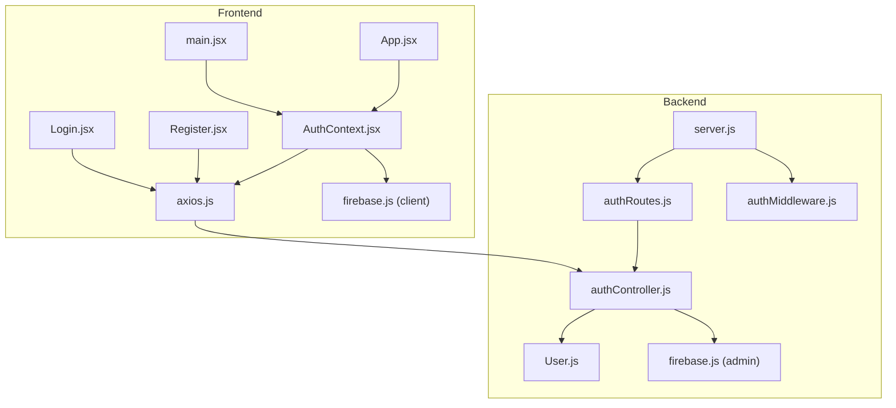
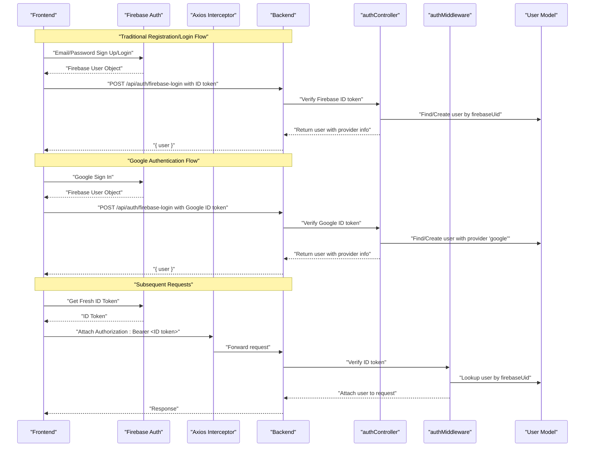
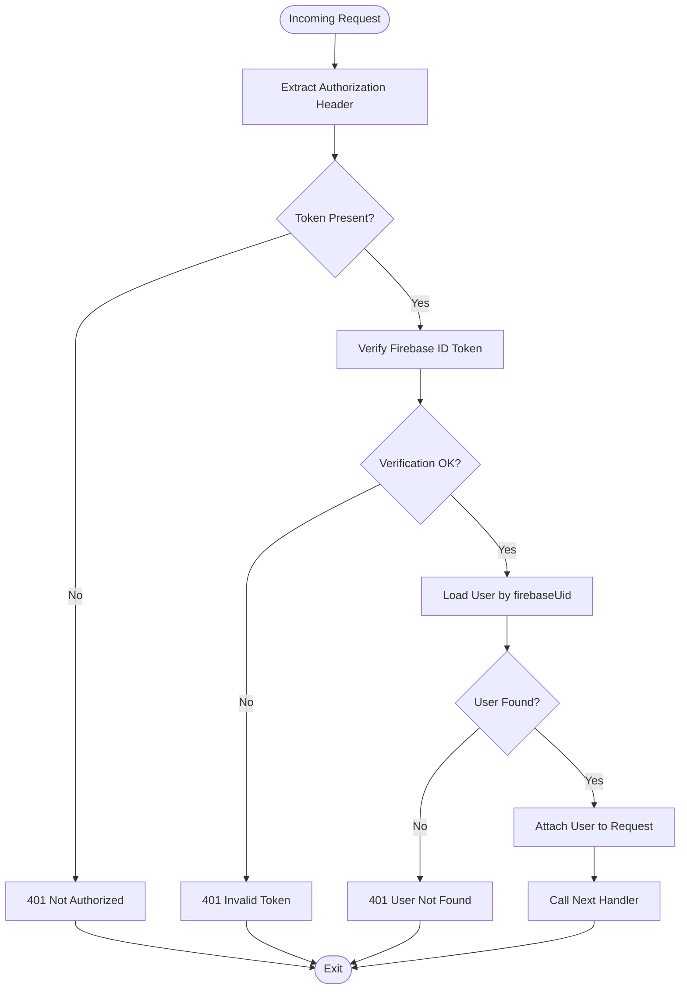
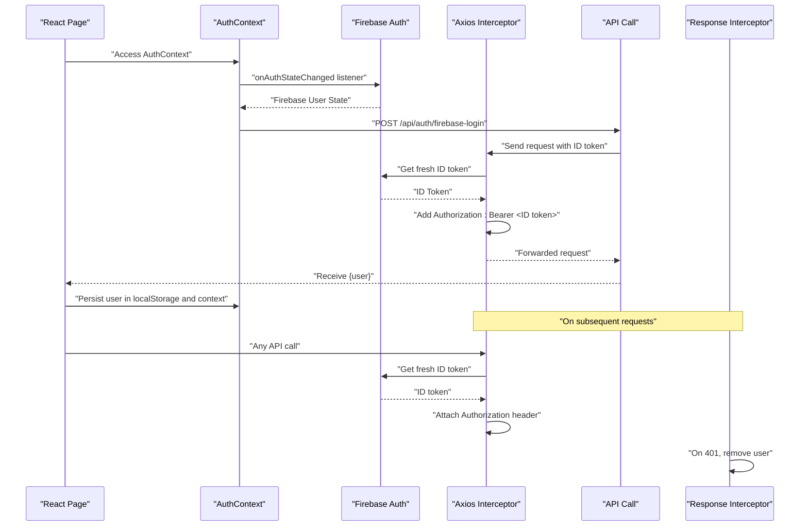
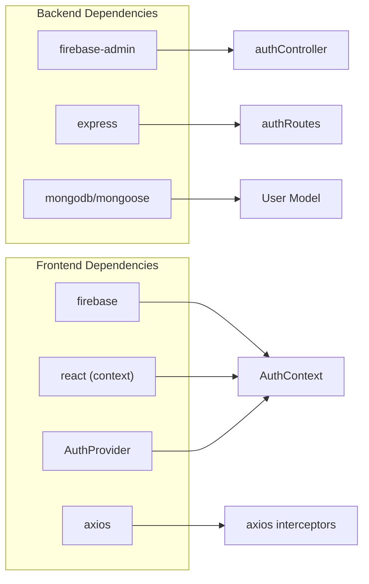

# Firebase Authentication Flow & Management

<cite>
**Referenced Files in This Document**
- [main.jsx](file://frontend/src/main.jsx)
- [AuthContext.jsx](file://frontend/src/context/AuthContext.jsx)
- [firebase.js](file://frontend/src/config/firebase.js)
- [authController.js](file://backend/controllers/authController.js)
- [authMiddleware.js](file://backend/middleware/authMiddleware.js)
- [User.js](file://backend/models/User.js)
- [authRoutes.js](file://backend/routes/authRoutes.js)
- [server.js](file://backend/server.js)
- [axios.js](file://frontend/src/api/axios.js)
- [Login.jsx](file://frontend/src/pages/Login.jsx)
- [Register.jsx](file://frontend/src/pages/Register.jsx)
- [App.jsx](file://frontend/src/App.jsx)
- [firebase.js](file://backend/config/firebase.js)
- [package.json](file://backend/package.json)
- [package.json](file://frontend/package.json)
</cite>

## Update Summary
**Changes Made**
- Complete replacement of JWT token documentation with Firebase Authentication flow
- Updated Authentication Infrastructure section to reflect Firebase AuthProvider setup
- Enhanced Frontend Token Management section with Firebase ID token handling
- Added comprehensive Firebase authentication support documentation
- Updated Architecture Overview to include Firebase authentication flow
- Enhanced Security Considerations with Firebase authentication implications

## Table of Contents
1. [Introduction](#introduction)
2. [Project Structure](#project-structure)
3. [Core Components](#core-components)
4. [Architecture Overview](#architecture-overview)
5. [Detailed Component Analysis](#detailed-component-analysis)
6. [Dependency Analysis](#dependency-analysis)
7. [Performance Considerations](#performance-considerations)
8. [Troubleshooting Guide](#troubleshooting-guide)
9. [Conclusion](#conclusion)

## Introduction
This document explains the Firebase-based authentication token lifecycle in the E-commerce App, covering Firebase ID token generation during registration and login, backend verification, token expiration handling, and frontend token management. The system now implements a comprehensive Firebase Authentication infrastructure with proper context initialization, Google authentication support, and enhanced security considerations. It documents the Firebase configuration, token payload structure containing user ID and provider information, secure transmission, storage mechanisms, and error handling strategies.

## Project Structure
The authentication system spans Firebase configuration, backend controllers, middleware, routes, and models, and integrates with the frontend via Axios interceptors and React context. The backend exposes authentication endpoints for Firebase ID token verification, while the frontend manages Firebase authentication state and synchronizes user profiles with the backend.

**Diagram sources**
- [server.js:1-120](file://backend/server.js#L1-L120)
- [authRoutes.js:1-9](file://backend/routes/authRoutes.js#L1-L9)
- [authController.js:1-69](file://backend/controllers/authController.js#L1-L69)
- [authMiddleware.js:1-33](file://backend/middleware/authMiddleware.js#L1-L33)
- [User.js:1-30](file://backend/models/User.js#L1-L30)
- [main.jsx:1-14](file://frontend/src/main.jsx#L1-L14)
- [axios.js:1-29](file://frontend/src/api/axios.js#L1-L29)
- [Login.jsx:1-133](file://frontend/src/pages/Login.jsx#L1-L133)
- [Register.jsx:1-162](file://frontend/src/pages/Register.jsx#L1-L162)
- [AuthContext.jsx:1-86](file://frontend/src/context/AuthContext.jsx#L1-L86)
- [firebase.js:1-67](file://frontend/src/config/firebase.js#L1-67)
- [firebase.js:1-12](file://backend/config/firebase.js#L1-12)

**Section sources**
- [server.js:1-120](file://backend/server.js#L1-L120)
- [authRoutes.js:1-9](file://backend/routes/authRoutes.js#L1-L9)
- [authController.js:1-69](file://backend/controllers/authController.js#L1-L69)
- [authMiddleware.js:1-33](file://backend/middleware/authMiddleware.js#L1-L33)
- [User.js:1-30](file://backend/models/User.js#L1-L30)
- [main.jsx:1-14](file://frontend/src/main.jsx#L1-L14)
- [axios.js:1-29](file://frontend/src/api/axios.js#L1-L29)
- [Login.jsx:1-133](file://frontend/src/pages/Login.jsx#L1-L133)
- [Register.jsx:1-162](file://frontend/src/pages/Register.jsx#L1-L162)
- [AuthContext.jsx:1-86](file://frontend/src/context/AuthContext.jsx#L1-L86)
- [firebase.js:1-67](file://frontend/src/config/firebase.js#L1-67)
- [firebase.js:1-12](file://backend/config/firebase.js#L1-12)

## Core Components
- **Backend Firebase authentication and verification**:
  - Firebase ID token verification using Firebase Admin SDK
  - User synchronization between Firebase and MongoDB using firebaseUid
  - Supports both traditional email/password authentication and Google authentication
  - Automatic user creation and provider detection
- **Frontend Firebase token management**:
  - Axios interceptors automatically attach Firebase ID tokens to outgoing requests
  - Response interceptor handles 401 Unauthorized by removing the user
  - React context stores user state and persists user data in local storage after login
  - Properly initialized AuthProvider ensures Firebase authentication flow works correctly across all components

**Updated** Complete Firebase Authentication implementation with provider detection and user synchronization

Key implementation references:
- Firebase ID token verification: [authController.js:13](file://backend/controllers/authController.js#L13), [authController.js:15](file://backend/controllers/authController.js#L15)
- Provider detection logic: [authController.js:17](file://backend/controllers/authController.js#L17), [authController.js:18](file://backend/controllers/authController.js#L18)
- User synchronization: [AuthContext.jsx:13](file://frontend/src/context/AuthContext.jsx#L13), [AuthContext.jsx:21](file://frontend/src/context/AuthContext.jsx#L21)
- Frontend request interceptor: [axios.js:8](file://frontend/src/api/axios.js#L8), [axios.js:12](file://frontend/src/api/axios.js#L12)
- Frontend response interceptor (401 handling): [axios.js:18](file://frontend/src/api/axios.js#L18), [axios.js:22](file://frontend/src/api/axios.js#L22)
- Token persistence on login: [AuthContext.jsx:23](file://frontend/src/context/AuthContext.jsx#L23), [AuthContext.jsx:42](file://frontend/src/context/AuthContext.jsx#L42)
- Google authentication: [AuthContext.jsx:63](file://frontend/src/context/AuthContext.jsx#L63), [firebase.js:21-29](file://frontend/src/config/firebase.js#L21-L29)
- AuthProvider setup: [main.jsx:9](file://frontend/src/main.jsx#L9), [main.jsx:11](file://frontend/src/main.jsx#L11)

**Section sources**
- [authController.js:1-69](file://backend/controllers/authController.js#L1-L69)
- [authMiddleware.js:1-33](file://backend/middleware/authMiddleware.js#L1-L33)
- [axios.js:1-29](file://frontend/src/api/axios.js#L1-L29)
- [AuthContext.jsx:1-86](file://frontend/src/context/AuthContext.jsx#L1-L86)
- [firebase.js:1-67](file://frontend/src/config/firebase.js#L1-67)
- [main.jsx:1-14](file://frontend/src/main.jsx#L1-L14)

## Architecture Overview
The Firebase authentication lifecycle involves three stages: Firebase authentication, backend verification, and user synchronization. The system supports both traditional authentication and Google authentication through Firebase. Issuance occurs via Firebase Auth, backend verification validates the ID token, and user synchronization creates or updates user records in MongoDB.

**Diagram sources**
- [AuthContext.jsx:51](file://frontend/src/context/AuthContext.jsx#L51)
- [AuthContext.jsx:57](file://frontend/src/context/AuthContext.jsx#L57)
- [AuthContext.jsx:63](file://frontend/src/context/AuthContext.jsx#L63)
- [authController.js:5](file://backend/controllers/authController.js#L5)
- [authController.js:13](file://backend/controllers/authController.js#L13)
- [authController.js:17](file://backend/controllers/authController.js#L17)
- [authMiddleware.js:4](file://backend/middleware/authMiddleware.js#L4)
- [User.js:25](file://backend/models/User.js#L25)
- [axios.js:8](file://frontend/src/api/axios.js#L8)
- [axios.js:12](file://frontend/src/api/axios.js#L12)
- [firebase.js:32-48](file://frontend/src/config/firebase.js#L32-L48)

## Detailed Component Analysis

### Backend Firebase Authentication and User Synchronization
- **Firebase ID token verification**:
  - The backend uses Firebase Admin SDK to verify ID tokens sent by the frontend
  - Decoded token contains uid, email, name, picture, and firebase.sign_in_provider
  - Supports both Google and email/password authentication providers
- **User synchronization**:
  - Users are identified by firebaseUid in MongoDB
  - If user doesn't exist, creates new user with provider information
  - Links existing users by email if firebaseUid doesn't match
  - Automatically detects provider from firebase.sign_in_provider
- **Provider detection**:
  - Google sign-ins set provider to 'google'
  - Email/password sign-ins set provider to 'email'

**Updated** Enhanced with comprehensive provider detection and user linking

Implementation references:
- Firebase ID token verification: [authController.js:13](file://backend/controllers/authController.js#L13), [authController.js:14](file://backend/controllers/authController.js#L14)
- User creation and linking: [authController.js:20](file://backend/controllers/authController.js#L20), [authController.js:24](file://backend/controllers/authController.js#L24)
- Provider detection logic: [authController.js:17](file://backend/controllers/authController.js#L17), [authController.js:18](file://backend/controllers/authController.js#L18)
- User model provider field: [User.js:25](file://backend/models/User.js#L25)

Security note:
- Firebase ID tokens are cryptographically signed and verified server-side
- Tokens are short-lived (typically 1 hour) and automatically refreshed by Firebase

**Section sources**
- [authController.js:1-69](file://backend/controllers/authController.js#L1-L69)
- [User.js:1-30](file://backend/models/User.js#L1-L30)

### Middleware Verification Flow
- **Header extraction**:
  - The middleware reads the Authorization header and extracts the Bearer token
- **Firebase verification**:
  - The token is verified using Firebase Admin SDK against the configured project
  - On success, the user record is fetched by firebaseUid and attached to the request
- **Error handling**:
  - Missing or invalid tokens result in 401 responses
  - User not found scenarios are handled gracefully

**Diagram sources**
- [authMiddleware.js:4-24](file://backend/middleware/authMiddleware.js#L4-L24)

**Section sources**
- [authMiddleware.js:1-33](file://backend/middleware/authMiddleware.js#L1-L33)

### Frontend Firebase Authentication and Secure Transmission
- **Firebase authentication state management**:
  - Uses onAuthStateChanged to track authentication state changes
  - Automatically syncs user with backend on authentication events
  - Handles user profile updates and token refresh
- **Request interception**:
  - An Axios interceptor gets fresh Firebase ID tokens and adds Authorization headers
  - Automatically handles token refresh through Firebase Auth
- **Response interception**:
  - On receiving a 401 Unauthorized response, the interceptor removes user data
- **Authentication state**:
  - The AuthContext provider initializes user state from local storage on mount
  - Exposes login/logout actions that update local storage and context
  - **Updated**: Properly initialized via AuthProvider in main.jsx ensures Firebase authentication flow works correctly across all components

**Updated** Enhanced with Firebase authentication state management and automatic token refresh

**Diagram sources**
- [AuthContext.jsx:31](file://frontend/src/context/AuthContext.jsx#L31)
- [AuthContext.jsx:37](file://frontend/src/context/AuthContext.jsx#L37)
- [AuthContext.jsx:13](file://frontend/src/context/AuthContext.jsx#L13)
- [AuthContext.jsx:21](file://frontend/src/context/AuthContext.jsx#L21)
- [axios.js:8](file://frontend/src/api/axios.js#L8)
- [axios.js:12](file://frontend/src/api/axios.js#L12)
- [axios.js:18](file://frontend/src/api/axios.js#L18)
- [axios.js:22](file://frontend/src/api/axios.js#L22)
- [main.jsx:9](file://frontend/src/main.jsx#L9)

**Section sources**
- [AuthContext.jsx:1-86](file://frontend/src/context/AuthContext.jsx#L1-L86)
- [main.jsx:1-14](file://frontend/src/main.jsx#L1-L14)
- [axios.js:1-29](file://frontend/src/api/axios.js#L1-L29)
- [firebase.js:1-67](file://frontend/src/config/firebase.js#L1-67)
- [Login.jsx:1-133](file://frontend/src/pages/Login.jsx#L1-L133)
- [Register.jsx:1-162](file://frontend/src/pages/Register.jsx#L1-L162)

### Firebase Token Storage and Management
- **Backend**:
  - Firebase ID tokens are verified server-side using Firebase Admin SDK
  - Tokens are cryptographically validated and decoded to extract user information
  - No persistent token storage on the backend; relies on Firebase's secure token system
- **Frontend**:
  - Firebase manages token refresh automatically through Firebase Auth
  - User data is persisted in local storage after successful authentication
  - The application does not implement custom token storage; relies on Firebase's secure token management
  - **Updated**: AuthProvider ensures proper initialization and token management across all components

**Updated** Enhanced with Firebase token management details

Security consideration:
- Firebase tokens are managed by Firebase Auth SDK and automatically refreshed
- No custom token storage is implemented; relies on Firebase's secure token system
- Consider migrating to httpOnly cookies for enhanced security if needed

References:
- Token verification in backend: [authController.js:13](file://backend/controllers/authController.js#L13)
- User persistence in frontend: [AuthContext.jsx:23](file://frontend/src/context/AuthContext.jsx#L23)
- Token retrieval in interceptors: [axios.js:12](file://frontend/src/api/axios.js#L12)
- AuthProvider setup: [main.jsx:9](file://frontend/src/main.jsx#L9)

**Section sources**
- [authController.js:1-69](file://backend/controllers/authController.js#L1-L69)
- [AuthContext.jsx:1-86](file://frontend/src/context/AuthContext.jsx#L1-L86)
- [axios.js:1-29](file://frontend/src/api/axios.js#L1-L29)
- [main.jsx:1-14](file://frontend/src/main.jsx#L1-L14)

### Firebase Authentication Expiration and Refresh
- **Backend expiration**:
  - Firebase ID tokens are verified server-side and have built-in expiration handling
  - The backend relies on Firebase Admin SDK for token validation and expiration
- **Frontend handling**:
  - Firebase Auth automatically refreshes tokens when needed
  - On 401 Unauthorized responses, the frontend removes user data from local storage
  - No manual token refresh mechanism is implemented in the current codebase
  - **Updated**: AuthProvider ensures proper token initialization and cleanup across component lifecycle

**Updated** Enhanced with Firebase automatic token refresh capabilities

References:
- Token verification in middleware: [authMiddleware.js:14](file://backend/middleware/authMiddleware.js#L14)
- 401 handling and cleanup: [axios.js:22](file://frontend/src/api/axios.js#L22)
- AuthProvider initialization: [AuthContext.jsx:31](file://frontend/src/context/AuthContext.jsx#L31)

**Section sources**
- [authController.js:1-69](file://backend/controllers/authController.js#L1-L69)
- [authMiddleware.js:1-33](file://backend/middleware/authMiddleware.js#L1-L33)
- [axios.js:1-29](file://frontend/src/api/axios.js#L1-L29)
- [AuthContext.jsx:1-86](file://frontend/src/context/AuthContext.jsx#L1-L86)

### Firebase Authentication Strategies
- **Current implementation**:
  - Firebase Authentication handles all token management automatically
  - No custom token refresh mechanism is implemented; relies on Firebase's automatic refresh
  - User synchronization ensures backend user records stay consistent with Firebase
- **Recommended approach**:
  - Implement custom claims for role-based access control if needed
  - Consider implementing refresh token rotation for enhanced security
  - Monitor Firebase authentication metrics and token usage patterns
- **Google authentication consideration**:
  - Google authentication users benefit from seamless Firebase authentication flow
  - Provider detection ensures proper user categorization and access control

**Updated** Added Firebase authentication considerations

Note:
- This section provides guidance for future enhancements; the current codebase relies on Firebase's automatic token management.

## Security Considerations for Firebase Authentication
- **Firebase token security**:
  - Firebase ID tokens are cryptographically signed and verified server-side
  - Tokens are automatically refreshed by Firebase Auth SDK
  - No custom token storage is implemented, reducing attack surface
- **Mitigation strategies**:
  - Firebase handles token encryption and validation automatically
  - Use Firebase Authentication security rules for additional protection
  - Monitor authentication events and suspicious activities
  - Implement rate limiting for authentication endpoints
- **Google authentication security**:
  - Google authentication integrates with Firebase for secure OAuth flow
  - Backend validates Google user data and issues synchronized user records
  - Provider detection ensures proper access control based on authentication method

**Updated** Enhanced with Firebase authentication security considerations

Note:
- The current frontend relies on Firebase's secure token management. Consider additional security measures if needed.

## Dependency Analysis
The Firebase authentication stack depends on the following libraries and modules:
- **Backend**:
  - firebase-admin for Firebase ID token verification and user management
  - express routes and middleware for request handling
  - mongodb/mongoose for user data persistence
  - **Updated**: No JWT dependencies; fully Firebase-based
- **Frontend**:
  - firebase for client-side authentication
  - axios for HTTP requests and interceptors
  - React context for global authentication state
  - **Updated**: AuthProvider for proper context initialization

**Updated** Complete Firebase Authentication dependencies

**Diagram sources**
- [package.json:8-28](file://backend/package.json#L8-L28)
- [package.json:8-27](file://frontend/package.json#L8-L27)
- [authController.js:1](file://backend/controllers/authController.js#L1)
- [authRoutes.js:1](file://backend/routes/authRoutes.js#L1)
- [axios.js:1](file://frontend/src/api/axios.js#L1)
- [AuthContext.jsx:1](file://frontend/src/context/AuthContext.jsx#L1)
- [main.jsx:9](file://frontend/src/main.jsx#L9)
- [firebase.js:1-12](file://backend/config/firebase.js#L1-12)
- [firebase.js:1-67](file://frontend/src/config/firebase.js#L1-67)

**Section sources**
- [package.json:1-28](file://backend/package.json#L1-L28)
- [package.json:1-27](file://frontend/package.json#L1-L27)
- [authController.js:1-69](file://backend/controllers/authController.js#L1-L69)
- [authRoutes.js:1-9](file://backend/routes/authRoutes.js#L1-L9)
- [axios.js:1-29](file://frontend/src/api/axios.js#L1-L29)
- [AuthContext.jsx:1-86](file://frontend/src/context/AuthContext.jsx#L1-L86)
- [main.jsx:1-14](file://frontend/src/main.jsx#L1-L14)
- [firebase.js:1-12](file://backend/config/firebase.js#L1-12)
- [firebase.js:1-67](file://frontend/src/config/firebase.js#L1-67)

## Performance Considerations
- **Firebase authentication overhead**:
  - Each protected request triggers Firebase Admin SDK verification and a database lookup for the user
  - Firebase handles token validation efficiently; overhead is minimal compared to JWT signing
- **Automatic token refresh**:
  - Firebase Auth automatically refreshes tokens, reducing client-side complexity
  - No manual token refresh logic is needed in the application
- **Interceptor efficiency**:
  - Axios interceptors add negligible overhead and centralize token handling
  - Firebase Auth SDK manages token caching and refresh automatically
- **Google authentication performance**:
  - Firebase authentication reduces backend load by handling OAuth externally
  - User synchronization is efficient and only occurs on authentication state changes
- **AuthProvider initialization**:
  - Proper AuthProvider setup ensures efficient context initialization across all components

**Updated** Enhanced with Firebase authentication performance considerations

## Troubleshooting Guide
Common issues and resolutions:
- **Firebase authentication state not persisting**:
  - Symptom: Users logged out after page refresh
  - Cause: AuthProvider not properly wrapping the App component
  - Resolution: Ensure AuthProvider is correctly set up in main.jsx
  - References: [main.jsx:9](file://frontend/src/main.jsx#L9), [main.jsx:11](file://frontend/src/main.jsx#L11)
- **Firebase ID token verification failures**:
  - Symptom: 401 Invalid or expired token on protected routes
  - Cause: Firebase Admin SDK configuration issues or invalid tokens
  - Resolution: Check Firebase service account credentials and verify token validity
  - References: [authMiddleware.js:14](file://backend/middleware/authMiddleware.js#L14), [firebase.js:3-9](file://backend/config/firebase.js#L3-L9)
- **User synchronization failures**:
  - Symptom: User data not persisting or incorrect provider detection
  - Cause: Firebase ID token payload issues or user lookup problems
  - Resolution: Verify Firebase ID token structure and user firebaseUid uniqueness
  - References: [authController.js:13](file://backend/controllers/authController.js#L13), [authController.js:21](file://backend/controllers/authController.js#L21)
- **CORS errors preventing Firebase authentication**:
  - Symptom: Errors when authenticating with Firebase in development
  - Cause: Misconfigured CORS origins or Firebase configuration issues
  - Resolution: Verify allowed origins and Firebase configuration settings
  - References: [server.js:25-64](file://backend/server.js#L25-L64), [firebase.js:5-13](file://frontend/src/config/firebase.js#L5-L13)
- **Google authentication failures**:
  - Symptom: Google login fails or user data not properly handled
  - Cause: Firebase configuration issues or Google OAuth setup problems
  - Resolution: Check Firebase configuration and verify Google OAuth credentials
  - References: [AuthContext.jsx:63](file://frontend/src/context/AuthContext.jsx#L63), [firebase.js:21-29](file://frontend/src/config/firebase.js#L21-L29)
- **AuthProvider not working**:
  - Symptom: Authentication state not persisting across components
  - Cause: AuthProvider not properly wrapping the App component
  - Resolution: Ensure AuthProvider is correctly set up in main.jsx
  - References: [main.jsx:9](file://frontend/src/main.jsx#L9), [main.jsx:11](file://frontend/src/main.jsx#L11)

**Updated** Added Firebase authentication and AuthProvider troubleshooting

**Section sources**
- [authMiddleware.js:1-33](file://backend/middleware/authMiddleware.js#L1-L33)
- [axios.js:1-29](file://frontend/src/api/axios.js#L1-L29)
- [server.js:1-120](file://backend/server.js#L1-L120)
- [AuthContext.jsx:1-86](file://frontend/src/context/AuthContext.jsx#L1-L86)
- [main.jsx:1-14](file://frontend/src/main.jsx#L1-L14)
- [firebase.js:1-12](file://backend/config/firebase.js#L1-12)
- [firebase.js:1-67](file://frontend/src/config/firebase.js#L1-67)

## Conclusion
The E-commerce App implements a comprehensive Firebase-based authentication flow with enhanced infrastructure improvements. Firebase handles all authentication aspects including ID token generation, verification, and automatic refresh. The system now includes proper AuthProvider setup in main.jsx, ensuring Firebase authentication flow works correctly across all components with proper context initialization. The frontend persists user data in local storage and automatically attaches Firebase ID tokens to requests, clearing them on 401 responses. Google authentication is seamlessly integrated with Firebase for secure OAuth flow while maintaining user synchronization with backend MongoDB.

For enhanced security, consider implementing custom claims for role-based access control and monitoring Firebase authentication metrics. The current design with proper AuthProvider initialization is highly secure and robust, leveraging Firebase's proven authentication infrastructure. The addition of Firebase authentication significantly improves user experience while maintaining security standards through automatic token management and context initialization.