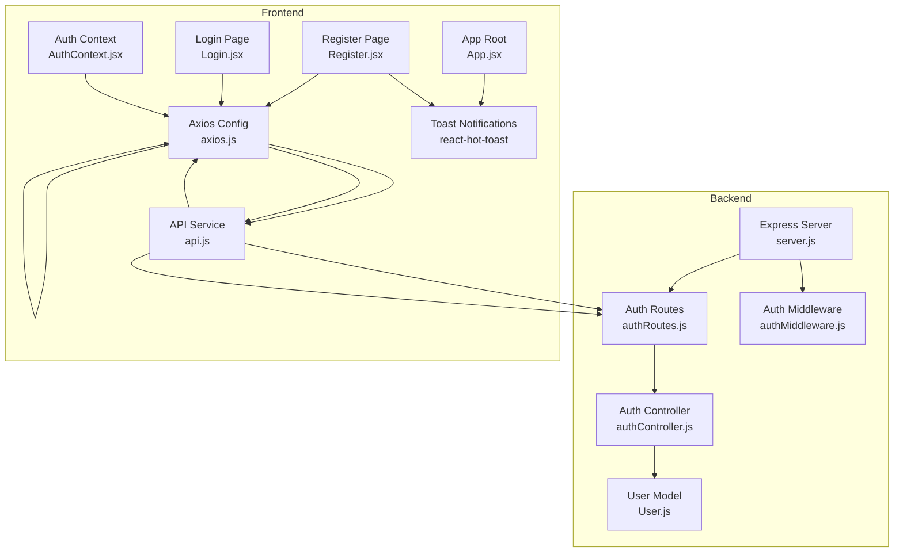
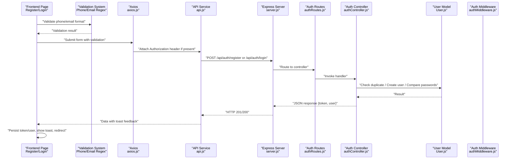
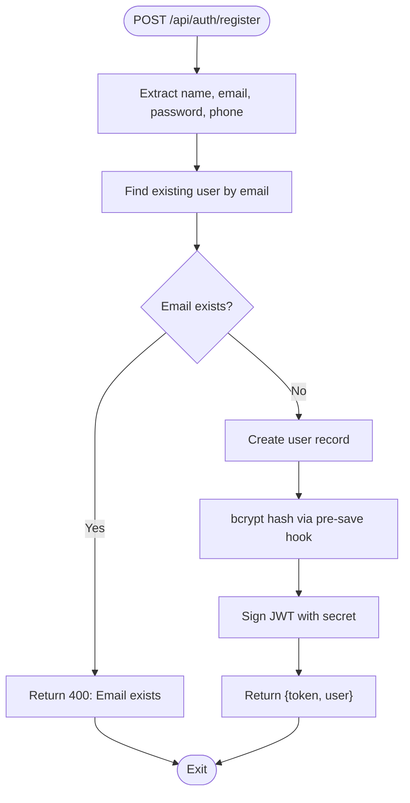
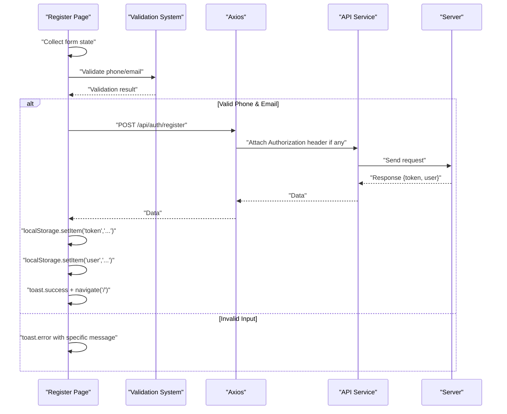
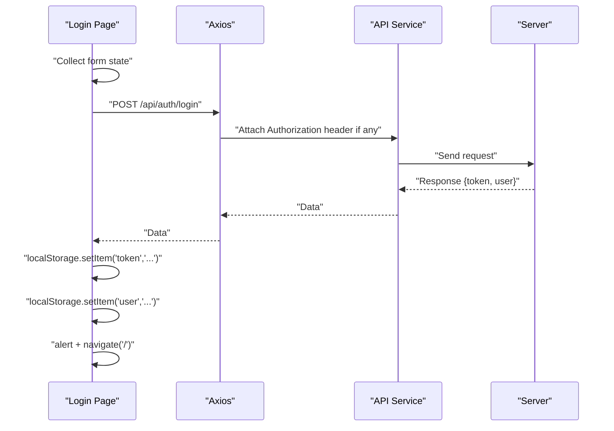
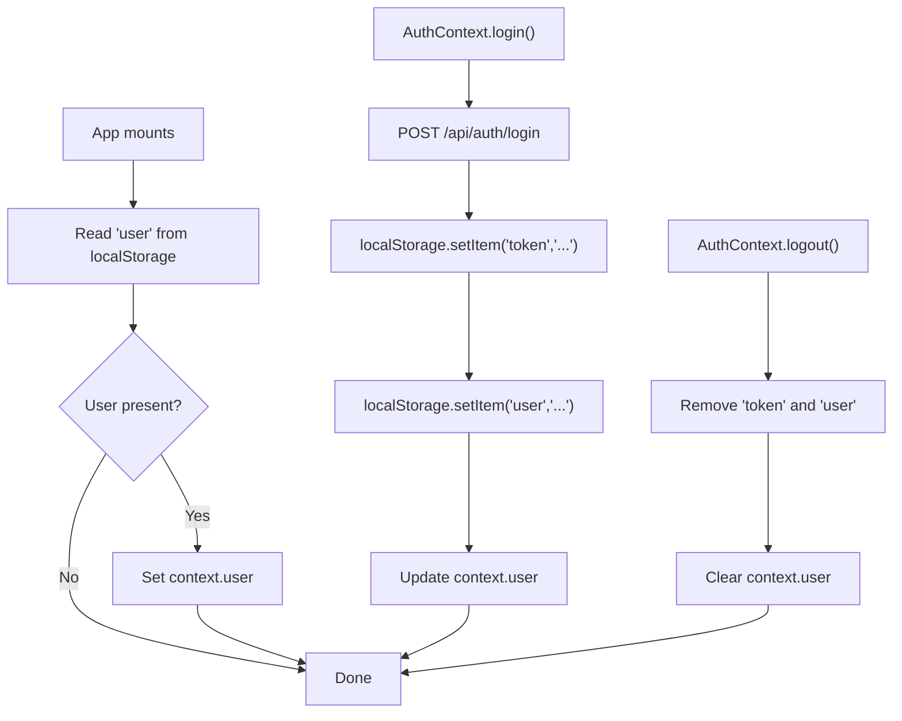
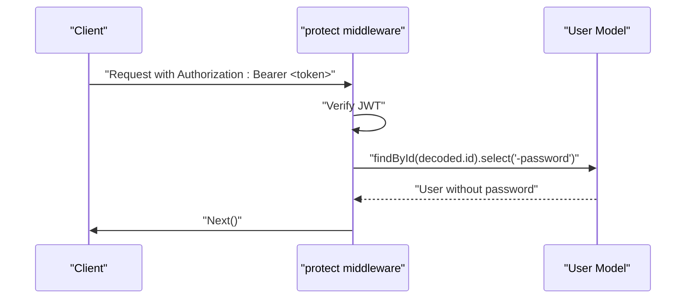
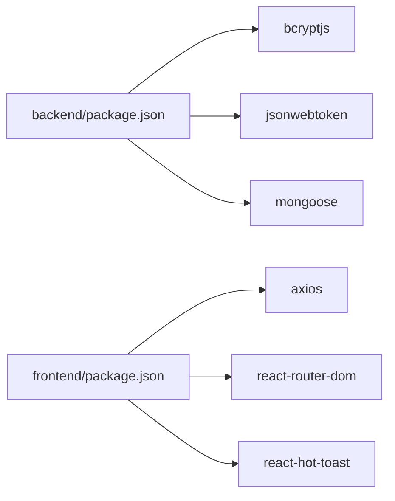

# Login & Registration Process

<cite>
**Referenced Files in This Document**
- [server.js](file://backend/server.js)
- [authRoutes.js](file://backend/routes/authRoutes.js)
- [authController.js](file://backend/controllers/authController.js)
- [User.js](file://backend/models/User.js)
- [authMiddleware.js](file://backend/middleware/authMiddleware.js)
- [axios.js](file://frontend/src/api/axios.js)
- [api.js](file://frontend/src/services/api.js)
- [AuthContext.jsx](file://frontend/src/context/AuthContext.jsx)
- [Register.jsx](file://frontend/src/pages/Register.jsx)
- [Login.jsx](file://frontend/src/pages/Login.jsx)
- [App.jsx](file://frontend/src/App.jsx)
- [package.json](file://backend/package.json)
- [package.json](file://frontend/package.json)
</cite>

## Update Summary
**Changes Made**
- Enhanced frontend form validation with phone number validation for Indian mobile numbers
- Implemented real-time phone number formatting and input restrictions
- Replaced alert dialogs with toast notifications for improved user experience
- Added comprehensive input validation feedback system
- Integrated react-hot-toast for consistent notification handling

## Table of Contents
1. [Introduction](#introduction)
2. [Project Structure](#project-structure)
3. [Core Components](#core-components)
4. [Architecture Overview](#architecture-overview)
5. [Detailed Component Analysis](#detailed-component-analysis)
6. [Dependency Analysis](#dependency-analysis)
7. [Performance Considerations](#performance-considerations)
8. [Security Measures](#security-measures)
9. [Troubleshooting Guide](#troubleshooting-guide)
10. [Conclusion](#conclusion)
11. [Appendices](#appendices)

## Introduction
This document explains the end-to-end user registration and login processes in the E-commerce App. It covers backend flows (input validation, password hashing with bcrypt, duplicate email checks, JWT token generation), frontend form handling and authentication state management, and security considerations such as CORS, bearer token usage, and session persistence. The system now features enhanced frontend validation with phone number verification, real-time input formatting, and toast notifications replacing traditional alert dialogs for improved user experience.

## Project Structure
The authentication system spans the backend Express server and MongoDB via Mongoose, and the React frontend with Axios and local storage for tokens and user data. The frontend now includes comprehensive validation and notification systems.

**Diagram sources**
- [server.js:1-102](file://backend/server.js#L1-L102)
- [authRoutes.js:1-9](file://backend/routes/authRoutes.js#L1-L9)
- [authController.js:1-27](file://backend/controllers/authController.js#L1-L27)
- [User.js:1-20](file://backend/models/User.js#L1-L20)
- [authMiddleware.js:1-20](file://backend/middleware/authMiddleware.js#L1-L20)
- [axios.js:1-17](file://frontend/src/api/axios.js#L1-L17)
- [api.js:1-8](file://frontend/src/services/api.js#L1-L8)
- [Register.jsx:1-113](file://frontend/src/pages/Register.jsx#L1-L113)
- [Login.jsx:1-83](file://frontend/src/pages/Login.jsx#L1-L83)
- [AuthContext.jsx:1-33](file://frontend/src/context/AuthContext.jsx#L1-L33)
- [App.jsx:198](file://frontend/src/App.jsx#L198)

**Section sources**
- [server.js:1-102](file://backend/server.js#L1-L102)
- [authRoutes.js:1-9](file://backend/routes/authRoutes.js#L1-L9)
- [authController.js:1-27](file://backend/controllers/authController.js#L1-L27)
- [User.js:1-20](file://backend/models/User.js#L1-L20)
- [authMiddleware.js:1-20](file://backend/middleware/authMiddleware.js#L1-L20)
- [axios.js:1-17](file://frontend/src/api/axios.js#L1-L17)
- [api.js:1-8](file://frontend/src/services/api.js#L1-L8)
- [Register.jsx:1-113](file://frontend/src/pages/Register.jsx#L1-L113)
- [Login.jsx:1-83](file://frontend/src/pages/Login.jsx#L1-L83)
- [AuthContext.jsx:1-33](file://frontend/src/context/AuthContext.jsx#L1-L33)
- [App.jsx:198](file://frontend/src/App.jsx#L198)

## Core Components
- Backend server initializes CORS, routes, and middleware; exposes authentication endpoints under /api/auth.
- Authentication controller handles registration and login, including duplicate email checks and JWT signing.
- User model enforces bcrypt hashing on save and provides password comparison.
- Frontend pages manage form state, submit requests, persist tokens, and redirect on success.
- Axios interceptors attach Authorization headers and handle 401 responses globally.
- Auth context centralizes login/logout and user state hydration from localStorage.
- **Enhanced**: Real-time phone number validation with Indian mobile number format (/^[6-9]\d{9}$/).
- **Enhanced**: Toast notification system using react-hot-toast for consistent user feedback.
- **Enhanced**: Formatted input handling with automatic digit stripping and length limitations.

**Section sources**
- [server.js:22-49](file://backend/server.js#L22-L49)
- [authRoutes.js:6-7](file://backend/routes/authRoutes.js#L6-L7)
- [authController.js:6-16](file://backend/controllers/authController.js#L6-L16)
- [authController.js:18-27](file://backend/controllers/authController.js#L18-L27)
- [User.js:11-18](file://backend/models/User.js#L11-L18)
- [Register.jsx:11-22](file://frontend/src/pages/Register.jsx#L11-L22)
- [Login.jsx:10-21](file://frontend/src/pages/Login.jsx#L10-L21)
- [axios.js:4-8](file://frontend/src/api/axios.js#L4-L8)
- [axios.js:10-16](file://frontend/src/api/axios.js#L10-L16)
- [AuthContext.jsx:16-28](file://frontend/src/context/AuthContext.jsx#L16-L28)
- [Register.jsx:17-27](file://frontend/src/pages/Register.jsx#L17-L27)
- [Register.jsx:69](file://frontend/src/pages/Register.jsx#L69)

## Architecture Overview
The authentication architecture follows a clean separation of concerns with enhanced frontend validation and notification systems:
- Routes define HTTP endpoints for registration and login.
- Controllers encapsulate business logic and interact with the User model.
- Middleware protects downstream routes and verifies JWTs.
- Frontend communicates via Axios with automatic bearer token injection, centralized error handling, and comprehensive form validation.
- Toast notifications provide immediate feedback for user actions.

**Diagram sources**
- [Register.jsx:17-27](file://frontend/src/pages/Register.jsx#L17-L27)
- [Register.jsx:29-38](file://frontend/src/pages/Register.jsx#L29-L38)
- [Login.jsx:11-30](file://frontend/src/pages/Login.jsx#L11-L30)
- [axios.js:4-8](file://frontend/src/api/axios.js#L4-L8)
- [api.js:1-8](file://frontend/src/services/api.js#L1-L8)
- [server.js:57-63](file://backend/server.js#L57-L63)
- [authRoutes.js:6-7](file://backend/routes/authRoutes.js#L6-L7)
- [authController.js:6-16](file://backend/controllers/authController.js#L6-L16)
- [authController.js:18-27](file://backend/controllers/authController.js#L18-L27)
- [User.js:11-18](file://backend/models/User.js#L11-L18)

## Detailed Component Analysis

### Backend Registration Flow
- Input extraction: name, email, password, phone from request body.
- Duplicate email check: findOne by email; responds with error if found.
- User creation: User.create persists with bcrypt-hashed password via pre-save hook.
- Token generation: signToken creates a signed JWT with a 7-day expiry.
- Response: returns token and sanitized user object (without password).

**Diagram sources**
- [authController.js:8-14](file://backend/controllers/authController.js#L8-L14)
- [User.js:11-14](file://backend/models/User.js#L11-L14)

**Section sources**
- [authController.js:6-16](file://backend/controllers/authController.js#L6-L16)
- [User.js:11-18](file://backend/models/User.js#L11-L18)

### Backend Login Flow
- Credential lookup: findOne by email.
- Password verification: matchPassword compares bcrypt hash.
- Token generation: signToken creates a signed JWT with a 7-day expiry.
- Response: returns token and sanitized user object.

**Diagram sources**
- [authController.js:18-26](file://backend/controllers/authController.js#L18-L26)
- [User.js:16-18](file://backend/models/User.js#L16-L18)

**Section sources**
- [authController.js:18-27](file://backend/controllers/authController.js#L18-L27)
- [User.js:16-18](file://backend/models/User.js#L16-L18)

### Enhanced Frontend Registration Implementation
- **Enhanced Form State**: Manages name, email, phone, password with real-time validation.
- **Phone Number Validation**: Uses regex `/^[6-9]\d{9}$/` for 10-digit Indian mobile numbers.
- **Real-time Formatting**: Phone input strips non-digits and limits to 10 characters.
- **Email Validation**: Comprehensive email format validation using regex pattern.
- **Toast Notifications**: Uses react-hot-toast for immediate user feedback.
- **Submission**: Posts to /api/auth/register via Axios with validation.
- **Persistence**: Stores token and user in localStorage.
- **Feedback**: Toast notifications for success/failure; navigates to home on success.

**Diagram sources**
- [Register.jsx:17-27](file://frontend/src/pages/Register.jsx#L17-L27)
- [Register.jsx:29-38](file://frontend/src/pages/Register.jsx#L29-L38)
- [Register.jsx:69](file://frontend/src/pages/Register.jsx#L69)
- [axios.js:4-8](file://frontend/src/api/axios.js#L4-L8)
- [api.js:1-8](file://frontend/src/services/api.js#L1-L8)

**Section sources**
- [Register.jsx:1-113](file://frontend/src/pages/Register.jsx#L1-L113)
- [axios.js:1-17](file://frontend/src/api/axios.js#L1-L17)
- [api.js:1-8](file://frontend/src/services/api.js#L1-L8)

### Frontend Login Implementation
- Form state: manages email, password.
- Submission: posts to /api/auth/login via Axios.
- Persistence: stores token and user in localStorage.
- **Note**: Currently uses alert dialogs for feedback instead of toast notifications.

**Diagram sources**
- [Login.jsx:11-30](file://frontend/src/pages/Login.jsx#L11-L30)
- [axios.js:4-8](file://frontend/src/api/axios.js#L4-L8)
- [api.js:1-8](file://frontend/src/services/api.js#L1-L8)

**Section sources**
- [Login.jsx:1-83](file://frontend/src/pages/Login.jsx#L1-L83)
- [axios.js:1-17](file://frontend/src/api/axios.js#L1-L17)
- [api.js:1-8](file://frontend/src/services/api.js#L1-L8)

### Authentication Context and Session Management
- Hydration: reads user from localStorage on mount to restore session.
- Login: performs POST /api/auth/login, stores token and user, updates context.
- Logout: removes token and user from localStorage and clears context.

**Diagram sources**
- [AuthContext.jsx:10-14](file://frontend/src/context/AuthContext.jsx#L10-L14)
- [AuthContext.jsx:16-28](file://frontend/src/context/AuthContext.jsx#L16-L28)

**Section sources**
- [AuthContext.jsx:1-33](file://frontend/src/context/AuthContext.jsx#L1-L33)

### Protected Routes and Role-Based Access
- protect middleware extracts Bearer token from Authorization header, verifies it, attaches user (without password) to request, and continues.
- admin middleware checks user role for admin-only endpoints.

**Diagram sources**
- [authMiddleware.js:4-15](file://backend/middleware/authMiddleware.js#L4-L15)
- [User.js:10](file://backend/models/User.js#L10)

**Section sources**
- [authMiddleware.js:1-20](file://backend/middleware/authMiddleware.js#L1-L20)
- [User.js:10](file://backend/models/User.js#L10)

### Enhanced Validation and Notification Systems
- **Phone Number Validation**: Indian mobile numbers validated with `/^[6-9]\d{9}$/` pattern.
- **Real-time Input Formatting**: Phone input automatically strips non-digits and limits to 10 characters.
- **Email Validation**: Comprehensive email format validation using regex pattern.
- **Toast Notifications**: Consistent user feedback using react-hot-toast library.
- **Input Restrictions**: Phone input has maxLength={10} and tel type for mobile optimization.

**Section sources**
- [Register.jsx:17-27](file://frontend/src/pages/Register.jsx#L17-L27)
- [Register.jsx:69](file://frontend/src/pages/Register.jsx#L69)
- [Register.jsx:4](file://frontend/src/pages/Register.jsx#L4)
- [App.jsx:198](file://frontend/src/App.jsx#L198)

## Dependency Analysis
- Backend dependencies include bcryptjs for password hashing, jsonwebtoken for JWT signing, and mongoose for ODM.
- Frontend depends on axios for HTTP requests, react-router-dom for navigation, and react-hot-toast for notifications.
- **Enhanced**: Added react-hot-toast dependency for consistent user feedback across the application.

**Diagram sources**
- [package.json:8-22](file://backend/package.json#L8-L22)
- [package.json:8-16](file://frontend/package.json#L8-L16)

**Section sources**
- [package.json:8-22](file://backend/package.json#L8-L22)
- [package.json:8-16](file://frontend/package.json#L8-L16)

## Performance Considerations
- Password hashing cost: bcrypt uses a fixed salt and cost factor in the model's pre-save hook; ensure appropriate deployment settings for production workloads.
- Token lifetime: JWT expires in seven days; consider refresh token strategies for long-lived sessions.
- Request parsing: server enables JSON and URL-encoded bodies; keep payload sizes reasonable for registration/login.
- Frontend caching: localStorage is synchronous and single-threaded; avoid excessive writes during rapid user interactions.
- **Enhanced**: Toast notifications are lightweight and don't block UI thread, improving perceived performance.
- **Enhanced**: Real-time validation prevents unnecessary API calls by catching errors client-side.

## Security Measures
- CORS configuration: Strict origins list with credentials support and allowed headers/methods; preflight caching reduces latency.
- Bearer token injection: Axios interceptor automatically attaches Authorization header for protected routes.
- Token removal on 401: Response interceptor clears token on unauthorized responses to prevent stale tokens.
- Protected routes: JWT verification middleware decodes token and attaches user without password.
- Role-based access: Admin middleware restricts endpoints to admin users.
- **Enhanced**: Input sanitization: Phone numbers are automatically sanitized by removing non-digit characters.
- **Enhanced**: Real-time validation: Client-side validation prevents malformed data from reaching the server.

**Diagram sources**
- [server.js:22-49](file://backend/server.js#L22-L49)
- [axios.js:4-8](file://frontend/src/api/axios.js#L4-L8)
- [axios.js:10-16](file://frontend/src/api/axios.js#L10-L16)
- [authMiddleware.js:4-15](file://backend/middleware/authMiddleware.js#L4-L15)

**Section sources**
- [server.js:22-49](file://backend/server.js#L22-L49)
- [axios.js:4-8](file://frontend/src/api/axios.js#L4-L8)
- [axios.js:10-16](file://frontend/src/api/axios.js#L10-L16)
- [authMiddleware.js:4-15](file://backend/middleware/authMiddleware.js#L4-L15)

## Troubleshooting Guide
- Registration fails with "Email exists":
  - Cause: Duplicate email detected by the backend.
  - Action: Prompt user to use another email or log in instead.
  - Section sources
    - [authController.js:9-11](file://backend/controllers/authController.js#L9-L11)

- Login fails with "Invalid credentials":
  - Cause: No user found or password mismatch.
  - Action: Prompt user to re-enter credentials; ensure caps lock is off and spelling is correct.
  - Section sources
    - [authController.js:21-22](file://backend/controllers/authController.js#L21-L22)

- 401 Unauthorized after login:
  - Cause: Token missing or invalid; response interceptor clears token on 401.
  - Action: Re-authenticate; check browser network tab for Authorization header presence.
  - Section sources
    - [axios.js:10-16](file://frontend/src/api/axios.js#L10-L16)

- Frontend shows stale user after logout:
  - Cause: Context not updated or localStorage not cleared.
  - Action: Ensure logout removes token and user; verify AuthContext state.
  - Section sources
    - [AuthContext.jsx:24-28](file://frontend/src/context/AuthContext.jsx#L24-L28)

- Protected route returns "Not authorized":
  - Cause: Missing or malformed Authorization header.
  - Action: Confirm interceptor injects Bearer token; verify JWT_SECRET environment variable.
  - Section sources
    - [authMiddleware.js:5-6](file://backend/middleware/authMiddleware.js#L5-L6)
    - [authMiddleware.js:9](file://backend/middleware/authMiddleware.js#L9)

- **Enhanced**: Phone number validation fails:
  - Cause: Phone number doesn't match Indian mobile pattern (6-9 followed by 9 digits).
  - Action: Ensure phone number starts with 6, 7, 8, or 9 and is exactly 10 digits.
  - Section sources
    - [Register.jsx:17-21](file://frontend/src/pages/Register.jsx#L17-L21)

- **Enhanced**: Toast notifications not appearing:
  - Cause: react-hot-toast not properly configured or imported.
  - Action: Verify Toaster component is included in App.jsx and react-hot-toast is installed.
  - Section sources
    - [App.jsx:198](file://frontend/src/App.jsx#L198)
    - [package.json:14](file://frontend/package.json#L14)

## Conclusion
The authentication system integrates secure backend processing (bcrypt hashing, JWT signing, duplicate checks) with robust frontend state management (form handling, token persistence, global error handling). The system now features enhanced validation with phone number verification, real-time input formatting, and toast notifications replacing traditional alert dialogs for improved user experience. The architecture supports protected routes and role-based access while maintaining a clean separation of concerns. For production hardening, consider adding input sanitization, rate limiting, CSRF protection, and password reset/account verification flows.

## Appendices

### API Endpoints Reference
- POST /api/auth/register
  - Body: { name, email, phone, password }
  - Response: { token, user: { id, name, email, role } }
  - Status: 201 on success, 400 on duplicate email, 500 on server error
  - Section sources
    - [authRoutes.js:6](file://backend/routes/authRoutes.js#L6)
    - [authController.js:6-16](file://backend/controllers/authController.js#L6-L16)

- POST /api/auth/login
  - Body: { email, password }
  - Response: { token, user: { id, name, email, role } }
  - Status: 200 on success, 401 on invalid credentials, 500 on server error
  - Section sources
    - [authRoutes.js:7](file://backend/routes/authRoutes.js#L7)
    - [authController.js:18-27](file://backend/controllers/authController.js#L18-L27)

### Frontend Integration Patterns
- Axios configuration:
  - Automatic Authorization header injection for protected routes.
  - Global 401 handling to remove token.
  - Section sources
    - [axios.js:4-8](file://frontend/src/api/axios.js#L4-L8)
    - [axios.js:10-16](file://frontend/src/api/axios.js#L10-L16)

- API service wrapper:
  - Centralized base URL and interceptors.
  - Section sources
    - [api.js:1-8](file://frontend/src/services/api.js#L1-L8)

- **Enhanced**: Toast notification system:
  - Centralized toast configuration in App.jsx.
  - Consistent notification styling and positioning.
  - Section sources
    - [App.jsx:198](file://frontend/src/App.jsx#L198)
    - [Register.jsx:4](file://frontend/src/pages/Register.jsx#L4)

### Practical Examples
- Registration form submission:
  - Collects name, email, phone, password with real-time validation; posts to /api/auth/register; stores token/user; shows toast notifications; navigates on success.
  - Section sources
    - [Register.jsx:17-38](file://frontend/src/pages/Register.jsx#L17-L38)

- Login form submission:
  - Posts credentials to /api/auth/login; stores token/user; currently uses alert dialogs for feedback; navigates on success.
  - Section sources
    - [Login.jsx:11-30](file://frontend/src/pages/Login.jsx#L11-L30)

- Protected route usage:
  - Apply protect middleware to routes requiring authentication; apply admin middleware for admin-only routes.
  - Section sources
    - [authMiddleware.js:4-15](file://backend/middleware/authMiddleware.js#L4-L15)
    - [authMiddleware.js:17-20](file://backend/middleware/authMiddleware.js#L17-L20)

### Enhanced Validation Features
- **Phone Number Validation**:
  - Pattern: `/^[6-9]\d{9}$/` for 10-digit Indian mobile numbers
  - Real-time formatting: Automatic digit stripping and length limitation
  - Input restrictions: Tel type and maxLength={10}
  - Section sources
    - [Register.jsx:17-21](file://frontend/src/pages/Register.jsx#L17-L21)
    - [Register.jsx:69](file://frontend/src/pages/Register.jsx#L69)

- **Email Validation**:
  - Pattern: `/^[\w-\.]+@([\w-]+\.)+[\w-]{2,4}$/` for comprehensive email format
  - Real-time validation feedback
  - Section sources
    - [Register.jsx:23-27](file://frontend/src/pages/Register.jsx#L23-L27)

- **Toast Notification System**:
  - Library: react-hot-toast
  - Positioning: Top-right corner
  - Consistent styling across all user interactions
  - Section sources
    - [Register.jsx:4](file://frontend/src/pages/Register.jsx#L4)
    - [App.jsx:198](file://frontend/src/App.jsx#L198)

### Additional Workflows (Planned Enhancements)
- Account verification:
  - Add email verification tokens and resend endpoints; update user status upon verification.
- Password reset:
  - Implement reset token generation, email delivery, and secure password update endpoint.
- Session management:
  - Introduce refresh tokens and sliding expiration; enforce logout on token refresh failures.
- **Enhanced**: Login page toast notifications:
  - Replace alert dialogs with toast notifications for consistent user experience.
- **Enhanced**: Real-time validation improvements:
  - Expand validation to cover additional input fields and edge cases.