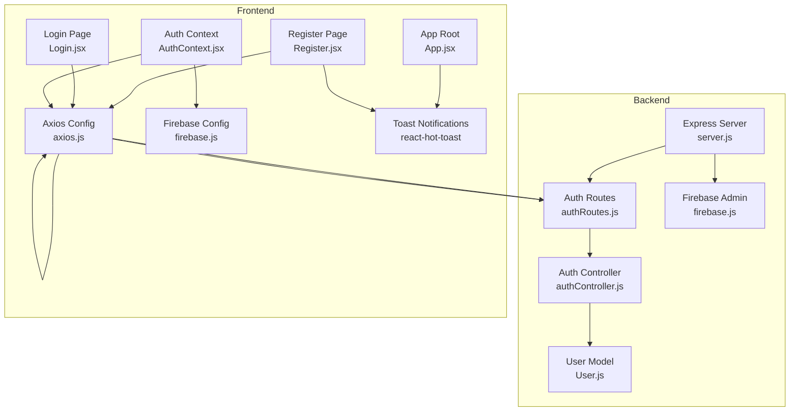
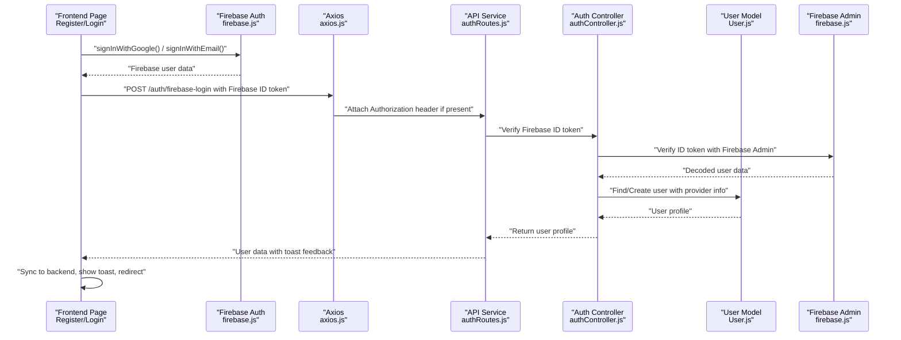
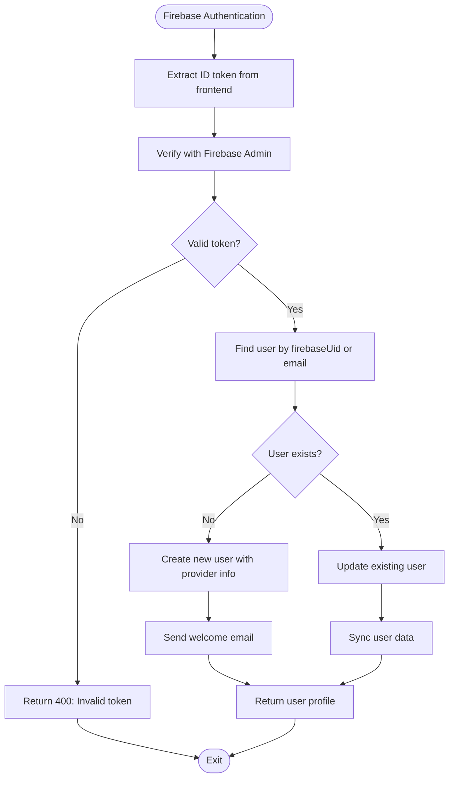
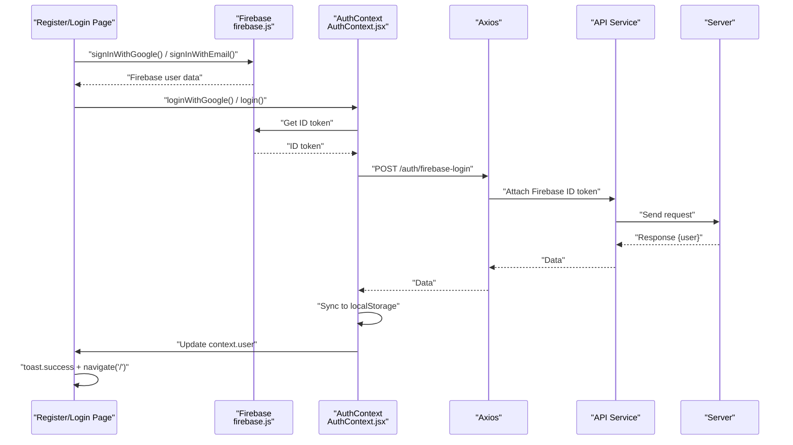
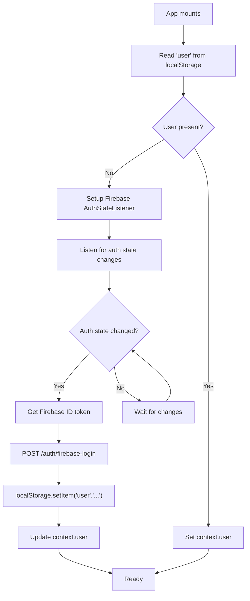
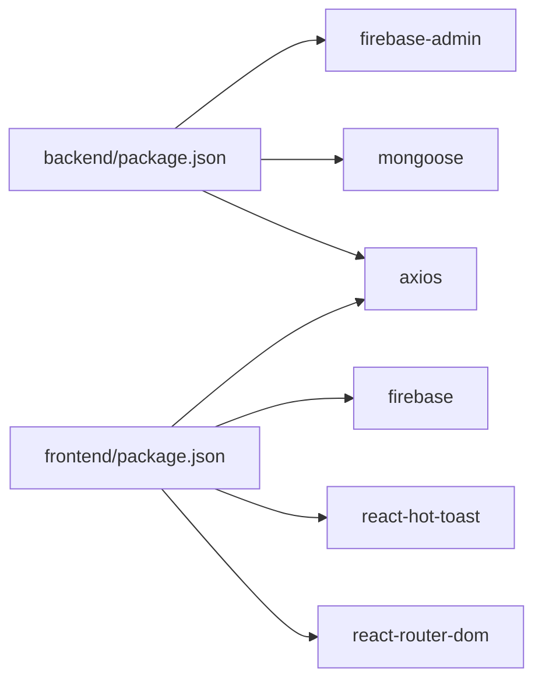
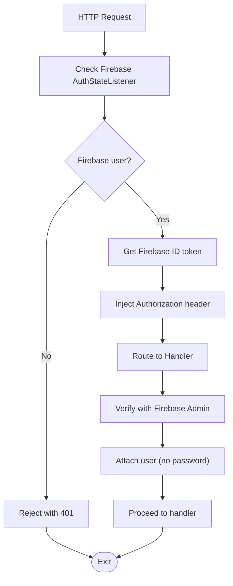

# Login & Registration Process

<cite>
**Referenced Files in This Document**
- [server.js](file://backend/server.js)
- [authRoutes.js](file://backend/routes/authRoutes.js)
- [authController.js](file://backend/controllers/authController.js)
- [User.js](file://backend/models/User.js)
- [firebase.js](file://backend/config/firebase.js)
- [AuthContext.jsx](file://frontend/src/context/AuthContext.jsx)
- [Register.jsx](file://frontend/src/pages/Register.jsx)
- [Login.jsx](file://frontend/src/pages/Login.jsx)
- [App.jsx](file://frontend/src/App.jsx)
- [firebase.js](file://frontend/src/config/firebase.js)
- [axios.js](file://frontend/src/api/axios.js)
- [package.json](file://backend/package.json)
- [package.json](file://frontend/package.json)
</cite>

## Update Summary
**Changes Made**
- Complete migration to Firebase Authentication system with Firebase ID token verification
- Removed JWT token generation in favor of Firebase-based authentication
- Simplified registration form focusing on essential fields (name, email, password)
- Enhanced error handling for popup-closed-by-user scenarios in Google authentication
- Integrated Firebase AuthStateListener for automatic session synchronization
- Updated backend authentication flow to work with Firebase user management
- Removed phone number validation requirements from registration form

## Table of Contents
1. [Introduction](#introduction)
2. [Project Structure](#project-structure)
3. [Core Components](#core-components)
4. [Architecture Overview](#architecture-overview)
5. [Detailed Component Analysis](#detailed-component-analysis)
6. [Dependency Analysis](#dependency-analysis)
7. [Performance Considerations](#performance-considerations)
8. [Security Measures](#security-measures)
9. [Troubleshooting Guide](#troubleshooting-guide)
10. [Conclusion](#conclusion)
11. [Appendices](#appendices)

## Introduction
This document explains the end-to-end user registration and login processes in the E-commerce App. The system now features a comprehensive Firebase Authentication integration that replaces the previous JWT-based authentication system. Users can authenticate via email/password or Google OAuth, with automatic session synchronization between Firebase and the backend user database. The system provides seamless authentication experiences with enhanced error handling for popup-closed-by-user scenarios and simplified form validation focused on essential user information.

## Project Structure
The authentication system now centers around Firebase Authentication with backend synchronization to the MongoDB user database. The frontend integrates Firebase AuthStateListener for automatic session management, while the backend validates Firebase ID tokens and maintains user profiles with provider information.

**Diagram sources**
- [server.js:1-120](file://backend/server.js#L1-L120)
- [authRoutes.js:1-9](file://backend/routes/authRoutes.js#L1-L9)
- [authController.js:1-69](file://backend/controllers/authController.js#L1-L69)
- [User.js:1-30](file://backend/models/User.js#L1-L30)
- [firebase.js:1-13](file://backend/config/firebase.js#L1-L13)
- [axios.js:1-29](file://frontend/src/api/axios.js#L1-L29)
- [Register.jsx:1-162](file://frontend/src/pages/Register.jsx#L1-L162)
- [Login.jsx:1-133](file://frontend/src/pages/Login.jsx#L1-L133)
- [AuthContext.jsx:1-86](file://frontend/src/context/AuthContext.jsx#L1-L86)
- [firebase.js:1-67](file://frontend/src/config/firebase.js#L1-L67)
- [App.jsx:198](file://frontend/src/App.jsx#L198)

**Section sources**
- [server.js:1-120](file://backend/server.js#L1-L120)
- [authRoutes.js:1-9](file://backend/routes/authRoutes.js#L1-L9)
- [authController.js:1-69](file://backend/controllers/authController.js#L1-L69)
- [User.js:1-30](file://backend/models/User.js#L1-L30)
- [firebase.js:1-13](file://backend/config/firebase.js#L1-L13)
- [axios.js:1-29](file://frontend/src/api/axios.js#L1-L29)
- [Register.jsx:1-162](file://frontend/src/pages/Register.jsx#L1-L162)
- [Login.jsx:1-133](file://frontend/src/pages/Login.jsx#L1-L133)
- [AuthContext.jsx:1-86](file://frontend/src/context/AuthContext.jsx#L1-L86)
- [firebase.js:1-67](file://frontend/src/config/firebase.js#L1-L67)
- [App.jsx:198](file://frontend/src/App.jsx#L198)

## Core Components
- **Firebase Authentication**: Complete replacement of JWT-based system with Firebase Authentication for user management and session handling.
- **Backend Firebase Login**: New `/auth/firebase-login` endpoint that verifies Firebase ID tokens and synchronizes user data with MongoDB.
- **Auth Context**: Centralizes authentication state with Firebase AuthStateListener for automatic session management and user synchronization.
- **Enhanced Error Handling**: Improved handling of popup-closed-by-user scenarios with graceful user experience.
- **Simplified Forms**: Registration form focuses on essential fields (name, email, password) with optional phone number support.
- **Automatic Session Synchronization**: Firebase AuthStateListener automatically updates backend user profiles on authentication state changes.
- **Provider Tracking**: Backend tracks authentication providers (google, email) for flexible user management.

**Section sources**
- [authController.js:5-68](file://backend/controllers/authController.js#L5-L68)
- [AuthContext.jsx:12-29](file://frontend/src/context/AuthContext.jsx#L12-L29)
- [Register.jsx:37-54](file://frontend/src/pages/Register.jsx#L37-L54)
- [Login.jsx:30-47](file://frontend/src/pages/Login.jsx#L30-L47)
- [User.js:25-26](file://backend/models/User.js#L25-L26)

## Architecture Overview
The authentication architecture now follows Firebase-centric design with backend synchronization:
- Firebase Authentication handles all user authentication flows (email/password, Google OAuth).
- Backend verifies Firebase ID tokens and maintains synchronized user profiles in MongoDB.
- AuthContext manages authentication state with automatic Firebase AuthStateListener integration.
- Frontend communicates via Axios with automatic Firebase ID token injection and centralized error handling.
- Toast notifications provide immediate feedback for user actions with enhanced error handling.

**Diagram sources**
- [Register.jsx:37-54](file://frontend/src/pages/Register.jsx#L37-L54)
- [Login.jsx:30-47](file://frontend/src/pages/Login.jsx#L30-L47)
- [AuthContext.jsx:12-29](file://frontend/src/context/AuthContext.jsx#L12-L29)
- [axios.js:8-16](file://frontend/src/api/axios.js#L8-L16)
- [authRoutes.js:6](file://backend/routes/authRoutes.js#L6)
- [authController.js:5-68](file://backend/controllers/authController.js#L5-L68)
- [User.js:25-26](file://backend/models/User.js#L25-L26)

## Detailed Component Analysis

### Firebase Authentication Flow
- **Firebase Authentication**: Handles all authentication via Firebase (email/password, Google OAuth).
- **ID Token Verification**: Backend verifies Firebase ID tokens using Firebase Admin SDK.
- **User Synchronization**: Creates or updates user profiles in MongoDB with provider information.
- **Provider Tracking**: Tracks authentication method (google, email) for flexible user management.
- **Automatic Sync**: AuthContext uses Firebase AuthStateListener to keep backend synchronized.

**Diagram sources**
- [authController.js:5-68](file://backend/controllers/authController.js#L5-L68)
- [AuthContext.jsx:12-29](file://frontend/src/context/AuthContext.jsx#L12-L29)

**Section sources**
- [authController.js:5-68](file://backend/controllers/authController.js#L5-L68)
- [AuthContext.jsx:12-29](file://frontend/src/context/AuthContext.jsx#L12-L29)

### Enhanced Frontend Authentication Implementation
- **Firebase Integration**: Complete Firebase Authentication integration with AuthStateListener for automatic session management.
- **Simplified Forms**: Registration form focuses on essential fields (name, email, password) with optional phone number support.
- **Enhanced Error Handling**: Improved handling of popup-closed-by-user scenarios with graceful user experience.
- **Google Authentication**: Seamless Google OAuth integration with enhanced error handling for popup closures.
- **Email/Password Authentication**: Direct Firebase email/password authentication with automatic backend synchronization.
- **Automatic Token Injection**: Axios interceptors automatically attach Firebase ID tokens to requests.
- **Session Persistence**: LocalStorage-based session persistence with automatic Firebase state synchronization.

**Diagram sources**
- [Register.jsx:37-54](file://frontend/src/pages/Register.jsx#L37-L54)
- [Login.jsx:30-47](file://frontend/src/pages/Login.jsx#L30-L47)
- [AuthContext.jsx:50-66](file://frontend/src/context/AuthContext.jsx#L50-L66)
- [axios.js:8-16](file://frontend/src/api/axios.js#L8-L16)
- [authRoutes.js:6](file://backend/routes/authRoutes.js#L6)

**Section sources**
- [Register.jsx:1-162](file://frontend/src/pages/Register.jsx#L1-L162)
- [Login.jsx:1-133](file://frontend/src/pages/Login.jsx#L1-L133)
- [AuthContext.jsx:1-86](file://frontend/src/context/AuthContext.jsx#L1-L86)
- [firebase.js:1-67](file://frontend/src/config/firebase.js#L1-L67)
- [axios.js:1-29](file://frontend/src/api/axios.js#L1-L29)

### Authentication Context and Session Management
- **Firebase AuthStateListener**: Automatically listens for authentication state changes and synchronizes with backend.
- **Automatic User Sync**: On authentication state changes, automatically fetches user data from backend.
- **Provider Integration**: Supports both Google and email authentication providers with unified user management.
- **Error Handling**: Graceful handling of authentication errors with user-friendly feedback.
- **Session Persistence**: Maintains user session across browser reloads and tab switches.

**Diagram sources**
- [AuthContext.jsx:31-48](file://frontend/src/context/AuthContext.jsx#L31-L48)
- [AuthContext.jsx:12-29](file://frontend/src/context/AuthContext.jsx#L12-L29)

**Section sources**
- [AuthContext.jsx:1-86](file://frontend/src/context/AuthContext.jsx#L1-L86)

### Enhanced Error Handling for Popup-Closed-By-User Scenarios
- **Graceful Error Handling**: Distinguishes between genuine authentication failures and user-initiated popup closures.
- **User Experience**: Prevents error notifications when users close Google authentication popups intentionally.
- **Error Logging**: Still logs errors for debugging while avoiding user-facing error messages.
- **Fallback Mechanisms**: Provides clear error messages for actual authentication failures.

**Section sources**
- [Register.jsx:44-48](file://frontend/src/pages/Register.jsx#L44-L48)
- [Login.jsx:37-41](file://frontend/src/pages/Login.jsx#L37-L41)

## Dependency Analysis
- **Backend Dependencies**: Firebase Admin SDK for ID token verification, MongoDB/Mongoose for user storage.
- **Frontend Dependencies**: Firebase SDK for authentication, axios for HTTP requests, react-router-dom for navigation, react-hot-toast for notifications.
- **Enhanced**: Firebase Admin SDK integration for backend ID token verification.
- **Enhanced**: AuthStateListener integration for automatic session management.
- **Enhanced**: Simplified frontend dependencies with focus on Firebase authentication.

**Diagram sources**
- [package.json:8-22](file://backend/package.json#L8-L22)
- [package.json:8-16](file://frontend/package.json#L8-L16)

**Section sources**
- [package.json:8-22](file://backend/package.json#L8-L22)
- [package.json:8-16](file://frontend/package.json#L8-L16)

## Performance Considerations
- **Firebase Authentication**: Leverages Firebase's global CDN and optimized authentication flows for faster authentication.
- **Automatic Session Management**: Firebase AuthStateListener reduces manual session management overhead.
- **Reduced Backend Load**: Firebase handles authentication while backend focuses on user profile synchronization.
- **Local Storage Optimization**: Minimal localStorage operations with efficient AuthStateListener integration.
- **Enhanced Error Handling**: Graceful handling of popup closures reduces unnecessary error processing.
- **Token Management**: Automatic Firebase ID token refreshing reduces manual token management complexity.

## Security Measures
- **Firebase Security**: Leverages Firebase Authentication's built-in security features and best practices.
- **ID Token Verification**: Backend verifies Firebase ID tokens using Firebase Admin SDK for secure authentication.
- **Provider Tracking**: Backend tracks authentication providers for auditability and security monitoring.
- **Automatic Token Injection**: Axios interceptors automatically attach Firebase ID tokens to authenticated requests.
- **Enhanced Error Handling**: Graceful error handling prevents information leakage while maintaining security.
- **Session Synchronization**: Real-time Firebase AuthStateListener ensures consistent authentication state.

**Diagram sources**
- [AuthContext.jsx:12-29](file://frontend/src/context/AuthContext.jsx#L12-L29)
- [axios.js:8-16](file://frontend/src/api/axios.js#L8-L16)
- [authController.js:13-14](file://backend/controllers/authController.js#L13-L14)

**Section sources**
- [AuthContext.jsx:12-29](file://frontend/src/context/AuthContext.jsx#L12-L29)
- [axios.js:8-16](file://frontend/src/api/axios.js#L8-L16)
- [authController.js:13-14](file://backend/controllers/authController.js#L13-L14)

## Troubleshooting Guide
- **Firebase Authentication Fails**:
  - Cause: Firebase configuration issues or network problems.
  - Action: Verify Firebase config, check browser console for errors, ensure internet connectivity.
  - Section sources
    - [firebase.js:5-13](file://frontend/src/config/firebase.js#L5-L13)
    - [AuthContext.jsx:12-29](file://frontend/src/context/AuthContext.jsx#L12-L29)

- **Google Authentication Popup Closes Unexpectedly**:
  - Cause: User closes popup or browser blocks popups.
  - Action: Check popup blocker settings, ensure HTTPS environment, verify Google OAuth configuration.
  - Section sources
    - [Register.jsx:44-48](file://frontend/src/pages/Register.jsx#L44-L48)
    - [Login.jsx:37-41](file://frontend/src/pages/Login.jsx#L37-L41)

- **Firebase ID Token Verification Fails**:
  - Cause: Invalid or expired Firebase ID token.
  - Action: Check Firebase authentication state, verify token expiration, ensure proper AuthStateListener setup.
  - Section sources
    - [authController.js:13-14](file://backend/controllers/authController.js#L13-L14)
    - [AuthContext.jsx:12-29](file://frontend/src/context/AuthContext.jsx#L12-L29)

- **User Profile Not Synchronized**:
  - Cause: Backend user creation/update issues or Firebase Admin SDK problems.
  - Action: Check Firebase Admin credentials, verify user creation logic, monitor backend logs.
  - Section sources
    - [authController.js:20-44](file://backend/controllers/authController.js#L20-L44)
    - [User.js:25-26](file://backend/models/User.js#L25-L26)

- **Registration Form Validation Issues**:
  - Cause: Email validation or form submission problems.
  - Action: Ensure email format validation passes, check form submission logic, verify toast notifications.
  - Section sources
    - [Register.jsx:19-23](file://frontend/src/pages/Register.jsx#L19-L23)
    - [Register.jsx:16-35](file://frontend/src/pages/Register.jsx#L16-L35)

- **Authentication State Not Persisting**:
  - Cause: AuthStateListener not properly configured or localStorage issues.
  - Action: Verify AuthStateListener setup, check localStorage availability, ensure proper cleanup on logout.
  - Section sources
    - [AuthContext.jsx:31-48](file://frontend/src/context/AuthContext.jsx#L31-L48)
    - [AuthContext.jsx:68-76](file://frontend/src/context/AuthContext.jsx#L68-L76)

- **Backend User Creation Fails**:
  - Cause: Database connection issues or user schema validation problems.
  - Action: Check MongoDB connection, verify user schema constraints, monitor backend error logs.
  - Section sources
    - [User.js:3-27](file://backend/models/User.js#L3-L27)
    - [authController.js:33-44](file://backend/controllers/authController.js#L33-L44)

## Conclusion
The authentication system has been completely transformed to leverage Firebase Authentication for seamless user management and session handling. The system now provides enhanced user experience with simplified forms, improved error handling for popup-closed-by-user scenarios, and automatic session synchronization between Firebase and the backend user database. The architecture maintains security through Firebase's enterprise-grade authentication while reducing complexity through automatic token management and provider tracking. For production deployment, ensure proper Firebase configuration, monitor authentication flows, and maintain robust error handling for various authentication scenarios.

## Appendices

### API Endpoints Reference
- **POST /auth/firebase-login**
  - Body: { idToken }
  - Response: { user: { id, name, email, phone, photo, role, provider } }
  - Status: 200 on success, 400 on invalid token, 500 on server error
  - Section sources
    - [authRoutes.js:6](file://backend/routes/authRoutes.js#L6)
    - [authController.js:5-68](file://backend/controllers/authController.js#L5-L68)

### Frontend Integration Patterns
- **Firebase Authentication Integration**:
  - AuthStateListener for automatic session management
  - ID token acquisition for backend synchronization
  - Provider-specific authentication flows
  - Section sources
    - [AuthContext.jsx:12-29](file://frontend/src/context/AuthContext.jsx#L12-L29)
    - [firebase.js:21-53](file://frontend/src/config/firebase.js#L21-L53)

- **Enhanced Error Handling**:
  - Popup-closed-by-user scenario detection
  - Graceful error messaging for authentication failures
  - User-friendly feedback for authentication states
  - Section sources
    - [Register.jsx:44-48](file://frontend/src/pages/Register.jsx#L44-L48)
    - [Login.jsx:37-41](file://frontend/src/pages/Login.jsx#L37-L41)

- **Simplified Form Validation**:
  - Essential field validation (email, password)
  - Optional phone number support
  - Real-time validation feedback
  - Section sources
    - [Register.jsx:19-23](file://frontend/src/pages/Register.jsx#L19-L23)
    - [Register.jsx:16-35](file://frontend/src/pages/Register.jsx#L16-L35)

### Practical Examples
- **Firebase Authentication Flow**:
  - signInWithGoogle() for Google OAuth
  - signInWithEmail() for email/password authentication
  - Automatic backend synchronization via ID token verification
  - Section sources
    - [firebase.js:21-53](file://frontend/src/config/firebase.js#L21-L53)
    - [AuthContext.jsx:50-66](file://frontend/src/context/AuthContext.jsx#L50-L66)
    - [authController.js:5-68](file://backend/controllers/authController.js#L5-L68)

- **Enhanced Error Handling**:
  - Popup-closed-by-user detection and handling
  - User-friendly error messaging for authentication failures
  - Graceful degradation for authentication issues
  - Section sources
    - [Register.jsx:44-48](file://frontend/src/pages/Register.jsx#L44-L48)
    - [Login.jsx:37-41](file://frontend/src/pages/Login.jsx#L37-L41)

- **Simplified Registration Process**:
  - Essential field validation only (name, email, password)
  - Optional phone number support
  - Seamless Google authentication integration
  - Section sources
    - [Register.jsx:16-35](file://frontend/src/pages/Register.jsx#L16-L35)
    - [Register.jsx:37-54](file://frontend/src/pages/Register.jsx#L37-L54)

### Enhanced Features
- **Firebase Authentication Features**:
  - Complete Firebase Authentication integration
  - Automatic session management with AuthStateListener
  - Provider tracking (google, email)
  - Enhanced error handling for popup scenarios
  - Section sources
    - [firebase.js:1-67](file://frontend/src/config/firebase.js#L1-L67)
    - [AuthContext.jsx:12-29](file://frontend/src/context/AuthContext.jsx#L12-L29)
    - [User.js:25-26](file://backend/models/User.js#L25-L26)

- **Enhanced Error Handling**:
  - Popup-closed-by-user scenario detection
  - Graceful user experience for authentication interruptions
  - Detailed error logging while preventing user confusion
  - Section sources
    - [Register.jsx:44-48](file://frontend/src/pages/Register.jsx#L44-L48)
    - [Login.jsx:37-41](file://frontend/src/pages/Login.jsx#L37-L41)

- **Simplified User Experience**:
  - Reduced form complexity with essential fields only
  - Enhanced Google authentication with improved error handling
  - Automatic session synchronization between Firebase and backend
  - Section sources
    - [Register.jsx:16-35](file://frontend/src/pages/Register.jsx#L16-L35)
    - [AuthContext.jsx:12-29](file://frontend/src/context/AuthContext.jsx#L12-L29)