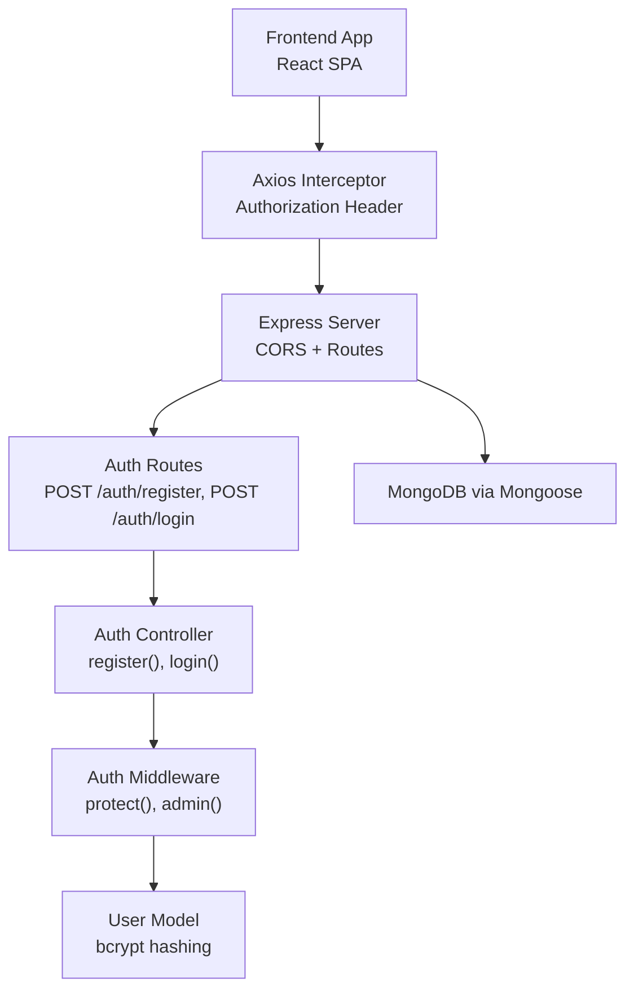
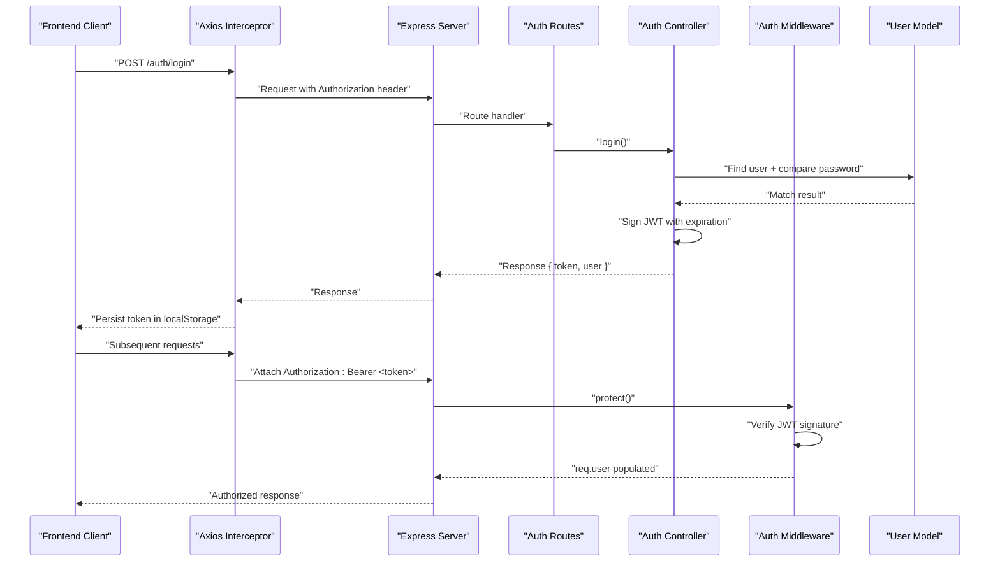
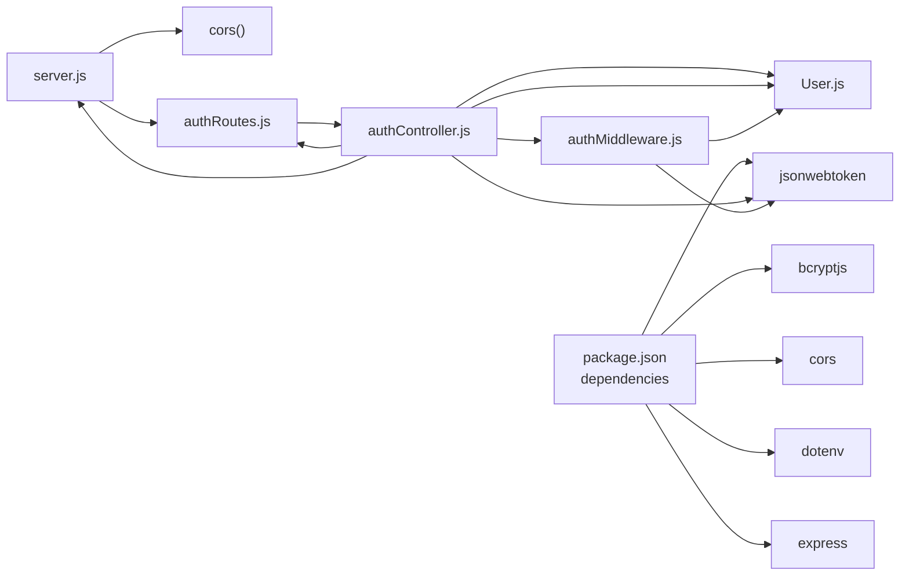

# Security Considerations & Best Practices

<cite>
**Referenced Files in This Document**
- [server.js](file://backend/server.js)
- [authController.js](file://backend/controllers/authController.js)
- [authMiddleware.js](file://backend/middleware/authMiddleware.js)
- [User.js](file://backend/models/User.js)
- [authRoutes.js](file://backend/routes/authRoutes.js)
- [AuthContext.jsx](file://frontend/src/context/AuthContext.jsx)
- [axios.js](file://frontend/src/api/axios.js)
- [Login.jsx](file://frontend/src/pages/Login.jsx)
- [Register.jsx](file://frontend/src/pages/Register.jsx)
- [db.js](file://backend/config/db.js)
- [package.json](file://backend/package.json)
</cite>

## Table of Contents
1. [Introduction](#introduction)
2. [Project Structure](#project-structure)
3. [Core Components](#core-components)
4. [Architecture Overview](#architecture-overview)
5. [Detailed Component Analysis](#detailed-component-analysis)
6. [Dependency Analysis](#dependency-analysis)
7. [Performance Considerations](#performance-considerations)
8. [Troubleshooting Guide](#troubleshooting-guide)
9. [Conclusion](#conclusion)
10. [Appendices](#appendices)

## Introduction
This document provides comprehensive security guidance for the E-commerce App’s authentication system. It focuses on CORS configuration, token storage security, protections against XSS, CSRF, and brute force attacks, password security practices, JWT security considerations, rate limiting, account lockout, audit logging, security headers, input validation, secure cookie settings, production deployment configurations, monitoring, and incident response procedures.

## Project Structure
The authentication system spans the backend Express server, controllers, middleware, models, and routes, and integrates with the frontend via Axios interceptors and local storage. CORS is configured centrally in the server bootstrap.

**Diagram sources**
- [server.js:22-49](file://backend/server.js#L22-L49)
- [authRoutes.js:1-9](file://backend/routes/authRoutes.js#L1-L9)
- [authController.js:6-27](file://backend/controllers/authController.js#L6-L27)
- [authMiddleware.js:4-15](file://backend/middleware/authMiddleware.js#L4-L15)
- [User.js:11-18](file://backend/models/User.js#L11-L18)
- [axios.js:4-8](file://frontend/src/api/axios.js#L4-L8)

**Section sources**
- [server.js:22-49](file://backend/server.js#L22-L49)
- [authRoutes.js:1-9](file://backend/routes/authRoutes.js#L1-L9)
- [authController.js:6-27](file://backend/controllers/authController.js#L6-L27)
- [authMiddleware.js:4-15](file://backend/middleware/authMiddleware.js#L4-L15)
- [User.js:11-18](file://backend/models/User.js#L11-L18)
- [axios.js:4-8](file://frontend/src/api/axios.js#L4-L8)

## Core Components
- Backend CORS configuration allows controlled origins, credentials, and preflight caching.
- Authentication controller handles registration and login, issuing signed JWT tokens.
- Auth middleware validates Authorization headers and verifies JWT signatures.
- User model enforces bcrypt hashing with a work factor and password comparison method.
- Frontend stores tokens in localStorage and attaches Authorization headers automatically.

Key security-relevant behaviors:
- Token issuance uses a fixed expiration window.
- Token retrieval depends on Authorization header parsing.
- Passwords are hashed with bcrypt during save hooks.
- Frontend persists tokens in localStorage, which is insecure for sensitive contexts.

**Section sources**
- [server.js:22-49](file://backend/server.js#L22-L49)
- [authController.js:4-26](file://backend/controllers/authController.js#L4-L26)
- [authMiddleware.js:4-15](file://backend/middleware/authMiddleware.js#L4-L15)
- [User.js:11-18](file://backend/models/User.js#L11-L18)
- [axios.js:4-8](file://frontend/src/api/axios.js#L4-L8)

## Architecture Overview
End-to-end authentication flow from client to server and token verification.

**Diagram sources**
- [authController.js:18-27](file://backend/controllers/authController.js#L18-L27)
- [authMiddleware.js:4-15](file://backend/middleware/authMiddleware.js#L4-L15)
- [User.js:16-18](file://backend/models/User.js#L16-L18)
- [axios.js:4-8](file://frontend/src/api/axios.js#L4-L8)

## Detailed Component Analysis

### CORS Configuration
- Origins whitelist includes Vercel domains, localhost ports, and an environment variable for flexibility.
- Credentials are allowed, preflight caching is enabled, and specific methods and headers are permitted.
- No wildcard origins are used, reducing exposure.

Recommendations:
- Keep allowedOrigins minimal and environment-driven.
- Consider adding Subresource Integrity (SRI) for static assets.
- Add security headers at the CDN/proxy layer for additional defense-in-depth.

**Section sources**
- [server.js:22-49](file://backend/server.js#L22-L49)

### Token Storage Security (Frontend)
Current implementation:
- Tokens are stored in localStorage and attached to every request via an interceptor.
- On 401 responses, the frontend removes the token from localStorage.

Risks:
- localStorage is vulnerable to XSS attacks.
- Storing long-lived tokens increases risk surface.

Mitigations:
- Store tokens in httpOnly cookies to prevent XSS theft.
- Use SameSite strict cookies to mitigate CSRF.
- Enforce HTTPS-only cookies.
- Shorten token expiration and implement refresh token rotation.
- Consider short-lived access tokens with offline-capable refresh tokens.

**Section sources**
- [AuthContext.jsx:16-28](file://frontend/src/context/AuthContext.jsx#L16-L28)
- [axios.js:4-8](file://frontend/src/api/axios.js#L4-L8)

### JWT Security Considerations
Current implementation:
- Token signing uses a secret from environment variables with a fixed expiration.
- Verification occurs in middleware using the same secret.

Recommendations:
- Use strong random secrets and rotate them periodically.
- Enforce short token lifetimes and implement refresh token rotation.
- Add token binding (e.g., IP or user-agent checks) where feasible.
- Consider JTI claims and revocation lists for high-risk scenarios.
- Ensure all tokens are transmitted over HTTPS only.

**Section sources**
- [authController.js:4](file://backend/controllers/authController.js#L4)
- [authMiddleware.js:9](file://backend/middleware/authMiddleware.js#L9)

### Password Security Practices
Current implementation:
- Passwords are hashed using bcrypt with a configurable work factor during the save hook.
- A comparison method is provided for verifying passwords.

Recommendations:
- Enforce strong password policies (length, character diversity).
- Consider multi-factor authentication (MFA) for privileged accounts.
- Log failed login attempts for monitoring and potential lockout triggers.
- Rotate bcrypt cost factors periodically as hardware improves.

**Section sources**
- [User.js:11-18](file://backend/models/User.js#L11-L18)

### Protection Against XSS, CSRF, and Brute Force

XSS:
- Avoid storing tokens in localStorage; prefer httpOnly cookies.
- Sanitize and validate all inputs on both frontend and backend.
- Use Content-Security-Policy headers to restrict script execution.

CSRF:
- Use SameSite cookies and CSRF tokens for state-changing operations.
- Restrict methods that change state to PUT/DELETE/PATCH and require CSRF tokens.

Brute Force:
- Implement rate limiting per IP and per credential.
- Lock out accounts after repeated failures or trigger CAPTCHA challenges.
- Monitor and alert on unusual spikes in failed authentication attempts.

[No sources needed since this section provides general guidance]

### Rate Limiting, Account Lockout, and Audit Logging
- Implement rate limiting middleware at the Express layer (per IP and per route).
- Track failed login attempts per user/IP and apply lockout thresholds.
- Log authentication events (success/failure, IP, user agent, timestamp) for audit trails.
- Integrate with SIEM or log aggregation systems for real-time alerts.

[No sources needed since this section provides general guidance]

### Security Headers and Secure Cookie Settings
- Set HSTS, X-Frame-Options, X-Content-Type-Options, Referrer-Policy, and Content-Security-Policy at the server/proxy level.
- For cookie security:
  - httpOnly: Prevents client-side script access.
  - Secure: Ensures transport over HTTPS only.
  - SameSite: Strict prevents CSRF.
  - Domain and Path: Scope cookies to the minimum necessary.

[No sources needed since this section provides general guidance]

### Practical Examples and Implementation Notes
- Frontend token handling:
  - Replace localStorage persistence with httpOnly cookies.
  - Remove Authorization header injection if cookies handle auth.
- Backend token handling:
  - Validate issuer, audience, and expiration claims.
  - Enforce token rotation and refresh token storage securely.
- Input validation:
  - Validate and sanitize all request bodies and query parameters.
  - Use allowlists for acceptable characters and lengths.

[No sources needed since this section provides general guidance]

## Dependency Analysis
Authentication stack dependencies and their roles.

**Diagram sources**
- [package.json:8-22](file://backend/package.json#L8-L22)
- [server.js:22-49](file://backend/server.js#L22-L49)
- [authRoutes.js:1-9](file://backend/routes/authRoutes.js#L1-L9)
- [authController.js:1-27](file://backend/controllers/authController.js#L1-L27)
- [authMiddleware.js:1-20](file://backend/middleware/authMiddleware.js#L1-L20)
- [User.js:1-20](file://backend/models/User.js#L1-L20)

**Section sources**
- [package.json:8-22](file://backend/package.json#L8-L22)
- [server.js:22-49](file://backend/server.js#L22-L49)
- [authRoutes.js:1-9](file://backend/routes/authRoutes.js#L1-L9)
- [authController.js:1-27](file://backend/controllers/authController.js#L1-L27)
- [authMiddleware.js:1-20](file://backend/middleware/authMiddleware.js#L1-L20)
- [User.js:1-20](file://backend/models/User.js#L1-L20)

## Performance Considerations
- Keep CORS preflight cache reasonable to balance latency and security.
- Optimize bcrypt cost factors to balance security and CPU load.
- Use connection pooling and limit concurrent authentication requests.
- Cache non-sensitive user metadata judiciously to reduce database load.

[No sources needed since this section provides general guidance]

## Troubleshooting Guide
Common authentication issues and remediation steps:
- Invalid token errors:
  - Verify JWT_SECRET matches across deployments.
  - Confirm token expiration and clock skew.
- CORS errors:
  - Ensure the requesting origin is whitelisted and credentials are enabled when required.
- 401 responses:
  - Confirm Authorization header format and presence.
  - Clear stale tokens from localStorage if using browser dev tools.
- Database connectivity:
  - Validate MONGO_URI and network access.

**Section sources**
- [authMiddleware.js:4-15](file://backend/middleware/authMiddleware.js#L4-L15)
- [server.js:22-49](file://backend/server.js#L22-L49)
- [db.js:5-13](file://backend/config/db.js#L5-L13)

## Conclusion
The current authentication system establishes a functional baseline with JWT-based session tokens, bcrypt password hashing, and centralized CORS configuration. To achieve production-grade security, prioritize moving tokens to httpOnly cookies, enforcing HTTPS-only and SameSite strict cookies, shortening token lifetimes, implementing robust rate limiting and account lockout, and adding comprehensive audit logging. Strengthen input validation, apply security headers, and establish monitoring and incident response procedures for breaches.

[No sources needed since this section summarizes without analyzing specific files]

## Appendices

### Appendix A: CORS Configuration Reference
- Origins: Whitelist verified domains and localhost development servers.
- Credentials: Enabled for authenticated requests.
- Methods and Headers: Explicit allowlists for safe operations.
- Preflight Caching: 10-minute maxAge reduces overhead.

**Section sources**
- [server.js:22-49](file://backend/server.js#L22-L49)

### Appendix B: Token Lifecycle and Storage
- Issuance: Controller signs JWT with expiration.
- Transmission: Frontend attaches Authorization header.
- Storage: Current implementation uses localStorage; recommended migration to httpOnly cookies.

**Section sources**
- [authController.js:4](file://backend/controllers/authController.js#L4)
- [axios.js:4-8](file://frontend/src/api/axios.js#L4-L8)
- [AuthContext.jsx:16-28](file://frontend/src/context/AuthContext.jsx#L16-L28)

### Appendix C: Password Hashing and Policies
- Hashing: bcrypt with a work factor applied during save hooks.
- Comparison: Dedicated method for verifying entered passwords.
- Policy: Enforce strong password requirements and periodic changes.

**Section sources**
- [User.js:11-18](file://backend/models/User.js#L11-L18)

### Appendix D: Frontend Authentication Pages
- Login and Registration pages submit credentials and persist tokens.
- Error handling displays user-friendly messages while logging details.

**Section sources**
- [Login.jsx:11-24](file://frontend/src/pages/Login.jsx#L11-L24)
- [Register.jsx:11-22](file://frontend/src/pages/Register.jsx#L11-L22)