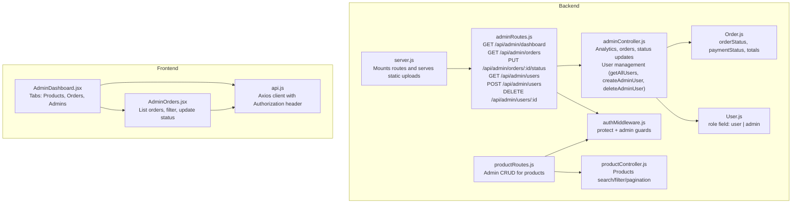
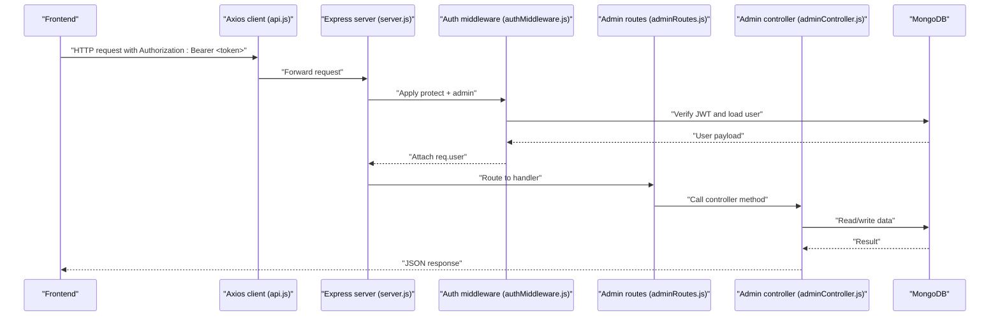
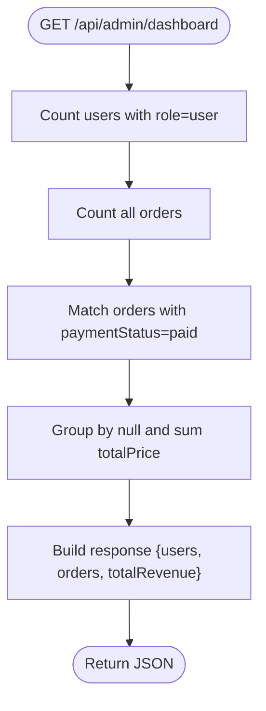
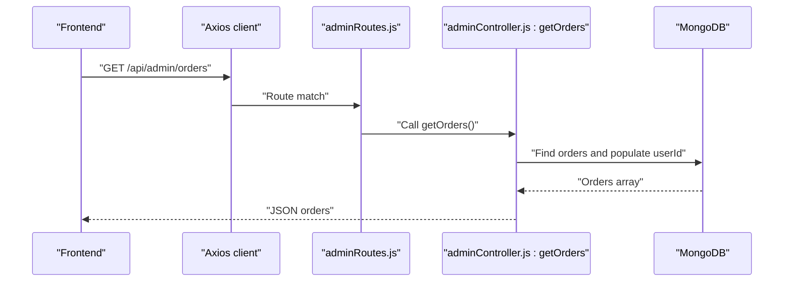
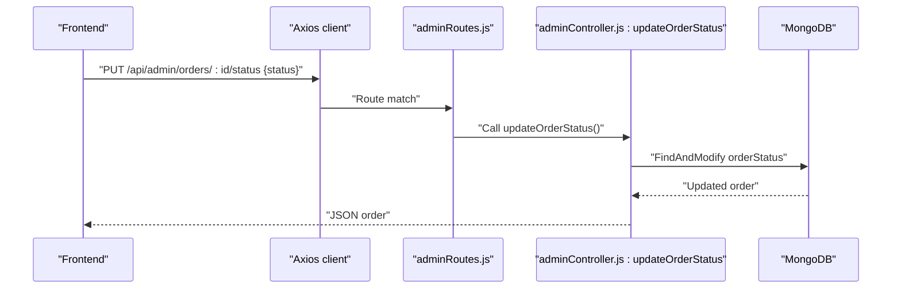
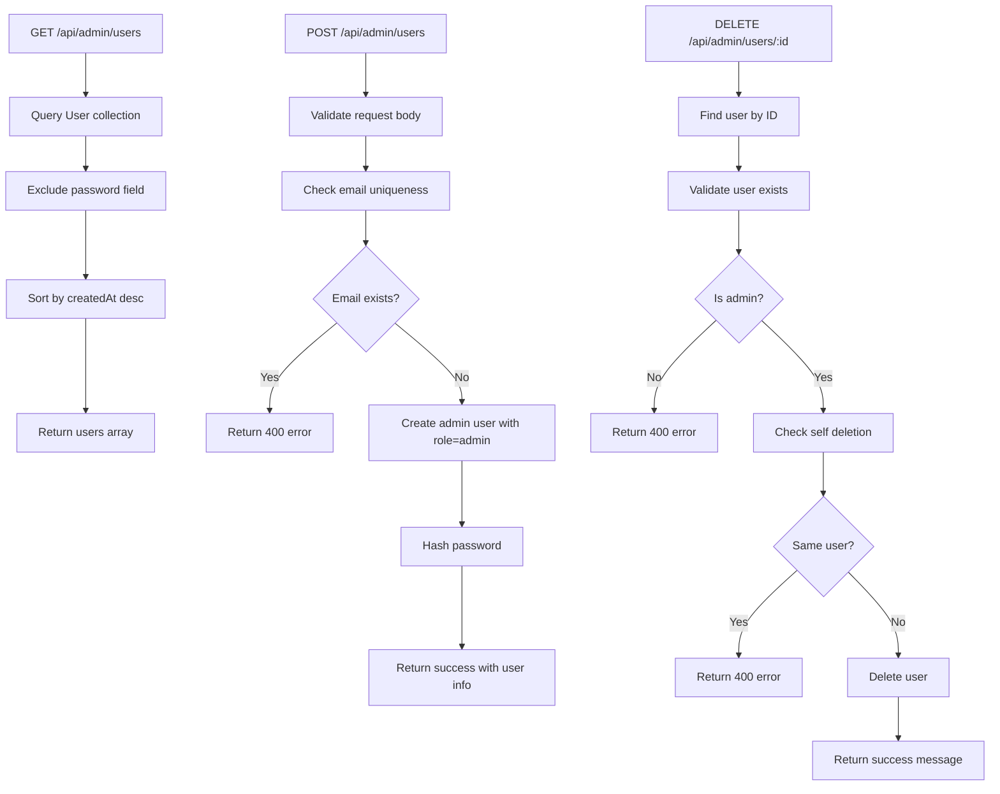
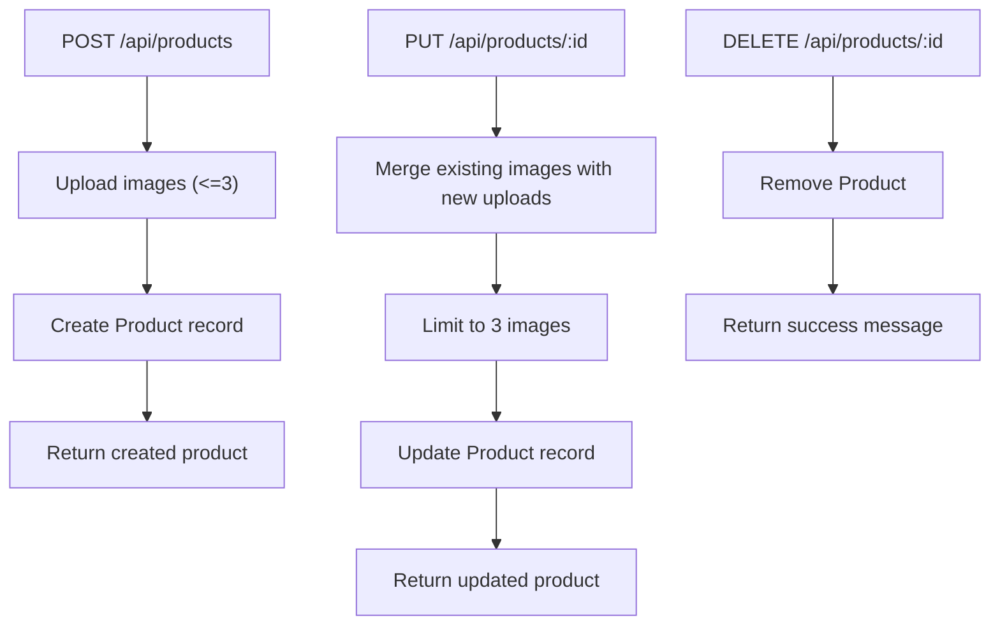
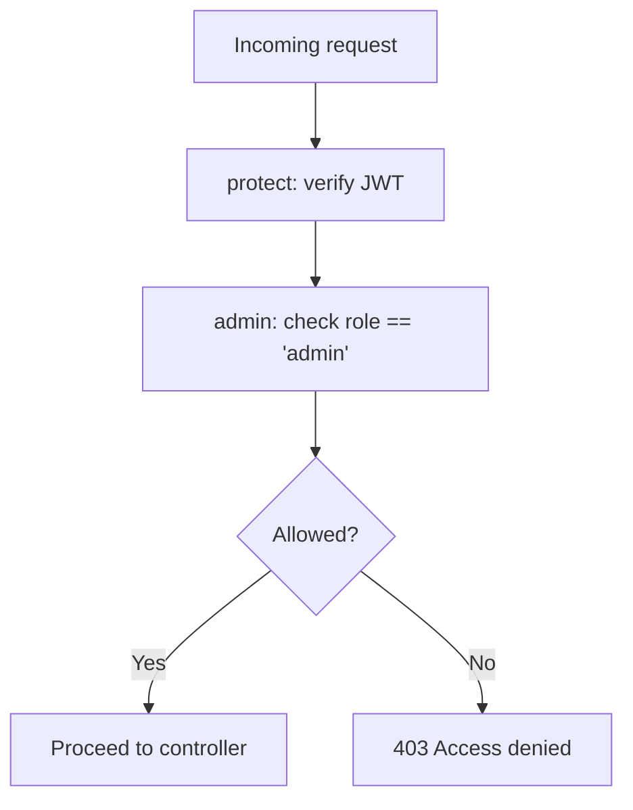
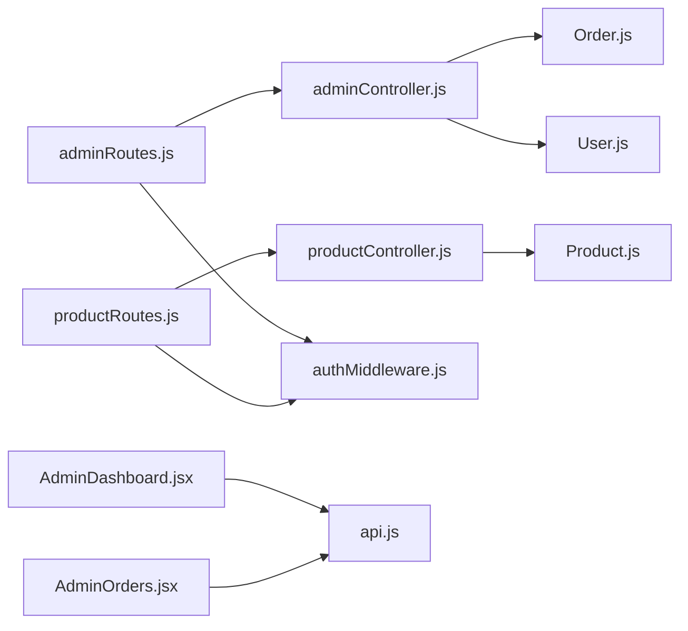

# Admin Dashboard API

<cite>
**Referenced Files in This Document**
- [server.js](file://backend/server.js)
- [adminRoutes.js](file://backend/routes/adminRoutes.js)
- [adminController.js](file://backend/controllers/adminController.js)
- [authMiddleware.js](file://backend/middleware/authMiddleware.js)
- [User.js](file://backend/models/User.js)
- [Order.js](file://backend/models/Order.js)
- [productRoutes.js](file://backend/routes/productRoutes.js)
- [productController.js](file://backend/controllers/productController.js)
- [AdminDashboard.jsx](file://frontend/src/pages/AdminDashboard.jsx)
- [AdminOrders.jsx](file://frontend/src/components/admin/AdminOrders.jsx)
- [api.js](file://frontend/src/services/api.js)
</cite>

## Update Summary
**Changes Made**
- Added new Admin User Management section documenting GET /admin/users, POST /admin/users, and DELETE /admin/users/:id endpoints
- Updated API Reference appendix to include new admin user management endpoints
- Enhanced Frontend Integration Notes to cover admin management UI components
- Updated architecture diagrams to reflect new user management functionality

## Table of Contents
1. [Introduction](#introduction)
2. [Project Structure](#project-structure)
3. [Core Components](#core-components)
4. [Architecture Overview](#architecture-overview)
5. [Detailed Component Analysis](#detailed-component-analysis)
6. [Dependency Analysis](#dependency-analysis)
7. [Performance Considerations](#performance-considerations)
8. [Troubleshooting Guide](#troubleshooting-guide)
9. [Conclusion](#conclusion)
10. [Appendices](#appendices)

## Introduction
This document provides comprehensive API documentation for the Admin Dashboard endpoints. It covers:
- Sales analytics retrieval
- Order listing and status management
- Product catalog administration
- **Admin user management** (NEW)
- Role-based access control and authentication requirements
- Practical examples of analytics queries, order workflows, administrative tasks, and user management operations

The backend is an Express server exposing protected admin routes under /api/admin, secured by JWT-based authentication and admin role checks. The frontend integrates with these endpoints to power the Admin Dashboard UI.

## Project Structure
The Admin Dashboard API is organized around Express routes, controllers, middleware, and Mongoose models. The server mounts admin routes under /api/admin and applies shared authentication and authorization middleware.

**Diagram sources**
- [server.js:57-63](file://backend/server.js#L57-L63)
- [adminRoutes.js:10-17](file://backend/routes/adminRoutes.js#L10-L17)
- [adminController.js:5-86](file://backend/controllers/adminController.js#L5-L86)
- [authMiddleware.js:4-20](file://backend/middleware/authMiddleware.js#L4-L20)
- [User.js:4-9](file://backend/models/User.js#L4-L9)
- [Order.js:3-31](file://backend/models/Order.js#L3-L31)
- [productRoutes.js:18-21](file://backend/routes/productRoutes.js#L18-L21)
- [productController.js:3-37](file://backend/controllers/productController.js#L3-L37)
- [AdminDashboard.jsx:192-206](file://frontend/src/pages/AdminDashboard.jsx#L192-L206)
- [AdminOrders.jsx:15-34](file://frontend/src/components/admin/AdminOrders.jsx#L15-L34)
- [api.js:3-7](file://frontend/src/services/api.js#L3-L7)

**Section sources**
- [server.js:57-63](file://backend/server.js#L57-L63)
- [adminRoutes.js:10-17](file://backend/routes/adminRoutes.js#L10-L17)
- [productRoutes.js:18-21](file://backend/routes/productRoutes.js#L18-L21)

## Core Components
- Admin routes: Mounted under /api/admin and protected by middleware.
- Admin controller: Implements analytics aggregation, order listing, order status updates, and **admin user management**.
- Authentication middleware: Validates JWT and enforces admin role.
- Models: User (role), Order (status and payment), Product (catalog).
- Frontend integration: AdminDashboard and AdminOrders components consume the admin endpoints.

Key endpoint coverage:
- Analytics: GET /api/admin/dashboard
- Orders: GET /api/admin/orders, PUT /api/admin/orders/:id/status
- **Admin Users**: GET /api/admin/users, POST /api/admin/users, DELETE /api/admin/users/:id
- Products: POST /api/products, PUT /api/products/:id, DELETE /api/products/:id (admin-protected)

**Section sources**
- [adminController.js:5-86](file://backend/controllers/adminController.js#L5-L86)
- [authMiddleware.js:4-20](file://backend/middleware/authMiddleware.js#L4-L20)
- [User.js:4-9](file://backend/models/User.js#L4-L9)
- [Order.js:3-31](file://backend/models/Order.js#L3-L31)
- [productController.js:3-37](file://backend/controllers/productController.js#L3-L37)

## Architecture Overview
The admin endpoints are protected by two middleware layers:
- protect: Extracts JWT from Authorization header and attaches user to request.
- admin: Ensures user.role === 'admin'.

**Diagram sources**
- [server.js:57-63](file://backend/server.js#L57-L63)
- [authMiddleware.js:4-20](file://backend/middleware/authMiddleware.js#L4-L20)
- [adminRoutes.js:10-17](file://backend/routes/adminRoutes.js#L10-L17)
- [adminController.js:5-86](file://backend/controllers/adminController.js#L5-L86)

## Detailed Component Analysis

### Admin Analytics Endpoint
- Path: GET /api/admin/dashboard
- Purpose: Returns dashboard summary: user count, total orders, and total revenue from paid orders.
- Implementation highlights:
  - Counts users with role=user.
  - Counts all orders.
  - Aggregates paid orders by summing totalPrice.
- Response shape: { users: number, orders: number, totalRevenue: number }

**Diagram sources**
- [adminController.js:5-14](file://backend/controllers/adminController.js#L5-L14)

**Section sources**
- [adminController.js:5-14](file://backend/controllers/adminController.js#L5-L14)
- [Order.js:24](file://backend/models/Order.js#L24)
- [Order.js:16](file://backend/models/Order.js#L16)

### Admin Orders Endpoint
- Path: GET /api/admin/orders
- Purpose: Lists all orders with customer populated and sorted by creation time (newest first).
- Implementation highlights:
  - Populates userId with name and email.
  - Sorts by createdAt descending.
- Response: Array of orders with populated customer info.

**Diagram sources**
- [adminRoutes.js:11](file://backend/routes/adminRoutes.js#L11)
- [adminController.js:16-19](file://backend/controllers/adminController.js#L16-L19)

**Section sources**
- [adminController.js:16-19](file://backend/controllers/adminController.js#L16-L19)
- [Order.js:4](file://backend/models/Order.js#L4)

### Update Order Status Endpoint
- Path: PUT /api/admin/orders/:id/status
- Purpose: Updates a single order's orderStatus.
- Request body: { status: string } where status is one of the enum values.
- Implementation highlights:
  - Finds order by ID and updates orderStatus atomically.
  - Returns the updated order.

**Diagram sources**
- [adminRoutes.js:12](file://backend/routes/adminRoutes.js#L12)
- [adminController.js:21-24](file://backend/controllers/adminController.js#L21-L24)
- [Order.js:30](file://backend/models/Order.js#L30)

**Section sources**
- [adminController.js:21-24](file://backend/controllers/adminController.js#L21-L24)
- [Order.js:30](file://backend/models/Order.js#L30)

### Admin User Management Endpoints
**New Feature** - Admin user management functionality has been added to enable administrators to manage other admin accounts.

- Paths:
  - GET /api/admin/users: List all users (excluding passwords) sorted by creation time
  - POST /api/admin/users: Create new admin user with validation
  - DELETE /api/admin/users/:id: Remove admin account with safety checks
- Implementation highlights:
  - All endpoints protected by authentication middleware
  - Passwords excluded from user listings for security
  - Email uniqueness validation for new admin creation
  - Self-deletion prevention to prevent admin account exhaustion
  - Role validation to ensure only admin accounts can be deleted

**Diagram sources**
- [adminRoutes.js:15-17](file://backend/routes/adminRoutes.js#L15-L17)
- [adminController.js:26-86](file://backend/controllers/adminController.js#L26-L86)

**Section sources**
- [adminController.js:26-86](file://backend/controllers/adminController.js#L26-L86)
- [User.js:4-9](file://backend/models/User.js#L4-L9)

### Product Administration Endpoints
- Paths:
  - POST /api/products (admin-protected): Create product with up to 3 images.
  - PUT /api/products/:id (admin-protected): Update product; supports adding new images up to 3.
  - DELETE /api/products/:id (admin-protected): Remove product.
- Search, filter, and pagination:
  - GET /api/products with query params: search, category, page, limit.
- Implementation highlights:
  - Upload middleware limits images to 3 per request.
  - Product images stored locally under /uploads.
  - Validation enforced via Mongoose schema.

**Diagram sources**
- [productRoutes.js:19-21](file://backend/routes/productRoutes.js#L19-L21)
- [productController.js:52-73](file://backend/controllers/productController.js#L52-L73)
- [productController.js:76-113](file://backend/controllers/productController.js#L76-L113)
- [productController.js:116-127](file://backend/controllers/productController.js#L116-L127)

**Section sources**
- [productRoutes.js:18-21](file://backend/routes/productRoutes.js#L18-L21)
- [productController.js:3-37](file://backend/controllers/productController.js#L3-L37)
- [productController.js:52-73](file://backend/controllers/productController.js#L52-L73)
- [productController.js:76-113](file://backend/controllers/productController.js#L76-L113)
- [productController.js:116-127](file://backend/controllers/productController.js#L116-L127)

### Role-Based Access Control and Authentication
- Authentication:
  - Token extracted from Authorization: Bearer <token>.
  - JWT verified and user attached to request.
- Authorization:
  - Admin-only routes require role === 'admin'.
- User model:
  - role enum includes 'user' and 'admin'.

**Diagram sources**
- [authMiddleware.js:4-20](file://backend/middleware/authMiddleware.js#L4-L20)
- [User.js:8](file://backend/models/User.js#L8)

**Section sources**
- [authMiddleware.js:4-20](file://backend/middleware/authMiddleware.js#L4-L20)
- [User.js:8](file://backend/models/User.js#L8)

## Dependency Analysis
- Route-to-controller mapping:
  - adminRoutes.js -> adminController.js
  - productRoutes.js -> productController.js
- Middleware dependency:
  - adminRoutes.js depends on authMiddleware.js for protect and admin guards.
- Model dependencies:
  - adminController.js uses Order, User, and Product models for analytics, user management, and counts.
  - productController.js uses Product model for CRUD operations.
- Frontend integration:
  - AdminDashboard.jsx and AdminOrders.jsx call /api/admin and /api/products endpoints via Axios configured with Authorization header.

**Diagram sources**
- [adminRoutes.js:10-17](file://backend/routes/adminRoutes.js#L10-L17)
- [productRoutes.js:18-21](file://backend/routes/productRoutes.js#L18-L21)
- [adminController.js:5-86](file://backend/controllers/adminController.js#L5-L86)
- [productController.js:3-37](file://backend/controllers/productController.js#L3-L37)
- [authMiddleware.js:4-20](file://backend/middleware/authMiddleware.js#L4-L20)
- [Order.js:3-31](file://backend/models/Order.js#L3-L31)
- [User.js:4-9](file://backend/models/User.js#L4-L9)
- [AdminDashboard.jsx:192-206](file://frontend/src/pages/AdminDashboard.jsx#L192-L206)
- [AdminOrders.jsx:15-34](file://frontend/src/components/admin/AdminOrders.jsx#L15-L34)
- [api.js:3-7](file://frontend/src/services/api.js#L3-L7)

**Section sources**
- [server.js:57-63](file://backend/server.js#L57-L63)
- [adminRoutes.js:10-17](file://backend/routes/adminRoutes.js#L10-L17)
- [productRoutes.js:18-21](file://backend/routes/productRoutes.js#L18-L21)

## Performance Considerations
- Aggregation efficiency:
  - Analytics endpoint uses aggregation to compute total revenue efficiently.
- Pagination:
  - Product listing supports pagination via query parameters to avoid large payloads.
- Population:
  - Order listing populates customer fields; consider limiting fields or adding indexes if scaling.
- **User management optimization**:
  - User listing excludes password field to reduce payload size.
  - Sorting by creation time for efficient admin account management.

[No sources needed since this section provides general guidance]

## Troubleshooting Guide
Common issues and resolutions:
- 401 Not authorized:
  - Missing or invalid Authorization header; ensure Bearer token is present and valid.
- 403 Access denied:
  - User is not admin; verify role assignment.
- 404 Not found:
  - Updating order status for a non-existent order ID.
  - Deleting non-existent admin user.
- **400 Bad Request (Admin User Management)**:
  - Attempting to create admin with existing email.
  - Attempting to delete non-admin user.
  - Attempting to delete own admin account.
- 500 Internal server errors:
  - Server-side exceptions; check logs and ensure database connectivity.

**Section sources**
- [authMiddleware.js:6](file://backend/middleware/authMiddleware.js#L6)
- [authMiddleware.js:13](file://backend/middleware/authMiddleware.js#L13)
- [authMiddleware.js:19](file://backend/middleware/authMiddleware.js#L19)
- [adminController.js:21-24](file://backend/controllers/adminController.js#L21-L24)
- [adminController.js:37-62](file://backend/controllers/adminController.js#L37-L62)
- [adminController.js:64-86](file://backend/controllers/adminController.js#L64-L86)

## Conclusion
The Admin Dashboard API provides secure, role-gated access to analytics, order management, product administration, and **admin user management**. Authentication and authorization are enforced consistently across routes, while controllers encapsulate business logic for efficient data retrieval and updates. The frontend components integrate seamlessly with these endpoints to deliver a comprehensive admin experience with full user management capabilities.

[No sources needed since this section summarizes without analyzing specific files]

## Appendices

### API Reference

- Analytics
  - GET /api/admin/dashboard
  - Description: Retrieve user count, total orders, and total revenue from paid orders.
  - Response: { users: number, orders: number, totalRevenue: number }

- Orders
  - GET /api/admin/orders
  - Description: List all orders with customer populated and sorted by newest first.
  - Response: Array of orders with populated userId.

  - PUT /api/admin/orders/:id/status
  - Description: Update a single order's orderStatus.
  - Request body: { status: string }
  - Response: Updated order object.

- **Admin User Management (NEW)**
  - GET /api/admin/users
  - Description: List all users excluding password field, sorted by newest creation time.
  - Response: Array of user objects with role, name, email, and timestamps.

  - POST /api/admin/users
  - Description: Create new admin user with validation.
  - Request body: { name: string, email: string, password: string }
  - Response: { message: string, user: { id, name, email, role } }

  - DELETE /api/admin/users/:id
  - Description: Remove admin account with safety checks.
  - Response: { message: string }

- Products (Admin-protected)
  - GET /api/products
  - Query params: search, category, page, limit
  - Response: { products[], totalPages, currentPage, totalProducts }

  - POST /api/products
  - Description: Create a new product with up to 3 images.
  - Response: Created product object.

  - PUT /api/products/:id
  - Description: Update product; supports adding new images up to 3.
  - Response: Updated product object.

  - DELETE /api/products/:id
  - Description: Remove a product.
  - Response: { message: string }

**Section sources**
- [adminController.js:5-86](file://backend/controllers/adminController.js#L5-L86)
- [adminRoutes.js:10-17](file://backend/routes/adminRoutes.js#L10-L17)
- [productRoutes.js:14-21](file://backend/routes/productRoutes.js#L14-L21)
- [productController.js:3-37](file://backend/controllers/productController.js#L3-L37)
- [productController.js:52-73](file://backend/controllers/productController.js#L52-L73)
- [productController.js:76-113](file://backend/controllers/productController.js#L76-L113)
- [productController.js:116-127](file://backend/controllers/productController.js#L116-L127)

### Frontend Integration Notes
- Authorization header:
  - Axios client automatically attaches Authorization: Bearer <token> if present in local storage.
- Admin-only UI:
  - AdminDashboard enforces admin role client-side and navigates unauthenticated users to login.
- **Admin Management UI**:
  - Dedicated tab for admin user management with create/delete functionality.
  - Form validation prevents self-deletion and ensures proper admin creation.
  - Real-time admin list updates after successful operations.

**Section sources**
- [api.js:3-7](file://frontend/src/services/api.js#L3-L7)
- [AdminDashboard.jsx:142-183](file://frontend/src/pages/AdminDashboard.jsx#L142-L183)
- [AdminDashboard.jsx:320-383](file://frontend/src/pages/AdminDashboard.jsx#L320-L383)