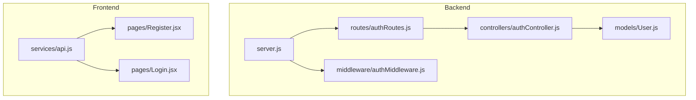
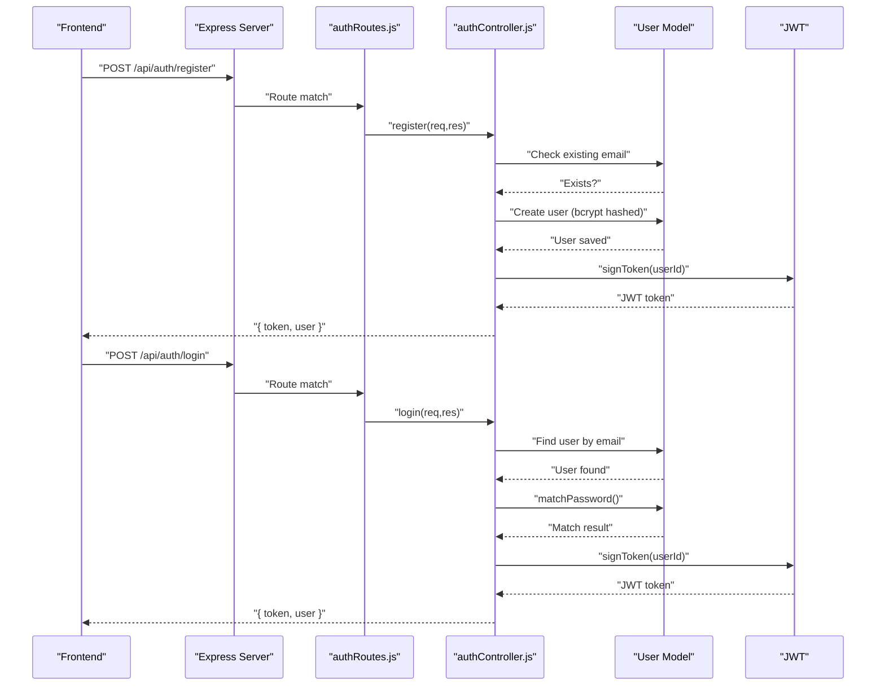
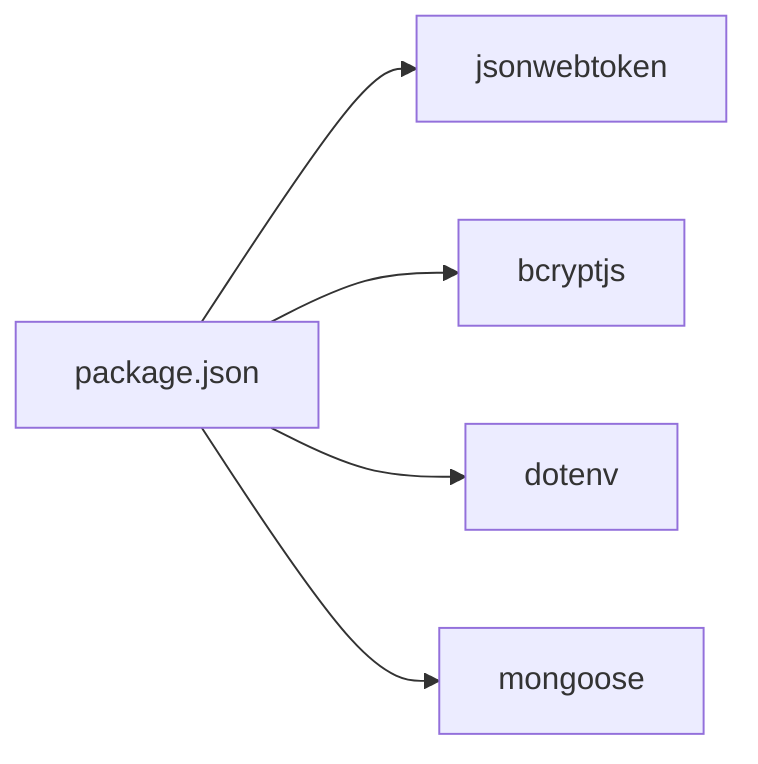

# Authentication API

<cite>
**Referenced Files in This Document**
- [server.js](file://backend/server.js)
- [authRoutes.js](file://backend/routes/authRoutes.js)
- [authController.js](file://backend/controllers/authController.js)
- [authMiddleware.js](file://backend/middleware/authMiddleware.js)
- [User.js](file://backend/models/User.js)
- [api.js](file://frontend/src/services/api.js)
- [Register.jsx](file://frontend/src/pages/Register.jsx)
- [Login.jsx](file://frontend/src/pages/Login.jsx)
- [adminRoutes.js](file://backend/routes/adminRoutes.js)
- [db.js](file://backend/config/db.js)
- [package.json](file://backend/package.json)
</cite>

## Table of Contents
1. [Introduction](#introduction)
2. [Project Structure](#project-structure)
3. [Core Components](#core-components)
4. [Architecture Overview](#architecture-overview)
5. [Detailed Component Analysis](#detailed-component-analysis)
6. [Dependency Analysis](#dependency-analysis)
7. [Performance Considerations](#performance-considerations)
8. [Troubleshooting Guide](#troubleshooting-guide)
9. [Conclusion](#conclusion)

## Introduction
This document provides comprehensive API documentation for the Authentication API endpoints. It covers the POST /api/auth/register and POST /api/auth/login endpoints, including request/response schemas, validation rules, JWT token generation and verification, authentication middleware, and error handling. It also documents password hashing, JWT payload structure, and security considerations for authentication endpoints.

## Project Structure
The authentication system spans the backend server, routing, controller, model, and middleware layers, with the frontend consuming these endpoints via a shared API client.

**Diagram sources**
- [server.js:57-63](file://backend/server.js#L57-L63)
- [authRoutes.js:1-9](file://backend/routes/authRoutes.js#L1-L9)
- [authController.js:1-27](file://backend/controllers/authController.js#L1-L27)
- [authMiddleware.js:1-20](file://backend/middleware/authMiddleware.js#L1-L20)
- [User.js:1-20](file://backend/models/User.js#L1-L20)
- [api.js:1-8](file://frontend/src/services/api.js#L1-L8)
- [Register.jsx:1-67](file://frontend/src/pages/Register.jsx#L1-L67)
- [Login.jsx:1-56](file://frontend/src/pages/Login.jsx#L1-L56)

**Section sources**
- [server.js:57-63](file://backend/server.js#L57-L63)
- [authRoutes.js:1-9](file://backend/routes/authRoutes.js#L1-L9)
- [authController.js:1-27](file://backend/controllers/authController.js#L1-L27)
- [authMiddleware.js:1-20](file://backend/middleware/authMiddleware.js#L1-L20)
- [User.js:1-20](file://backend/models/User.js#L1-L20)
- [api.js:1-8](file://frontend/src/services/api.js#L1-L8)
- [Register.jsx:1-67](file://frontend/src/pages/Register.jsx#L1-L67)
- [Login.jsx:1-56](file://frontend/src/pages/Login.jsx#L1-L56)

## Core Components
- Authentication routes: Define POST /api/auth/register and POST /api/auth/login.
- Authentication controller: Implements registration and login logic, JWT signing, and response formatting.
- Authentication middleware: Provides token extraction, verification, and user population for protected routes.
- User model: Defines schema, password hashing with bcrypt, and password comparison method.
- Frontend API client: Adds Authorization header with Bearer token for authenticated requests.

Key implementation references:
- Routes definition: [authRoutes.js:6-7](file://backend/routes/authRoutes.js#L6-L7)
- Registration handler: [authController.js:6-16](file://backend/controllers/authController.js#L6-L16)
- Login handler: [authController.js:18-27](file://backend/controllers/authController.js#L18-L27)
- Token verification middleware: [authMiddleware.js:4-15](file://backend/middleware/authMiddleware.js#L4-L15)
- Password hashing and comparison: [User.js:11-18](file://backend/models/User.js#L11-L18)
- Frontend interceptor: [api.js:3-7](file://frontend/src/services/api.js#L3-L7)

**Section sources**
- [authRoutes.js:1-9](file://backend/routes/authRoutes.js#L1-L9)
- [authController.js:1-27](file://backend/controllers/authController.js#L1-L27)
- [authMiddleware.js:1-20](file://backend/middleware/authMiddleware.js#L1-L20)
- [User.js:1-20](file://backend/models/User.js#L1-L20)
- [api.js:1-8](file://frontend/src/services/api.js#L1-L8)

## Architecture Overview
The authentication flow integrates route handlers, controller logic, model persistence, and middleware protection. The frontend communicates with the backend using a shared API client configured to attach Authorization headers.

**Diagram sources**
- [server.js:57-63](file://backend/server.js#L57-L63)
- [authRoutes.js:6-7](file://backend/routes/authRoutes.js#L6-L7)
- [authController.js:6-27](file://backend/controllers/authController.js#L6-L27)
- [User.js:11-18](file://backend/models/User.js#L11-L18)

## Detailed Component Analysis

### POST /api/auth/register
Purpose: Registers a new user with name, email, and password.

- Request body schema:
  - name: string, required
  - email: string, required, unique
  - password: string, required
- Validation rules:
  - Email uniqueness enforced at controller level; returns 400 if duplicate.
  - Password is hashed using bcrypt before storage.
- Response format:
  - token: string (JWT)
  - user: object containing id, name, email, role
- Error responses:
  - 400: "Email exists"
  - 500: Generic server error with error message

Practical example:
- Successful registration response:
  - Status: 201 Created
  - Body: { token: "<JWT>", user: { id: "<ObjectId>", name: "John Doe", email: "john@example.com", role: "user" } }

Common validation errors:
- Duplicate email: 400 "Email exists"

Security considerations:
- Password stored as bcrypt hash with salt rounds configured in model.
- JWT secret used for signing tokens; ensure environment variable is set.

**Section sources**
- [authController.js:6-16](file://backend/controllers/authController.js#L6-L16)
- [User.js:11-14](file://backend/models/User.js#L11-L14)

### POST /api/auth/login
Purpose: Authenticates an existing user and returns a JWT token.

- Request body schema:
  - email: string, required
  - password: string, required
- Validation rules:
  - Finds user by email; rejects if not found.
  - Compares password using bcrypt compare; rejects if mismatch.
- Response format:
  - token: string (JWT)
  - user: object containing id, name, email, role
- Error responses:
  - 401: "Invalid credentials"
  - 500: Generic server error with error message

Practical example:
- Successful login response:
  - Status: 200 OK
  - Body: { token: "<JWT>", user: { id: "<ObjectId>", name: "John Doe", email: "john@example.com", role: "user" } }

Common validation errors:
- Invalid credentials: 401 "Invalid credentials"

Security considerations:
- Password comparison uses bcrypt.
- JWT secret used for verification.

**Section sources**
- [authController.js:18-27](file://backend/controllers/authController.js#L18-L27)
- [User.js:16-18](file://backend/models/User.js#L16-L18)

### Authentication Middleware and Token Verification
Middleware protects routes by extracting the Authorization header, verifying the JWT, and attaching the user object (without password) to the request.

- Behavior:
  - Extracts token from Authorization: Bearer <token>.
  - Verifies token using JWT secret.
  - Populates req.user with user document excluding password.
  - Supports admin role gating via separate admin middleware.
- Error responses:
  - 401: "Not authorized" (no token)
  - 401: "Invalid token" (verification fails)
  - 403: "Access denied" (admin route, non-admin user)

**Diagram sources**
- [authMiddleware.js:4-15](file://backend/middleware/authMiddleware.js#L4-L15)

**Section sources**
- [authMiddleware.js:1-20](file://backend/middleware/authMiddleware.js#L1-L20)
- [adminRoutes.js:7-8](file://backend/routes/adminRoutes.js#L7-L8)

### JWT Payload and Signing
- Token signing:
  - Payload: { id: userId }
  - Secret: process.env.JWT_SECRET
  - Expiration: 7 days
- Token verification:
  - Uses the same secret to verify signature.
  - On success, attaches user to request object.

References:
- Signing: [authController.js:4](file://backend/controllers/authController.js#L4)
- Verification: [authMiddleware.js:9](file://backend/middleware/authMiddleware.js#L9)

**Section sources**
- [authController.js:4](file://backend/controllers/authController.js#L4)
- [authMiddleware.js:9](file://backend/middleware/authMiddleware.js#L9)

### Password Hashing and Validation
- Hashing:
  - Occurs before saving user via mongoose pre-save hook.
  - Uses bcrypt with salt rounds configured in model.
- Validation:
  - Password comparison performed using bcrypt compare during login.

References:
- Pre-save hashing: [User.js:11-14](file://backend/models/User.js#L11-L14)
- Password comparison: [User.js:16-18](file://backend/models/User.js#L16-L18)

**Section sources**
- [User.js:11-18](file://backend/models/User.js#L11-L18)

### Frontend Integration and Token Usage
- API client:
  - Automatically attaches Authorization: Bearer <token> header for all requests.
- Registration page:
  - Submits { name, email, password } to /api/auth/register.
  - Stores returned token and user in localStorage.
- Login page:
  - Submits { email, password } to /api/auth/login.
  - Stores returned token and user in localStorage.

References:
- Interceptor: [api.js:3-7](file://frontend/src/services/api.js#L3-L7)
- Registration form submission: [Register.jsx:11-22](file://frontend/src/pages/Register.jsx#L11-L22)
- Login form submission: [Login.jsx:10-21](file://frontend/src/pages/Login.jsx#L10-L21)

**Section sources**
- [api.js:1-8](file://frontend/src/services/api.js#L1-L8)
- [Register.jsx:1-67](file://frontend/src/pages/Register.jsx#L1-L67)
- [Login.jsx:1-56](file://frontend/src/pages/Login.jsx#L1-L56)

## Dependency Analysis
External libraries and environment dependencies:
- jsonwebtoken: JWT signing and verification.
- bcryptjs: Password hashing and comparison.
- dotenv: Loads environment variables (JWT_SECRET, MONGO_URI, FRONTEND_URL).
- mongoose: MongoDB ODM for User model.
- express: Web framework for routes and middleware.

**Diagram sources**
- [package.json:8-22](file://backend/package.json#L8-L22)

Environment configuration:
- JWT_SECRET: Required for signing/verifying tokens.
- MONGO_URI: Required for database connection.
- FRONTEND_URL: Optional override for CORS origins.

References:
- Dependencies: [package.json:8-22](file://backend/package.json#L8-L22)
- Environment loading: [db.js:2-3](file://backend/config/db.js#L2-L3)
- Server CORS configuration: [server.js:22-49](file://backend/server.js#L22-L49)

**Section sources**
- [package.json:1-27](file://backend/package.json#L1-L27)
- [db.js:1-14](file://backend/config/db.js#L1-L14)
- [server.js:22-49](file://backend/server.js#L22-L49)

## Performance Considerations
- Token expiration: 7-day expiry reduces long-term risk but may increase refresh frequency.
- Password hashing cost: bcrypt salt rounds are configured in the model; adjust based on hardware capacity.
- Middleware overhead: JWT verification occurs on protected routes; ensure efficient secret management and avoid unnecessary re-hashing.

## Troubleshooting Guide
Common issues and resolutions:
- 400 "Email exists" on registration:
  - Cause: Duplicate email address.
  - Resolution: Use a unique email or reset password flow.
- 401 "Invalid credentials" on login:
  - Cause: Incorrect email or password.
  - Resolution: Verify credentials; ensure bcrypt-compatibile hashing.
- 401 "Not authorized" or 401 "Invalid token":
  - Cause: Missing or malformed Authorization header; expired or invalid JWT.
  - Resolution: Ensure frontend sends Bearer token; verify JWT_SECRET correctness.
- 403 "Access denied":
  - Cause: Non-admin user attempting admin route.
  - Resolution: Authenticate as admin or remove admin middleware.
- 500 server errors:
  - Cause: Internal exceptions in controller or model.
  - Resolution: Check server logs; validate environment variables and database connectivity.

**Section sources**
- [authController.js:10](file://backend/controllers/authController.js#L10)
- [authController.js:22](file://backend/controllers/authController.js#L22)
- [authMiddleware.js:5-14](file://backend/middleware/authMiddleware.js#L5-L14)
- [adminRoutes.js:17-19](file://backend/routes/adminRoutes.js#L17-L19)
- [server.js:91-95](file://backend/server.js#L91-L95)

## Conclusion
The Authentication API provides secure user registration and login with robust password hashing, JWT-based session tokens, and middleware-driven protection. The frontend integrates seamlessly by automatically attaching Authorization headers. Ensure proper environment configuration, especially JWT_SECRET and MONGO_URI, to maintain security and reliability.