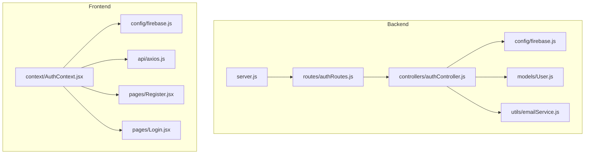
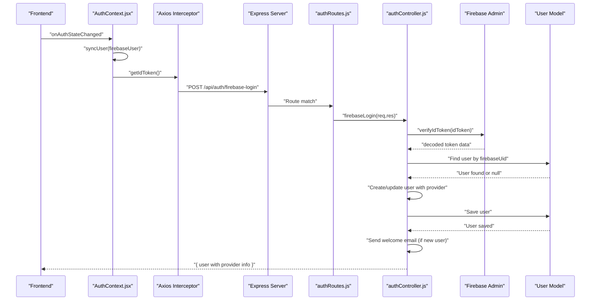
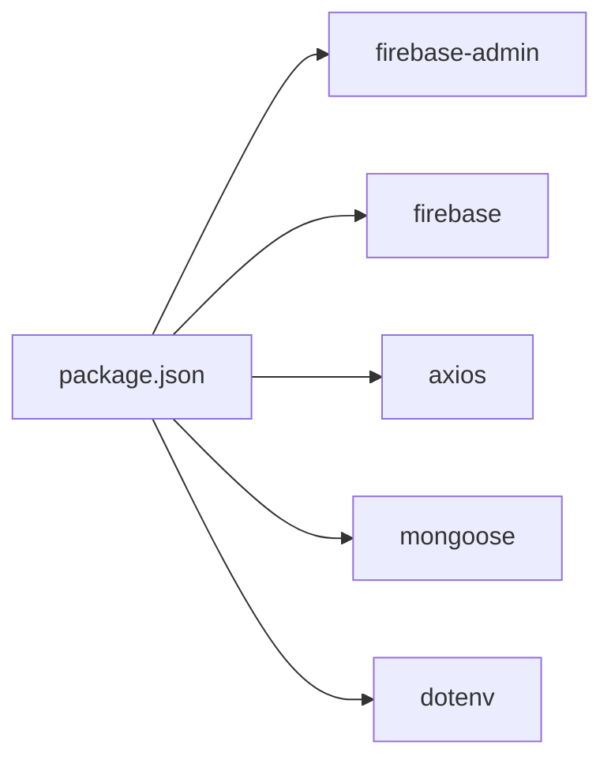

# Authentication API

<cite>
**Referenced Files in This Document**
- [server.js](file://backend/server.js)
- [authRoutes.js](file://backend/routes/authRoutes.js)
- [authController.js](file://backend/controllers/authController.js)
- [User.js](file://backend/models/User.js)
- [firebase.js](file://backend/config/firebase.js)
- [AuthContext.jsx](file://frontend/src/context/AuthContext.jsx)
- [firebase.js](file://frontend/src/config/firebase.js)
- [axios.js](file://frontend/src/api/axios.js)
- [Register.jsx](file://frontend/src/pages/Register.jsx)
- [Login.jsx](file://frontend/src/pages/Login.jsx)
- [emailService.js](file://backend/utils/emailService.js)
</cite>

## Update Summary
**Changes Made**
- Complete Firebase Authentication migration replacing JWT token endpoints
- Replaced POST /api/auth/register, POST /api/auth/login, and POST /api/auth/google-login with POST /api/auth/firebase-login
- Updated backend auth controller to use firebaseLogin with Firebase Admin SDK verification
- Enhanced frontend authentication context with Firebase integration and real-time auth state synchronization
- Removed JWT token generation and verification middleware
- Updated user model to support Firebase authentication with provider and firebaseUid fields
- Integrated Firebase ID token verification and user synchronization flow

## Table of Contents
1. [Introduction](#introduction)
2. [Project Structure](#project-structure)
3. [Core Components](#core-components)
4. [Architecture Overview](#architecture-overview)
5. [Detailed Component Analysis](#detailed-component-analysis)
6. [Dependency Analysis](#dependency-analysis)
7. [Performance Considerations](#performance-considerations)
8. [Troubleshooting Guide](#troubleshooting-guide)
9. [Conclusion](#conclusion)

## Introduction
This document provides comprehensive API documentation for the Authentication API endpoints following the Firebase Authentication migration. The system now uses Firebase Authentication for user management with seamless backend synchronization. It covers the POST /api/auth/firebase-login endpoint for Firebase ID token verification, user synchronization, and enhanced authentication flow. The system includes Firebase Admin SDK integration, real-time auth state synchronization, provider-based user management, and comprehensive error handling for Firebase authentication scenarios.

## Project Structure
The authentication system now integrates Firebase Authentication with Express backend services, featuring real-time auth state synchronization, Firebase ID token verification, and seamless user profile management. The frontend consumes Firebase authentication while the backend maintains user profiles with provider information.

**Diagram sources**
- [server.js:73](file://backend/server.js#L73)
- [authRoutes.js:6](file://backend/routes/authRoutes.js#L6)
- [authController.js:1-69](file://backend/controllers/authController.js#L1-L69)
- [firebase.js:1-12](file://backend/config/firebase.js#L1-L12)
- [User.js:1-30](file://backend/models/User.js#L1-L30)
- [AuthContext.jsx:1-86](file://frontend/src/context/AuthContext.jsx#L1-L86)
- [firebase.js:1-67](file://frontend/src/config/firebase.js#L1-L67)
- [axios.js:1-29](file://frontend/src/api/axios.js#L1-L29)

**Section sources**
- [server.js:73](file://backend/server.js#L73)
- [authRoutes.js:6](file://backend/routes/authRoutes.js#L6)
- [authController.js:1-69](file://backend/controllers/authController.js#L1-L69)
- [firebase.js:1-12](file://backend/config/firebase.js#L1-L12)
- [User.js:1-30](file://backend/models/User.js#L1-L30)
- [AuthContext.jsx:1-86](file://frontend/src/context/AuthContext.jsx#L1-L86)
- [firebase.js:1-67](file://frontend/src/config/firebase.js#L1-L67)
- [axios.js:1-29](file://frontend/src/api/axios.js#L1-L29)

## Core Components
- Firebase Authentication routes: Define POST /api/auth/firebase-login for Firebase ID token verification and user synchronization.
- Firebase Authentication controller: Implements Firebase ID token verification, user creation/updating, provider detection, and welcome email notifications.
- Firebase Admin SDK: Provides secure token verification and user management capabilities.
- User model with Firebase integration: Supports provider-based authentication (google, email) and firebaseUid linking.
- Frontend Firebase Context: Manages real-time auth state, user synchronization, and seamless authentication flow.
- Axios interceptors: Automatically attach Firebase ID tokens to authenticated requests.

Key implementation references:
- Firebase login route: [authRoutes.js:6](file://backend/routes/authRoutes.js#L6)
- Firebase login handler: [authController.js:5-68](file://backend/controllers/authController.js#L5-L68)
- Firebase Admin initialization: [firebase.js:1-12](file://backend/config/firebase.js#L1-L12)
- User model with provider fields: [User.js:25-26](file://backend/models/User.js#L25-L26)
- Auth context with Firebase integration: [AuthContext.jsx:12-29](file://frontend/src/context/AuthContext.jsx#L12-L29)
- Frontend Firebase configuration: [firebase.js:1-67](file://frontend/src/config/firebase.js#L1-L67)
- Axios interceptor with Firebase tokens: [axios.js:8-16](file://frontend/src/api/axios.js#L8-L16)

**Section sources**
- [authRoutes.js:6](file://backend/routes/authRoutes.js#L6)
- [authController.js:5-68](file://backend/controllers/authController.js#L5-L68)
- [firebase.js:1-12](file://backend/config/firebase.js#L1-L12)
- [User.js:25-26](file://backend/models/User.js#L25-L26)
- [AuthContext.jsx:12-29](file://frontend/src/context/AuthContext.jsx#L12-L29)
- [firebase.js:1-67](file://frontend/src/config/firebase.js#L1-L67)
- [axios.js:8-16](file://frontend/src/api/axios.js#L8-L16)

## Architecture Overview
The Firebase Authentication flow integrates frontend Firebase SDK with backend Firebase Admin SDK for secure token verification and user synchronization. The system provides real-time auth state management, seamless user profile creation, and comprehensive error handling for authentication scenarios.

**Diagram sources**
- [AuthContext.jsx:31-48](file://frontend/src/context/AuthContext.jsx#L31-L48)
- [axios.js:9-16](file://frontend/src/api/axios.js#L9-L16)
- [authRoutes.js:6](file://backend/routes/authRoutes.js#L6)
- [authController.js:13-44](file://backend/controllers/authController.js#L13-L44)
- [firebase.js:1-12](file://backend/config/firebase.js#L1-L12)
- [User.js:25-26](file://backend/models/User.js#L25-L26)

## Detailed Component Analysis

### POST /api/auth/firebase-login
Purpose: Verifies Firebase ID tokens and synchronizes user profiles between Firebase Authentication and backend user database.

**Updated** Complete migration from JWT to Firebase Authentication flow

- Request body schema:
  - idToken: string, required, Firebase ID token obtained from frontend
- Authentication flow:
  - Verifies Firebase ID token using Firebase Admin SDK
  - Extracts user information (uid, email, name, picture, provider)
  - Determines authentication provider (google.com or email)
  - Synchronizes with backend user database
  - Creates new user if not exists, updates existing user if linked
  - Sends welcome email for new users
- Response format:
  - user: object containing id, name, email, phone, photo, role, provider
- Error responses:
  - 400: "ID token is required" (missing token validation)
  - 500: Generic server error with Firebase error message

Practical example:
- Successful Firebase login response:
  - Status: 200 OK
  - Body: { user: { id: "<ObjectId>", name: "John Doe", email: "john@example.com", phone: "", photo: "", role: "user", provider: "google" } }

Common validation errors:
- Missing ID token: 400 "ID token is required"
- Invalid Firebase token: 500 "Firebase token verification failed"

Security considerations:
- Firebase Admin SDK provides secure token verification
- Provider-based authentication prevents token manipulation
- Seamless user synchronization maintains data consistency
- Welcome email notifications only for new users

**Section sources**
- [authController.js:5-68](file://backend/controllers/authController.js#L5-L68)
- [AuthContext.jsx:20-23](file://frontend/src/context/AuthContext.jsx#L20-L23)

### Firebase Authentication Controller Implementation
The firebaseLogin controller handles comprehensive Firebase Authentication integration with provider detection, user synchronization, and welcome email notifications.

- Token verification: Uses Firebase Admin SDK to verify ID tokens
- Provider detection: Identifies authentication source (google vs email)
- User synchronization: Links Firebase UID to existing users or creates new profiles
- Welcome notifications: Sends welcome emails only for new user registrations
- Error handling: Comprehensive error catching with detailed logging

**Section sources**
- [authController.js:13-44](file://backend/controllers/authController.js#L13-L44)
- [authController.js:46-51](file://backend/controllers/authController.js#L46-L51)

### Firebase Admin SDK Configuration
Backend Firebase Admin SDK provides secure token verification and user management capabilities.

- Initialization: Configured with Firebase project credentials from environment variables
- Credential management: Uses service account private key with proper newline replacement
- Token verification: Secure ID token validation with Firebase Admin SDK
- User management: Integration with backend user database for profile synchronization

**Section sources**
- [firebase.js:1-12](file://backend/config/firebase.js#L1-L12)

### Enhanced User Model with Firebase Integration
The User model now supports Firebase Authentication with provider-based authentication and Firebase UID linking.

- Provider field: Enumerated values (google, email) for authentication source tracking
- Firebase UID: Unique identifier linking to Firebase Authentication user
- Sparse indexes: Allows optional fields for users created without Firebase
- Email verification: Maintains email verification status for email-authenticated users
- Role management: Preserves role-based access control

**Section sources**
- [User.js:25-26](file://backend/models/User.js#L25-L26)
- [User.js:3-27](file://backend/models/User.js#L3-L27)

### Frontend Firebase Authentication Context
The AuthContext manages real-time Firebase authentication state with seamless user synchronization and comprehensive error handling.

- Real-time auth state: Listens for Firebase auth state changes using onAuthStateChanged
- User synchronization: Automatically syncs Firebase user with backend user profile
- Token management: Retrieves fresh Firebase ID tokens for authenticated requests
- Provider integration: Supports Google and email/password authentication flows
- Error handling: Graceful handling of authentication errors and user cancellation

**Section sources**
- [AuthContext.jsx:31-48](file://frontend/src/context/AuthContext.jsx#L31-L48)
- [AuthContext.jsx:12-29](file://frontend/src/context/AuthContext.jsx#L12-L29)

### Frontend Firebase Configuration
Frontend Firebase SDK provides comprehensive authentication capabilities with Google and email/password support.

- Firebase initialization: Configured with production Firebase project credentials
- Google authentication: Supports Google Sign-In with OAuth popup flow
- Email/password authentication: Full email/password sign-up and sign-in functionality
- Profile management: Updates user display name during registration
- Error handling: Comprehensive error handling for authentication operations

**Section sources**
- [firebase.js:1-67](file://frontend/src/config/firebase.js#L1-L67)

### Axios Interceptors with Firebase Tokens
The frontend Axios configuration automatically manages Firebase authentication tokens for all authenticated requests.

- Request interceptor: Automatically attaches Firebase ID tokens to Authorization headers
- Response interceptor: Handles 401 errors by removing cached user data
- Token refresh: Retrieves fresh tokens for each request to ensure validity
- Error handling: Graceful handling of authentication failures

**Section sources**
- [axios.js:8-16](file://frontend/src/api/axios.js#L8-L16)
- [axios.js:18-27](file://frontend/src/api/axios.js#L18-L27)

### Frontend Pages Integration
The Login and Register pages integrate seamlessly with Firebase Authentication while maintaining the same user interface and experience.

- Login page: Supports both Google login and email/password authentication
- Register page: Provides email/password registration with client-side validation
- Google integration: Unified Google authentication across both pages
- Error handling: User-friendly error messages for authentication failures
- Navigation: Automatic redirection after successful authentication

**Section sources**
- [Login.jsx:14-28](file://frontend/src/pages/Login.jsx#L14-L28)
- [Register.jsx:16-35](file://frontend/src/pages/Register.jsx#L16-L35)
- [Login.jsx:30-47](file://frontend/src/pages/Login.jsx#L30-L47)
- [Register.jsx:37-54](file://frontend/src/pages/Register.jsx#L37-L54)

### Email Notification Service Integration
The email notification service continues to work with Firebase Authentication, sending welcome emails only for new user registrations.

- Conditional email sending: Only triggers for new users created through Firebase authentication
- User data integration: Uses synchronized user data from backend for personalized emails
- Error handling: Graceful error handling for email service failures
- Asynchronous processing: Prevents blocking authentication responses

**Section sources**
- [authController.js:46-51](file://backend/controllers/authController.js#L46-L51)
- [emailService.js:112-148](file://backend/utils/emailService.js#L112-L148)

## Dependency Analysis
External libraries and environment dependencies for Firebase Authentication:

- firebase-admin: Firebase Admin SDK for secure token verification and user management
- firebase: Firebase client SDK for frontend authentication and real-time auth state
- axios: HTTP client with request/response interceptors for automatic token management
- mongoose: MongoDB ODM for user model with provider and firebaseUid fields
- dotenv: Environment variable loading for Firebase configuration

**Diagram sources**
- [package.json:8-22](file://backend/package.json#L8-L22)

Environment configuration for Firebase:
- FIREBASE_PROJECT_ID: Firebase project identifier
- FIREBASE_CLIENT_EMAIL: Service account client email
- FIREBASE_PRIVATE_KEY: Service account private key with newline replacement
- VITE_API_URL: Frontend API base URL for development

**Section sources**
- [package.json:1-27](file://backend/package.json#L1-L27)
- [firebase.js:4-8](file://backend/config/firebase.js#L4-L8)

## Performance Considerations
- Token verification: Firebase Admin SDK provides efficient token verification with caching
- Real-time synchronization: onAuthStateChanged provides instant auth state updates
- Request optimization: Axios interceptors minimize token retrieval overhead
- Database queries: Firebase UID indexing ensures fast user lookup and synchronization
- Welcome email optimization: Conditional email sending prevents unnecessary operations

## Troubleshooting Guide
Common issues and resolutions for Firebase Authentication:

- 400 "ID token is required" on firebase-login:
  - Cause: Missing idToken in request body
  - Resolution: Ensure frontend retrieves and sends Firebase ID token
- Firebase token verification failures:
  - Cause: Expired or invalid Firebase ID token
  - Resolution: Refresh token using getIdToken() method
- User synchronization errors:
  - Cause: Firebase UID conflicts or database connection issues
  - Resolution: Check Firebase Admin SDK configuration and database connectivity
- Frontend authentication state issues:
  - Cause: onAuthStateChanged listener not firing or token retrieval failures
  - Resolution: Verify Firebase SDK initialization and network connectivity
- Google authentication failures:
  - Cause: Google OAuth configuration issues or popup blockers
  - Resolution: Check Google OAuth settings and browser permissions
- Email notification failures:
  - Cause: Email service unavailability or misconfiguration
  - Resolution: Verify email service configuration and network connectivity

**Section sources**
- [authController.js:9-11](file://backend/controllers/authController.js#L9-L11)
- [AuthContext.jsx:24-28](file://frontend/src/context/AuthContext.jsx#L24-L28)
- [AuthContext.jsx:37-47](file://frontend/src/context/AuthContext.jsx#L37-L47)

## Conclusion
The Firebase Authentication migration provides a modern, scalable, and secure authentication solution with seamless user experience. The system integrates Firebase Authentication for frontend user management while maintaining backend user profiles with provider information. Key benefits include real-time auth state synchronization, comprehensive error handling, provider-based authentication support, and efficient token management. The migration eliminates JWT complexity while providing enhanced security through Firebase Admin SDK verification. Frontend developers benefit from simplified authentication flows with Google and email/password support, while backend developers enjoy streamlined user management with provider tracking and seamless synchronization. Ensure proper Firebase configuration, including service account credentials and project settings, to maintain optimal performance and security.