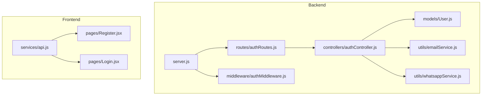
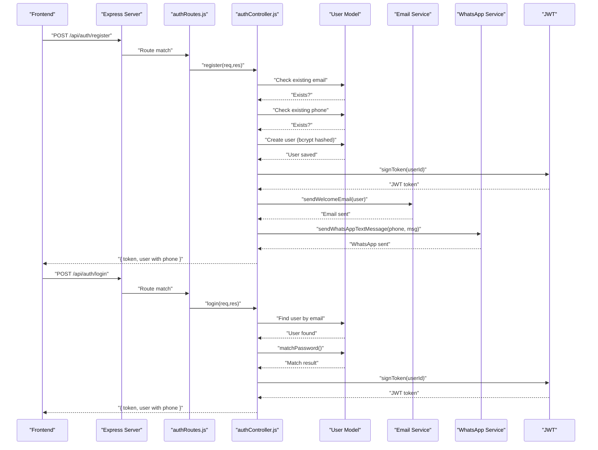
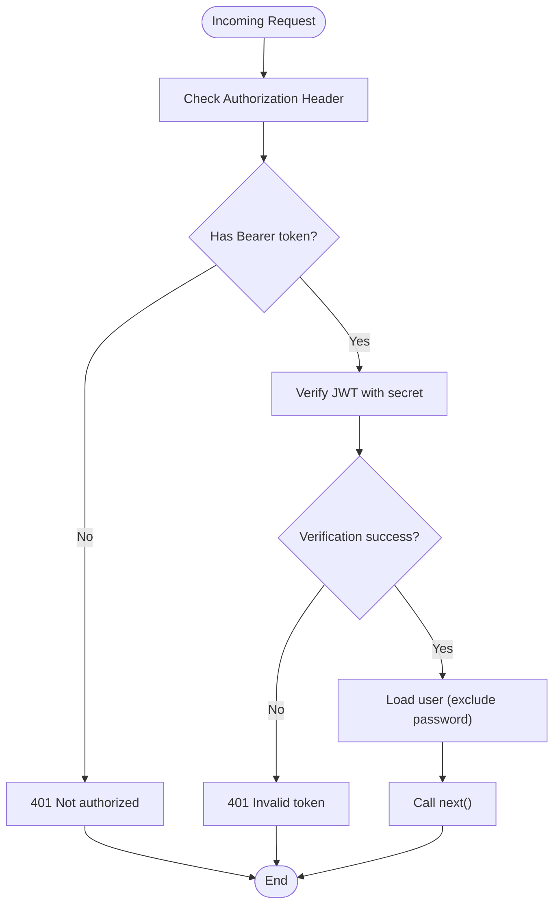
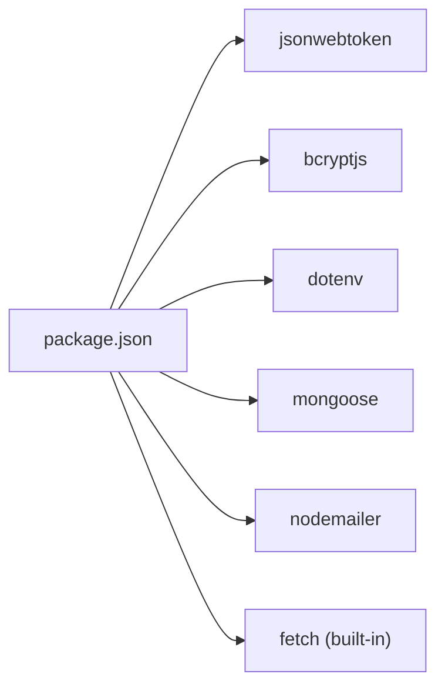

# Authentication API

<cite>
**Referenced Files in This Document**
- [server.js](file://backend/server.js)
- [authRoutes.js](file://backend/routes/authRoutes.js)
- [authController.js](file://backend/controllers/authController.js)
- [authMiddleware.js](file://backend/middleware/authMiddleware.js)
- [User.js](file://backend/models/User.js)
- [emailService.js](file://backend/utils/emailService.js)
- [whatsappService.js](file://backend/utils/whatsappService.js)
- [api.js](file://frontend/src/services/api.js)
- [Register.jsx](file://frontend/src/pages/Register.jsx)
- [Login.jsx](file://frontend/src/pages/Login.jsx)
- [adminRoutes.js](file://backend/routes/adminRoutes.js)
- [db.js](file://backend/config/db.js)
- [package.json](file://backend/package.json)
</cite>

## Update Summary
**Changes Made**
- Enhanced user registration with phone number validation and dual validation checks (email and phone)
- Integrated email and WhatsApp welcome notifications after successful registration
- Updated login response to include phone number in user object
- Added comprehensive phone number validation with Indian mobile number format
- Updated request/response schemas to reflect new fields and validation rules

## Table of Contents
1. [Introduction](#introduction)
2. [Project Structure](#project-structure)
3. [Core Components](#core-components)
4. [Architecture Overview](#architecture-overview)
5. [Detailed Component Analysis](#detailed-component-analysis)
6. [Dependency Analysis](#dependency-analysis)
7. [Performance Considerations](#performance-considerations)
8. [Troubleshooting Guide](#troubleshooting-guide)
9. [Conclusion](#conclusion)

## Introduction
This document provides comprehensive API documentation for the Authentication API endpoints. It covers the POST /api/auth/register and POST /api/auth/login endpoints, including enhanced request/response schemas with phone number validation, dual validation checks, JWT token generation and verification, authentication middleware, and error handling. The system now includes integrated email and WhatsApp welcome notifications for enhanced user experience.

## Project Structure
The authentication system spans the backend server, routing, controller, model, middleware, and utility layers, with the frontend consuming these endpoints via a shared API client. The system now includes notification utilities for email and WhatsApp integration.

**Diagram sources**
- [server.js:57-63](file://backend/server.js#L57-L63)
- [authRoutes.js:1-9](file://backend/routes/authRoutes.js#L1-L9)
- [authController.js:1-60](file://backend/controllers/authController.js#L1-L60)
- [authMiddleware.js:1-20](file://backend/middleware/authMiddleware.js#L1-L20)
- [User.js:1-35](file://backend/models/User.js#L1-L35)
- [emailService.js:1-149](file://backend/utils/emailService.js#L1-L149)
- [whatsappService.js:1-127](file://backend/utils/whatsappService.js#L1-L127)
- [api.js:1-8](file://frontend/src/services/api.js#L1-L8)
- [Register.jsx:1-113](file://frontend/src/pages/Register.jsx#L1-L113)
- [Login.jsx:1-83](file://frontend/src/pages/Login.jsx#L1-L83)

**Section sources**
- [server.js:57-63](file://backend/server.js#L57-L63)
- [authRoutes.js:1-9](file://backend/routes/authRoutes.js#L1-L9)
- [authController.js:1-60](file://backend/controllers/authController.js#L1-L60)
- [authMiddleware.js:1-20](file://backend/middleware/authMiddleware.js#L1-L20)
- [User.js:1-35](file://backend/models/User.js#L1-L35)
- [emailService.js:1-149](file://backend/utils/emailService.js#L1-L149)
- [whatsappService.js:1-127](file://backend/utils/whatsappService.js#L1-L127)
- [api.js:1-8](file://frontend/src/services/api.js#L1-L8)
- [Register.jsx:1-113](file://frontend/src/pages/Register.jsx#L1-L113)
- [Login.jsx:1-83](file://frontend/src/pages/Login.jsx#L1-L83)

## Core Components
- Authentication routes: Define POST /api/auth/register and POST /api/auth/login.
- Authentication controller: Implements registration and login logic, JWT signing, dual validation checks, and integrated notification sending.
- Authentication middleware: Provides token extraction, verification, and user population for protected routes.
- User model: Defines schema with phone number validation, password hashing with bcrypt, and password comparison method.
- Notification utilities: Email and WhatsApp services for welcome notifications.
- Frontend API client: Adds Authorization header with Bearer token for authenticated requests.

Key implementation references:
- Routes definition: [authRoutes.js:6-7](file://backend/routes/authRoutes.js#L6-L7)
- Registration handler: [authController.js:8-36](file://backend/controllers/authController.js#L8-L36)
- Login handler: [authController.js:38-60](file://backend/controllers/authController.js#L38-L60)
- Token verification middleware: [authMiddleware.js:4-15](file://backend/middleware/authMiddleware.js#L4-L15)
- Phone number validation: [User.js:14-19](file://backend/models/User.js#L14-L19)
- Email notification: [emailService.js:112-148](file://backend/utils/emailService.js#L112-L148)
- WhatsApp notification: [whatsappService.js:88-126](file://backend/utils/whatsappService.js#L88-L126)
- Frontend interceptor: [api.js:3-7](file://frontend/src/services/api.js#L3-L7)

**Section sources**
- [authRoutes.js:1-9](file://backend/routes/authRoutes.js#L1-L9)
- [authController.js:1-60](file://backend/controllers/authController.js#L1-L60)
- [authMiddleware.js:1-20](file://backend/middleware/authMiddleware.js#L1-L20)
- [User.js:1-35](file://backend/models/User.js#L1-L35)
- [emailService.js:1-149](file://backend/utils/emailService.js#L1-L149)
- [whatsappService.js:1-127](file://backend/utils/whatsappService.js#L1-L127)
- [api.js:1-8](file://frontend/src/services/api.js#L1-L8)

## Architecture Overview
The enhanced authentication flow integrates route handlers, controller logic, model persistence, middleware protection, and integrated notification services. The frontend communicates with the backend using a shared API client configured to attach Authorization headers.

**Diagram sources**
- [server.js:57-63](file://backend/server.js#L57-L63)
- [authRoutes.js:6-7](file://backend/routes/authRoutes.js#L6-L7)
- [authController.js:8-60](file://backend/controllers/authController.js#L8-L60)
- [User.js:14-19](file://backend/models/User.js#L14-L19)
- [emailService.js:112-148](file://backend/utils/emailService.js#L112-L148)
- [whatsappService.js:88-126](file://backend/utils/whatsappService.js#L88-L126)

## Detailed Component Analysis

### POST /api/auth/register
Purpose: Registers a new user with name, email, phone number, and password, including dual validation checks and integrated notifications.

**Updated** Enhanced with phone number validation and dual validation checks (email and phone)

- Request body schema:
  - name: string, required
  - email: string, required, unique, validated with email regex pattern
  - phone: string, required, unique, validated as 10-digit Indian mobile number (6-9)
  - password: string, required
- Validation rules:
  - Email uniqueness enforced at controller level; returns 400 if duplicate.
  - Phone number uniqueness enforced at controller level; returns 400 if duplicate.
  - Phone number validation uses regex pattern /^[6-9]\d{9}$/ for Indian mobile numbers.
  - Password is hashed using bcrypt before storage.
  - Dual validation ensures both email and phone are unique before user creation.
- Response format:
  - token: string (JWT)
  - user: object containing id, name, email, phone, role
- Error responses:
  - 400: "Email already registered"
  - 400: "Phone number already registered"
  - 500: Generic server error with error message
- Integrated notifications:
  - Welcome email sent asynchronously after successful registration.
  - WhatsApp welcome message sent asynchronously after successful registration.

Practical example:
- Successful registration response:
  - Status: 201 Created
  - Body: { token: "<JWT>", user: { id: "<ObjectId>", name: "John Doe", email: "john@example.com", phone: "9876543210", role: "user" } }

Common validation errors:
- Duplicate email: 400 "Email already registered"
- Duplicate phone: 400 "Phone number already registered"
- Invalid phone format: 400 "Please provide a valid 10-digit Indian phone number"
- Invalid email format: 400 "Please provide a valid email address"

Security considerations:
- Password stored as bcrypt hash with salt rounds configured in model.
- JWT secret used for signing tokens; ensure environment variable is set.
- Phone number validation prevents invalid formats and duplicates.
- Asynchronous notification sending prevents blocking the registration response.

**Section sources**
- [authController.js:8-36](file://backend/controllers/authController.js#L8-L36)
- [User.js:14-19](file://backend/models/User.js#L14-L19)
- [emailService.js:112-148](file://backend/utils/emailService.js#L112-L148)
- [whatsappService.js:88-126](file://backend/utils/whatsappService.js#L88-L126)

### POST /api/auth/login
Purpose: Authenticates an existing user and returns a JWT token with enhanced user information.

**Updated** Login response now includes phone number

- Request body schema:
  - email: string, required
  - password: string, required
- Validation rules:
  - Finds user by email; rejects if not found.
  - Compares password using bcrypt compare; rejects if mismatch.
- Response format:
  - token: string (JWT)
  - user: object containing id, name, email, phone, role
- Error responses:
  - 401: "Invalid credentials"
  - 500: Generic server error with error message

Practical example:
- Successful login response:
  - Status: 200 OK
  - Body: { token: "<JWT>", user: { id: "<ObjectId>", name: "John Doe", email: "john@example.com", phone: "9876543210", role: "user" } }

Common validation errors:
- Invalid credentials: 401 "Invalid credentials"

Security considerations:
- Password comparison uses bcrypt.
- JWT secret used for verification.
- Phone number included in response for frontend display purposes.

**Section sources**
- [authController.js:38-60](file://backend/controllers/authController.js#L38-L60)
- [User.js:31-33](file://backend/models/User.js#L31-L33)

### Authentication Middleware and Token Verification
Middleware protects routes by extracting the Authorization header, verifying the JWT, and attaching the user object (without password) to the request.

- Behavior:
  - Extracts token from Authorization: Bearer <token>.
  - Verifies token using JWT secret.
  - Populates req.user with user document excluding password.
  - Supports admin role gating via separate admin middleware.
- Error responses:
  - 401: "Not authorized" (no token)
  - 401: "Invalid token" (verification fails)
  - 403: "Access denied" (admin route, non-admin user)

**Diagram sources**
- [authMiddleware.js:4-15](file://backend/middleware/authMiddleware.js#L4-L15)

**Section sources**
- [authMiddleware.js:1-20](file://backend/middleware/authMiddleware.js#L1-L20)
- [adminRoutes.js:7-8](file://backend/routes/adminRoutes.js#L7-L8)

### JWT Payload and Signing
- Token signing:
  - Payload: { id: userId }
  - Secret: process.env.JWT_SECRET
  - Expiration: 7 days
- Token verification:
  - Uses the same secret to verify signature.
  - On success, attaches user to request object.

References:
- Signing: [authController.js:6](file://backend/controllers/authController.js#L6)
- Verification: [authMiddleware.js:9](file://backend/middleware/authMiddleware.js#L9)

**Section sources**
- [authController.js:6](file://backend/controllers/authController.js#L6)
- [authMiddleware.js:9](file://backend/middleware/authMiddleware.js#L9)

### Password Hashing and Validation
- Hashing:
  - Occurs before saving user via mongoose pre-save hook.
  - Uses bcrypt with salt rounds configured in model.
- Validation:
  - Password comparison performed using bcrypt compare during login.

References:
- Pre-save hashing: [User.js:26-29](file://backend/models/User.js#L26-L29)
- Password comparison: [User.js:31-33](file://backend/models/User.js#L31-L33)

**Section sources**
- [User.js:26-33](file://backend/models/User.js#L26-L33)

### Phone Number Validation and Schema
**New** Comprehensive phone number validation system

- Phone number schema validation:
  - Required field with unique constraint
  - Regex pattern /^[6-9]\d{9}$/ validates 10-digit Indian mobile numbers
  - Only digits 6-9 allowed as first digit (valid Indian mobile prefixes)
  - Ensures exactly 10 digits total
- Frontend validation:
  - Client-side validation mirrors backend requirements
  - Real-time validation feedback for users
  - Automatic formatting for phone input

References:
- Backend validation: [User.js:14-19](file://backend/models/User.js#L14-L19)
- Frontend validation: [Register.jsx:17-21](file://frontend/src/pages/Register.jsx#L17-L21)

**Section sources**
- [User.js:14-19](file://backend/models/User.js#L14-L19)
- [Register.jsx:17-21](file://frontend/src/pages/Register.jsx#L17-L21)

### Email and WhatsApp Notification Services
**New** Integrated notification system for user onboarding

- Email Service:
  - Welcome email with special offer code (WELCOME10)
  - Professional HTML formatting with brand styling
  - Asynchronous sending to prevent blocking responses
  - Error handling with fallback logging
- WhatsApp Service:
  - Welcome message with personalized content
  - Template-based messaging with dynamic parameters
  - Country code formatting (India +91)
  - Fallback text messaging capability
  - Asynchronous sending with error handling

References:
- Email service: [emailService.js:112-148](file://backend/utils/emailService.js#L112-L148)
- WhatsApp service: [whatsappService.js:88-126](file://backend/utils/whatsappService.js#L88-L126)
- Registration controller integration: [authController.js:22-27](file://backend/controllers/authController.js#L22-L27)

**Section sources**
- [emailService.js:112-148](file://backend/utils/emailService.js#L112-L148)
- [whatsappService.js:88-126](file://backend/utils/whatsappService.js#L88-L126)
- [authController.js:22-27](file://backend/controllers/authController.js#L22-L27)

### Frontend Integration and Token Usage
- API client:
  - Automatically attaches Authorization: Bearer <token> header for all requests.
- Registration page:
  - Submits { name, email, phone, password } to /api/auth/register.
  - Stores returned token and user (including phone) in localStorage.
  - Includes comprehensive client-side validation for phone and email.
- Login page:
  - Submits { email, password } to /api/auth/login.
  - Stores returned token and user (including phone) in localStorage.

**Updated** Frontend now handles phone number in user object

References:
- Interceptor: [api.js:3-7](file://frontend/src/services/api.js#L3-L7)
- Registration form submission: [Register.jsx:14-38](file://frontend/src/pages/Register.jsx#L14-L38)
- Login form submission: [Login.jsx:11-30](file://frontend/src/pages/Login.jsx#L11-L30)

**Section sources**
- [api.js:1-8](file://frontend/src/services/api.js#L1-L8)
- [Register.jsx:1-113](file://frontend/src/pages/Register.jsx#L1-L113)
- [Login.jsx:1-83](file://frontend/src/pages/Login.jsx#L1-L83)

## Dependency Analysis
External libraries and environment dependencies:
- jsonwebtoken: JWT signing and verification.
- bcryptjs: Password hashing and comparison.
- dotenv: Loads environment variables (JWT_SECRET, MONGO_URI, FRONTEND_URL, EMAIL_USER, EMAIL_PASSWORD, WHATSAPP_PHONE_NUMBER_ID, WHATSAPP_ACCESS_TOKEN).
- mongoose: MongoDB ODM for User model with custom validation.
- express: Web framework for routes and middleware.
- nodemailer: Email service for welcome emails.
- fetch: Built-in browser fetch API for WhatsApp Business Cloud API integration.

**Diagram sources**
- [package.json:8-22](file://backend/package.json#L8-L22)

Environment configuration:
- JWT_SECRET: Required for signing/verifying tokens.
- MONGO_URI: Required for database connection.
- FRONTEND_URL: Optional override for CORS origins.
- EMAIL_USER: Gmail address for email service.
- EMAIL_PASSWORD: Gmail App Password for email authentication.
- WHATSAPP_PHONE_NUMBER_ID: WhatsApp Business Cloud API phone number ID.
- WHATSAPP_ACCESS_TOKEN: WhatsApp Business Cloud API access token.

**Updated** Added email and WhatsApp service environment variables

References:
- Dependencies: [package.json:8-22](file://backend/package.json#L8-L22)
- Environment loading: [db.js:2-3](file://backend/config/db.js#L2-L3)
- Server CORS configuration: [server.js:22-49](file://backend/server.js#L22-L49)
- Email service environment: [emailService.js:7-15](file://backend/utils/emailService.js#L7-L15)
- WhatsApp service environment: [whatsappService.js:5](file://backend/utils/whatsappService.js#L5)

**Section sources**
- [package.json:1-27](file://backend/package.json#L1-L27)
- [db.js:1-14](file://backend/config/db.js#L1-L14)
- [server.js:22-49](file://backend/server.js#L22-L49)
- [emailService.js:7-15](file://backend/utils/emailService.js#L7-L15)
- [whatsappService.js:5](file://backend/utils/whatsappService.js#L5)

## Performance Considerations
- Token expiration: 7-day expiry reduces long-term risk but may increase refresh frequency.
- Password hashing cost: bcrypt salt rounds are configured in the model; adjust based on hardware capacity.
- Middleware overhead: JWT verification occurs on protected routes; ensure efficient secret management and avoid unnecessary re-hashing.
- **Updated** Notification performance: Email and WhatsApp notifications are sent asynchronously to prevent blocking registration/login responses.
- **Updated** Database queries: Dual validation (email and phone) adds minimal overhead but ensures data integrity.
- **Updated** Phone number validation: Both client-side and server-side validation reduce invalid requests and improve user experience.

## Troubleshooting Guide
Common issues and resolutions:
- 400 "Email already registered" on registration:
  - Cause: Duplicate email address already exists in database.
  - Resolution: Use a unique email or reset password flow.
- 400 "Phone number already registered" on registration:
  - Cause: Duplicate phone number already exists in database.
  - Resolution: Use a unique phone number or contact support.
- 400 "Please provide a valid 10-digit Indian phone number" on registration:
  - Cause: Phone number format doesn't match /^[6-9]\d{9}$/ pattern.
  - Resolution: Enter exactly 10 digits starting with 6, 7, 8, or 9.
- 400 "Please provide a valid email address" on registration:
  - Cause: Email format doesn't match email regex pattern.
  - Resolution: Enter a valid email address format.
- 401 "Invalid credentials" on login:
  - Cause: Incorrect email or password.
  - Resolution: Verify credentials; ensure bcrypt-compatible hashing.
- 401 "Not authorized" or 401 "Invalid token":
  - Cause: Missing or malformed Authorization header; expired or invalid JWT.
  - Resolution: Ensure frontend sends Bearer token; verify JWT_SECRET correctness.
- 403 "Access denied":
  - Cause: Non-admin user attempting admin route.
  - Resolution: Authenticate as admin or remove admin middleware.
- 500 server errors:
  - Cause: Internal exceptions in controller or model.
  - Resolution: Check server logs; validate environment variables and database connectivity.
- **Updated** Notification failures:
  - Cause: Email or WhatsApp service unavailability or misconfiguration.
  - Resolution: Check email credentials and WhatsApp API settings; verify environment variables.

**Section sources**
- [authController.js:12-17](file://backend/controllers/authController.js#L12-L17)
- [authController.js:42](file://backend/controllers/authController.js#L42)
- [authMiddleware.js:5-14](file://backend/middleware/authMiddleware.js#L5-L14)
- [adminRoutes.js:17-19](file://backend/routes/adminRoutes.js#L17-L19)
- [server.js:91-95](file://backend/server.js#L91-L95)

## Conclusion
The enhanced Authentication API provides secure user registration and login with robust phone number validation, dual validation checks (email and phone), integrated email and WhatsApp welcome notifications, JWT-based session tokens, and middleware-driven protection. The system now offers improved user experience through comprehensive validation and immediate welcome notifications. The frontend integrates seamlessly by automatically attaching Authorization headers and handling the enhanced user object with phone number information. Ensure proper environment configuration, especially JWT_SECRET, MONGO_URI, email credentials, and WhatsApp API settings, to maintain security and reliability.