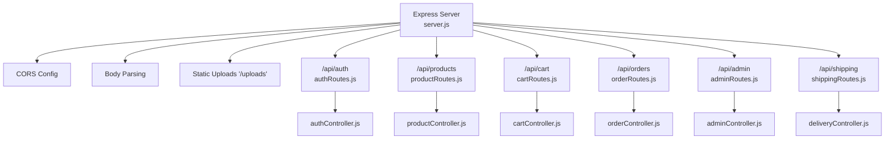
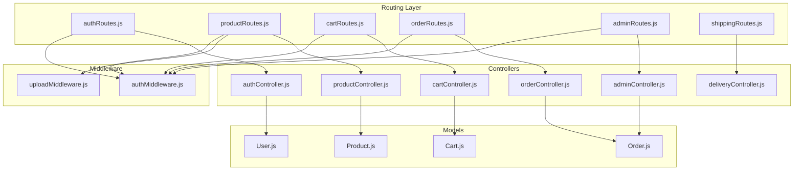
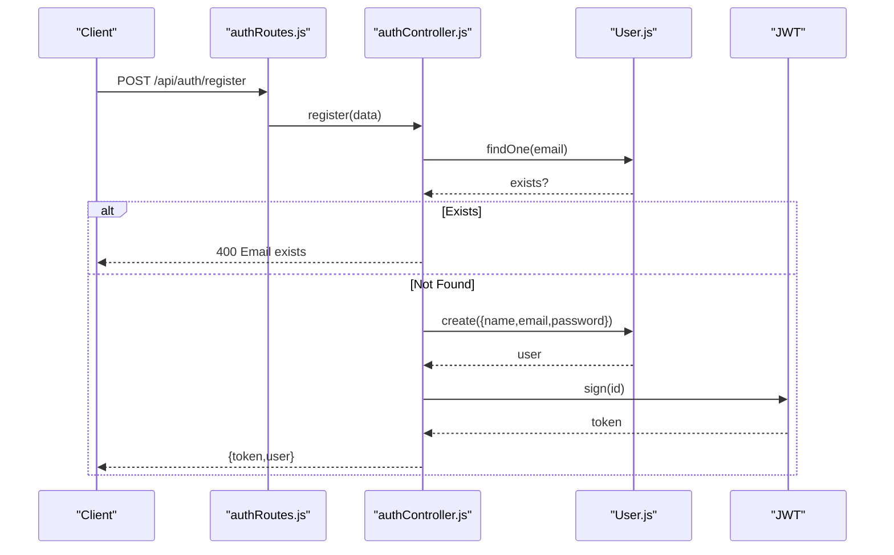
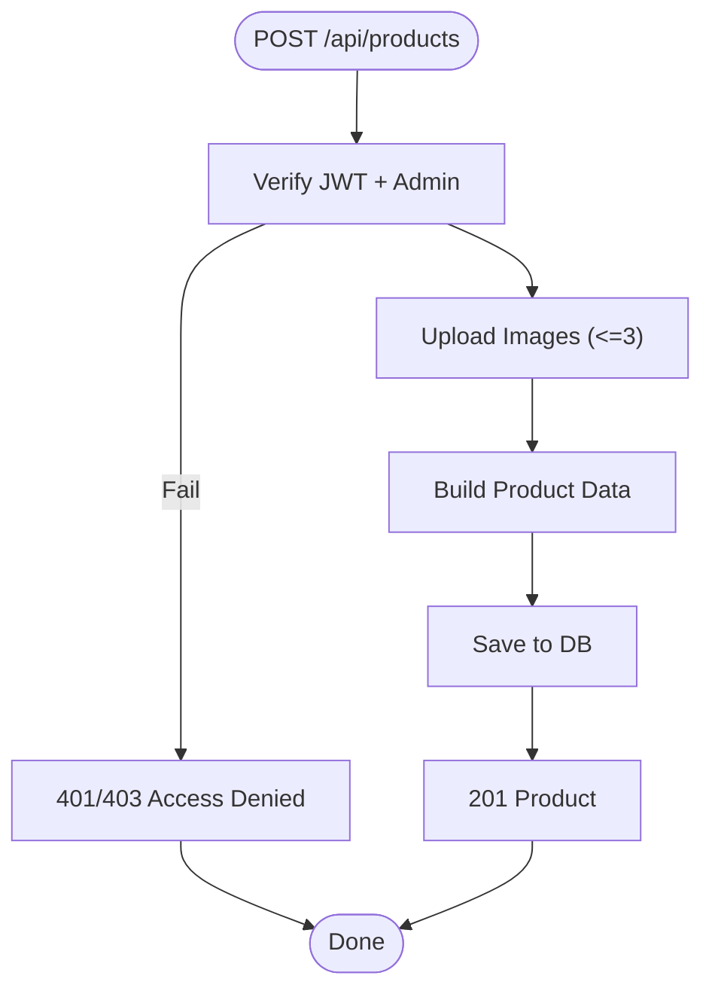
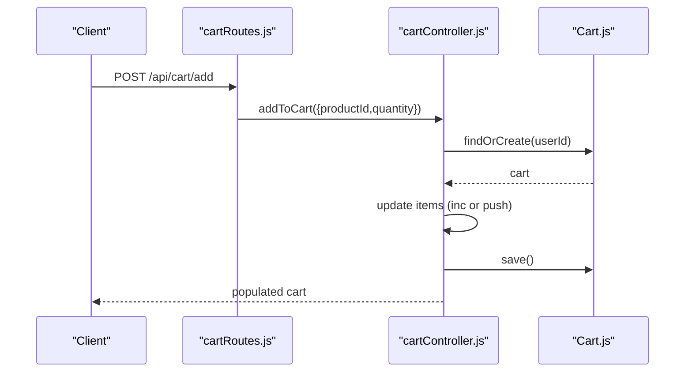
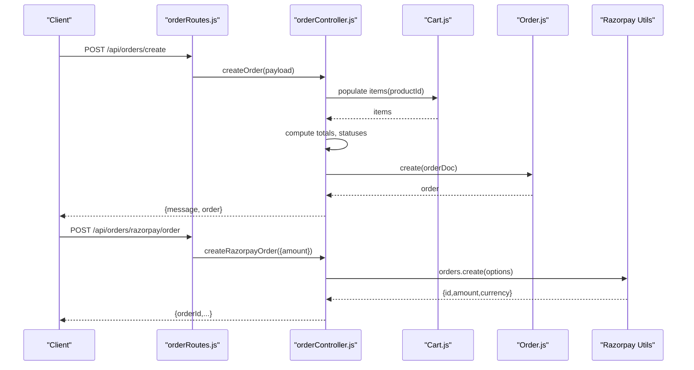
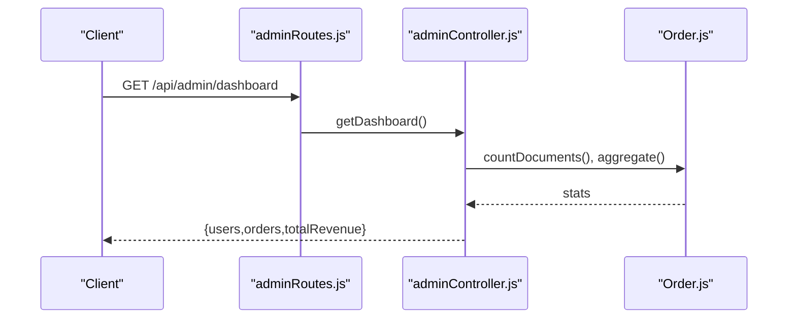
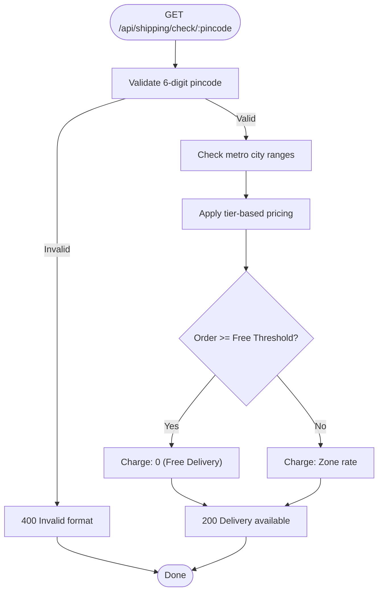
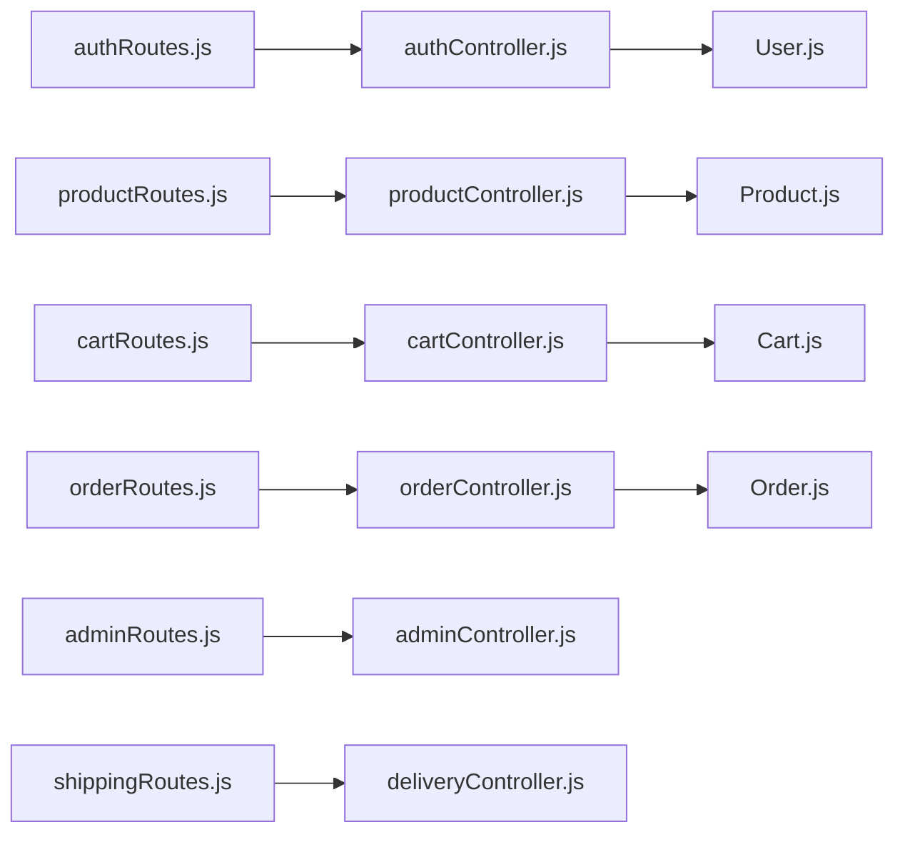
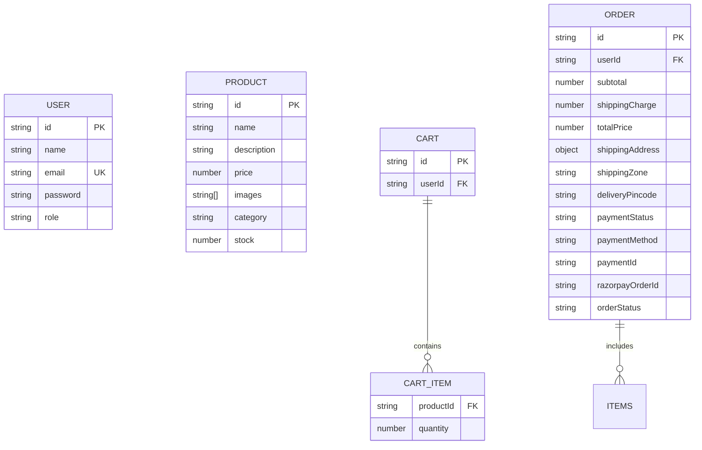

# Backend API Documentation

<cite>
**Referenced Files in This Document**
- [server.js](file://backend/server.js)
- [authRoutes.js](file://backend/routes/authRoutes.js)
- [productRoutes.js](file://backend/routes/productRoutes.js)
- [cartRoutes.js](file://backend/routes/cartRoutes.js)
- [orderRoutes.js](file://backend/routes/orderRoutes.js)
- [adminRoutes.js](file://backend/routes/adminRoutes.js)
- [shippingRoutes.js](file://backend/routes/shippingRoutes.js)
- [deliveryController.js](file://backend/controllers/deliveryController.js)
- [authMiddleware.js](file://backend/middleware/authMiddleware.js)
- [uploadMiddleware.js](file://backend/middleware/uploadMiddleware.js)
- [authController.js](file://backend/controllers/authController.js)
- [productController.js](file://backend/controllers/productController.js)
- [cartController.js](file://backend/controllers/cartController.js)
- [orderController.js](file://backend/controllers/orderController.js)
- [adminController.js](file://backend/controllers/adminController.js)
- [User.js](file://backend/models/User.js)
- [Product.js](file://backend/models/Product.js)
- [Cart.js](file://backend/models/Cart.js)
- [Order.js](file://backend/models/Order.js)
- [shipping.js](file://backend/config/shipping.js)
</cite>

## Table of Contents
1. [Introduction](#introduction)
2. [Project Structure](#project-structure)
3. [Core Components](#core-components)
4. [Architecture Overview](#architecture-overview)
5. [Detailed Component Analysis](#detailed-component-analysis)
6. [Dependency Analysis](#dependency-analysis)
7. [Performance Considerations](#performance-considerations)
8. [Troubleshooting Guide](#troubleshooting-guide)
9. [Conclusion](#conclusion)
10. [Appendices](#appendices)

## Introduction
This document provides comprehensive API documentation for the E-commerce App's backend RESTful APIs. It covers endpoint groups, HTTP methods, URL patterns, request/response schemas, authentication and authorization, error handling, and operational workflows. It also documents JWT usage, role-based access control via middleware, and practical examples for common integration scenarios.

## Project Structure
The backend is organized by feature-based routes and controllers, with shared middleware and models. The Express server mounts route groups under /api/* and serves static uploads.

**Diagram sources**
- [server.js:57-63](file://backend/server.js#L57-L63)
- [authRoutes.js:1-9](file://backend/routes/authRoutes.js#L1-L9)
- [productRoutes.js:1-23](file://backend/routes/productRoutes.js#L1-L23)
- [cartRoutes.js:1-12](file://backend/routes/cartRoutes.js#L1-L12)
- [orderRoutes.js:1-28](file://backend/routes/orderRoutes.js#L1-L28)
- [adminRoutes.js:1-14](file://backend/routes/adminRoutes.js#L1-L14)
- [shippingRoutes.js:1-13](file://backend/routes/shippingRoutes.js#L1-L13)

**Section sources**
- [server.js:57-72](file://backend/server.js#L57-L72)

## Core Components
- Authentication API (/api/auth): Registration and login endpoints returning JWT tokens and user info.
- Product Management API (/api/products): CRUD operations for products with admin-only write access and image uploads.
- Cart Operations API (/api/cart): Retrieve, add, update, and clear cart items for authenticated users.
- Order Processing API (/api/orders): Place orders, manage payments (Razorpay), fetch orders, and admin order status updates.
- Admin Dashboard API (/api/admin): Dashboard metrics and order management.
- Shipping Calculations API (/api/shipping): Enhanced delivery availability checking and bulk shipping charge calculation with improved free delivery eligibility.

**Section sources**
- [authRoutes.js:6-7](file://backend/routes/authRoutes.js#L6-L7)
- [productRoutes.js:14-21](file://backend/routes/productRoutes.js#L14-L21)
- [cartRoutes.js:7-10](file://backend/routes/cartRoutes.js#L7-L10)
- [orderRoutes.js:15-26](file://backend/routes/orderRoutes.js#L15-L26)
- [adminRoutes.js:10-12](file://backend/routes/adminRoutes.js#L10-L12)
- [shippingRoutes.js:6-12](file://backend/routes/shippingRoutes.js#L6-L12)

## Architecture Overview
The API follows a layered architecture:
- Routes define endpoints and apply middleware.
- Controllers implement business logic and orchestrate models.
- Middleware enforces authentication and authorization.
- Models define schemas and validation.
- Utilities provide third-party integrations (e.g., shipping calculations).

**Diagram sources**
- [authRoutes.js:1-9](file://backend/routes/authRoutes.js#L1-L9)
- [productRoutes.js:1-23](file://backend/routes/productRoutes.js#L1-L23)
- [cartRoutes.js:1-12](file://backend/routes/cartRoutes.js#L1-L12)
- [orderRoutes.js:1-28](file://backend/routes/orderRoutes.js#L1-L28)
- [adminRoutes.js:1-14](file://backend/routes/adminRoutes.js#L1-L14)
- [shippingRoutes.js:1-13](file://backend/routes/shippingRoutes.js#L1-L13)
- [authMiddleware.js:1-20](file://backend/middleware/authMiddleware.js#L1-L20)
- [uploadMiddleware.js](file://backend/middleware/uploadMiddleware.js)
- [authController.js:1-27](file://backend/controllers/authController.js#L1-L27)
- [productController.js:1-127](file://backend/controllers/productController.js#L1-L127)
- [cartController.js:1-38](file://backend/controllers/cartController.js#L1-L38)
- [orderController.js:1-146](file://backend/controllers/orderController.js#L1-L146)
- [adminController.js:1-24](file://backend/controllers/adminController.js#L1-L24)
- [User.js:1-20](file://backend/models/User.js#L1-L20)
- [Product.js:1-12](file://backend/models/Product.js#L1-L12)
- [Cart.js:1-12](file://backend/models/Cart.js#L1-L12)
- [Order.js:1-33](file://backend/models/Order.js#L1-L33)

## Detailed Component Analysis

### Authentication API (/api/auth)
- Purpose: User registration and login with JWT issuance.
- Endpoints:
  - POST /api/auth/register
    - Request: { name, email, password }
    - Response: { token, user: { id, name, email, role } }
    - Errors: 400 (email exists), 500 (server error)
  - POST /api/auth/login
    - Request: { email, password }
    - Response: { token, user: { id, name, email, role } }
    - Errors: 401 (invalid credentials), 500 (server error)
- Security: Password hashing handled by model pre-save hook; JWT secret used for signing.

**Diagram sources**
- [authRoutes.js:6](file://backend/routes/authRoutes.js#L6)
- [authController.js:6-16](file://backend/controllers/authController.js#L6-L16)
- [User.js:11-18](file://backend/models/User.js#L11-L18)

**Section sources**
- [authRoutes.js:6-7](file://backend/routes/authRoutes.js#L6-L7)
- [authController.js:6-27](file://backend/controllers/authController.js#L6-L27)
- [User.js:11-18](file://backend/models/User.js#L11-L18)

### Product Management API (/api/products)
- Purpose: Browse and manage products; admin-only creation, updates, deletion.
- Endpoints:
  - GET /api/products/
    - Query params: search, category, page, limit
    - Response: { products[], totalPages, currentPage, totalProducts }
    - Errors: 500 (server error)
  - GET /api/products/:id
    - Path param: id
    - Response: Product document
    - Errors: 404 (not found), 500 (server error)
  - POST /api/products/
    - Headers: Authorization Bearer
    - Body: form-data with images[] up to 3 files; JSON fields: name, description, price, category, stock
    - Response: Product document
    - Errors: 400 (validation), 401/403 (auth/admin), 500 (server error)
  - PUT /api/products/:id
    - Headers: Authorization Bearer
    - Body: form-data images[] up to 3; JSON fields: name, description, price, category, stock, images[]
    - Response: Updated Product
    - Errors: 400/404 (not found), 401/403 (auth/admin), 500 (server error)
  - DELETE /api/products/:id
    - Headers: Authorization Bearer
    - Response: { message }
    - Errors: 404 (not found), 401/403 (auth/admin), 500 (server error)
- Validation: Price and stock cast to numbers; image limit enforced at 3 per product.

**Diagram sources**
- [productRoutes.js:18-21](file://backend/routes/productRoutes.js#L18-L21)
- [authMiddleware.js:4-19](file://backend/middleware/authMiddleware.js#L4-L19)
- [uploadMiddleware.js](file://backend/middleware/uploadMiddleware.js)
- [productController.js:52-73](file://backend/controllers/productController.js#L52-L73)

**Section sources**
- [productRoutes.js:14-21](file://backend/routes/productRoutes.js#L14-L21)
- [productController.js:4-49](file://backend/controllers/productController.js#L4-L49)
- [productController.js:52-127](file://backend/controllers/productController.js#L52-L127)
- [Product.js:3-10](file://backend/models/Product.js#L3-L10)

### Cart Operations API (/api/cart)
- Purpose: Manage user cart items.
- Endpoints:
  - GET /api/cart/
    - Headers: Authorization Bearer
    - Response: Cart with populated items.productId
    - Errors: 500 (server error)
  - POST /api/cart/add
    - Headers: Authorization Bearer
    - Body: { productId, quantity }
    - Response: Cart with populated items
    - Errors: 500 (server error)
  - PUT /api/cart/update
    - Headers: Authorization Bearer
    - Body: { productId, quantity }
    - Response: Cart with populated items
    - Errors: 500 (server error)
  - DELETE /api/cart/clear
    - Headers: Authorization Bearer
    - Response: { message }
    - Errors: 500 (server error)
- Behavior: Creates cart if missing; quantity must be positive for updates; removes item when quantity <= 0.

**Diagram sources**
- [cartRoutes.js:8](file://backend/routes/cartRoutes.js#L8)
- [cartController.js:9-22](file://backend/controllers/cartController.js#L9-L22)
- [Cart.js:3-11](file://backend/models/Cart.js#L3-L11)

**Section sources**
- [cartRoutes.js:7-10](file://backend/routes/cartRoutes.js#L7-L10)
- [cartController.js:3-38](file://backend/controllers/cartController.js#L3-L38)
- [Cart.js:3-11](file://backend/models/Cart.js#L3-L11)

### Order Processing API (/api/orders)
- Purpose: Place orders, manage payments, and track order lifecycle.
- Endpoints:
  - POST /api/orders/create
    - Headers: Authorization Bearer
    - Body: { shippingAddress, paymentId?, paymentStatus?, razorpayOrderId?, paymentMethod?, shippingCharge?, shippingZone?, subtotal?, total? }
    - Response: { message, order }
    - Errors: 400 (empty cart), 500 (server error)
  - GET /api/orders/my
    - Headers: Authorization Bearer
    - Response: Array of user orders
    - Errors: 500 (server error)
  - GET /api/orders/:id
    - Headers: Authorization Bearer
    - Response: Order document (owner or admin)
    - Errors: 403/404 (access denied/not found), 500 (server error)
  - POST /api/orders/razorpay/order
    - Headers: Authorization Bearer
    - Body: { amount }
    - Response: { orderId, amount, currency }
    - Errors: 500 (server error)
  - POST /api/orders/razorpay/verify
    - Headers: Authorization Bearer
    - Body: { razorpay_order_id, razorpay_payment_id, razorpay_signature }
    - Response: { success, message }
    - Errors: 400 (invalid signature), 500 (server error)
  - GET /api/orders/ (admin)
    - Headers: Authorization Bearer
    - Response: Array of all orders with user metadata
    - Errors: 500 (server error)
  - PUT /api/orders/:id/status (admin)
    - Headers: Authorization Bearer
    - Body: { status: one of Pending, Shipped, Delivered, Cancelled }
    - Response: { message, order }
    - Errors: 400/404 (invalid status/not found), 500 (server error)
- Workflows:
  - COD: paymentStatus remains pending, orderStatus set to Pending.
  - Razorpay: payment verified via signature; order marked paid and Confirmed.
  - Cart cleared after successful order creation.

**Diagram sources**
- [orderRoutes.js:16-22](file://backend/routes/orderRoutes.js#L16-L22)
- [orderController.js:84-146](file://backend/controllers/orderController.js#L84-L146)
- [Cart.js:1-12](file://backend/models/Cart.js#L1-L12)
- [Order.js:1-33](file://backend/models/Order.js#L1-L33)
- [razorpay.js](file://backend/utils/razorpay.js)

**Section sources**
- [orderRoutes.js:15-26](file://backend/routes/orderRoutes.js#L15-L26)
- [orderController.js:7-81](file://backend/controllers/orderController.js#L7-L81)
- [orderController.js:84-146](file://backend/controllers/orderController.js#L84-L146)
- [Order.js:3-31](file://backend/models/Order.js#L3-L31)

### Admin Dashboard API (/api/admin)
- Purpose: Administrative analytics and order management.
- Endpoints:
  - GET /api/admin/dashboard
    - Headers: Authorization Bearer (admin)
    - Response: { users, orders, totalRevenue }
    - Errors: 500 (server error)
  - GET /api/admin/orders
    - Headers: Authorization Bearer (admin)
    - Response: Array of orders with user metadata
    - Errors: 500 (server error)
  - PUT /api/admin/orders/:id/status
    - Headers: Authorization Bearer (admin)
    - Body: { status }
    - Response: Updated order
    - Errors: 500 (server error)
- Notes: Applies combined protect + admin middleware at router level.

**Diagram sources**
- [adminRoutes.js:10-12](file://backend/routes/adminRoutes.js#L10-L12)
- [adminController.js:5-14](file://backend/controllers/adminController.js#L5-L14)

**Section sources**
- [adminRoutes.js:7-12](file://backend/routes/adminRoutes.js#L7-L12)
- [adminController.js:5-24](file://backend/controllers/adminController.js#L5-L24)

### Enhanced Shipping Calculations API (/api/shipping)
**Updated** Enhanced with improved delivery availability checking and bulk shipping charge calculation with better free delivery eligibility.

- Purpose: Check delivery availability by pincode and calculate shipping charges for multiple locations with tier-based pricing.
- Endpoints:
  - GET /api/shipping/check/:pincode
    - Path param: pincode (6-digit numeric)
    - Response: { available, pincode, charge, estimatedDays, message }
    - Errors: 400 (invalid pincode format), 500 (service unavailable)
  - POST /api/shipping/charges
    - Body: { pincodes[], orderValue }
    - Response: Array of { pincode, charge, available } for each pincode
    - Errors: 400 (invalid input), 500 (calculation failed)
- Features:
  - **Tier-based pricing**: Different shipping charges based on geographic regions
  - **Free delivery thresholds**: Varying free shipping minimums across zones
  - **Metro city discounts**: Lower charges for major metropolitan areas
  - **Bulk calculation**: Efficiently process multiple pincodes in a single request

**Diagram sources**
- [shippingRoutes.js:6-12](file://backend/routes/shippingRoutes.js#L6-L12)
- [deliveryController.js:2-78](file://backend/controllers/deliveryController.js#L2-L78)

**Section sources**
- [shippingRoutes.js:6-12](file://backend/routes/shippingRoutes.js#L6-L12)
- [deliveryController.js:2-118](file://backend/controllers/deliveryController.js#L2-L118)

## Dependency Analysis
- Route-to-Controller mapping is explicit and centralized.
- Middleware enforce JWT verification and admin checks.
- Controllers depend on models for persistence and population.
- Payment flows integrate with external utilities (Razorpay).

**Diagram sources**
- [authRoutes.js:1-9](file://backend/routes/authRoutes.js#L1-L9)
- [productRoutes.js:1-23](file://backend/routes/productRoutes.js#L1-L23)
- [cartRoutes.js:1-12](file://backend/routes/cartRoutes.js#L1-L12)
- [orderRoutes.js:1-28](file://backend/routes/orderRoutes.js#L1-L28)
- [adminRoutes.js:1-14](file://backend/routes/adminRoutes.js#L1-L14)
- [shippingRoutes.js:1-13](file://backend/routes/shippingRoutes.js#L1-L13)
- [authController.js:1-27](file://backend/controllers/authController.js#L1-L27)
- [productController.js:1-127](file://backend/controllers/productController.js#L1-L127)
- [cartController.js:1-38](file://backend/controllers/cartController.js#L1-L38)
- [orderController.js:1-146](file://backend/controllers/orderController.js#L1-L146)
- [adminController.js:1-24](file://backend/controllers/adminController.js#L1-L24)
- [User.js:1-20](file://backend/models/User.js#L1-L20)
- [Product.js:1-12](file://backend/models/Product.js#L1-L12)
- [Cart.js:1-12](file://backend/models/Cart.js#L1-L12)
- [Order.js:1-33](file://backend/models/Order.js#L1-L33)

**Section sources**
- [authMiddleware.js:1-20](file://backend/middleware/authMiddleware.js#L1-L20)
- [uploadMiddleware.js](file://backend/middleware/uploadMiddleware.js)

## Performance Considerations
- Pagination: Product listing supports page and limit query parameters to avoid large payloads.
- Population: Cart and order endpoints populate related documents; consider projection or batching for high traffic.
- Image handling: Product images are stored locally with a cap of three per product to control payload sizes.
- CORS caching: Preflight requests cached for 10 minutes to reduce overhead.
- Middleware: JWT verification occurs on protected routes; ensure token invalidation strategies if needed.
- **Enhanced Shipping Performance**: Bulk shipping calculations reduce API calls for multiple location checks.

## Troubleshooting Guide
- Authentication failures:
  - Missing or malformed Authorization header: 401 Not authorized.
  - Invalid/expired token: 401 Invalid token.
  - Non-admin attempting admin-only endpoints: 403 Access denied.
- Product management:
  - Duplicate email during registration: 400 Email exists.
  - Product not found: 404 Product not found.
- Cart operations:
  - Unexpected errors: 500 Internal server error; verify productId and quantity.
- Orders:
  - Empty cart on place order: 400 Cart is empty.
  - Unauthorized order access: 403 Access denied.
  - Invalid Razorpay signature: 400 Invalid signature.
- **Enhanced Shipping Issues**:
  - Invalid pincode format: 400 Pincode must be 6 digits.
  - Service unavailable: 500 Failed to check delivery availability.
  - Bulk calculation errors: 400 Pincodes must be an array; 500 Failed to calculate delivery charges.
- Server health:
  - GET /api/health returns OK with CORS status.

**Section sources**
- [authMiddleware.js:4-19](file://backend/middleware/authMiddleware.js#L4-L19)
- [authController.js:9-10](file://backend/controllers/authController.js#L9-L10)
- [productController.js:42-43](file://backend/controllers/productController.js#L42-L43)
- [cartController.js:14-18](file://backend/controllers/cartController.js#L14-L18)
- [orderController.js:98-99](file://backend/controllers/orderController.js#L98-L99)
- [orderController.js:12-12](file://backend/controllers/orderController.js#L12-L12)
- [orderController.js:61-63](file://backend/controllers/orderController.js#L61-L63)
- [deliveryController.js:7-12](file://backend/controllers/deliveryController.js#L7-L12)
- [deliveryController.js:85-87](file://backend/controllers/deliveryController.js#L85-L87)
- [server.js:65-72](file://backend/server.js#L65-L72)

## Conclusion
The backend provides a clear, modular REST API with strong separation of concerns. Authentication and authorization are enforced consistently via middleware, while controllers encapsulate business logic. The design supports product management, cart operations, robust order processing with multiple payment modes, administrative dashboards, and enhanced shipping cost estimation with improved delivery availability checking. Following the documented endpoints, schemas, and security practices ensures reliable integration and operation.

## Appendices

### Authentication and Authorization
- JWT usage:
  - Header: Authorization: Bearer <token>
  - Token issued on register/login; expires in 7 days.
- Role-based access:
  - protect: verifies token and attaches user to request.
  - admin: restricts to users with role=admin.
- Middleware chaining:
  - Admin-only routes apply both protect and admin.
  - Product create/update/delete require both protect and admin.

**Section sources**
- [authController.js:4](file://backend/controllers/authController.js#L4)
- [authController.js:13](file://backend/controllers/authController.js#L13)
- [authMiddleware.js:4-19](file://backend/middleware/authMiddleware.js#L4-L19)
- [adminRoutes.js:8](file://backend/routes/adminRoutes.js#L8)
- [productRoutes.js:18-21](file://backend/routes/productRoutes.js#L18-L21)

### Data Models Overview

**Diagram sources**
- [User.js:4-9](file://backend/models/User.js#L4-L9)
- [Product.js:3-10](file://backend/models/Product.js#L3-L10)
- [Cart.js:3-11](file://backend/models/Cart.js#L3-L11)
- [Order.js:3-31](file://backend/models/Order.js#L3-L31)