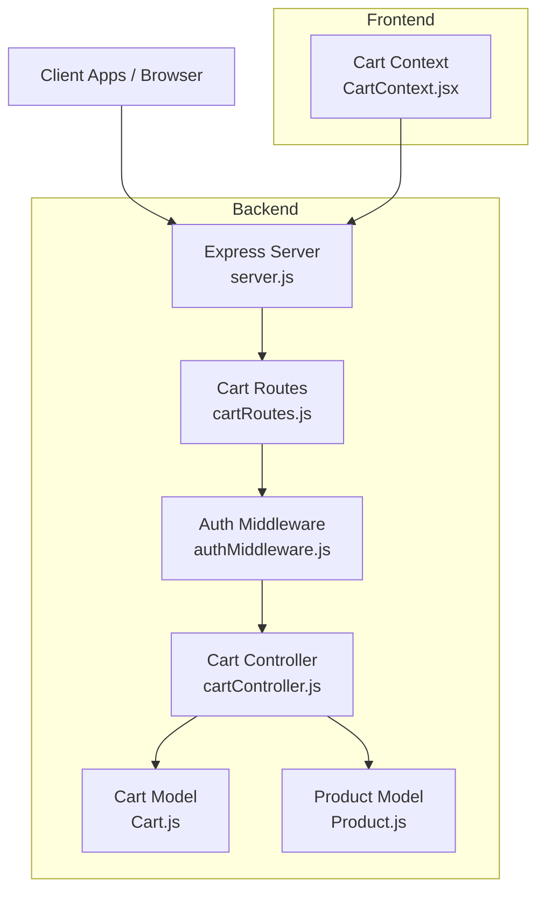
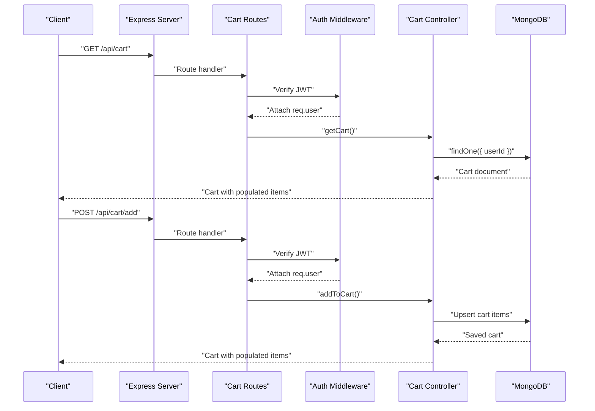
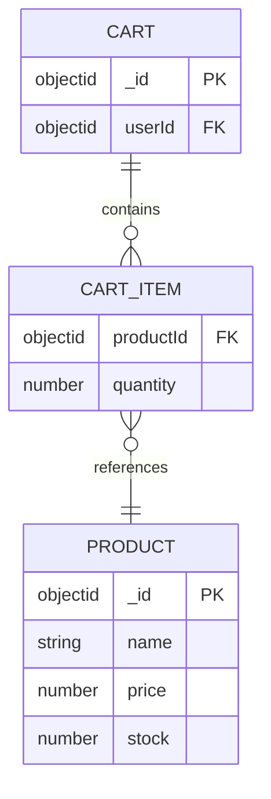
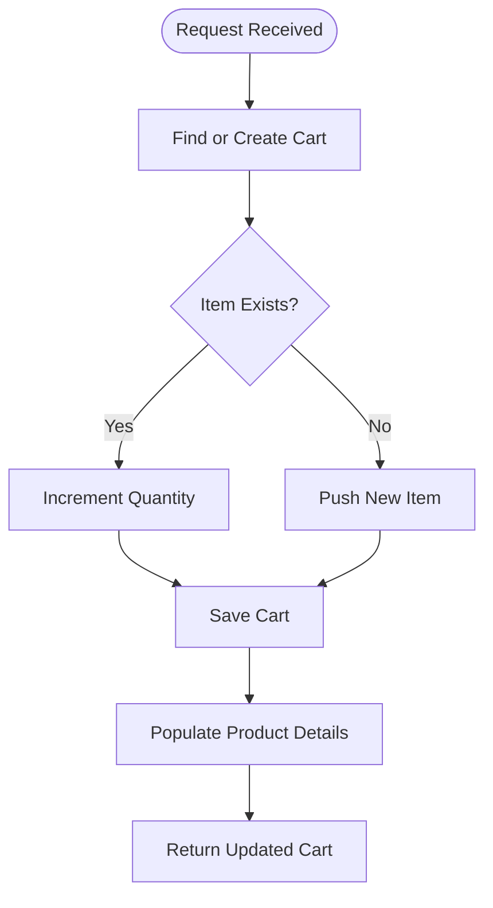
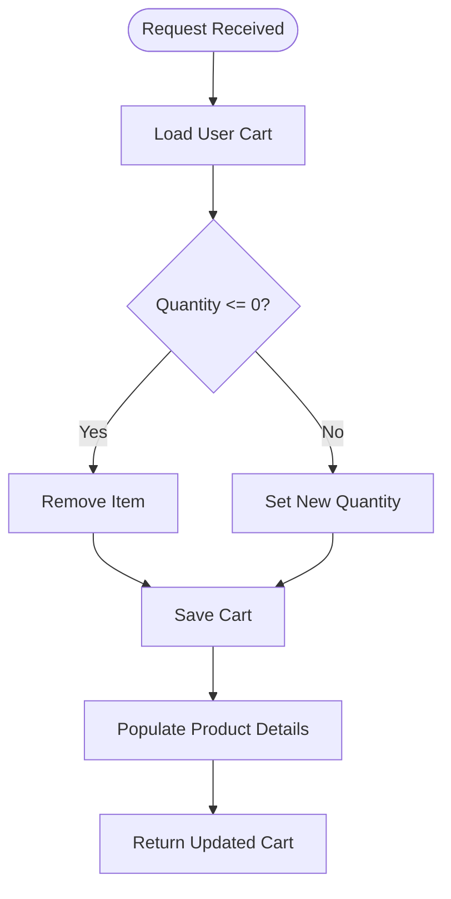
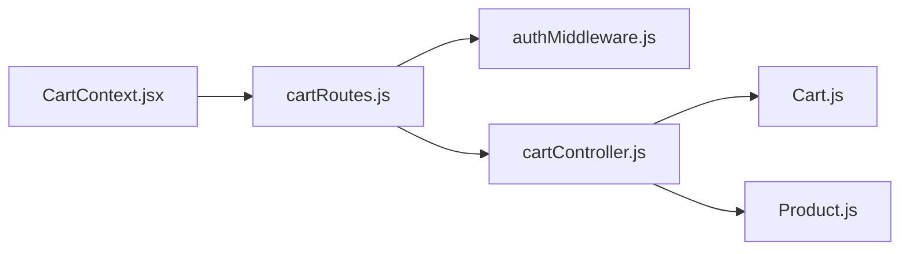

# Cart Operations API

<cite>
**Referenced Files in This Document**
- [cartController.js](file://backend/controllers/cartController.js)
- [cartRoutes.js](file://backend/routes/cartRoutes.js)
- [Cart.js](file://backend/models/Cart.js)
- [authMiddleware.js](file://backend/middleware/authMiddleware.js)
- [server.js](file://backend/server.js)
- [CartContext.jsx](file://frontend/src/context/CartContext.jsx)
- [Product.js](file://backend/models/Product.js)
</cite>

## Table of Contents
1. [Introduction](#introduction)
2. [Project Structure](#project-structure)
3. [Core Components](#core-components)
4. [Architecture Overview](#architecture-overview)
5. [Detailed Component Analysis](#detailed-component-analysis)
6. [Dependency Analysis](#dependency-analysis)
7. [Performance Considerations](#performance-considerations)
8. [Troubleshooting Guide](#troubleshooting-guide)
9. [Conclusion](#conclusion)

## Introduction
This document provides comprehensive API documentation for the Cart Operations API endpoints. It covers retrieving cart contents, adding items, updating quantities, removing items, clearing the cart, and the underlying cart persistence mechanism. It also documents authentication requirements, data validation, and error handling behavior, along with practical workflows and integration considerations with the product inventory system.

## Project Structure
The cart functionality is implemented as a backend API with a MongoDB-backed cart model and a frontend React context that interacts with the API. Authentication is enforced via JWT tokens.

**Diagram sources**
- [server.js:1-102](file://backend/server.js#L1-L102)
- [cartRoutes.js:1-12](file://backend/routes/cartRoutes.js#L1-L12)
- [authMiddleware.js:1-20](file://backend/middleware/authMiddleware.js#L1-L20)
- [cartController.js:1-38](file://backend/controllers/cartController.js#L1-L38)
- [Cart.js:1-12](file://backend/models/Cart.js#L1-L12)
- [Product.js:1-12](file://backend/models/Product.js#L1-L12)
- [CartContext.jsx:1-53](file://frontend/src/context/CartContext.jsx#L1-L53)

**Section sources**
- [server.js:57-63](file://backend/server.js#L57-L63)
- [cartRoutes.js:7-10](file://backend/routes/cartRoutes.js#L7-L10)

## Core Components
- Cart Controller: Implements GET /api/cart, POST /api/cart/add, PUT /api/cart/update, and DELETE /api/cart/clear.
- Cart Routes: Defines the route handlers and applies the authentication middleware.
- Cart Model: Defines the cart schema with user association and items array containing productId and quantity.
- Auth Middleware: Validates JWT tokens and attaches user info to requests.
- Frontend Cart Context: Manages cart state and performs cart operations via API calls.

**Section sources**
- [cartController.js:3-38](file://backend/controllers/cartController.js#L3-L38)
- [cartRoutes.js:7-10](file://backend/routes/cartRoutes.js#L7-L10)
- [Cart.js:3-12](file://backend/models/Cart.js#L3-L12)
- [authMiddleware.js:4-15](file://backend/middleware/authMiddleware.js#L4-L15)
- [CartContext.jsx:31-42](file://frontend/src/context/CartContext.jsx#L31-L42)

## Architecture Overview
The cart API is protected by JWT authentication middleware. Requests are routed to controller functions that operate on the Cart model. The Cart model references the Product model to populate product details when retrieving the cart.

**Diagram sources**
- [server.js:57-63](file://backend/server.js#L57-L63)
- [cartRoutes.js:7-10](file://backend/routes/cartRoutes.js#L7-L10)
- [authMiddleware.js:4-15](file://backend/middleware/authMiddleware.js#L4-L15)
- [cartController.js:3-22](file://backend/controllers/cartController.js#L3-L22)
- [Cart.js:3-12](file://backend/models/Cart.js#L3-L12)

## Detailed Component Analysis

### Authentication and Authorization
- All cart endpoints require a valid JWT bearer token in the Authorization header.
- The auth middleware verifies the token and attaches the user object to the request.
- Unauthorized or invalid tokens result in 401 responses.

**Section sources**
- [authMiddleware.js:4-15](file://backend/middleware/authMiddleware.js#L4-L15)
- [cartRoutes.js:7-10](file://backend/routes/cartRoutes.js#L7-L10)

### Endpoint Definitions

#### GET /api/cart
- Purpose: Retrieve the current user's cart, including product details and computed totals.
- Behavior:
  - Finds or creates a cart for the authenticated user.
  - Populates each item's productId with product details.
  - Returns the cart object.
- Response: Cart document with items array containing product details.
- Notes: Totals are computed client-side by multiplying item quantity by product price.

**Section sources**
- [cartController.js:3-7](file://backend/controllers/cartController.js#L3-L7)
- [Cart.js:5-8](file://backend/models/Cart.js#L5-L8)
- [CartContext.jsx:44](file://frontend/src/context/CartContext.jsx#L44)

#### POST /api/cart/add
- Purpose: Add a product to the cart or increase its quantity.
- Request body:
  - productId: ObjectId of the product to add.
  - quantity: Positive integer quantity to add.
- Behavior:
  - Locates the user's cart or creates a new one.
  - If the product exists in the cart, increments the quantity.
  - Otherwise, pushes a new item with productId and quantity.
  - Saves the cart and returns the updated cart with populated items.
- Validation:
  - Quantity minimum is enforced by the schema (min: 1).
  - No explicit stock availability check is performed in the controller.

**Section sources**
- [cartController.js:9-22](file://backend/controllers/cartController.js#L9-L22)
- [Cart.js:7](file://backend/models/Cart.js#L7)

#### PUT /api/cart/update
- Purpose: Update an item's quantity or remove it when quantity is set to 0.
- Request body:
  - productId: ObjectId of the item to update.
  - quantity: New quantity; if zero or less, the item is removed.
- Behavior:
  - Finds the user's cart.
  - If quantity <= 0, removes the item from the cart.
  - Else updates the item's quantity.
  - Saves and returns the updated cart with populated items.

**Section sources**
- [cartController.js:24-32](file://backend/controllers/cartController.js#L24-L32)

#### DELETE /api/cart/clear
- Purpose: Empty the cart for the authenticated user.
- Behavior:
  - Deletes the existing cart document for the user.
  - Creates a new empty cart for the user.
  - Returns a success message.

**Section sources**
- [cartController.js:34-38](file://backend/controllers/cartController.js#L34-L38)

### Cart Persistence Mechanism
- Storage: MongoDB collection backed by the Cart model.
- Schema:
  - userId: Reference to the User who owns the cart.
  - items: Array of objects containing productId and quantity.
- Indexing: Unique index on userId ensures one cart per user.
- Population: On retrieval, productId is populated with product details.

**Diagram sources**
- [Cart.js:3-12](file://backend/models/Cart.js#L3-L12)
- [Product.js:3-10](file://backend/models/Product.js#L3-L10)

**Section sources**
- [Cart.js:11](file://backend/models/Cart.js#L11)

### Data Flow and Processing Logic

#### Add to Cart Flow

**Diagram sources**
- [cartController.js:9-22](file://backend/controllers/cartController.js#L9-L22)

#### Update Cart Flow

**Diagram sources**
- [cartController.js:24-32](file://backend/controllers/cartController.js#L24-L32)

### Integration with Product Inventory
- Product details are populated when retrieving the cart.
- There is no built-in stock validation during cart operations.
- Consider adding stock checks in addToCart and updateCartItem to prevent overselling.

**Section sources**
- [cartController.js:3-22](file://backend/controllers/cartController.js#L3-L22)
- [Product.js:9](file://backend/models/Product.js#L9)

## Dependency Analysis
- Route Handlers depend on Auth Middleware for user authentication.
- Controllers depend on the Cart model for persistence and on the Product model for population.
- Frontend depends on the backend API for cart operations.

**Diagram sources**
- [cartRoutes.js:1-12](file://backend/routes/cartRoutes.js#L1-L12)
- [authMiddleware.js:1-20](file://backend/middleware/authMiddleware.js#L1-L20)
- [cartController.js:1-38](file://backend/controllers/cartController.js#L1-L38)
- [Cart.js:1-12](file://backend/models/Cart.js#L1-L12)
- [Product.js:1-12](file://backend/models/Product.js#L1-L12)
- [CartContext.jsx:1-53](file://frontend/src/context/CartContext.jsx#L1-L53)

**Section sources**
- [cartRoutes.js:7-10](file://backend/routes/cartRoutes.js#L7-L10)
- [cartController.js:3-38](file://backend/controllers/cartController.js#L3-L38)

## Performance Considerations
- Population on GET /api/cart: Populating product details for each item adds database overhead proportional to the number of items. Consider limiting cart sizes or implementing pagination if carts grow large.
- Unique index on userId: Ensures efficient cart lookup per user.
- Minimal validation in controllers: Keep validation lightweight to avoid bottlenecks.

## Troubleshooting Guide
- 401 Unauthorized:
  - Cause: Missing or invalid JWT token.
  - Resolution: Ensure Authorization header includes a valid bearer token.
- Cart not found:
  - Cause: User has no cart document.
  - Resolution: The system creates a new cart on first access; retry the operation.
- Invalid productId:
  - Cause: productId not present in cart when updating/removing.
  - Resolution: Verify productId correctness; use productId from the cart items.
- Quantity validation errors:
  - Cause: Schema enforces minimum quantity of 1.
  - Resolution: Send quantity >= 1; use quantity 0 to remove an item.

**Section sources**
- [authMiddleware.js:4-15](file://backend/middleware/authMiddleware.js#L4-L15)
- [Cart.js:7](file://backend/models/Cart.js#L7)
- [cartController.js:24-32](file://backend/controllers/cartController.js#L24-L32)

## Conclusion
The Cart Operations API provides essential cart management capabilities with straightforward endpoints and a clean separation of concerns. Authentication is mandatory, and cart persistence is user-specific. While the current implementation focuses on simplicity, integrating stock validation and optimizing population-heavy operations would enhance robustness and scalability.