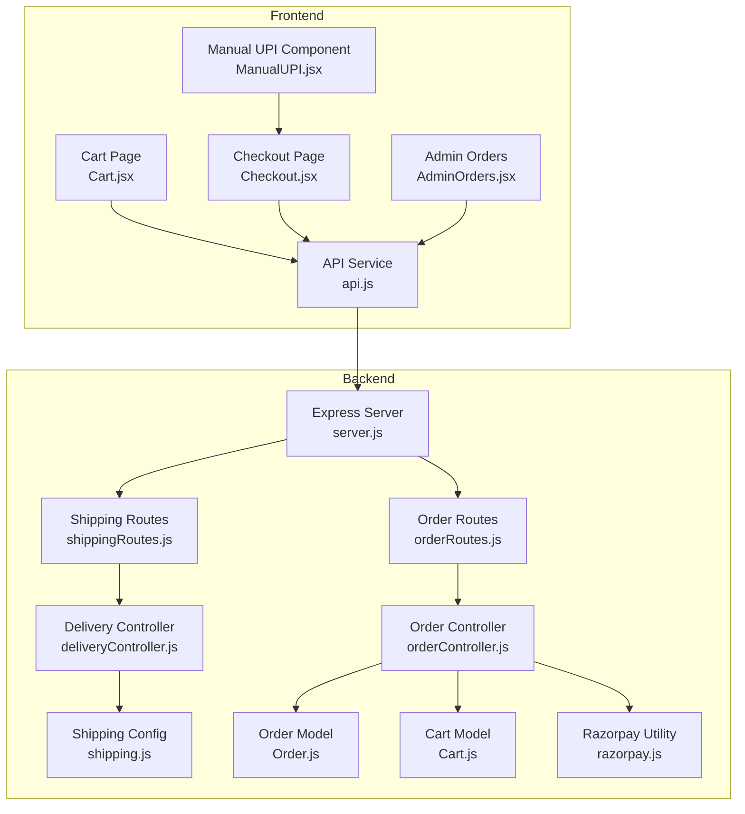
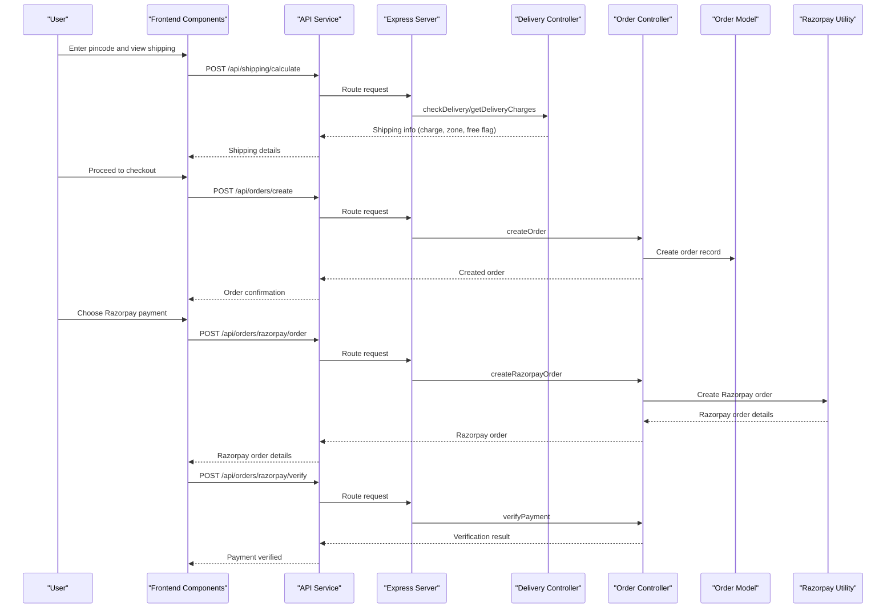
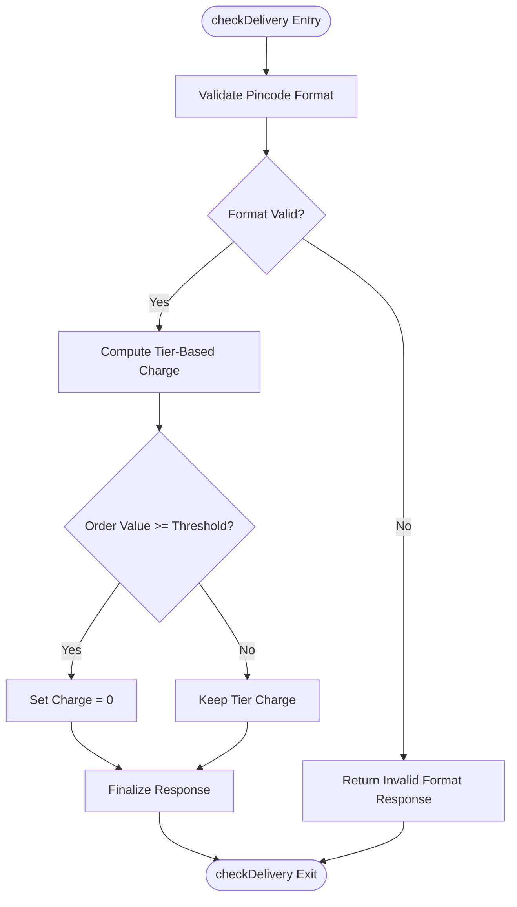
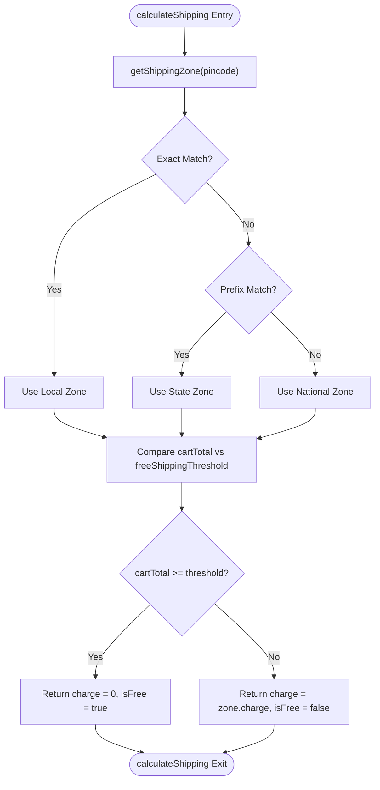
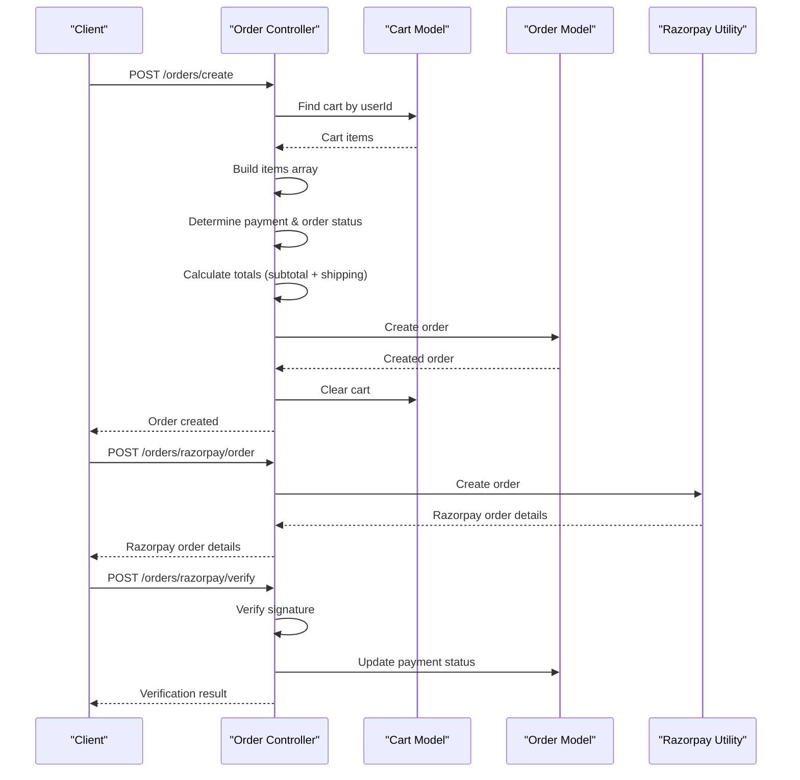
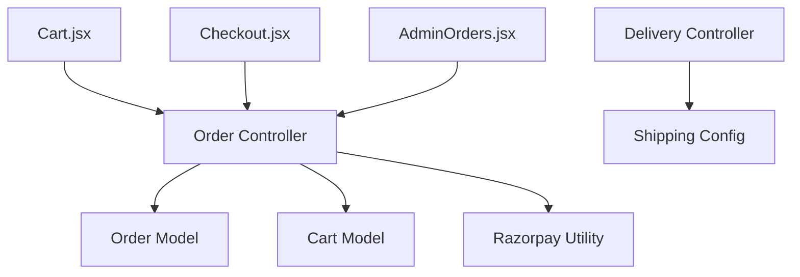

# Delivery Management

<cite>
**Referenced Files in This Document**
- [deliveryController.js](file://backend/controllers/deliveryController.js)
- [shippingRoutes.js](file://backend/routes/shippingRoutes.js)
- [shipping.js](file://backend/config/shipping.js)
- [orderController.js](file://backend/controllers/orderController.js)
- [orderRoutes.js](file://backend/routes/orderRoutes.js)
- [Order.js](file://backend/models/Order.js)
- [Cart.js](file://backend/models/Cart.js)
- [server.js](file://backend/server.js)
- [Cart.jsx](file://frontend/src/pages/Cart.jsx)
- [Checkout.jsx](file://frontend/src/pages/Checkout.jsx)
- [ManualUPI.jsx](file://frontend/src/components/ManualUPI.jsx)
- [AdminOrders.jsx](file://frontend/src/components/admin/AdminOrders.jsx)
- [api.js](file://frontend/src/services/api.js)
- [razorpay.js](file://backend/utils/razorpay.js)
</cite>

## Table of Contents
1. [Introduction](#introduction)
2. [Project Structure](#project-structure)
3. [Core Components](#core-components)
4. [Architecture Overview](#architecture-overview)
5. [Detailed Component Analysis](#detailed-component-analysis)
6. [Dependency Analysis](#dependency-analysis)
7. [Performance Considerations](#performance-considerations)
8. [Troubleshooting Guide](#troubleshooting-guide)
9. [Conclusion](#conclusion)

## Introduction
This document provides comprehensive documentation for the Delivery Management system within the ecommerce application. It covers the end-to-end flow of delivery estimation, shipping cost calculation, order placement with various payment methods, and administrative order tracking. The system integrates frontend components with backend controllers, routes, and models to deliver a seamless shopping experience with flexible payment options including Cash on Delivery (COD), online payments via Razorpay, and manual UPI payments.

## Project Structure
The delivery management system spans both frontend and backend layers:
- Backend: Express.js server with controllers, routes, models, and configuration for shipping logic.
- Frontend: React components for cart, checkout, and admin order management with API integration.

**Diagram sources**
- [server.js:1-104](file://backend/server.js#L1-L104)
- [shippingRoutes.js:1-13](file://backend/routes/shippingRoutes.js#L1-L13)
- [orderRoutes.js:1-28](file://backend/routes/orderRoutes.js#L1-L28)
- [deliveryController.js:1-118](file://backend/controllers/deliveryController.js#L1-L118)
- [orderController.js:1-146](file://backend/controllers/orderController.js#L1-L146)
- [shipping.js:1-73](file://backend/config/shipping.js#L1-L73)
- [Order.js:1-33](file://backend/models/Order.js#L1-L33)
- [Cart.js:1-12](file://backend/models/Cart.js#L1-L12)
- [razorpay.js:1-10](file://backend/utils/razorpay.js#L1-L10)
- [Cart.jsx:1-152](file://frontend/src/pages/Cart.jsx#L1-L152)
- [Checkout.jsx:1-301](file://frontend/src/pages/Checkout.jsx#L1-L301)
- [ManualUPI.jsx:1-125](file://frontend/src/components/ManualUPI.jsx#L1-L125)
- [AdminOrders.jsx:1-213](file://frontend/src/components/admin/AdminOrders.jsx#L1-L213)
- [api.js:1-8](file://frontend/src/services/api.js#L1-L8)

**Section sources**
- [server.js:1-104](file://backend/server.js#L1-L104)
- [shippingRoutes.js:1-13](file://backend/routes/shippingRoutes.js#L1-L13)
- [orderRoutes.js:1-28](file://backend/routes/orderRoutes.js#L1-L28)

## Core Components
- Delivery Estimation and Charges:
  - Rule-based pincode validation and tier-based pricing.
  - Bulk delivery charge calculation supporting free shipping thresholds.
- Shipping Zones and Pricing:
  - Configurable zones (Local, State, National) with per-zone charges and free shipping thresholds.
  - Helper functions to determine shipping zone and calculate final shipping costs.
- Order Management:
  - Creation of orders with dynamic shipping charges and payment metadata.
  - Support for COD, Razorpay online payments, and manual UPI verification.
  - Administrative order status updates and visibility.
- Frontend Integration:
  - Cart page with pincode-based shipping estimation.
  - Checkout page with payment method selection and order submission.
  - Admin dashboard for order tracking and status management.

**Section sources**
- [deliveryController.js:1-118](file://backend/controllers/deliveryController.js#L1-L118)
- [shipping.js:1-73](file://backend/config/shipping.js#L1-L73)
- [orderController.js:83-146](file://backend/controllers/orderController.js#L83-L146)
- [Cart.jsx:35-53](file://frontend/src/pages/Cart.jsx#L35-L53)
- [Checkout.jsx:67-137](file://frontend/src/pages/Checkout.jsx#L67-L137)
- [AdminOrders.jsx:26-34](file://frontend/src/components/admin/AdminOrders.jsx#L26-L34)

## Architecture Overview
The delivery management architecture follows a layered pattern:
- Presentation Layer (Frontend): React components handle user interactions and API communication.
- Application Layer (Backend): Express routes delegate to controllers for business logic.
- Domain Layer (Models): Mongoose models define data structures for orders and carts.
- Configuration Layer: Shipping configuration encapsulates pricing rules and zone logic.

**Diagram sources**
- [server.js:58-65](file://backend/server.js#L58-L65)
- [shippingRoutes.js:6-10](file://backend/routes/shippingRoutes.js#L6-L10)
- [orderRoutes.js:16-22](file://backend/routes/orderRoutes.js#L16-L22)
- [deliveryController.js:2-78](file://backend/controllers/deliveryController.js#L2-L78)
- [orderController.js:83-146](file://backend/controllers/orderController.js#L83-L146)
- [Order.js:1-33](file://backend/models/Order.js#L1-L33)
- [razorpay.js:5-8](file://backend/utils/razorpay.js#L5-L8)

## Detailed Component Analysis

### Delivery Estimation Controller
Responsibilities:
- Validate pincode format and compute delivery availability and charges.
- Implement tier-based pricing logic and free shipping thresholds.
- Support bulk delivery charge calculations for multiple pincodes.

Key behaviors:
- Pincode validation using regex pattern matching.
- Zone-based pricing with configurable thresholds.
- Error handling for invalid inputs and internal failures.

**Diagram sources**
- [deliveryController.js:2-78](file://backend/controllers/deliveryController.js#L2-L78)

**Section sources**
- [deliveryController.js:1-118](file://backend/controllers/deliveryController.js#L1-L118)

### Shipping Configuration
Responsibilities:
- Define shipping zones with pincode patterns and prefixes.
- Calculate shipping charges and free shipping eligibility.
- Provide helper functions to determine zone and compute final shipping cost.

Key behaviors:
- Exact pincode match for Local zone.
- Prefix-based matching for State zone.
- Default National zone for unmatched pincodes.
- Free shipping when cart total meets threshold.

**Diagram sources**
- [shipping.js:31-73](file://backend/config/shipping.js#L31-L73)

**Section sources**
- [shipping.js:1-73](file://backend/config/shipping.js#L1-L73)

### Order Management Controller
Responsibilities:
- Create orders with shipping details and payment metadata.
- Support multiple payment methods: COD, Razorpay, and manual UPI.
- Verify Razorpay payments and update order/payment status.
- Admin-only order status updates.

Key behaviors:
- Build items array from cart populated with product details.
- Determine payment and order status based on payment method.
- Calculate order totals with optional overrides.
- Clear cart after successful order creation.

**Diagram sources**
- [orderController.js:83-146](file://backend/controllers/orderController.js#L83-L146)
- [Cart.js:1-12](file://backend/models/Cart.js#L1-L12)
- [Order.js:1-33](file://backend/models/Order.js#L1-L33)
- [razorpay.js:5-8](file://backend/utils/razorpay.js#L5-L8)

**Section sources**
- [orderController.js:1-146](file://backend/controllers/orderController.js#L1-L146)
- [Order.js:1-33](file://backend/models/Order.js#L1-L33)

### Frontend Integration Components

#### Cart Page
Responsibilities:
- Display cart contents and calculate subtotal.
- Allow users to enter pincode for shipping estimation.
- Show shipping cost and total, enabling checkout navigation.

Key behaviors:
- Pincode input validation (6 digits).
- Call shipping calculation endpoint with cart total.
- Pass shipping info to checkout page via state.

**Section sources**
- [Cart.jsx:35-53](file://frontend/src/pages/Cart.jsx#L35-L53)
- [Cart.jsx:136-143](file://frontend/src/pages/Cart.jsx#L136-L143)

#### Checkout Page
Responsibilities:
- Collect shipping address and payment method selection.
- Handle COD, online Razorpay, and manual UPI payment flows.
- Submit order with calculated totals and shipping details.

Key behaviors:
- Validate address fields and phone number length.
- Load Razorpay script for secure payment processing.
- Handle UPI manual payment with transaction ID capture.
- Navigate to order confirmation upon successful order placement.

**Section sources**
- [Checkout.jsx:67-137](file://frontend/src/pages/Checkout.jsx#L67-L137)
- [Checkout.jsx:139-165](file://frontend/src/pages/Checkout.jsx#L139-L165)

#### Manual UPI Component
Responsibilities:
- Provide UPI payment instructions and QR code generation.
- Capture transaction ID for manual UPI verification.
- Facilitate customer support via WhatsApp.

Key behaviors:
- Generate UPI payment link with amount and recipient.
- Toggle QR code visibility and handle generation errors.
- Validate transaction ID input and trigger order placement.

**Section sources**
- [ManualUPI.jsx:19-25](file://frontend/src/components/ManualUPI.jsx#L19-L25)
- [ManualUPI.jsx:64-78](file://frontend/src/components/ManualUPI.jsx#L64-L78)

#### Admin Orders Dashboard
Responsibilities:
- Display all orders with filtering by status.
- Show order details including shipping address, items, and pricing breakdown.
- Update order status with immediate feedback.

Key behaviors:
- Fetch orders with admin privileges.
- Filter orders by status (Pending, Shipped, Delivered, Cancelled).
- Update order status via PUT request and refresh list.

**Section sources**
- [AdminOrders.jsx:15-24](file://frontend/src/components/admin/AdminOrders.jsx#L15-L24)
- [AdminOrders.jsx:36-34](file://frontend/src/components/admin/AdminOrders.jsx#L36-L34)

## Dependency Analysis
The delivery management system exhibits clear separation of concerns:
- Controllers depend on models for data persistence and configuration for pricing logic.
- Routes act as thin layers delegating to controllers.
- Frontend components rely on the API service for backend communication.
- Razorpay utility integrates with order controller for payment processing.

**Diagram sources**
- [deliveryController.js:1-118](file://backend/controllers/deliveryController.js#L1-L118)
- [orderController.js:1-146](file://backend/controllers/orderController.js#L1-L146)
- [shipping.js:1-73](file://backend/config/shipping.js#L1-L73)
- [Order.js:1-33](file://backend/models/Order.js#L1-L33)
- [Cart.js:1-12](file://backend/models/Cart.js#L1-L12)
- [razorpay.js:1-10](file://backend/utils/razorpay.js#L1-L10)
- [Cart.jsx:1-152](file://frontend/src/pages/Cart.jsx#L1-L152)
- [Checkout.jsx:1-301](file://frontend/src/pages/Checkout.jsx#L1-L301)
- [AdminOrders.jsx:1-213](file://frontend/src/components/admin/AdminOrders.jsx#L1-L213)

**Section sources**
- [server.js:58-65](file://backend/server.js#L58-L65)
- [orderRoutes.js:16-26](file://backend/routes/orderRoutes.js#L16-L26)
- [shippingRoutes.js:6-10](file://backend/routes/shippingRoutes.js#L6-L10)

## Performance Considerations
- Pincode validation and zone lookup are O(1) operations due to fixed-length patterns and prefix checks.
- Bulk shipping calculations iterate over arrays; ensure pincodes arrays are reasonably sized.
- Cart and order queries rely on indexed fields; maintain database indexes for userId and _id for optimal performance.
- Razorpay order creation and verification introduce external API latency; implement timeouts and retry logic where appropriate.
- Frontend rendering performance benefits from memoization of computed totals and shipping info.

## Troubleshooting Guide
Common issues and resolutions:
- Invalid pincode format:
  - Ensure 6-digit numeric input; validation prevents malformed requests.
- Shipping calculation failures:
  - Verify backend route exposure and network connectivity to external APIs if integrated.
- Order creation errors:
  - Check cart emptiness and user authentication; ensure required fields are present.
- Razorpay verification failures:
  - Confirm signature verification logic and environment variable configuration for keys.
- Admin order status updates:
  - Ensure admin authentication and valid status transitions.

**Section sources**
- [deliveryController.js:71-77](file://backend/controllers/deliveryController.js#L71-L77)
- [orderController.js:142-145](file://backend/controllers/orderController.js#L142-L145)
- [orderController.js:53-67](file://backend/controllers/orderController.js#L53-L67)

## Conclusion
The Delivery Management system provides a robust foundation for handling shipping estimation, pricing, and order processing across multiple payment methods. Its modular architecture enables easy maintenance and future enhancements, such as integrating real-time shipping APIs and expanding payment options. The frontend components offer intuitive user experiences, while the backend ensures reliable data handling and administrative oversight.