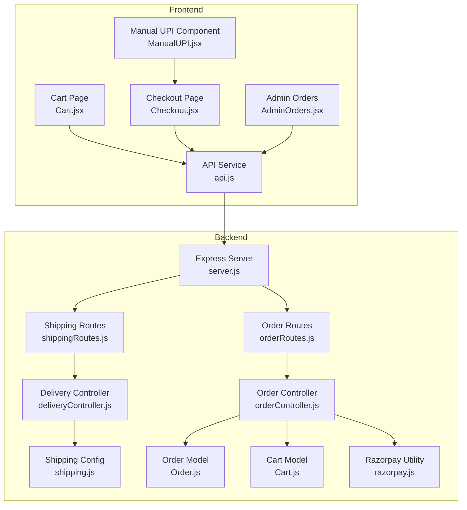
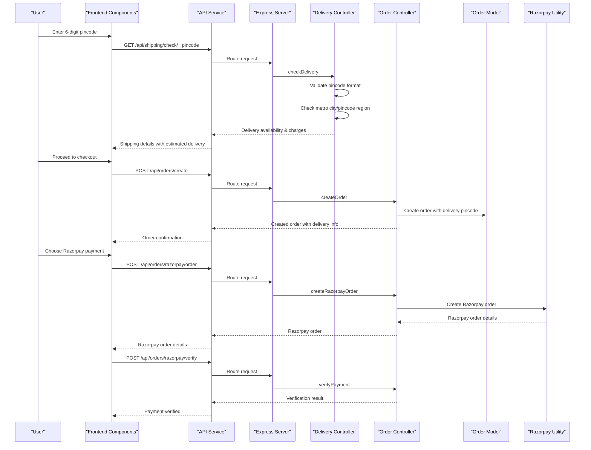
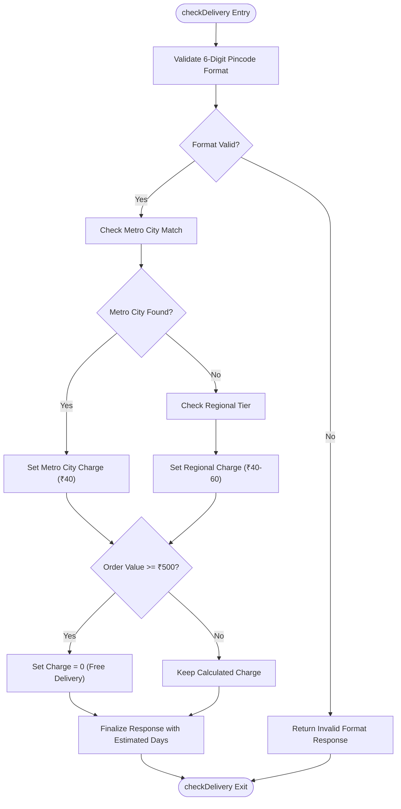
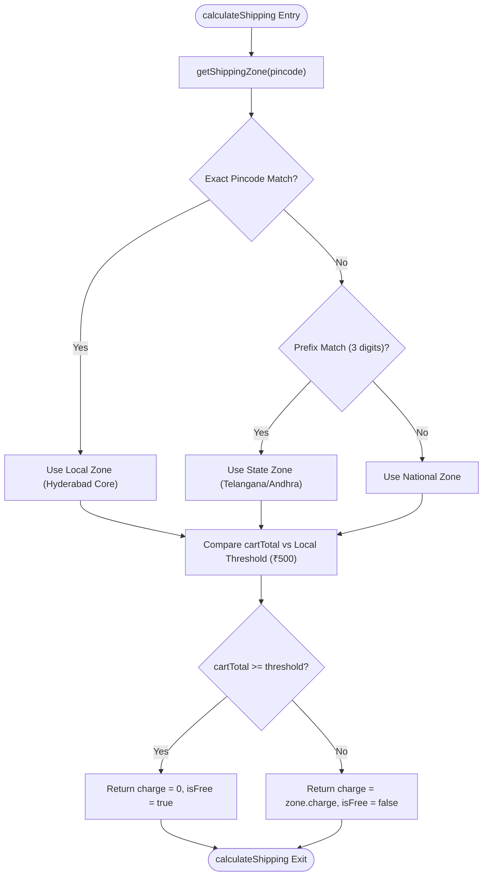
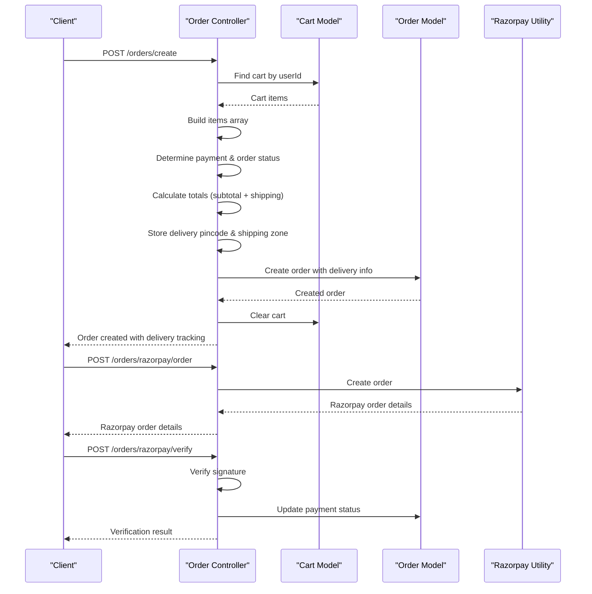
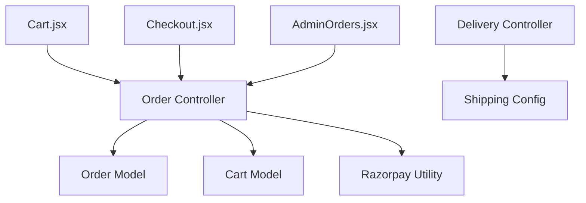

# Delivery Management

<cite>
**Referenced Files in This Document**
- [deliveryController.js](file://backend/controllers/deliveryController.js)
- [shippingRoutes.js](file://backend/routes/shippingRoutes.js)
- [shipping.js](file://backend/config/shipping.js)
- [orderController.js](file://backend/controllers/orderController.js)
- [orderRoutes.js](file://backend/routes/orderRoutes.js)
- [Order.js](file://backend/models/Order.js)
- [Cart.js](file://backend/models/Cart.js)
- [server.js](file://backend/server.js)
- [Cart.jsx](file://frontend/src/pages/Cart.jsx)
- [Checkout.jsx](file://frontend/src/pages/Checkout.jsx)
- [ManualUPI.jsx](file://frontend/src/components/ManualUPI.jsx)
- [AdminOrders.jsx](file://frontend/src/components/admin/AdminOrders.jsx)
- [api.js](file://frontend/src/services/api.js)
- [razorpay.js](file://backend/utils/razorpay.js)
</cite>

## Update Summary
**Changes Made**
- Enhanced pincode-based delivery checking functionality for Indian pincode areas
- Added tier-based pricing system with regional delivery zones
- Integrated comprehensive shipping zone configuration with metro city support
- Improved frontend pincode validation and delivery estimation interface
- Enhanced order model to store delivery pincode and shipping zone information

## Table of Contents
1. [Introduction](#introduction)
2. [Project Structure](#project-structure)
3. [Core Components](#core-components)
4. [Architecture Overview](#architecture-overview)
5. [Detailed Component Analysis](#detailed-component-analysis)
6. [Dependency Analysis](#dependency-analysis)
7. [Performance Considerations](#performance-considerations)
8. [Troubleshooting Guide](#troubleshooting-guide)
9. [Conclusion](#conclusion)

## Introduction
This document provides comprehensive documentation for the Delivery Management system within the ecommerce application. The system has been enhanced with advanced pincode-based delivery checking functionality that allows customers to verify product delivery to specific Indian pincode areas. It covers end-to-end delivery estimation, tier-based shipping cost calculation, order placement with various payment methods, and administrative order tracking. The system integrates frontend components with backend controllers, routes, and models to deliver a seamless shopping experience with flexible payment options including Cash on Delivery (COD), online payments via Razorpay, and manual UPI payments.

## Project Structure
The delivery management system spans both frontend and backend layers with enhanced pincode validation capabilities:
- Backend: Express.js server with controllers, routes, models, and configuration for shipping logic with Indian pincode support.
- Frontend: React components for cart, checkout, and admin order management with API integration and pincode-based delivery checking.

**Diagram sources**
- [server.js:1-118](file://backend/server.js#L1-L118)
- [shippingRoutes.js:1-13](file://backend/routes/shippingRoutes.js#L1-L13)
- [orderRoutes.js:1-28](file://backend/routes/orderRoutes.js#L1-L28)
- [deliveryController.js:1-118](file://backend/controllers/deliveryController.js#L1-L118)
- [orderController.js:1-173](file://backend/controllers/orderController.js#L1-L173)
- [shipping.js:1-73](file://backend/config/shipping.js#L1-L73)
- [Order.js:1-33](file://backend/models/Order.js#L1-L33)
- [Cart.js:1-12](file://backend/models/Cart.js#L1-L12)
- [razorpay.js:1-10](file://backend/utils/razorpay.js#L1-L10)
- [Cart.jsx:1-238](file://frontend/src/pages/Cart.jsx#L1-L238)
- [Checkout.jsx:1-301](file://frontend/src/pages/Checkout.jsx#L1-L301)
- [ManualUPI.jsx:1-125](file://frontend/src/components/ManualUPI.jsx#L1-L125)
- [AdminOrders.jsx:1-213](file://frontend/src/components/admin/AdminOrders.jsx#L1-L213)
- [api.js:1-8](file://frontend/src/services/api.js#L1-L8)

**Section sources**
- [server.js:1-118](file://backend/server.js#L1-L118)
- [shippingRoutes.js:1-13](file://backend/routes/shippingRoutes.js#L1-L13)
- [orderRoutes.js:1-28](file://backend/routes/orderRoutes.js#L1-L28)

## Core Components
- **Enhanced Delivery Estimation and Charges**:
  - Advanced pincode validation with Indian pincode format checking (6-digit numeric).
  - Tier-based pricing system with regional delivery zones (North, South, East, West).
  - Metro city support with special pricing for major metropolitan areas.
  - Bulk delivery charge calculation supporting free shipping thresholds.
- **Comprehensive Shipping Zones and Pricing**:
  - Configurable zones (Local, State, National) with detailed pincode patterns and prefixes.
  - Special handling for Hyderabad core areas with exact pincode matching.
  - Support for Telangana and Andhra Pradesh state-wide delivery.
  - Regional tier pricing with different charge structures for different geographical regions.
- **Advanced Order Management**:
  - Creation of orders with delivery pincode and shipping zone tracking.
  - Support for COD, Razorpay online payments, and manual UPI verification.
  - Administrative order status updates with delivery information.
- **Enhanced Frontend Integration**:
  - Cart page with integrated pincode-based shipping estimation.
  - Checkout page with payment method selection and order submission.
  - Admin dashboard for order tracking with delivery pincode information.

**Section sources**
- [deliveryController.js:1-118](file://backend/controllers/deliveryController.js#L1-L118)
- [shipping.js:1-73](file://backend/config/shipping.js#L1-L73)
- [orderController.js:86-173](file://backend/controllers/orderController.js#L86-L173)
- [Cart.jsx:39-66](file://frontend/src/pages/Cart.jsx#L39-L66)
- [Checkout.jsx:67-165](file://frontend/src/pages/Checkout.jsx#L67-L165)
- [AdminOrders.jsx:26-34](file://frontend/src/components/admin/AdminOrders.jsx#L26-L34)

## Architecture Overview
The enhanced delivery management architecture follows a layered pattern with improved pincode validation:
- **Presentation Layer (Frontend)**: React components handle user interactions, pincode validation, and API communication.
- **Application Layer (Backend)**: Express routes delegate to controllers for business logic with enhanced delivery checking.
- **Domain Layer (Models)**: Mongoose models define data structures for orders and carts with delivery pincode tracking.
- **Configuration Layer**: Shipping configuration encapsulates comprehensive pricing rules, zone logic, and Indian pincode patterns.

**Diagram sources**
- [server.js:77-80](file://backend/server.js#L77-L80)
- [shippingRoutes.js:6-10](file://backend/routes/shippingRoutes.js#L6-L10)
- [orderRoutes.js:16-22](file://backend/routes/orderRoutes.js#L16-L22)
- [deliveryController.js:2-78](file://backend/controllers/deliveryController.js#L2-L78)
- [orderController.js:86-173](file://backend/controllers/orderController.js#L86-L173)
- [Order.js:18-21](file://backend/models/Order.js#L18-L21)
- [razorpay.js:5-8](file://backend/utils/razorpay.js#L5-L8)

## Detailed Component Analysis

### Enhanced Delivery Estimation Controller
**Updated** Enhanced with comprehensive pincode validation and tier-based pricing system.

Responsibilities:
- Validate Indian pincode format (6-digit numeric) and compute delivery availability and charges.
- Implement tier-based pricing logic with regional delivery zones.
- Support bulk delivery charge calculations for multiple pincodes.
- Provide delivery estimation with estimated delivery days.

Key behaviors:
- **Enhanced Pincode Validation**: Uses regex pattern matching for 6-digit Indian pincode format.
- **Regional Pricing System**: Implements tier-based pricing for different geographical regions.
- **Metro City Support**: Special pricing for major metropolitan areas (Delhi NCR, Mumbai, Bangalore, Chennai, Kolkata, Hyderabad, Pune).
- **Free Shipping Logic**: Automatic free shipping for orders meeting threshold amounts.
- **Error Handling**: Comprehensive error handling for invalid inputs and internal failures.

**Diagram sources**
- [deliveryController.js:2-78](file://backend/controllers/deliveryController.js#L2-L78)

**Section sources**
- [deliveryController.js:1-118](file://backend/controllers/deliveryController.js#L1-L118)

### Enhanced Shipping Configuration
**Updated** Comprehensive shipping zone configuration with Indian pincode patterns.

Responsibilities:
- Define shipping zones with detailed pincode patterns and prefixes for Indian regions.
- Calculate shipping charges and free shipping eligibility with regional variations.
- Provide helper functions to determine shipping zone and compute final shipping cost.
- Support exact pincode matching for local zones and prefix-based matching for state zones.

Key behaviors:
- **Local Zone**: Hyderabad core areas with exact pincode pattern matching.
- **State Zone**: Telangana & Andhra Pradesh with comprehensive prefix matching.
- **National Zone**: Default zone for unmatched pincodes with standard pricing.
- **Regional Pricing**: Different charge structures for different geographical regions.
- **Free Shipping Thresholds**: Variable thresholds based on zone (₹500, ₹799, ₹1499).

**Diagram sources**
- [shipping.js:31-73](file://backend/config/shipping.js#L31-L73)

**Section sources**
- [shipping.js:1-73](file://backend/config/shipping.js#L1-L73)

### Enhanced Order Management Controller
**Updated** Added delivery pincode and shipping zone tracking.

Responsibilities:
- Create orders with shipping details, delivery pincode, and shipping zone information.
- Support multiple payment methods: COD, Razorpay, and manual UPI.
- Verify Razorpay payments and update order/payment status.
- Admin-only order status updates with delivery information.

Key behaviors:
- Build items array from cart populated with product details.
- Determine payment and order status based on payment method.
- Calculate order totals with optional overrides.
- Store delivery pincode and shipping zone for order tracking.
- Clear cart after successful order creation.

**Diagram sources**
- [orderController.js:86-173](file://backend/controllers/orderController.js#L86-L173)
- [Cart.js:1-12](file://backend/models/Cart.js#L1-L12)
- [Order.js:18-21](file://backend/models/Order.js#L18-L21)
- [razorpay.js:5-8](file://backend/utils/razorpay.js#L5-L8)

**Section sources**
- [orderController.js:1-173](file://backend/controllers/orderController.js#L1-L173)
- [Order.js:1-33](file://backend/models/Order.js#L1-L33)

### Enhanced Frontend Integration Components

#### Enhanced Cart Page
**Updated** Added comprehensive pincode-based delivery checking functionality.

Responsibilities:
- Display cart contents and calculate subtotal.
- Allow users to enter 6-digit pincode for shipping estimation.
- Show shipping cost, delivery availability, and estimated delivery days.
- Enable checkout navigation with delivery information.

Key behaviors:
- **Pincode Input Validation**: Enforces 6-digit numeric input validation.
- **Real-time Delivery Checking**: Calls shipping calculation endpoint with cart total.
- **Delivery Information Display**: Shows availability status, charges, and estimated delivery.
- **Free Shipping Indication**: Automatically applies free shipping for qualifying orders.
- **Stateful Delivery Information**: Passes shipping info to checkout page via state.

**Section sources**
- [Cart.jsx:39-66](file://frontend/src/pages/Cart.jsx#L39-L66)
- [Cart.jsx:129-157](file://frontend/src/pages/Cart.jsx#L129-L157)

#### Enhanced Checkout Page
**Updated** Integrated delivery pincode and shipping zone information.

Responsibilities:
- Collect shipping address and payment method selection.
- Handle COD, online Razorpay, and manual UPI payment flows.
- Display delivery pincode and shipping zone information.
- Submit order with calculated totals and shipping details.

Key behaviors:
- Validate address fields and phone number length.
- Load Razorpay script for secure payment processing.
- Handle UPI manual payment with transaction ID capture.
- Navigate to order confirmation upon successful order placement.
- Display delivery pincode and shipping zone information.

**Section sources**
- [Checkout.jsx:67-165](file://frontend/src/pages/Checkout.jsx#L67-L165)
- [Checkout.jsx:139-165](file://frontend/src/pages/Checkout.jsx#L139-L165)

#### Manual UPI Component
**Updated** Enhanced with delivery information display.

Responsibilities:
- Provide UPI payment instructions and QR code generation.
- Capture transaction ID for manual UPI verification.
- Facilitate customer support via WhatsApp.
- Display delivery pincode and shipping zone information.

Key behaviors:
- Generate UPI payment link with amount and recipient.
- Toggle QR code visibility and handle generation errors.
- Validate transaction ID input and trigger order placement.
- Display delivery information for customer reference.

**Section sources**
- [ManualUPI.jsx:19-25](file://frontend/src/components/ManualUPI.jsx#L19-L25)
- [ManualUPI.jsx:64-78](file://frontend/src/components/ManualUPI.jsx#L64-L78)

#### Enhanced Admin Orders Dashboard
**Updated** Added delivery pincode and shipping zone tracking.

Responsibilities:
- Display all orders with filtering by status.
- Show order details including shipping address, items, pricing breakdown, and delivery information.
- Update order status with immediate feedback.
- Track delivery pincode and shipping zone for order management.

Key behaviors:
- Fetch orders with admin privileges including delivery information.
- Filter orders by status (Pending, Shipped, Delivered, Cancelled).
- Display delivery pincode and shipping zone information.
- Update order status via PUT request and refresh list.

**Section sources**
- [AdminOrders.jsx:15-24](file://frontend/src/components/admin/AdminOrders.jsx#L15-L24)
- [AdminOrders.jsx:36-34](file://frontend/src/components/admin/AdminOrders.jsx#L36-L34)

## Dependency Analysis
The enhanced delivery management system exhibits clear separation of concerns with improved pincode validation:
- Controllers depend on models for data persistence and configuration for comprehensive pricing logic.
- Routes act as thin layers delegating to controllers with enhanced delivery checking.
- Frontend components rely on the API service for backend communication with real-time delivery information.
- Razorpay utility integrates with order controller for payment processing.
- **New**: Delivery controller now depends on shipping configuration for enhanced pincode validation.

**Diagram sources**
- [deliveryController.js:1-118](file://backend/controllers/deliveryController.js#L1-L118)
- [orderController.js:1-173](file://backend/controllers/orderController.js#L1-L173)
- [shipping.js:1-73](file://backend/config/shipping.js#L1-L73)
- [Order.js:1-33](file://backend/models/Order.js#L1-L33)
- [Cart.js:1-12](file://backend/models/Cart.js#L1-L12)
- [razorpay.js:1-10](file://backend/utils/razorpay.js#L1-L10)
- [Cart.jsx:1-238](file://frontend/src/pages/Cart.jsx#L1-L238)
- [Checkout.jsx:1-301](file://frontend/src/pages/Checkout.jsx#L1-L301)
- [AdminOrders.jsx:1-213](file://frontend/src/components/admin/AdminOrders.jsx#L1-L213)

**Section sources**
- [server.js:77-80](file://backend/server.js#L77-L80)
- [orderRoutes.js:16-26](file://backend/routes/orderRoutes.js#L16-L26)
- [shippingRoutes.js:6-10](file://backend/routes/shippingRoutes.js#L6-L10)

## Performance Considerations
- **Enhanced Pincode Validation**: Pincode validation and zone lookup are O(1) operations due to fixed-length patterns and prefix checks.
- **Regional Pricing Optimization**: Tier-based pricing system with pre-defined regional charges for efficient calculation.
- **Bulk Shipping Calculations**: Bulk delivery charge calculations iterate over arrays; ensure pincodes arrays are reasonably sized.
- **Cart and Order Queries**: Rely on indexed fields; maintain database indexes for userId and _id for optimal performance.
- **Razorpay Order Processing**: External API latency; implement timeouts and retry logic where appropriate.
- **Frontend Rendering**: Benefits from memoization of computed totals, shipping info, and delivery information.
- **Metro City Detection**: Efficient O(n) search through predefined metro city ranges for quick validation.

## Troubleshooting Guide
**Updated** Enhanced troubleshooting for pincode-based delivery checking.

Common issues and resolutions:
- **Invalid pincode format**:
  - Ensure 6-digit numeric input; validation prevents malformed requests.
  - Check for leading zeros and non-numeric characters.
- **Delivery calculation failures**:
  - Verify backend route exposure and network connectivity to external APIs if integrated.
  - Check pincode format validation in delivery controller.
- **Order creation errors**:
  - Check cart emptiness and user authentication; ensure required fields are present.
  - Verify delivery pincode and shipping zone information are properly stored.
- **Razorpay verification failures**:
  - Confirm signature verification logic and environment variable configuration for keys.
- **Admin order status updates**:
  - Ensure admin authentication and valid status transitions.
  - Verify delivery pincode and shipping zone information display.
- **Regional pricing issues**:
  - Check shipping zone configuration for correct pincode patterns and prefixes.
  - Verify free shipping threshold calculations for different regions.

**Section sources**
- [deliveryController.js:71-77](file://backend/controllers/deliveryController.js#L71-L77)
- [orderController.js:169-173](file://backend/controllers/orderController.js#L169-L173)
- [orderController.js:53-67](file://backend/controllers/orderController.js#L53-L67)

## Conclusion
The enhanced Delivery Management system provides a robust foundation for handling shipping estimation, regional pricing, and order processing across multiple payment methods with comprehensive Indian pincode support. The system now offers advanced features including metro city detection, tier-based regional pricing, and detailed delivery information tracking. Its modular architecture enables easy maintenance and future enhancements, such as integrating real-time shipping APIs and expanding payment options. The frontend components offer intuitive user experiences with real-time delivery checking, while the backend ensures reliable data handling, administrative oversight, and comprehensive delivery information tracking for improved customer satisfaction.