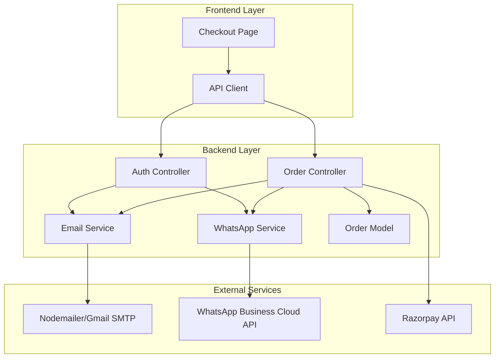
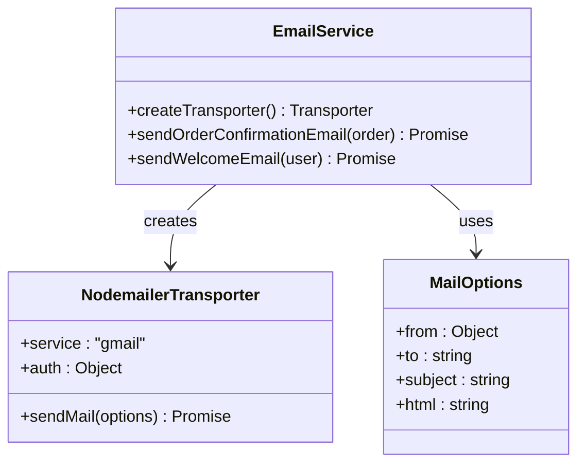
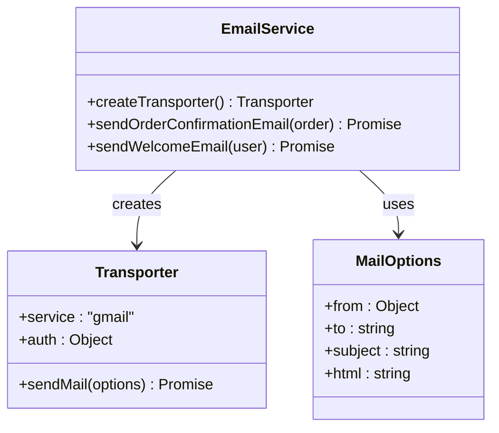
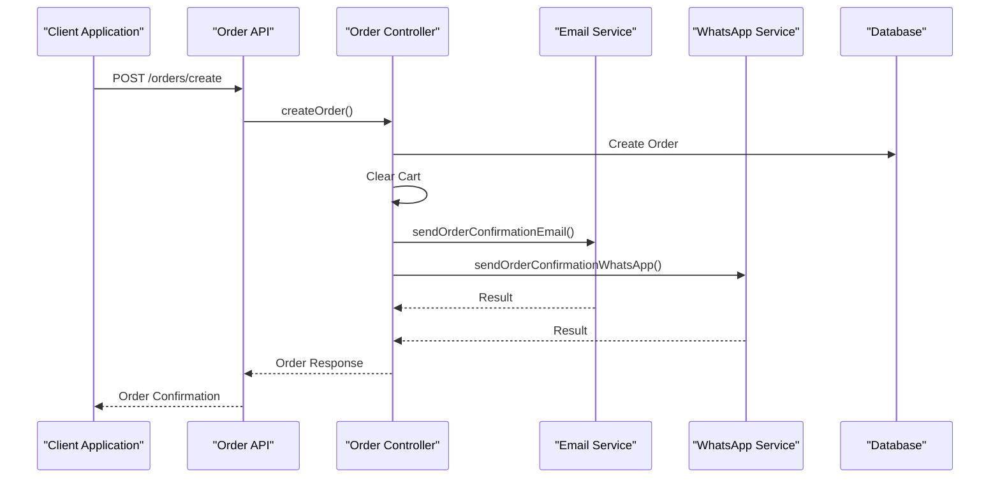
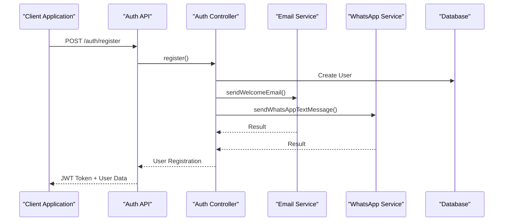
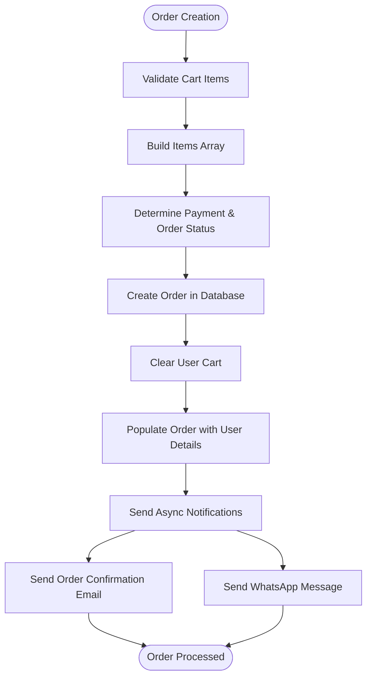
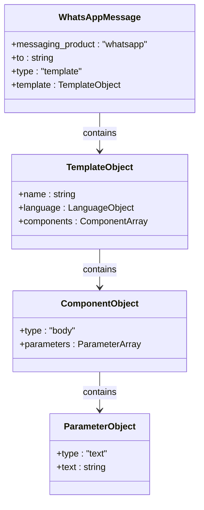
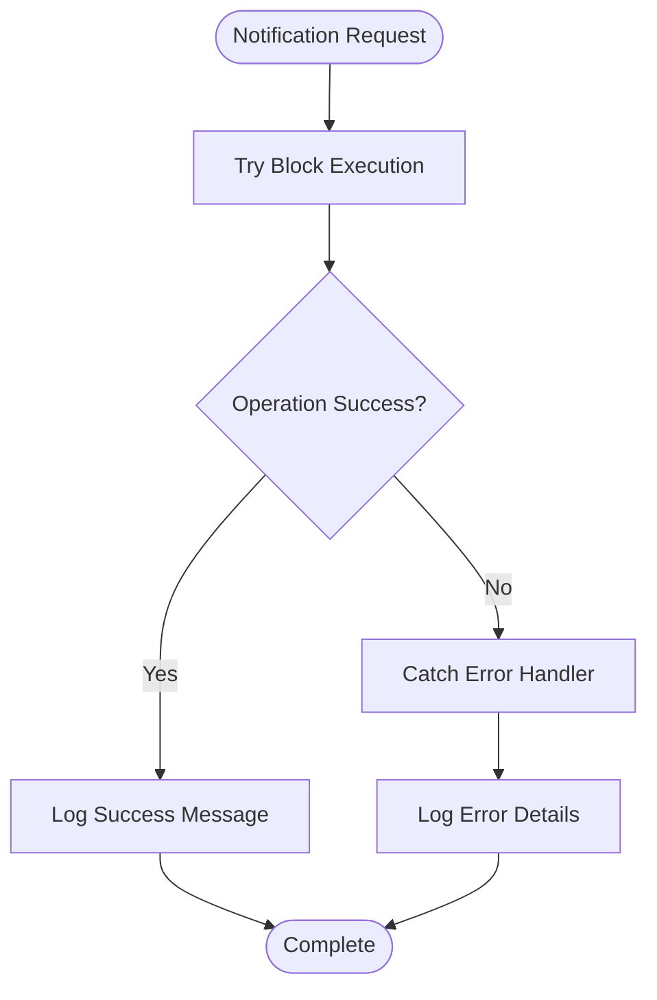

# Email Notification System

<cite>
**Referenced Files in This Document**
- [emailService.js](file://backend/utils/emailService.js)
- [orderController.js](file://backend/controllers/orderController.js)
- [authController.js](file://backend/controllers/authController.js)
- [Order.js](file://backend/models/Order.js)
- [orderRoutes.js](file://backend/routes/orderRoutes.js)
- [authRoutes.js](file://backend/routes/authRoutes.js)
- [server.js](file://backend/server.js)
- [Checkout.jsx](file://frontend/src/pages/Checkout.jsx)
- [api.js](file://frontend/src/services/api.js)
- [whatsappService.js](file://backend/utils/whatsappService.js)
- [package.json](file://backend/package.json)
</cite>

## Update Summary
**Changes Made**
- Updated dependency section to reflect nodemailer installation and configuration
- Enhanced email service implementation details with comprehensive nodemailer integration
- Added package.json dependency verification
- Updated system architecture to show nodemailer as core email transport provider
- Enhanced error handling documentation with nodemailer-specific considerations

## Table of Contents
1. [Introduction](#introduction)
2. [System Architecture](#system-architecture)
3. [Nodemailer Dependency Integration](#nodemailer-dependency-integration)
4. [Email Service Implementation](#email-service-implementation)
5. [Notification Triggers](#notification-triggers)
6. [Order Confirmation Workflow](#order-confirmation-workflow)
7. [Welcome Email Workflow](#welcome-email-workflow)
8. [WhatsApp Integration](#whatsapp-integration)
9. [Configuration Requirements](#configuration-requirements)
10. [Error Handling and Monitoring](#error-handling-and-monitoring)
11. [Security Considerations](#security-considerations)
12. [Troubleshooting Guide](#troubleshooting-guide)
13. [Conclusion](#conclusion)

## Introduction

The Email Notification System is a comprehensive communication framework integrated into the ecommerce application that automatically sends order confirmations and welcome messages to customers. This system leverages Nodemailer for email delivery and integrates with WhatsApp Business Cloud API for dual-channel customer communication.

The system operates asynchronously, ensuring that email notifications don't block the primary order processing flow. It supports multiple payment methods including online payments via Razorpay, Cash on Delivery (COD), and manual UPI payments.

**Updated** The system now utilizes Nodemailer as the primary email transport mechanism, providing robust and reliable email delivery capabilities with comprehensive error handling and monitoring.

## System Architecture

The notification system follows a modular architecture with clear separation of concerns:



**Diagram sources**
- [emailService.js:1-149](file://backend/utils/emailService.js#L1-L149)
- [orderController.js:86-173](file://backend/controllers/orderController.js#L86-L173)
- [authController.js:8-36](file://backend/controllers/authController.js#L8-L36)

## Nodemailer Dependency Integration

The system has been successfully integrated with Nodemailer as the core email transport provider, replacing previous email delivery mechanisms.

### Package Dependencies

The backend includes Nodemailer as a critical dependency:

```json
{
  "dependencies": {
    "nodemailer": "^6.9.7",
    "dotenv": "^16.3.1",
    "express": "^4.18.2",
    "mongoose": "^8.0.0"
  }
}
```

**Section sources**
- [package.json:20](file://backend/package.json#L20)

### Nodemailer Transport Configuration

The system uses a reusable Nodemailer transporter configured for Gmail SMTP:



**Diagram sources**
- [emailService.js:6-15](file://backend/utils/emailService.js#L6-L15)
- [emailService.js:18-109](file://backend/utils/emailService.js#L18-L109)

**Section sources**
- [emailService.js:1-149](file://backend/utils/emailService.js#L1-L149)

## Email Service Implementation

The email service is built around Nodemailer with Gmail SMTP integration, providing professional HTML email templates for both order confirmations and welcome messages.

### Email Transport Configuration

The system uses a reusable transporter configured for Gmail SMTP:



**Diagram sources**
- [emailService.js:6-15](file://backend/utils/emailService.js#L6-L15)
- [emailService.js:18-109](file://backend/utils/emailService.js#L18-L109)

### Order Confirmation Email Template

The order confirmation email template is dynamically generated with comprehensive order details:

Key features of the order confirmation template:
- Professional gradient header with celebratory messaging
- Detailed order breakdown with items, quantities, and pricing
- Delivery address formatting with proper line breaks
- Comprehensive pricing summary with subtotal, shipping, discounts, and totals
- Color-coded payment status indicators
- Responsive design with proper spacing and typography
- Contact information and footer branding

### Welcome Email Template

The welcome email template focuses on customer acquisition and retention:

Key features of the welcome template:
- Personalized greeting with customer name
- Branding with gradient header
- Promotional offer display (WELCOME10 discount code)
- Encouraging call-to-action for shopping
- Clean, professional layout optimized for mobile devices

**Section sources**
- [emailService.js:18-149](file://backend/utils/emailService.js#L18-L149)

## Notification Triggers

The system implements two primary notification triggers based on user actions and order events.

### Order-Based Notifications

Order confirmation notifications are triggered during the order creation process:



**Diagram sources**
- [orderController.js:86-173](file://backend/controllers/orderController.js#L86-L173)
- [orderController.js:144-163](file://backend/controllers/orderController.js#L144-L163)

### User-Based Notifications

Welcome notifications are triggered during user registration:



**Diagram sources**
- [authController.js:8-36](file://backend/controllers/authController.js#L8-L36)
- [authController.js:22-27](file://backend/controllers/authController.js#L22-L27)

**Section sources**
- [orderController.js:86-173](file://backend/controllers/orderController.js#L86-L173)
- [authController.js:8-36](file://backend/controllers/authController.js#L8-L36)

## Order Confirmation Workflow

The order confirmation workflow handles multiple payment methods and ensures comprehensive customer communication.

### Payment Method Integration

The system supports three payment methods with corresponding notification flows:

| Payment Method | Order Status | Payment Status | Notification Trigger |
|---------------|--------------|----------------|---------------------|
| Razorpay Online | Confirmed | Paid | Both Email & WhatsApp |
| Cash on Delivery | Pending | Pending | Both Email & WhatsApp |
| Manual UPI | Pending | Pending | Both Email & WhatsApp |

### Order Data Processing

During order creation, the system processes order data and prepares it for notification:



**Diagram sources**
- [orderController.js:86-173](file://backend/controllers/orderController.js#L86-L173)
- [orderController.js:104-135](file://backend/controllers/orderController.js#L104-L135)

**Section sources**
- [orderController.js:86-173](file://backend/controllers/orderController.js#L86-L173)
- [Order.js:3-31](file://backend/models/Order.js#L3-L31)

## Welcome Email Workflow

The welcome email workflow provides immediate post-registration communication to enhance customer engagement.

### Registration Process Integration

When a new user registers, the system performs the following steps:

1. **User Validation**: Checks for existing email or phone number
2. **User Creation**: Creates new user record in the database
3. **Token Generation**: Issues JWT authentication token
4. **Welcome Email**: Sends personalized welcome email
5. **Welcome WhatsApp**: Sends promotional WhatsApp message

### Email Content Personalization

The welcome email template includes dynamic personalization:
- Customer name in greeting
- Promotional discount code (WELCOME10)
- Call-to-action for first purchase
- Professional brand presentation

**Section sources**
- [authController.js:8-36](file://backend/controllers/authController.js#L8-L36)
- [emailService.js:112-149](file://backend/utils/emailService.js#L112-L149)

## WhatsApp Integration

The system integrates with WhatsApp Business Cloud API for real-time customer communication alongside email notifications.

### WhatsApp Business Cloud API Setup

The WhatsApp integration requires:
- Facebook Business Manager account
- WhatsApp Business Account
- Phone Number ID from Meta
- Access Token for API authentication
- Pre-configured message templates

### Message Templates

The system uses structured message templates for order confirmations:



**Diagram sources**
- [whatsappService.js:57-85](file://backend/utils/whatsappService.js#L57-L85)

### Phone Number Formatting

The system automatically formats phone numbers for Indian market compliance:
- Removes non-numeric characters
- Adds India country code (+91) for 10-digit numbers
- Validates phone number format before sending

**Section sources**
- [whatsappService.js:57-127](file://backend/utils/whatsappService.js#L57-L127)

## Configuration Requirements

### Environment Variables

The system requires several environment variables for proper operation:

**Email Configuration:**
- `EMAIL_USER`: Gmail address for SMTP authentication
- `EMAIL_PASSWORD`: Gmail App Password (not regular password)

**WhatsApp Configuration:**
- `WHATSAPP_PHONE_NUMBER_ID`: WhatsApp Business Phone Number ID
- `WHATSAPP_ACCESS_TOKEN`: Meta Business Platform Access Token

**Payment Configuration:**
- `RAZORPAY_KEY_SECRET`: Razorpay webhook verification secret

**Application Configuration:**
- `JWT_SECRET`: JWT token signing secret
- `MONGO_URI`: MongoDB connection string

### Security Considerations

1. **App Password Requirement**: Gmail requires App Password instead of regular password
2. **Environment Variable Protection**: All sensitive credentials stored in environment variables
3. **Token Management**: Proper JWT token handling and expiration
4. **CORS Configuration**: Strict CORS policy for production deployment

**Section sources**
- [emailService.js:8-15](file://backend/utils/emailService.js#L8-L15)
- [whatsappService.js:14-15](file://backend/utils/whatsappService.js#L14-L15)

## Error Handling and Monitoring

The system implements comprehensive error handling and monitoring for reliable notification delivery.

### Asynchronous Error Handling

All notification attempts use asynchronous error handling to prevent blocking the main request flow:



### Error Logging Strategy

The system logs errors with appropriate context:
- Operation type (email vs. WhatsApp)
- Recipient information (user email/phone)
- Error message details
- Timestamp for troubleshooting

### Nodemailer-Specific Error Handling

The system includes comprehensive error handling for Nodemailer operations:
- SMTP authentication failures
- Email delivery timeouts
- Invalid recipient addresses
- Rate limit exceeded scenarios

### Fallback Mechanisms

The system provides fallback communication channels:
- WhatsApp template fallback to text messages
- Email notifications continue even if WhatsApp fails
- Graceful degradation for partial failures

**Section sources**
- [emailService.js:105-108](file://backend/utils/emailService.js#L105-L108)
- [whatsappService.js:44-54](file://backend/utils/whatsappService.js#L44-L54)

## Security Considerations

### Authentication Security

The notification system maintains security through:
- JWT-based authentication for API access
- Protected routes requiring valid tokens
- Role-based access control for admin functions
- CORS protection for cross-origin requests

### Data Privacy

Customer data handling follows privacy best practices:
- Sensitive order information is properly sanitized
- Phone numbers are formatted and validated
- Email content respects customer preferences
- No PII exposure in error messages

### Production Security

Production deployment includes:
- HTTPS enforcement
- Environment-specific configurations
- Rate limiting for notification requests
- Monitoring and alerting systems

## Troubleshooting Guide

### Common Issues and Solutions

**Email Delivery Issues:**
- Verify Gmail App Password configuration
- Check spam/junk folder for filtered emails
- Ensure recipient email addresses are valid
- Monitor SMTP rate limits

**Nodemailer-Specific Issues:**
- Verify nodemailer dependency installation
- Check Gmail SMTP settings and authentication
- Validate email template syntax and formatting
- Monitor Nodemailer transporter configuration

**WhatsApp Delivery Issues:**
- Verify phone number formatting (India country code)
- Check WhatsApp Business template configuration
- Validate access token permissions
- Review Meta Business Platform status

**Integration Issues:**
- Confirm environment variable setup
- Verify database connectivity
- Check network connectivity to external APIs
- Monitor API response codes

### Debugging Steps

1. **Enable Debug Logging**: Check console output for error messages
2. **Verify Credentials**: Test SMTP and WhatsApp API credentials
3. **Monitor API Responses**: Check response codes and error messages
4. **Validate Data Formats**: Ensure order and user data structures are correct
5. **Test Individual Components**: Isolate email vs. WhatsApp functionality

**Section sources**
- [emailService.js:105-108](file://backend/utils/emailService.js#L105-L108)
- [whatsappService.js:44-54](file://backend/utils/whatsappService.js#L44-L54)

## Conclusion

The Email Notification System provides a robust, scalable solution for customer communication in the ecommerce platform. By leveraging asynchronous processing, dual-channel communication (email + WhatsApp), and comprehensive error handling, the system ensures reliable customer notifications across all payment methods.

**Updated** The integration of Nodemailer as the core email transport mechanism significantly enhances the system's reliability and performance. The comprehensive error handling, monitoring capabilities, and professional HTML email templates provide a solid foundation for order confirmations, shipping updates, and customer communication features.

Key strengths of the implementation include:
- Modular design with clear separation of concerns
- Asynchronous notification processing preventing request blocking
- Professional HTML email templates with responsive design
- Comprehensive error handling and logging
- Dual-channel communication support
- Security-conscious implementation with proper credential management
- Nodemailer dependency integration for reliable email delivery

The system successfully integrates with the existing order processing workflow while maintaining high availability and reliability standards essential for customer satisfaction in e-commerce environments.