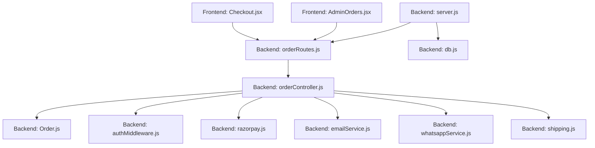
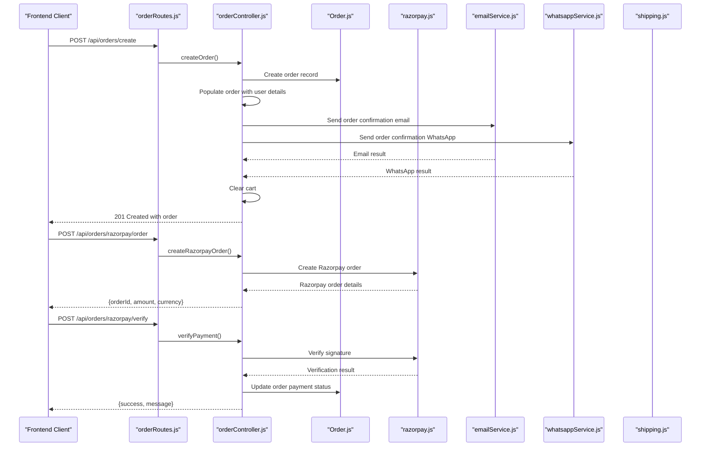
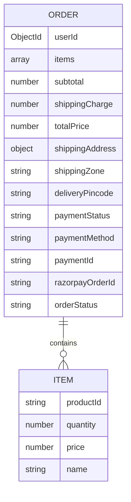
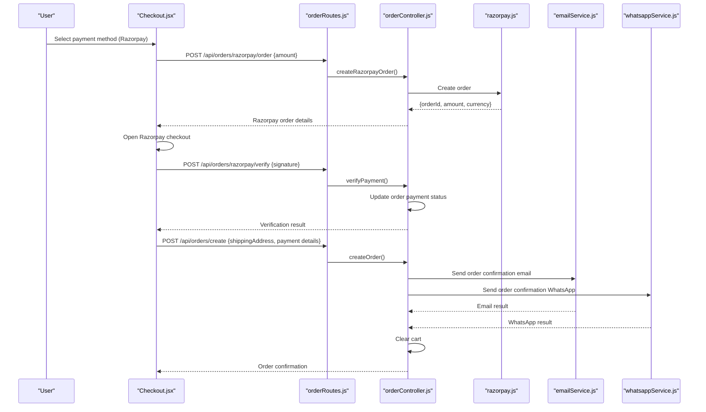
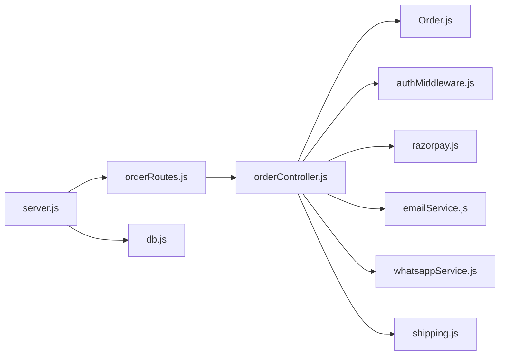

# Order Processing API

<cite>
**Referenced Files in This Document**
- [orderController.js](file://backend/controllers/orderController.js)
- [orderRoutes.js](file://backend/routes/orderRoutes.js)
- [emailService.js](file://backend/utils/emailService.js)
- [whatsappService.js](file://backend/utils/whatsappService.js)
- [razorpay.js](file://backend/utils/razorpay.js)
- [Order.js](file://backend/models/Order.js)
- [User.js](file://backend/models/User.js)
- [authMiddleware.js](file://backend/middleware/authMiddleware.js)
- [Checkout.jsx](file://frontend/src/pages/Checkout.jsx)
- [AdminOrders.jsx](file://frontend/src/components/admin/AdminOrders.jsx)
- [OrderConfirmation.jsx](file://frontend/src/pages/OrderConfirmation.jsx)
- [shipping.js](file://backend/config/shipping.js)
- [server.js](file://backend/server.js)
- [db.js](file://backend/config/db.js)
</cite>

## Update Summary
**Changes Made**
- Added asynchronous order confirmation notification system via email and WhatsApp
- Enhanced order details population with user information for notifications
- Implemented comprehensive error handling for notification failures
- Updated order creation workflow to include notification dispatch

## Table of Contents
1. [Introduction](#introduction)
2. [Project Structure](#project-structure)
3. [Core Components](#core-components)
4. [Architecture Overview](#architecture-overview)
5. [Detailed Component Analysis](#detailed-component-analysis)
6. [Notification System](#notification-system)
7. [Dependency Analysis](#dependency-analysis)
8. [Performance Considerations](#performance-considerations)
9. [Troubleshooting Guide](#troubleshooting-guide)
10. [Conclusion](#conclusion)

## Introduction
This document provides comprehensive API documentation for the Order Processing system, covering order placement, payment processing via Razorpay, order retrieval, and administrative order management. The system now includes asynchronous order confirmation notifications via email and WhatsApp, enhanced order details population with user information, and comprehensive error handling for notification failures. It also outlines the complete order workflow including address validation, cart checkout, payment initiation, order confirmation, inventory deduction, and error handling for payment failures. Integration points with shipping systems and administrative controls are documented to support end-to-end order lifecycle management.

## Project Structure
The Order Processing API spans backend controllers, routes, middleware, models, and frontend pages that orchestrate the user experience. The backend exposes REST endpoints under `/api/orders`, while the frontend components manage user interactions for checkout, payment, and order confirmation. The system now includes notification utilities for email and WhatsApp services.

**Diagram sources**
- [orderRoutes.js:1-28](file://backend/routes/orderRoutes.js#L1-L28)
- [orderController.js:1-173](file://backend/controllers/orderController.js#L1-L173)
- [Order.js:1-33](file://backend/models/Order.js#L1-L33)
- [authMiddleware.js:1-20](file://backend/middleware/authMiddleware.js#L1-L20)
- [razorpay.js:1-10](file://backend/utils/razorpay.js#L1-L10)
- [emailService.js:1-149](file://backend/utils/emailService.js#L1-L149)
- [whatsappService.js:1-127](file://backend/utils/whatsappService.js#L1-L127)
- [shipping.js:1-73](file://backend/config/shipping.js#L1-L73)
- [server.js:1-102](file://backend/server.js#L1-L102)
- [db.js:1-14](file://backend/config/db.js#L1-L14)

**Section sources**
- [orderRoutes.js:1-28](file://backend/routes/orderRoutes.js#L1-L28)
- [server.js:57-63](file://backend/server.js#L57-L63)

## Core Components
- Order Controller: Implements order creation, retrieval, Razorpay order creation and verification, and admin order status updates. Now includes asynchronous notification dispatch.
- Order Model: Defines the schema for orders, including items, pricing breakdown, shipping details, payment metadata, and order tracking.
- Authentication Middleware: Protects routes and enforces admin-only access for administrative endpoints.
- Razorpay Utility: Initializes the Razorpay client using environment variables.
- Email Service: Handles order confirmation email notifications with HTML templates.
- WhatsApp Service: Manages order confirmation WhatsApp notifications via Business Cloud API.
- Shipping Configuration: Provides shipping zone calculation and free shipping thresholds.
- Frontend Pages: Manage checkout, payment, and order confirmation flows.

**Section sources**
- [orderController.js:1-173](file://backend/controllers/orderController.js#L1-L173)
- [Order.js:1-33](file://backend/models/Order.js#L1-L33)
- [authMiddleware.js:1-20](file://backend/middleware/authMiddleware.js#L1-L20)
- [razorpay.js:1-10](file://backend/utils/razorpay.js#L1-L10)
- [emailService.js:1-149](file://backend/utils/emailService.js#L1-L149)
- [whatsappService.js:1-127](file://backend/utils/whatsappService.js#L1-L127)
- [shipping.js:1-73](file://backend/config/shipping.js#L1-L73)

## Architecture Overview
The Order Processing API follows a layered architecture with enhanced notification capabilities:
- Presentation Layer: Frontend pages handle user interactions for checkout and order management.
- Application Layer: Express routes delegate to controller functions for business logic.
- Domain Layer: Controllers coordinate with models, middleware, and external services (Razorpay, email, WhatsApp).
- Persistence Layer: Mongoose models define schemas stored in MongoDB.
- External Integrations: Razorpay for payments, Nodemailer for emails, and WhatsApp Business Cloud API for notifications.

**Diagram sources**
- [orderRoutes.js:15-26](file://backend/routes/orderRoutes.js#L15-L26)
- [orderController.js:86-173](file://backend/controllers/orderController.js#L86-L173)
- [Order.js:1-33](file://backend/models/Order.js#L1-L33)
- [razorpay.js:1-10](file://backend/utils/razorpay.js#L1-L10)
- [emailService.js:17-109](file://backend/utils/emailService.js#L17-L109)
- [whatsappService.js:57-85](file://backend/utils/whatsappService.js#L57-L85)

## Detailed Component Analysis

### POST /api/orders/create
Purpose: Place an order using either Cash on Delivery (COD), Razorpay, or manual UPI. Validates cart presence, constructs order items, determines payment and order statuses, clears the cart upon successful order creation, and dispatches asynchronous notifications.

Key Behaviors:
- Validates that the cart is not empty.
- Builds itemized order details from the cart.
- Supports payment methods: razorpay, cod, upi.
- Determines final payment and order statuses based on payment method and status flags.
- Persists order with subtotal, shipping charge, total price, shipping address, and payment metadata.
- Clears the cart after successful order creation.
- **Enhanced**: Populates order with user details for notification purposes.
- **Enhanced**: Asynchronously sends order confirmation notifications via email and WhatsApp.

Request Body Fields:
- shippingAddress: Object containing fullName, phone, address, city, state, pincode, country.
- paymentId: Optional payment identifier (e.g., UPI transaction ID).
- paymentStatus: Optional payment status (e.g., pending, paid).
- razorpayOrderId: Optional Razorpay order identifier.
- paymentMethod: String, default razorpay; supports razorpay, cod, upi.
- shippingCharge: Number, optional override for shipping cost.
- shippingZone: String, optional shipping zone label.
- subtotal: Number, optional override for items total.
- total: Number, optional override for final total.

Response:
- 201 Created with order details and a success message indicating payment method outcome.
- 400 Bad Request if cart is empty.
- 500 Internal Server Error on failure.

Frontend Integration:
- Checkout page handles COD, online payment, and manual UPI flows and posts to this endpoint.

**Updated** Enhanced with asynchronous notification dispatch and user information population

**Section sources**
- [orderController.js:86-173](file://backend/controllers/orderController.js#L86-L173)
- [Checkout.jsx:67-86](file://frontend/src/pages/Checkout.jsx#L67-L86)
- [Checkout.jsx:88-137](file://frontend/src/pages/Checkout.jsx#L88-L137)
- [Checkout.jsx:139-165](file://frontend/src/pages/Checkout.jsx#L139-L165)

### GET /api/orders/my
Purpose: Retrieve the authenticated user's order history, sorted by most recent creation date.

Behavior:
- Filters orders by userId from JWT.
- Returns all orders for the current user.

Response:
- 200 OK with an array of orders.
- 500 Internal Server Error on failure.

**Section sources**
- [orderController.js:22-30](file://backend/controllers/orderController.js#L22-L30)

### GET /api/orders/:orderId
Purpose: Retrieve a specific order by ID with access control for owners and admins.

Behavior:
- Requires authentication and authorization checks.
- Returns the order if the requester is the owner or an admin.
- Returns 404 if order does not exist.
- Returns 403 for unauthorized access.

Response:
- 200 OK with order details.
- 404 Not Found if order missing.
- 403 Forbidden for unauthorized access.
- 500 Internal Server Error on failure.

**Section sources**
- [orderController.js:10-20](file://backend/controllers/orderController.js#L10-L20)

### POST /api/orders/razorpay/order
Purpose: Create a Razorpay order for payment capture.

Behavior:
- Accepts amount in rupees and converts to paise for Razorpay.
- Creates a Razorpay order with currency INR and payment_capture set to 1.
- Returns orderId, amount, and currency.

Response:
- 200 OK with Razorpay order details.
- 500 Internal Server Error on failure.

**Section sources**
- [orderController.js:42-53](file://backend/controllers/orderController.js#L42-L53)

### POST /api/orders/razorpay/verify
Purpose: Verify Razorpay payment signature and update order payment status.

Behavior:
- Receives razorpay_order_id, razorpay_payment_id, and razorpay_signature.
- Recreates HMAC-SHA256 signature using the configured secret.
- On successful verification, marks order as paid and updates orderStatus to Confirmed.
- Returns success or failure messages accordingly.

Response:
- 200 OK with success flag and message on verification success.
- 400 Bad Request with failure message on invalid signature.
- 500 Internal Server Error on failure.

Frontend Integration:
- Frontend opens Razorpay checkout, collects response, verifies signature, then posts to create order.

**Section sources**
- [orderController.js:55-70](file://backend/controllers/orderController.js#L55-L70)
- [Checkout.jsx:101-122](file://frontend/src/pages/Checkout.jsx#L101-L122)

### PUT /api/orders/:orderId/status (Admin)
Purpose: Update order status by admin users.

Behavior:
- Validates status against allowed values: Pending, Shipped, Delivered, Cancelled.
- Updates orderStatus and returns the updated order with a success message.
- Returns 400 Bad Request for invalid status.
- Returns 404 Not Found if order does not exist.
- Enforces admin-only access.

Response:
- 200 OK with message and updated order.
- 400 Bad Request for invalid status.
- 404 Not Found if order missing.
- 403 Forbidden for non-admin access.
- 500 Internal Server Error on failure.

Frontend Integration:
- Admin dashboard allows changing order status with immediate UI feedback.

**Section sources**
- [orderController.js:72-84](file://backend/controllers/orderController.js#L72-L84)
- [AdminOrders.jsx:26-34](file://frontend/src/components/admin/AdminOrders.jsx#L26-L34)

### Order Data Model
The Order model defines the structure persisted in MongoDB, including:
- Items: productId, quantity, price, name.
- Pricing: subtotal, shippingCharge, totalPrice.
- Shipping: shippingAddress, shippingZone, deliveryPincode.
- Payment: paymentStatus, paymentMethod, paymentId, razorpayOrderId.
- Tracking: orderStatus with default Pending.

**Diagram sources**
- [Order.js:3-31](file://backend/models/Order.js#L3-L31)

**Section sources**
- [Order.js:1-33](file://backend/models/Order.js#L1-L33)

### Authentication and Authorization
- protect middleware validates JWT and attaches user to request.
- admin middleware restricts access to admin users only.
- Order retrieval endpoints enforce ownership or admin privileges.

**Section sources**
- [authMiddleware.js:4-20](file://backend/middleware/authMiddleware.js#L4-L20)

### Shipping Integration
- Shipping zones are calculated based on delivery pincode with thresholds for free shipping.
- The system supports Local, State, and National zones with associated charges and estimated delivery days.
- Frontend passes shippingZone and shippingCharge to the order creation endpoint.

**Section sources**
- [shipping.js:1-73](file://backend/config/shipping.js#L1-L73)
- [Checkout.jsx:57-61](file://frontend/src/pages/Checkout.jsx#L57-L61)

### Frontend Workflows

#### Complete Order Placement Workflow (Razorpay)

**Diagram sources**
- [Checkout.jsx:88-137](file://frontend/src/pages/Checkout.jsx#L88-L137)
- [orderRoutes.js:20-22](file://backend/routes/orderRoutes.js#L20-L22)
- [orderController.js:42-70](file://backend/controllers/orderController.js#L42-L70)
- [emailService.js:17-109](file://backend/utils/emailService.js#L17-L109)
- [whatsappService.js:57-85](file://backend/utils/whatsappService.js#L57-L85)

#### Order Confirmation Page
- Displays order ID, total amount, and basic order details after successful placement.

**Section sources**
- [OrderConfirmation.jsx:16-36](file://frontend/src/pages/OrderConfirmation.jsx#L16-L36)

#### Admin Order Management
- Fetches all orders, filters by status, displays order details, and updates status.

**Section sources**
- [AdminOrders.jsx:15-34](file://frontend/src/components/admin/AdminOrders.jsx#L15-L34)
- [AdminOrders.jsx:67-73](file://frontend/src/components/admin/AdminOrders.jsx#L67-L73)
- [AdminOrders.jsx:174-191](file://frontend/src/components/admin/AdminOrders.jsx#L174-L191)

## Notification System

### Asynchronous Order Confirmation Notifications
The system now implements asynchronous order confirmation notifications via both email and WhatsApp to enhance customer experience and provide real-time order updates.

#### Email Notifications
- **Service**: Nodemailer with Gmail SMTP
- **Template**: Rich HTML email with order details, items ordered, delivery address, and pricing breakdown
- **Trigger**: Asynchronously sent after successful order creation
- **Error Handling**: Comprehensive error logging with success/failure indicators
- **Content**: Order confirmation with payment status, shipping details, and tracking information

#### WhatsApp Notifications
- **Service**: WhatsApp Business Cloud API
- **Template**: Pre-configured template "order_confirmation" with dynamic parameters
- **Fallback**: Text message support if template is not configured
- **Trigger**: Asynchronously sent after successful order creation
- **Error Handling**: Phone number validation and comprehensive error logging
- **Parameters**: Customer name, order ID (last 6 digits), total amount, order date

#### Notification Dispatch Logic
- **Population**: Order details are populated with user information (name, email, phone) before sending notifications
- **Asynchronous**: Notifications are sent asynchronously to avoid blocking the order creation response
- **Error Isolation**: Individual notification failures don't affect order creation success
- **Logging**: Success and failure logs are maintained for monitoring and debugging

**Section sources**
- [orderController.js:141-163](file://backend/controllers/orderController.js#L141-L163)
- [emailService.js:17-109](file://backend/utils/emailService.js#L17-L109)
- [whatsappService.js:57-85](file://backend/utils/whatsappService.js#L57-L85)

## Dependency Analysis
The Order Processing API depends on:
- Express routes for endpoint exposure.
- Authentication middleware for request protection.
- Order controller for business logic.
- Order model for persistence.
- Razorpay utility for payment processing.
- Email service for order confirmation emails.
- WhatsApp service for order confirmation notifications.
- Shipping configuration for logistics integration.

**Diagram sources**
- [orderRoutes.js:1-28](file://backend/routes/orderRoutes.js#L1-L28)
- [orderController.js:1-173](file://backend/controllers/orderController.js#L1-L173)
- [authMiddleware.js:1-20](file://backend/middleware/authMiddleware.js#L1-L20)
- [razorpay.js:1-10](file://backend/utils/razorpay.js#L1-L10)
- [emailService.js:1-149](file://backend/utils/emailService.js#L1-L149)
- [whatsappService.js:1-127](file://backend/utils/whatsappService.js#L1-L127)
- [shipping.js:1-73](file://backend/config/shipping.js#L1-L73)
- [server.js:57-63](file://backend/server.js#L57-L63)
- [db.js:1-14](file://backend/config/db.js#L1-L14)

**Section sources**
- [orderRoutes.js:1-28](file://backend/routes/orderRoutes.js#L1-L28)
- [server.js:57-63](file://backend/server.js#L57-L63)

## Performance Considerations
- Minimize database queries by using lean() where appropriate for read-heavy endpoints.
- Batch cart population and order population to reduce round trips.
- Cache frequently accessed shipping zone configurations if scale demands.
- Use pagination for admin order listing when order volume grows.
- **Enhanced**: Asynchronous notification dispatch prevents blocking order creation responses.
- **Enhanced**: Notification errors are isolated and don't impact core order processing performance.

## Troubleshooting Guide
Common Issues and Resolutions:
- Empty Cart Error: Ensure cart exists and contains items before placing an order.
- Payment Verification Failure: Confirm Razorpay signature verification and environment secrets.
- Access Denied: Verify JWT validity and admin role for admin-only endpoints.
- Invalid Status Update: Ensure status is one of Pending, Shipped, Delivered, Cancelled.
- Shipping Calculation Mismatch: Validate pincode format and ensure shipping zone logic aligns with delivery location.
- **New**: Notification Failures: Check email service credentials, WhatsApp API configuration, and phone number formats.
- **New**: Asynchronous Processing: Monitor console logs for notification success/failure messages.

**Section sources**
- [orderController.js:98-99](file://backend/controllers/orderController.js#L98-L99)
- [orderController.js:58-62](file://backend/controllers/orderController.js#L58-L62)
- [authMiddleware.js:6-14](file://backend/middleware/authMiddleware.js#L6-L14)
- [orderController.js:73-74](file://backend/controllers/orderController.js#L73-L74)

## Conclusion
The Order Processing API provides a robust foundation for order placement, payment handling via Razorpay, order retrieval, and administrative oversight. The enhanced system now includes asynchronous order confirmation notifications via email and WhatsApp, comprehensive error handling for notification failures, and improved order details population with user information. By leveraging the documented endpoints, integrating shipping zone logic, implementing the notification system, and following the outlined workflows, developers can implement reliable order management with clear error handling, user-friendly frontend experiences, and comprehensive customer communication.