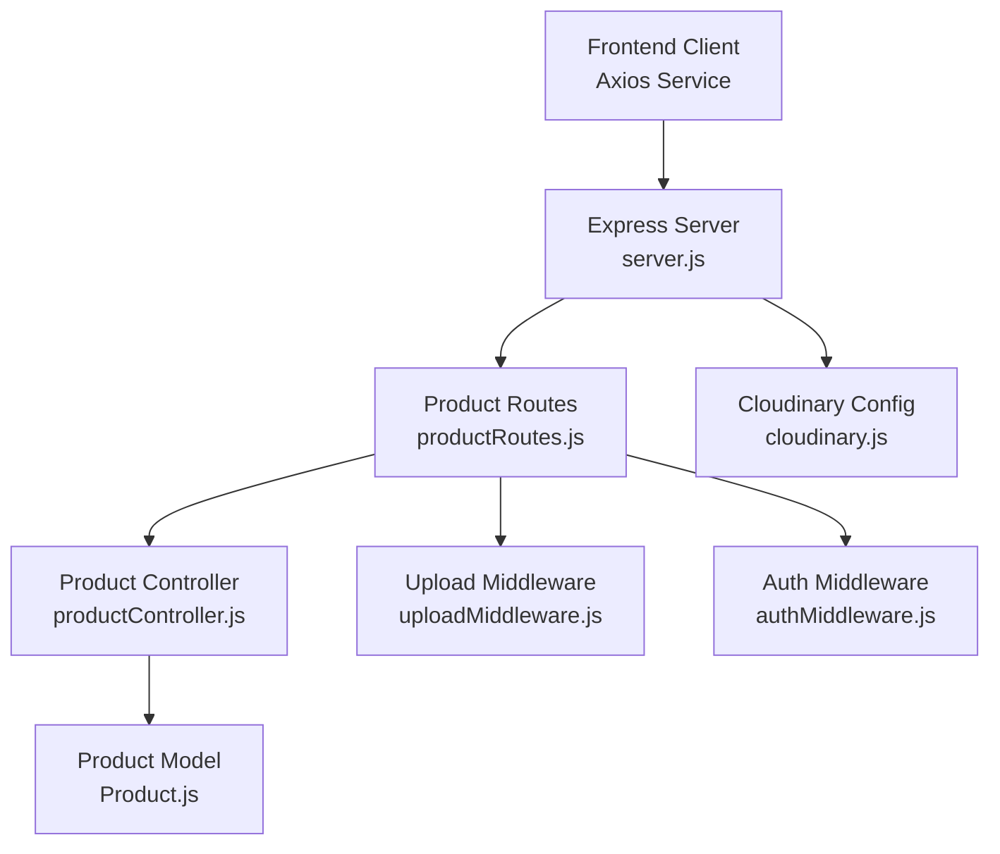
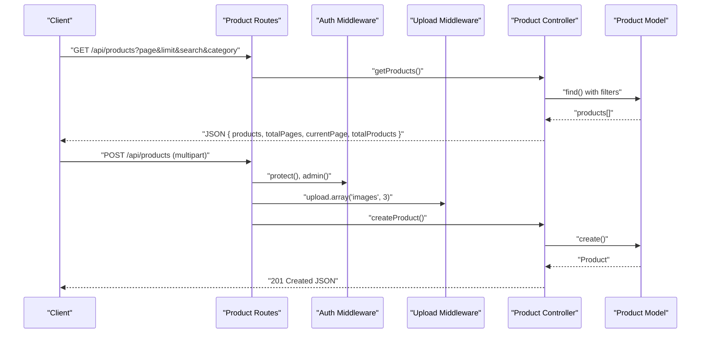
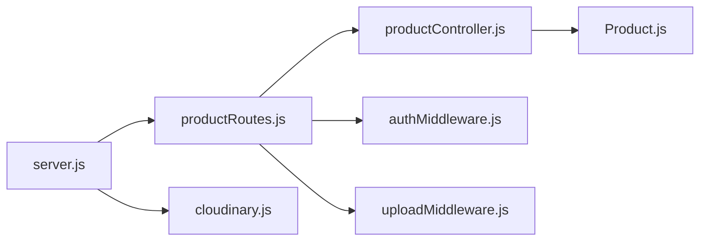

# Product Management API

<cite>
**Referenced Files in This Document**
- [server.js](file://backend/server.js)
- [productRoutes.js](file://backend/routes/productRoutes.js)
- [productController.js](file://backend/controllers/productController.js)
- [Product.js](file://backend/models/Product.js)
- [uploadMiddleware.js](file://backend/middleware/uploadMiddleware.js)
- [authMiddleware.js](file://backend/middleware/authMiddleware.js)
- [cloudinary.js](file://backend/config/cloudinary.js)
- [api.js](file://frontend/src/services/api.js)
</cite>

## Table of Contents
1. [Introduction](#introduction)
2. [Project Structure](#project-structure)
3. [Core Components](#core-components)
4. [Architecture Overview](#architecture-overview)
5. [Detailed Component Analysis](#detailed-component-analysis)
6. [Dependency Analysis](#dependency-analysis)
7. [Performance Considerations](#performance-considerations)
8. [Troubleshooting Guide](#troubleshooting-guide)
9. [Conclusion](#conclusion)
10. [Appendices](#appendices)

## Introduction
This document provides comprehensive API documentation for the Product Management endpoints. It covers request and response schemas, validation rules, image upload handling, and error responses. It also includes examples for product creation with Cloudinary integration, filtering queries, and bulk operations.

## Project Structure
The Product Management API is implemented under the backend server with dedicated controller, route, model, middleware, and configuration modules. The frontend client integrates with the API via an Axios service that injects authentication tokens.

**Diagram sources**
- [server.js:57-63](file://backend/server.js#L57-L63)
- [productRoutes.js:12-21](file://backend/routes/productRoutes.js#L12-L21)
- [productController.js:1-127](file://backend/controllers/productController.js#L1-L127)
- [Product.js:1-12](file://backend/models/Product.js#L1-L12)
- [uploadMiddleware.js:1-30](file://backend/middleware/uploadMiddleware.js#L1-L30)
- [authMiddleware.js:1-20](file://backend/middleware/authMiddleware.js#L1-L20)
- [cloudinary.js:1-13](file://backend/config/cloudinary.js#L1-L13)

**Section sources**
- [server.js:57-63](file://backend/server.js#L57-L63)
- [productRoutes.js:12-21](file://backend/routes/productRoutes.js#L12-L21)

## Core Components
- Product Routes: Define GET /api/products, GET /api/products/:id, POST /api/products, PUT /api/products/:id, and DELETE /api/products/:id. Apply authentication and admin protection, and configure image upload limits.
- Product Controller: Implements product listing with search and filters, pagination, single product retrieval, creation with image handling, updates with image management, and deletion.
- Product Model: Defines required fields (name, description, price, category, stock), optional images array, and timestamps.
- Upload Middleware: Handles local disk storage, file size limits, and allowed MIME types.
- Auth Middleware: Enforces JWT-based authentication and admin role checks.
- Cloudinary Config: Provides Cloudinary SDK configuration for image hosting.

**Section sources**
- [productRoutes.js:12-21](file://backend/routes/productRoutes.js#L12-L21)
- [productController.js:1-127](file://backend/controllers/productController.js#L1-L127)
- [Product.js:1-12](file://backend/models/Product.js#L1-L12)
- [uploadMiddleware.js:1-30](file://backend/middleware/uploadMiddleware.js#L1-L30)
- [authMiddleware.js:1-20](file://backend/middleware/authMiddleware.js#L1-L20)
- [cloudinary.js:1-13](file://backend/config/cloudinary.js#L1-L13)

## Architecture Overview
The API follows a layered architecture:
- HTTP Layer: Express routes define endpoint contracts.
- Authentication Layer: JWT verification and admin role enforcement.
- Upload Layer: Multer-based local storage for images.
- Business Logic Layer: Product controller orchestrates data access and validation.
- Data Access Layer: Mongoose model persists products to MongoDB.

**Diagram sources**
- [productRoutes.js:14-21](file://backend/routes/productRoutes.js#L14-L21)
- [authMiddleware.js:4-20](file://backend/middleware/authMiddleware.js#L4-L20)
- [uploadMiddleware.js:14-28](file://backend/middleware/uploadMiddleware.js#L14-L28)
- [productController.js:4-37](file://backend/controllers/productController.js#L4-L37)
- [Product.js:3-10](file://backend/models/Product.js#L3-L10)

## Detailed Component Analysis

### Endpoint Definitions

#### GET /api/products
- Purpose: Retrieve paginated product listings with optional search and category filtering.
- Authentication: Not protected (public).
- Query Parameters:
  - search: Text to match against name or description (case-insensitive).
  - category: Category slug; excludes results when value equals "all".
  - page: Page number (default: 1).
  - limit: Results per page (default: 12).
- Response Schema:
  - products: Array of product objects.
  - totalPages: Integer.
  - currentPage: Integer.
  - totalProducts: Integer.
- Validation Rules:
  - Filters are applied conditionally based on presence of query parameters.
  - Sorting is by createdAt descending.
- Error Responses:
  - 500 Internal Server Error on server-side failures.

Example Request
- GET /api/products?page=1&limit=12&search=laptop&category=electronics

Response Example
- {
  "products": [...],
  "totalPages": 5,
  "currentPage": 1,
  "totalProducts": 60
}

**Section sources**
- [productController.js:4-37](file://backend/controllers/productController.js#L4-L37)

#### GET /api/products/:id
- Purpose: Retrieve a single product by ID.
- Authentication: Not protected (public).
- Path Parameter:
  - id: ObjectId string.
- Response:
  - Product object if found.
- Error Responses:
  - 404 Not Found if product does not exist.
  - 500 Internal Server Error on server-side failures.

Example Request
- GET /api/products/64f3a2b1c1234567890abcdef

**Section sources**
- [productController.js:39-49](file://backend/controllers/productController.js#L39-L49)

#### POST /api/products
- Purpose: Create a new product with support for multiple image uploads.
- Authentication: Protected and requires admin role.
- Authorization Headers:
  - Authorization: Bearer <JWT>.
- Request Body (multipart/form-data):
  - Fields: name, description, price, category, stock.
  - Files: images (up to 3 files).
- Upload Handling:
  - Local disk storage configured by upload middleware.
  - Allowed types: jpg, jpeg, png, webp.
  - Max file size: 5 MB.
  - Maximum 3 images accepted; excess files are ignored.
- Response:
  - 201 Created with the created product object.
- Validation Rules:
  - All fields required by the Product model.
  - price and stock converted to numbers.
  - images stored as absolute URLs under /uploads.
- Error Responses:
  - 401 Unauthorized if missing/invalid token.
  - 403 Access Denied if user is not admin.
  - 400 Bad Request for invalid data or upload errors.
  - 500 Internal Server Error on server-side failures.

Example Request (curl)
- curl -X POST http://localhost:5000/api/products \
  -H "Authorization: Bearer <JWT>" \
  -F "name=Laptop" \
  -F "description=High-performance laptop" \
  -F "price=1200" \
  -F "category=electronics" \
  -F "stock=10" \
  -F "images=@image1.png" \
  -F "images=@image2.webp"

Response Example
- {
  "_id": "64f3a2b1c1234567890abcdef",
  "name": "Laptop",
  "description": "High-performance laptop",
  "price": 1200,
  "category": "electronics",
  "stock": 10,
  "images": ["/uploads/timestamp-filename.png", "/uploads/timestamp-filename.webp"],
  "createdAt": "2023-09-09T12:00:00Z",
  "updatedAt": "2023-09-09T12:00:00Z"
}

**Section sources**
- [productRoutes.js:18-21](file://backend/routes/productRoutes.js#L18-L21)
- [authMiddleware.js:4-20](file://backend/middleware/authMiddleware.js#L4-L20)
- [uploadMiddleware.js:14-28](file://backend/middleware/uploadMiddleware.js#L14-L28)
- [productController.js:51-73](file://backend/controllers/productController.js#L51-L73)
- [Product.js:3-10](file://backend/models/Product.js#L3-L10)

#### PUT /api/products/:id
- Purpose: Update an existing product and optionally add new images.
- Authentication: Protected and requires admin role.
- Authorization Headers:
  - Authorization: Bearer <JWT>.
- Path Parameter:
  - id: ObjectId string.
- Request Body (multipart/form-data):
  - Fields: name, description, price, category, stock, images (existing array).
  - Files: images (additional images up to 3 total).
- Behavior:
  - Starts with existing images or empty array.
  - Appends new uploads if provided.
  - Limits total images to 3.
  - Converts price and stock to numbers.
- Response:
  - Updated product object.
- Error Responses:
  - 404 Not Found if product does not exist.
  - 401 Unauthorized if missing/invalid token.
  - 403 Access Denied if user is not admin.
  - 500 Internal Server Error on server-side failures.

Example Request (curl)
- curl -X PUT http://localhost:5000/api/products/64f3a2b1c1234567890abcdef \
  -H "Authorization: Bearer <JWT>" \
  -F "name=Gaming Laptop" \
  -F "price=1300" \
  -F "stock=5" \
  -F "images=@newImage.png"

**Section sources**
- [productRoutes.js:18-21](file://backend/routes/productRoutes.js#L18-L21)
- [authMiddleware.js:4-20](file://backend/middleware/authMiddleware.js#L4-L20)
- [uploadMiddleware.js:14-28](file://backend/middleware/uploadMiddleware.js#L14-L28)
- [productController.js:75-113](file://backend/controllers/productController.js#L75-L113)

#### DELETE /api/products/:id
- Purpose: Remove a product by ID.
- Authentication: Protected and requires admin role.
- Authorization Headers:
  - Authorization: Bearer <JWT>.
- Path Parameter:
  - id: ObjectId string.
- Response:
  - Success message upon deletion.
- Error Responses:
  - 404 Not Found if product does not exist.
  - 401 Unauthorized if missing/invalid token.
  - 403 Access Denied if user is not admin.
  - 500 Internal Server Error on server-side failures.

Example Request (curl)
- curl -X DELETE http://localhost:5000/api/products/64f3a2b1c1234567890abcdef \
  -H "Authorization: Bearer <JWT>"

**Section sources**
- [productRoutes.js:18-21](file://backend/routes/productRoutes.js#L18-L21)
- [authMiddleware.js:4-20](file://backend/middleware/authMiddleware.js#L4-L20)
- [productController.js:115-127](file://backend/controllers/productController.js#L115-L127)

### Request and Response Schemas

#### Product Model Schema
- name: String (required)
- description: String (required)
- price: Number (required)
- images: [String] (optional)
- category: String (required)
- stock: Number (required, default: 0)
- timestamps: createdAt, updatedAt

**Section sources**
- [Product.js:3-10](file://backend/models/Product.js#L3-L10)

#### GET /api/products Response
- products: Array of Product objects
- totalPages: Integer
- currentPage: Integer
- totalProducts: Integer

**Section sources**
- [productController.js:27-32](file://backend/controllers/productController.js#L27-L32)

### Validation Rules
- Required Fields: name, description, price, category, stock.
- Type Conversions: price and stock converted to numbers.
- Image Constraints: Up to 3 images; allowed types jpg, jpeg, png, webp; max size 5 MB.
- Pagination Defaults: page=1, limit=12.

**Section sources**
- [Product.js:3-10](file://backend/models/Product.js#L3-L10)
- [uploadMiddleware.js:14-28](file://backend/middleware/uploadMiddleware.js#L14-L28)
- [productController.js:6-23](file://backend/controllers/productController.js#L6-L23)

### Image Upload Handling
- Storage: Local disk under uploads/.
- URL Format: /uploads/<filename>.
- Limits: 3 files maximum; enforced in controller logic.
- File Types: jpg, jpeg, png, webp.
- Size Limit: 5 MB.

Note: Cloudinary SDK is configured but not currently used for product image uploads in the controller. See Cloudinary configuration for future migration.

**Section sources**
- [uploadMiddleware.js:4-28](file://backend/middleware/uploadMiddleware.js#L4-L28)
- [productController.js:56-93](file://backend/controllers/productController.js#L56-L93)
- [cloudinary.js:1-13](file://backend/config/cloudinary.js#L1-L13)

### Authentication and Authorization
- Authentication: JWT token extracted from Authorization header; verified using JWT secret.
- Authorization: Admin role required for product creation, updates, and deletion.
- Error Codes:
  - 401 Unauthorized for missing/invalid token.
  - 403 Access Denied for non-admin users.

**Section sources**
- [authMiddleware.js:4-20](file://backend/middleware/authMiddleware.js#L4-L20)
- [productRoutes.js:18-21](file://backend/routes/productRoutes.js#L18-L21)

### Filtering and Search Queries
- Search: Case-insensitive regex match on name or description.
- Category: Exact match on category field; "all" excludes category filter.
- Pagination: Computed using skip and limit; total count used for totalPages.

**Section sources**
- [productController.js:6-32](file://backend/controllers/productController.js#L6-L32)

### Bulk Operations
- Supported via standard pagination and filtering:
  - Use GET /api/products with page and limit to iterate through results.
  - Combine with category and search to narrow selections.
- Image Management:
  - Updates append up to 3 images; exceeding count is trimmed.

**Section sources**
- [productController.js:6-32](file://backend/controllers/productController.js#L6-L32)
- [productController.js:83-93](file://backend/controllers/productController.js#L83-L93)

### Cloudinary Integration Example
- Configuration: Cloudinary SDK initialized with environment variables.
- Current Usage: Product controller uses local disk storage for images.
- Migration Path: Replace local upload logic with Cloudinary uploader to store images remotely and return secure URLs.

Steps to Integrate Cloudinary
1. Initialize Cloudinary with environment variables.
2. Modify upload middleware to use Cloudinary storage.
3. Update controller to store secure Cloudinary URLs in the images array.
4. Serve static images via CDN URLs.

**Section sources**
- [cloudinary.js:1-13](file://backend/config/cloudinary.js#L1-L13)
- [uploadMiddleware.js:14-28](file://backend/middleware/uploadMiddleware.js#L14-L28)
- [productController.js:56-93](file://backend/controllers/productController.js#L56-L93)

## Dependency Analysis

**Diagram sources**
- [productRoutes.js:1-23](file://backend/routes/productRoutes.js#L1-L23)
- [productController.js:1-127](file://backend/controllers/productController.js#L1-L127)
- [authMiddleware.js:1-20](file://backend/middleware/authMiddleware.js#L1-L20)
- [uploadMiddleware.js:1-30](file://backend/middleware/uploadMiddleware.js#L1-L30)
- [Product.js:1-12](file://backend/models/Product.js#L1-L12)
- [server.js:57-63](file://backend/server.js#L57-L63)
- [cloudinary.js:1-13](file://backend/config/cloudinary.js#L1-L13)

**Section sources**
- [productRoutes.js:1-23](file://backend/routes/productRoutes.js#L1-L23)
- [productController.js:1-127](file://backend/controllers/productController.js#L1-L127)
- [authMiddleware.js:1-20](file://backend/middleware/authMiddleware.js#L1-L20)
- [uploadMiddleware.js:1-30](file://backend/middleware/uploadMiddleware.js#L1-L30)
- [Product.js:1-12](file://backend/models/Product.js#L1-L12)
- [server.js:57-63](file://backend/server.js#L57-L63)
- [cloudinary.js:1-13](file://backend/config/cloudinary.js#L1-L13)

## Performance Considerations
- Pagination: Use page and limit to avoid large payloads.
- Indexing: Consider adding database indexes on frequently filtered fields (e.g., category) and searched fields (name, description).
- Image Optimization: Store optimized sizes and leverage CDN delivery.
- Caching: Implement caching for product lists where appropriate.

## Troubleshooting Guide
Common Issues and Resolutions
- Unauthorized Access
  - Symptom: 401 Unauthorized or 403 Access Denied.
  - Cause: Missing or invalid JWT token, or non-admin user.
  - Resolution: Ensure Authorization header contains a valid Bearer token and the user has admin role.
- Invalid Data
  - Symptom: 400 Bad Request during creation/update.
  - Cause: Missing required fields or invalid types.
  - Resolution: Verify required fields (name, description, price, category, stock) and numeric conversions.
- Upload Errors
  - Symptom: Upload rejected or error thrown.
  - Cause: Unsupported file type, size exceeds 5 MB, or missing multipart boundary.
  - Resolution: Use allowed types (jpg, jpeg, png, webp) and keep files under 5 MB.
- Product Not Found
  - Symptom: 404 Not Found.
  - Cause: Invalid ObjectId or product deleted.
  - Resolution: Confirm the product ID exists and is accessible.

**Section sources**
- [authMiddleware.js:4-20](file://backend/middleware/authMiddleware.js#L4-L20)
- [uploadMiddleware.js:14-28](file://backend/middleware/uploadMiddleware.js#L14-L28)
- [productController.js:51-73](file://backend/controllers/productController.js#L51-L73)
- [productController.js:75-113](file://backend/controllers/productController.js#L75-L113)
- [productController.js:115-127](file://backend/controllers/productController.js#L115-L127)

## Conclusion
The Product Management API provides robust endpoints for listing, retrieving, creating, updating, and deleting products with built-in search, filtering, and pagination. Authentication and admin authorization ensure secure operations, while local image upload handling supports flexible media management. The documented schemas and validation rules enable reliable client integrations, and the Cloudinary configuration offers a clear path for migrating to remote image storage.

## Appendices

### Frontend Integration Notes
- Axios service automatically attaches Authorization headers for authenticated requests.
- Admin dashboard enforces admin-only access and displays product listings.

**Section sources**
- [api.js:1-8](file://frontend/src/services/api.js#L1-L8)