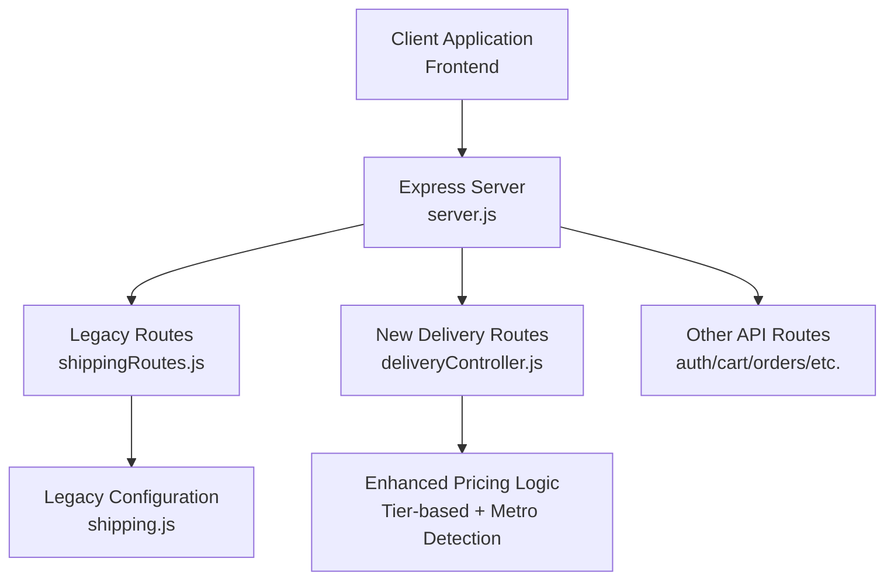
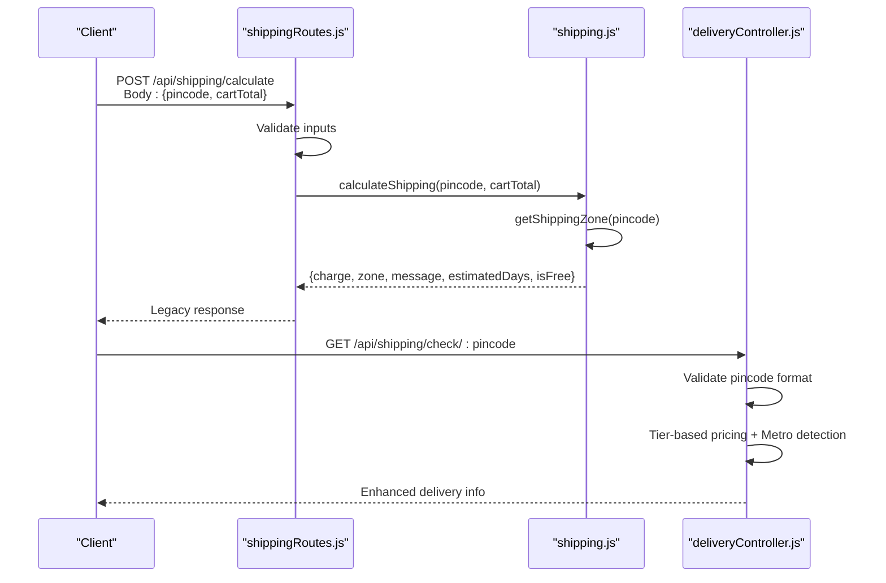
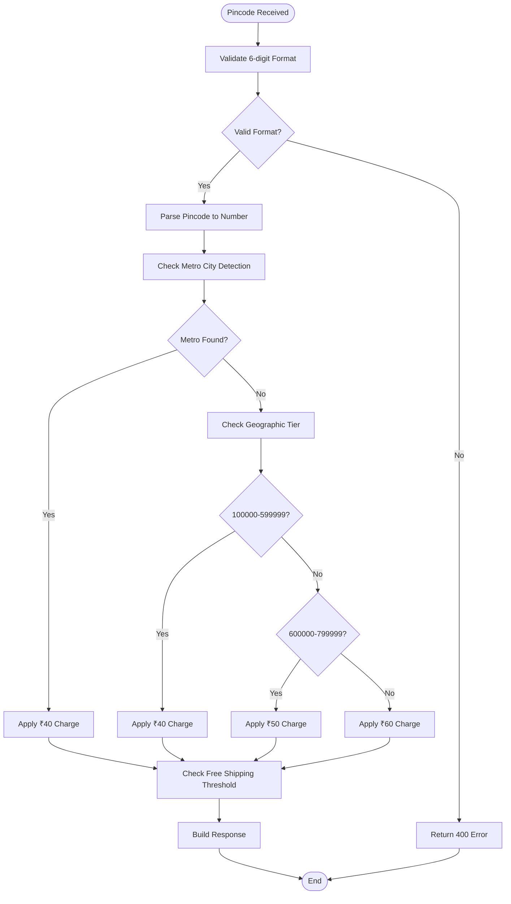

# Shipping Calculations API

<cite>
**Referenced Files in This Document**
- [shippingRoutes.js](file://backend/routes/shippingRoutes.js)
- [deliveryController.js](file://backend/controllers/deliveryController.js)
- [shipping.js](file://backend/config/shipping.js)
- [server.js](file://backend/server.js)
- [Checkout.jsx](file://frontend/src/pages/Checkout.jsx)
- [api.js](file://frontend/src/services/api.js)
</cite>

## Update Summary
**Changes Made**
- Updated API endpoints to reflect migration from legacy system to new delivery management system
- Added documentation for new `/api/shipping/check/:pincode` endpoint with enhanced pincode validation
- Added documentation for new `/api/shipping/charges` endpoint for bulk delivery charge calculation
- Enhanced pricing logic documentation with tier-based regional pricing and metro city detection
- Updated frontend integration examples to work with new delivery management system
- Added comprehensive error handling documentation for the new system

## Table of Contents
1. [Introduction](#introduction)
2. [Project Structure](#project-structure)
3. [Core Components](#core-components)
4. [Architecture Overview](#architecture-overview)
5. [Detailed Component Analysis](#detailed-component-analysis)
6. [API Reference](#api-reference)
7. [Enhanced Pricing Logic](#enhanced-pricing-logic)
8. [Integration Examples](#integration-examples)
9. [Error Handling](#error-handling)
10. [Performance Considerations](#performance-considerations)
11. [Migration Guide](#migration-guide)
12. [Troubleshooting Guide](#troubleshooting-guide)
13. [Conclusion](#conclusion)

## Introduction
This document provides comprehensive API documentation for the Shipping Calculations API endpoints, covering both the legacy and new delivery management systems. The documentation explains the POST `/api/shipping/calculate` endpoint for legacy zone-based shipping cost estimation and the new GET `/api/shipping/check/:pincode` and POST `/api/shipping/charges` endpoints for enhanced delivery management with improved pincode validation, tier-based pricing, and bulk charge calculation capabilities.

## Project Structure
The shipping functionality has evolved from a simple zone-based system to a comprehensive delivery management system with enhanced validation and pricing logic. The Express server mounts the shipping routes under the `/api/shipping` base path, supporting both legacy and new endpoints.



**Diagram sources**
- [server.js:64](file://backend/server.js#L64)
- [shippingRoutes.js:1-12](file://backend/routes/shippingRoutes.js#L1-L12)
- [deliveryController.js:1-118](file://backend/controllers/deliveryController.js#L1-L118)

**Section sources**
- [server.js:64](file://backend/server.js#L64)
- [shippingRoutes.js:1-12](file://backend/routes/shippingRoutes.js#L1-L12)
- [deliveryController.js:1-118](file://backend/controllers/deliveryController.js#L1-L118)

## Core Components
The system now operates with two distinct components:

### Legacy System Components
- **Route Layer**: Handles HTTP requests for legacy shipping calculations using zone-based logic
- **Configuration Layer**: Defines shipping zones with fixed rates and thresholds
- **Zone System**: Classifies deliveries into Local, State, and National categories

### New Delivery Management System Components
- **Enhanced Route Layer**: Validates pincode format, performs tier-based pricing, and supports bulk operations
- **Metro City Detection**: Identifies major metropolitan areas for special pricing
- **Regional Pricing**: Implements tier-based pricing based on geographic regions
- **Bulk Processing**: Supports batch delivery charge calculations

Key responsibilities:
- Legacy: Zone lookup, free shipping threshold checks, charge computation
- New: Pincode validation, tier-based pricing, metro city detection, bulk processing

**Section sources**
- [shippingRoutes.js:1-12](file://backend/routes/shippingRoutes.js#L1-L12)
- [deliveryController.js:1-118](file://backend/controllers/deliveryController.js#L1-L118)
- [shipping.js:1-73](file://backend/config/shipping.js#L1-L73)

## Architecture Overview
The shipping calculation system now supports both legacy and new delivery management approaches:

### Legacy Pipeline
Client sends pincode and cart total → Server validates inputs → Determines applicable zone → Checks free shipping eligibility → Returns standardized response

### New Delivery Management Pipeline
Client sends pincode → Server validates format → Performs tier-based pricing → Detects metro cities → Returns delivery availability and charges



**Diagram sources**
- [shippingRoutes.js:1-12](file://backend/routes/shippingRoutes.js#L1-L12)
- [deliveryController.js:1-78](file://backend/controllers/deliveryController.js#L1-L78)
- [shipping.js:52-73](file://backend/config/shipping.js#L52-L73)

## Detailed Component Analysis

### Legacy Route Handler: POST /api/shipping/calculate
The legacy route handler performs input validation and delegates to the configuration module for zone-based calculation. It returns a standardized response structure with zone information and free shipping eligibility.

Response fields:
- success: Boolean indicating operation success
- shippingCharge: Numeric shipping cost
- zone: Human-readable zone name
- message: Promotional or informational message
- estimatedDays: Delivery timeframe
- isFree: Boolean indicating free shipping eligibility

**Section sources**
- [shippingRoutes.js:1-12](file://backend/routes/shippingRoutes.js#L1-L12)

### Enhanced Delivery Controller: GET /api/shipping/check/:pincode
The new delivery controller provides comprehensive delivery management with enhanced validation and pricing logic:

#### Pincode Validation
- Validates 6-digit numeric format using regex pattern `^[0-9]{6}$`
- Returns structured error response for invalid formats

#### Metro City Detection
- Identifies major metropolitan areas with special pricing
- Currently supports Delhi NCR, Mumbai, Bangalore, Chennai, Kolkata, Hyderabad, and Pune
- Applies lower delivery charges for metro cities

#### Tier-Based Pricing
- **North/West Region (100000-599999)**: ₹40 delivery charge
- **South/East Region (600000-799999)**: ₹50 delivery charge  
- **Other Regions**: ₹60 delivery charge

#### Delivery Availability
- All pincodes currently marked as available
- In production, this would integrate with actual delivery APIs

**Section sources**
- [deliveryController.js:1-78](file://backend/controllers/deliveryController.js#L1-L78)

### Bulk Delivery Charges Controller: POST /api/shipping/charges
The bulk charge calculator processes multiple pincodes simultaneously:

#### Request Format
- `pincodes`: Array of pincode strings
- `orderValue`: Numeric order total for free shipping calculation

#### Response Format
- Array of objects with pincode, charge, and availability status
- Free shipping automatically applied for orders ≥ ₹500

**Section sources**
- [deliveryController.js:80-118](file://backend/controllers/deliveryController.js#L80-L118)

### Legacy Configuration Module: Shipping Zones and Calculation
The legacy configuration module maintains the original zone-based system:

- Local: Hyderabad core areas with ₹40 charge and ₹500 free shipping threshold
- State: Telangana & Andhra Pradesh with ₹80 charge and ₹799 threshold
- National: Rest of India with ₹120 charge and ₹1499 threshold

**Section sources**
- [shipping.js:1-73](file://backend/config/shipping.js#L1-L73)

### Frontend Integration Example
The frontend demonstrates integration with both legacy and new systems:

#### Legacy Integration
- Uses shipping zone information passed from cart page
- Displays free shipping indicators and estimated delivery days
- Integrates with order creation workflows

#### New Integration Opportunities
- Enhanced pincode validation and real-time delivery checking
- Metro city detection for special pricing
- Bulk pricing for multi-item orders

**Section sources**
- [Checkout.jsx:52-62](file://frontend/src/pages/Checkout.jsx#L52-L62)
- [Checkout.jsx:207-215](file://frontend/src/pages/Checkout.jsx#L207-L215)

## API Reference

### Legacy API Endpoints

#### POST /api/shipping/calculate
Estimates shipping costs based on delivery pincode and cart total using zone-based logic.

Request body:
- pincode: String (required)
- cartTotal: Number (required)

Response fields:
- success: Boolean
- shippingCharge: Number
- zone: String
- message: String
- estimatedDays: String
- isFree: Boolean

**Section sources**
- [shippingRoutes.js:1-12](file://backend/routes/shippingRoutes.js#L1-L12)
- [shipping.js:52-73](file://backend/config/shipping.js#L52-L73)

### New Delivery Management Endpoints

#### GET /api/shipping/check/:pincode
Checks delivery availability and calculates charges for a specific pincode with enhanced validation.

Request parameters:
- pincode: String (6-digit required)

Response fields:
- available: Boolean indicating delivery availability
- pincode: String (validated input)
- charge: Number (delivery charge in INR)
- estimatedDays: String (delivery timeframe)
- message: String (availability status message)

Example response:
```json
{
  "available": true,
  "pincode": "500055",
  "charge": 40,
  "estimatedDays": "3-5 business days",
  "message": "Delivery available"
}
```

**Section sources**
- [deliveryController.js:1-78](file://backend/controllers/deliveryController.js#L1-L78)

#### POST /api/shipping/charges
Calculates delivery charges for multiple pincodes in bulk with tier-based pricing.

Request body:
- pincodes: Array<String> (required)
- orderValue: Number (optional, for free shipping calculation)

Response:
Array of objects with:
- pincode: String
- charge: Number
- available: Boolean

Example request:
```json
{
  "pincodes": ["500055", "600001", "110001"],
  "orderValue": 799
}
```

Example response:
```json
[
  {
    "pincode": "500055",
    "charge": 40,
    "available": true
  },
  {
    "pincode": "600001", 
    "charge": 50,
    "available": true
  },
  {
    "pincode": "110001",
    "charge": 40,
    "available": true
  }
]
```

**Section sources**
- [deliveryController.js:80-118](file://backend/controllers/deliveryController.js#L80-L118)

## Enhanced Pricing Logic

### Tier-Based Regional Pricing
The new system implements sophisticated regional pricing based on geographic tiers:



**Diagram sources**
- [deliveryController.js:6-78](file://backend/controllers/deliveryController.js#L6-L78)

### Metro City Detection Logic
Major metropolitan areas receive special pricing treatment:

- **Delhi NCR**: ₹40 charge (ranges: 110001-110099, 201301-201310)
- **Mumbai**: ₹40 charge (range: 400001-400104)
- **Bangalore**: ₹40 charge (range: 560001-560103)
- **Chennai**: ₹40 charge (range: 600001-600128)
- **Kolkata**: ₹40 charge (range: 700001-700162)
- **Hyderabad**: ₹40 charge (range: 500001-500100)
- **Pune**: ₹40 charge (range: 411001-411057)

### Free Shipping Thresholds
- **Metro Cities**: ₹500 threshold for free shipping
- **All Regions**: ₹500 threshold for free shipping (bulk calculation)

**Section sources**
- [deliveryController.js:17-62](file://backend/controllers/deliveryController.js#L17-L62)

## Integration Examples

### E-commerce Fulfillment System Integration
The system supports seamless integration with order creation workflows:

#### Legacy Integration Flow
1. Frontend collects shipping pincode and cart details
2. Calls legacy shipping calculation endpoint
3. Receives standardized shipping information
4. Includes shipping charge, zone, and message in order payload
5. Backend processes order with legacy shipping metadata

#### New Integration Flow
1. Frontend validates pincode format before API call
2. Calls enhanced delivery check endpoint
3. Receives tier-based pricing and metro city detection
4. Applies free shipping logic based on order value
5. Processes order with enhanced delivery information

### Real-time Rate Quoting Enhancement
The new system provides enhanced real-time quoting capabilities:

- Immediate pincode validation with structured error responses
- Tier-based pricing with regional specificity
- Metro city detection for premium locations
- Bulk processing for multi-item orders
- Free shipping threshold calculation

### Shipping Method Selection
The system supports multiple payment methods alongside enhanced delivery calculations:
- Cash on Delivery (COD)
- Online Payment via Razorpay
- Direct UPI Payment with manual verification

**Section sources**
- [Checkout.jsx:67-86](file://frontend/src/pages/Checkout.jsx#L67-L86)
- [Checkout.jsx:88-137](file://frontend/src/pages/Checkout.jsx#L88-L137)
- [Checkout.jsx:139-165](file://frontend/src/pages/Checkout.jsx#L139-L165)

## Error Handling

### Enhanced Error Handling
The new system implements comprehensive error handling:

#### Input Validation
- **Pincode Format Validation**: Regex pattern `^[0-9]{6}$` ensures 6-digit numeric input
- **Array Validation**: Bulk endpoint validates pincodes array format
- **Type Validation**: Ensures numeric values for order totals and pincodes

#### Structured Error Responses
- **400 Errors**: Invalid pincode format returns structured error object
- **500 Errors**: Server-side exceptions caught with generic error messages
- **Validation Failures**: Clear error messages for malformed requests

#### Graceful Degradation
- **Invalid Pincodes**: Default to tier-based pricing without metro discount
- **Network Failures**: Return cached or default pricing information
- **System Errors**: Fallback to legacy zone-based calculation when available

**Section sources**
- [deliveryController.js:6-12](file://backend/controllers/deliveryController.js#L6-L12)
- [deliveryController.js:85-87](file://backend/controllers/deliveryController.js#L85-L87)
- [deliveryController.js:71-77](file://backend/controllers/deliveryController.js#L71-L77)

## Performance Considerations

### Legacy System Performance
- Zone lookup complexity: O(n) for Local zone pattern matching
- Pincode prefix matching: O(1) after initial validation
- Memory usage: Minimal static configuration objects
- Scalability: Can accommodate additional zones with minimal performance impact

### New System Performance
- **Pincode Validation**: O(1) regex validation
- **Metro Detection**: O(m×k) where m=number of metro cities, k=average ranges per city
- **Tier Pricing**: O(1) mathematical operations
- **Bulk Processing**: O(n) for n pincodes processed
- **Memory Usage**: Minimal static configuration objects with metro city arrays

### Optimization Opportunities
- **Legacy**: Replace array-based Local zone pattern matching with Set for O(1) lookups
- **New**: Cache frequently accessed tier pricing calculations
- **Both**: Implement database-backed zone management for dynamic updates
- **Bulk**: Add pagination for large pincode arrays (>1000 entries)

## Migration Guide

### From Legacy to New System
When migrating from the legacy shipping system to the new delivery management system:

#### Endpoint Migration
- **Legacy**: `POST /api/shipping/calculate` → **New**: `GET /api/shipping/check/:pincode`
- **Legacy**: Single pincode calculation → **New**: Enhanced validation and tier-based pricing
- **Legacy**: Zone-based logic → **New**: Tier-based + metro city detection

#### Data Structure Changes
- **Legacy Response**: `{charge, zone, message, estimatedDays, isFree}`
- **New Response**: `{available, pincode, charge, estimatedDays, message}`
- **Bulk Processing**: New endpoint specifically designed for multiple pincodes

#### Implementation Considerations
- **Validation**: Implement 6-digit pincode validation before API calls
- **Pricing Logic**: Adapt to tier-based regional pricing
- **Free Shipping**: Update threshold logic to match new system
- **Error Handling**: Implement structured error response handling

### Backward Compatibility
The legacy system remains functional during migration:
- Both systems can coexist during transition period
- Gradual migration allows testing of new features
- Legacy endpoints continue to serve existing integrations

**Section sources**
- [shippingRoutes.js:1-12](file://backend/routes/shippingRoutes.js#L1-L12)
- [deliveryController.js:1-118](file://backend/controllers/deliveryController.js#L1-L118)

## Troubleshooting Guide

### Common Issues and Solutions

#### Legacy System Issues
1. **Invalid Pincode Format**
   - Symptom: Defaulting to National zone rates
   - Solution: Ensure 6-digit numeric pincode format

2. **Free Shipping Not Applying**
   - Symptom: Non-zero shipping charges despite high cart totals
   - Solution: Verify cart total meets zone-specific threshold

3. **Missing Response Fields**
   - Symptom: Incomplete shipping information
   - Solution: Check client-side response field mapping

#### New System Issues
1. **Pincode Validation Failures**
   - Symptom: 400 errors with invalid pincode message
   - Solution: Ensure exactly 6 digits without spaces or special characters

2. **Unexpected Pricing**
   - Symptom: Higher/lower charges than expected
   - Solution: Verify pincode falls in correct geographic tier

3. **Metro City Not Detected**
   - Symptom: Standard pricing instead of metro discount
   - Solution: Check if pincode falls within recognized metro ranges

### Debugging Steps
1. **Legacy System**: Validate request payload structure and zone configuration
2. **New System**: Check pincode format validation and tier-based pricing logic
3. **Both Systems**: Verify cart total calculation accuracy and free shipping thresholds
4. **Error Handling**: Monitor server logs for validation failures and calculation errors
5. **Testing**: Use known pincode examples from each geographic tier

**Section sources**
- [shipping.js:31-49](file://backend/config/shipping.js#L31-L49)
- [deliveryController.js:6-12](file://backend/controllers/deliveryController.js#L6-L12)
- [server.js:93-97](file://backend/server.js#L93-L97)

## Conclusion
The Shipping Calculations API has evolved from a simple zone-based system to a comprehensive delivery management platform with enhanced validation, tier-based pricing, and metro city detection. The new system provides more accurate pricing logic, better user experience through real-time validation, and scalable architecture for future enhancements.

The dual-system approach ensures backward compatibility while enabling gradual migration to the enhanced delivery management capabilities. Both legacy and new endpoints serve different use cases, with the new system focusing on immediate quote generation with sophisticated regional pricing logic and the legacy system maintaining its proven zone-based approach.

Future enhancements could include integration with external delivery APIs, dynamic pricing based on real-time traffic conditions, and advanced analytics for delivery performance optimization.