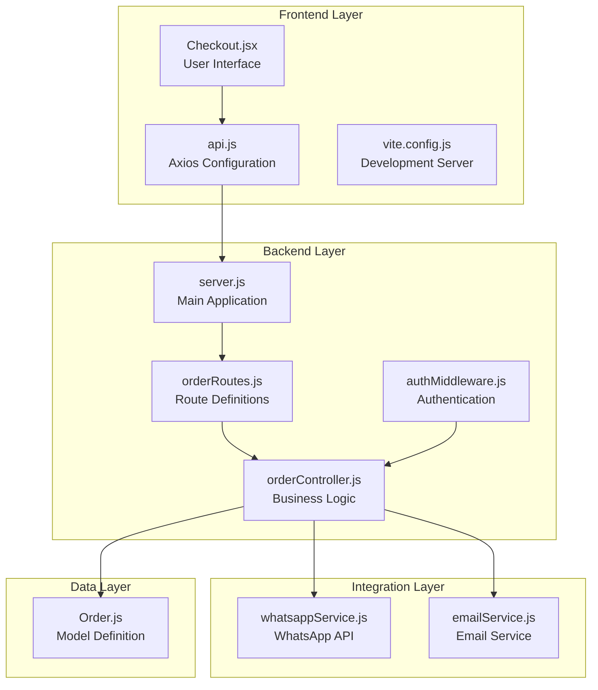
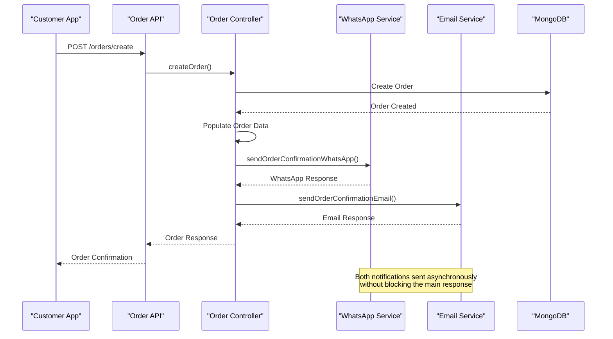
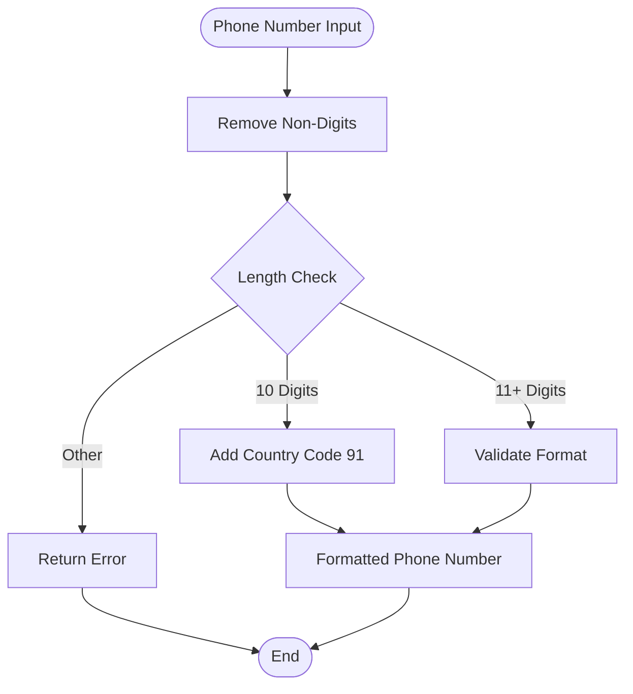
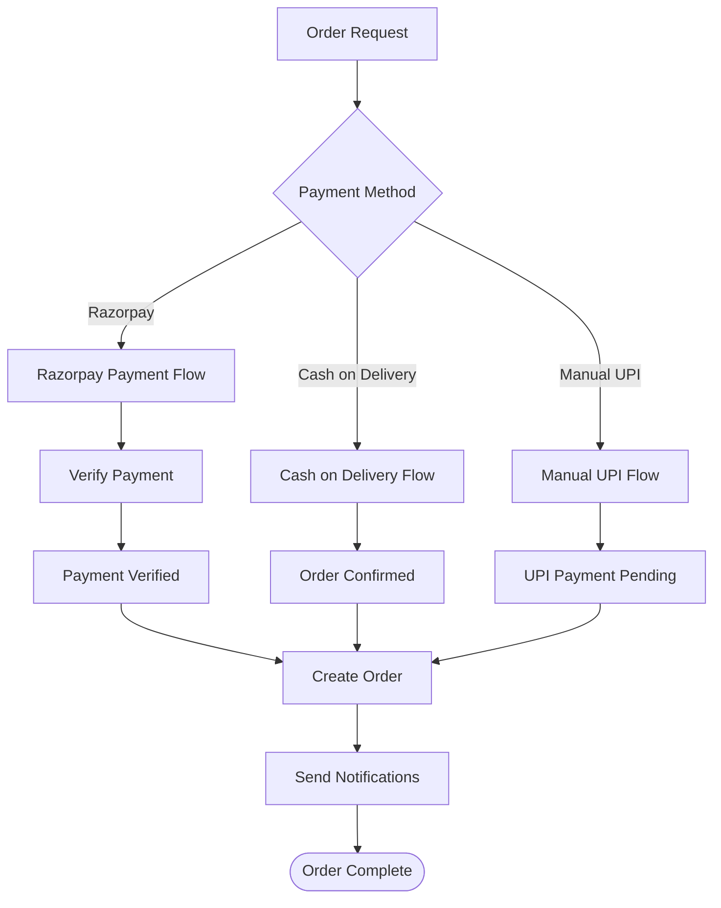

# WhatsApp Business Integration

<cite>
**Referenced Files in This Document**
- [whatsappService.js](file://backend/utils/whatsappService.js)
- [orderController.js](file://backend/controllers/orderController.js)
- [Order.js](file://backend/models/Order.js)
- [orderRoutes.js](file://backend/routes/orderRoutes.js)
- [server.js](file://backend/server.js)
- [emailService.js](file://backend/utils/emailService.js)
- [Checkout.jsx](file://frontend/src/pages/Checkout.jsx)
- [api.js](file://frontend/src/services/api.js)
- [vite.config.js](file://frontend/vite.config.js)
- [authMiddleware.js](file://backend/middleware/authMiddleware.js)
</cite>

## Table of Contents
1. [Introduction](#introduction)
2. [Project Structure](#project-structure)
3. [Core Components](#core-components)
4. [Architecture Overview](#architecture-overview)
5. [WhatsApp Integration Implementation](#whatsapp-integration-implementation)
6. [Order Processing Workflow](#order-processing-workflow)
7. [Frontend Integration](#frontend-integration)
8. [Configuration and Setup](#configuration-and-setup)
9. [Error Handling and Monitoring](#error-handling-and-monitoring)
10. [Security Considerations](#security-considerations)
11. [Troubleshooting Guide](#troubleshooting-guide)
12. [Conclusion](#conclusion)

## Introduction

The WhatsApp Business Integration is a comprehensive communication enhancement for the e-commerce platform that enables automated order confirmation notifications via WhatsApp Business Cloud API. This integration provides customers with instant order confirmations, delivery updates, and order status notifications directly to their WhatsApp-enabled devices, complementing the existing email notification system.

The integration leverages Facebook's WhatsApp Business Cloud API to send templated messages containing order details, customer information, and payment summaries. It supports multiple payment methods including online payments via Razorpay, Cash on Delivery (COD), and manual UPI payments, ensuring comprehensive coverage of all order scenarios.

## Project Structure

The WhatsApp integration is implemented across multiple layers of the application architecture, maintaining clean separation of concerns and following modern React and Node.js development patterns.

**Diagram sources**
- [server.js:1-104](file://backend/server.js#L1-L104)
- [orderRoutes.js:1-28](file://backend/routes/orderRoutes.js#L1-L28)
- [orderController.js:1-173](file://backend/controllers/orderController.js#L1-L173)
- [whatsappService.js:1-127](file://backend/utils/whatsappService.js#L1-L127)

**Section sources**
- [server.js:1-104](file://backend/server.js#L1-L104)
- [orderRoutes.js:1-28](file://backend/routes/orderRoutes.js#L1-L28)
- [orderController.js:1-173](file://backend/controllers/orderController.js#L1-L173)

## Core Components

### WhatsApp Service Module

The WhatsApp Service module serves as the primary interface for all WhatsApp-related communications, implementing robust error handling and international phone number formatting capabilities.

Key Features:
- **International Phone Number Formatting**: Automatic country code addition for Indian numbers (91)
- **Template-Based Messaging**: Support for WhatsApp Business Templates
- **Fallback Text Messages**: Backup messaging capability when templates are unavailable
- **Comprehensive Error Handling**: Detailed error reporting and logging

### Order Controller Integration

The Order Controller orchestrates the complete order-to-notification workflow, coordinating between payment processing, order creation, and customer communication.

Core Responsibilities:
- **Order Creation**: Handles all payment methods and order status determination
- **Asynchronous Notifications**: Sends WhatsApp and email confirmations without blocking API responses
- **Data Population**: Retrieves complete user and order information for notifications
- **Error Recovery**: Implements retry mechanisms and graceful degradation

### Order Model Schema

The Order model defines the data structure for all order-related information, including payment details, shipping information, and communication preferences.

**Section sources**
- [whatsappService.js:1-127](file://backend/utils/whatsappService.js#L1-L127)
- [orderController.js:86-173](file://backend/controllers/orderController.js#L86-L173)
- [Order.js:1-33](file://backend/models/Order.js#L1-L33)

## Architecture Overview

The WhatsApp integration follows a microservice-like architecture pattern within the monolithic backend, ensuring scalability and maintainability while keeping deployment complexity manageable.

**Diagram sources**
- [orderController.js:144-163](file://backend/controllers/orderController.js#L144-L163)
- [whatsappService.js:57-85](file://backend/utils/whatsappService.js#L57-L85)
- [emailService.js:17-109](file://backend/utils/emailService.js#L17-L109)

The architecture ensures that customer notifications are delivered reliably regardless of individual service failures, implementing a robust fallback mechanism that maintains system stability.

## WhatsApp Integration Implementation

### Template-Based Communication

The integration utilizes WhatsApp Business Templates for professional, brand-consistent messaging. The template system ensures compliance with WhatsApp's policies while providing rich, structured content delivery.

Template Parameters:
- **Customer Name**: Personalized greeting using recipient's name
- **Order ID**: Unique identifier for order tracking
- **Total Amount**: Formatted currency display
- **Order Date**: Localized date formatting for Indian locale

### Phone Number Processing

The system implements intelligent phone number formatting to support international customers while maintaining compatibility with existing Indian customer base.

**Diagram sources**
- [whatsappService.js:8-12](file://backend/utils/whatsappService.js#L8-L12)

### API Communication Protocol

The integration communicates with Facebook's Graph API using OAuth 2.0 authentication and JSON payload structures optimized for WhatsApp Business Cloud API requirements.

**Section sources**
- [whatsappService.js:5-55](file://backend/utils/whatsappService.js#L5-L55)
- [whatsappService.js:87-126](file://backend/utils/whatsappService.js#L87-L126)

## Order Processing Workflow

### Multi-Payment Method Support

The order processing system seamlessly handles various payment methods, each with specific notification requirements and status transitions.

**Diagram sources**
- [orderController.js:86-173](file://backend/controllers/orderController.js#L86-L173)

### Notification Scheduling

The system implements asynchronous notification delivery to improve user experience and system responsiveness. Both WhatsApp and email notifications are sent concurrently without affecting the primary order processing timeline.

**Section sources**
- [orderController.js:144-163](file://backend/controllers/orderController.js#L144-L163)
- [orderController.js:121-135](file://backend/controllers/orderController.js#L121-L135)

## Frontend Integration

### Checkout Page Implementation

The frontend checkout page provides seamless integration with the backend WhatsApp notification system through intuitive user interfaces and real-time validation.

Key Frontend Features:
- **Real-time Validation**: Immediate feedback for address and phone number validation
- **Payment Method Selection**: Clear presentation of available payment options
- **Loading States**: Proper user feedback during payment processing
- **Error Handling**: Comprehensive error messages and recovery options

### API Communication

The frontend communicates with the backend through a well-defined API contract, utilizing Axios for HTTP requests and implementing proper authentication token management.

**Section sources**
- [Checkout.jsx:1-301](file://frontend/src/pages/Checkout.jsx#L1-L301)
- [api.js:1-8](file://frontend/src/services/api.js#L1-L8)
- [vite.config.js:1-15](file://frontend/vite.config.js#L1-L15)

## Configuration and Setup

### Environment Variables

The integration requires several critical environment variables for proper operation, including WhatsApp Business API credentials and payment gateway configurations.

Required Configuration:
- **WHATSAPP_PHONE_NUMBER_ID**: WhatsApp Business phone number identifier
- **WHATSAPP_ACCESS_TOKEN**: Facebook Graph API access token
- **EMAIL_USER**: Gmail account for order confirmation emails
- **EMAIL_PASSWORD**: Gmail App Password for authentication

### Development Environment

The development setup includes local proxy configuration for seamless frontend-backend communication during development, supporting hot reloading and efficient debugging workflows.

**Section sources**
- [whatsappService.js:14-22](file://backend/utils/whatsappService.js#L14-L22)
- [server.js:18](file://backend/server.js#L18)
- [vite.config.js:8-13](file://frontend/vite.config.js#L8-L13)

## Error Handling and Monitoring

### Comprehensive Error Management

The system implements layered error handling across all integration points, ensuring graceful degradation and meaningful error reporting for debugging and monitoring purposes.

Error Categories:
- **Network Errors**: API connectivity issues and timeout handling
- **Validation Errors**: Input validation failures and malformed data
- **Business Logic Errors**: Payment verification failures and order processing issues
- **External Service Errors**: WhatsApp API errors and rate limiting

### Logging and Monitoring

Structured logging is implemented throughout the integration, providing detailed audit trails for debugging, compliance, and performance monitoring. Log entries include request/response data, error contexts, and timing information.

**Section sources**
- [whatsappService.js:44-54](file://backend/utils/whatsappService.js#L44-L54)
- [orderController.js:147-162](file://backend/controllers/orderController.js#L147-L162)

## Security Considerations

### Authentication and Authorization

The integration maintains strict security boundaries through JWT-based authentication, ensuring that only authorized users can access order information and trigger notifications. Role-based access control protects administrative functions while maintaining customer privacy.

### Data Protection

All sensitive customer data, including payment information and personal details, is handled according to industry security standards. Phone numbers and addresses are processed with appropriate sanitization and encryption where required.

### API Security

The backend implements comprehensive CORS configuration, input validation, and rate limiting to prevent abuse and ensure system stability under various load conditions.

**Section sources**
- [authMiddleware.js:1-20](file://backend/middleware/authMiddleware.js#L1-L20)
- [server.js:23-50](file://backend/server.js#L23-L50)

## Troubleshooting Guide

### Common Issues and Solutions

**WhatsApp Notification Failures**:
- Verify API credentials and token expiration
- Check phone number formatting and country code requirements
- Ensure WhatsApp Business Template is properly configured
- Monitor API rate limits and implement retry logic

**Order Processing Errors**:
- Validate payment gateway configurations
- Check database connectivity and order schema compliance
- Review authentication token validity and permissions
- Monitor network connectivity between services

**Frontend Integration Problems**:
- Verify API endpoint URLs and CORS configuration
- Check authentication token storage and transmission
- Validate payment method availability and configuration
- Review error handling and user feedback mechanisms

### Debugging Strategies

Implement systematic debugging approaches including log analysis, API testing with tools like Postman, and frontend inspection for JavaScript errors. Monitor system metrics and implement comprehensive error reporting for proactive issue detection.

**Section sources**
- [whatsappService.js:51-54](file://backend/utils/whatsappService.js#L51-L54)
- [orderController.js:169-172](file://backend/controllers/orderController.js#L169-L172)

## Conclusion

The WhatsApp Business Integration represents a sophisticated solution for e-commerce customer communication, combining modern API technologies with robust error handling and comprehensive monitoring. The implementation demonstrates best practices in system design, including asynchronous processing, fault tolerance, and security considerations.

Key achievements include seamless multi-payment method support, professional template-based messaging, and comprehensive error handling that ensures reliable customer notifications. The integration enhances the overall customer experience while maintaining system reliability and scalability for future growth.

The modular architecture and clear separation of concerns facilitate maintenance, testing, and extension of the integration capabilities. Future enhancements could include advanced templating, multi-language support, and expanded notification channels while maintaining the established architectural principles.