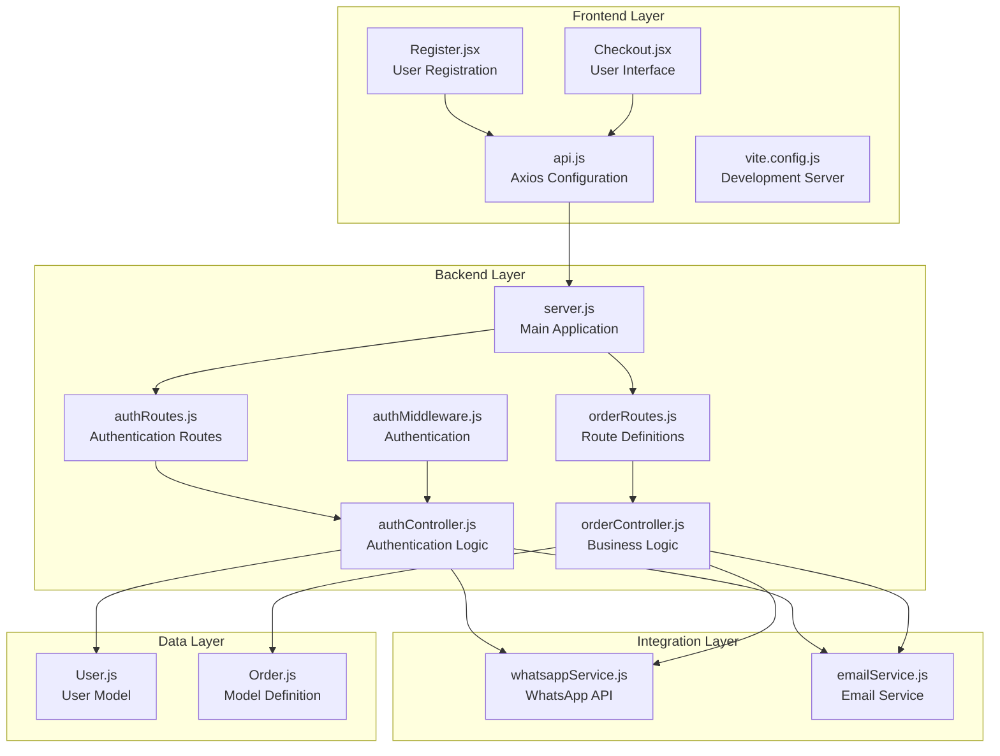
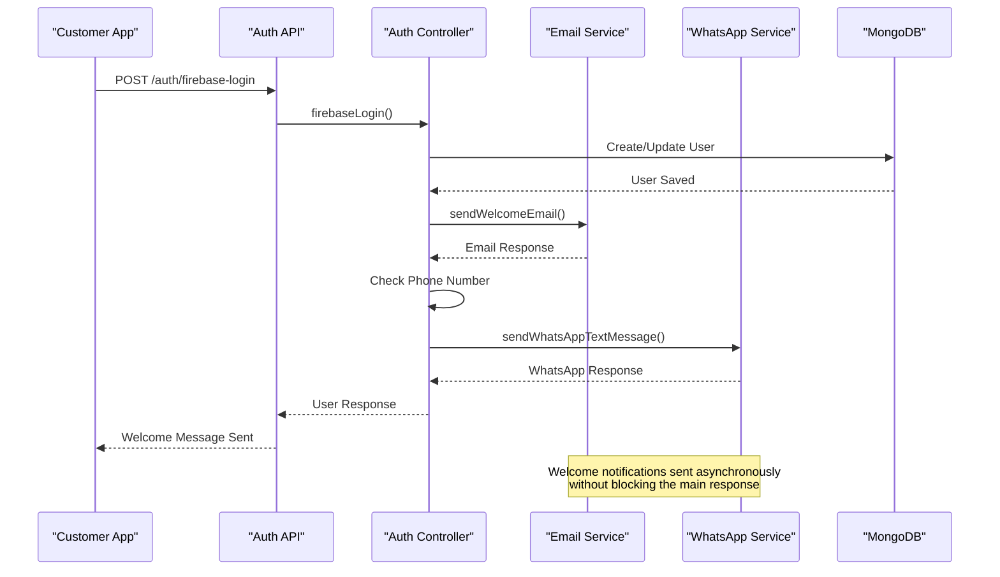
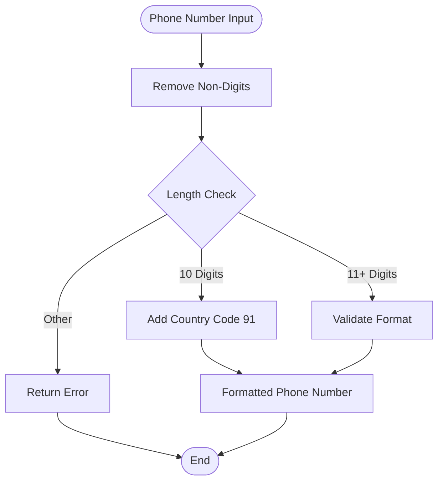
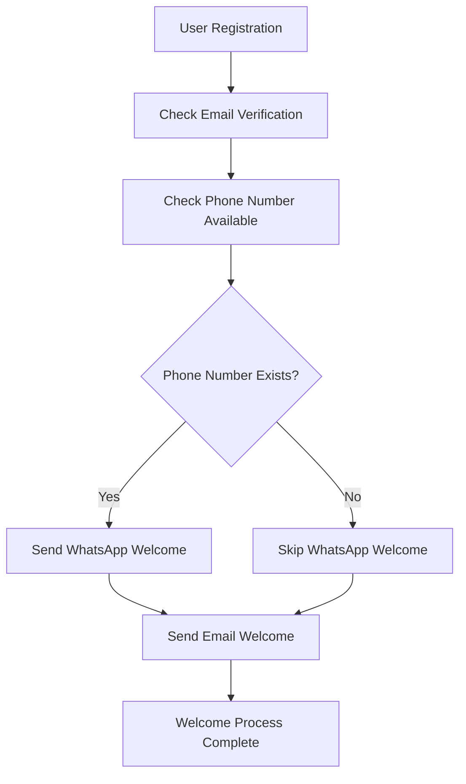
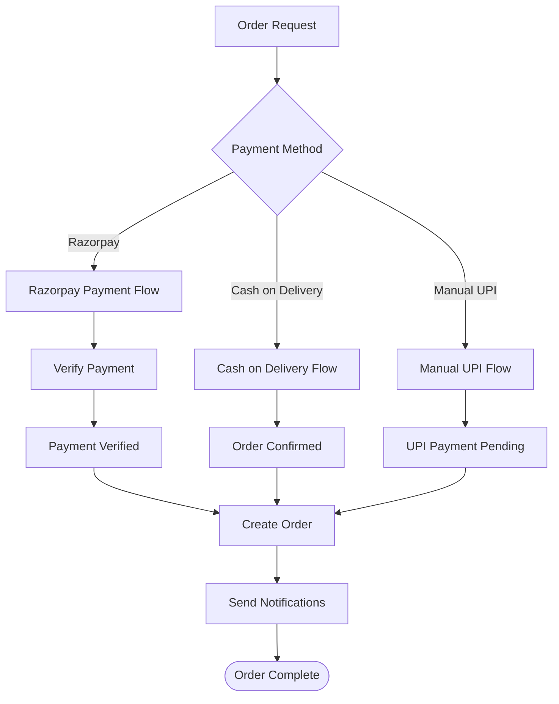

# WhatsApp Business Integration

<cite>
**Referenced Files in This Document**
- [whatsappService.js](file://backend/utils/whatsappService.js)
- [emailService.js](file://backend/utils/emailService.js)
- [authController.js](file://backend/controllers/authController.js)
- [authRoutes.js](file://backend/routes/authRoutes.js)
- [User.js](file://backend/models/User.js)
- [orderController.js](file://backend/controllers/orderController.js)
- [Order.js](file://backend/models/Order.js)
- [orderRoutes.js](file://backend/routes/orderRoutes.js)
- [server.js](file://backend/server.js)
- [Checkout.jsx](file://frontend/src/pages/Checkout.jsx)
- [Register.jsx](file://frontend/src/pages/Register.jsx)
- [api.js](file://frontend/src/services/api.js)
- [vite.config.js](file://frontend/vite.config.js)
- [authMiddleware.js](file://backend/middleware/authMiddleware.js)
</cite>

## Update Summary
**Changes Made**
- Added comprehensive welcome messaging system for new users
- Enhanced WhatsApp service with personalized welcome messages
- Integrated promotional code delivery via WhatsApp
- Added detailed error handling and logging for WhatsApp services
- Updated authentication flow to include welcome notifications
- Enhanced user registration process with phone number validation

## Table of Contents
1. [Introduction](#introduction)
2. [Project Structure](#project-structure)
3. [Core Components](#core-components)
4. [Architecture Overview](#architecture-overview)
5. [WhatsApp Integration Implementation](#whatsapp-integration-implementation)
6. [Welcome Messaging System](#welcome-messaging-system)
7. [Order Processing Workflow](#order-processing-workflow)
8. [Frontend Integration](#frontend-integration)
9. [Configuration and Setup](#configuration-and-setup)
10. [Error Handling and Monitoring](#error-handling-and-monitoring)
11. [Security Considerations](#security-considerations)
12. [Troubleshooting Guide](#troubleshooting-guide)
13. [Conclusion](#conclusion)

## Introduction

The WhatsApp Business Integration is a comprehensive communication enhancement for the e-commerce platform that enables automated order confirmation notifications via WhatsApp Business Cloud API. This integration provides customers with instant order confirmations, delivery updates, and order status notifications directly to their WhatsApp-enabled devices, complementing the existing email notification system.

**Enhanced** The system now includes an automated welcome messaging system for new users, sending personalized WhatsApp messages containing special welcome offers and promotional codes. The integration leverages Facebook's WhatsApp Business Cloud API to send templated messages containing order details, customer information, and payment summaries. It supports multiple payment methods including online payments via Razorpay, Cash on Delivery (COD), and manual UPI payments, ensuring comprehensive coverage of all order scenarios.

## Project Structure

The WhatsApp integration is implemented across multiple layers of the application architecture, maintaining clean separation of concerns and following modern React and Node.js development patterns.

```mermaid
graph TB
subgraph "Frontend Layer"
FE_Register["Register.jsx<br/>User Registration"]
FE_Checkout["Checkout.jsx<br/>User Interface"]
FE_API["api.js<br/>Axios Configuration"]
FE_Vite["vite.config.js<br/>Development Server"]
end
subgraph "Backend Layer"
BE_Server["server.js<br/>Main Application"]
BE_Routes["authRoutes.js<br/>Authentication Routes"]
BE_OrderRoutes["orderRoutes.js<br/>Route Definitions"]
BE_AuthController["authController.js<br/>Authentication Logic"]
BE_OrderController["orderController.js<br/>Business Logic"]
BE_Middleware["authMiddleware.js<br/>Authentication"]
end
subgraph "Integration Layer"
INT_WhatsApp["whatsappService.js<br/>WhatsApp API"]
INT_Email["emailService.js<br/>Email Service"]
end
subgraph "Data Layer"
DATA_User["User.js<br/>User Model"]
DATA_Order["Order.js<br/>Model Definition"]
end
FE_Register --> FE_API
FE_Checkout --> FE_API
FE_API --> BE_Server
BE_Server --> BE_Routes
BE_Server --> BE_OrderRoutes
BE_Routes --> BE_AuthController
BE_OrderRoutes --> BE_OrderController
BE_AuthController --> INT_Email
BE_AuthController --> INT_WhatsApp
BE_OrderController --> INT_WhatsApp
BE_OrderController --> INT_Email
BE_OrderController --> DATA_Order
BE_AuthController --> DATA_User
BE_Middleware --> BE_AuthController
```

**Diagram sources**
- [server.js:1-120](file://backend/server.js#L1-L120)
- [authRoutes.js:1-9](file://backend/routes/authRoutes.js#L1-L9)
- [orderRoutes.js:1-28](file://backend/routes/orderRoutes.js#L1-L28)
- [authController.js:1-91](file://backend/controllers/authController.js#L1-L91)
- [orderController.js:1-175](file://backend/controllers/orderController.js#L1-L175)
- [whatsappService.js:1-127](file://backend/utils/whatsappService.js#L1-L127)

**Section sources**
- [server.js:1-120](file://backend/server.js#L1-L120)
- [authRoutes.js:1-9](file://backend/routes/authRoutes.js#L1-L9)
- [orderRoutes.js:1-28](file://backend/routes/orderRoutes.js#L1-L28)
- [authController.js:1-91](file://backend/controllers/authController.js#L1-L91)

## Core Components

### WhatsApp Service Module

The WhatsApp Service module serves as the primary interface for all WhatsApp-related communications, implementing robust error handling and international phone number formatting capabilities.

**Enhanced** The module now includes specialized functions for both template-based and text-based messaging, with comprehensive error handling and logging for WhatsApp services.

Key Features:
- **International Phone Number Formatting**: Automatic country code addition for Indian numbers (91)
- **Template-Based Messaging**: Support for WhatsApp Business Templates
- **Simple Text Messaging**: Fallback capability for promotional messages
- **Comprehensive Error Handling**: Detailed error reporting and logging
- **Promotional Code Delivery**: Specialized messaging for welcome offers

### Welcome Messaging System

**New** A comprehensive welcome messaging system has been implemented to automatically greet new users and deliver promotional offers.

Key Features:
- **Personalized Welcome Messages**: Customized greetings with user names
- **Promotional Code Delivery**: Automated delivery of special welcome offers
- **Conditional WhatsApp Messaging**: Only sends messages if phone numbers are available
- **Dual Notification System**: Email and WhatsApp welcome notifications
- **Error Resilient**: Graceful handling of failed welcome message deliveries

### Authentication Controller Integration

The Authentication Controller orchestrates the complete user registration and welcome messaging workflow, coordinating between user creation, notification sending, and authentication token generation.

Core Responsibilities:
- **User Registration**: Handles both email and Google authentication flows
- **Welcome Message Coordination**: Sends welcome emails and WhatsApp messages for new users
- **User Data Management**: Manages user profile creation and updates
- **Error Recovery**: Implements retry mechanisms and graceful degradation

### Order Controller Integration

The Order Controller orchestrates the complete order-to-notification workflow, coordinating between payment processing, order creation, and customer communication.

Core Responsibilities:
- **Order Creation**: Handles all payment methods and order status determination
- **Asynchronous Notifications**: Sends WhatsApp and email confirmations without blocking API responses
- **Data Population**: Retrieves complete user and order information for notifications
- **Error Recovery**: Implements retry mechanisms and graceful degradation

### User Model Schema

The User model defines the data structure for all user-related information, including authentication details, contact information, and communication preferences.

**Section sources**
- [whatsappService.js:1-127](file://backend/utils/whatsappService.js#L1-L127)
- [authController.js:47-73](file://backend/controllers/authController.js#L47-L73)
- [emailService.js:111-148](file://backend/utils/emailService.js#L111-L148)
- [User.js:1-30](file://backend/models/User.js#L1-L30)

## Architecture Overview

The WhatsApp integration follows a microservice-like architecture pattern within the monolithic backend, ensuring scalability and maintainability while keeping deployment complexity manageable.

**Enhanced** The architecture now includes a welcome messaging workflow that operates independently of the order processing system, providing immediate user engagement upon registration.

```mermaid
sequenceDiagram
participant Client as "Customer App"
participant API as "Auth API"
participant Controller as "Auth Controller"
participant Email as "Email Service"
participant WhatsApp as "WhatsApp Service"
participant Database as "MongoDB"
Client->>API : POST /auth/firebase-login
API->>Controller : firebaseLogin()
Controller->>Database : Create/Update User
Database-->>Controller : User Saved
Controller->>Email : sendWelcomeEmail()
Email-->>Controller : Email Response
Controller->>Controller : Check Phone Number
Controller->>WhatsApp : sendWhatsAppTextMessage()
WhatsApp-->>Controller : WhatsApp Response
Controller-->>API : User Response
API-->>Client : Welcome Message Sent
Note over Email,WhatsApp : Welcome notifications sent asynchronously<br/>without blocking the main response
```

**Diagram sources**
- [authController.js:47-73](file://backend/controllers/authController.js#L47-L73)
- [emailService.js:111-148](file://backend/utils/emailService.js#L111-L148)
- [whatsappService.js:87-126](file://backend/utils/whatsappService.js#L87-L126)

The architecture ensures that customer notifications are delivered reliably regardless of individual service failures, implementing a robust fallback mechanism that maintains system stability.

## WhatsApp Integration Implementation

### Template-Based Communication

The integration utilizes WhatsApp Business Templates for professional, brand-consistent messaging. The template system ensures compliance with WhatsApp's policies while providing rich, structured content delivery.

Template Parameters:
- **Customer Name**: Personalized greeting using recipient's name
- **Order ID**: Unique identifier for order tracking
- **Total Amount**: Formatted currency display
- **Order Date**: Localized date formatting for Indian locale

### Personalized Welcome Messaging

**New** The system now includes specialized welcome messaging for new users, delivering personalized promotional offers and welcome messages.

Welcome Message Features:
- **Personalized Greetings**: Uses user's name in the welcome message
- **Promotional Offers**: Automatically includes special welcome codes
- **Brand Consistency**: Maintains consistent messaging style
- **Conditional Delivery**: Only sends messages if phone numbers are available

### Phone Number Processing

The system implements intelligent phone number formatting to support international customers while maintaining compatibility with existing Indian customer base.

```mermaid
flowchart TD
Start([Phone Number Input]) --> Clean["Remove Non-Digits"]
Clean --> CheckLength{"Length Check"}
CheckLength --> |10 Digits| AddCountry["Add Country Code 91"]
CheckLength --> |11+ Digits| ValidateFormat["Validate Format"]
CheckLength --> |Other| Error["Return Error"]
AddCountry --> FormatComplete["Formatted Phone Number"]
ValidateFormat --> FormatComplete
Error --> End([End])
FormatComplete --> End
```

**Diagram sources**
- [whatsappService.js:8-12](file://backend/utils/whatsappService.js#L8-L12)

### API Communication Protocol

The integration communicates with Facebook's Graph API using OAuth 2.0 authentication and JSON payload structures optimized for WhatsApp Business Cloud API requirements.

**Section sources**
- [whatsappService.js:5-55](file://backend/utils/whatsappService.js#L5-L55)
- [whatsappService.js:87-126](file://backend/utils/whatsappService.js#L87-L126)

## Welcome Messaging System

### Automated User Onboarding

**New** The welcome messaging system provides immediate engagement for new users, delivering personalized messages and promotional offers upon successful registration.

Welcome Message Content:
- **Personalized Greeting**: Uses user's name for a friendly welcome
- **Brand Introduction**: Brief introduction to the e-commerce platform
- **Promotional Offer**: Special welcome discount code (WELCOME10 for 10% off)
- **Call-to-Action**: Encourages exploration of products and services

### Conditional Message Delivery

The system implements intelligent conditional logic to ensure welcome messages are only sent when appropriate:

```mermaid
flowchart TD
UserRegistration["User Registration"] --> CheckEmail["Check Email Verification"]
CheckEmail --> CheckPhone["Check Phone Number Available"]
CheckPhone --> HasPhone{"Phone Number Exists?"}
HasPhone --> |Yes| SendWhatsApp["Send WhatsApp Welcome"]
HasPhone --> |No| SkipWhatsApp["Skip WhatsApp Welcome"]
SendWhatsApp --> SendEmail["Send Email Welcome"]
SkipWhatsApp --> SendEmail
SendEmail --> Complete["Welcome Process Complete"]
```

**Diagram sources**
- [authController.js:47-73](file://backend/controllers/authController.js#L47-L73)

### Promotional Code Management

**Enhanced** The welcome messaging system includes automated promotional code delivery, providing immediate value to new users and encouraging their first purchase.

Promotional Features:
- **Unique Codes**: Each welcome message includes a unique promotional code
- **Automatic Redemption**: Codes are designed for easy redemption on first order
- **Limited Time Offers**: Promotional codes are integrated with order processing workflows

**Section sources**
- [authController.js:47-73](file://backend/controllers/authController.js#L47-L73)
- [emailService.js:111-148](file://backend/utils/emailService.js#L111-L148)

## Order Processing Workflow

### Multi-Payment Method Support

The order processing system seamlessly handles various payment methods, each with specific notification requirements and status transitions.

```mermaid
flowchart TD
OrderRequest["Order Request"] --> PaymentMethod{"Payment Method"}
PaymentMethod --> |Razorpay| RazorpayFlow["Razorpay Payment Flow"]
PaymentMethod --> |Cash on Delivery| CODFlow["Cash on Delivery Flow"]
PaymentMethod --> |Manual UPI| UPIFlow["Manual UPI Flow"]
RazorpayFlow --> VerifyPayment["Verify Payment"]
VerifyPayment --> PaymentVerified["Payment Verified"]
CODFlow --> CODConfirmed["Order Confirmed"]
UPIFlow --> UPIPending["UPI Payment Pending"]
PaymentVerified --> CreateOrder["Create Order"]
CODConfirmed --> CreateOrder
UPIPending --> CreateOrder
CreateOrder --> SendNotifications["Send Notifications"]
SendNotifications --> Complete([Order Complete])
```

**Diagram sources**
- [orderController.js:86-175](file://backend/controllers/orderController.js#L86-L175)

### Notification Scheduling

The system implements asynchronous notification delivery to improve user experience and system responsiveness. Both WhatsApp and email notifications are sent concurrently without affecting the primary order processing timeline.

**Section sources**
- [orderController.js:161-175](file://backend/controllers/orderController.js#L161-L175)
- [orderController.js:121-135](file://backend/controllers/orderController.js#L121-L135)

## Frontend Integration

### Registration Page Implementation

**Enhanced** The frontend registration page now includes comprehensive phone number validation and user experience improvements for the welcome messaging system.

Key Frontend Features:
- **Real-time Validation**: Immediate feedback for address and phone number validation
- **Payment Method Selection**: Clear presentation of available payment options
- **Loading States**: Proper user feedback during payment processing
- **Error Handling**: Comprehensive error messages and recovery options
- **Phone Number Input**: Specialized input handling for 10-digit Indian numbers

### Authentication Flow

The frontend authentication flow integrates seamlessly with the backend welcome messaging system, providing immediate user feedback upon successful registration.

### API Communication

The frontend communicates with the backend through a well-defined API contract, utilizing Axios for HTTP requests and implementing proper authentication token management.

**Section sources**
- [Register.jsx:1-162](file://frontend/src/pages/Register.jsx#L1-L162)
- [Checkout.jsx:1-301](file://frontend/src/pages/Checkout.jsx#L1-L301)
- [api.js:1-8](file://frontend/src/services/api.js#L1-L8)
- [vite.config.js:1-15](file://frontend/vite.config.js#L1-L15)

## Configuration and Setup

### Environment Variables

The integration requires several critical environment variables for proper operation, including WhatsApp Business API credentials and payment gateway configurations.

**Enhanced** Additional environment variables are required for the welcome messaging system.

Required Configuration:
- **WHATSAPP_PHONE_NUMBER_ID**: WhatsApp Business phone number identifier
- **WHATSAPP_ACCESS_TOKEN**: Facebook Graph API access token
- **EMAIL_USER**: Gmail account for order confirmation emails
- **EMAIL_PASSWORD**: Gmail App Password for authentication

### Development Environment

The development setup includes local proxy configuration for seamless frontend-backend communication during development, supporting hot reloading and efficient debugging workflows.

**Section sources**
- [whatsappService.js:14-22](file://backend/utils/whatsappService.js#L14-L22)
- [server.js:18](file://backend/server.js#L18)
- [vite.config.js:8-13](file://frontend/vite.config.js#L8-L13)

## Error Handling and Monitoring

### Comprehensive Error Management

**Enhanced** The system implements layered error handling across all integration points, ensuring graceful degradation and meaningful error reporting for debugging and monitoring purposes.

Error Categories:
- **Network Errors**: API connectivity issues and timeout handling
- **Validation Errors**: Input validation failures and malformed data
- **Business Logic Errors**: Payment verification failures and order processing issues
- **External Service Errors**: WhatsApp API errors and rate limiting
- **Welcome Message Errors**: Specific handling for welcome notification failures

### Logging and Monitoring

Structured logging is implemented throughout the integration, providing detailed audit trails for debugging, compliance, and performance monitoring. Log entries include request/response data, error contexts, and timing information.

**Section sources**
- [whatsappService.js:44-54](file://backend/utils/whatsappService.js#L44-L54)
- [authController.js:48-73](file://backend/controllers/authController.js#L48-L73)
- [orderController.js:161-175](file://backend/controllers/orderController.js#L161-L175)

## Security Considerations

### Authentication and Authorization

The integration maintains strict security boundaries through JWT-based authentication, ensuring that only authorized users can access order information and trigger notifications. Role-based access control protects administrative functions while maintaining customer privacy.

### Data Protection

All sensitive customer data, including payment information and personal details, is handled according to industry security standards. Phone numbers and addresses are processed with appropriate sanitization and encryption where required.

### API Security

The backend implements comprehensive CORS configuration, input validation, and rate limiting to prevent abuse and ensure system stability under various load conditions.

**Section sources**
- [authMiddleware.js:1-32](file://backend/middleware/authMiddleware.js#L1-L32)
- [server.js:23-64](file://backend/server.js#L23-L64)

## Troubleshooting Guide

### Common Issues and Solutions

**WhatsApp Notification Failures**:
- Verify API credentials and token expiration
- Check phone number formatting and country code requirements
- Ensure WhatsApp Business Template is properly configured
- Monitor API rate limits and implement retry logic
- **New** Check welcome message formatting and promotional code delivery

**Welcome Message Delivery Issues**:
- **New** Verify phone number availability in user profiles
- **New** Check promotional code format and validity
- **New** Monitor welcome message template configuration
- **New** Validate user phone number formatting

**Order Processing Errors**:
- Validate payment gateway configurations
- Check database connectivity and order schema compliance
- Review authentication token validity and permissions
- Monitor network connectivity between services

**Frontend Integration Problems**:
- Verify API endpoint URLs and CORS configuration
- Check authentication token storage and transmission
- Validate payment method availability and configuration
- Review error handling and user feedback mechanisms

### Debugging Strategies

Implement systematic debugging approaches including log analysis, API testing with tools like Postman, and frontend inspection for JavaScript errors. Monitor system metrics and implement comprehensive error reporting for proactive issue detection.

**Section sources**
- [whatsappService.js:51-54](file://backend/utils/whatsappService.js#L51-L54)
- [authController.js:65-73](file://backend/controllers/authController.js#L65-L73)
- [orderController.js:169-175](file://backend/controllers/orderController.js#L169-L175)

## Conclusion

The WhatsApp Business Integration represents a sophisticated solution for e-commerce customer communication, combining modern API technologies with robust error handling and comprehensive monitoring. The implementation demonstrates best practices in system design, including asynchronous processing, fault tolerance, and security considerations.

**Enhanced** The integration now includes a comprehensive welcome messaging system that provides immediate value to new users through personalized WhatsApp messages and promotional offers. This enhancement significantly improves user onboarding experience and encourages initial purchases.

Key achievements include seamless multi-payment method support, professional template-based messaging, comprehensive error handling that ensures reliable customer notifications, and automated welcome messaging for new users. The integration enhances the overall customer experience while maintaining system reliability and scalability for future growth.

The modular architecture and clear separation of concerns facilitate maintenance, testing, and extension of the integration capabilities. Future enhancements could include advanced templating, multi-language support, expanded notification channels, and enhanced welcome messaging personalization while maintaining the established architectural principles.