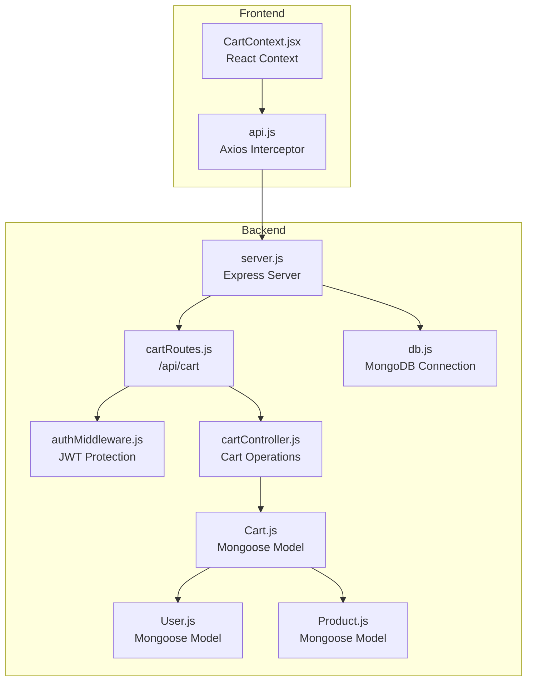
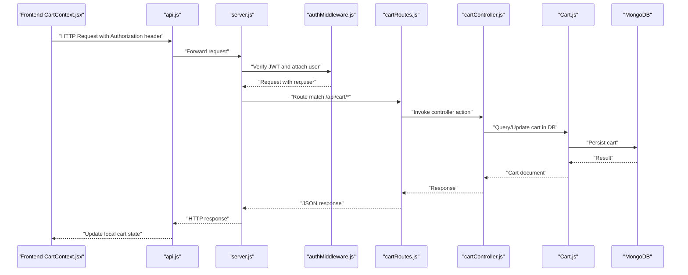
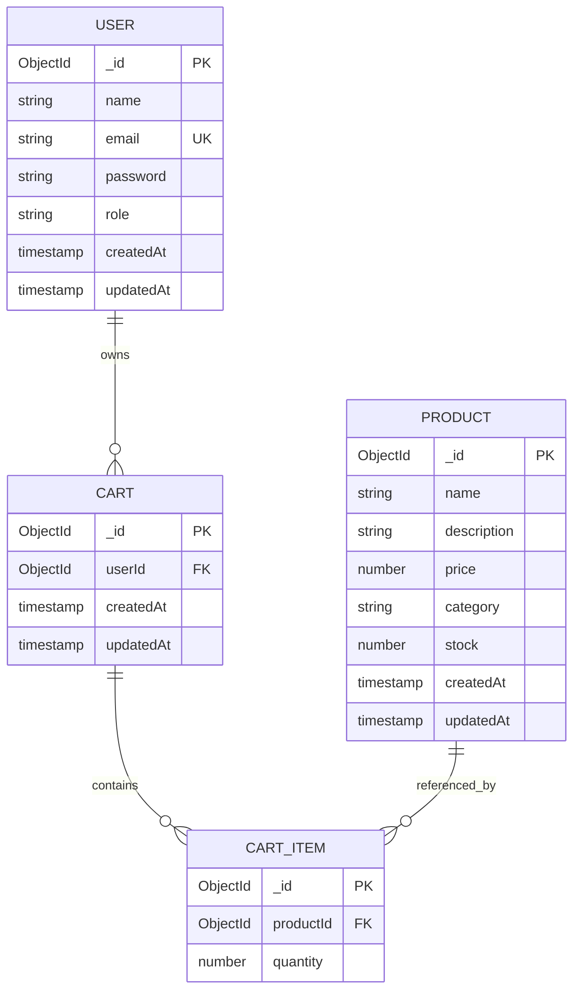
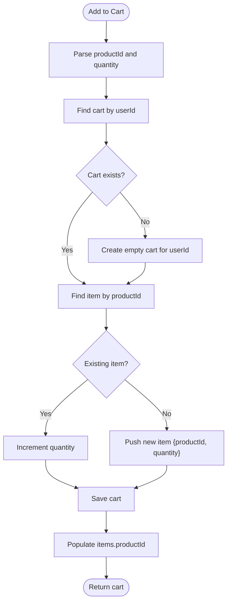
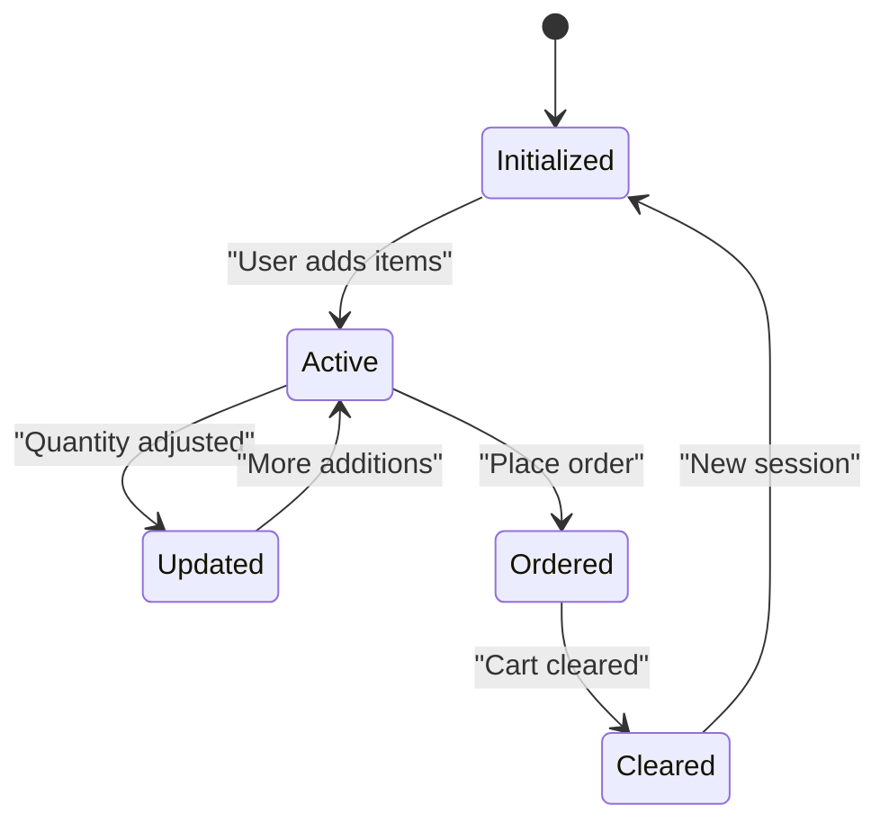
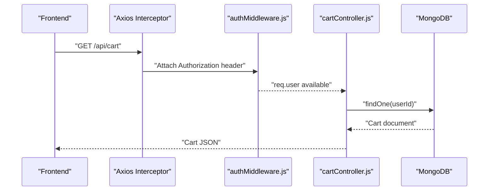
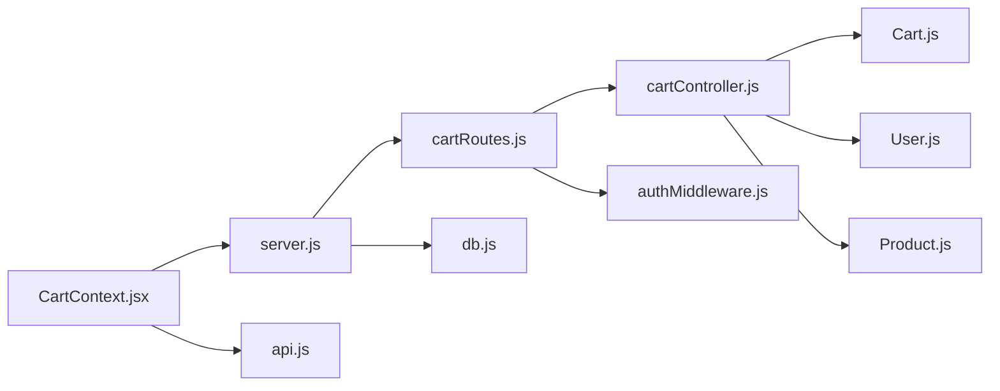

# Cart Model

<cite>
**Referenced Files in This Document**
- [Cart.js](file://backend/models/Cart.js)
- [User.js](file://backend/models/User.js)
- [Product.js](file://backend/models/Product.js)
- [cartController.js](file://backend/controllers/cartController.js)
- [cartRoutes.js](file://backend/routes/cartRoutes.js)
- [authMiddleware.js](file://backend/middleware/authMiddleware.js)
- [db.js](file://backend/config/db.js)
- [server.js](file://backend/server.js)
- [CartContext.jsx](file://frontend/src/context/CartContext.jsx)
- [api.js](file://frontend/src/services/api.js)
- [orderController.js](file://backend/controllers/orderController.js)
</cite>

## Table of Contents
1. [Introduction](#introduction)
2. [Project Structure](#project-structure)
3. [Core Components](#core-components)
4. [Architecture Overview](#architecture-overview)
5. [Detailed Component Analysis](#detailed-component-analysis)
6. [Dependency Analysis](#dependency-analysis)
7. [Performance Considerations](#performance-considerations)
8. [Troubleshooting Guide](#troubleshooting-guide)
9. [Conclusion](#conclusion)

## Introduction
This document provides comprehensive data model documentation for the Cart model in an e-commerce application. It covers the schema structure for temporary shopping data, user associations, product items, quantities, and session persistence. It also documents cart item composition, lifecycle management, session handling, data persistence strategies, field definitions, validation rules, and business logic for cart operations. Practical examples illustrate adding items, updating quantities, removing items, and cart cleanup. The document explains relationships with User and Product models, addresses cart expiration policies, session timeout handling, data cleanup procedures, performance considerations, and troubleshooting strategies.

## Project Structure
The cart functionality spans backend models, controllers, routes, middleware, and frontend context. The backend connects to MongoDB via Mongoose and exposes REST endpoints protected by JWT authentication. The frontend manages cart state using React context and Axios interceptors to attach authentication tokens.

**Diagram sources**
- [server.js:1-102](file://backend/server.js#L1-L102)
- [cartRoutes.js:1-12](file://backend/routes/cartRoutes.js#L1-L12)
- [cartController.js:1-38](file://backend/controllers/cartController.js#L1-L38)
- [Cart.js:1-12](file://backend/models/Cart.js#L1-L12)
- [User.js:1-20](file://backend/models/User.js#L1-L20)
- [Product.js:1-12](file://backend/models/Product.js#L1-L12)
- [authMiddleware.js:1-20](file://backend/middleware/authMiddleware.js#L1-L20)
- [db.js:1-14](file://backend/config/db.js#L1-L14)
- [CartContext.jsx:1-53](file://frontend/src/context/CartContext.jsx#L1-L53)
- [api.js:1-8](file://frontend/src/services/api.js#L1-L8)

**Section sources**
- [server.js:1-102](file://backend/server.js#L1-L102)
- [cartRoutes.js:1-12](file://backend/routes/cartRoutes.js#L1-L12)
- [cartController.js:1-38](file://backend/controllers/cartController.js#L1-L38)
- [Cart.js:1-12](file://backend/models/Cart.js#L1-L12)
- [User.js:1-20](file://backend/models/User.js#L1-L20)
- [Product.js:1-12](file://backend/models/Product.js#L1-L12)
- [authMiddleware.js:1-20](file://backend/middleware/authMiddleware.js#L1-L20)
- [db.js:1-14](file://backend/config/db.js#L1-L14)
- [CartContext.jsx:1-53](file://frontend/src/context/CartContext.jsx#L1-L53)
- [api.js:1-8](file://frontend/src/services/api.js#L1-L8)

## Core Components
- Cart model: Defines the cart schema with a unique user association and an array of items containing product references and quantities.
- User model: Provides user identity and role for cart ownership and authorization.
- Product model: Supplies product metadata used during cart population and order creation.
- Cart controller: Implements cart operations (get, add, update, clear) with validation and persistence.
- Cart routes: Exposes REST endpoints under /api/cart guarded by authentication middleware.
- Authentication middleware: Validates JWT tokens and attaches user context to requests.
- Database connection: Initializes MongoDB connectivity for cart persistence.
- Frontend context: Manages cart state locally and synchronizes with backend APIs.

Key schema highlights:
- Unique user association ensures one cart per user.
- Items array stores productId and quantity with a minimum quantity constraint.
- Timestamps enable creation and modification tracking.

Validation rules:
- Quantity defaults to 1 and enforces a minimum of 1.
- Cart retrieval creates an empty cart if none exists for the user.

**Section sources**
- [Cart.js:1-12](file://backend/models/Cart.js#L1-L12)
- [User.js:1-20](file://backend/models/User.js#L1-L20)
- [Product.js:1-12](file://backend/models/Product.js#L1-L12)
- [cartController.js:1-38](file://backend/controllers/cartController.js#L1-L38)
- [cartRoutes.js:1-12](file://backend/routes/cartRoutes.js#L1-L12)
- [authMiddleware.js:1-20](file://backend/middleware/authMiddleware.js#L1-L20)
- [db.js:1-14](file://backend/config/db.js#L1-L14)

## Architecture Overview
The cart architecture integrates frontend and backend components. The frontend authenticates users and interacts with cart endpoints. Backend routes enforce protection via JWT, resolve user identity, and perform cart operations against MongoDB. Cart items are populated with product details for display and order creation.

**Diagram sources**
- [CartContext.jsx:1-53](file://frontend/src/context/CartContext.jsx#L1-L53)
- [api.js:1-8](file://frontend/src/services/api.js#L1-L8)
- [server.js:1-102](file://backend/server.js#L1-L102)
- [authMiddleware.js:1-20](file://backend/middleware/authMiddleware.js#L1-L20)
- [cartRoutes.js:1-12](file://backend/routes/cartRoutes.js#L1-L12)
- [cartController.js:1-38](file://backend/controllers/cartController.js#L1-L38)
- [Cart.js:1-12](file://backend/models/Cart.js#L1-L12)

## Detailed Component Analysis

### Cart Schema and Relationships
The Cart model defines:
- userId: ObjectId referencing User, required and unique via index.
- items: Array of objects containing productId (ObjectId referencing Product) and quantity (Number, default 1, min 1).
- timestamps: Automatic createdAt and updatedAt fields.

Relationships:
- One-to-one with User via userId.
- One-to-many with Product via items.productId.

**Diagram sources**
- [Cart.js:1-12](file://backend/models/Cart.js#L1-L12)
- [User.js:1-20](file://backend/models/User.js#L1-L20)
- [Product.js:1-12](file://backend/models/Product.js#L1-L12)

**Section sources**
- [Cart.js:1-12](file://backend/models/Cart.js#L1-L12)
- [User.js:1-20](file://backend/models/User.js#L1-L20)
- [Product.js:1-12](file://backend/models/Product.js#L1-L12)

### Cart Controller Operations
- Get cart: Retrieves the cart for the authenticated user, populating product details. Creates an empty cart if none exists.
- Add to cart: Finds or creates a cart for the user, checks for existing item, increments quantity if present, otherwise pushes a new item, then saves and returns populated cart.
- Update cart item: Finds the cart, locates the item by productId, removes it if quantity is zero or updates quantity otherwise, then saves and returns populated cart.
- Clear cart: Deletes the user's cart and recreates an empty one.

**Diagram sources**
- [cartController.js:9-22](file://backend/controllers/cartController.js#L9-L22)

**Section sources**
- [cartController.js:1-38](file://backend/controllers/cartController.js#L1-L38)

### Cart Lifecycle Management
- Initialization: On first access, a cart is created for the user if missing.
- Persistence: Cart is stored in MongoDB with a unique index on userId.
- Population: Cart responses include populated product details for display and order creation.
- Cleanup: Cart is cleared upon successful order creation.

**Diagram sources**
- [cartController.js:3-7](file://backend/controllers/cartController.js#L3-L7)
- [orderController.js:134-136](file://backend/controllers/orderController.js#L134-L136)

**Section sources**
- [cartController.js:3-7](file://backend/controllers/cartController.js#L3-L7)
- [orderController.js:134-136](file://backend/controllers/orderController.js#L134-L136)

### Session Handling and Data Persistence
- Authentication: Requests require a valid JWT token; the middleware decodes the token and attaches user identity to req.user.
- Session persistence: Cart data persists in MongoDB under the user’s unique cart document.
- Frontend synchronization: The React context fetches the cart on mount and updates state after each operation.

**Diagram sources**
- [CartContext.jsx:10-20](file://frontend/src/context/CartContext.jsx#L10-L20)
- [api.js:3-7](file://frontend/src/services/api.js#L3-L7)
- [authMiddleware.js:4-15](file://backend/middleware/authMiddleware.js#L4-L15)
- [cartController.js:3-7](file://backend/controllers/cartController.js#L3-L7)

**Section sources**
- [authMiddleware.js:1-20](file://backend/middleware/authMiddleware.js#L1-L20)
- [CartContext.jsx:1-53](file://frontend/src/context/CartContext.jsx#L1-L53)
- [api.js:1-8](file://frontend/src/services/api.js#L1-L8)
- [cartController.js:1-38](file://backend/controllers/cartController.js#L1-L38)

### Field Definitions, Validation Rules, and Business Logic
- userId: ObjectId referencing User; required; unique index ensures one cart per user.
- items.productId: ObjectId referencing Product; used for population and order creation.
- items.quantity: Number; default 1; minimum 1 enforced by schema; supports increment/decrement operations.
- Timestamps: createdAt and updatedAt automatically maintained by Mongoose.

Business logic:
- Adding items: Merge logic merges existing items by productId; quantity increases accordingly.
- Updating items: Zero quantity removes the item; positive quantity updates the item.
- Clearing cart: Deletes the cart document and recreates an empty one.

**Section sources**
- [Cart.js:1-12](file://backend/models/Cart.js#L1-L12)
- [cartController.js:9-32](file://backend/controllers/cartController.js#L9-L32)

### Examples of Cart Operations
- Add item: POST /api/cart/add with body { productId, quantity }.
- Update item: PUT /api/cart/update with body { productId, quantity }.
- Remove item: PUT /api/cart/update with quantity 0.
- Clear cart: DELETE /api/cart/clear.

Frontend usage:
- Add to cart: addToCart(productId, qty) triggers POST /api/cart/add and refreshes cart UI.
- Remove from cart: removeFromCart(productId) triggers PUT /api/cart/update with quantity 0.
- Total calculation: Frontend computes total using item.productId.price and item.quantity.

**Section sources**
- [cartRoutes.js:7-10](file://backend/routes/cartRoutes.js#L7-L10)
- [cartController.js:9-32](file://backend/controllers/cartController.js#L9-L32)
- [CartContext.jsx:31-42](file://frontend/src/context/CartContext.jsx#L31-L42)

### Relationship with User and Product Models
- User association: Cart.userId references User._id; authentication middleware ensures req.user is available for cart operations.
- Product population: Cart items are populated with Product details for display and order creation.
- Order integration: During order creation, cart items are mapped to order items using populated product data.

**Section sources**
- [Cart.js:4-7](file://backend/models/Cart.js#L4-L7)
- [cartController.js:4](file://backend/controllers/cartController.js#L4)
- [orderController.js:98-107](file://backend/controllers/orderController.js#L98-L107)

### Cart Expiration Policies, Session Timeout Handling, and Data Cleanup
- Expiration policy: No built-in TTL or expiration mechanism is implemented in the current codebase.
- Session timeout handling: Authentication relies on JWT validity; expired tokens will be rejected by authMiddleware.
- Data cleanup: Cart is cleared upon successful order creation; manual clear endpoint is available.

Recommendations:
- Implement TTL on cart documents to expire inactive carts.
- Add periodic cleanup jobs to remove expired carts.
- Consider guest cart persistence with anonymous identifiers and eventual merging upon login.

**Section sources**
- [authMiddleware.js:8-14](file://backend/middleware/authMiddleware.js#L8-L14)
- [orderController.js:134-136](file://backend/controllers/orderController.js#L134-L136)

## Dependency Analysis
The cart module depends on Mongoose for schema definition and database operations, User and Product models for references, and Express for routing and middleware. Frontend depends on Axios interceptors and React context for state management.

**Diagram sources**
- [cartController.js:1-38](file://backend/controllers/cartController.js#L1-L38)
- [Cart.js:1-12](file://backend/models/Cart.js#L1-L12)
- [User.js:1-20](file://backend/models/User.js#L1-L20)
- [Product.js:1-12](file://backend/models/Product.js#L1-L12)
- [cartRoutes.js:1-12](file://backend/routes/cartRoutes.js#L1-L12)
- [authMiddleware.js:1-20](file://backend/middleware/authMiddleware.js#L1-L20)
- [server.js:1-102](file://backend/server.js#L1-L102)
- [db.js:1-14](file://backend/config/db.js#L1-L14)
- [CartContext.jsx:1-53](file://frontend/src/context/CartContext.jsx#L1-L53)
- [api.js:1-8](file://frontend/src/services/api.js#L1-L8)

**Section sources**
- [cartController.js:1-38](file://backend/controllers/cartController.js#L1-L38)
- [Cart.js:1-12](file://backend/models/Cart.js#L1-L12)
- [User.js:1-20](file://backend/models/User.js#L1-L20)
- [Product.js:1-12](file://backend/models/Product.js#L1-L12)
- [cartRoutes.js:1-12](file://backend/routes/cartRoutes.js#L1-L12)
- [authMiddleware.js:1-20](file://backend/middleware/authMiddleware.js#L1-L20)
- [server.js:1-102](file://backend/server.js#L1-L102)
- [db.js:1-14](file://backend/config/db.js#L1-L14)
- [CartContext.jsx:1-53](file://frontend/src/context/CartContext.jsx#L1-L53)
- [api.js:1-8](file://frontend/src/services/api.js#L1-L8)

## Performance Considerations
- Indexing: The unique index on userId optimizes cart retrieval by user.
- Population: Populating items.productId on cart retrieval incurs additional queries; consider batching or denormalizing product prices for frequent calculations.
- Memory management: Frontend maintains cart state in React context; avoid unnecessary re-renders by memoizing derived values like totals.
- Query efficiency: Use lean queries where appropriate to reduce overhead when only reading data.
- Caching: Consider Redis caching for frequently accessed carts to reduce database load.

[No sources needed since this section provides general guidance]

## Troubleshooting Guide
Common issues and resolutions:
- Not authorized: Ensure a valid JWT token is included in the Authorization header; verify token signing secret and expiration.
- Invalid token: Confirm token format and that it was issued by the backend; check for clock skew and token revocation.
- Cart not found: On first access, the system creates an empty cart; verify user authentication and userId correctness.
- Quantity validation errors: Ensure quantity is greater than zero; zero quantity removes items.
- Product details missing: Verify that items.productId references valid Product documents and that population occurs on cart retrieval.

**Section sources**
- [authMiddleware.js:4-15](file://backend/middleware/authMiddleware.js#L4-L15)
- [cartController.js:3-7](file://backend/controllers/cartController.js#L3-L7)
- [cartController.js:24-32](file://backend/controllers/cartController.js#L24-L32)

## Conclusion
The Cart model provides a robust foundation for managing temporary shopping data with clear user associations, item composition, and persistence. Its design supports essential cart operations, integrates seamlessly with authentication and product models, and aligns with frontend state management. While the current implementation lacks explicit expiration and cleanup mechanisms, the modular architecture allows for straightforward enhancements such as TTL-based expiration and periodic cleanup jobs. Following the performance and troubleshooting recommendations will help maintain scalability and reliability as the application grows.