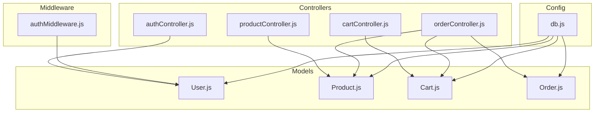
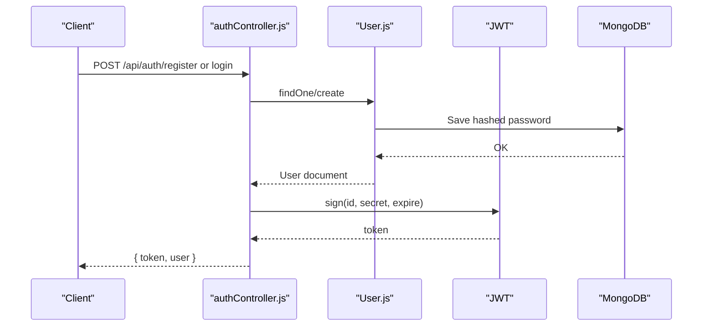
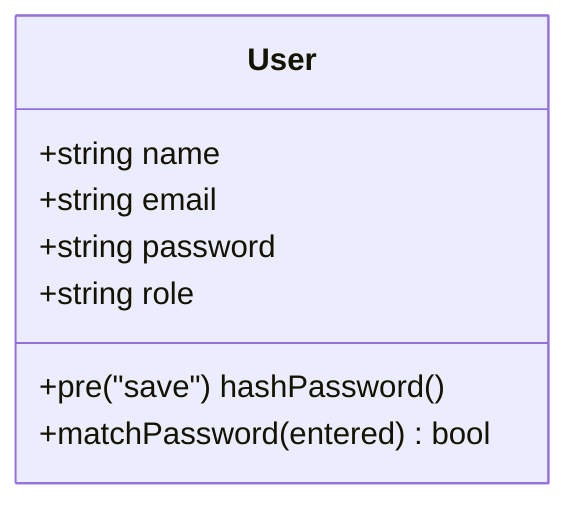
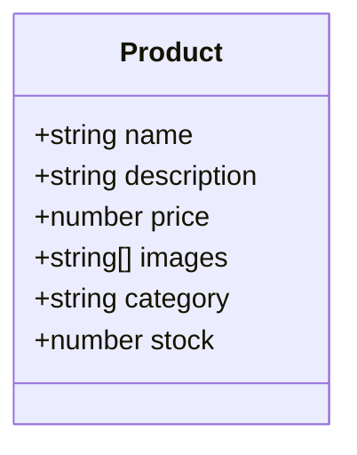
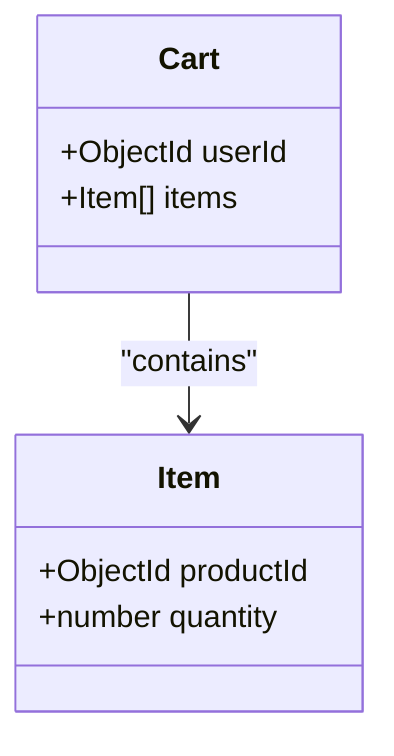
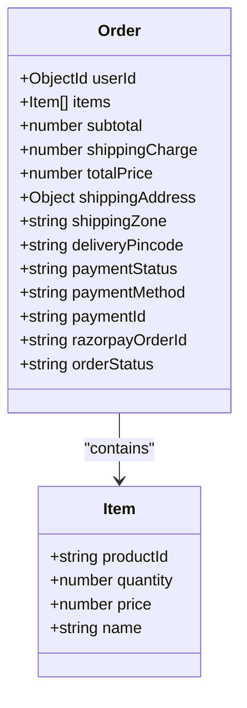
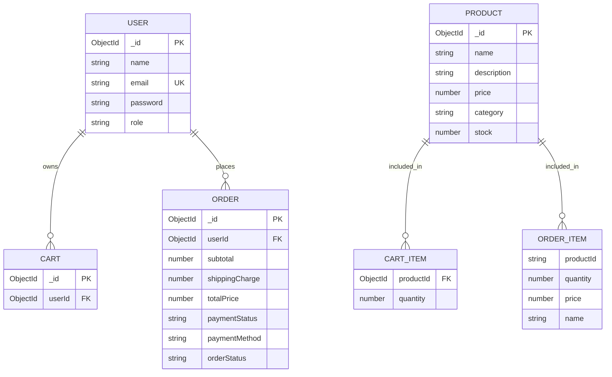
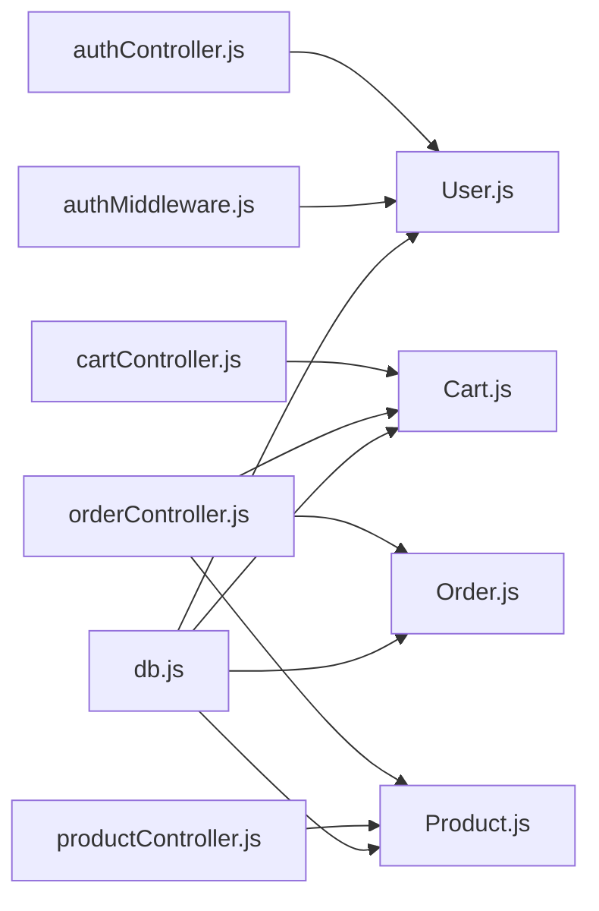

# Database Schemas & Models

<cite>
**Referenced Files in This Document**
- [User.js](file://backend/models/User.js)
- [Product.js](file://backend/models/Product.js)
- [Cart.js](file://backend/models/Cart.js)
- [Order.js](file://backend/models/Order.js)
- [db.js](file://backend/config/db.js)
- [authController.js](file://backend/controllers/authController.js)
- [cartController.js](file://backend/controllers/cartController.js)
- [orderController.js](file://backend/controllers/orderController.js)
- [productController.js](file://backend/controllers/productController.js)
- [authMiddleware.js](file://backend/middleware/authMiddleware.js)
</cite>

## Table of Contents
1. [Introduction](#introduction)
2. [Project Structure](#project-structure)
3. [Core Components](#core-components)
4. [Architecture Overview](#architecture-overview)
5. [Detailed Component Analysis](#detailed-component-analysis)
6. [Dependency Analysis](#dependency-analysis)
7. [Performance Considerations](#performance-considerations)
8. [Troubleshooting Guide](#troubleshooting-guide)
9. [Conclusion](#conclusion)
10. [Appendices](#appendices)

## Introduction
This document provides comprehensive data model documentation for the E-commerce App’s MongoDB schemas. It details the User, Product, Cart, and Order models, including field definitions, data types, validation rules, indexes, and constraints. It also explains entity relationships, data access patterns, query optimization strategies, and operational considerations such as data lifecycle, retention, and security.

## Project Structure
The data models are implemented as Mongoose schemas under the backend/models directory. They are consumed by controllers and middleware to enforce business logic and access control. The database connection is configured centrally and used across the application.

**Diagram sources**
- [User.js:1-20](file://backend/models/User.js#L1-L20)
- [Product.js:1-12](file://backend/models/Product.js#L1-L12)
- [Cart.js:1-12](file://backend/models/Cart.js#L1-L12)
- [Order.js:1-33](file://backend/models/Order.js#L1-L33)
- [authController.js:1-27](file://backend/controllers/authController.js#L1-L27)
- [cartController.js:1-38](file://backend/controllers/cartController.js#L1-L38)
- [orderController.js:1-146](file://backend/controllers/orderController.js#L1-L146)
- [productController.js:1-127](file://backend/controllers/productController.js#L1-L127)
- [authMiddleware.js:1-20](file://backend/middleware/authMiddleware.js#L1-L20)
- [db.js:1-14](file://backend/config/db.js#L1-L14)

**Section sources**
- [User.js:1-20](file://backend/models/User.js#L1-L20)
- [Product.js:1-12](file://backend/models/Product.js#L1-L12)
- [Cart.js:1-12](file://backend/models/Cart.js#L1-L12)
- [Order.js:1-33](file://backend/models/Order.js#L1-L33)
- [db.js:1-14](file://backend/config/db.js#L1-L14)

## Core Components
This section documents each model’s fields, data types, validation rules, and indexes.

- User
  - Fields: name (String, required), email (String, required, unique), password (String, required), role (Enum: user/admin, default user)
  - Indexes: email unique index enforced by schema option
  - Hooks: pre-save hashing of password
  - Methods: matchPassword for verifying credentials
  - Authentication flow: JWT signed token stored client-side; protected routes strip password and restrict access by role

- Product
  - Fields: name (String, required), description (String, required), price (Number, required), images (Array of String), category (String, required), stock (Number, required, default 0)
  - Timestamps: createdAt, updatedAt
  - Validation: No explicit schema-level validators beyond required/defaults

- Cart
  - Fields: userId (ObjectId, required, references User), items (Array of embedded documents)
    - items.productId (ObjectId, references Product)
    - items.quantity (Number, default 1, min 1)
  - Indexes: unique compound index on userId
  - Access pattern: One cart per user; populated on read to resolve product details

- Order
  - Fields: userId (ObjectId, required, references User), items (Array of embedded documents)
    - items.productId (String), items.quantity (Number), items.price (Number), items.name (String)
  - Pricing: subtotal (Number, required), shippingCharge (Number, default 0), totalPrice (Number, required)
  - Shipping: shippingAddress (Object, required), shippingZone (String), deliveryPincode (String)
  - Payment: paymentStatus (Enum: paid/pending/failed, default pending), paymentMethod (Enum: razorpay/cod, default razorpay), paymentId (String), razorpayOrderId (String)
  - Tracking: orderStatus (Enum: Pending/Shipped/Delivered/Cancelled, default Pending)
  - Timestamps: createdAt, updatedAt

**Section sources**
- [User.js:4-18](file://backend/models/User.js#L4-L18)
- [Product.js:3-10](file://backend/models/Product.js#L3-L10)
- [Cart.js:3-11](file://backend/models/Cart.js#L3-L11)
- [Order.js:3-31](file://backend/models/Order.js#L3-L31)
- [authController.js:6-26](file://backend/controllers/authController.js#L6-L26)
- [authMiddleware.js:4-15](file://backend/middleware/authMiddleware.js#L4-L15)

## Architecture Overview
The models are used by controllers to implement CRUD operations and business logic. Authentication middleware enforces access control. The database connection is established centrally.

**Diagram sources**
- [authController.js:6-26](file://backend/controllers/authController.js#L6-L26)
- [User.js:11-18](file://backend/models/User.js#L11-L18)
- [db.js:5-13](file://backend/config/db.js#L5-L13)

## Detailed Component Analysis

### User Model
- Purpose: Store user identity, authentication credentials, and roles.
- Security:
  - Password is hashed before save using a pre-save hook.
  - Authentication middleware verifies JWT and excludes password from response.
  - Role-based access control enforced for admin-only endpoints.
- Relationships:
  - Cart.userId references User._id.
  - Order.userId references User._id.
- Validation:
  - Email uniqueness enforced by schema-level unique constraint.
  - Role constrained to predefined values.

**Diagram sources**
- [User.js:4-18](file://backend/models/User.js#L4-L18)
- [authMiddleware.js:17-20](file://backend/middleware/authMiddleware.js#L17-L20)

**Section sources**
- [User.js:4-18](file://backend/models/User.js#L4-L18)
- [authMiddleware.js:17-20](file://backend/middleware/authMiddleware.js#L17-L20)

### Product Model
- Purpose: Catalog product information, pricing, inventory, and media references.
- Validation:
  - Required fields enforced at schema level.
  - No explicit schema-level validators for price/stock beyond required/default.
- Media:
  - images is an array of strings; controller logic limits to 3 images and stores local paths.

**Diagram sources**
- [Product.js:3-10](file://backend/models/Product.js#L3-L10)
- [productController.js:52-73](file://backend/controllers/productController.js#L52-L73)

**Section sources**
- [Product.js:3-10](file://backend/models/Product.js#L3-L10)
- [productController.js:52-73](file://backend/controllers/productController.js#L52-L73)

### Cart Model
- Purpose: Persist temporary shopping data per user with session-like semantics.
- Constraints:
  - Unique index on userId ensures one cart per user.
  - Quantity minimum is 1.
- Relationships:
  - Embedded items reference Product by ObjectId.
- Access pattern:
  - On first access, cart is created if missing.
  - Populate resolves productId to product details for display.

**Diagram sources**
- [Cart.js:3-11](file://backend/models/Cart.js#L3-L11)
- [cartController.js:3-22](file://backend/controllers/cartController.js#L3-L22)

**Section sources**
- [Cart.js:3-11](file://backend/models/Cart.js#L3-L11)
- [cartController.js:3-22](file://backend/controllers/cartController.js#L3-L22)

### Order Model
- Purpose: Capture transaction records, shipping, payment, and fulfillment tracking.
- Validation:
  - Enumerated fields constrain paymentStatus, paymentMethod, and orderStatus.
  - Embedded items array captures productId, quantity, price, and name.
- Business logic:
  - Payment verification updates paymentStatus and orderStatus.
  - Admin can update orderStatus with validation.
  - Cart is cleared upon successful order creation.

**Diagram sources**
- [Order.js:3-31](file://backend/models/Order.js#L3-L31)
- [orderController.js:83-146](file://backend/controllers/orderController.js#L83-L146)

**Section sources**
- [Order.js:3-31](file://backend/models/Order.js#L3-L31)
- [orderController.js:83-146](file://backend/controllers/orderController.js#L83-L146)

### Entity Relationships

**Diagram sources**
- [User.js:4-8](file://backend/models/User.js#L4-L8)
- [Product.js:3-10](file://backend/models/Product.js#L3-L10)
- [Cart.js:3-8](file://backend/models/Cart.js#L3-L8)
- [Order.js:3-11](file://backend/models/Order.js#L3-L11)

## Dependency Analysis
- Controllers depend on models for data access and business logic.
- Middleware depends on User model for authentication and authorization.
- Database connection is centralized and used by all models.

**Diagram sources**
- [authController.js:1-27](file://backend/controllers/authController.js#L1-L27)
- [cartController.js:1-38](file://backend/controllers/cartController.js#L1-L38)
- [orderController.js:1-146](file://backend/controllers/orderController.js#L1-L146)
- [productController.js:1-127](file://backend/controllers/productController.js#L1-L127)
- [authMiddleware.js:1-20](file://backend/middleware/authMiddleware.js#L1-L20)
- [db.js:1-14](file://backend/config/db.js#L1-L14)

**Section sources**
- [authController.js:1-27](file://backend/controllers/authController.js#L1-L27)
- [cartController.js:1-38](file://backend/controllers/cartController.js#L1-L38)
- [orderController.js:1-146](file://backend/controllers/orderController.js#L1-L146)
- [productController.js:1-127](file://backend/controllers/productController.js#L1-L127)
- [authMiddleware.js:1-20](file://backend/middleware/authMiddleware.js#L1-L20)
- [db.js:1-14](file://backend/config/db.js#L1-L14)

## Performance Considerations
- Indexes
  - Unique index on User.email improves login and registration lookups.
  - Unique index on Cart.userId ensures fast per-user cart retrieval.
- Population vs Embedding
  - Cart items embed productId and populate on read to avoid joins.
  - Order items embed productId as String; consider ObjectId for referential integrity if needed.
- Query Patterns
  - Product listing uses regex search on name and description; consider adding text indexes for better performance.
  - Sorting by createdAt desc is common; ensure indexes support efficient sorting.
- Caching
  - Consider caching frequently accessed product lists and cart contents.
- Write Patterns
  - Cart updates are in-memory array manipulation; ensure minimal writes and batch operations where possible.
- Payment Verification
  - Payment verification updates order status; ensure atomicity and idempotency checks.

[No sources needed since this section provides general guidance]

## Troubleshooting Guide
- Authentication
  - Invalid credentials: Ensure email exists and password matches hashed value.
  - Invalid token: Verify JWT secret and expiration.
  - Access denied: Confirm user role is admin for admin endpoints.
- Cart Operations
  - Cart not found: Controller creates a new cart on first access.
  - Quantity validation: Ensure quantity is greater than zero.
- Order Creation
  - Cart empty: Prevent order creation if cart is empty.
  - Payment verification: Validate signature and update statuses accordingly.
- Database Connectivity
  - Connection errors: Verify MONGO_URI and network connectivity.

**Section sources**
- [authController.js:6-26](file://backend/controllers/authController.js#L6-L26)
- [authMiddleware.js:4-15](file://backend/middleware/authMiddleware.js#L4-L15)
- [cartController.js:3-38](file://backend/controllers/cartController.js#L3-L38)
- [orderController.js:83-146](file://backend/controllers/orderController.js#L83-L146)
- [db.js:5-13](file://backend/config/db.js#L5-L13)

## Conclusion
The E-commerce App’s MongoDB schema design emphasizes simplicity and clarity with embedded arrays for cart and order items, and references for user ownership. Strong authentication and authorization controls are enforced via middleware and controller logic. The schema supports core e-commerce operations with clear constraints and enums for payment and order status. For production, consider adding text indexes for product search, optimizing cart updates, and implementing idempotent payment verification.

[No sources needed since this section summarizes without analyzing specific files]

## Appendices

### Data Lifecycle, Retention, and Archival
- Retention: Orders can be retained indefinitely; consider archiving older orders to separate collections or collections with reduced indexing.
- Purging: Implement scheduled jobs to remove abandoned carts older than a threshold.
- Compliance: Ensure deletion requests can purge user data and associated orders per privacy regulations.

[No sources needed since this section provides general guidance]

### Security, Privacy, and Access Control
- Authentication: JWT tokens are used; ensure secure storage and transmission.
- Authorization: Admin-only endpoints require role-based checks.
- Data Protection: Hash passwords; avoid logging sensitive fields; sanitize inputs.

**Section sources**
- [authController.js:4-14](file://backend/controllers/authController.js#L4-L14)
- [authMiddleware.js:17-20](file://backend/middleware/authMiddleware.js#L17-L20)
- [User.js:11-18](file://backend/models/User.js#L11-L18)

### Sample Data Examples
- User
  - name: "Alice Doe"
  - email: "alice@example.com"
  - password: "hashed_value"
  - role: "user"
- Product
  - name: "Wireless Headphones"
  - description: "Noise-cancelling headphones"
  - price: 1299
  - images: ["/uploads/headphones.jpg"]
  - category: "Electronics"
  - stock: 50
- Cart
  - userId: ObjectId(...)
  - items: [
      { productId: ObjectId(...), quantity: 2 }
    ]
- Order
  - userId: ObjectId(...)
  - items: [
      { productId: "abc123", quantity: 1, price: 1299, name: "Wireless Headphones" }
    ]
  - subtotal: 1299
  - shippingCharge: 0
  - totalPrice: 1299
  - shippingAddress: { street: "...", city: "...", pincode: "..." }
  - paymentStatus: "pending"
  - paymentMethod: "razorpay"
  - orderStatus: "Pending"

[No sources needed since this section provides general guidance]