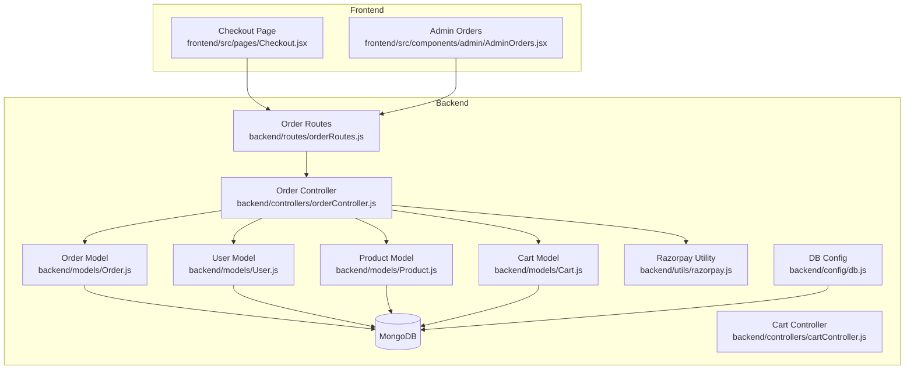
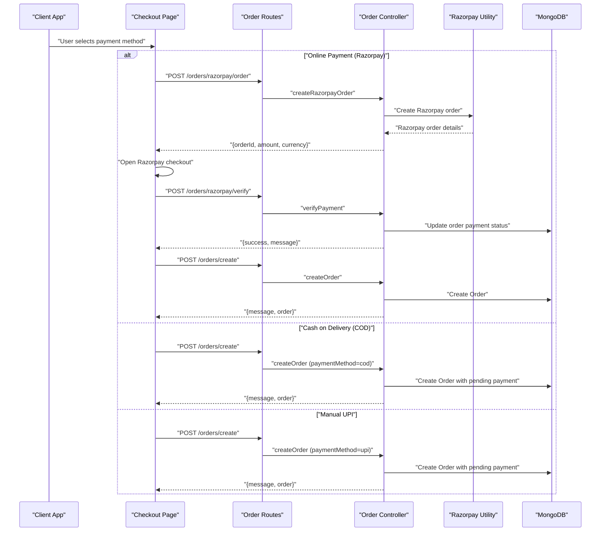
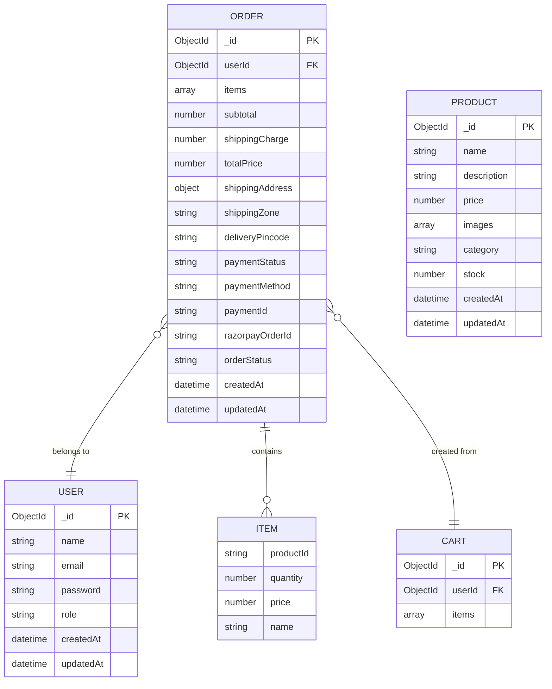
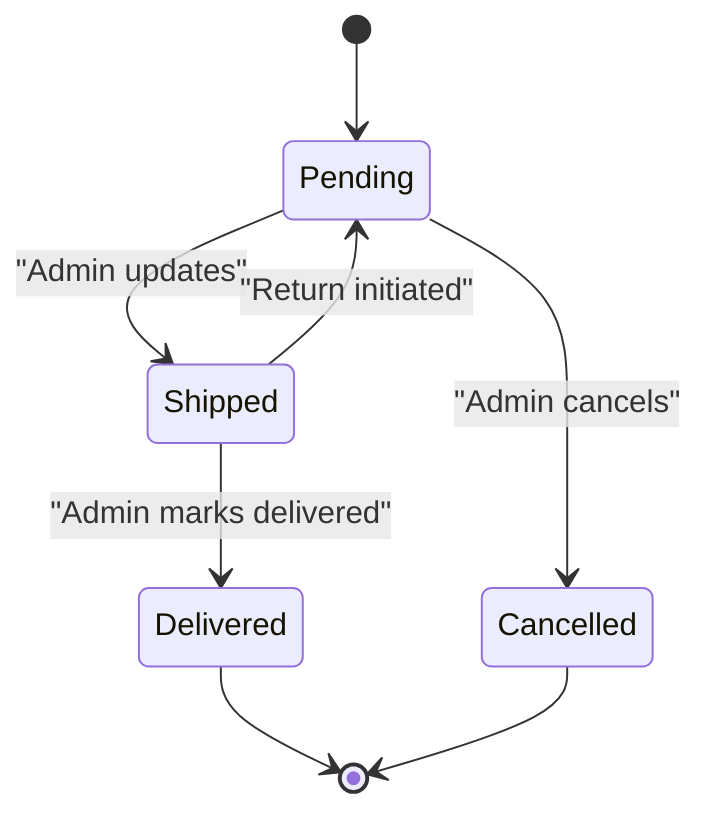
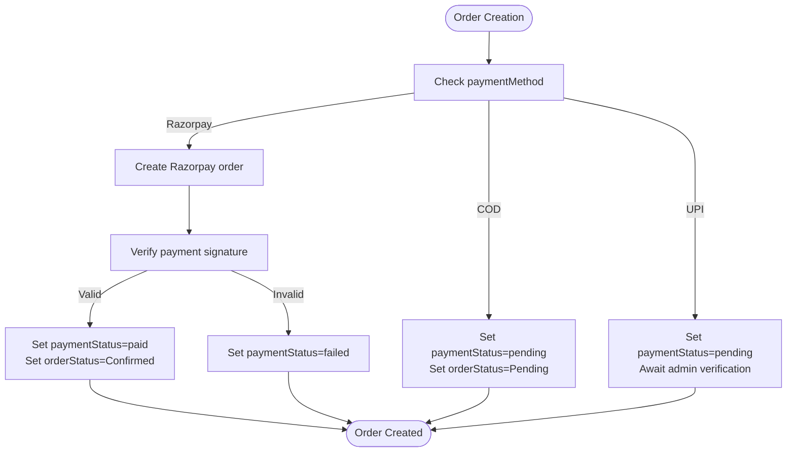
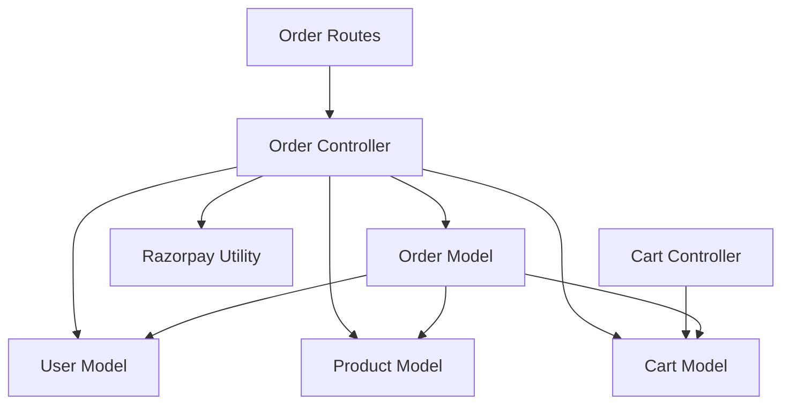

# Order Model

<cite>
**Referenced Files in This Document**
- [Order.js](file://backend/models/Order.js)
- [User.js](file://backend/models/User.js)
- [Product.js](file://backend/models/Product.js)
- [Cart.js](file://backend/models/Cart.js)
- [orderController.js](file://backend/controllers/orderController.js)
- [orderRoutes.js](file://backend/routes/orderRoutes.js)
- [razorpay.js](file://backend/utils/razorpay.js)
- [Checkout.jsx](file://frontend/src/pages/Checkout.jsx)
- [AdminOrders.jsx](file://frontend/src/components/admin/AdminOrders.jsx)
- [cartController.js](file://backend/controllers/cartController.js)
- [db.js](file://backend/config/db.js)
</cite>

## Table of Contents
1. [Introduction](#introduction)
2. [Project Structure](#project-structure)
3. [Core Components](#core-components)
4. [Architecture Overview](#architecture-overview)
5. [Detailed Component Analysis](#detailed-component-analysis)
6. [Dependency Analysis](#dependency-analysis)
7. [Performance Considerations](#performance-considerations)
8. [Troubleshooting Guide](#troubleshooting-guide)
9. [Conclusion](#conclusion)
10. [Appendices](#appendices)

## Introduction
This document provides comprehensive data model documentation for the Order model within an e-commerce application. It details the complete transaction record schema, including user associations, product items, shipping information, payment details, and order status tracking. It also explains order lifecycle states, payment processing fields, fulfillment tracking, order composition with product references, quantities, pricing, and totals calculation, shipping address fields, delivery status, and tracking information. Additionally, it documents payment integration fields, transaction IDs, payment status verification, examples of order creation, payment processing, status updates, and order fulfillment, along with relationships to User, Product, and Cart models. The document addresses order history management, return processing, and order analytics, explains data validation rules, business logic constraints, and audit trail requirements, and includes performance considerations for order queries and reporting.

## Project Structure
The Order model is part of a layered architecture:
- Backend: Mongoose models define schemas, controllers implement business logic, routes expose endpoints, and utilities integrate third-party services.
- Frontend: React components manage user interactions for checkout, order placement, and admin order management.

**Diagram sources**
- [Order.js:1-33](file://backend/models/Order.js#L1-L33)
- [User.js:1-20](file://backend/models/User.js#L1-L20)
- [Product.js:1-12](file://backend/models/Product.js#L1-L12)
- [Cart.js:1-12](file://backend/models/Cart.js#L1-L12)
- [orderController.js:1-146](file://backend/controllers/orderController.js#L1-L146)
- [orderRoutes.js:1-28](file://backend/routes/orderRoutes.js#L1-L28)
- [razorpay.js:1-10](file://backend/utils/razorpay.js#L1-L10)
- [Checkout.jsx:1-301](file://frontend/src/pages/Checkout.jsx#L1-L301)
- [AdminOrders.jsx:1-213](file://frontend/src/components/admin/AdminOrders.jsx#L1-L213)
- [cartController.js:1-38](file://backend/controllers/cartController.js#L1-L38)
- [db.js:1-14](file://backend/config/db.js#L1-L14)

**Section sources**
- [Order.js:1-33](file://backend/models/Order.js#L1-L33)
- [User.js:1-20](file://backend/models/User.js#L1-L20)
- [Product.js:1-12](file://backend/models/Product.js#L1-L12)
- [Cart.js:1-12](file://backend/models/Cart.js#L1-L12)
- [orderController.js:1-146](file://backend/controllers/orderController.js#L1-L146)
- [orderRoutes.js:1-28](file://backend/routes/orderRoutes.js#L1-L28)
- [razorpay.js:1-10](file://backend/utils/razorpay.js#L1-L10)
- [Checkout.jsx:1-301](file://frontend/src/pages/Checkout.jsx#L1-L301)
- [AdminOrders.jsx:1-213](file://frontend/src/components/admin/AdminOrders.jsx#L1-L213)
- [cartController.js:1-38](file://backend/controllers/cartController.js#L1-L38)
- [db.js:1-14](file://backend/config/db.js#L1-L14)

## Core Components
This section documents the Order model schema and its relationships with other models.

- Order Schema Fields
  - userId: ObjectId referencing User; required; links orders to users.
  - items: Array of item objects containing productId, quantity, price, and name.
  - Pricing breakdown: subtotal, shippingCharge, totalPrice; required for financial records.
  - Shipping details: shippingAddress (object), shippingZone, deliveryPincode.
  - Payment details: paymentStatus (enum), paymentMethod (enum), paymentId, razorpayOrderId.
  - Order tracking: orderStatus (enum); timestamps enabled.

- Relationships
  - User association: Each order belongs to a user via userId.
  - Product association: Items reference product details captured at order time (productId, name, price).
  - Cart association: Orders are created from the user's cart; upon successful order placement, the cart is cleared.

- Validation and Constraints
  - Required fields: userId, items, subtotal, totalPrice.
  - Enumerations: paymentStatus, paymentMethod, orderStatus.
  - Defaults: shippingCharge default 0, paymentStatus default pending, orderStatus default Pending.

**Section sources**
- [Order.js:3-31](file://backend/models/Order.js#L3-L31)
- [User.js:4-9](file://backend/models/User.js#L4-L9)
- [Product.js:3-10](file://backend/models/Product.js#L3-L10)
- [Cart.js:3-11](file://backend/models/Cart.js#L3-L11)

## Architecture Overview
The order lifecycle spans frontend interactions, backend controllers, and database persistence. Payment processing integrates with Razorpay for online transactions, while COD and manual UPI options are supported.

**Diagram sources**
- [Checkout.jsx:88-137](file://frontend/src/pages/Checkout.jsx#L88-L137)
- [orderRoutes.js:20-22](file://backend/routes/orderRoutes.js#L20-L22)
- [orderController.js:39-67](file://backend/controllers/orderController.js#L39-L67)
- [razorpay.js:5-8](file://backend/utils/razorpay.js#L5-L8)
- [orderController.js:83-146](file://backend/controllers/orderController.js#L83-L146)

## Detailed Component Analysis

### Order Model Schema
The Order model defines the transaction record structure with embedded product references and comprehensive tracking fields.

**Diagram sources**
- [Order.js:3-31](file://backend/models/Order.js#L3-L31)
- [User.js:4-9](file://backend/models/User.js#L4-L9)
- [Product.js:3-10](file://backend/models/Product.js#L3-L10)
- [Cart.js:3-11](file://backend/models/Cart.js#L3-L11)

**Section sources**
- [Order.js:3-31](file://backend/models/Order.js#L3-L31)

### Order Lifecycle States
Order lifecycle states are managed through the orderStatus field with transitions controlled by the admin controller.

**Diagram sources**
- [Order.js:29-30](file://backend/models/Order.js#L29-L30)
- [orderController.js:69-81](file://backend/controllers/orderController.js#L69-L81)

**Section sources**
- [Order.js:29-30](file://backend/models/Order.js#L29-L30)
- [orderController.js:69-81](file://backend/controllers/orderController.js#L69-L81)

### Payment Processing Fields
Payment processing integrates multiple methods with distinct behaviors and verification steps.

- Razorpay Integration
  - Creates a Razorpay order server-side.
  - Verifies payment signature client-side and updates order payment status.
  - Sets paymentStatus to paid and orderStatus to Confirmed upon successful verification.

- Cash on Delivery (COD)
  - paymentMethod set to cod.
  - paymentStatus remains pending until admin confirms.

- Manual UPI
  - paymentMethod set to upi.
  - paymentStatus remains pending until admin verifies.

**Diagram sources**
- [orderController.js:39-67](file://backend/controllers/orderController.js#L39-L67)
- [orderController.js:83-146](file://backend/controllers/orderController.js#L83-L146)
- [Checkout.jsx:88-137](file://frontend/src/pages/Checkout.jsx#L88-L137)

**Section sources**
- [orderController.js:24-27](file://backend/controllers/orderController.js#L24-L27)
- [orderController.js:39-67](file://backend/controllers/orderController.js#L39-L67)
- [orderController.js:83-146](file://backend/controllers/orderController.js#L83-L146)
- [Checkout.jsx:88-137](file://frontend/src/pages/Checkout.jsx#L88-L137)

### Fulfillment Tracking
Fulfillment tracking is handled via orderStatus updates by administrators, with UI support for status transitions.

- Admin Actions
  - Retrieve all orders with user details.
  - Update orderStatus to Pending, Shipped, Delivered, or Cancelled.

- Frontend Admin Orders
  - Displays orders with filtering by status.
  - Provides buttons to update status with immediate feedback.

**Section sources**
- [orderController.js:29-37](file://backend/controllers/orderController.js#L29-L37)
- [orderController.js:69-81](file://backend/controllers/orderController.js#L69-L81)
- [AdminOrders.jsx:67-191](file://frontend/src/components/admin/AdminOrders.jsx#L67-L191)

### Order Composition and Totals Calculation
Order composition captures product references, quantities, pricing, and calculates totals.

- Item Composition
  - Items array built from populated cart items, capturing productId, quantity, price, and name.

- Totals Calculation
  - subtotal computed from items.
  - totalPrice equals subtotal plus shippingCharge.
  - Supports passing explicit subtotal and total values from frontend.

- Cart Integration
  - Orders are created from the user's cart; upon successful order creation, the cart is cleared.

**Section sources**
- [orderController.js:83-146](file://backend/controllers/orderController.js#L83-L146)
- [cartController.js:3-7](file://backend/controllers/cartController.js#L3-L7)

### Shipping Information and Delivery Tracking
Shipping information is captured during checkout and stored with the order.

- Shipping Address
  - Full address object including fullName, phone, address, city, state, pincode, country.

- Shipping Zone and Pincode
  - shippingZone indicates zone classification.
  - deliveryPincode stores customer pincode for delivery tracking.

- Frontend Display
  - AdminOrders component renders shipping address and pincode for visibility.

**Section sources**
- [Order.js:18-21](file://backend/models/Order.js#L18-L21)
- [Checkout.jsx:17-19](file://frontend/src/pages/Checkout.jsx#L17-L19)
- [AdminOrders.jsx:113-124](file://frontend/src/components/admin/AdminOrders.jsx#L113-L124)

### Payment Integration Fields and Verification
Payment integration fields capture transaction identifiers and statuses for reconciliation.

- Payment Fields
  - paymentStatus: Enumerated values (paid, pending, failed).
  - paymentMethod: Enumerated values (razorpay, cod).
  - paymentId: Transaction identifier for non-COD methods.
  - razorpayOrderId: Razorpay order identifier.

- Verification Flow
  - Razorpay signature verification performed server-side.
  - On success, paymentStatus updated to paid and orderStatus to Confirmed.

**Section sources**
- [Order.js:23-27](file://backend/models/Order.js#L23-L27)
- [orderController.js:52-67](file://backend/controllers/orderController.js#L52-L67)

### Examples

#### Example 1: Order Creation with Razorpay
- Frontend triggers creation of a Razorpay order, opens checkout, and verifies payment.
- Backend creates the order with payment details and sets status accordingly.

**Section sources**
- [Checkout.jsx:88-137](file://frontend/src/pages/Checkout.jsx#L88-L137)
- [orderController.js:39-67](file://backend/controllers/orderController.js#L39-L67)
- [orderController.js:83-146](file://backend/controllers/orderController.js#L83-L146)

#### Example 2: Order Creation with COD
- Frontend submits order with paymentMethod set to cod.
- Backend creates order with pending payment status.

**Section sources**
- [Checkout.jsx:67-86](file://frontend/src/pages/Checkout.jsx#L67-L86)
- [orderController.js:83-146](file://backend/controllers/orderController.js#L83-L146)

#### Example 3: Order Status Update (Admin)
- Admin retrieves orders and updates status to Shipped or Delivered.
- Frontend displays updated status with color-coded badges.

**Section sources**
- [orderController.js:29-37](file://backend/controllers/orderController.js#L29-L37)
- [orderController.js:69-81](file://backend/controllers/orderController.js#L69-L81)
- [AdminOrders.jsx:67-191](file://frontend/src/components/admin/AdminOrders.jsx#L67-L191)

### Relationship with User, Product, and Cart Models
- User Association
  - Orders belong to users via userId; populated in admin views for customer details.
- Product Association
  - Items embed product details (productId, name, price) at order time; Product model defines product attributes.
- Cart Association
  - Orders are created from the user's cart; cart is cleared after successful order placement.

**Section sources**
- [Order.js](file://backend/models/Order.js#L4)
- [User.js:4-9](file://backend/models/User.js#L4-L9)
- [Product.js:3-10](file://backend/models/Product.js#L3-L10)
- [Cart.js:3-11](file://backend/models/Cart.js#L3-L11)
- [orderController.js:83-146](file://backend/controllers/orderController.js#L83-L146)
- [cartController.js:3-7](file://backend/controllers/cartController.js#L3-L7)

### Order History Management and Analytics
- Order History
  - Users can retrieve their order history sorted by creation date.
  - Admins can view all orders with user details and sort by date.
- Analytics
  - Dashboard aggregates user count, total orders, and total revenue from paid orders.

**Section sources**
- [orderController.js:19-27](file://backend/controllers/orderController.js#L19-L27)
- [orderController.js:29-37](file://backend/controllers/orderController.js#L29-L37)
- [AdminOrders.jsx:15-34](file://frontend/src/components/admin/AdminOrders.jsx#L15-L34)

### Data Validation Rules and Business Logic Constraints
- Required Fields
  - userId, items, subtotal, totalPrice must be present.
- Enumerations
  - paymentStatus, paymentMethod, orderStatus constrained to predefined values.
- Defaults
  - shippingCharge defaults to 0; paymentStatus defaults to pending; orderStatus defaults to Pending.
- Business Logic
  - COD sets paymentStatus to pending and orderStatus to Pending.
  - Razorpay verification sets paymentStatus to paid and orderStatus to Confirmed.
  - Cart must not be empty for order creation.

**Section sources**
- [Order.js:14-16](file://backend/models/Order.js#L14-L16)
- [Order.js:24-27](file://backend/models/Order.js#L24-L27)
- [Order.js:29-30](file://backend/models/Order.js#L29-L30)
- [orderController.js:98-99](file://backend/controllers/orderController.js#L98-L99)
- [orderController.js:110-112](file://backend/controllers/orderController.js#L110-L112)

### Audit Trail Requirements
- Timestamps
  - createdAt and updatedAt automatically maintained by Mongoose.
- Access Control
  - Users can only access their own orders; admins can access all orders.
- Payment Verification Logs
  - Razorpay signature verification recorded in payment verification endpoint.

**Section sources**
- [Order.js](file://backend/models/Order.js#L31)
- [orderController.js:8-17](file://backend/controllers/orderController.js#L8-L17)
- [orderController.js:52-67](file://backend/controllers/orderController.js#L52-L67)

## Dependency Analysis
This section analyzes dependencies between components and highlights potential circular dependencies and external integrations.

**Diagram sources**
- [Order.js:1-33](file://backend/models/Order.js#L1-L33)
- [User.js:1-20](file://backend/models/User.js#L1-L20)
- [Product.js:1-12](file://backend/models/Product.js#L1-L12)
- [Cart.js:1-12](file://backend/models/Cart.js#L1-L12)
- [orderController.js:1-6](file://backend/controllers/orderController.js#L1-L6)
- [orderRoutes.js:1-11](file://backend/routes/orderRoutes.js#L1-L11)
- [razorpay.js:1-10](file://backend/utils/razorpay.js#L1-L10)
- [cartController.js:1-2](file://backend/controllers/cartController.js#L1-L2)

**Section sources**
- [orderController.js:1-6](file://backend/controllers/orderController.js#L1-L6)
- [orderRoutes.js:1-11](file://backend/routes/orderRoutes.js#L1-L11)
- [razorpay.js:1-10](file://backend/utils/razorpay.js#L1-L10)
- [cartController.js:1-2](file://backend/controllers/cartController.js#L1-L2)

## Performance Considerations
- Indexing
  - Consider adding indexes on frequently queried fields such as userId, createdAt, and orderStatus to optimize order history and analytics queries.
- Population vs. Embedding
  - Items currently embed product details at order time. For frequent analytics on product sales, consider referencing Product by ID and populating only when needed to reduce document size.
- Aggregation Pipelines
  - Use aggregation for revenue calculations and order summaries to minimize round trips and leverage database-side computation.
- Pagination
  - Implement pagination for retrieving large order histories to prevent memory issues.
- Caching
  - Cache frequently accessed order summaries and user order counts to reduce database load.

[No sources needed since this section provides general guidance]

## Troubleshooting Guide
Common issues and resolutions:

- Order Not Found
  - Ensure the requesting user owns the order or is an admin; otherwise access is denied.
- Cart Is Empty
  - Orders cannot be created if the cart is empty; populate the cart before placing an order.
- Payment Verification Failure
  - Verify Razorpay signature and ensure correct environment variables are configured.
- Invalid Status Update
  - Only valid statuses can be set; ensure the status is one of Pending, Shipped, Delivered, or Cancelled.

**Section sources**
- [orderController.js:8-17](file://backend/controllers/orderController.js#L8-L17)
- [orderController.js:98-99](file://backend/controllers/orderController.js#L98-L99)
- [orderController.js:69-74](file://backend/controllers/orderController.js#L69-L74)

## Conclusion
The Order model provides a robust foundation for e-commerce transactions, integrating user, product, and cart data with flexible payment methods and comprehensive tracking. The schema supports multiple payment modes, maintains audit trails, and enables efficient order management through controllers and routes. By following the outlined validation rules, business logic constraints, and performance recommendations, the system ensures reliable order processing, accurate analytics, and scalable operations.

## Appendices

### API Endpoints for Orders
- POST /orders/razorpay/order: Create a Razorpay order for payment initiation.
- POST /orders/razorpay/verify: Verify Razorpay payment signature and update order status.
- POST /orders/create: Create an order from the user's cart with selected payment method.
- GET /orders/my: Retrieve the current user's order history.
- GET /orders/:id: Retrieve a specific order by ID (owner or admin access).
- GET /orders: Retrieve all orders (admin only).
- PUT /orders/:id/status: Update order status (admin only).

**Section sources**
- [orderRoutes.js:15-26](file://backend/routes/orderRoutes.js#L15-L26)