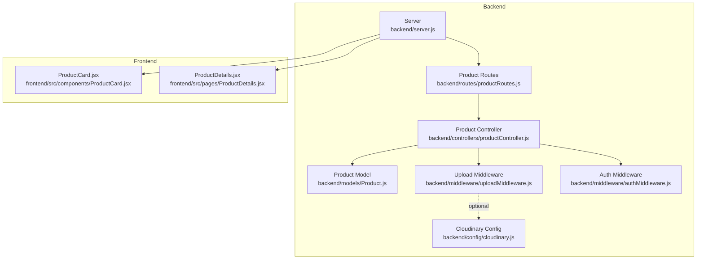
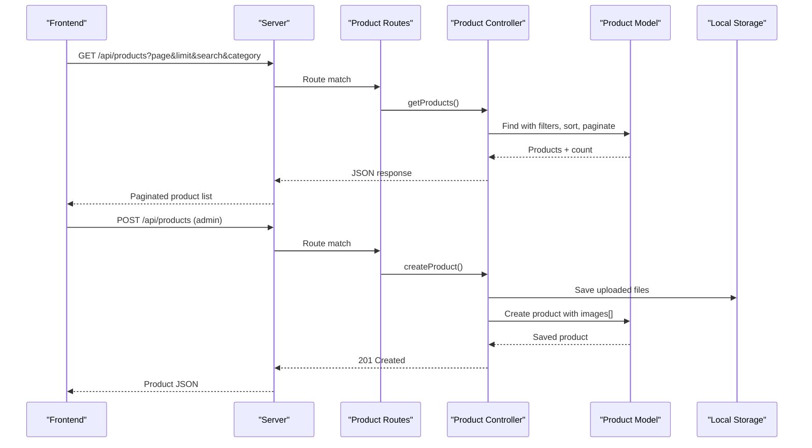
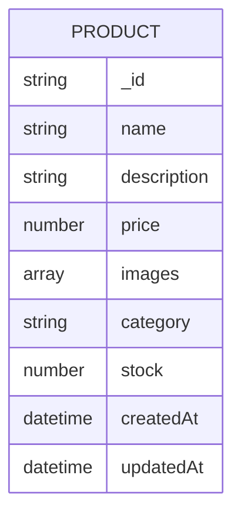
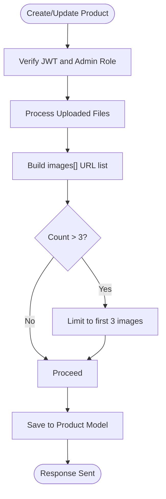
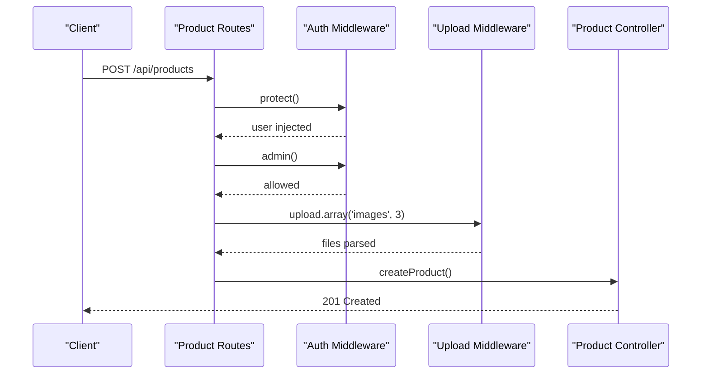
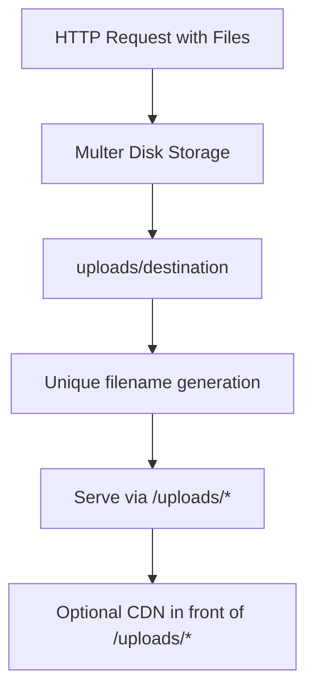
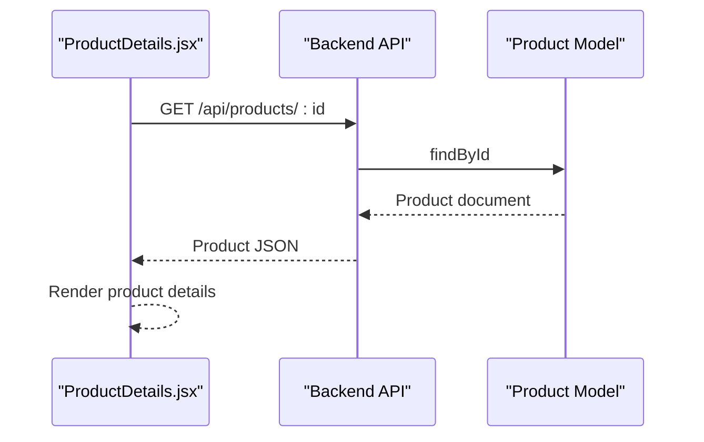
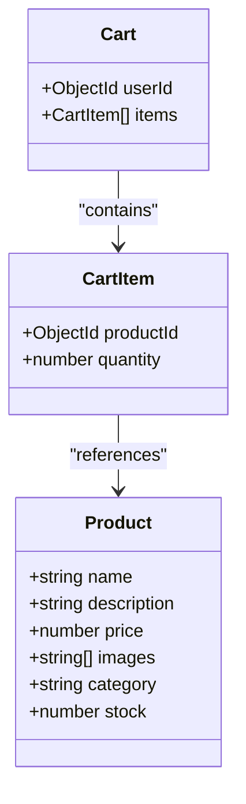
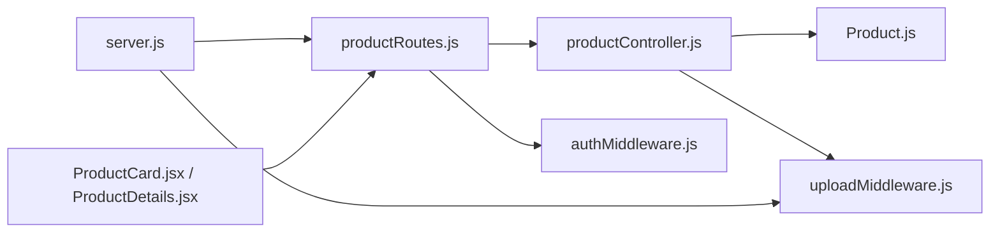

# Product Model

<cite>
**Referenced Files in This Document**
- [Product.js](file://backend/models/Product.js)
- [productController.js](file://backend/controllers/productController.js)
- [productRoutes.js](file://backend/routes/productRoutes.js)
- [uploadMiddleware.js](file://backend/middleware/uploadMiddleware.js)
- [cloudinary.js](file://backend/config/cloudinary.js)
- [authMiddleware.js](file://backend/middleware/authMiddleware.js)
- [server.js](file://backend/server.js)
- [ProductCard.jsx](file://frontend/src/components/ProductCard.jsx)
- [ProductDetails.jsx](file://frontend/src/pages/ProductDetails.jsx)
- [Cart.js](file://backend/models/Cart.js)
- [cartController.js](file://backend/controllers/cartController.js)
</cite>

## Table of Contents
1. [Introduction](#introduction)
2. [Project Structure](#project-structure)
3. [Core Components](#core-components)
4. [Architecture Overview](#architecture-overview)
5. [Detailed Component Analysis](#detailed-component-analysis)
6. [Dependency Analysis](#dependency-analysis)
7. [Performance Considerations](#performance-considerations)
8. [Troubleshooting Guide](#troubleshooting-guide)
9. [Conclusion](#conclusion)

## Introduction
This document provides comprehensive data model documentation for the Product model used in the ecommerce application. It covers the schema definition, validation rules, pricing and inventory constraints, category associations, media references, and the end-to-end workflows for product creation, updates, retrieval, and deletion. It also documents the integration with local file storage for images and how the frontend consumes product data for display and interaction.

## Project Structure
The Product model and its related functionality span the backend (Mongoose model, controller, routes, middleware) and the frontend (UI components that render product cards and details). The server serves static uploaded images and exposes REST endpoints for product management.

**Diagram sources**
- [Product.js:1-12](file://backend/models/Product.js#L1-L12)
- [productController.js:1-127](file://backend/controllers/productController.js#L1-L127)
- [productRoutes.js:1-23](file://backend/routes/productRoutes.js#L1-L23)
- [uploadMiddleware.js:1-30](file://backend/middleware/uploadMiddleware.js#L1-L30)
- [server.js:1-102](file://backend/server.js#L1-L102)
- [authMiddleware.js:1-20](file://backend/middleware/authMiddleware.js#L1-L20)
- [cloudinary.js:1-13](file://backend/config/cloudinary.js#L1-L13)
- [ProductCard.jsx:1-28](file://frontend/src/components/ProductCard.jsx#L1-L28)
- [ProductDetails.jsx:1-80](file://frontend/src/pages/ProductDetails.jsx#L1-L80)

**Section sources**
- [Product.js:1-12](file://backend/models/Product.js#L1-L12)
- [productController.js:1-127](file://backend/controllers/productController.js#L1-L127)
- [productRoutes.js:1-23](file://backend/routes/productRoutes.js#L1-L23)
- [uploadMiddleware.js:1-30](file://backend/middleware/uploadMiddleware.js#L1-L30)
- [server.js:1-102](file://backend/server.js#L1-L102)
- [authMiddleware.js:1-20](file://backend/middleware/authMiddleware.js#L1-L20)
- [cloudinary.js:1-13](file://backend/config/cloudinary.js#L1-L13)
- [ProductCard.jsx:1-28](file://frontend/src/components/ProductCard.jsx#L1-L28)
- [ProductDetails.jsx:1-80](file://frontend/src/pages/ProductDetails.jsx#L1-L80)

## Core Components
This section defines the Product data model and its validation rules, along with the business constraints enforced during product operations.

- Schema Fields and Types
  - name: String, required
  - description: String, required
  - price: Number, required
  - images: Array of String URLs
  - category: String, required
  - stock: Number, required, default 0
  - timestamps: createdAt, updatedAt (automatically managed)

- Validation Rules
  - All fields marked required must be present on create/update.
  - Price must be a positive number (enforced by type and application logic).
  - Stock must be a non-negative integer (enforced by type and application logic).
  - Images array is validated by the upload middleware to allow only specific MIME types and file size limits.

- Business Constraints
  - Maximum of 3 images per product during updates.
  - Search filters support category and free-text search across name and description.
  - Pagination is supported via page and limit query parameters.
  - Sorting defaults to newest-first by creation date.

**Section sources**
- [Product.js:3-10](file://backend/models/Product.js#L3-L10)
- [productController.js:4-37](file://backend/controllers/productController.js#L4-L37)
- [uploadMiddleware.js:14-28](file://backend/middleware/uploadMiddleware.js#L14-L28)
- [productController.js:75-113](file://backend/controllers/productController.js#L75-L113)

## Architecture Overview
The Product domain integrates with the server’s routing, authentication, and file upload middleware. The controller orchestrates product operations, while the model persists data to MongoDB. The frontend renders product listings and details using the backend APIs.

**Diagram sources**
- [server.js:54-63](file://backend/server.js#L54-L63)
- [productRoutes.js:14-21](file://backend/routes/productRoutes.js#L14-L21)
- [productController.js:3-37](file://backend/controllers/productController.js#L3-L37)
- [productController.js:51-73](file://backend/controllers/productController.js#L51-L73)
- [uploadMiddleware.js:4-12](file://backend/middleware/uploadMiddleware.js#L4-L12)
- [Product.js:1-12](file://backend/models/Product.js#L1-L12)

## Detailed Component Analysis

### Product Data Model
The Product model defines the canonical schema for product records, including identification, pricing, inventory, categorization, and media references.

- Field Definitions
  - _id: ObjectId (auto-generated)
  - name: Product title
  - description: Product details
  - price: Unit price in smallest currency unit
  - images: List of image URLs stored locally under /uploads
  - category: Product category string
  - stock: Available quantity
  - createdAt/updatedAt: Timestamps

- Validation and Defaults
  - Required fields enforced at schema level.
  - stock defaults to 0 if omitted.

**Diagram sources**
- [Product.js:3-10](file://backend/models/Product.js#L3-L10)

**Section sources**
- [Product.js:1-12](file://backend/models/Product.js#L1-L12)

### Product Controller Operations
The controller implements CRUD operations with search, filtering, pagination, and image handling.

- Retrieve Products
  - Filters: search term (case-insensitive substring match on name or description), category.
  - Sorting: newest first by createdAt.
  - Pagination: page and limit query parameters.
  - Response: products array plus pagination metadata.

- Retrieve Single Product
  - Fetch by ObjectId; 404 if not found.

- Create Product (Admin Only)
  - Authentication: JWT protected.
  - Authorization: admin role required.
  - Upload: Multer disk storage with file type and size limits.
  - Image URLs: constructed as /uploads/{filename}.
  - Validation: runValidators via Mongoose.

- Update Product (Admin Only)
  - Merge existing images with new uploads.
  - Enforce maximum 3 images.
  - Validation: runValidators via Mongoose.

- Delete Product (Admin Only)
  - Authentication and admin authorization required.

**Diagram sources**
- [productController.js:51-73](file://backend/controllers/productController.js#L51-L73)
- [productController.js:75-113](file://backend/controllers/productController.js#L75-L113)
- [uploadMiddleware.js:14-28](file://backend/middleware/uploadMiddleware.js#L14-L28)
- [authMiddleware.js:4-20](file://backend/middleware/authMiddleware.js#L4-L20)

**Section sources**
- [productController.js:3-37](file://backend/controllers/productController.js#L3-L37)
- [productController.js:39-49](file://backend/controllers/productController.js#L39-L49)
- [productController.js:51-73](file://backend/controllers/productController.js#L51-L73)
- [productController.js:75-113](file://backend/controllers/productController.js#L75-L113)
- [authMiddleware.js:1-20](file://backend/middleware/authMiddleware.js#L1-L20)

### Routing and Middleware
- Routes
  - GET /api/products: Public listing with search and filter.
  - GET /api/products/:id: Public single product.
  - POST /api/products: Admin-only creation with image upload.
  - PUT /api/products/:id: Admin-only update with image upload.
  - DELETE /api/products/:id: Admin-only deletion.

- Middleware
  - Authentication: JWT verification and user injection.
  - Authorization: admin role check.
  - Upload: Multer disk storage with file type and size limits.

**Diagram sources**
- [productRoutes.js:18-21](file://backend/routes/productRoutes.js#L18-L21)
- [authMiddleware.js:4-20](file://backend/middleware/authMiddleware.js#L4-L20)
- [uploadMiddleware.js:14-28](file://backend/middleware/uploadMiddleware.js#L14-L28)
- [productController.js:51-73](file://backend/controllers/productController.js#L51-L73)

**Section sources**
- [productRoutes.js:1-23](file://backend/routes/productRoutes.js#L1-L23)
- [authMiddleware.js:1-20](file://backend/middleware/authMiddleware.js#L1-L20)
- [uploadMiddleware.js:1-30](file://backend/middleware/uploadMiddleware.js#L1-L30)

### Media Handling and Storage
- Local Disk Storage
  - Destination: uploads/
  - Filename: timestamp + random + extension
  - Limits: max 5MB per file; allowed types: jpg, jpeg, png, webp
  - Serving: Static route /uploads/*
- Cloudinary Integration
  - Configured but not used for product images in current implementation.

**Diagram sources**
- [uploadMiddleware.js:4-12](file://backend/middleware/uploadMiddleware.js#L4-L12)
- [server.js:54-55](file://backend/server.js#L54-L55)

**Section sources**
- [uploadMiddleware.js:1-30](file://backend/middleware/uploadMiddleware.js#L1-L30)
- [server.js:54-55](file://backend/server.js#L54-L55)
- [cloudinary.js:1-13](file://backend/config/cloudinary.js#L1-L13)

### Frontend Integration
- Product Listing
  - ProductCard displays product images, name, and price.
  - Supports image carousel behavior via state.
- Product Details
  - Fetches product by ID and renders images, name, price, description, category, and stock status.
  - Integrates with cart functionality.

**Diagram sources**
- [ProductDetails.jsx:15-24](file://frontend/src/pages/ProductDetails.jsx#L15-L24)
- [productController.js:39-49](file://backend/controllers/productController.js#L39-L49)
- [Product.js:1-12](file://backend/models/Product.js#L1-L12)

**Section sources**
- [ProductCard.jsx:1-28](file://frontend/src/components/ProductCard.jsx#L1-L28)
- [ProductDetails.jsx:1-80](file://frontend/src/pages/ProductDetails.jsx#L1-L80)
- [productController.js:39-49](file://backend/controllers/productController.js#L39-L49)

### Inventory Management Logic
- Stock Representation
  - stock is a non-negative integer; default 0.
- Availability Display
  - Frontend conditionally renders availability text and button state based on stock > 0.
- Relationship with Cart
  - Cart items reference Product via productId; quantity is tracked per user.

**Diagram sources**
- [Product.js:3-10](file://backend/models/Product.js#L3-L10)
- [Cart.js:3-9](file://backend/models/Cart.js#L3-L9)

**Section sources**
- [Product.js:6-9](file://backend/models/Product.js#L6-L9)
- [ProductDetails.jsx:57-70](file://frontend/src/pages/ProductDetails.jsx#L57-L70)
- [Cart.js:1-12](file://backend/models/Cart.js#L1-L12)
- [cartController.js:1-38](file://backend/controllers/cartController.js#L1-L38)

## Dependency Analysis
The Product domain depends on the model for persistence, the controller for orchestration, the routes for exposure, and the upload middleware for media handling. Authentication and authorization are enforced at the route layer. The server serves static files for images.

**Diagram sources**
- [productRoutes.js:1-23](file://backend/routes/productRoutes.js#L1-L23)
- [productController.js:1-127](file://backend/controllers/productController.js#L1-L127)
- [Product.js:1-12](file://backend/models/Product.js#L1-L12)
- [uploadMiddleware.js:1-30](file://backend/middleware/uploadMiddleware.js#L1-L30)
- [authMiddleware.js:1-20](file://backend/middleware/authMiddleware.js#L1-L20)
- [server.js:54-63](file://backend/server.js#L54-L63)
- [ProductCard.jsx:1-28](file://frontend/src/components/ProductCard.jsx#L1-L28)
- [ProductDetails.jsx:1-80](file://frontend/src/pages/ProductDetails.jsx#L1-L80)

**Section sources**
- [productRoutes.js:1-23](file://backend/routes/productRoutes.js#L1-L23)
- [productController.js:1-127](file://backend/controllers/productController.js#L1-L127)
- [Product.js:1-12](file://backend/models/Product.js#L1-L12)
- [uploadMiddleware.js:1-30](file://backend/middleware/uploadMiddleware.js#L1-L30)
- [authMiddleware.js:1-20](file://backend/middleware/authMiddleware.js#L1-L20)
- [server.js:54-63](file://backend/server.js#L54-L63)
- [ProductCard.jsx:1-28](file://frontend/src/components/ProductCard.jsx#L1-L28)
- [ProductDetails.jsx:1-80](file://frontend/src/pages/ProductDetails.jsx#L1-L80)

## Performance Considerations
- Indexing
  - Consider adding an index on category for filtered queries.
  - Text indexes could improve free-text search performance on name and description.
- Query Patterns
  - Use projection to limit returned fields for listing endpoints.
  - Prefer exact category matches over regex filters when possible.
- Pagination
  - Keep page and limit reasonable to avoid large skips.
- Image Delivery
  - Serve images via CDN in production for reduced latency.
- Caching
  - Implement caching for popular product lists with cache-invalidation on updates.

[No sources needed since this section provides general guidance]

## Troubleshooting Guide
- Product Not Found
  - Symptom: 404 when fetching by ID.
  - Cause: Invalid ObjectId or record deleted.
  - Action: Verify ID and existence in database.
- Unauthorized Access
  - Symptom: 401 or 403 on admin routes.
  - Cause: Missing/invalid token or non-admin role.
  - Action: Ensure proper auth headers and admin privileges.
- Upload Errors
  - Symptom: Error indicating unsupported file type or size exceeded.
  - Cause: File type not in allowed list or size > 5MB.
  - Action: Confirm file MIME/type and size; adjust client-side constraints accordingly.
- Image URLs Not Loading
  - Symptom: Images show broken links.
  - Cause: Missing static route or incorrect path.
  - Action: Confirm /uploads/* static serving and correct image paths.

**Section sources**
- [productController.js:39-49](file://backend/controllers/productController.js#L39-L49)
- [authMiddleware.js:4-20](file://backend/middleware/authMiddleware.js#L4-L20)
- [uploadMiddleware.js:17-27](file://backend/middleware/uploadMiddleware.js#L17-L27)
- [server.js:54-55](file://backend/server.js#L54-L55)

## Conclusion
The Product model provides a concise yet robust foundation for product data, enforcing essential validations and constraints. Its controller and routes implement secure, admin-protected operations with practical search, filtering, and pagination. The current implementation stores images locally and serves them statically, while Cloudinary configuration exists for potential future migration. The frontend integrates seamlessly with the backend APIs to render product listings and details, and to manage cart interactions.