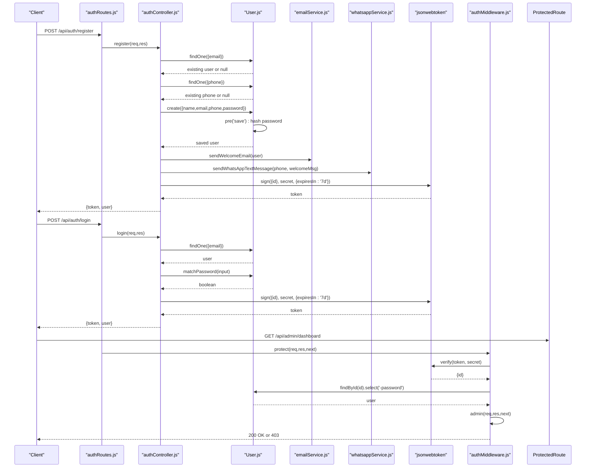
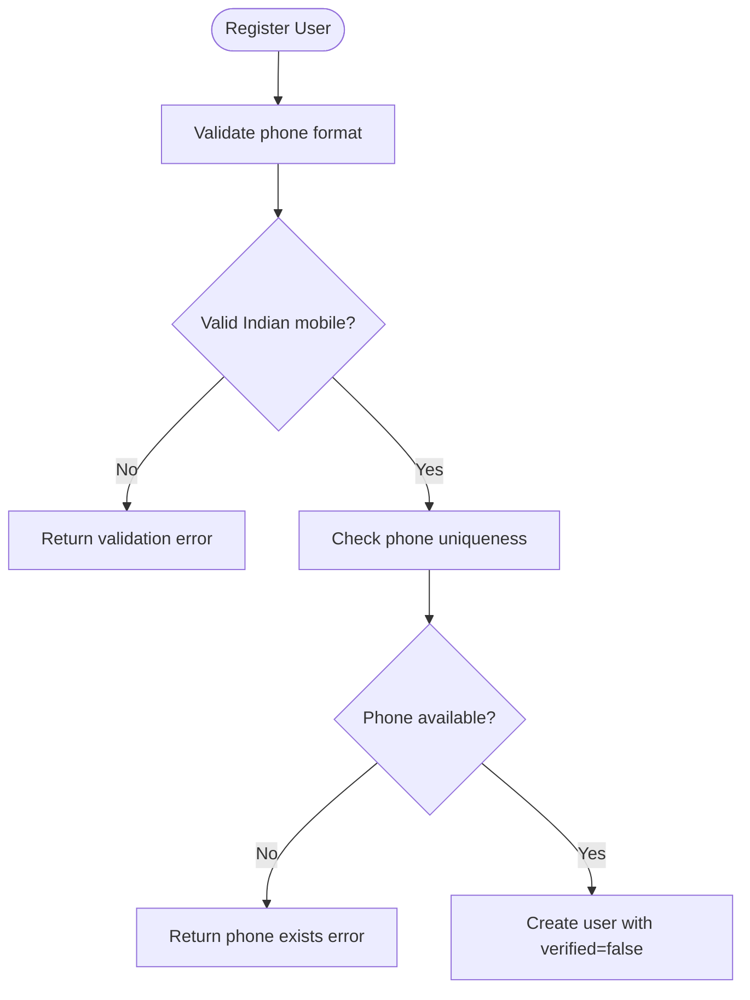
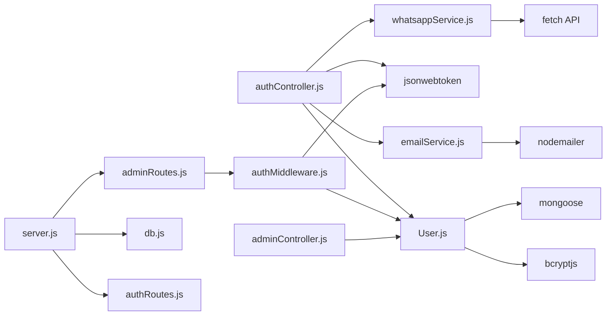

# User Model

<cite>
**Referenced Files in This Document**
- [User.js](file://backend/models/User.js)
- [authController.js](file://backend/controllers/authController.js)
- [authMiddleware.js](file://backend/middleware/authMiddleware.js)
- [authRoutes.js](file://backend/routes/authRoutes.js)
- [adminRoutes.js](file://backend/routes/adminRoutes.js)
- [adminController.js](file://backend/controllers/adminController.js)
- [emailService.js](file://backend/utils/emailService.js)
- [whatsappService.js](file://backend/utils/whatsappService.js)
- [db.js](file://backend/config/db.js)
- [server.js](file://backend/server.js)
- [package.json](file://backend/package.json)
</cite>

## Update Summary
**Changes Made**
- Updated User model schema to include phone number validation with Indian mobile format
- Enhanced email validation with comprehensive regex patterns
- Added verification status fields (isEmailVerified, isPhoneVerified) with default false values
- Updated authentication flow to handle phone number validation during registration
- Enhanced user creation process to support phone-based communication services

## Table of Contents
1. [Introduction](#introduction)
2. [Project Structure](#project-structure)
3. [Core Components](#core-components)
4. [Architecture Overview](#architecture-overview)
5. [Detailed Component Analysis](#detailed-component-analysis)
6. [Dependency Analysis](#dependency-analysis)
7. [Performance Considerations](#performance-considerations)
8. [Troubleshooting Guide](#troubleshooting-guide)
9. [Conclusion](#conclusion)

## Introduction
This document provides comprehensive data model documentation for the User model used in the authentication and authorization subsystem. It covers the schema definition, validation rules, password hashing with bcryptjs, authentication flow, role-based access control (RBAC), and security considerations. The model now includes enhanced phone number validation for Indian mobile numbers, comprehensive email validation patterns, and verification status tracking for both email and phone numbers.

## Project Structure
The User model and related authentication components are organized as follows:
- Model: defines the Mongoose schema, validation, hashing, and helper methods
- Controllers: handle registration and login requests, issue JWT tokens, and manage user sessions
- Middleware: enforce protected routes and admin-only access
- Routes: expose endpoints for authentication
- Config: initialize database connection and environment variables
- Server: configure Express app, CORS, routes, and error handling
- Utilities: email and WhatsApp services for user notifications

```mermaid
graph TB
subgraph "Config"
DB["db.js"]
end
subgraph "Models"
UserModel["User.js"]
end
subgraph "Controllers"
AuthCtrl["authController.js"]
AdminCtrl["adminController.js"]
end
subgraph "Middleware"
AuthMW["authMiddleware.js"]
end
subgraph "Routes"
AuthRoutes["authRoutes.js"]
AdminRoutes["adminRoutes.js"]
end
subgraph "Utilities"
EmailSvc["emailService.js"]
WhatsAppSvc["whatsappService.js"]
end
subgraph "Server"
Server["server.js"]
end
DB --> UserModel
UserModel --> AuthCtrl
AuthCtrl --> AuthMW
AuthMW --> AdminRoutes
AdminRoutes --> AdminCtrl
AuthRoutes --> AuthCtrl
EmailSvc --> AuthCtrl
WhatsAppSvc --> AuthCtrl
Server --> DB
Server --> AuthRoutes
Server --> AdminRoutes
```

**Diagram sources**
- [db.js:1-14](file://backend/config/db.js#L1-L14)
- [User.js:1-35](file://backend/models/User.js#L1-L35)
- [authController.js:1-60](file://backend/controllers/authController.js#L1-L60)
- [authMiddleware.js:1-20](file://backend/middleware/authMiddleware.js#L1-L20)
- [authRoutes.js:1-9](file://backend/routes/authRoutes.js#L1-L9)
- [adminRoutes.js:1-19](file://backend/routes/adminRoutes.js#L1-L19)
- [adminController.js:1-86](file://backend/controllers/adminController.js#L1-L86)
- [emailService.js:1-149](file://backend/utils/emailService.js#L1-L149)
- [whatsappService.js:1-127](file://backend/utils/whatsappService.js#L1-L127)
- [server.js:1-102](file://backend/server.js#L1-L102)

**Section sources**
- [server.js:57-63](file://backend/server.js#L57-L63)
- [db.js:5-13](file://backend/config/db.js#L5-L13)

## Core Components
- User model schema with fields: name, email, phone, password, role, isEmailVerified, isPhoneVerified
- Enhanced validation rules: required fields, unique email and phone, comprehensive regex patterns, enum role values
- Phone number validation for Indian mobile numbers (10 digits, starting with 6-9)
- Comprehensive email validation with regex pattern
- Password hashing via bcryptjs in a pre-save hook
- Authentication helper method to compare passwords
- Verification status tracking for email and phone
- Timestamps enabled on the model
- JWT-based authentication and RBAC enforcement

Key implementation references:
- Schema and validations: [User.js:4-24](file://backend/models/User.js#L4-L24)
- Pre-save password hashing: [User.js:26-29](file://backend/models/User.js#L26-L29)
- Password comparison method: [User.js:31-33](file://backend/models/User.js#L31-L33)
- Timestamps: [User.js:24](file://backend/models/User.js#L24)

**Section sources**
- [User.js:4-33](file://backend/models/User.js#L4-L33)

## Architecture Overview
The authentication flow spans the route handlers, controller logic, model hooks, and middleware. The following sequence diagram maps the end-to-end user registration and login process, including the new phone number validation and verification status tracking.



**Diagram sources**
- [authRoutes.js:6-7](file://backend/routes/authRoutes.js#L6-L7)
- [authController.js:8-36](file://backend/controllers/authController.js#L8-L36)
- [User.js:26-33](file://backend/models/User.js#L26-L33)
- [emailService.js:111-148](file://backend/utils/emailService.js#L111-L148)
- [whatsappService.js:87-126](file://backend/utils/whatsappService.js#L87-L126)
- [authMiddleware.js:4-15](file://backend/middleware/authMiddleware.js#L4-L15)
- [adminRoutes.js:10](file://backend/routes/adminRoutes.js#L10)

## Detailed Component Analysis

### User Model Schema and Enhanced Validation
- Fields and types:
  - name: String, required
  - email: String, required, unique, lowercase, trimmed, validated with comprehensive regex pattern
  - phone: String, required, unique, validated with Indian mobile number format (10 digits, 6-9)
  - password: String, required
  - role: String, enum ['user','admin'], default 'user'
  - isEmailVerified: Boolean, default false
  - isPhoneVerified: Boolean, default false
- Enhanced validation constraints:
  - Required fields enforced at schema level
  - Unique constraint on email and phone to prevent duplicates
  - Comprehensive regex pattern ensures valid email format
  - Indian mobile number validation ensures proper 10-digit format
  - Enum constraint ensures role is either 'user' or 'admin'
  - Default verification status set to false for new users
- Timestamps:
  - Automatic createdAt and updatedAt fields managed by Mongoose

Security and correctness considerations:
- Unique email and phone prevent account takeover via duplicate accounts
- Comprehensive email validation reduces spam and invalid addresses
- Indian mobile number validation ensures proper phone format for SMS/WA notifications
- Default verification status requires explicit verification steps
- Enum role restricts unauthorized elevation
- Pre-save hook ensures plaintext passwords are never persisted

**Section sources**
- [User.js:4-24](file://backend/models/User.js#L4-L24)

### Phone Number Validation for Indian Mobile Numbers
- Validation pattern: `/^[6-9]\d{9}$/`
- Ensures exactly 10 digits
- First digit must be 6, 7, 8, or 9 (valid Indian mobile prefixes)
- Unique constraint prevents duplicate phone numbers
- Used for WhatsApp notifications and order confirmations

Operational flow:


**Diagram sources**
- [User.js:14-19](file://backend/models/User.js#L14-L19)
- [authController.js:12-17](file://backend/controllers/authController.js#L12-L17)

**Section sources**
- [User.js:14-19](file://backend/models/User.js#L14-L19)
- [authController.js:12-17](file://backend/controllers/authController.js#L12-L17)

### Enhanced Email Validation with Comprehensive Regex Patterns
- Validation pattern: `/^[\w-\.]+@([\w-]+\.)+[\w-]{2,4}$/g`
- Allows alphanumeric characters, underscores, hyphens, dots
- Supports subdomains and various top-level domains
- Ensures proper email structure with @ symbol and domain
- Lowercase conversion and trimming for consistency
- Unique constraint prevents duplicate email addresses

Validation coverage includes:
- Local part (before @): alphanumeric, underscore, hyphen, dot
- Domain part: alphanumeric, hyphen, dot
- Top-level domain: 2-4 characters
- Proper separation with @ symbol

**Section sources**
- [User.js:6-13](file://backend/models/User.js#L6-L13)

### Verification Status Tracking System
- isEmailVerified: Boolean flag indicating email verification status
- isPhoneVerified: Boolean flag indicating phone verification status
- Both default to false for new users
- Verification status can be used for access control and feature gating
- Supports progressive feature enablement based on verification levels

**Section sources**
- [User.js:22-23](file://backend/models/User.js#L22-L23)

### Password Hashing with bcryptjs
- Pre-save middleware:
  - Triggers only when the password field is modified
  - Hashes the password with a salt round of 10
  - Replaces the plaintext password with the hashed value
- Authentication helper:
  - Compares an entered password against the stored hash
  - Returns a boolean indicating match

Operational flow:


**Diagram sources**
- [User.js:26-29](file://backend/models/User.js#L26-L29)

**Section sources**
- [User.js:26-33](file://backend/models/User.js#L26-L33)

### Role-Based Access Control (RBAC)
- Roles:
  - user: default role for regular users
  - admin: administrative role for privileged access
- Middleware enforcement:
  - protect: verifies JWT and attaches user (without password) to request
  - admin: checks that the attached user has role 'admin'

Usage pattern:
- Wrap admin routes with protect followed by admin
- Access control occurs in middleware, not route handlers

**Section sources**
- [User.js:21](file://backend/models/User.js#L21)
- [authMiddleware.js:17-20](file://backend/middleware/authMiddleware.js#L17-L20)
- [adminRoutes.js:10](file://backend/routes/adminRoutes.js#L10)

### Authentication Flow and Token Management
- Registration:
  - Validates absence of existing email and phone
  - Creates user record with default verification status false
  - Issues JWT with expiration of seven days
  - Sends welcome email and WhatsApp notification
- Login:
  - Finds user by email
  - Verifies password using matchPassword
  - Issues JWT upon successful authentication
- Token verification:
  - Authorization header expected as Bearer token
  - Decodes JWT and loads user excluding password
  - Enforces admin-only access when required

Endpoints:
- POST /api/auth/register
- POST /api/auth/login

**Section sources**
- [authController.js:8-36](file://backend/controllers/authController.js#L8-L36)
- [authRoutes.js:6-7](file://backend/routes/authRoutes.js#L6-L7)
- [authMiddleware.js:4-15](file://backend/middleware/authMiddleware.js#L4-L15)

### Timestamp Functionality
- Enabled via Mongoose timestamps option
- Provides automatic createdAt and updatedAt fields
- Useful for audit trails, sorting, and user activity tracking

**Section sources**
- [User.js:24](file://backend/models/User.js#L24)

### Practical Examples

- User creation (registration):
  - Endpoint: POST /api/auth/register
  - Request body includes name, email, phone, password
  - Response includes token and user profile (excluding sensitive fields)
  - Reference: [authController.js:8-36](file://backend/controllers/authController.js#L8-L36), [authRoutes.js:6](file://backend/routes/authRoutes.js#L6)

- Authentication (login):
  - Endpoint: POST /api/auth/login
  - Request body includes email and password
  - Response includes token and user profile
  - Reference: [authController.js:38-60](file://backend/controllers/authController.js#L38-L60), [authRoutes.js:7](file://backend/routes/authRoutes.js#L7)

- Role checking:
  - Admin-only routes are protected by protect and admin middleware
  - Example: GET /api/admin/dashboard
  - Reference: [adminRoutes.js:10](file://backend/routes/adminRoutes.js#L10), [authMiddleware.js:17-20](file://backend/middleware/authMiddleware.js#L17-L20)

- Admin dashboard data:
  - Aggregates counts and revenue for admin metrics
  - Reference: [adminController.js:5-14](file://backend/controllers/adminController.js#L5-L14)

- Phone-based notifications:
  - Welcome WhatsApp messages sent to Indian mobile numbers
  - Reference: [authController.js:22-27](file://backend/controllers/authController.js#L22-L27), [whatsappService.js:87-126](file://backend/utils/whatsappService.js#L87-L126)

## Dependency Analysis
External libraries and their roles:
- bcryptjs: password hashing and comparison
- jsonwebtoken: JWT signing and verification
- mongoose: ODM schema, middleware, and timestamps
- dotenv: environment configuration loading
- nodemailer: email service for user notifications
- WhatsApp Business Cloud API: phone-based communication



**Diagram sources**
- [User.js:1-2](file://backend/models/User.js#L1-L2)
- [authController.js:1-5](file://backend/controllers/authController.js#L1-L5)
- [authMiddleware.js:1](file://backend/middleware/authMiddleware.js#L1)
- [adminRoutes.js:3](file://backend/routes/adminRoutes.js#L3)
- [adminController.js:1](file://backend/controllers/adminController.js#L1)
- [server.js:6](file://backend/server.js#L6)
- [db.js:1](file://backend/config/db.js#L1)
- [emailService.js:1](file://backend/utils/emailService.js#L1)
- [whatsappService.js:1](file://backend/utils/whatsappService.js#L1)

**Section sources**
- [package.json:8-22](file://backend/package.json#L8-L22)

## Performance Considerations
- Password hashing cost: bcryptjs uses a fixed salt round of 10 in the current implementation. Adjusting rounds increases security but also CPU usage during registration/login.
- Phone number validation: Regex validation adds minimal overhead but ensures data quality for SMS/WhatsApp notifications.
- Email validation: Comprehensive regex pattern provides good validation with minimal performance impact.
- Middleware overhead: JWT verification and user lookup occur on every protected route; ensure efficient database indexing on email, phone, and ID fields.
- Token expiration: Shorter-lived tokens reduce risk but increase re-authentication frequency.
- Verification status tracking: Additional boolean fields add negligible storage overhead but enable powerful feature gating capabilities.

## Troubleshooting Guide
Common issues and resolutions:
- Email already exists during registration:
  - Cause: Duplicate email detected by unique constraint
  - Resolution: Use a different email address
  - Reference: [authController.js:12-14](file://backend/controllers/authController.js#L12-L14)

- Phone number already exists during registration:
  - Cause: Duplicate phone number detected by unique constraint
  - Resolution: Use a different phone number
  - Reference: [authController.js:15-17](file://backend/controllers/authController.js#L15-L17)

- Invalid phone number format:
  - Cause: Phone number doesn't match Indian mobile pattern (10 digits, starts with 6-9)
  - Resolution: Enter a valid 10-digit Indian mobile number
  - Reference: [User.js:14-19](file://backend/models/User.js#L14-L19)

- Invalid email format:
  - Cause: Email doesn't match comprehensive regex pattern
  - Resolution: Enter a valid email address format
  - Reference: [User.js:6-13](file://backend/models/User.js#L6-L13)

- Invalid credentials on login:
  - Cause: Email not found or password mismatch
  - Resolution: Verify email and password; ensure bcrypt hashing is functioning
  - Reference: [authController.js:40-44](file://backend/controllers/authController.js#L40-L44), [User.js:31-33](file://backend/models/User.js#L31-L33)

- Not authorized (missing or invalid token):
  - Cause: Missing Authorization header or invalid/expired token
  - Resolution: Include a valid Bearer token; ensure JWT_SECRET is configured
  - Reference: [authMiddleware.js:5-6](file://backend/middleware/authMiddleware.js#L5-L6), [authMiddleware.js:12-14](file://backend/middleware/authMiddleware.js#L12-L14)

- Access denied (not admin):
  - Cause: Non-admin user attempts admin-only endpoint
  - Resolution: Authenticate as an admin user or adjust permissions
  - Reference: [authMiddleware.js:17-20](file://backend/middleware/authMiddleware.js#L17-L20)

- Database connection errors:
  - Cause: MONGO_URI misconfiguration or unreachable database
  - Resolution: Verify environment variables and connectivity
  - Reference: [db.js:5-13](file://backend/config/db.js#L5-L13), [server.js:17-18](file://backend/server.js#L17-L18)

- Email service failures:
  - Cause: Invalid email configuration or service unavailability
  - Resolution: Check EMAIL_USER and EMAIL_PASSWORD environment variables
  - Reference: [emailService.js:7-15](file://backend/utils/emailService.js#L7-L15)

- WhatsApp service failures:
  - Cause: Invalid WhatsApp API configuration or network issues
  - Resolution: Check WHATSAPP_PHONE_NUMBER_ID and WHATSAPP_ACCESS_TOKEN
  - Reference: [whatsappService.js:14-15](file://backend/utils/whatsappService.js#L14-L15)

## Conclusion
The User model now enforces comprehensive validation and security through enhanced phone number validation for Indian mobile numbers, comprehensive email validation patterns, unique constraints on both email and phone, enum-based roles, bcryptjs hashing, and JWT-based authentication. The addition of verification status tracking enables sophisticated feature gating and progressive user engagement. The pre-save middleware guarantees secure password storage, while middleware layers provide robust RBAC for protected routes. The integration with email and WhatsApp services enhances user experience through timely notifications. Following the documented examples and best practices ensures reliable user management, secure access control, and proper validation across the application.