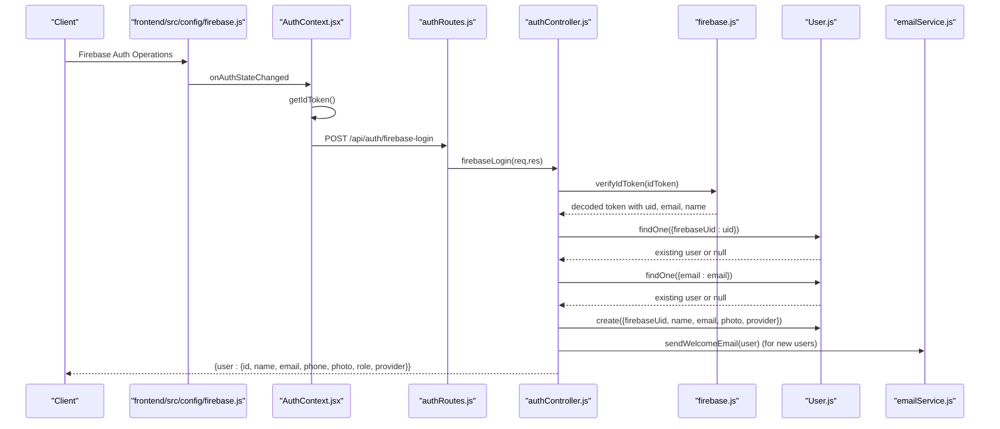
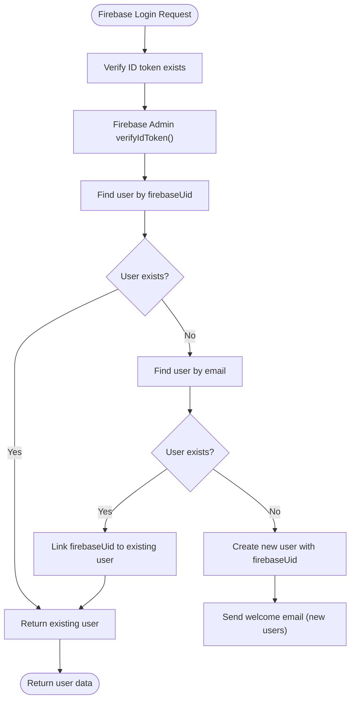
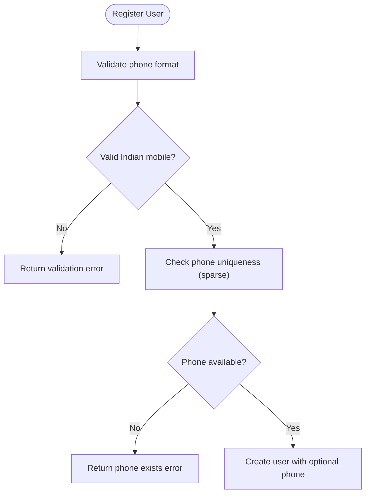
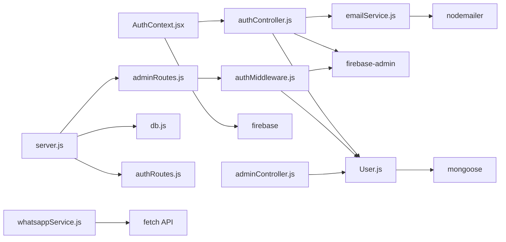

# User Model

<cite>
**Referenced Files in This Document**
- [User.js](file://backend/models/User.js)
- [authController.js](file://backend/controllers/authController.js)
- [authMiddleware.js](file://backend/middleware/authMiddleware.js)
- [authRoutes.js](file://backend/routes/authRoutes.js)
- [adminRoutes.js](file://backend/routes/adminRoutes.js)
- [adminController.js](file://backend/controllers/adminController.js)
- [emailService.js](file://backend/utils/emailService.js)
- [whatsappService.js](file://backend/utils/whatsappService.js)
- [db.js](file://backend/config/db.js)
- [server.js](file://backend/server.js)
- [firebase.js](file://backend/config/firebase.js)
- [AuthContext.jsx](file://frontend/src/context/AuthContext.jsx)
- [firebase.js](file://frontend/src/config/firebase.js)
- [package.json](file://backend/package.json)
</cite>

## Update Summary
**Changes Made**
- Updated User model schema to reflect Firebase Authentication migration: removed password requirements and bcrypt hashing, added Firebase-specific fields including provider type and firebaseUid
- Removed bcryptjs dependency and password hashing mechanism
- Updated authentication flow to use Firebase ID tokens instead of JWT
- Refined phone number validation for Indian mobile numbers with sparse unique constraint
- Added provider tracking for different authentication methods (google, email)
- Updated frontend authentication context to integrate with Firebase SDK

## Table of Contents
1. [Introduction](#introduction)
2. [Project Structure](#project-structure)
3. [Core Components](#core-components)
4. [Architecture Overview](#architecture-overview)
5. [Detailed Component Analysis](#detailed-component-analysis)
6. [Dependency Analysis](#dependency-analysis)
7. [Performance Considerations](#performance-considerations)
8. [Troubleshooting Guide](#troubleshooting-guide)
9. [Conclusion](#conclusion)

## Introduction
This document provides comprehensive data model documentation for the User model used in the Firebase Authentication-based authentication and authorization subsystem. It covers the schema definition, validation rules, Firebase token-based authentication, provider tracking for different authentication methods, role-based access control (RBAC), and security considerations. The model now includes Firebase-specific fields for provider identification and user linking, enhanced phone number validation for Indian mobile numbers, comprehensive email validation patterns, and verification status tracking for both email and phone numbers.

## Project Structure
The User model and related Firebase authentication components are organized as follows:
- Model: defines the Mongoose schema, validation, and Firebase-specific fields
- Controllers: handle Firebase authentication requests and user synchronization
- Middleware: enforce protected routes using Firebase authentication
- Routes: expose endpoints for Firebase authentication
- Config: initialize Firebase Admin SDK and database connection
- Server: configure Express app, CORS, routes, and error handling
- Frontend: React context for Firebase authentication integration
- Utilities: email services for user notifications

```mermaid
graph TB
subgraph "Config"
FirebaseConfig["firebase.js"]
DB["db.js"]
end
subgraph "Models"
UserModel["User.js"]
end
subgraph "Controllers"
AuthCtrl["authController.js"]
AdminCtrl["adminController.js"]
end
subgraph "Middleware"
AuthMW["authMiddleware.js"]
end
subgraph "Routes"
AuthRoutes["authRoutes.js"]
AdminRoutes["adminRoutes.js"]
end
subgraph "Frontend"
AuthContext["AuthContext.jsx"]
FirebaseSDK["firebase.js"]
end
subgraph "Utilities"
EmailSvc["emailService.js"]
WhatsAppSvc["whatsappService.js"]
end
subgraph "Server"
Server["server.js"]
end
FirebaseConfig --> AuthCtrl
DB --> UserModel
UserModel --> AuthCtrl
AuthCtrl --> AuthMW
AuthMW --> AdminRoutes
AdminRoutes --> AdminCtrl
AuthRoutes --> AuthCtrl
AuthContext --> FirebaseSDK
AuthContext --> AuthCtrl
EmailSvc --> AuthCtrl
WhatsAppSvc --> AuthCtrl
Server --> DB
Server --> AuthRoutes
Server --> AdminRoutes
```

**Diagram sources**
- [firebase.js:1-13](file://backend/config/firebase.js#L1-L13)
- [db.js:1-14](file://backend/config/db.js#L1-L14)
- [User.js:1-30](file://backend/models/User.js#L1-L30)
- [authController.js:1-69](file://backend/controllers/authController.js#L1-L69)
- [authMiddleware.js:1-33](file://backend/middleware/authMiddleware.js#L1-L33)
- [authRoutes.js:1-9](file://backend/routes/authRoutes.js#L1-L9)
- [adminRoutes.js:1-19](file://backend/routes/adminRoutes.js#L1-L19)
- [adminController.js:1-86](file://backend/controllers/adminController.js#L1-L86)
- [AuthContext.jsx:1-86](file://frontend/src/context/AuthContext.jsx#L1-L86)
- [firebase.js:1-67](file://frontend/src/config/firebase.js#L1-L67)
- [emailService.js:1-149](file://backend/utils/emailService.js#L1-L149)
- [whatsappService.js:1-127](file://backend/utils/whatsappService.js#L1-L127)
- [server.js:1-102](file://backend/server.js#L1-L102)

**Section sources**
- [server.js:57-63](file://backend/server.js#L57-L63)
- [db.js:5-13](file://backend/config/db.js#L5-L13)

## Core Components
- User model schema with Firebase-specific fields: name, email, phone, photo, role, isEmailVerified, isPhoneVerified, provider, firebaseUid
- Enhanced validation rules: required fields, unique email and phone, comprehensive regex patterns, enum role values, sparse unique constraints for optional fields
- Phone number validation for Indian mobile numbers (10 digits, starting with 6-9) with sparse unique constraint
- Comprehensive email validation with regex pattern
- Provider tracking system supporting 'google' and 'email' authentication methods
- Firebase UID linking for user account consolidation
- Verification status tracking for email and phone
- Timestamps enabled on the model
- Firebase-based authentication and RBAC enforcement

Key implementation references:
- Schema and validations: [User.js:3-27](file://backend/models/User.js#L3-L27)
- Firebase authentication controller: [authController.js:5-68](file://backend/controllers/authController.js#L5-L68)
- Firebase token verification middleware: [authMiddleware.js:4-24](file://backend/middleware/authMiddleware.js#L4-L24)
- Frontend Firebase integration: [AuthContext.jsx:12-29](file://frontend/src/context/AuthContext.jsx#L12-L29)

**Section sources**
- [User.js:3-27](file://backend/models/User.js#L3-L27)
- [authController.js:5-68](file://backend/controllers/authController.js#L5-L68)
- [authMiddleware.js:4-24](file://backend/middleware/authMiddleware.js#L4-L24)
- [AuthContext.jsx:12-29](file://frontend/src/context/AuthContext.jsx#L12-L29)

## Architecture Overview
The authentication flow now uses Firebase Authentication for token-based verification and user synchronization. The following sequence diagram maps the end-to-end Firebase user registration and login process, including provider detection and user linking.



**Diagram sources**
- [AuthContext.jsx:20-21](file://frontend/src/context/AuthContext.jsx#L20-L21)
- [authRoutes.js:6](file://backend/routes/authRoutes.js#L6)
- [authController.js:13-18](file://backend/controllers/authController.js#L13-L18)
- [authController.js:20-44](file://backend/controllers/authController.js#L20-L44)
- [firebase.js:14](file://backend/config/firebase.js#L14)
- [User.js:25-26](file://backend/models/User.js#L25-L26)

## Detailed Component Analysis

### User Model Schema and Firebase Authentication Integration
- Fields and types:
  - name: String, required
  - email: String, required, unique, lowercase, trimmed, validated with comprehensive regex pattern
  - phone: String, required: false, unique, sparse, validated with Indian mobile number format (10 digits, 6-9)
  - password: String, required: false (removed bcrypt hashing requirement)
  - photo: String, default: ''
  - role: String, enum: ['user','admin'], default: 'user'
  - isEmailVerified: Boolean, default: false
  - isPhoneVerified: Boolean, default: false
  - provider: String, enum: ['google','email'], required: true (tracks authentication method)
  - firebaseUid: String, unique, sparse (Firebase user identifier)
- Enhanced validation constraints:
  - Required fields enforced at schema level
  - Unique constraint on email and phone to prevent duplicates
  - Sparse unique constraint on phone and firebaseUid allows null values
  - Comprehensive regex pattern ensures valid email format
  - Indian mobile number validation ensures proper 10-digit format
  - Enum constraint ensures provider is either 'google' or 'email'
  - Default verification status set to false for new users
  - No password hashing requirement (Firebase handles authentication)
- Timestamps:
  - Automatic createdAt and updatedAt fields managed by Mongoose

Security and correctness considerations:
- Unique email and phone prevent account takeover via duplicate accounts
- Sparse constraints allow flexible user profiles (some users may not have phones)
- Comprehensive email validation reduces spam and invalid addresses
- Indian mobile number validation ensures proper phone format for SMS/WA notifications
- Default verification status requires explicit verification steps
- Enum provider restricts unauthorized authentication method spoofing
- Firebase UID linking enables seamless user account consolidation across providers

**Section sources**
- [User.js:3-27](file://backend/models/User.js#L3-L27)

### Firebase Authentication Controller Implementation
- Token verification: Uses Firebase Admin SDK to verify ID tokens
- Provider detection: Determines authentication method from Firebase token claims
- User synchronization: Creates or updates user records based on Firebase UID
- Account linking: Links Firebase UID to existing users with matching emails
- New user detection: Identifies first-time Firebase users for welcome email
- Profile population: Extracts user data (uid, email, name, picture) from Firebase token

Operational flow:


**Diagram sources**
- [authController.js:5-68](file://backend/controllers/authController.js#L5-L68)
- [firebase.js:14](file://backend/config/firebase.js#L14)

**Section sources**
- [authController.js:5-68](file://backend/controllers/authController.js#L5-L68)
- [firebase.js:14](file://backend/config/firebase.js#L14)

### Frontend Firebase Authentication Integration
- Real-time auth state monitoring: Listens for Firebase auth state changes
- Token synchronization: Retrieves Firebase ID tokens for backend verification
- User profile sync: Calls backend endpoint to synchronize user data
- Provider flexibility: Supports both email/password and Google authentication
- Local caching: Persists user data in localStorage for session continuity
- Error handling: Comprehensive error handling for authentication failures

Integration pattern:
- onAuthStateChanged triggers user synchronization
- getIdToken retrieves Firebase ID token
- Backend verifies token and returns user profile
- Frontend caches user data locally

**Section sources**
- [AuthContext.jsx:12-29](file://frontend/src/context/AuthContext.jsx#L12-L29)
- [AuthContext.jsx:50-66](file://frontend/src/context/AuthContext.jsx#L50-L66)

### Phone Number Validation for Indian Mobile Numbers
- Validation pattern: `/^[6-9]\d{9}$/`
- Ensures exactly 10 digits
- First digit must be 6, 7, 8, or 9 (valid Indian mobile prefixes)
- Sparse unique constraint prevents duplicate phone numbers while allowing null values
- Used for WhatsApp notifications and order confirmations

Operational flow:


**Diagram sources**
- [User.js:13-19](file://backend/models/User.js#L13-L19)

**Section sources**
- [User.js:13-19](file://backend/models/User.js#L13-L19)

### Enhanced Email Validation with Comprehensive Regex Patterns
- Validation pattern: `/^[\w-\.]+@([\w-]+\.)+[\w-]{2,4}$/g`
- Allows alphanumeric characters, underscores, hyphens, dots
- Supports subdomains and various top-level domains
- Ensures proper email structure with @ symbol and domain
- Lowercase conversion and trimming for consistency
- Unique constraint prevents duplicate email addresses

Validation coverage includes:
- Local part (before @): alphanumeric, underscore, hyphen, dot
- Domain part: alphanumeric, hyphen, dot
- Top-level domain: 2-4 characters
- Proper separation with @ symbol

**Section sources**
- [User.js:5-12](file://backend/models/User.js#L5-L12)

### Verification Status Tracking System
- isEmailVerified: Boolean flag indicating email verification status
- isPhoneVerified: Boolean flag indicating phone verification status
- Both default to false for new users
- Verification status can be used for access control and feature gating
- Supports progressive feature enablement based on verification levels

**Section sources**
- [User.js:23-24](file://backend/models/User.js#L23-L24)

### Provider Tracking System
- provider: Enum field tracking authentication method ('google' or 'email')
- Required: true to ensure all users have a provider
- Enables authentication method differentiation
- Supports user migration between authentication providers
- Facilitates analytics on authentication preferences

**Section sources**
- [User.js:25](file://backend/models/User.js#L25)

### Firebase UID Management
- firebaseUid: String field for Firebase user identifier
- Unique: true with sparse: true to allow null values
- Enables seamless user account linking across providers
- Supports user consolidation when switching authentication methods
- Required for Firebase authentication integration

**Section sources**
- [User.js:26](file://backend/models/User.js#L26)

### Role-Based Access Control (RBAC)
- Roles:
  - user: default role for regular users
  - admin: administrative role for privileged access
- Middleware enforcement:
  - protect: verifies Firebase ID token and attaches user to request
  - admin: checks that the attached user has role 'admin'

Usage pattern:
- Wrap admin routes with protect followed by admin
- Access control occurs in middleware, not route handlers

**Section sources**
- [User.js:22](file://backend/models/User.js#L22)
- [authMiddleware.js:26-32](file://backend/middleware/authMiddleware.js#L26-L32)
- [adminRoutes.js:10](file://backend/routes/adminRoutes.js#L10)

### Authentication Flow and Token Management
- Firebase Login:
  - Frontend obtains Firebase ID token via onAuthStateChanged
  - Calls backend /api/auth/firebase-login with ID token
  - Backend verifies token with Firebase Admin SDK
  - Synchronizes user data and returns profile
- Token verification:
  - Authorization header expected as Bearer token
  - Decodes Firebase ID token and loads user by firebaseUid
  - Enforces admin-only access when required

Endpoints:
- POST /api/auth/firebase-login

**Section sources**
- [authController.js:5-68](file://backend/controllers/authController.js#L5-L68)
- [authRoutes.js:6](file://backend/routes/authRoutes.js#L6)
- [authMiddleware.js:4-24](file://backend/middleware/authMiddleware.js#L4-L24)

### Timestamp Functionality
- Enabled via Mongoose timestamps option
- Provides automatic createdAt and updatedAt fields
- Useful for audit trails, sorting, and user activity tracking

**Section sources**
- [User.js:27](file://backend/models/User.js#L27)

### Practical Examples

- Firebase user synchronization:
  - Frontend: onAuthStateChanged triggers user sync
  - Backend: verify Firebase ID token and synchronize user
  - Reference: [AuthContext.jsx:12-29](file://frontend/src/context/AuthContext.jsx#L12-L29), [authController.js:5-68](file://backend/controllers/authController.js#L5-L68)

- Authentication (Firebase login):
  - Frontend: signInWithEmail or signInWithGoogle
  - Backend: verify ID token and return user profile
  - Reference: [AuthContext.jsx:50-66](file://frontend/src/context/AuthContext.jsx#L50-L66), [authController.js:5-68](file://backend/controllers/authController.js#L5-L68)

- Role checking:
  - Admin-only routes are protected by protect and admin middleware
  - Example: GET /api/admin/dashboard
  - Reference: [adminRoutes.js:10](file://backend/routes/adminRoutes.js#L10), [authMiddleware.js:26-32](file://backend/middleware/authMiddleware.js#L26-L32)

- Admin dashboard data:
  - Aggregates counts and revenue for admin metrics
  - Reference: [adminController.js:5-14](file://backend/controllers/adminController.js#L5-L14)

- Phone-based notifications:
  - Welcome WhatsApp messages sent to Indian mobile numbers
  - Reference: [authController.js:46-51](file://backend/controllers/authController.js#L46-L51), [whatsappService.js:87-126](file://backend/utils/whatsappService.js#L87-L126)

## Dependency Analysis
External libraries and their roles:
- firebase-admin: Firebase Authentication token verification and user management
- firebase: Frontend Firebase SDK for authentication operations
- mongoose: ODM schema, validation, and timestamps
- dotenv: environment configuration loading for Firebase credentials
- nodemailer: email service for user notifications
- WhatsApp Business Cloud API: phone-based communication



**Diagram sources**
- [User.js:1](file://backend/models/User.js#L1)
- [authController.js:1](file://backend/controllers/authController.js#L1)
- [authMiddleware.js:1](file://backend/middleware/authMiddleware.js#L1)
- [AuthContext.jsx:2](file://frontend/src/context/AuthContext.jsx#L2)
- [adminRoutes.js:1](file://backend/routes/adminRoutes.js#L1)
- [adminController.js:1](file://backend/controllers/adminController.js#L1)
- [server.js:1](file://backend/server.js#L1)
- [db.js:1](file://backend/config/db.js#L1)
- [emailService.js:1](file://backend/utils/emailService.js#L1)
- [whatsappService.js:1](file://backend/utils/whatsappService.js#L1)

**Section sources**
- [package.json:8-22](file://backend/package.json#L8-L22)

## Performance Considerations
- Firebase token verification: Server-side Firebase Admin SDK verification adds minimal overhead but ensures secure authentication
- Phone number validation: Regex validation adds minimal overhead but ensures data quality for SMS/WhatsApp notifications
- Email validation: Comprehensive regex pattern provides good validation with minimal performance impact
- Middleware overhead: Firebase token verification and user lookup occur on every protected route; ensure efficient database indexing on email, firebaseUid, and ID fields
- Provider tracking: Additional enum field adds negligible storage overhead but enables powerful authentication method differentiation
- Verification status tracking: Additional boolean fields add negligible storage overhead but enable sophisticated feature gating capabilities
- Frontend caching: Local storage persistence reduces repeated authentication flows and improves user experience

## Troubleshooting Guide
Common issues and resolutions:
- Firebase ID token required during login:
  - Cause: Missing idToken in request body
  - Resolution: Ensure frontend obtains and sends Firebase ID token
  - Reference: [authController.js:9-11](file://backend/controllers/authController.js#L9-L11)

- Invalid or expired Firebase ID token:
  - Cause: Token verification fails with Firebase Admin SDK
  - Resolution: Re-authenticate user and obtain new ID token
  - Reference: [authController.js:64-67](file://backend/controllers/authController.js#L64-L67), [authMiddleware.js:20-23](file://backend/middleware/authMiddleware.js#L20-L23)

- User not found during token verification:
  - Cause: User record not found by firebaseUid
  - Resolution: Ensure user synchronization completed successfully
  - Reference: [authMiddleware.js:16-18](file://backend/middleware/authMiddleware.js#L16-L18)

- Email already exists during registration:
  - Cause: Duplicate email detected by unique constraint
  - Resolution: Use a different email address
  - Reference: [authController.js:25-27](file://backend/controllers/authController.js#L25-L27)

- Phone number already exists during registration:
  - Cause: Duplicate phone number detected by unique constraint
  - Resolution: Use a different phone number or leave phone field empty
  - Reference: [User.js:16-18](file://backend/models/User.js#L16-L18)

- Invalid phone number format:
  - Cause: Phone number doesn't match Indian mobile pattern (10 digits, starts with 6-9)
  - Resolution: Enter a valid 10-digit Indian mobile number or leave empty
  - Reference: [User.js:17-18](file://backend/models/User.js#L17-L18)

- Invalid email format:
  - Cause: Email doesn't match comprehensive regex pattern
  - Resolution: Enter a valid email address format
  - Reference: [User.js:11](file://backend/models/User.js#L11)

- Access denied (not admin):
  - Cause: Non-admin user attempts admin-only endpoint
  - Resolution: Authenticate as an admin user or adjust permissions
  - Reference: [authMiddleware.js:26-32](file://backend/middleware/authMiddleware.js#L26-L32)

- Firebase configuration errors:
  - Cause: Missing or invalid Firebase environment variables
  - Resolution: Verify FIREBASE_PROJECT_ID, FIREBASE_CLIENT_EMAIL, FIREBASE_PRIVATE_KEY
  - Reference: [firebase.js:4-10](file://backend/config/firebase.js#L4-L10)

- Database connection errors:
  - Cause: MONGO_URI misconfiguration or unreachable database
  - Resolution: Verify environment variables and connectivity
  - Reference: [db.js:5-13](file://backend/config/db.js#L5-L13), [server.js:17-18](file://backend/server.js#L17-L18)

- Email service failures:
  - Cause: Invalid email configuration or service unavailability
  - Resolution: Check EMAIL_USER and EMAIL_PASSWORD environment variables
  - Reference: [emailService.js:7-15](file://backend/utils/emailService.js#L7-L15)

- WhatsApp service failures:
  - Cause: Invalid WhatsApp API configuration or network issues
  - Resolution: Check WHATSAPP_PHONE_NUMBER_ID and WHATSAPP_ACCESS_TOKEN
  - Reference: [whatsappService.js:14-15](file://backend/utils/whatsappService.js#L14-L15)

## Conclusion
The User model now reflects a complete Firebase Authentication migration with comprehensive validation and security through Firebase token-based authentication, provider tracking for different authentication methods, enhanced phone number validation for Indian mobile numbers, comprehensive email validation patterns, unique constraints on both email and phone, enum-based roles, and Firebase UID linking for user account consolidation. The removal of bcryptjs dependency and password hashing requirement simplifies the authentication flow while leveraging Firebase's secure token system. The addition of provider tracking enables sophisticated user management across multiple authentication providers, while middleware layers provide robust RBAC for protected routes. The integration with email and WhatsApp services enhances user experience through timely notifications. Following the documented examples and best practices ensures reliable user management, secure access control, proper validation across the application, and seamless Firebase authentication integration.